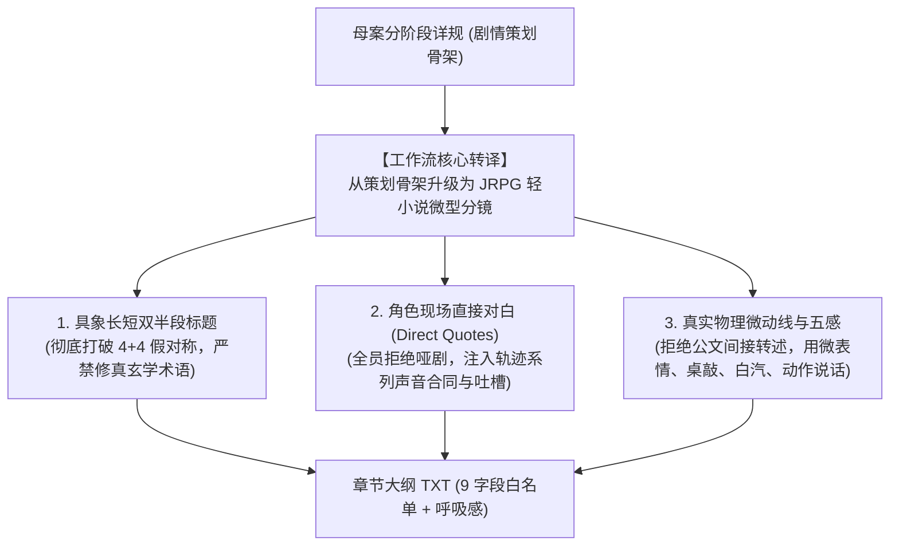

# 第二部章节大纲编写与文风防御工作流 (Story Workflow)

> **适用范围**：`docs2/story/` 目录下所有分幕章节大纲（TXT 文件）的编写、生成与质检审校。  
> **底层执行技能**：**强制且唯一激活专属技能 [`viridia-writer`](../../.agents/skills/viridia-writer/SKILL.md)**（全面把控 JRPG 王道西幻文风、宏篇总控、生活流呼吸感、角色原声合同与文风防御，严禁调用第一部技能）。  
> **真实源对账层级 (SSOT)**：严格执行权威对账链条：  
> $$\textbf{docs2/ 实体卡档案（第一权威基准）} > \textbf{母案方案集群（00 ~ 06）} > \textbf{幕级大纲} > \textbf{分阶段详规}$$  
> **格式与词典基准**：严格遵循 [`_TEMPLATE.TXT`](_TEMPLATE.TXT)、[`_TEMPLATE_RULES.md`](_TEMPLATE_RULES.md)、[`_character_attributes.txt`](_character_attributes.txt)、唯一权威词典 [`lexicon.md`](../../.agents/rules/lexicon.md) 与质检工具 [`story2_tool.py`](../../scripts2/story2_tool.py)、[`scan_viridia_diseases.py`](../../scripts2/scan_viridia_diseases.py)。

---

## 〇、 核心理念转变：从“防守型清单”到“轻小说微型分镜”

过去工作流的最大教训在于**只做负向防守（不准出现古风/武侠），却丢失了正向文学质感**，导致把大纲写成了“全员不说话、全是间接转述”的公文流水账与策划任务清单。

必须彻底树立以下三大正向文学基准：



---

## 一、 章节大纲三大正向质感铁律（严禁违背）

### 1. 标题法则：打破“4+4 假对仗”，回归具象 JRPG 画面
* **结构规范**：严格遵循 `前半段——后半段` 双半段破折号结构；
* **彻底废除 4+4 字数限制**：严禁为了凑齐四个字而生搬硬造。鼓励长短结合、自然舒展的短语；
* **前半段（具象物象/道具/微观环境）**：必须是可被视觉捕捉的具体物件或场景，如 `封闭十四年的水闸`、`焦黑的黄铜徽章`、`雨夜的林间木屋`；
* **后半段（关键行动/抉择/事件转折）**：必须是明确的戏剧动作或转折，如 `独角狮火漆协议`、`平原林道启程`、`断柱下的八叶心眼`；
* **死刑假玄学术语拦截**：严禁在标题中塞入中式修真/仙侠感极重的玄学术语（如 `敕印`、`探阵`、`微澜`、`法印`、`宝印`、`战端`、`气劲`、`剑意` 等）。

### 2. 大纲颗粒度：详略得当，拒绝过度繁杂
* **大纲定位警醒**：**这是章节大纲（Outline），绝非正文逐字描写**！必须做到详略得当；
* **详写重点**：核心戏剧冲突、精彩交锋、人物关键台词、即时微表情与关键动作；
* **略写次要**：过于琐碎的道具参数、微观物理、过度繁复的环境工笔画坚决不加入，避免喧宾夺主，保持大纲骨肉匀称。

### 3. 声音合同与 JRPG 灵魂：嵌入直接对白与吐槽/内心 OS
* **对白覆盖率硬指标**：每个章节的情境列表中，**至少需有 2 ~ 4 条情境嵌入角色的直接现场对白（使用标准的“……”引语）**；
* **必备提醒：穿插可爱有趣的即时吐槽与内心 OS**：
  * JRPG 轻小说拒绝沉闷压抑的正剧脸！必须融入经典的日式轻小说日常感；
  * **善意打趣与吐槽**：同伴间的善意调侃、面对无奈局面的即时吐槽（如乔治对不合规格工具的直白自嘲、菲嚼着干肉的冷幽默、黎恩温和无奈的苦笑打趣）；
  * **生动的内心 OS**：关键节点适度融入角色的内心活动与心底吐槽，打破死板，让角色活过来；
* **角色声线与性格必须 100% 保真（参考 `corpus_trails_jrpg.md`）**：
  * **黎恩**：绝非沉默寡言的面瘫打手！真诚温和、话多爱吐槽、善于以玩笑化解同伴紧张，与菲娜私下有老夫老妻特有的亲密耳语逗弄；
  * **菲娜**：底色娇羞可爱、带狡黠与调皮，心软且极具守护者底气，与黎恩有绝对默契；
  * **雷恩**：沉稳如铁的古典老骑士，面对背叛与十四年冤屈的沙哑低语，晨光誓言的骄傲；
  * **艾德里安**：落魄贵族商人的优雅机锋与灭族血仇的冰冷嘲弄；
  * **乔治**：憨厚工匠的豪爽豁达、实干担当与日常碎碎念；
  * **爱丽榭**：送上热汤与烘焙麦饼的温软关怀；
  * **菲**：猫系敏锐、寡言高效的短促战术报点，嚼着干肉的从容；
  * **劳拉**：凛然正直、重剑如山的剑士风骨。

### 4. 词汇归口与去公文汇报腔（纯净轻小说质感）
* **词汇唯一归口法则**：所有词汇、器物、身体部位、文言虚词副词、仙侠修辞及评书套话的正向映射，**100% 严格且唯一遵循 [`lexicon.md`](../../.agents/rules/lexicon.md)**。严禁在工作流中重复堆砌禁词，违规词汇统一由自动化门禁脚本拦截；
* **消灭会议纪要与概括转述**：叙事中杜绝公文汇报与概括记录（如达成共识、逐项核验等），一律由角色的现场直接对白、即时微动作与现场物理交付物推进；
* **消灭评书套话与旁白说书**：严禁旁白跳出扮演说书人（如话音未落、果不其然等），严格依托镜头视角记录当下物理动态与角色即时感官；
* **彻底根绝四字短语密集连缀（四字病）**：杜绝连续 3 个及以上 4 字短语连缀（如“晨雾未散，大步踏进，沉稳一顿”），强制打破 4 字节律，采用长短自然舒展的现代轻小说句式；
* **严守角色装备与人设常识**：严格对齐 `docs2/` 实体卡（如菲使用双枪剑与枪套钢丝，严禁“收刀入鞘”；雷恩使用朴素重盾与旧长剑；菲娜为 320 岁亲历两百年腐化之唯一守护者）。

### 5. 正向 JRPG 轻小说官方中文句式语法法则 (Positive Syntax Engine)
彻底打破“一味负向打地鼠”的被动局面，建立标准正向转译语法：
* **【短句推进，逗号呼吸】**：拒绝中式长定语复合句。采用现代口语断句，每小句 8 ~ 18 字，像动画分镜般利落切换（如：“黎恩拉好外套拉链，推门走了出去。外面的风有些冷，脚下的碎石路发出沙沙的声响。”）；
* **【大白话物理动词】**：动词必须是物理可捕捉的日常生活与战技动作（用手背擦汗、拉紧背包带、推了推眼镜、拍了拍箱子、屈膝压低重心），坚决不用文言虚动词（步入、阖眸、敛息、流转、虚抚、微蹙、打了个转）；
* **【对话与语气词驱动（Dialogue-Driven）】**：日轻灵魂在于同伴互动与生活流语气词（“……啊”、“呢”、“哦”、“吧”、“……”），穿插善意的调侃、苦笑自嘲与老同学间的碎碎念；
* **【具象物理生活感，消灭玄学通感】**：冷就是“冷风直往领口里钻”，暖就是“壁炉里烧着柴火，屋里暖烘烘的”，累就是“在圆木上坐下揉了揉肩膀”，彻底根绝“清气流转、温润微澜”等玄幻通感。

---

## 二、 四步闭环标准作业流水线 (SOP)


### 步骤 1：穿透对账与“零字复用中间物理事实脱壳”（根因阻断）
* **调取第一权威实体卡**（`docs2/`）：
  - 登场角色外貌、装备、性格声线（`docs2/character/`、`docs2/npc/`、`_character_attributes.txt`）；
  - 物理舞台材质、门禁、声学遮蔽（`docs2/location/`）；
  - 生物构造、弱点（`docs2/creature/`）。
* **母案提纲“零字复用”物理事实脱壳（核心铁律）**：
  - **严禁直接基于母案原句扩写**！母案详规多为四字连缀的粗提纲，直接扩写必然继承中式病灶；
  - **抽取纯 5W1H 物理事实清单**：只记录“时间、物理据点、谁在场、做了什么物理操作、用了什么道具、造成什么物理结果”，**将母案中的一切修饰词、形容词、成语 100% 丢弃**。

### 步骤 2：JRPG 轻小说官方中文句式重写与原声台词
* **拟定具象生动的双半段标题**（长短结合，拒绝对仗套句）；
* **套用 `_TEMPLATE.TXT` 9 字段规范**；
* **每条情境基于事实清单从零书写（JRPG 微型分镜模板）**：
  - 视线与空间切入（长短句交错，坚决打破 4 字节拍）；
  - 真实物理动作（重心微沉、反手甩出钢丝、太刀贴水滑过、重盾卡位）；
  - **嵌入现场直接台词与生动标点**：
    - 调侃用 `？`；
    - 菲娜娇嗔、撒娇用 `~`；
    - 菲的猫系短促断言、雷恩的沉厚提醒用 `。`；
    - 艾玛知性温和口癖；
* **末条纯物象余韵收束**：第 N 条以具体的客观环境物象（树梢沙沙声/车辙/水珠滑落/水渍蒸发）收束全章，禁止破折号，禁止元评价。

### 步骤 3：本地自动化门禁双重校验（交付前必跑，Exit Code 必须为 0）
在向用户呈现内容或落库前，必须在终端执行双重校验并确保退出码均为 `0`：
```powershell
# 1. 校验 Schema、主要人物、标题假玄学、对白覆盖率与公文汇报腔
python scripts2/story2_tool.py lint --file "docs2/story/第X幕/{ID}：{名称}.TXT"

# 2. 扫描文风纯度（严防古风、中式度量衡、评书套话、四字连缀律动与角色装备冲突）
python scripts2/scan_viridia_diseases.py --file "docs2/story/第X幕/{ID}：{名称}.TXT"
```
* **拦截标准**：
  * 若脚本报出 `【四字连缀话本病灶】`，必须立即重构为长短交错的现代轻小说长句；
  * 若脚本报出 `【评书话本套话】`（如“话音未落”等），立即彻底清除；
  * 若脚本报出 `【角色武器常识违规】`（如菲用刀），立即修正为双枪剑/枪套；
  * 若脚本报出 `【公文通报腔违规】`，必须将概括汇报句重构为直接台词与微动作；
  * 若脚本报出 `【严重文风失准：全员哑剧】`，必须重构补充现场直接对白。

### 步骤 4：纯净交付与落库
* 直接呈现符合标准的纯净大纲文本；
* 汇报门禁验证通过状态（文风雷达 0 违规，对白覆盖与 Schema 完全合规）；
* 禁止在交付文本中夹带任何负向元标签或辩解。

---

## 三、 反面教材与正向重构对比表

| 维度 | ❌ 严禁的反面写法（公文流水账/哑剧） | ✅ 正向 JRPG 轻小说分镜规范 |
| :--- | :--- | :--- |
| **标题拟定** | 机械 4+4 凑字、仙侠玄学：<br>`暗廊断闸——裂隙敕印`<br>`虚空微澜——心眼探阵` | 自然长短结合、具象 JRPG 画面：<br>`废弃的边境前哨站——独角狮火漆协议`<br>`紫雾的异动——太古断柱下的八叶心眼` |
| **角色交涉** | 全员哑巴、公文间接转述：<br>“马奇亚斯将文件推到桌上，两人逐项核对保密级别与频段，明确敲定两界互不公开坐标原则。” | 现场直接对话、微表情与物理动作：<br>“马奇亚斯将协议推到长桌中央，推了推眼镜：‘保密级别定在最高级。无论帝国局势还是你们那边的变故，裂隙的坐标绝不能被任何第三方知道。’黎恩在协议末尾签下名字，抬头微笑道：‘放心吧，这也是我们共同的底线。’” |
| **身世与揭秘** | 会议纪要概括转述：<br>“艾德里安拿出徽章放在桌上，平静说出十九年前城堡覆灭并非工坊失火自毁与流寇洗劫，而是教廷实验外泄……” | 压抑情绪、触感与现场原声：<br>“艾德里安将一枚黄铜徽章按在桌面上，眼里泛起冷意：‘十九年前，官方通报说艾斯特雷亚堡是因为工坊失火自毁。可火还没熄灭，异端审问厅的马车就已经停在焦黑的废墟前，把家族所有的实验原卷全运走了。’黎恩按住腰间的太刀刀鞘，轻声接话：‘……不是意外，是从一开始就设计好的灭口吗？’” |
| **整备与后勤** | 任务清单罗列：<br>“亚莉莎用厚铅箔包裹设备，爱丽榭备妥解毒囊与干肉块，乔治加装遮蔽盒，全员上车出发。” | 伙伴间的互动调侃与温度：<br>“乔治抹了一把额头上的机油，拍了拍篷车厚实的遮蔽盒，笑着说：‘放心吧！里面加了双层铅箔，就算外面的感应水晶贴在车上，也测不出半点导力波动。’爱丽榭将一篮烤得金黄的黑麦硬饼递进车窗，温柔地叮嘱：‘哥哥，路上请千万小心。大家都在等你们平安回来。’” |

---

## 四、 终端质检命令速查

```powershell
# 1. 校验单个章节（对白覆盖率 + 公文汇报腔 + 标题玄学 + Schema）
python scripts2/story2_tool.py lint --file "docs2/story/第一幕/003：废弃的边境前哨站——独角狮火漆协议.TXT"

# 2. 扫描单个章节文风纯度（古风/度量衡/军官等）
python scripts2/scan_viridia_diseases.py --file "docs2/story/第一幕/003：废弃的边境前哨站——独角狮火漆协议.TXT"

# 3. 全局一致性交叉检查
python scripts2/check_viridia_consistency.py
```
