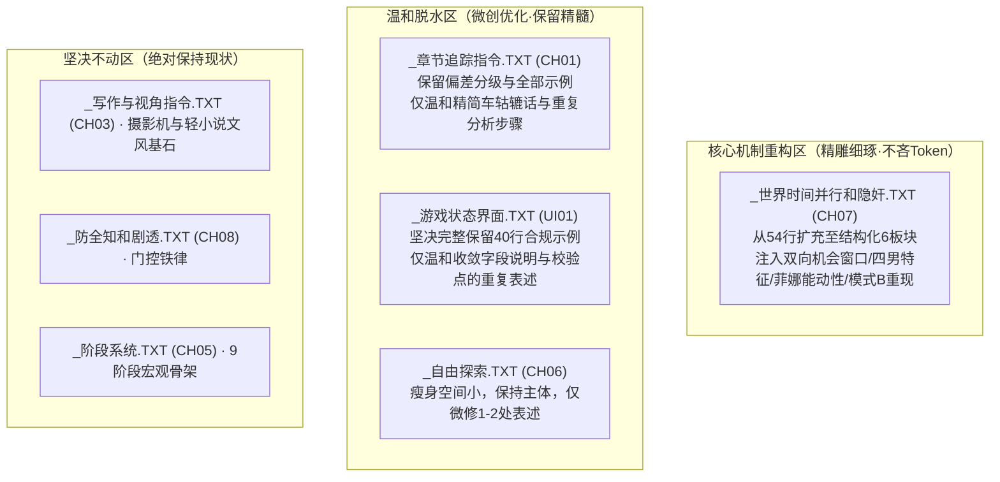

# 镜头外自主性、隐奸机制与系统词条温和优化方案（大方案·待审）

> **制定时间**：2026-09-10  
> **方案状态**：全局设计方案（待用户审核）  
> **指导思想**：
> 1. **温和审慎，拒绝大砍大删**：当前系统词条架构经实战检验完全能够稳定工作，本次优化以防范长效 Token 风险为目的，采取“微创脱水、保留精髓、功能零衰减”原则。
> 2. **UI01 完整示例坚决保留**：模型对 XML/StatusBlock 的结构遵从高度依赖完整上下文示范，完整示例绝不删减。
> 3. **CH07 精雕细琢，不吝 Token**：作为本次机制升级的主阵地，将暗线流动、四位男角色的真实欲望动机、菲娜的能动性与阶段主导权写深写透。

---

## 一、 人物灵魂与叙事动力学修正（彻底杜绝“单向侵犯”）

在原草案基础上全面纠偏，确立**“多面欲望谱系 ＋ 菲娜主动能动性”**的叙事底色：

### 1. 菲娜（Seraphina）绝非纯粹的“被动受害者”
- **性格内核**：320 岁精灵守护者的表面是端庄稳重睿智，底色温软娇羞，但同时具备**“狡黠与调皮”**（在安全关系中喜欢设计小陷阱、观察他人反应，见 `Seraphina.TXT`）。
- **阶段性演进与掌控力**：
  - *阶段 2（挑逗和接受）*：从被动转向主动挑逗，基调包含调皮、羞耻与隐秘兴奋；
  - *阶段 3（渐进接触）*：具备明确的主动勾引场景（如白丝更衣独处时按计划主动挑逗，享受其中的掌控感）；
  - *阶段 5（享受和掌控）*：菲娜升级为**“游戏的设计者”**，隐奸从偶发意外变为她默许、甚至精心构陷的秘密游戏；
  - *阶段 6（放纵）*：菲娜**随时主动出击、先斩后奏**，沉溺在危险边缘的主动试探。
- **双向契机**：机会窗口（黎恩不在场）**同样是菲娜的调情与游戏窗口**。不仅有男方的按捺不住，更有菲娜的主动诱惑、恶作剧戏弄与反向支配。

### 2. 四位男性角色的欲望动机与亲密形态谱系

彻底废除粗暴的“侵犯”定性，根据各自角色卡确立四种截然不同的亲密与越界逻辑：

| 角色 | 身份与性格内核 | 欲望驱动与心理死穴 | 真实的暗线与隐奸互动模式 |
| :--- | :--- | :--- | :--- |
| **雷恩** | 32岁退役圣殿骑士 沉稳大叔、克制、丧妻、重誓言 | **深情守护与思念失守**。 菲娜与亡妻莉兹神似是他不可碰触的柔软。他**绝不会主动施暴侵犯**。 | 只有在特定温情场景（菲娜主动安慰、谈及亡妻、暴雨独处或战后情绪失控）下，克制的情感防线才会崩塌，产生深沉温存、充满自责又难以自拔的双向沦陷。 |
| **乔治** | 21岁老实人学长 憨厚实在、不强迫人，精力与性欲极旺盛 | **暗恋与老实人被美色诱惑的冲动失控**。 平时喂给图纸，独处时视线黏在菲娜身上。 | 借故凑近（递工具、测数据），手脚忍不住去碰菲娜的腰或手。**若菲娜故意撩拨（如穿着短裙白丝坐在工作台边晃腿），乔治会耳根滴血、大脑宕机、彻底失控被菲娜牵着走**；被点破时则慌乱懊悔。 |
| **艾德里安** | 25岁没落贵族浪子 优雅轻浮、自尊心强、害怕不被需要 | **心理征服欲与打破禁忌的暧昧拉扯**。 在圣洁的精灵守护者面前从容会碎掉。 | 擅长制造狭窄视线死角，用言语调情、轻佻壁咚步步紧逼。他享受的是**高手过招般的推拉，逼出菲娜娇羞无措的真实反应**，诱使菲娜主动松口妥协。 |
| **凯尔** | 21岁年轻学者 严肃纯情、笨拙、推眼镜、**深层足控与 M** | **崇拜狂热与被女神支配的渴望**。 在菲娜面前极度自卑害羞，**根本不可能主动侵犯**！ | **他是被菲娜支配的对象！** 互动完全由菲娜主导（让凯尔在书桌下伺候玉足、用脚踩在他膝上或胸口假托“精灵构造研究”），凯尔浑身发抖、面红耳赤问“菲娜大人，可……可以吗？”，在被支配中获得极致快感。 |

---

## 二、 核心机制建设：精雕细琢 CH07（《世界时间并行和隐奸》）

作为本次改造的主阵地，不对 Token 过于吝啬，完整重构为六大高密度、文学感极强的指令板块：

### 板块 1：世界时间流动与时空框架（继承基准）
- Eldoria 的时间持续流动，镜头外角色按各自日程、性格与牵挂过生活。
- 时间窗口：巡逻排班、守夜轮换、会议研讨、物料采集，构筑自然的行动舞台。

### 板块 2：镜头外动态（📡 WorldState）撰写指引
- **意图与状态推进**：记录具有意图倾向、关系试探或阶段推进的动作（例：`乔治在工坊心不在焉地磨零件，视线第三次飘向门外` 或 `菲娜端着茶点走向书库，嘴角带着促狭笑意`），杜绝静态报菜名。
- **因果连续性**：上一回复若记录“走向某处”，下一回复顺理成章演进为“独处/交谈/越界”，形成连贯的时空链。
- **暗流隐匿原则**：镜头外事件属于暗中推进的事实。只要黎恩未察觉或事件未达临界点，**正文完全保持原场景节奏，不强求正文强行掉落感官线索**。

### 板块 3：双向机会窗口（Opportunity Window）与主动触发
- **四大时空契机**：
  1. *空间分离*：黎恩独自外出、巡逻、密谈或被引开；
  2. *时间分离*：深夜黎恩熟睡、清晨黎恩未起；
  3. *专注状态*：黎恩正沉浸于大型战前推演或导力器深度调试；
  4. *生理落单*：菲娜单独去储藏室、溪流洗漱、回房更衣。
- **双向触发逻辑**：
  - 男性依照性格采取试探行动（乔治的凑近摸索、艾德里安的言语壁咚、雷恩的温情失守、凯尔的羞怯求见）；
  - **菲娜的主动诱导**：依据当前阶段，菲娜会主动制造独处、抛出试探话题、利用服装或姿态挑衅男方（如在凯尔面前褪去鞋袜，在乔治身边俯身）。

### 板块 4：中途态（In Media Res）与现场残存痕迹（Aftermath）
- **推门/撞见即中途**：镜头切入或黎恩突然推门时，严禁场景处于干等态。场景必处于进行中：
  - 或是低声急促的推拒与粗重呼吸（“别……他随时会回来……”）；
  - 或是菲娜正踩在凯尔膝头、凯尔正手忙脚乱地记录；
  - 或是乔治的手刚从腰侧触碰被惊退；
  - 或是艾德里安正撑在门板上贴耳低语。
- **事后残存破绽（Aftermath）**：若私会刚平息、重新面对黎恩时，必带遮掩体征与空间破绽：
  - *神态与动作*：背身匆忙抚平裙摆褶皱、发颤的手指、低头避开直视、耳根脖颈的潮红；
  - *生理破绽*：未匀的短促呼吸、唇瓣上微乱的水光、微散的发丝；
  - *环境痕迹*：反锁门弹回的轻响、错位的纽扣、空气中残存的温热气息。

### 板块 5：单视角暗示与知情模式（模式 A 主导）
- 日常叙事中摄影机稳固跟随黎恩，通过单向知情、事后汇报、或被支开制造心理悬疑。
- 声音、缺席、环境、导力器等暗示作为可循线索自然存在。

### 板块 6：导力通讯与事后坦白场景重现（模式 B 优雅介入）
- **导力通讯（实时听觉半露）**：黎恩拨通导力器时，正文呈现真实音频体验（断续杂音、压抑变调的回应、背景里的轻微抽泣或异响）。
- **事后坦白与回忆倒叙（模式 B 授权全景重现）**：
  - 当菲娜深夜依偎在黎恩怀中轻声坦白（纯爱共享与情感回归），或独自沉思陷入回忆闪回时；
  - **叙事正式打破纯单视角限制，以第一人称主观或近距离特写，完整、细腻地倒叙再现当时第一现场的全部肉戏细节与心理拉扯**（第三者的具体动作、菲娜的感官沉沦与内疚挣扎）；
  - 重现结束后自然切回当下温暖现实，完成文学与情感的双重闭环。

---

## 三、 `docs/chapter/` 各文件的温和脱水与优化方案（大方案规划）

遵循“删改温和、保留精髓、功能零衰减”的原则，对 7 个系统文件进行盘点与精修规划：

### 1. `_章节追踪指令.TXT` (CH01, 9.3 KB) —— 温和脱水
- **现状诊断**：
  - 核心逻辑（玩家优先级 > 剧本、只在回复“继续”时引导、章节进度 0→1→2→3 冷却两轮）经过充分验证，完全有效；
  - 局部存在过度教学的语言：步骤 0-4 的部分解释性长句、质询条件的过度排比、第 3 节关于进度的同义重申。
- **温和优化原则**：
  - **保留**：步骤 0-4 的整体架构、三大具体示例（轻微/中度/严重偏差示例）、章节终止条件判定逻辑与余韵/过渡两轮冷却规则。
  - **精简**：剔除同义反复的修饰词，将冗长排比改为紧凑陈述，预计温和瘦身 10%~15%（约 300~400 Token），去虚存实。

### 2. `_游戏状态界面.TXT` (UI01, 6.5 KB) —— 保护示例，微调冗余
- **现状诊断**：
  - 40 行的完整合规示例是 LLM 解析标签（overall, chapter_information, StatusBlock, WorldState）的生命线，**坚决予以 100% 完整保留**；
  - 字段说明第 2 节（活跃角色判定、上限 2 人）与后面的“注意段落”、“强制校验点”存在 3 处表述重合；
  - `<WorldState>` 说明目前举例偏简单（“乔治路过门口推门而入”）。
- **温和优化原则**：
  - **保留**：全部模板结构、40 行完整合规示例、全部数值与提示字段。
  - **优化**：将 `<WorldState>` 说明与 CH07 规范精准衔接；将说明区与校验区的重复提示语合并精简，预计温和优化 100~150 Token。

### 3. `_自由探索.TXT` (CH06, 0.9 KB) —— 极小调整
- **现状诊断**：仅 19 行，体积极小。
- **温和优化原则**：瘦身空间极小，保留全部内容，仅微调 1~2 处用词使之与 CH07 的生活流概念协调。

### 4. `_写作与视角指令.TXT` (CH03)、`_阶段系统.TXT` (CH05)、`_防全知和剧透.TXT` (CH08) —— 保持现状
- **处理方式**：原汁原味保持不动，不产生任何非必要改动。

---

## 四、 实施与验证流程

1. **第一步（用户审阅本大方案）**：确认人物谱系定位、双向机会窗口、CH07 六大板块与各文件温和脱水原则无误。
2. **第二步（起草具体词条草案）**：
   - 重点起草精修版 `_世界时间并行和隐奸.TXT` (CH07)；
   - 配套微调 `_游戏状态界面.TXT` (UI01) 与温和脱水版 `_章节追踪指令.TXT` (CH01)。
3. **第三步（工程验证与质量门禁）**：
   - 运行 `python scripts/story_tool.py validate` 确保 844 章节语法 100% 通过；
   - 运行 `python scripts/check_consistency.py` 确保全库一致性审计 100% 通过；
   - 比对修改前后的总 Token 占用，确保总用量平稳甚至微降。
