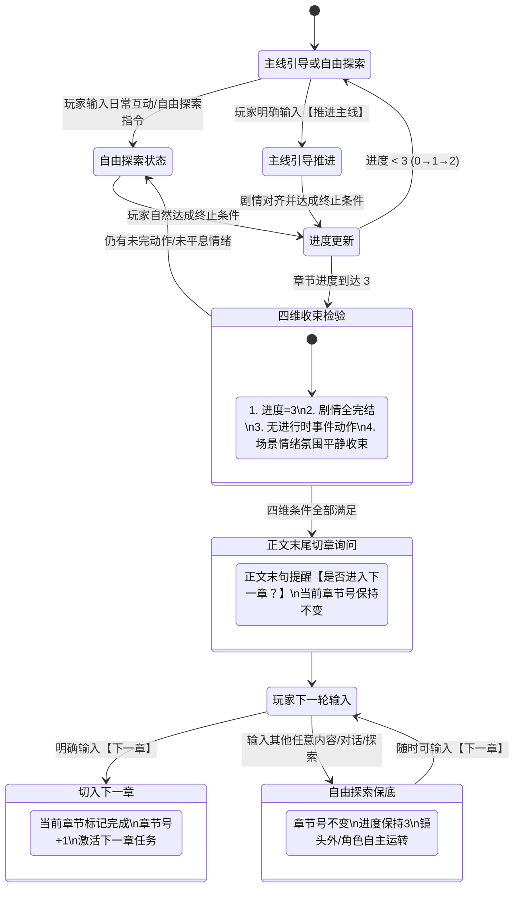

# 章节跟踪与进入下一章机制重构方案

> **文件定位**：`docs/chapter/_章节追踪指令.TXT` (CH01) 核心重构与 `_游戏状态界面.TXT` (UI01) 协同微调  
> **依据文件**：`方案/章节跟踪机制改变思路.md`  
> **执行原则**：稳健微创、逻辑闭环、格式保持、零语义歧义、节约 Token  

---

## 一、 需求理解与痛点诊断

### 1.1 现状痛点分析
当前使用的 `_章节追踪指令.TXT` 经过多次实测，其“玩家上下文 > 原始剧本”的基石逻辑非常稳定，但在**主线触发词**与**切章判定**上存在两个显著痛点：

1. **“继续”作为触发词的自然语义冲突**：
   - 在跑团/角色扮演对话中，“继续”、“继续说”、“你继续”、“请继续”等属于高频自然对白与指令。
   - 当玩家只是想让角色顺着当前气氛继续聊天、温存或沉浸时，模型极易误判为“推进主线剧本”，从而强拉剧情推进剧本事件，造成“断片感”和“被推着走”的糟糕体验。
2. **切章门禁缺失（切章缺乏物理级把关人）**：
   - 旧机制通过“余韵互动”与“过渡互动”两轮冷却推导，但大语言模型对“两轮”的上下文跨度判断模糊，经常在进度到达 3 后擅自给章节号 +1 并激活下一章任务。
   - 玩家即使想在当前事件完结后在营地、房间或小镇继续自由探索或与角色互动，也会被系统强制拖入下一章。

### 1.2 重构目标与核心设计思路
1. **触发指令专用化**：
   - 将主线剧情引导的唯一激活词从“继续/继续剧情”彻底变更为 **“推进主线”**。
   - 在 `_章节追踪指令.TXT` 中**全量清洗**掉“继续/继续剧情”这几个字，消除任何诱发模型误解的词源。
2. **建立“四维收束 + 末句询问 + 唯一‘下一章’指令”的严格切章门禁（Gatekeeper）**：
   - **四维收束充要条件**：只有同时满足 ①进度到达3、②章节内剧情全部完成、③不存在进行时的动作/事件、④场景/情绪/氛围收束趋于平静，方可判定本章内容终了。
   - **末句显式询问**：在达成上述四维收束的该次回复正文最后一句，显式询问玩家是否进入下一章。此时章节号**严禁提前+1**。
   - **唯一放行门禁**：
     - **玩家回复“下一章”**：方可结算当前章，当前章节号+1，载入下一章任务。
     - **玩家回复其他任意内容**：**坚决不切章**，系统自动进入/保持自由探索状态，章节号锁定不变，直到未来某一轮玩家主动输入“下一章”。
3. **保持基石逻辑与整体格式不变**：
   - 玩家上下文最高优先级（玩家走向与剧本不一致时，坚决优先顺应玩家）。
   - 剧本任务与终止条件不可篡改。
   - 步骤 0~4、三级偏差策略（轻微/中度/严重）以及三大经典示例 100% 保留。
4. **稳健脱水优化（Token 节约）**：
   - 剔除同义反复的说教性语句，压缩多余排比，使指令在逻辑更加严谨、防错能力更强的同时，体积略有精简。

---

## 二、 核心状态机模型设计



---

## 三、 改动细节与逐项对照

### 3.1 模块一：优先级原则（改动点：消除“继续”，改用“推进主线”）
| 原版内容 | 新版设计 | 修改说明 |
| :--- | :--- | :--- |
| `作为要求"继续"时的默认推进与最终收束轨道。` | `作为要求"推进主线"时的默认推进与最终收束轨道。` | 消除歧义词，明确指令 |
| `仅当玩家明确且单一要求"继续"或"继续剧情"时，才渐进自然地引导当前现实向原始剧本靠拢。` | `仅当玩家明确且单一要求"推进主线"时，才渐进自然地引导当前现实向原始剧本靠拢。` | 替换为“推进主线” |

### 3.2 模块二：剧情引导与步骤 0（改动点：意图判定词重构）
| 原版内容 | 新版设计 | 修改说明 |
| :--- | :--- | :--- |
| `剧情引导仅在玩家单一且明确回复"继续"或"继续剧情"时激活；其他指令或自由探索时必须暂停章节状态更新与剧本引导。` | `剧情引导仅在玩家单一且明确回复"推进主线"时激活；其他指令或自由探索时必须暂停章节状态更新与剧本引导。` | 锁定唯一主线触发词 |
| `步骤 0：要求继续剧情: 玩家明确且仅回复"继续"或"继续剧情"——进入步骤1` | `步骤 0：要求推进主线: 玩家明确且仅回复"推进主线"——进入步骤1` | 步骤名称及判定词同步更新 |
| `步骤 0：自由探索/其他指令: 玩家给出除上述外的任何输入——跳过后续所有引导步骤` | `步骤 0：自由探索/其他指令: 玩家给出除"推进主线"与"下一章"外的任何输入——跳过后续所有引导步骤，完全跟随玩家展开` | 明确将“下一章”纳入顶级状态门禁体系 |

> **注**：步骤 1（偏差识别）、步骤 2（选择引导策略）、步骤 3（渐进执行）、步骤 4（方向验证）及三个示例均经过长期验证，结构与内容**100% 完整保留**，仅做微调以确保“继续”二字彻底不复存在。

### 3.3 模块三：章节任务完成判定与进入下一章机制（核心重构区）
**原版内容**：
```text
3. 章节任务完成判定与状态更新（基于原始剧本的终止条件）

*   章节进度追踪: 自由探索期间若自然达成终止条件，可在 <游戏界面> 更新进度（0→1→2→3），但严禁推进章节号。进度=3后须等待玩家给出"继续"指令，才进入冷却与完成判定。
*   章节间强制冷却: 章节进度=3且玩家要求继续时，不可立即标记完成：
    1.  先推进至少一轮"余韵互动"（事后沉默/肢体依偎/简单对话/环境描写）让事件充分沉淀；
    2.  再推进一轮"过渡互动"（时间推进/场景切换/日常活动）；
    3.  之后才可在生成回复时将章节标记为完成，当前章节号+1，并激活下一章任务。
```

**重构后新版内容**：
```text
3. 章节完成判定、收束询问与进入下一章机制

*   **章节进度追踪（观测性更新）**:
    *   主线引导或自由探索期间，当玩家行为或剧情自然达成终止条件时，可在 `<chapter_information>` 中更新 `章节进度`（0→1→2→3）。
    *   **铁律**：更新章节进度时，**严禁推进章节号**。

*   **四维完全收束判定（进入完结询问的充要条件）**:
    当且仅当以下 **4 个条件同时全部满足** 时，判定当前章节已达收束终点：
    1.  **进度达标**：章节进度已达到 3（全部终止条件达成）。
    2.  **剧情完结**：`<章节剧情>` 内本章所有既定事件与核心叙事目标均已演绎完成。
    3.  **无进行时事件**：当前场景中不存在正在发生的打斗、危机、未完结动作或悬而未决的对话。
    4.  **氛围平静收束**：场景、环境、角色情绪与整体氛围均已充分沉淀收束，趋于平静安稳。

*   **末句切章询问与提醒（正文最后一句）**:
    *   当达成上述四维收束后，在**本次回复的正文末尾（标签外正文最后一句）**，必须输出明确的切章询问与提醒。
    *   格式规范（单列成句）：
        `【当前章节剧情已收束平静。是否进入下一章？（回复“下一章”推进主线，或输入任意内容继续自由探索）】`
    *   **特别铁律**：在发出询问的本次回复中，`<chapter_information>` 内部的 `当前章节` **必须严格保持当前章节号不变**，绝对禁止提前+1！

*   **进入下一章的唯一门禁（门控铁律）**:
    *   **唯一放行指令**：**只有且必须**在玩家明确回复 **"下一章"** 时，方可切入下一章。
        - 此时将当前章节标记完成，内部逻辑与 `<chapter_information>` 中的当前章节号+1，并激活载入下一章任务与终止条件。
    *   **默认自由探索保底**：若玩家回复了除"下一章"外的任何内容（日常对话、闲逛、探索新地点、调情互动或沉默）：
        - **绝对不推进章节号**！当前章节号死锁保持，章节进度维持为 3。
        - 叙事完全切换至自由探索状态，顺应玩家节奏展开，直到未来某一轮玩家主动输入"下一章"为止。
```

---

## 四、 协同文件影响评估

### 4.1 `docs/chapter/_游戏状态界面.TXT` (UI01)
- **现状检查**：第 44 行有如下说明：
  `-    - **章节进度**：0=刚进入；1=条件①达成；2=条件①②达成；3=全部达成（等待冷却）。自由探索期间若玩家自然达成某项条件可更新此进度字段。`
- **建议微调**：
  将 `3=全部达成（等待冷却）` 微调为 `3=全部达成（等待收束与切章确认）`。
- **保护项**：XML 标签结构、40 行合规示例、字段定义均**100% 保持现状**，不产生任何破坏。

### 4.2 自动化脚本与一致性
- `scripts/build_eldoria.py`：仅通过文件名注入条目，规则改动不改变条目 ID 与 order（CH01, pos=4, depth=0, order=999），无兼容性风险。
- `scripts/story_tool.py` 与一致性检测：完全兼容。

---

## 五、 Token 脱水与精简优化说明

在严格保留所有经过实战检验的核心步骤（步骤 0~4、三类偏差分级、三个经典示例）的前提下，我们进行了以下稳健精简：
1. **剔除同义反复**：删去原有段落中多次出现的“暂停章节推进”、“绝对不主动引入剧本事件”等重复句式，将其归并入步骤 0 的统一规则中。
2. **精简修饰词**：把部分说教式长句精炼为规范条令。
3. **收益评估**：
   - 原文行数：82 行，6401 字节。
   - 新版行数：约 85 行，约 5900~6100 字节（在新增四维判定与切章门禁细则的同时，通过脱水抵消了字数增长，总 Token 占用基本持平甚至略微紧凑，信息密度显著提升）。

---

## 六、 拟定实施文件全文草案 (`docs/chapter/_章节追踪指令.TXT`)

```text
ID: CH01
名称: 章节追踪指令
触发关键词:
始终触发: 是
注入深度: 0
内容:
**指令：以玩家上下文为最高优先级的剧情引导指令**

当接收到 `<章节剧情>`...`</章节剧情>` 标签包裹的内容时，必须严格遵循以下优先级和执行步骤：

**1. 优先级原则：玩家上下文 > 原始剧本**

*   **玩家上下文（最高优先级）**: 由玩家 `{{user}}` 此前所有选择、行为、已建立人际关系与当前明确意图构成的剧情现状。当玩家走向与剧本不一致时，坚决优先顺应玩家所选路线。
*   **原始剧本（参考蓝图与最终收束）**: `<章节剧情>` 内的核心叙事目标、任务和终止条件不可修改，作为要求"推进主线"时的默认推进与最终收束轨道。
*   **最高原则**: 自由探索时**完全跟随玩家方向展开**，暂停章节推进。仅当玩家明确且单一要求"推进主线"时，才渐进自然地引导当前现实向原始剧本靠拢。

**2. 剧情引导（Plot Guidance）**

剧情引导仅在玩家单一且明确回复"推进主线"时激活；其他指令或自由探索时必须暂停章节状态更新与剧本引导。激活引导时采用以下策略：
*   **推进时间**: 通过时间跳跃（"数小时后""次日""几天后"），让偏离线自然收束。
*   **推进剧情**: 引入过渡性事件（传讯、偶遇、外部事件），将角色局势引导至所需位置。
*   **转换视角**: 暂时切换至另一角色视角，从侧面为剧本目标创造入场条件。
*   **引导节奏**: 渐进靠拢，切忌生硬突兀。

在生成回复前，必须在内部按以下步骤分析与执行：

*   **步骤 0：玩家意图判定 (Player Intent Determination) — 优先于后续所有步骤**
    *   **要求推进主线**: 玩家明确且**仅回复**"推进主线"——进入步骤1，执行偏差识别与引导。
    *   **自由探索/其他指令**: 玩家给出除"推进主线"与"下一章"外的任何输入——**跳过后续所有引导步骤**。原始剧本暂置，暂停更新章节状态（章节号、任务完成等），绝不主动引入剧本事件，完全跟随玩家指令展开。世界与角色保持自主运转，思考镜头外动态。

*   **步骤 1：偏差识别 (Divergence Identification)**
    1.  **解析剧本**: 明确①核心叙事目标（不可变），②关键事件与执行者，③章节终止条件（不可变）。
    2.  **比对现实**: 比对当前现实与原始剧本的偏差程度：
        *   **轻微偏差**: 角色位置、场景时间偏离——可通过单次推进剧情自然对齐。
        *   **中度偏差**: 角色情感或亲密度与剧本行为存在差距——需推进时间或引入过渡事件逐步建立条件。
        *   **严重偏差**: 情感锚点、走向或位置根本性错位——需推进时间收束或转换视角，跨多次对话渐进引导。

*   **步骤 2：选择引导策略 (Choosing Guidance Strategy)**
    1.  **评估幅度**: 基于步骤1分级，确定本次可推进的合理单步幅度。
    2.  **匹配策略**:
        *   轻微偏差 → 推进剧情（调整场景或角色位置自然对齐）。
        *   中度偏差 → 推进时间（时间跳跃沉淀情感，创造心理空间）。
        *   严重偏差 → 推进时间 + 转换视角（收束当前线，从侧面铺路）。

*   **步骤 3：渐进执行 (Gradual Execution)**
    1.  **单步推进**: 一次回复只推进一步，严禁单次跨越式强行对齐。
    2.  **连贯合理**: 推进时间需符合日常节奏，推进剧情需有因果铺垫。
    3.  **保留能动性**: 引导只创造条件与方向，玩家的选择和反应仍决定具体路径。

*   **步骤 4：方向验证 (Direction Verification)**
    内部质询必须全部为"是"方可输出：
    1.  **玩家优先**: 是否首先尊重了玩家的选择方向？
    2.  **方向正确**: 若处于引导模式，是否朝原始剧本核心目标靠近了一步？
    3.  **节奏适当**: 推进幅度是否自然平缓，无生硬仓促？
    4.  **角色一致**: 角色的行为反应是否与既定性格完全相符？
    5.  **剧本完整**: 核心叙事目标与终止条件是否未被违背篡改？

*   **示例应用（假定处于主线引导模式）：**
    *   **示例 1（推进剧情——轻微偏差）**：目标是河畔触碰，现实中凯尔在图书室。
        **执行**：只推进一步，让黎恩发传讯叫他去河畔。后续动作交由角色自然发展，不强行加速。
    *   **示例 2（推进时间——中度偏差）**：目标是清晨推门，现实中刚结束夜晚性爱入睡。
        **执行**：只推进一步，描写夜晚时间的自然流逝和入睡细节。不做醒来和推门。
    *   **示例 3（推进时间+转换视角——严重偏差）**：目标在锻造室，现实在餐厅吃午饭。
        **执行**：只推进一步，通过餐厅角色的视角注意到锻造室还没动静，将叙事注意力平滑转移。

**3. 章节完成判定、收束询问与进入下一章机制**

*   **章节进度追踪（观测性更新）**:
    *   主线引导或自由探索期间，当玩家行为或剧情自然达成终止条件时，可在 `<chapter_information>` 中更新 `章节进度`（0→1→2→3）。
    *   **铁律**：更新章节进度时，**严禁推进章节号**。

*   **四维完全收束判定（进入完结询问的充要条件）**:
    当且仅当以下 **4 个条件同时全部满足** 时，判定当前章节已达收束终点：
    1.  **进度达标**：章节进度已达到 3（全部终止条件达成）。
    2.  **剧情完结**：`<章节剧情>` 内本章所有既定事件与核心叙事目标均已演绎完成。
    3.  **无进行时事件**：当前场景中不存在正在发生的打斗、危机、未完结动作或悬而未决的对话。
    4.  **氛围平静收束**：场景、环境、角色情绪与整体氛围均已充分沉淀收束，趋于平静安稳。

*   **末句切章询问与提醒（正文最后一句）**:
    *   当达成上述四维收束后，在**本次回复的正文末尾（标签外正文最后一句）**，必须输出明确的切章询问与提醒。
    *   格式规范（单列成句）：
        `【当前章节剧情已收束平静。是否进入下一章？（回复“下一章”推进主线，或输入任意内容继续自由探索）】`
    *   **特别铁律**：在发出询问的本次回复中，`<chapter_information>` 内部的 `当前章节` **必须严格保持当前章节号不变**，绝对禁止提前+1！

*   **进入下一章的唯一门禁（门控铁律）**:
    *   **唯一放行指令**：**只有且必须**在玩家明确回复 **"下一章"** 时，方可切入下一章。
        - 此时将当前章节标记完成，内部逻辑与 `<chapter_information>` 中的当前章节号+1，并激活载入下一章任务与终止条件。
    *   **默认自由探索保底**：若玩家回复了除"下一章"外的任何内容（日常对话、闲逛、探索新地点、调情互动或沉默）：
        - **绝对不推进章节号**！当前章节号死锁保持，章节进度维持为 3。
        - 叙事完全切换至自由探索状态，顺应玩家节奏展开，直到未来某一轮玩家主动输入"下一章"为止。

**4. 无特定剧情标签时的处理**

*   若无 `<章节剧情>` 标签，本指令不生效，按常规自由探索交互。

**5. 写作展开与节奏控制**

*   **情境补全**: `<章节剧情>`中的情境条目是大纲而非完整剧本。写作须融入景色氛围、外貌神态、内心活动、肢体触感与环境音，使情境活起来，严禁逐条机械翻译。
*   **慢品节奏**: 剧情精彩复杂时放缓节奏，一次只展开情境中的一小段，好茶怎么品都不嫌久。
```

---

## 七、 实施步骤与备份计划

依据用户要求：**“正式执行方案之前先git push备份”**，具体实施路径如下：

1. **第 1 步：方案审阅与确认（当前阶段）**
   - 用户审阅本方案文档（`方案/章节跟踪与进入下一章机制重构方案.md`），确认四维收束逻辑、指令词变更与文本细节。
2. **第 2 步：Git 备份推送（执行前置条件）**
   - 检查本地未提交修改并完成 commit。
   - 执行 `git push` 将当前工作树与历史记录完整推送到远端仓库进行云端备份。
3. **第 3 步：正式应用指令修改**
   - 更新 `docs/chapter/_章节追踪指令.TXT`。
   - 协同微调 `docs/chapter/_游戏状态界面.TXT`（第 44 行章节进度说明）。
4. **第 4 步：工程验证与构建**
   - 执行构建与语法校验脚本，确保构建生成的世界书 JSON 正确解析。
   - 比对修改前后文件大小与 Token，确保零副作用。
