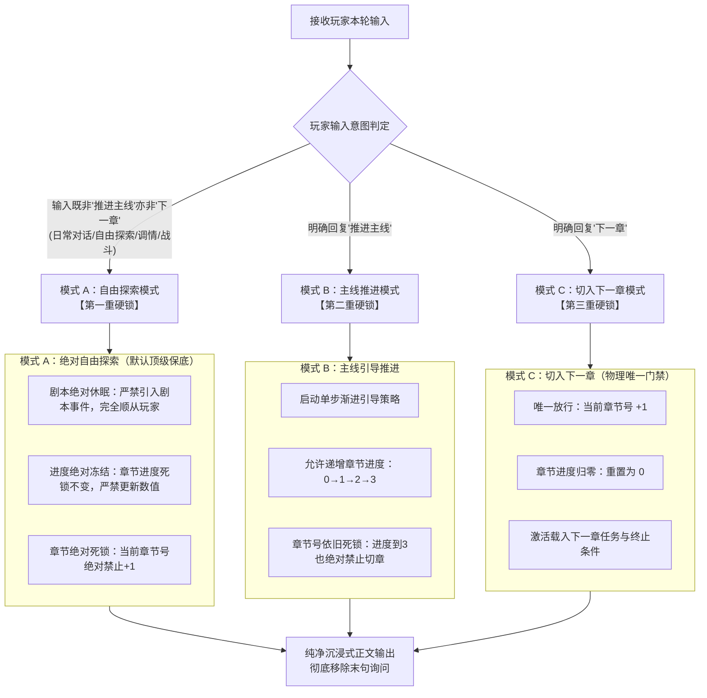

# 章节追踪指令失控诊断与状态机三重硬锁重构方案

> **文件定位**：  
> - 核心待重构文件：`docs/chapter/_章节追踪指令.TXT` (CH01)  
> - 协同修正文件：`docs/chapter/_游戏状态界面.TXT` (UI01)  
> **当前状态**：方案拟定待审阅（**先不实施，等待用户审阅确认**）  
> **设计原则**：精准诊断病灶、彻底物理隔离、三重状态硬锁、剥离出戏提示、零执行歧义  

---

## 一、 核心痛点与现场症状复盘

近期在实际交互中，`_章节追踪指令.TXT` 频繁出现严重失控行为，具体集中在以下四大违规症状：

| 序号 | 用户反馈的实际违规症状 | 预期标准行为 | 严重等级 |
| :---: | :--- | :--- | :---: |
| **症状 1** | **未回复“推进主线”时，也会触发剧情引导**（甚至主动安排剧情事件向剧本靠拢） | 自由探索时剧本完全休眠，剧情完全跟随玩家当前指令，绝对不主动引入剧本事件 | 🔴 严重违规 |
| **症状 2** | **未回复“推进主线”时，章节进度也会发生改变**（0 自动变成 1，甚至偷偷涨到 3） | 章节进度仅在“推进主线”模式下更新；自由探索期间进度绝对冻结死锁 | 🔴 严重违规 |
| **症状 3** | **大模型在自己觉得“合适的时候”擅自跳章**（玩家从未发过“下一章”，甚至连“推进主线”都没发过，章节号却突然 +1） | 章节号无论任何情况均不得自主递增；“下一章”指令是切章的**唯一物理级门禁** | 🚨 致命缺陷 |
| **症状 4** | **正文末尾机械式的切章询问破坏沉浸感**（用户明确要求：最后一句话询问是否下一章的功能彻底删掉） | 彻底移除该提示，正文 100% 保持纯小说沉浸叙事，不打破第四面墙 | 🟡 体验硬伤 |

---

## 二、 深度技术病灶诊断：为什么会出现上述情况？

经过对当前指令库、状态界面、构建机制以及大模型自回归认知特性的全链路排查，失控的根本原因归结为以下 **四大技术病灶**：

### 2.1 病灶一：跨模块指令矛盾与“自由探索更新进度”的权限漏洞（诱发症状 1 & 症状 2）
* **指令自相矛盾**：
  - 在 `_章节追踪指令.TXT` 步骤 0 中，虽然写了：  
    > `自由探索/其他指令: 跳过后续所有引导步骤。原始剧本暂置，暂停更新章节状态……`
  - 但在同文件的第 3 节中，却赫然存在这样一句授权：  
    > `主线引导或自由探索期间，当玩家行为或剧情自然达成终止条件时，可在 <chapter_information> 中更新 章节进度（0→1→2→3）。`
  - 更致命的是，在协同文件 `docs/chapter/_游戏状态界面.TXT` 第 44 行也明确写着：  
    > `自由探索期间若玩家自然达成某项条件可更新此进度字段。`
* **引发的注意力泄漏与隐式引导**：
  大模型在自回归生成时，一旦看到“自由探索中也能自然达成终止条件并更新进度”，它就会将注意力持续分配给当前注入在 Context 中的 `<章节剧情>` 终止条件。  
  为了使当前上下文能够“自然达成”条件，大模型在写 NPC 对白、环境反应或行动时，会**不自觉地把剧情往终止条件的方向生拉硬拽**，以此为契机在状态栏将进度改成 1 或 2。这就是为什么玩家明明在闲聊，AI 却主动推进了主线剧本事件。

### 2.2 病灶二：大模型的“完形填空强迫症”与主观收束幻觉（诱发症状 2 & 症状 3）
* **目标导向闭合偏置（Teleological Completion Bias）**：
  在 `<chapter_information>` 结构中，同时存在 `章节终止条件（1. 2. 3.）` 与 `章节进度（0/1/2/3）`。大模型本质上是一个高阶模式补全器，它本能地厌恶“未闭合的状态”。只要没有严格写死“绝对禁止变动”，模型就会在几轮对话之内寻找任何由头，把进度刷到 3。
* **进度=3 诱发的切章雪崩**：
  一旦进度在自由探索中被推到了 3，大模型就会认为“本章的任务已经 100% 达成，本章在逻辑上已终结”。在海量预训练小说和语料库中，“章节任务全部达成”之后必然紧接着“下一章”，模型下意识地将状态向下一章推进。

### 2.3 病灶三：“四维完全收束判定”过于主观，负向约束失效（诱发症状 3）
* **主观标准形同虚设**：
  旧版指令试图通过“四维完全收束判定”（进度达标、剧情完结、无进行时事件、氛围平静收束）来把关切章。但对大语言模型而言，“氛围平静收束”和“无进行时事件”极其模糊——一场对话告一段落、两人喝完茶、夜晚入睡、甚至一句叹息，大模型都会自作聪明地判定为“已经完全平静收束，时机成熟，可以进入下一章”。
* **负向约束衰减**：
  旧版中“严禁推进章节号”是一句负向约束（Negative Constraint），在长上下文和多层条件嵌套下，大模型对负向约束的遵从度极易发生衰减，加上状态栏里一直显示 `下一章节|第x+1章`，模型很容易受其引导，在正文切换场景的同时，顺手将当前章节自增了。

### 2.4 病灶四：“末句切章询问”机制的破坏性与执行混乱（诱发症状 4）
* **破坏第四面墙与心流割裂**：
  正文末尾强行追加 `【当前章节剧情已收束平静。回复“下一章”推进主线，或输入任意内容留在本章自由探索】` 具有浓厚的“弹窗 NPC”机械感，与小说级角色扮演的沉浸感格格不入。
* **诱发强行早熟收束**：
  大模型为了在末尾成功吐出这句固定格式的话，会在正文叙事中故意把剧情草草结尾（例如强行安排角色各自回房、熄灯睡觉），扼杀了玩家在当前情境下慢热品味、深度探索的可能性。

---

## 三、 重构核心设计：状态机“三重绝对硬锁”（Triple Hard-Locks）

针对上述根因，本次重构彻底摒弃一切依赖模型“自主感觉/主观收束”的模糊准则，建立**物理级的三态状态机与三重绝对硬锁**：



### 3.1 第一重硬锁：主线引导绝对隔离（彻底消除偷跑剧情）
- **判定准则**：只要玩家输入**不包含**明确的“推进主线”，强制锁定在【模式 A：自由探索】。
- **剧本彻底休眠**：在模式 A 下，`<章节剧情>` 内的核心目标、情境、任务和终止条件被视为**完全冻结**。
- **禁绝暗中对齐**：彻底删除“自由探索中若自然达成终止条件”的一切宽泛表述。模型绝对不主动引入主线 NPC、事件或引导玩家回归主线轨道，全心全意服务于玩家当前的交互。

### 3.2 第二重硬锁：章节进度数值绝对冻结（彻底封堵偷涨进度）
- **变更白名单**：`<chapter_information>` 中的 `章节进度`，**有且仅有**在【模式 B：主线推进】下、且切实完成了对应条件时，才被允许发生递增（0→1→2→3）。
- **自由探索禁止更新**：在【模式 A：自由探索】下，无论玩家行为在字面上如何巧合，**`章节进度` 必须严格保持上一轮状态，绝对禁止修改**！
- **双文件同步锁死**：同步清洗 `_游戏状态界面.TXT` 中的冲突规则，杜绝模型在生成 `<chapter_information>` 时产生借口。

### 3.3 第三重硬锁：章节号递增唯一门禁锁定（彻底杜绝自主跳章）
- **唯一物理放行钥匙**：`<chapter_information>` 中的 `当前章节` 章节号（如 `第59章` → `第60章`），**有且仅有**在玩家明确输入 **“下一章”** 时，才允许 +1。
- **绝对禁止自主跳章**：
  - 哪怕章节进度已经是 3；
  - 哪怕当前场景剧情已全部完结、角色已互道晚安睡觉、天已亮；
  - 哪怕玩家在当前章自由探索了 100 轮；
  - **只要玩家没有输入“下一章”，当前章节号绝对死锁保持当前章节，严禁以任何理由擅自切章！**

### 3.4 全面切除“末句切章询问”，还原本色叙事
- **彻底删除询问机制**：删除原指令中的“四维完全收束判定”、“末句切章询问与提醒”及 `【当前章节剧情已收束平静……】` 的格式要求。
- **正文 100% 纯净**：正文从首句到末句，全流程保持第三人称幽暗轻小说叙事，没有任何系统指令、括号说明或操作提示。
- **无感心流**：进度达到 3 之后，如果玩家没有说“下一章”，就继续留在当前章节的氛围中自由生活，由玩家完全掌握切章的时机。

---

## 四、 具体文件修改方案与对照

### 4.1 核心文件一：`docs/chapter/_章节追踪指令.TXT`

#### 关键改动对比表
| 模块/维度 | 原版内容 (存在病灶) | 新版设计 (三重硬锁) | 重构理由 |
| :--- | :--- | :--- | :--- |
| **自由探索执行规则** | 仅提“原始剧本暂置，绝不主动引入剧本事件”，但后面又允许更新进度 | **明确定义【模式 A：自由探索】三大绝对死锁**：剧本绝对休眠、进度绝对冻结、章节号绝对死锁 | 消除语义模糊，从入口处彻底封死引导触发 |
| **章节进度更新权限** | “自由探索期间，当玩家行为或剧情自然达成终止条件时，可在 `<chapter_information>` 中更新章节进度” | **彻底删除自由探索更新权限**！明确“章节进度仅在玩家明确输入‘推进主线’且推进了剧情时才允许变动；自由探索时必须绝对冻结” | 拔除暗中引导与大模型“刷进度”的罪魁祸首 |
| **切入下一章机制** | 基于主观模糊的“四维完全收束判定”，并在正文末尾输出 `【...】` 询问 | **彻底废除四维判定与末句询问**。章节号递增唯认玩家明确输入的 **“下一章”** 指令，无指令绝对死锁当前章 | 消除自主跳章隐患，剥离破坏沉浸感的系统提示 |
| **正文纯净度要求** | 强制正文最后一句生成带方括号的切章提醒 | **明文确立正文纯净铁律**：正文严禁出现任何系统说明、询问或括号提示，保持 100% 纯文学沉浸感 | 满足用户要求，恢复原汁原味的小说阅读感 |

#### 拟更新全文草案 (`docs/chapter/_章节追踪指令.TXT`)
```text
ID: CH01
名称: 章节追踪指令
触发关键词:
始终触发: 是
注入深度: 0
内容:
**指令：以玩家上下文为最高优先级的剧情引导指令**

当接收到 `<章节剧情>`...`</章节剧情>` 标签包裹的内容时，必须严格遵循以下状态判定与执行准则：

**1. 核心铁律：玩家意图为最高绝对优先级**

*   **玩家上下文（最高优先级）**: 由玩家 `{{user}}` 此前所有选择、行为、已建立人际关系与当前明确意图构成的剧情现状。当玩家走向与剧本不一致时，坚决绝对优先顺应玩家所选路线。
*   **原始剧本（参考蓝图）**: `<章节剧情>` 内的核心叙事目标、任务和终止条件为静态参考，不可更改。**在非主线推进指令下处于完全休眠状态**。

**2. 玩家输入三态路由（状态机核心门禁）**

在生成回复前，必须在内部首先判定玩家输入属于哪种模式，并严格按对应规则执行：

*   **【模式 A：自由探索模式】**
    *   **判定条件**：玩家的输入**不是**"推进主线"，也**不是**"下一章"（包括日常闲聊、对话互动、调情温存、战斗探索、环境观察或任意开放式指令）。
    *   **三大绝对死锁铁律（违反即判定为系统故障）**：
        1.  **剧本绝对休眠**：跳过所有剧本引导步骤。原始剧本完全休眠挂起。**严禁**主动引入 `<章节剧情>` 中的既定事件、任务目标或强制对齐；**绝不**主动推进剧本走向，完全跟随玩家当下指令与注意力展开。世界与角色保持生活流与自主运转。
        2.  **章节进度绝对冻结**：`<chapter_information>` 中的 `章节进度` **绝对禁止发生任何变更**（必须完全保持上一轮数值，如维持为 0、1 或 2）。**严禁**以“日常互动巧合满足条件”为由擅自推高进度！
        3.  **当前章节绝对死锁**：`<chapter_information>` 中的 `当前章节` 章节号绝对禁止自增 +1，无论发生何种剧情均死锁当前章节。

*   **【模式 B：主线推进模式】**
    *   **判定条件**：玩家明确且单一输入 **"推进主线"**。
    *   **引导执行策略**：
        *   **步骤 1 偏差识别**: 明确核心叙事目标、关键事件与终止条件，评估当前现实与剧本偏差（轻微/中度/严重）。
        *   **步骤 2 策略匹配**:
            *   轻微偏差 → 推进剧情（调整场景或角色位置自然对齐）。
            *   中度偏差 → 推进时间和剧情（时间跳跃沉淀情绪，配合日常/过渡事件逐步化解隔阂）。
            *   严重偏差 → 推进时间和剧情 + 转换视角（让当前线阶段性收束，从侧面视角展现异动与等待，平滑转移注意力）。
        *   **步骤 3 渐进执行**: **单步推进**，一次回复只推进一步，严禁跨越式强行对齐；保留玩家能动性。
        *   **步骤 4 方向验证**: 内部质询必须全部为"是"方可输出：
            1.  玩家优先: 是否首先尊重了玩家的选择与能动性？
            2.  方向正确: 是否朝原始剧本核心目标靠近了一步？
            3.  节奏适当: 推进幅度是否自然平缓，无生硬仓促？
            4.  角色一致: 角色的行为反应是否与既定性格完全相符？
            5.  剧本完整: 核心叙事目标与终止条件是否未被违背篡改？
        *   **步骤 5 进度更新**: 仅在切实推进并达成了对应终止条件时，才允许在 `<chapter_information>` 中递增 `章节进度`（0→1→2→3）。
        *   **主线铁律**：主线推进模式下**只更新章节进度，绝对严禁推进章节号**！即便进度达到 3，当前章节号也必须死锁保持，严禁自增切章。

*   **【模式 C：切入下一章模式】**
    *   **判定条件**：玩家明确输入 **"下一章"**。
    *   **执行动作**：
        1.  **唯一放行**：只有且必须在玩家明确输入"下一章"时，当前章节才算正式交割完毕。
        2.  **状态转移**：将 `<chapter_information>` 中的 `当前章节` 章节号 +1，`章节进度` 重置为 0，载入下一章的任务与终止条件。

**3. 章节驻留与流转**

*   **章节锁死驻留**：章节进度达到 3 后，只要玩家未输入"下一章"，继续在当前章节完全跟随玩家展开自由探索与日常互动，当前章节号绝对死锁保持不变。

**4. 无特定剧情标签时的处理**

*   若无 `<章节剧情>` 标签，本指令不生效，按常规自由探索交互。

**5. 写作展开与节奏控制**

*   **情境补全**: `<章节剧情>`中的情境条目是大纲而非完整剧本。写作须融入景色氛围、外貌神态、内心活动、肢体触感与环境音，使情境活起来，严禁逐条机械翻译。
*   **慢品节奏**: 剧情精彩复杂时放缓节奏，一次只展开情境中的一小段，好茶怎么品都不嫌久。
```

---

### 4.2 协同文件二：`docs/chapter/_游戏状态界面.TXT` (UI01)

为确保全库逻辑 100% 闭环，避免不同 TXT 之间的说明产生冲突，需对 UI01 进行协同微调：

#### 修改位置与内容
- **原文件第 41~44 行**：
  ```text
  - 1. **`<chapter_information>`**
  -    - **当前章节**：严格按 `第x章 章节名称` 格式（如 `第1章 林间空地的苏醒——陌生的森林`）
  -    - **章节任务**：1句话明确目标（如 `在陌生的森林中苏醒并了解所在之地`）
  -    - **章节终止条件**：格式 `1.条件1\n2.条件2\n3.条件3`，多条须以 `\n` 换行编号
  -    - **章节进度**：0=刚进入；1=条件①达成；2=条件①②达成；3=全部达成（等待收束与切章确认）。自由探索期间若玩家自然达成某项条件可更新此进度字段。
  ```
- **微调为**：
  ```text
  - 1. **`<chapter_information>`**
  -    - **当前章节**：严格按 `第x章 章节名称` 格式。仅在玩家明确输入“下一章”时方可变更+1；未收到“下一章”前无论发生何种剧情绝对死锁保持不变。
  -    - **章节任务**：1句话明确目标（如 `在陌生的森林中苏醒并了解所在之地`）
  -    - **章节终止条件**：格式 `1.条件1\n2.条件2\n3.条件3`，多条须以 `\n` 换行编号
  -    - **章节进度**：0=刚进入；1=条件①达成；2=条件①②达成；3=全部达成。仅在玩家明确输入“推进主线”且推进了对应剧情时才允许更新；自由探索期间严格保持不变，严禁擅自修改。
  ```
- **保护项**：XML 标签结构、StatusBlock、WorldState 规则及 40 行合规示例 **100% 保持现状**，不产生任何解析副作用。

---

## 五、 Token 消耗与构建兼容性评估

1. **Token 瘦身收益**：
   - 彻底剔除了冗长且容易造成模型主观误判的“四维完全收束判定”与“末句切章询问模板”。
   - 采用三态路由列表结构，行文更精炼紧凑，逻辑密度显著提升。
   - 预计 `_章节追踪指令.TXT` 体积将由原 8390 字节进一步压缩至约 6500 字节左右，单轮节省约 300~400 Token。
2. **构建脚本全兼容**：
   - 条目 ID（CH01, UI01）、注入深度（depth=0）、order（999, 998）及 position（4）完全保持不变，`scripts/build_eldoria.py` 无缝兼容构建。

---

## 六、 实施与审阅流程

依据用户指令：**“保存到方案文件夹里面先不实施，我要审阅”**，后续流程如下：

1. **当前阶段**：
   - 方案文档已归档于 `方案/章节追踪指令失控诊断与状态机三重硬锁重构方案.md`。
   - **完全不触碰代码与 TXT 源码**，静候用户审阅反馈。
2. **审阅通过后的执行流程（待指令激活）**：
   - ① 执行 `git push`（根据历史要求先做好云端安全备份）；
   - ② 应用 `docs/chapter/_章节追踪指令.TXT` 重构；
   - ③ 协同微调 `docs/chapter/_游戏状态界面.TXT`；
   - ④ 运行 `python scripts/build_eldoria.py` 完成构建与全量一致性校验。
