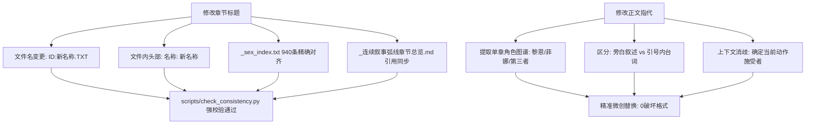
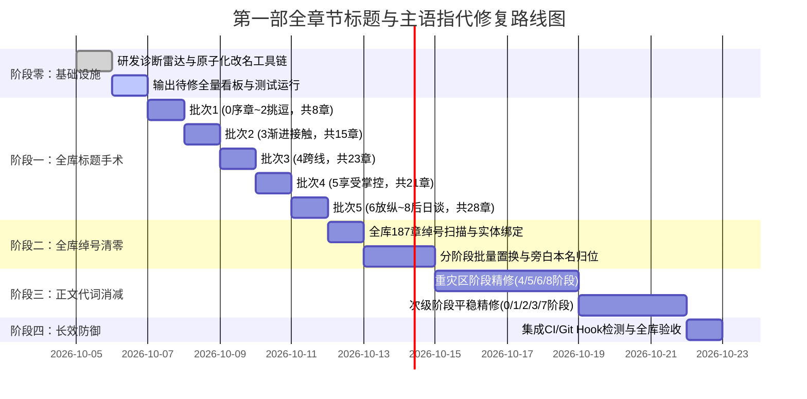

# 第一部全章节标题重构与主语指代消解工程方案

> **方案状态**：待执行评审 · v1.0  
> **归属工程**：第一部大本营篇（全 937 章）全库叙事质感与指代规范专项治理  
> **核心目标**：彻底消除章节标题与正文中的“他/她模糊指代”、“动作流水账式标题”以及“少年/少女/魔女/工匠等身份绰号”，全面回归《AGENTS.md》确立的“明确主语直呼其名”、“纯正 JRPG 西幻生活流”与“电影镜头式具象叙事”。

---

## 一、 工程立项背景与量化诊断

在第一部目前的 937 个章节中，由于早期大纲生成与快速编排的历史原因，全库在**指代系统**与**标题命名**上沉淀了三大严重影响阅读体验与文学质感的系统性病灶：

### 1. 三大核心病灶剖析

| 序号 | 病灶类型 | 典型缺陷表现 | 负面影响与违背铁律 |
|:---|:---|:---|:---|
| **01** | **标题代词与流水账粗鄙化** | `699：没锁的门——他知道有人会路过`<br>`195：工坊的门——他看着她的奶子`<br>`200：三天——他就摸了一下`<br>`767：矮人的回礼——她被舔的第一次（上）` | 丢失人物主体，读者在看目录和检索时不知所云；语感滑向劣质快餐黄文，丧失了《世界书》作为 JRPG 史诗与细腻羁绊的文学质感。 |
| **02** | **正文“他/她”代词严重泛滥** | 一段之内连续出现 5~8 个“他”或“她”，如“他低头看着她，他把她的腿抬起，而她看着他……” | 在同性在场（如黎恩与哈根、菲娜与艾玛）或复杂肢体互动时，主谓宾彻底失焦；文字失重漂浮，缺乏具象肉体与角色灵魂。 |
| **03** | **身份标签与职业绰号代替姓名** | 旁白频繁使用“黑发少年”、“娇小少女”、“知性魔女”、“年轻工匠”、“矮人”、“小妻子/娇妻” | 直接违背《AGENTS.md》第一条核心铁律（“旁白叙述视角严禁身份标签与形容词绰号作主语或代词，一律直呼名字”）。 |

---

### 2. 全库全量扫描诊断数据

通过对 `docs/story/` 目录下 0~8 阶段全库 937 个章节（全库已完成整数连续重排序，ID 1~937 无缝连续）的自动化扫描，当前量化数据如下：

```
============================================================
  第一部全库（937章，重排序后）指代与标题病灶热力分布
============================================================
  • 全库章节总数: 937 章（纯整数 1 ~ 937 连续无缺口，小数插章已全部合拢）
  • 待修复问题标题总数: 81 个（初始 90 个，Batch T1 已完成 9 个）
    - 含有“他/她/它”代词的标题: 63 个
    - 含有纯代称绰号的标题: 18 个
  • 含有身份绰号（少女/工匠/魔女等）的文件数: 187 / 937
  • 全库正文“他”出现频次: 5,395 次
  • 全库正文“她”出现频次: 6,418 次（代词总计 11,813 次）
============================================================
```

#### 各阶段分布明细表（重排序最新对应）

| 阶段目录 | 最新 ID 区间 | 章节总数 | 待修标题(代词) | 待修标题(绰号) | 正文代词总计 (他+她) | 正文重点绰号频次 (少女/工匠/矮人等) | 标题治理进度 |
|:---|:---:|:---:|:---:|:---:|:---:|:---:|:---:|
| **0：序章** | ID 1 ~ 70 | 70 | 0 | 2 | 547 | 52 | **Batch T1 已完成 7 章**，余 2 章 |
| **1：试探和暧昧** | ID 71 ~ 114 | 44 | 0 | 0 | 454 | 22 | 标题合规（0待修） |
| **2：挑逗和接受** | ID 115 ~ 149 | 35 | 0 | 1 | 325 | 24 | **Batch T1 已完成 2 章**，余 1 章 |
| **3：渐进接触** | ID 150 ~ 279 | 130 | 15 | 0 | 1,222 | 94 | **Batch T2 待执行（15章）** |
| **4：跨线** | ID 280 ~ 449 | 170 | 15 | 6 | 2,463 | 147 | **Batch T3 待执行（21章）** |
| **5：享受和掌控** | ID 450 ~ 660 | 211 | 13 | 6 | 3,139 | 239 | **Batch T4 待执行（19章）** |
| **6：放纵** | ID 661 ~ 811 | 151 | 11 | 1 | 1,133 | 213 | **Batch T5 待执行（12章）** |
| **7：终局** | ID 812 ~ 831 | 20 | 2 | 0 | 341 | 10 | **Batch T5 待执行（2章）** |
| **8：后日谈** | ID 832 ~ 937 | 106 | 7 | 2 | 2,189 | 101 | **Batch T5 待执行（9章）** |
| **全库合计** | **ID 1 ~ 937** | **937** | **63** | **18** | **11,813** | **902** | **已完 9 章 / 剩余 81 章** |

---

## 二、 核心重构原则：“名名替换”（直接本名等价置换法）

> **最高纲领**：**拒绝一切云山雾罩的伪文雅与文青生造词（严禁造出“白银拥抱”、“菲娜之露”、“克制一抚”等不知所云的词汇）！**  
> 原标题的句式、动词、直球感与生活流韵味 100% 原样保留，**唯一的手术就是将模糊代词（他/她）与泛指绰号（矮人/少女/魔女/工匠）精准置换为真实角色本名**。

### 1. 标题“名名替换”四大铁律（Title Name-Replacement Laws）

1. **绝对结构不动（保留原汁原味）**：
   - 保持 `前半部分——后半部分` 的原有句式完全不变；
   - 原标题原本怎么说，就怎么说，保留原章节的直白感、日常感与动作抓力。
2. **直接代词本名置换（他 ➔ 男方本名，她 ➔ 女方本名）**：
   - ❌ 绝对不要生造生硬隐喻：“菲娜之露”、“白银拥抱”、“克制一抚”；
   - ✅ **直接做名名替换**：
     - “他看着她的奶子” ➔ **“乔治看着菲娜的奶子”**（谁看谁、看什么，清清楚楚，直球有力）；
     - “他就摸了一下” ➔ **“乔治就摸了一下”**（或对应角色）；
     - “她被舔的第一次” ➔ **“亚尔缇娜被舔的第一次”**；
     - “她的安抚” ➔ **“菲娜的安抚”**；
     - “她的小习惯” ➔ **“菲娜的小习惯”**；
     - “她设计的隐奸” ➔ **“菲娜设计的隐奸”**；
     - “他直接进来了” ➔ **“哈根直接进来了”**；
     - “他知道有人会路过” ➔ **“哈根知道有人会路过”**；
     - “他翻身压上来了” ➔ **“哈根翻身压上来了”**。
3. **身份绰号一律换回本名**：
   - 原标题或正文中的“少女” ➔ 替换为 **菲 / 亚尔缇娜 / 亚莉莎**；
   - 原标题或正文中的“魔女” ➔ 替换为 **艾玛**；
   - 原标题或正文中的“工匠” ➔ 替换为 **乔治 / 黎恩 / 哈根**；
   - 原标题或正文中的“矮人” ➔ 替换为 **哈根 / 法林 / 多尔金**。
4. **上下篇标识位置保真**：若原标题带 `（上）`、`（下）`，严格保留在最末尾。

---

### 2. 正文指代治理三大法典（Body Name-Replacement Rules）

> **边界铁律**：**正文暂时坚决不做任何文笔/段落精修，不扩写动作描写，不改变原作者的原有标点和段落节奏！只做纯粹的“他/她/它”与代称本名置换。**

1. **直接本名替换（他/她/它 ➔ 角色本名）**：
   - 依照《AGENTS.md》与扫描规范，**主语名字反复出现是完全正确且受鼓励的设定规范**；
   - 出现“他低头看着她，他把她的……”时，不增加修饰词，直接将代词填回本名（“哈根低头看着亚尔缇娜，哈根把亚尔缇娜的……”）；
   - 在双人交互中，通过本名让主谓宾关系彻底清晰，消除连续代词滑行。

2. **绰号/身份名词替换与不替换的严格边界（关键准则）**：
   - **【严格保留（不替换）的豁免场景】（职业专注、种族本质、血脉天赋等属性定性）**：
     - *案例 A（职业精神与专注）*：**“这是独属于工匠的专注。”** ➔ 此处“工匠”是职业精神与属性描述，不是代指乔治/哈根的代词，**绝对不替换**！
     - *案例 B（血统与天赋属性）*：**“魔女的天赋使得艾玛对遗迹有敏锐的感知力。”** ➔ 此处“魔女的天赋”是血脉能力定性，后方主体“艾玛”已明确，**绝对不替换**！
     - *案例 C（种族客观常态）*：**“矮人天生对矿脉结构有着敏锐直觉”**、**“猎兵时期形成的肌肉记忆”** ➔ 属于种族/职业常态属性，**绝对不替换**！
   - **【必须替换的场景】（纯粹作为人物代称，占位主语/宾语）**：
     - *案例 1（占位主语）*：`年轻工匠擦了擦额头的汗` ➔ **`乔治擦了擦额头的汗`**
     - *案例 2（占位主语）*：`知性魔女走上石阶` ➔ **`艾玛走上石阶`**
     - *案例 3（占位主语）*：`矮人翻身压上来` ➔ **`哈根翻身压上来`**
     - *案例 4（占位主语）*：`娇小少女咬住下唇` ➔ **`亚尔缇娜咬住下唇` / `菲咬住下唇`**
     - *案例 5（局部代称）*：`矮人带着短胡须的下巴蹭着……` ➔ **`哈根带着短胡须的下巴蹭着……`**

3. **对话框天然口语 100% 免杀保护**：
   - 引号内 `“……”` 属于角色的真实台词（例如黎恩说“让他摸一下他就老实了”，或菲娜对黎恩说“看我刚才被他干成那样……”）；
   - **对话框内角色口中的人称代词，属于自然口语，绝对禁止机械替换，原样完整保留**。

---

## 三、 系统性工程挑战与技术工具链架构

修改 937 章中的标题与正文指代，绝不能仅靠简单的人工逐字编辑或粗暴的批量替换。工程面临三大技术瓶颈：

### 1. 核心技术瓶颈



- **挑战 A：强依赖链与 0 容错校验**：`check_consistency.py` 严格校验 7 大闭环，只要有一个标题改了而 `_sex_index.txt` 或文件名没同步，或者破折号缺失，整个工程的构建与测试就会直接报错中断。
- **挑战 B：多同性角色在场的上下文消歧**：当场景中同时出现哈根、多尔金、法林时，“他”到底是哪一位？盲目正则替换会导致严重语意串扰，必须建立**“单章角色元数据解析器”**。
- **挑战 C：海量篇幅带来的认知过载**：全库百万字，必须设计**“批次化推进、进度可视化、秒级无损回滚”**的流水线。

---

### 2. 专项自动化工具链构建

为了保障工程万无一失，由工具链全面接管机械性操作：

#### 工具 1：全库指代与标题病灶透视雷达 (`scripts/scan_pronoun_nicknames.py`)
- **功能**：
  1. 快速导出所有含“他/她/绰号”的待修改标题清单，按卷输出为 Markdown 表格；
  2. 针对指定章节，高亮列出所有“旁白中的绰号”与“高密度他/她滑行段落”，并自动提取该章出场人物（黎恩、女主、第三者）。

#### 工具 2：原子化安全重命名引擎 (`scripts/rename_chapter_sync.py`)
- **功能**：
  - 输入：`章节ID` + `新标题名称`
  - 自动化执行 4 项联动操作：
    1. 重命名磁盘上的 `.TXT` 文件；
    2. 同步更新 `.TXT` 文件内部的 `名称: xxx——xxx`；
    3. 同步重写 `_sex_index.txt` 对应行的标题；
    4. 同步更新 `_连续叙事弧线章节总览.md` 中的对应标题引用；
    5. 立即运行 `check_consistency.py`，若有异常自动报警。
  - **价值**：彻底消除手动改名导致的“索引脱节”隐患，保证每一步操作 100% 通过全库校验。

#### 工具 3：单章指代消歧辅助器 (`scripts/resolve_pronoun_context.py`)
- **功能**：
  - 基于章节元数据中的 `第三者:`（如“哈根”）、`好感影响:`（如“亚尔缇娜”），生成当前章节的精准置换提示词与 Diff 建议；
  - 自动跳过所有 `"..."` 和 `“...”` 引号内的台词，只处理旁白叙事层。

---

## 四、 四阶段工程实施路线图

本工程采取**“先骨干（标题）、后重点（绰号）、再纵深（正文指代）、固防线（CI防复发）”**的递进式实施方案：



---

### 阶段一：全库问题标题“名名替换”专项手术（Title Surgery）

- **工作量**：全库共 90 个问题标题（重排后精确统计：Batch T1 已完成 9 章，剩余 81 章）。
- **执行方式**：
  1. 运行工具生成当前阶段标题待修对照清单；
  2. 提取各章节出场角色（男方/女方），执行原句式 100% 保真的“名名替换”，直接将“他/她/绰号”替换为角色本名；
  3. 人工快速审阅定稿；
  4. 调用 `rename_chapter_sync.py` 执行原子化同步，分批推进并保持全库强校验绿灯。

#### 批次划分与当前状态
- **Batch T1（0序章 ~ 2挑逗，ID 1 ~ 149）**：**【✅ 已执行完成，共 9 章】**（013, 014, 029, 043, 060, 066, 070, 117, 134 全部绿灯通过）。
- **Batch T2（3渐进接触，ID 150 ~ 279）**：**【待执行，共 15 章】**（重点为 188~189 矿道、194~200 工坊乔治、224~278 沼泽卡兹尔）。
- **Batch T3（4跨线，ID 280 ~ 449）**：**【待执行，共 21 章】**（重排后跨线阶段，重点为凯尔、乔治、法林越界接触）。
- **Batch T4（5享受和掌控，ID 450 ~ 660）**：**【待执行，共 19 章】**（重排后隐奸与艾玛法林多尔金线）。
- **Batch T5（6放纵 ~ 8后日谈，ID 661 ~ 937）**：**【待执行，共 23 章】**（含 6放纵 12章、7终局 2章、8后日谈 9章，如 672哈根翻身、777亚尔缇娜被舔、930剑士失算）。

---

### 阶段二：全库正文身份绰号全量点杀（Nickname Purge）

- **工作量**：187 个章节中散落的 902 处“少年/少女/魔女/工匠/矮人/娇妻”。
- **执行方式**：
  1. **低歧义单人/双人章（自动化置换 + Diff 审查）**：
     - 若该章为纯亚尔缇娜主场，旁白中的“娇小少女” 100% 自动置换为“亚尔缇娜”；
     - 若该章为纯哈根主场，旁白中的“矮人” 100% 置换为“哈根”；
  2. **多角色在场章（交互式上下文消歧）**：
     - 调出上下文前后 3 行，精准确认指代对象后再行替换；
  3. 过滤并保护所有引号内台词，绝不更改角色对话；
  4. 产出阶段二清零报告。

---

### 阶段三：正文“他/她/它”与代称全量本名置换（Body Pronoun & Surrogate Name Replacement）

- **工作量**：全库 937 章（按阶段批次推进）。
- **铁律边界**：**暂时坚决不做任何文学精修与描写扩写！不改写原有句式，不增加形容词堆砌，纯粹做“他/她/它”与代称的本名填补。**
- **执行方式**：
  1. *纯粹本名归位*：将模糊的“他”、“她”、“它”直接替换为对应的角色本名（如“黎恩抱着菲娜”、“哈根低头看着亚尔缇娜”）；
  2. *代称主语置换*：将作为代词使用的“年轻工匠”、“娇小少女”、“矮人”、“知性魔女”精准替换为真实姓名；
  3. *两类严格保留*：
     - ① 属性/特质类名词绝对保留（如“独属于工匠的专注”、“魔女的天赋使得艾玛……”）；
     - ② 对话框内的自然口语代词绝对保留。

---

### 阶段四：全库长效防御机制建设（Continuous Quality Gates）

1. **扩展现有扫描器**：
   - 将“标题含代词”、“标题含绰号”、“正文连续代词滑行”规则正式写入 `scripts/scan_narrative_diseases.py` 中的规则 3；
2. **纳入全流程构建校验**：
   - 将标题合规性正式挂接进 `scripts/check_consistency.py`，使之成为类似“必须含破折号”一样的硬性约束，防止后续新增或精修章节复发。

---

## 五、 标杆改造范例库（Before vs. After Showcase）

### 1. 标题改造典型案例对照（10 组典型切片）

| 章节ID | 原始问题标题 | 病灶类型 | “名名替换”后新标题（推荐） | 直接置换说明（原句式100%保留） |
|:---:|:---|:---|:---|:---|
| **013** | `013：她的小习惯——日常中的发现` | 代词“她” | **`013：菲娜的小习惯——日常中的发现`** | （已在 Batch T1 执行完成） |
| **014** | `014：鬼之力失控——她的安抚` | 代词“她” | **`014：鬼之力失控——菲娜的安抚`** | （已在 Batch T1 执行完成） |
| **029** | `029：菲的注视——两个人在看她` | 代词“她” | **`029：菲的注视——两个人在看菲`** | （已在 Batch T1 执行完成） |
| **060** | `060：她的笑容——第一次酸涩` | 代词“她” | **`060：菲娜的笑容——第一次酸涩`** | （已在 Batch T1 执行完成） |
| **066** | `066：温泉的清晨——晨光里的她` | 代词“她” | **`066：温泉的清晨——晨光里的菲娜`** | （已在 Batch T1 执行完成） |
| **070** | `070：深夜的噩梦——门那边的她` | 代词“她” | **`070：深夜的噩梦——门那边的菲娜`** | （已在 Batch T1 执行完成） |
| **194** | `194：工坊的门缝——她看见了不该看的` | 代词“她” | **`194：工坊的门缝——菲娜看见了不该看的`** | 将“她”直接替换为“菲娜”，悬念与视角明确。 |
| **195** | `195：工坊的门——他看着她的奶子` | 代词“他/她” | **`195：工坊的门——乔治看着菲娜的奶子`** | 谁看谁、看什么一清二楚，保留直球动作张力！ |
| **200** | `200：三天——他就摸了一下` | 代词“他” | **`200：三天——乔治就摸了一下`** | 严禁生造假文雅，直接点名动作主体为“乔治”。 |
| **456** | `456：图纸与门缝——她设计的隐奸` | 代词“她” | **`456：图纸与门缝——菲娜设计的隐奸`** | （原454重排为456）保留“设计的隐奸”原味。 |
| **484** | `484：告诉法林——她说了（上）` | 代词“她” | **`484：告诉法林——艾玛说了（上）`** | （原480重排为484）明确开口者为“艾玛”。 |
| **546** | `546：温泉的雾气——他直接进来了（上）` | 代词“他” | **`546：温泉的雾气——哈根直接进来了（上）`** | （原541重排为546）明确闯入者为“哈根”。 |
| **672** | `672：哈根的床——他翻身压上来了（上）` | 代词“他” | **`672：哈根的床——哈根翻身压上来了（上）`** | （原664重排为672）保留翻身压上的动作。 |
| **708** | `708：没锁的门——他知道有人会路过` | 代词“他” | **`708：没锁的门——哈根知道有人会路过`** | （原699重排为708）明确“他”就是哈根。 |
| **715** | `715：祖厅的晚餐——她留在桌下` | 代词“她” | **`715：祖厅的晚餐——菲娜留在桌下`** | （原706重排为715）明确桌下的人是菲娜。 |
| **777** | `777：矮人的回礼——她被舔的第一次（上）` | 代词“她” | **`777：矮人的回礼——亚尔缇娜被舔的第一次（上）`** | （原767重排为777）仅将“她”换为“亚尔缇娜”！ |
| **801** | `801：温泉——他在那边` | 代词“他” | **`801：温泉——艾德里安在那边`** | （原790重排为801）明确对岸的人是艾德里安。 |
| **930** | `930：剑士的失算——反正也和他做过了（上）` | 代词“他” | **`930：剑士的失算——反正也和法林做过了（上）`** | （原916重排为930）明确对方为法林。 |

---

### 2. 正文“名名替换”前后对比（以 917 章 [原904章] 为例）

> **执行原则**：**暂时坚决不做任何文学精修！不扩写动作描写，不改变原作者的原有标点和段落节奏。只将“他/她/少女/矮人代称”替换为对应本名。**

#### ❌ 原文切片（病灶：充满代称代词，主体模糊）
```markdown
哈根的目光往下。看到了她的脚。黑丝包裹的小脚，142cm的少女的脚，精致得像法林刻的符文。
脚趾在黑丝下微微蜷动，是快感让她无意识地在动。哈根动不了了。他把她的右腿抬起来，黑丝脚心
贴在他脸上。麦色肉棒还插在她体内，但他的鼻子贴着黑丝脚心，黑丝的味道，一点点汗，一点点
亚尔缇娜独有的冷淡体香。他用力嗅了一下。然后伸出舌头。隔着黑丝舔她的脚心。亚尔缇娜的脚趾
在黑丝下用力蜷紧，然后慢慢张开。五根脚趾在他的舌头上隔着丝袜微微动着。她没有笑。
但黄绿瞳孔里的数据全部重写了。
……
然后他趴在她的黑丝脚心上。还在嗅。从她的脚心闷闷地说了一句:"你的脚。太好看了。动起来更好看。"
矮人带着短胡须的下巴蹭着湿热的黑丝足底，呼吸全喷在脚心里。亚尔缇娜躺着。
```

#### ✅ “名名替换”后切片（零文笔改写，句式原样保留，仅做本名替换）
```markdown
哈根的目光往下。看到了亚尔缇娜的脚。黑丝包裹的小脚，142cm的亚尔缇娜的脚，精致得像法林刻的符文。
脚趾在黑丝下微微蜷动，是快感让亚尔缇娜无意识地在动。哈根动不了了。哈根把亚尔缇娜的右腿抬起来，黑丝脚心
贴在哈根脸上。麦色肉棒还插在亚尔缇娜体内，但哈根的鼻子贴着黑丝脚心，黑丝的味道，一点点汗，一点点
亚尔缇娜独有的冷淡体香。哈根用力嗅了一下。然后伸出舌头。隔着黑丝舔亚尔缇娜的脚心。亚尔缇娜的脚趾
在黑丝下用力蜷紧，然后慢慢张开。五根脚趾在哈根的舌头上隔着丝袜微微动着。亚尔缇娜没有笑。
但黄绿瞳孔里的数据全部重写了。
……
然后哈根趴在亚尔缇娜的黑丝脚心上。还在嗅。从亚尔缇娜的脚心闷闷地说了一句:"你的脚。太好看了。动起来更好看。"
哈根带着短胡须的下巴蹭着湿热的黑丝足底，呼吸全喷在脚心里。亚尔缇娜躺着。
```

#### 💡 绰号/名词“替换 vs 保留”对照判定表（绝对准则）

| 文本原句 | 判定结果 | 处理方式 | 依据与原因说明 |
|:---|:---:|:---:|:---|
| **“这是独属于工匠的专注。”** | **严格保留** | 保持“工匠”不变 | 属于职业专注与精神属性定性，不是代称，**坚决不换**！ |
| **“魔女的天赋使得艾玛对遗迹有敏锐的感知力。”** | **严格保留** | 保持“魔女的天赋”不变 | 属于血脉天赋能力描述，且主语艾玛已在句中明确，**坚决不换**！ |
| **“矮人工艺的结构极其精密”** | **严格保留** | 保持“矮人”不变 | 属于客观种族工艺定性，不是指代具体角色，**坚决不换**！ |
| **“矮人带着短胡须的下巴蹭着……”** | **必须替换** | 换为 **“哈根带着短胡须的下巴……”** | 纯代称主语，特指场上的哈根，必须换回本名！ |
| **“142cm的少女的脚”** | **必须替换** | 换为 **“142cm的亚尔缇娜的脚”** | 纯代称定语，特指亚尔缇娜，必须换回本名！ |
| **“年轻工匠放下了手中的图纸”** | **必须替换** | 换为 **“乔治放下了手中的图纸”** | 纯代称主语，特指乔治，必须换回本名！ |
| **“知性魔女微笑着走上前”** | **必须替换** | 换为 **“艾玛微笑着走上前”** | 纯代称主语，特指艾玛，必须换回本名！ |

---

## 六、 风险控制与应急回滚预案（Quality Gates & Rollback SOP）

由于本工程涉及全库 937 个文件的大范围修改，必须设立最高级别的工程安全护栏：

### 1. 三级安全护栏体系

```
[Level 1: 事务性 Git 标签] 
  每批次执行前打上 Git 本地标签（如 tags/pre-title-surgery-batch1）
  若人工审阅不满意，可 1 秒瞬时无损回滚本批所有修改。

[Level 2: 一键全库自动化巡检]
  每执行完一个批次，强制自动运行 `python scripts/check_consistency.py`。
  只要出现 1 个编号、名称、破折号或索引脱节，立即阻断合并。

[Level 3: 人工微创审查门]
  正文指代修复绝不搞脚本无差别全库替换。
  严格按照《全章节微创精修与去AI味方案》的“小步慢跑”机制，每批次只提交 5~10 章，附带逐章完整 Diff。
```

### 2. 灾难恢复手册（Disaster Recovery）

若发生意外中断或误操作，按以下步骤一键恢复：
```bash
# 1. 查看最近的批次快照
git tag -l "checkpoint-*"

# 2. 回滚到上一安全快照点
git reset --hard checkpoint-title-batch-N

# 3. 验证全库索引一致性
python3 scripts/check_consistency.py
```

---

## 七、 实施准备工作与交付物归档

完成本方案编制后，下一阶段的启动物料包含：
1. **方案落地归档**：保存本方案至 `方案/第一部/第一部全章节标题与主语指代修复工程方案.md`；
2. **工具链落地**：在 `scripts/` 下创建 `scan_pronoun_nicknames.py` 与 `rename_chapter_sync.py`；
3. **首批批次清单产出**：输出《第一批待修复问题标题清单（0序章~2挑逗阶段）》供用户裁定。
