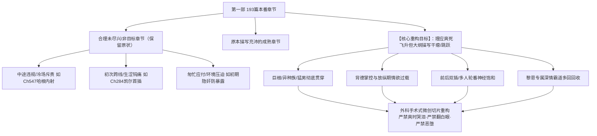

# 第一部本番章节极致快感与身心飞升大纲重构方案

> **工程定位**：第一部（第001-937章）NSFW 本番章节高潮快感与身心极乐描写深度补全与品质升级  
> **底层规则基准**：[AGENTS.md](file:///d:/Siegfried/世界书/AGENTS.md) · [docs/story/_TEMPLATE_RULES.md](file:///d:/Siegfried/世界书/docs/story/_TEMPLATE_RULES.md) · [CLAUDE.md](file:///d:/Siegfried/世界书/CLAUDE.md)  
> **核心配套清单**：[第一部本番章节极致快感精修清单.md](file:///d:/Siegfried/世界书/方案/第一部/第一部本番章节极致快感精修清单.md)（含动态燃尽进度看板）

---

## 核心原则与正向创作法典

### 1. 外科手术式精修：100% 传承精彩灵魂
- **情感纽带字字珍惜**：原作中千锤百炼的高光镜头、神级意象（如脚趾如雪莲绽放、两处共鸣通感、心木树光茧、身体情书、真名唤醒、前因信任承诺等）是全书灵魂，完整保留；
- **保留生动的人物羁绊反差**：完整守护推动快感深化的真实反差与硬核动作（如雷恩平日脱鞋盖被子的守礼与失控解腰带的反差、乔治的图纸铜线、艾德里安的自傲嘴硬、劳拉的高洁英气与日漫内心吐槽弹幕）；
- **微创置换性爱切片**：保留原有的事件骨架、每一段动人对白与心理推移，仅对快感干瘪、描写跳跃的性爱过程进行深度感官升级。

### 2. 电影级沉浸视听切片（Show, Don't Tell）
- **沉浸白描**：所有快感、心理与神态均由具体的物理动作与感官反应自然呈现，保持叙事镜头的沉浸质感；
- **体格与压迫感具象化**：通过整根没入、撑满内壁、下腹深处顶出微凸轮廓、肉体撞击的沉闷声浪等真实物理交互呈现体型差，言辞沉稳粗粝；
- **快感与情感自然分界**：极乐绝顶时专注展现放浪承欢、腰胯挺送迎合与娇媚索求；泪光、鼻音与依赖则专属于事后相拥、释怀感动、心疼故人等深情时刻；原有的翻白眼过载、失神神态均完整保留。

### 3. 真实力学与动态姿态承载
- **姿态与受力动态匹配**：依据具体体位（跪趴支撑、仰卧反弓、双腿盘腰、悬空颠簸等）如实描写骨骼、肌肉与重心的承载反应（如手肘撑地借力、背脊拉出战栗弧度、大腿软肉在撞击下微颤、盆骨主动深陷迎合），拒绝机械复读固定套话。

### 4. 契合阶段的角色神髓与高阶气场
- **高阶段掌控与放纵从容**：阶段5、6后期的成熟女主（菲娜、艾玛等）历经百战，面对多人或异类巨物时，从容展现守护者的宏大包容、傲岸气魄与向伴侣展示的放纵索求；
- **艾玛的知性魔女顺从**：着重呈现知性魔女在前后包夹与粗野压迫下，理智崩解、近乎放弃抵抗的隐秘战栗与温润顺从；
- **真实的老夫老妻羁绊**：菲娜与黎恩私下相处自然使用第一人称“我”，在外人身下可骚气自称“菲娜”强化背德反差；旁白一律直呼本名。

### 5. 因人因地的灵魂对白与淫语
- **多维对白互动**：男方粗暴深沉的占有欲逼问与喘息，女方在换气间隙的动情求欢与器量渴求，让语言成为点燃快感的催化剂；
- **语言与风格质感**：纯正 JRPG 与日轻西幻生活流质感，采用真实生理解剖与现代感官词汇（肉棒、肉柱、鸡巴、龟头、茎身），基调为深情羁绊与自由享受。

---

## 一、 背景诊断与工程使命

在第一部（第001-937章）现存的 193 篇本番（性行为等级 9~10）章节中，经过对大纲情境描写的全面检视，发现存在显著的**快感描摹极化与叙事断层现象**：



1. **两类不同性质的章节分野**：
   - **第一类（确实未尽兴）**：由于客观剧情阻碍、角色心理壁垒未破、违背约定导致愤怒冷场（如哈根直接内射被菲娜冰冷掰开手指）、或是初次插入时的酸胀钝痛与紧张防备。这些章节**合理保留克制与不尽兴**，绝不能强行拔高快感；
   - **第二类（应爽未写透，核心目标）**：按照剧情发展、伴侣体格尺寸（如雷恩15.5cm深麦色极粗、牛头人22cm巨根、黎恩18cm专属）、双方心理默契或放纵程度，女主在此情境下**生理与心理上必然迎来狂暴的极乐高潮、身心彻底融化、子宫持续痉挛吸吮、宛如要被彻底受孕灌满般失神脱力**。然而，现存大纲往往出现“刚开始抽插 ➔ 下一句男方射精”、“高潮了三次（一句话带过）”等严重匮乏肉体物理细节的跳跃。
2. **本方案的使命**：
   - 建立严谨的甄别排查法则，精准剥离合理未尽兴章节，锁定全部“应爽未写透”的章节（共 98 篇）；
   - 构建 13 个批次的推进矩阵（每批不超过 10 篇）；
   - 制定严密的物理感官描写法典，在**坚决不出现“翻白眼”、“恶堕”以及“爽时哭泪”**的前提下，将震撼人心的身心飞升与极致快感彻底写透。

---

## 二、 阶段1：怎么筛选排查出这种章节（甄别准则与排查流程）

### 1.1 排除类：合理未尽兴与非目标章节（保留原状）

| 类型 | 典型情境特征 | 代表章节 | 排除逻辑 |
| :--- | :--- | :--- | :--- |
| **① 边界违规与冷场中断型** | 男方违反安全约定（如未准许内射）、女方产生心理警惕、愤怒或立刻降温。 | Ch 547（哈根内射被逐节掰开手指）、Ch 744（艾玛因哈根破除“蹭蹭”而冷眼警告） | 心理机制被冷理智打断，生理上处于紧绷排斥，强加极乐属于人设崩塌。 |
| **② 初次跨线与钝痛主导型** | 女主第一次接受该男性的插入，甬道尚未完全适应，心理充满知行撕裂，生理重点在酸胀、撕裂感与防备。 | Ch 284（菲娜与凯尔首次，生涩微痛，黎恩在旁握手，最后推阻外射） | 此时的叙事张力在于“跨线的心理战栗”而非肉欲狂欢。 |
| **③ 险境压迫与仓促避险型** | 身处敌情巡逻、极易暴露的死角，双方高度警惕，匆匆结合或被迫中断。 | 早期密林巡逻死角避险章节 | 神经高度紧绷抑制了副交感神经的高潮释放。 |
| **④ 纯仪式与契约象征型** | 篇幅与重心集中在古代魔法、圣光共鸣或契约印记，性行为纯属辅助仪式。 | 序章部分仪式章节 | 叙事动力在奇幻史诗，而非肉欲沉沦。 |

### 1.2 命中类：理应绝顶爽爆却被轻描淡写的核心目标

只要符合以下四大动力学维度之一，且大纲目前缺乏深度生理高潮切片描写的，即为**必须重构的目标章节**：

```
命中条件 = 【强生理刺激 / 极致背德解放 / 多穴极限开发 / 正配深情重占】 ∩ 【大纲现存快感描写评分 ≤ 阈值】
```

1. **维度 A：体格与器量碾压（生理物理暴击）**
   - 雷恩（188cm / 15.5cm 最粗深麦色骑士体魄，沉稳撞击如同重锤）；
   - 艾德里安（182cm / 17cm 麦色长茎，浪子舌技与精准角度碾磨）；
   - 乔治（工装老实人爆发蛮力按压，反差发狠粗暴深凿）；
   - 矮人兄弟（多尔金粗壮如门轴巨柱、哈根麦酒工坊沉浑原始）；
   - 牛头人（250cm / 22cm 极粗暴虐）；
   - 满月狼人（205cm+ / 21cm 锁结膨胀卡死）；
   - 蜥蜴人加尔（20cm 矛尖硬茎，带粗糙肉刺与尾部缠绕束缚）；
   - 黎恩（178cm / 18cm 雄壮挺拔，八叶剑圣腰腹爆发力与专属深顶）。
2. **维度 B：背德放纵与掌控反噬（心理内啡肽狂飙）**
   - 阶段 5（享受和掌控）中后期至阶段 6（放纵）、阶段 8（后日谈）。在黎恩一门之隔/窗外注视下被他人贯入，或在公共场所（会议长桌、工坊工作台、宴会木料堆阴影）进行放肆性爱。极度羞耻直接转化为海啸般的多巴胺。
3. **维度 C：多重贯通与连续车轮战（感官过载饱和）**
   - 前后双插（Ch 780）、三穴同时贯通（Ch 800 矮人三兄弟）、多人轮番群交（Ch 612, Ch 799, Ch 810, Ch 935）。全身所有敏感神经末梢被同时超负荷激活，呼吸被彻底打碎，进入深度感官白化。
4. **维度 D：黎恩专属的绝对主权回收（身心深度归巢）**
   - 在被其他男性开发或内射后，黎恩带着吃醋、强势压制与极致宠溺进行的“重新填满仪式”（如 Ch 472、Ch 763 中途接手）。菲娜卸下全部防备，毫无保留地放浪娇吟、身心被彻底干透。

---

## 三、 阶段2：章节分批次推进矩阵（13大批次演进体系，每批 ≤ 10 章）

全库锁定 98 篇待重构章节，严格按照**“每个批次不超过 10 章、同力学特征聚类”**的原则拆分为 13 批：

| 批次编号 | 批次主题 | 篇数 | 包含章节 ID |
| :---: | :--- | :---: | :--- |
| **第 1 批** | **黎恩正配专属·深情霸道回收篇** | 9 篇 | 113, 266, 285, 286, 339, 518, 727, 814, 824 |
| **第 2 批** | **艾德里安·贵族浪子技巧失守篇** | 6 篇 | 448, 631, 643, 677, 684, 774 |
| **第 3 批** | **雷恩骑士·魁梧体魄与沉稳贯入篇** | 7 篇 | 253, 499, 524, 560, 614, 681, 806 |
| **第 4 批** | **乔治工坊·老实人反差与工装发狠篇** | 9 篇 | 427, 456, 510, 532, 533, 564, 679, 864, 921 |
| **第 5 批** | **凯尔学者（上）·生涩跨线与调弄初试篇** | 7 篇 | 158, 283, 284, 411, 439, 490, 511 |
| **第 6 批** | **凯尔学者（下）·逆风反推与放纵欢愉篇** | 7 篇 | 512, 514, 516, 567, 655, 763, 839 |
| **第 7 批** | **矮人兄弟·粗壮如门与麦酒工坊篇** | 9 篇 | 530, 531, 546, 672, 673, 715, 748, 886, 909 |
| **第 8 批** | **魔兽与异族·牛头暴虐与狼人锁结篇** | 8 篇 | 659, 660, 840, 841, 846, 889, 897, 905 |
| **第 9 批** | **极限过载·多重贯通与群交盛宴篇** | 4 篇 | 640, 743, 796, 810 |
| **第 10 批** | **艾玛专属（上）·魔女初破与工坊接触篇** | 9 篇 | 481, 557, 559, 583, 599, 608, 635, 636, 652 |
| **第 11 批** | **艾玛专属（下）·双重内射与全通放纵篇** | 8 篇 | 674, 766, 780, 799, 894, 917, 926, 933 |
| **第 12 批** | **劳拉英气女骑士·受攻破防与放荡归顺篇** | 10 篇 | 320, 505, 506, 617, 695, 789, 833, 836, 845, 928 |
| **第 13 批** | **奥蕾莉亚与亚莉莎·黄金罗刹与傲娇千金篇** | 5 篇 | 417, 634, 859, 861, 888 |

---

## 四、 阶段3：正式改——大纲骨力原则与精彩对白示范

### 3.1 大纲骨力法则：拒绝词藻堆砌，聚焦行动与淫语
世界书的情境是推进剧情的大纲，绝非浮夸散文。精修的目标是强化**干脆利落的体位动作、直击灵魂的精彩淫语/对白、真实的生理承载与高潮结果**，坚决舍弃一切空洞的形容词堆砌与虚浮比喻：

1. **动作与体位干脆清晰**：交代清楚发力点、进出节律、深顶与贯穿的物理动作，拒绝虚浮的姿态描摹；
2. **灵魂对白与淫语优先**：把性张力留给人物的语言交锋（男方的失控逼问/粗暴沉哑、女方的放浪索求/动情迎合），对白是点燃快感的核心；
3. **纯粹真实的生理沉沦**：内壁绞紧、整根没入、下腹深处顶实、腹腔灌满与事后脱力，用朴实而硬核的感官白描呈现快感，绝不堆砌冗余的网文式修饰词。

### 3.2 经典章节改造对比范例（Before & After）

#### 范例 1：第 471 章《艾德里安的从容——浪子的本番》情境 7（艾德里安跪趴后入深顶）

* **【原版现状（干瘪跳跃、男单向、女主仅有一声叫）】**：
  > `7. 艾德里安大掌狠狠扣紧她的胯骨，开始大开大合地抽送，每一下都重重撞进最深处。皮肉剧烈拍击的脆响混着黏腻的水声在屋里回荡，床架发出沉闷的晃动。菲娜仰起脖颈，在连续猛烈的冲撞里又叫了一声，粉发凌乱地甩动，那双水汽弥漫的琥珀色眼眸直直望向门口窗帘的方向。黎恩的手指死死扣进窗框木刺里，那一瞬他几乎确定她透过缝隙看到了自己。艾德里安喉间爆发出一声低哑沉粗的低吼，在最深处狠狠抵住抽搐的宫口，滚烫的浓精尽数射进了她的小穴深处。抽出来时精液沿着她发抖的大腿内侧一路淌下，她依旧脱力地跪趴在床上，两腿剧烈颤抖着，根本合不拢。`

* **【改后示范（保留背德注视，加入粗暴逼问与放浪淫语，动作干脆有力）】**：
  > `7. 艾德里安单手按死菲娜的后腰把她压向床榻，胯部发狠地大开大合撞击，粗长麦色的茎身顺着泥泞内壁每一次都凿到花径最深处。皮肉沉闷的拍击声混着水声在屋里回荡。艾德里安在身后粗喘着低笑：“后面咬得这么紧……菲娜，窗帘那边有什么好看的？”菲娜双臂撑在床褥上，在深顶的酸麻中仰起脖颈，目光透过窗帘缝隙正对上窗外黎恩的青紫瞳孔，在门外黎恩的注视下放浪娇吟出声：“……好看得……快受不了了……艾德里安……别停……全顶到底了……啊哈……”内壁随着极乐剧烈抽搐绞咬，艾德里安低吼一声在最深处死死顶住宫口，大股滚烫浓精尽数灌进子宫深处。抽身拔出时白浊顺着大腿内侧汩汩流下，菲娜脱力地趴在凌乱的褥间，双腿酸软得合不拢。`

#### 范例 2：第 763 章《一次不够——凯尔的极限》情境 10（黎恩接手后引爆三连绝顶）

* **【原版现状（报表式统计、快感严重缩水）】**：
  > `10. 凯尔射完第二次之后靠在床头，眼镜歪到了下巴，但凯尔是笑着的。菲娜在黎恩的凶猛撞击中高潮了，第一次的时候菲娜叫了黎恩的名字；第二次的时候菲娜反手攥住了凯尔的手腕，攥得指节发白；第三次的时候菲娜整个人彻底软在床上，双腿合不拢，蜜穴里全是黎恩的精液。凯尔两次的痕迹，在菲娜嘴边的、下巴上的、锁骨上的，还在。`

* **【改后示范（呈现三次递进层次，加入占有欲逼问与背德沉沦淫语，舍弃过度修饰）】**：
  > `10. 凯尔靠在床头脱力地喘着粗气，歪斜的眼镜后映着床上的场景。黎恩自后方按住菲娜发颤的腰胯，带着凯尔留下的白浊沉重贯入被撑熟的花径深处。第一波深顶让菲娜失控仰头喊出黎恩的名字，内壁剧烈绞紧；黎恩毫无停顿地大开大合抽送，在凯尔注视下按着菲娜的腰发狠逼问：“当着凯尔的面被我干……很兴奋吗？”菲娜反手死死掐紧凯尔的手腕，整张脸泛着情欲的酡红，失神呢喃着迎合：“太深了……黎恩……好喜欢被你这样干……”直到黎恩在极限时将菲娜压在胸前、粗大顶端死死抵住宫口彻底内射，滚烫的精液将腹腔完全灌满。菲娜浑身脱力地瘫在黎恩怀里急促喘息，腿心合不拢的花唇间汩汩溢出两人的浓稠白浊。`

---

## 五、 动态燃尽交付规则

1. **第一句动态指示**：[第一部本番章节极致快感精修清单.md](file:///d:/Siegfried/世界书/方案/第一部/第一部本番章节极致快感精修清单.md) 首行始终明确标记当前正在执行的批次与全工程剩余篇数；
2. **物理扣除燃尽（Done = Delete）**：每执行完一个批次（≤ 10 章），第一句推进至下一批次，并直接将已完成批次的清单内容从该 `.md` 文件中彻底删除；
3. **闭环完成**：当第 13 批次执行完毕，清单文件彻底燃尽清空，全工程宣告胜利竣工！
