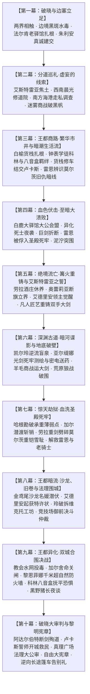

# 第二部方案与写作指导中枢

> **文档定位**：第二部（维里迪亚王国篇 / 雾帷之后）**统一全案规划、大纲架构、母案联动与接盘总控中枢**。  
> **当前工程主状态**：🎉 **【十幕三十阶段详规全线竣工定稿】**（全篇十幕三十阶段体系，90 张实体卡无缝穿透；当前全面进入**分阶段详规深化扩充、情节调整与长线剧情演进阶段**）。  
> **底层法典基准**：严格遵循 [`AGENTS.md`](../../AGENTS.md)（第一章）、[`viridia-writer`](../../.agents/skills/viridia-writer/SKILL.md) 技能、[`writing-guards.md`](../../.agents/rules/writing-guards.md) 与 [`lexicon.md`](../../.agents/rules/lexicon.md)。

---

## 一、 宏观十幕主线演进全景架构



---

## 二、 方案集群架构与 7 大母案联动速查矩阵

编写、调整详规或增补章节时，必须动态联动以下母案中枢与工具链：

| 方案文件 / 工具 | 核心职责与管理范围 | 推荐调用时机 |
| :--- | :--- | :--- |
| [`00_第二部宏篇主线总纲与方案管理中枢.md`](主线与世界扩充方案/00_第二部宏篇主线总纲与方案管理中枢.md) | **全局架构与调度总控**：方案集群解耦、十幕三十阶段总览基准表、分阶段详规管理准则与红线。 | 全局架构统筹、核对幕阶段容量基准 |
| [`01_宏篇主线剧情总大纲与分幕导航.md`](主线与世界扩充方案/01_宏篇主线剧情总大纲与分幕导航.md) | **宏篇演进总舵**：十幕三十阶段整体定位、至暗挫折与多线救赎节点、分阶段详规直达路由。 | 宏观剧情推演、查阅各阶段核心事件脉络 |
| [`02_王国地理版图、封建社会阶层与货币经济基准.md`](主线与世界扩充方案/02_王国地理版图、封建社会阶层与货币经济基准.md) | **封建现实与经济锚定**：五大地理版图、170km时空尺度、阶层结构、货币（旧银克朗/紫铜便士）与通关文牒。 | 描写地理环境、集镇交易、物价尺度、城防关卡 |
| [`03_生活流张弛律动、营地温情后勤与工坊反差方案.md`](主线与世界扩充方案/03_生活流张弛律动、营地温情后勤与工坊反差方案.md) | **呼吸感与张弛律动**：三段式张弛节律（高压 ➔ 市井 ➔ 营地）、爱丽榭大食堂温情、乔治工坊科技反差、篷车沙龙生活流。 | 扩充日常章节、设计战后休整与角色温情互动 |
| [`04_反派双重武装底牌、战斗克制链与黑幕权谋博弈方案.md`](主线与世界扩充方案/04_反派双重武装底牌、战斗克制链与黑幕权谋博弈方案.md) | **战技与克制链**：古代暗影炼金兵器（发条机兽）+ 畸变异端死士、克制拆解机制、双首恶权谋博弈裂痕。 | 设计遭遇战、BOSS战、潜入破障与反派交锋 |
| [`05_异族特遣跨境支援动因、部族约束与战术分工方案.md`](主线与世界扩充方案/05_异族特遣跨境支援动因、部族约束与战术分工方案.md) | **异族特遣动线**：矮人/狼人/蜥蜴人参战深层动因、部族自治法则、三大特遣队（地底/商道/后方）分工协作。 | 异族同伴参战、特种作战动线设计 |
| [`06_第二部主线跨幕连续性与全局物理状态机.md`](主线与世界扩充方案/06_第二部主线跨幕连续性与全局物理状态机.md) | **全局单向权威状态机**：四大物理铁证流向、角色伤情/装备耐久链、170km时空周历标尺、反派认知度、平民齿轮闭环。 | 跨幕承接、核验关键物证与角色状态、校验时间线 |

---

## 三、 完整目录索引

```
方案/第二部/
├── README.md                                    # 【🔥核心总控】第二部方案导航与总控中枢（本文件）
├── 第二部实体设定档案库规划与实施方案.md                   # docs2 实体设定档案库（角色/NPC/地点/生物）构建规划
│
├── 主线与世界扩充方案/                          # 【宏篇主线】王道史诗演进、风土世界、多日常与状态机中枢
│   ├── 00_第二部宏篇主线总纲与方案管理中枢.md           # 统一管理中枢、十幕三十阶段总览基准表与详规管理法典
│   ├── 01_宏篇主线剧情总大纲与分幕导航.md          # 十幕三十阶段演进体系与分幕导航中枢
│   ├── 02_王国地理版图、封建社会阶层与货币经济基准.md  # 五大地理版图、社会阶层、物价货币与风土基准
│   ├── 03_生活流张弛律动、营地温情后勤与工坊反差方案.md          # 营地大食堂、工坊反差、旅途市井与张弛节律设计
│   ├── 04_反派双重武装底牌、战斗克制链与黑幕权谋博弈方案.md      # 古代发条机兽 + 畸变死士克制链与黑幕权谋博弈
│   ├── 05_异族特遣跨境支援动因、部族约束与战术分工方案.md      # 五族参战动因、三大特遣队职能与战术分工
│   ├── 06_第二部主线跨幕连续性与全局物理状态机.md # 跨幕契约握手、证物链、角色伤病链与时空日历
│   ├── 艾德里安主线剧情扩充大纲与意见建议.md   # 【双主线A专项】艾德里安角色弧线深化、吐槽内心独白、成人向张力与空位激活方案
│   └── 分阶段详规/                              # 【落地正文】十幕三十阶段详规正文集群
│       ├── 01_第一幕_破晓与边塞立足/            # 阶段一至阶段三详规
│       ├── 02_第二幕_分道巡礼·虚妄的线索/        # 阶段四至阶段七详规
│       ├── 03_第三幕_王都商路·繁华市井与暗潮生活流/ # 阶段八至阶段十一详规
│       ├── 04_第四幕_血色伏击·至暗大溃败/        # 阶段十二至阶段十四详规
│       ├── 05_第五幕_绝境流亡·篝火重铸与艾斯特雷亚之誓/ # 阶段十五至阶段十七详规
│       ├── 06_第六幕_深渊古道·暗河谍影与地底破壁/ # 阶段十八至阶段二十详规
│       ├── 07_第七幕_惊天劫狱·血洗圣殿死牢/      # 阶段二十一至阶段二十三详规
│       ├── 08_第八幕_王都暗流·沙龙旧卷与法理围城/ # 阶段二十四至阶段二十六详规
│       ├── 09_第九幕_王都异化·双城合围决战/      # 阶段二十七至阶段二十九详规
│       └── 10_第十幕_破晓大审判与黎明宪章/      # 阶段三十详规
│
├── 卢卡斯NSFW/                                  # 【少壮派】白鹰先锋骑兵队长卢卡斯（16.5cm）隐秘背德企划
│   ├── 00_卢卡斯NSFW情境企划全案总纲.md
│   ├── 01_圣殿马房暗查与骑士戒律沉沦篇.md        # 菲娜线（避难娇妻伪装与破戒沉沦）
│   ├── 02_迷迭香商行利益迷醉篇（卢卡斯×玛格丽特）.md # 玛格丽特线（封建权钱色利益博弈与熟女调教）
│   ├── 03_晨光药舍创伤破戒篇（卢卡斯×艾琳娜）.md     # 艾琳娜线（战伤清创、强效颠茄与圣职破戒）
│   └── 04_晨光大教堂信仰破戒两部曲篇（卢卡斯×菲娜）.md # 菲娜线（告解室隔板盲摸与管风琴圣咏深喉）
│
├── 朱利安NSFW/                                  # 【王室暗流】第一王子朱利安（16.5cm）深宫密盟背德企划
│   ├── 00_朱利安NSFW情境企划全案总纲.md
│   ├── 01_白金深闱与密室地籍篇.md               # 菲娜线（挂毯后借位深喉与地籍图后入）
│   └── 02_魔女暗影拔毒与深宫救赎篇（艾玛×朱利安）.md # 艾玛线（古代魔女以身导毒、生死绝境救赎与战后闭环）
│
├── 莫尔茨NSFW/                                  # 【要塞地牢】典狱长莫尔茨（19cm）市井与要塞47套全案企划
│   ├── 00_莫尔茨NSFW情境企划全案总纲.md          # 人设动力学、全景实施矩阵、核心动因与称谓规范
│   ├── 01_黑野猪酒馆市井情趣篇（方案一至方案十六）.md # 卷一：市井酒馆私通与舞台展演（16套方案）
│   ├── 02_圣殿要塞深入与要职近身篇（方案十七至方案三十七）.md # 卷二：要塞内廊、浴堂、冷锻与主堡寝居（21套方案）
│   ├── 03_圣殿地牢深入与核心情趣篇（方案三十八至方案四十五）.md # 卷三：地牢前哨、忏悔石室与群骑围观（8套方案）
│   ├── 04_王都暗渠突围与终极收束篇（方案四十六至方案四十七）.md # 卷四：暗渠激流突围与终极情感收束（2套方案）
│   ├── 莫尔茨NSFW剧情融入主线架构方案.md         # 与十幕主线节奏咬合、分幕对应与触发撤离机制
│   ├── 莫尔茨NSFW时间线拉长与主线节奏校准临时补丁.md # 时间线拉伸降频与生活流呼吸感咬合方案
│   └── 莫尔茨NSFW全案分卷导航与索引.md # 早期地牢架构方案与分卷导航索引
│
└── 已执行/                                      # 历史方案与阶段性进度指南归档
    └── 第二部主线进度与全流程推进指南.md          # 【已竣工归档】十幕初始阶段详规推进指南
```

---

## 四、 核心管理原则与红线

1. **绝对物理隔离原则**：
   - **第一部 vs 第二部**：第一部属于营地时期（Eldoria 森林 13×10km 舞台），重心在于微创精修与碎片化修复；第二部属于雾帷消散后宏观大陆时期（维里迪亚王国 170km 舞台），重心在于多线政治叙事与宏大空间舞台调度。两者的写作经验、人设状态与技术规则严禁混为一谈；
   - **主线王道史诗 vs 角色专属 NSFW 企划**：推进王道主线宏篇史诗时，100% 聚焦于宏大史诗、封建历史质感与正向冲突，严禁混入或询问任何 NSFW 专属章节。

2. **单一权威源准则（SSOT Hierarchy）**：
   - 设定数据与实体映射严格以 `docs2/` 为第一权威基准（真实源层级：`docs2/` > 母案方案集群 > 幕级大纲 > 阶段详规）；
   - 详规扩充与调整以各阶段详规为载体，宏观基准以 [`00_第二部宏篇主线总纲与方案管理中枢.md`](主线与世界扩充方案/00_第二部宏篇主线总纲与方案管理中枢.md) 与本 `README.md` 为统一指挥中枢。

3. **王国零导力原则（Zero Orbal Tech）**：
   - 维里迪亚王国全境无导力。王国原住民使用油灯、烛火、石炭与马车。导力器仅属于帝国穿界者且须保持皮革遮蔽外壳伪装。

4. **体制与文风规范**：
   - 圣殿大要塞全境无世俗军队与现代官僚，属于封建骑士团体制。严禁使用世俗军队与行政表述，统一采用骑士团、要塞守备、先锋骑兵队、巡防、要塞典狱长；
   - 全库严格执行 [`lexicon.md`](../../.agents/rules/lexicon.md) 与 [`writing-guards.md`](../../.agents/rules/writing-guards.md)，杜绝中式古代市井话本套路、四字成语连缀与修真概念。

5. **地点卡纯物理物象化铁律**：
   - `docs2/location/` 下的词条卡仅提供空间尺寸、材质、声光掩蔽与常态功能；所有剧情走向、伏笔与冲突只记录于方案与详规中。
