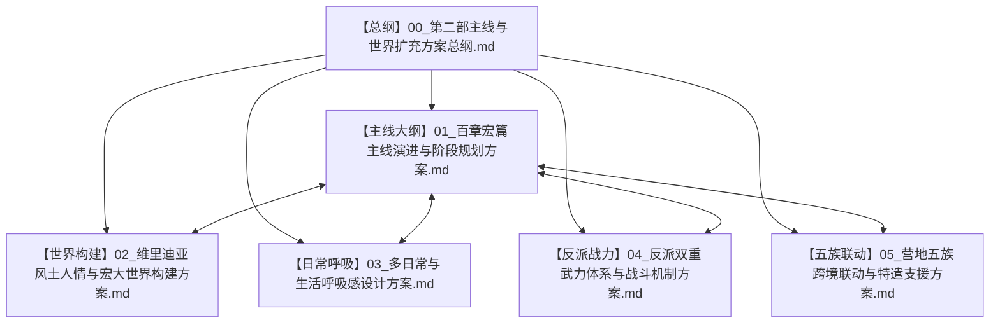

# 第二部主线与世界扩充方案总纲（管理中枢）

> **状态**：方案骨架搭建阶段（未正式开写，保持高度弹性与可变性）  
> **更新时间**：2026-09-23  
> **定位**：第二部宏大叙事、百章篇幅、丰富世界观、多日常呼吸感与多方战力联动的总管理文件。  
> **管理原则**：**模块化解耦、随时增删调整、独立版本演进**。

---

## 一、方案集群体系全景

为适应“篇幅更长更宏大、世界风土更丰富、日常呼吸感更充沛、反派双重武力配置、五族跨境深度联动”的全新需求，本方案集群解耦为 5 个互为支撑的专门模块，由本总纲统一调度与索引：

---

## 二、子方案清单与定位一览

| 编号 | 方案文件 | 核心职责与管理范围 | 状态 |
| :---: | :--- | :--- | :---: |
| **00** | [00_第二部主线与世界扩充方案总纲.md](file:///home/nanhu2/comfyui/世界书/方案/第二部/主线与世界扩充方案/00_第二部主线与世界扩充方案总纲.md) | 统一管理中枢、修改日志、模块交叉指引、核心原则规范 | **当前生效** |
| **01** | [01_百章宏篇主线演进与阶段规划方案.md](file:///home/nanhu2/comfyui/世界书/方案/第二部/主线与世界扩充方案/01_百章宏篇主线演进与阶段规划方案.md) | 100~120+章宏篇架构、四幕十一阶段演进表、双线螺旋咬合节点、高潮章节 | **初稿完备** |
| **02** | [02_维里迪亚风土人情与宏大世界构建方案.md](file:///home/nanhu2/comfyui/世界书/方案/第二部/主线与世界扩充方案/02_维里迪亚风土人情与宏大世界构建方案.md) | 王国五大地理版图、社会封建阶层、物价货币、交通邮驿、零导力反差 | **初稿完备** |
| **03** | [03_多日常与生活呼吸感设计方案.md](file:///home/nanhu2/comfyui/世界书/方案/第二部/主线与世界扩充方案/03_多日常与生活呼吸感设计方案.md) | 营地大食堂、工坊研制、篷车旅途、酒馆闲趣、私密张力与情感回流机制 | **初稿完备** |
| **04** | [04_反派双重武力体系与战斗机制方案.md](file:///home/nanhu2/comfyui/世界书/方案/第二部/主线与世界扩充方案/04_反派双重武力体系与战斗机制方案.md) | 古代暗影炼金兵器 + 畸变异端骑士死士、战斗克制拆解、双BOSS权谋出招 | **初稿完备** |
| **05** | [05_营地五族跨境联动与特遣支援方案.md](file:///home/nanhu2/comfyui/世界书/方案/第二部/主线与世界扩充方案/05_营地五族跨境联动与特遣支援方案.md) | 矮人穿山通道、狼人荒野嗅探、蜥蜴人水网潜渡、五族参战动因与文化碰撞 | **初稿完备** |

---

## 三、总体设计铁律与基调（防漂移红线）

无论后续方案如何扩充或变动，必须严格遵守以下四条底线规则：

1. **绝对零导力原则（Zero Orbal Tech in Viridia）**：
   * 维里迪亚王国全境不存在任何导力网络。原住民不知道导力是什么，社会能源依赖马力、水车、石炭、蜡烛与火把。
   * 帝国穿界者携带的 ARCUS 战术导力器必须配备乔治特制的**低外溢皮革遮蔽外壳**；导力光芒一旦在公共场合暴露，会被教会当场定性为“异端巫术/妖物”通缉。

2. **双主线主角的命运动能独立性**：
   * 黎恩作为灰之骑士，是全剧的战术底牌与跨界联络人；但**绝对不能抢夺原住民的命运决断权**。
   * 艾德里安必须亲自完成洗刷家族冤屈与告慰母亲遗言的历程；雷恩必须亲自在大要塞圣殿大校场完成对圣殿誓言的重构与解脱。

3. **宏大篇幅下的“张弛律动”**：
   * 拒绝高强度连环追杀导致的审美疲劳。严守“高压调查/惊险战斗 ➔ 驿馆/酒馆伪装 ➔ 营地温情后方回流/日常整备”的三段式呼吸节律。
   * 日常章节不是无意义的灌水，而是承载角色羁绊、风土体验与心理锚定的重要血肉。

4. **剧透物理隔离原则**：
   * 本方案集群内的所有大纲演进、BOSS下场与反转结局，仅供编剧与写作设计参考；
   * **严禁将剧情结局反向写入 `docs2/location/*.TXT` 或 `docs2/character/*.TXT`**。词条卡必须保持客观物理容器的纯净性。

---

## 四、方案演进与变动日志

* **2026-09-23（v1.0.0）**：
  * 正式建立方案集群中枢；
  * 根据用户指示，全面扩充篇幅至 100~120+ 章体量；
  * 引入反派“双重武力（炼金兵器+畸变骑士）”配置；
  * 新增五族跨境特遣联动与大篇幅风土日常体系。
* **2026-09-23（v1.0.1）**：
  * 全库一致性与文风审查通过；
  * 修正法尔肯老驿馆与王都黑野猪酒馆的地理对应关系；
  * 恢复“叹息之壁”经典战术比喻；
  * 在 `docs2/creature/` 下正式补齐 `暗影噬光傀儡`（CRT_D2_08）与 `暗影忏悔死士`（CRT_D2_09）两张核心怪物卡，并同步更新总览。
* **2026-09-24（v1.0.2）**：
  * 阶段二【边境暗流与要塞破关】深度细化完毕（扩充为第 9 ~ 19 章，共 11 章），建立详规子方案 `第一幕_阶段二_边境暗流与要塞破关详规.md`；
  * 纠正“帝国公文在维里迪亚关隘出示”的跨位面逻辑漏洞，确立艾德里安以王国本土过期商会特许状交涉受阻为正规入口；
  * 完成“行商常规盘查 ➔ 流民黑斑水毒 ➔ 菲娜草药救赎 ➔ 暴雨夜战技破局 ➔ 截获教廷实验证物 ➔ 戴里克哨长相认与古代涵洞秘密放行”的递进闭环；
  * 建立全方位逻辑硬伤与文风世界观偏移的五维核查审查机制。
* **2026-09-26（v1.0.3）**：
  * 全面清除方案集群中的古风文言词汇与中式武侠概念（拔除“碎银/碎银粒”、“官道”、“路引”、“四合院”、“中军大帐”、“千斤闸”、“身法游龙”、“剑意”等），全面锚定欧陆封建与轨迹 JRPG 文风；
  * 设立专属正向生活史语料对照机制，创建专属创作技能与质感防御护栏。

