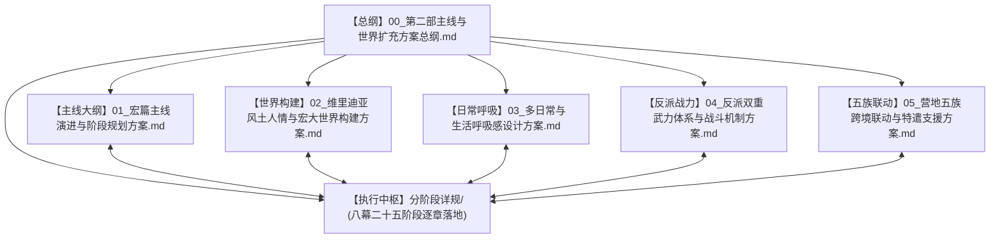
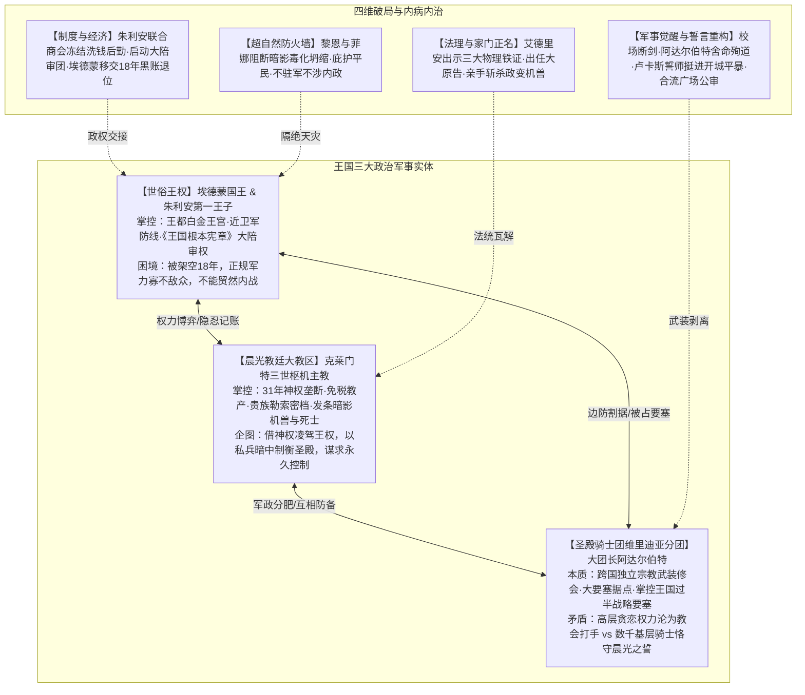
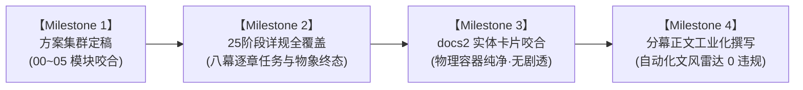

# 第二部主线与世界扩充方案总纲（管理中枢）

> **状态**：方案骨架搭建阶段（未正式开写，保持高度弹性与可变性）  
> **定位**：第二部宏大叙事、丰富世界观、多日常呼吸感与多方战力联动的总管理文件。  
> **管理原则**：**模块化解耦、随时增删调整、独立版本演进**。

---

## 一、 方案集群体系全景

为适应“宏篇史诗、世界风土更丰富、日常呼吸感更充沛、反派双重武力配置、五族跨境深度联动”的全新需求，本方案集群解耦为 5 个互为支撑的专门模块，并由**分阶段详规**承接逐章落地，由本总纲统一调度与索引：

```mermaid
graph TD
    Root["【总纲】00_第二部主线与世界扩充方案总纲.md"]
    
    Sub1["【主线大纲】01_宏篇主线演进与阶段规划方案.md"]
    Sub2["【世界构建】02_维里迪亚风土人情与宏大世界构建方案.md"]
    Sub3["【日常呼吸】03_多日常与生活呼吸感设计方案.md"]
    Sub4["【反派战力】04_反派双重武力体系与战斗机制方案.md"]
    Sub5["【五族联动】05_营地五族跨境联动与特遣支援方案.md"]
    
    Stages["【执行中枢】分阶段详规/ (八幕二十五阶段逐章落地)"]

    Root --> Sub1
    Root --> Sub2
    Root --> Sub3
    Root --> Sub4
    Root --> Sub5
    Root --> Stages

    Sub1 <--> Stages
    Sub2 <--> Stages
    Sub3 <--> Stages
    Sub4 <--> Stages
    Sub5 <--> Stages
```

---

## 二、 子方案与分阶段详规体系一览

### 2.1 宏观子方案清单

| 编号 | 方案文件 | 核心职责与管理范围 | 状态 |
| :---: | :--- | :--- | :---: |
| **00** | [00_第二部主线与世界扩充方案总纲.md](file:///home/nanhu2/comfyui/世界书/方案/第二部/主线与世界扩充方案/00_第二部主线与世界扩充方案总纲.md) | 统一管理中枢、模块交叉指引、核心原则规范、实施路线图 | **当前生效** |
| **01** | [01_宏篇主线演进与阶段规划方案.md](file:///home/nanhu2/comfyui/世界书/方案/第二部/主线与世界扩充方案/01_宏篇主线演进与阶段规划方案.md) | 宏篇史诗八幕二十五阶段演进体系、41处舞台深度盘活、名媛社交高光、至暗挫折与多维破局、高潮战役与黎明宪章 (265+章) | **当前生效** |
| **02** | [02_维里迪亚风土人情与宏大世界构建方案.md](file:///home/nanhu2/comfyui/世界书/方案/第二部/主线与世界扩充方案/02_维里迪亚风土人情与宏大世界构建方案.md) | 王国五大地理版图、王都核心舞台、社会封建阶层、物价货币、交通邮驿、零导力反差 | **当前生效** |
| **03** | [03_多日常与生活呼吸感设计方案.md](file:///home/nanhu2/comfyui/世界书/方案/第二部/主线与世界扩充方案/03_多日常与生活呼吸感设计方案.md) | 营地大食堂、工坊研制、篷车旅途、沙龙清谈、浴堂闲趣、私密张力与情感回流机制 | **当前生效** |
| **04** | [04_反派双重武力体系与战斗机制方案.md](file:///home/nanhu2/comfyui/世界书/方案/第二部/主线与世界扩充方案/04_反派双重武力体系与战斗机制方案.md) | 古代暗影炼金兵器 + 畸变异端骑士死士、战斗克制拆解、双BOSS权谋出招与分肥破裂机制 | **当前生效** |
| **05** | [05_营地五族跨境联动与特遣支援方案.md](file:///home/nanhu2/comfyui/世界书/方案/第二部/主线与世界扩充方案/05_营地五族跨境联动与特遣支援方案.md) | 矮人重装工程、狼人荒野嗅探、蜥蜴人水网潜渡、五族参战深层动因与文化碰撞 | **当前生效** |

### 2.2 分阶段详规（Stage Plans）管理架构与流水线

* **存放路径**：[分阶段详规/](file:///home/nanhu2/comfyui/世界书/方案/第二部/主线与世界扩充方案/分阶段详规/)
* **命名规范**：`第X幕_阶段Y_XXXX详规.md`（严格映射 01 方案八幕二十五阶段演进体系）
* **定位与职责**：承接 01 宏篇主线大纲，逐阶段拆解章节动线分镜、情境时序任务（动态弹性标号）、核心矛盾与纯物象化终止条件，作为正式撰写 `docs2/story/` 章节实体卡前的**唯一强制前置物**。
* **阶段状态跟踪**：
  * **第一幕**：阶段一（战后新生与两界相触）、阶段二（边境暗流与要塞破关）、阶段三（法尔肯驿镇与边境前哨）——【**已就绪**】
  * **第二幕**：阶段四（艾斯特雷亚焦土与炼金机兽）——【**已就绪**】
  * **后续阶段**：阶段五至阶段二十五（按幕次依序编制详规，详规验收通过后方可开写正文）

---

## 三、总体设计铁律与基调（防漂移红线）

无论后续方案如何扩充或变动，必须严格遵守以下七条底线规则：

1. **绝对零导力原则（Zero Orbal Tech in Viridia）**：
   * 维里迪亚王国全境不存在任何导力网络。原住民不知道导力是什么，社会能源依赖马力、水车、石炭、蜡烛与火把。
   * 帝国穿界者携带的 ARCUS 战术导力器必须配备乔治特制的**低外溢皮革遮蔽外壳**；导力光芒一旦在公共场合暴露，会被教会当场定性为“异端巫术/妖物”通缉。

2. **双主线主角的命运动能独立性与家人同伴定位**：
   * **家人般的同伴与世俗零利益**：黎恩、菲娜与同伴们是艾德里安与雷恩真挚信赖的家人。他们对维里迪亚王国的政治斗争、领土更迭、爵位权势与商道税收**没有任何世俗利益诉求与纠葛**，同行完全出于对同伴的无条件守护与信任；
   * **绝对不喧宾夺主**：艾德里安必须亲自完成洗刷家族冤屈、告慰母亲遗言并亲手斩首叛乱机兽；雷恩必须亲自在圣殿校场完成晨光之誓的重构与解脱。黎恩作为灰之骑士是战术底牌，但绝不抢夺原住民的命运决断权；
   * **暗影力量与轨迹鬼之力同源探寻（第三部核心伏笔）**：
     - **位面法则区隔**：Eldoria森林与维里迪亚王国同属晨光大陆（Luminas）；埃雷波尼亚帝国（塞姆利亚大陆）处于完全独立的异界位面，通过裂隙物理连接；
     - **高位面同源真相**：维里迪亚所利用的“暗影能量”，其底层波动竟与黎恩体内的“鬼之力”源头惊人同源，均源于高维度的“世界外侧”污秽之楔；
     - **叙事分工克制**：第二部中黎恩与菲娜专注于协助同伴平定生化危机、暗中采集黑晶样本；跨位面同源背后的深层宇宙真相与高位面侵蚀，严格留待第三部全面揭晓。

3. **宏大篇幅下的“张弛律动”与三级空间中继防御**：
   * 拒绝高强度连环追杀导致的审美疲劳。严守“高压调查/惊险战斗 ➔ 驿馆/酒馆伪装 ➔ 营地温情后方回流/日常整备”的三段式呼吸节律。
   * 日常章节不是无意义的灌水，而是承载角色羁绊、风土体验与心理锚定的重要血肉。
   * **防御“时空折叠漂移”与封建交通现实**：
     - 维里迪亚南北纵深约 170 公里（森林大本营 0km ➔ 维里迪亚关隘 15km ➔ 法尔肯驿镇 25km ➔ 艾斯特雷亚旧领 70km ➔ 中央王都 120km ➔ 迷雾海港 170km），零导力封建社会仅能依赖四轮重篷车与步行，跨区域往返需数日行程；
     - **确立“三级空间补给与情报中继链”**：
       1. **第一级·森林大本营（战略后方）**：跨界科研破译、重武器重铸、重大伤患调养。**仅在大幕转折与战略休整期回流**，严禁在出击王都或旧领时随心所欲“闪现回营地喝汤”；
       2. **第二级·法尔肯驿镇与迷迭香商行（边境与经济中继）**：两界大宗物资转运、帝国米拉黑市兑换、两界密信接力站；
       3. **第三级·前线流动安全屋（战术支点）**：艾斯特雷亚酒庄地下深窖、王都下城黑野猪酒馆二楼暗室、圣泉大浴堂无武装接头区。长途情报传递必须依托商队平底船、轻骑信使或飞鸽物理接力。

4. **剧透物理隔离原则**：
   * 本方案集群内的所有大纲演进、BOSS下场与反转结局，仅供编剧与写作设计参考；
   * 严禁将剧情结局反向写入静态卡片。词条卡必须保持客观物理容器的纯净性。

5. **章节实施先骨架后撰写原则**：
   * 在全篇所有章节骨架（八幕二十五阶段大纲、动线拆解、情境任务与时序闭环）完全搭建定稿之前，严禁开启任何章节实体卡的实际撰写。
   * 当前核心聚焦于宏篇主线演进、各阶段逐章详规、战力拆解与风土日常交织脉络的完整搭建。

6. **王权与本土主体性防御原则**：
   * **严禁外部救世主包办内政**：维里迪亚王国的政治清算、大陪审团公审与政权交接，必须 100% 由维里迪亚本土力量自主完成。王权（埃德蒙国王手抄密档、朱利安王子启动宪章）、世俗贵族后裔（艾德里安以苦主原告出庭并亲手刺杀政变机兽）、流亡骑士（雷恩唤醒骑士团军魂重践誓言平暴）、以及民间工商业行会（玛格丽特夫人冻结洗钱账户切断后勤），共同构成不可动摇的本土正义闭环。
   * **外部战力定位于“超自然防火墙”**：黎恩（八叶居合/澄澈鬼之力）、塞拉菲娜（炽天使圣光净界）以及VII班同伴，其武力介入严格限制在清除暗影强酸毒液、稳固地脉引力坍缩、阻截生化异变外溢、庇护无辜平民的超自然领域。绝不派遣外国驻军，绝不干涉维里迪亚世俗主权与法统交接。
   * **体制更迭与新主官入驻机制**：
     - 全大陆晨光教会与圣殿骑士团属于跨国性超主权实体，维里迪亚王权无法亦不可能凭空取缔全境信仰与修会；
     - 王室将铁证正式呈送全大陆总廷与总修会，迫使总部公开开除革职克莱门特与阿达尔伯特，并由大陆总部委派声誉卓著、清廉正义的新任主教与新任分团长；
     - 新加冕的朱利安国王以此契机重新谈判并签署《维里迪亚新协约》，和平收回半数要塞防务与税权；至于未来新任主官与王权会演变出怎样的平衡与博弈，全取决于年轻国王的作为与手腕，保留高级 JRPG 封建政治的深度与余韵。

7. **权力阵营二元边界与教廷/圣殿概念防呆红线**：
   * **组织称谓互斥**：晨光教廷（跨国文职宗教神权，主教/司铎/大教堂/中央圣都总廷） vs 圣殿骑士团（跨国独立武装修会，大要塞/大修会分团）。“圣殿”绝非单体建筑或宗教教派；
   * **武装与人员绝对互斥**：
     - **圣殿骑士专属**：正规重装铁骑、白鹰队长卢卡斯、典狱长莫尔茨、老副团长戈德弗里、老哨长巴恩斯、雷恩；
     - **教廷直属人员**：枢机主教克莱门特三世、异端审问官达米安、首席炼金工匠维克托、暗影死士、发条机兽；
     - 🚨 **死刑混淆词**：严禁出现“教廷审判骑士 / 教会骑士”（教廷无骑士建制，决斗出场者为“异端审问厅首席裁决剑士”）；严禁出现“圣殿主教 / 圣殿神官”；
   * **舞台据点互斥**：大教堂/教廷秘库/晨光修道院药舍（严禁写成圣殿修道院）归属教廷；圣殿要塞/圣殿校场/圣殿水牢归属圣殿（**严禁在圣殿搞发条机兽生化实验**）；
   * **罪证归属互斥**：教廷秘库封存古代暗影实验原案与灭口密令（克莱门特签字）；圣殿要塞铁柜私藏前任团长自白与克莱门特分肥密约（阿达尔伯特私藏）；
   * **法统收权互斥**：王权无权单方面取缔超主权信仰，必须将铁证呈送大陆总廷与大修会总团降维开除，签署《维里迪亚新协约》和平收回防务与税权。

### 3.1 维里迪亚王国三权鼎立权力架构矩阵

```mermaid
graph TD
    subgraph 王国三大政治军事实体
        Crown["【世俗王权】埃德蒙国王 & 朱利安第一王子<br/>掌控：王都白金王宫·近卫军防线·《王国根本宪章》大陪审权<br/>困境：被架空18年，正规军力寡不敌众，不能贸然内战"]
        Church["【晨光教廷大教区】克莱门特三世枢机主教<br/>掌控：31年神权垄断·免税教产·贵族勒索密档·发条暗影机兽与死士<br/>企图：借神权凌驾王权，以私兵暗中制衡圣殿，谋求永久控制"]
        Knights["【圣殿骑士团维里迪亚分团】大团长阿达尔伯特<br/>本质：跨国独立宗教武装修会·大要塞据点·掌控王国过半战略要塞<br/>矛盾：高层贪恋权力沦为教会打手 vs 数千基层骑士恪守晨光之誓"]
    end

    subgraph 四维破局与内病内治
        Solve1["【法理与家门正名】艾德里安出示三大物理铁证·出任大原告·亲手斩杀政变机兽"]
        Solve2["【军事觉醒与誓言重构】校场断剑·阿达尔伯特舍命殉道·卢卡斯誓师挺进开城平暴·合流广场公审"]
        Solve3["【制度与经济】朱利安联合商会冻结洗钱后勤·启动大陪审团·埃德蒙移交18年黑账退位"]
        Solve4["【超自然防火墙】黎恩与菲娜阻断暗影毒化坍缩·庇护平民·不驻军不涉内政"]
    end

    Crown <-->|权力博弈/隐忍记账| Church
    Church <-->|军政分肥/互相防备| Knights
    Crown <-->|边防割据/被占要塞| Knights

    Solve1 -.->|法统瓦解| Church
    Solve2 -.->|武装剥离| Knights
    Solve3 -.->|政权交接| Crown
    Solve4 -.->|隔绝天灾| Crown
```

#### 3.1.1 政治生态核心潜规则：【台面下的公开共识 vs 台面上的法统假面】
在维里迪亚王国，政治博弈的核心戏剧张力维系于一层微妙的“窗户纸”：
* **台面下心照不宣（公开的秘密）**：从国王父子、大陪审团大贵族、金鸢尾沙龙名媛到市井佣兵，人人皆知圣殿骑士团与晨光教廷三十年来狼狈为奸、利益分肥、架空王权；
* **台面上不可言说（神圣法统假面）**：在没有绝对物理铁证之前，谁也不能在公开法庭、御前会议或公众场合直斥两家勾结。教廷受泛大陆至高信仰光环护体，圣殿受跨国大修会独立法统背书。这种“不可言说的潜规则”构成了全篇权谋攻防的核心支点：
  - **第六幕竞技场决斗**：圣殿在台面上依然是“守序纯洁的”，阿达尔伯特以此为盾牌冷言拒绝为教廷丑闻陪葬，导致同盟决裂；
  - **第八幕破晓顺次清算**：唯有在圣殿校场断剑对决、阿达尔伯特殉道交出绝密钥匙后，圣殿的内部暗账才被打破；随后卢卡斯率全团重践誓言下山平暴，配合王权在台面上将教廷的神权遮羞布彻底撕碎！

### 3.2 王室隐忍蓄力、外交破冰与实力支柱

面对神权与军权的两强夹击，王权在漫长的十八年隐忍中构筑起了深厚的四大内生实力支柱，并在与外部各方的建交中展现出真挚的王家信义：

1. **父子隐忍双轨制与朱利安王家信义**：
   - **埃德蒙国王（表里双轨）**：在位十八年以“疲惫妥协的软弱君王”为面具麻痹两强，御前会议裹厚毛毯剧烈咳血，甚至当众斥责王子禁足，实则为朱利安前往法尔肯接头提供坚实的不在场证明；暗中耗费十八年秘密手抄核验《维里迪亚黑账通卷》，并在古籍中考据出大陪审团弹劾法统；被软禁高塔后以牢房壁炉暗砖敲击声隔空指挥近卫军。
   - **朱利安王子（真诚托付与王家信义）**：
     * **诚恳托付与自省担当**：深知王室欠债在先，以极度谦逊自省姿态求助，直言营地没有流血义务，愿以维里迪亚人身份共同迎战暗影；
     * **不可替代的庄严信物**：亲手奉还王室密藏十九年的《艾斯特雷亚夫人临终手札与忠仆册》，向艾德里安行贵族歉礼；向雷恩出示十八年来私用内帑发放的平民抚恤密账，拔剑致敬洗刷流亡屈辱；
     * **正面武力与流血担当**：白鹿驿馆遭遇伏击突围时，亲率王家近卫军反向冲入泥泞暴雨截断追兵，手刃两名暗影刺客，**自身左肩被贯穿负伤**，用流血牺牲向同伴证明是可以生死托付的战友。
2. **Eldoria 圣域生态保护敕令与部族自给自足破冰**：
   - **主权与生态厘清**：菲娜作为“Eldoria森林守护者”（Guardian），代表心木树意志与朱利安王子缔结《维里迪亚王权对Eldoria圣域生态保护、古老神秘尊重与永不侵犯之敕令》，承诺王军永不越过南侧界碑，禁绝暗影炼金污染，尊重森林神圣安宁；
   - **部族真诚破冰（先给予尊重，不求回报）**：狼人与蜥蜴人皆能自给自足、戒备人类；王子以行动破冰：面对狼人，严厉查禁捕杀狼皮的走私黑市，奉还王室珍藏数百年的“古代月影祖石”；面对蜥蜴人，调动王室水工在边境清淤排毒、修筑深石沉淀池阻截教会炼金废渣。部族感受到了人道尊重，奠定后续参战的深层心理认同。
3. **新兴工商业行会联盟与市井地下安全网**：
   - 封建商户与平民阶层长期受制于圣殿苛税与教会什一税盘剥。朱利安王子暗中结盟迷迭香商行玛格丽特夫人及王国工商业行会，许诺新政减税与商贸自由；商会暗中输送资金，提前在下城区货栈囤积两周平价麦粉以稳固决战粮价，并掌握了教廷全部地下洗钱商号网络；
   - 王都下城区黑野猪酒馆世代守护王室与旧臣地下联络线，成为潜伏王都的核心指挥枢纽。
4. **盟友技术高光与凡人羁绊破局**：
   - **哈根（矮人建筑大师）的三大硬核高光**：勘破要塞两百年承重主拱减配死穴，锁定死牢排沙盲渠潜入路线；单手以重锻扳手反解禁忌发条机兽，逆转传动链瓦解敌线；决战时刻现场装配移动防酸重装冲车，高唱矮人战歌单手破障；
   - **凡人智慧与多元羁绊破局**：在第二幕艾斯特雷亚堡地窟中借由先灵之镜映照当年火灾与暗影真相、坚固艾德里安意志后，全篇后续所有危机瓶颈均由Class VII同伴、艾玛、加尔、鳞母、矮人三兄弟与本土盟友凭借凡人智慧、工程造诣与彼此羁绊突破。
5. **底层军士的人性觉醒与宿命呼应（老哨长巴恩斯的“两次挺直脊梁”）**：
   - 维里迪亚关隘老哨长瓦尔特·巴恩斯是封建底层守关军士的深刻缩影：十四年前在大雨夜追随雷恩抗命、暗中放走平民伤员，是他从军一生第一次挺直脊梁；雷恩流放后他为了家眷在边境麻木自保十四年；
   - 十四年后先遣队破关并救下其濒死幼孙，老巴恩斯毅然开启排沙涵洞再次放行雷恩，完成人生第二次挺直脊梁；小人物在体制泥潭中挣脱自保枷锁、重拾从军尊严的动人弧光，成为唤醒基层守军与骑士团军魂的重要情感基石。

### 3.3 破解武装实力悬殊的“四重立体剥离与中立化模型”

维里迪亚王国的终极清算立足于精密政治战术，逐层剥除掌握全国半数要塞、数千精锐骑兵的圣殿武装牙齿：

```mermaid
graph LR
    subgraph 反派重装武装资产
        A1["圣殿数千正规骑兵旗队<br/>掌控全国过半要塞"]
        A2["地下生化暗影死士<br/>终极暗影发条机兽"]
        A3["教廷洗钱暗道与粮食后勤"]
        A4["大陆超主权宗教法统背书"]
    end

    subgraph 四重立体剥离战术
        B1["【大校场断刃与重践誓言】<br/>挑落佩剑·阿达尔伯特舍命殉道交出钥匙<br/>全团觉醒，卢卡斯率队挺进平暴救民·合流广场"]
        B2["【艾德里安斩首 + 外部防火墙】<br/>刺剑击碎机兽核心完成法理复仇<br/>黎恩/菲娜阻断暗影毒化与坍缩"]
        B3["【玛格丽特夫人·行会全面制裁】<br/>冻结洗钱暗道与粮仓，私兵陷入断炊瘫痪"]
        B4["【行文大陆总部 + 维里迪亚新协约】<br/>总部永久开除首恶，派驻清廉新主官<br/>朱利安和平收回半数要塞防务与税权"]
    end

    A1 -->|釜底抽薪 / 卸除武装| B1
    A2 -->|精准定点除害| B2
    A3 -->|经济休克封锁| B3
    A4 -->|法统降维收权| B4
```

1. **常规军权剥离与重践晨光誓言：校场对决、交出绝密钥匙、殉道救赎与铁骑平暴合流**
   - **校场剑锋交错与权力崩溃**：雷恩携老副团长戈德弗里与拒杀名册直面全团，以晨光战技挑断阿达尔伯特佩剑，基层骑士拒绝执行主教指令；面对教廷密使搬出二十年勾结密约歇斯底里勒索、甚至企图启动伏击机兽灭口全场老少骑士的绝情，阿达尔伯特终于惨痛勘破自己十四年来为“保全修会”而出卖誓言与灵魂是何等荒谬！大团长凄凉自嘲认输，当场解下白鹰大团长金链，交出通往私人祈祷室暗格的黑铁钥匙（内有前任团长绝笔与克莱门特三十一年手令）；
   - **舍命卡死机兽与全团觉醒挺进**：失控机兽突入校场企图扑杀老副团长并毁灭铁证，失去武装的大团长抓起半截断剑，以肉身迎头撞击将断刃死死楔入机兽齿轮卡死运转，自身亦被击穿胸膛，在雷恩怀中留下对十四年前祈祷室的忏悔遗言战死，以命殉道洗刷毕生罪愆；白鹰队长卢卡斯面对大团长遗体与全城生化浩劫，断然拒绝消极中立，拔剑高呼重践晨光誓言，率数千重装铁骑开闸出要塞斩断封城吊栅门，开城救民、扫荡街巷残余死士，并顺次护送铁证开赴真理广场与王家近卫军合围教廷，圣殿常规军力威胁彻底解除并转化为守序正义之师！
2. **超自然武装定点斩首：本土刺剑破核与外部防火墙**
   - 克莱门特垂死挣扎启动终极发条机兽企图血洗王都广场，艾德里安以艾斯特雷亚苦主身份，堂堂正正以家传刺剑刺穿机兽核心完成家族昭雪；
   - 终极机兽自爆释出大面积暗影强酸与引力坍缩时，黎恩（八叶居合/鬼之力）与菲娜（炽天使圣光）构筑超自然防火墙，将生化毒雾阻断净化，庇护广场万民。外部战力严格恪守不驻军、不涉内政铁律，本土正义完全由王国自身确立。
3. **后勤与经济休克疗法：商业行会全面联合制裁**
   - 玛格丽特夫人代表全境工商业行会在总决战前夕断然切断教廷黑产资金流，封锁黑市运粮通道，导致克莱门特在王都的私兵陷入粮饷断绝的瘫痪状态。
4. **体制平稳过渡与和平收权：通报大陆总部与新协约**
   - 王国不搞脱离现实的单方面违宪取缔，而是将三大物理铁证（受害者骸骨、带工匠序列号的齿轮核心、亲笔灭口令、老团长血书）正式上报全大陆教廷总廷与圣殿骑士团大修会总团；
   - 两大总部为捍卫正统信仰名誉，下达全大陆通谕永久开除惩戒两大首恶，并派驻德高望重、清廉正直的新主教与新团长进驻；
   - 加冕新君的朱利安国王以此占据最高道德与法统高地，与特使签署《维里迪亚新协约》，和平收回原被骑士团侵占的半数边境要塞与关隘防务归王室直辖，废除教会免税特权，平稳实现宪政新生。

---

## 四、 全篇 265+ 章工程化实施路线图（Roadmap 与验收准则）

为落实“章节实施先骨架后撰写原则”，本方案集群制定了从骨架搭建到工业化成书的清晰四步演进路线图，确保 265+ 章的宏篇巨著在创作全过程中保持最高的一致性与质感：

```mermaid
graph LR
    M1["【Milestone 1】<br/>方案集群定稿<br/>(00~05 模块咬合)"] --> M2["【Milestone 2】<br/>25阶段详规全覆盖<br/>(八幕逐章任务与物象终态)"]
    M2 --> M3["【Milestone 3】<br/>docs2 实体卡片咬合<br/>(物理容器纯净·无剧透)"]
    M3 --> M4["【Milestone 4】<br/>分幕正文工业化撰写<br/>(自动化文风雷达 0 违规)"]
```

### 1. Milestone 1：方案集群定稿与一致性闭环（已达成）
* **验收标准**：
  - [00 总纲](file:///home/nanhu2/comfyui/世界书/方案/第二部/主线与世界扩充方案/00_第二部主线与世界扩充方案总纲.md) 统领 01~05 五大模块；
  - 核心政治逻辑（三权分立与四重剥离）、文风铁律（零导力/三级中继/二元互斥）全部锁定；
  - 模块间交叉索引无死链，经审查无逻辑断层。

### 2. Milestone 2：八幕二十五阶段详规全覆盖（当前推进中）
* **演进流程**：
  - 以八幕演进节奏为轴，在 [分阶段详规/](file:///home/nanhu2/comfyui/世界书/方案/第二部/主线与世界扩充方案/分阶段详规/) 目录下逐阶段建立 `第X幕_阶段Y_XXXX详规.md`；
  - 每一篇详规必须包含：阶段定位、章节动线分镜、情境时序任务、核心矛盾冲突与**纯物象化终止条件**；
  - **验收铁律**：前一幕所有阶段详规未完全定稿前，严禁越级开启后一幕的阶段详规与正文撰写。

### 3. Milestone 3：docs2 实体卡片数据与物理容器咬合
* **演进流程**：
  - 全面对齐 [01 方案第四节实体索引表](file:///home/nanhu2/comfyui/世界书/方案/第二部/主线与世界扩充方案/01_宏篇主线演进与阶段规划方案.md)，核查与补齐 `docs2/character/`、`docs2/location/`、`docs2/threat/`、`docs2/mechanic/` 实体卡片；
  - **验收铁律**：严守“剧透物理隔离原则”，词条卡必须保持客观物理容器的纯净性，严禁倒灌后续幕次的剧情结局或 BOSS 伏诛细节；执行 `python3 scripts2/check_viridia_consistency.py` 确保 100% 通过。

### 4. Milestone 4：分幕正文工业化撰写与文风雷达护航
* **演进流程**：
  - 基于对应阶段详规，使用 `scripts2/story2_tool.py` 标准脚手架生成正文章节；
  - 正文字数严格把控在 800~1300+ 字清澈呼吸感，对白保真 Falcom 官方口吻；
  - **验收铁律**：每写完一个阶段或一幕，必须运行 `python3 scripts2/scan_viridia_diseases.py` 进行病灶透视扫描，确保中式古风仙侠死刑词、混淆词、度量衡违规与旧部字段**0 违规拦截**后方可正式归档。

