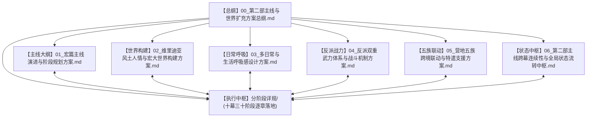
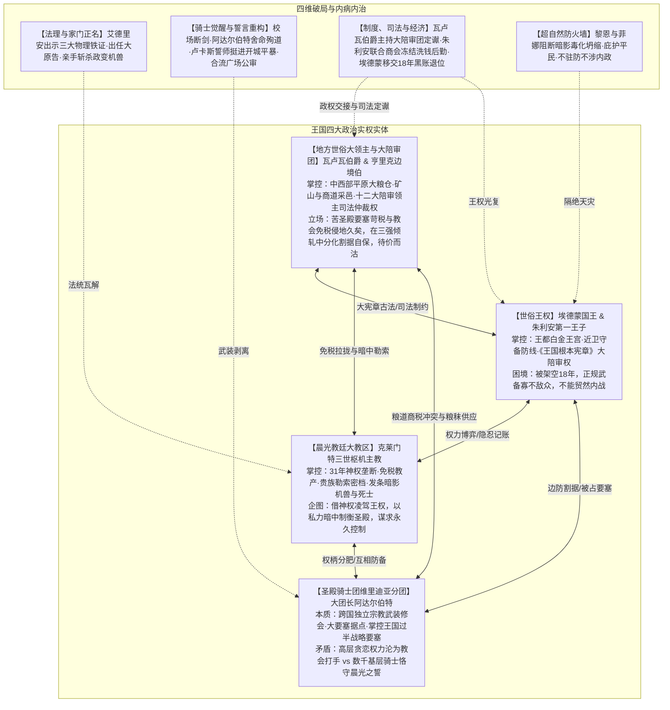
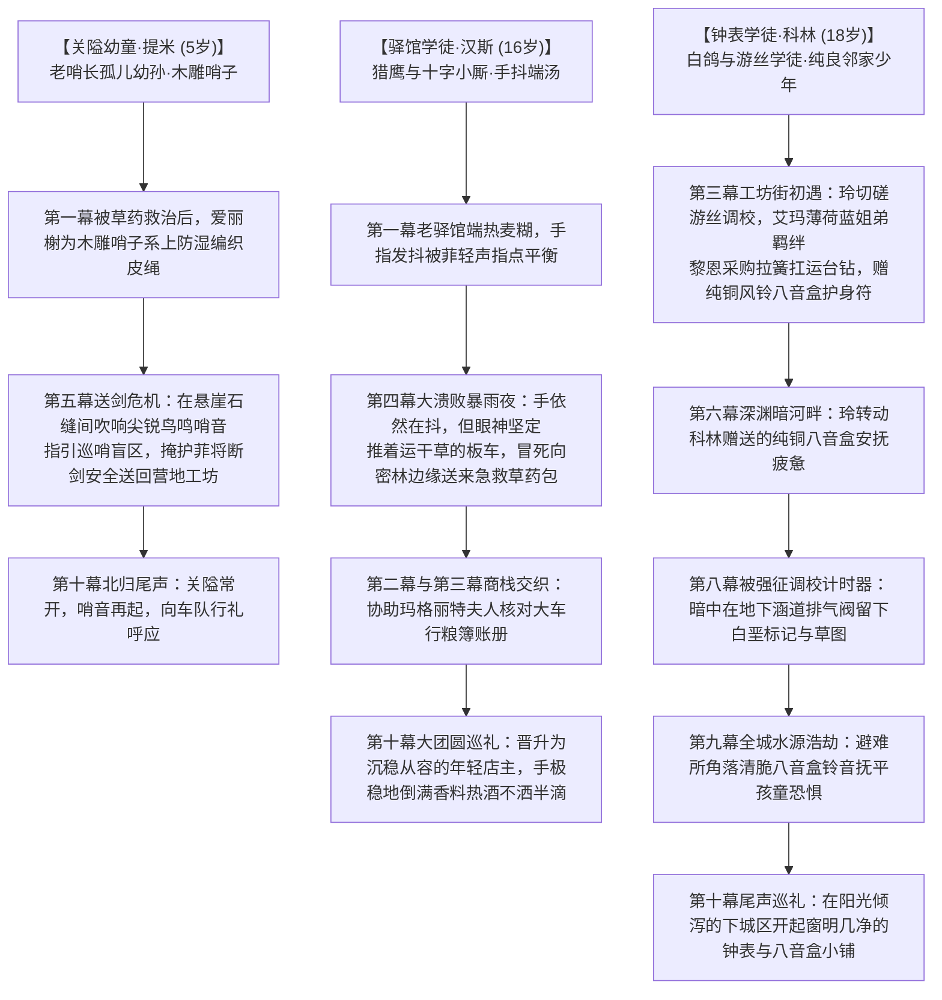
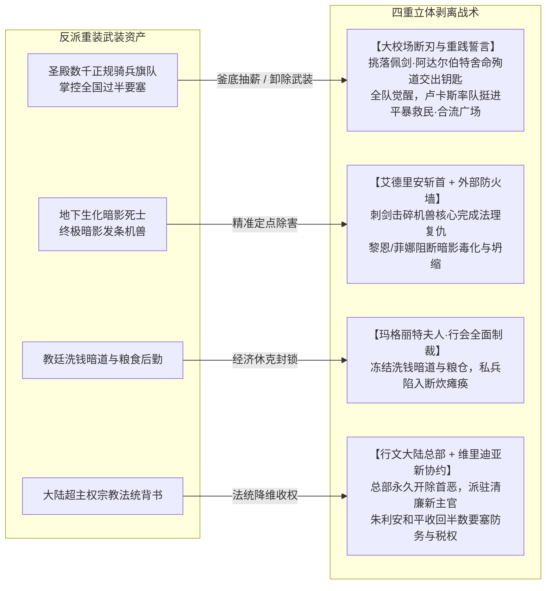

# 第二部主线与世界扩充方案总纲（管理中枢）

> **状态**：方案骨架搭建阶段（未正式开写，保持高度弹性与可变性）  
> **定位**：第二部宏大叙事、丰富世界观、多日常呼吸感与多方战力联动的总管理文件。  
> **管理原则**：**模块化解耦、随时增删调整、独立版本演进**。

---

## 一、 方案集群体系全景

为适应“宏篇史诗、世界风土更丰富、日常呼吸感更充沛、反派双重武力配置、五族跨境深度联动、以及十幕分文件夹跨幕连续性保障”的全新需求，本方案集群解耦为 6 个互为支撑的专门模块，并由**分阶段详规**承接逐章落地，由本总纲与全局状态流转中枢统一调度、对账与索引：

```mermaid
graph TD
    Root["【总纲】00_第二部主线与世界扩充方案总纲.md"]
    
    Sub1["【主线大纲】01_宏篇主线演进与阶段规划方案.md"]
    Sub2["【世界构建】02_维里迪亚风土人情与宏大世界构建方案.md"]
    Sub3["【日常呼吸】03_多日常与生活呼吸感设计方案.md"]
    Sub4["【反派战力】04_反派双重武力体系与战斗机制方案.md"]
    Sub5["【五族联动】05_营地五族跨境联动与特遣支援方案.md"]
    Sub6["【状态中枢】06_第二部主线跨幕连续性与全局状态流转中枢.md"]
    
    Stages["【执行中枢】分阶段详规/ (十幕三十阶段逐章落地)"]

    Root --> Sub1
    Root --> Sub2
    Root --> Sub3
    Root --> Sub4
    Root --> Sub5
    Root --> Sub6
    Root --> Stages

    Sub1 <--> Stages
    Sub2 <--> Stages
    Sub3 <--> Stages
    Sub4 <--> Stages
    Sub5 <--> Stages
    Sub6 <--> Stages
```

---

## 二、 子方案与分阶段详规体系一览

### 2.1 宏观子方案清单

| 编号 | 方案文件 | 核心职责与管理范围 | 状态 |
| :---: | :--- | :--- | :---: |
| **00** | [00_第二部主线与世界扩充方案总纲.md](file:///home/nanhu2/comfyui/世界书/方案/第二部/主线与世界扩充方案/00_第二部主线与世界扩充方案总纲.md) | 统一管理中枢、模块交叉指引、核心原则规范、实施路线图 | **当前生效** |
| **01** | [01_宏篇主线演进与阶段规划方案.md](file:///home/nanhu2/comfyui/世界书/方案/第二部/主线与世界扩充方案/01_宏篇主线演进与阶段规划方案.md) | 宏篇史诗十幕三十阶段演进体系、41处舞台深度盘活、名媛社交高光、至暗挫折与多维破局、高潮战役与黎明宪章 (310~340章) | **当前生效** |
| **02** | [02_维里迪亚风土人情与宏大世界构建方案.md](file:///home/nanhu2/comfyui/世界书/方案/第二部/主线与世界扩充方案/02_维里迪亚风土人情与宏大世界构建方案.md) | 王国五大地理版图、王都核心舞台、社会封建阶层、物价货币、交通邮驿、零导力反差 | **当前生效** |
| **03** | [03_多日常与生活呼吸感设计方案.md](file:///home/nanhu2/comfyui/世界书/方案/第二部/主线与世界扩充方案/03_多日常与生活呼吸感设计方案.md) | 营地大食堂、工坊研制、篷车旅途、沙龙清谈、浴堂闲趣、私密张力与情感回流机制 | **当前生效** |
| **04** | [04_反派双重武力体系与战斗机制方案.md](file:///home/nanhu2/comfyui/世界书/方案/第二部/主线与世界扩充方案/04_反派双重武力体系与战斗机制方案.md) | 古代暗影炼金兵器 + 畸变异端死士、战斗克制拆解、双BOSS权谋出招与分肥破裂机制 | **当前生效** |
| **05** | [05_营地五族跨境联动与特遣支援方案.md](file:///home/nanhu2/comfyui/世界书/方案/第二部/主线与世界扩充方案/05_营地五族跨境联动与特遣支援方案.md) | 矮人重装工程、狼人荒野嗅探、蜥蜴人水网潜渡、五族参战深层动因与文化碰撞 | **当前生效** |
| **06** | [06_第二部主线跨幕连续性与全局状态流转中枢.md](file:///home/nanhu2/comfyui/世界书/方案/第二部/主线与世界扩充方案/06_第二部主线跨幕连续性与全局状态流转中枢.md) | **全局单向权威状态机**：四大铁证物理流向链、劳拉断剑/雷恩水牢伤病装备链、170km时空周历标尺、反派认知读条与平民物象咬合链 | **当前生效** |
| **补丁** | [补丁_主线叙事逻辑与人设细节优化方案.md](file:///home/nanhu2/comfyui/世界书/方案/第二部/主线与世界扩充方案/补丁_主线叙事逻辑与人设细节优化方案.md) | 确立真实JRPG自然口语、校准雷恩温和羁绊、平民物象咬合与大陪审团现实利益博弈 | **当前生效** |

### 2.2 分阶段详规（Stage Plans）管理架构与流水线

* **存放路径**：[分阶段详规/](file:///home/nanhu2/comfyui/世界书/方案/第二部/主线与世界扩充方案/分阶段详规/)
* **命名规范**：`第X幕_阶段Y_XXXX详规.md`（严格映射 01 方案十幕三十阶段演进体系）
* **定位与职责**：承接 01 宏篇主线大纲，逐阶段拆解章节动线分镜、情境时序推进（动态弹性标号）、核心意图与末尾纯物象化余韵收束，作为正式撰写 `docs2/story/` 章节实体卡前的**唯一强制前置物**。
* **十幕宏篇演进全景总表**：

| 幕次编号 | 幕次标题 | 包含阶段 | 核心推进与高光角色 |
| :--- | :--- | :--- | :--- |
| **第一幕** | 破晓与边塞立足（共 35 章） | 阶段一 ~ 三 | 商队组出征维里迪亚关隘；**法林**以符文刻针打造非导力护心镜与防具；**亚莉莎**审查排查导力外溢物资；**爱丽榭**备齐营地药草包与干粮。 |
| **第二幕** | 分道巡礼·虚妄的线索（共 40 章） | 阶段四 ~ 七 | 艾斯特雷亚焦土、修道院折剑；**阶段七【法尔肯迷雾商争与月下破袭】**：**亚莉莎与罗恩**主场，以复式记账法穿透特许商会洗钱假账，霜银巨狼夜战粉碎粮仓纵火，保全后方枢纽。 |
| **第三幕** | 王都商路·繁华市井与暗潮生活流（共 40 章） | 阶段八 ~ 十一 | **战役间歇期的王都生活流大舒展**：租下下城临河“白榆货栈”立足；**玲与艾玛**偶遇“白鸽与游丝”钟表工坊，结识18岁纯良学徒**科林**建立薄荷蓝姐弟羁绊；**黎恩**修整战车蹄铁结交先锋队长**卢卡斯**；**哈根**敲石听音勘测暗渠；**雷恩**远眺辨识要塞典狱长**莫尔茨**凶影示警戒备；全境通关文牒核准盖印。 |
| **第四幕** | 血色伏击·至暗大溃败（共 30 章） | 阶段十二 ~ 十四 | 白鹿大驿馆大公会盟会师、死士夜袭、重刃折断、雷恩断后被莫尔茨押解入圣殿死牢受难、王室政变与全境血色通缉令。 |
| **第五幕** | 绝境流亡·篝火重铸与艾斯特雷亚之誓（共 35 章） | 阶段十五 ~ 十七 | 泥泞撤退、艾德里安领主觉醒；奥蕾莉亚一剑阻千骑；**法林与艾玛**以附魔刻杖与冷泉淬火重铸防酸破邪双手大剑；太古秘书库破译。 |
| **第六幕** | 深渊古道·暗河谍影与地底破壁（共 30 章） | 阶段十八 ~ 二十 | **核心领衔：玲、亚尔缇娜、凯尔（地底特遣组）+ 亚莉莎、罗恩（商道补给组）**。 逆太古盲泉潜入千米地底，物理黑客破译死牢管网，黑兔战术壳密码接头，打通劫狱唯一生命线！ |
| **第七幕** | 惊天劫狱·血洗圣殿死牢（共 35 章） | 阶段二十一 ~ 二十三 | 依托第六幕测绘的管网实施地底突防；加尔潜渡引水断销；劳拉重剑劈碎莫尔茨重铠彻底溃败！解救雷恩与十四老骑士；白鹰队长卢卡斯信义放行；爱丽榭暗室深夜守候喂汤。 |
| **第八幕** | 王都暗流·沙龙、旧卷与法理围城（共 30 章） | 阶段二十四 ~ 二十六 | 双城潜流、金鸢尾沙龙外交；**玲在维克托地下工坊大秀物理黑客**，逆向水银阀瘫痪机兽；法林勘破机兽传动死穴；十字竞技场御前决斗粉碎教廷合法性。 |
| **第九幕** | 王都异化·双城合围决战（共 30 章） | 阶段二十七 ~ 二十九 | 教会全城投毒；**凯尔结合柯恩文献破译初代水网**；**亚尔缇娜声纳指引**加尔舍命潜渡关闸；黎恩菲娜筑牢超自然防火墙；科林八音盒抚平孩童恐慌；黑野猪长夜深谈。 |
| **第十幕** | 破晓大审判与黎明宪章（共 35+ 章） | 阶段三十 | 校场断剑·阿达尔伯特舍命殉道·卢卡斯誓师挺进开城平暴救民；瓦卢瓦伯爵与大陪审团广场公审定谳；加冕典礼与自由宪章；逆向长途篷车告别礼（全员温馨巡礼长镜头）。 |

* **阶段状态跟踪**：
  * **第一幕**：阶段一（战后新生与两界相触）、阶段二（边境暗流与要塞破关）、阶段三（法尔肯驿镇与边境前哨）——【**已就绪**】
  * **第二幕**：阶段四（艾斯特雷亚焦土与炼金机兽）——【**已就绪**】
  * **后续阶段**：阶段五至阶段三十（按幕次依序编制详规，详规验收通过后方可开写正文）

---

## 三、 总体设计铁律与基调（防漂移红线）

无论后续方案如何扩充或变动，必须严格遵守以下七条底线规则：

1. **绝对零导力原则（Zero Orbal Tech in Viridia）**：
   * 维里迪亚王国全境不存在任何导力网络。原住民不知道导力是什么，社会能源依赖马力、水车、石炭、蜡烛与火把。
   * 帝国穿界者携带的 ARCUS 战术导力器必须配备乔治特制的**低外溢皮革遮蔽外壳**；导力光芒一旦在公共场合暴露，会被教会当场定性为“异端巫术/妖物”通缉。

2. **双主线主角的命运动能独立性与家人同伴定位**：
   * **家人般的同伴与世俗零利益**：黎恩、菲娜与同伴们是艾德里安与雷恩真挚信赖的家人。他们对维里迪亚王国的政治斗争、领土更迭、爵位权势与商道税收**没有任何世俗利益诉求与纠葛**，同行完全出于对同伴的无条件守护与信任；
   * **绝对不喧宾夺主**：艾德里安必须亲自完成洗刷家族冤屈、告慰母亲遗言并亲手斩首叛乱机兽；雷恩必须亲自在圣殿校场完成晨光之誓的重构与解脱。黎恩作为灰之骑士是战术底牌，但绝不抢夺原住民的命运决断权；
   * **暗影力量与轨迹鬼之力同源探寻（第三部核心伏笔）**：
     - **位面法则区隔**：Eldoria森林与维里迪亚王国同属晨光大陆（Luminas）；埃雷波尼亚帝国（塞姆利亚大陆）处于完全独立的异界位面，通过裂隙物理连接；
     - **高位面同源真相**：维里迪亚所利用的“暗影能量”，其底层波动竟与黎恩体内的“鬼之力”源头惊人同源，均源于高维度的“世界外侧”污秽之楔；
     - **叙事分工克制**：第二部中黎恩与菲娜专注于协助同伴平定生化危机、暗中采集黑晶样本；跨位面同源背后的深层宇宙真相与高位面侵蚀，严格留待第三部全面揭晓。

3. **宏大篇幅下的“张弛律动”与三级空间中继防御**：
   * 拒绝高强度连环追杀导致的审美疲劳。严守“高压调查/惊险战斗 ➔ 驿馆/酒馆伪装 ➔ 营地温情后方回流/日常整备”的三段式呼吸节律。
   * 日常章节不是无意义的灌水，而是承载角色羁绊、风土体验与心理锚定的重要血肉。
   * **防御“时空折叠漂移”与封建交通现实**：
     - 维里迪亚南北纵深约 170 公里（森林大本营 0km ➔ 维里迪亚关隘 15km ➔ 法尔肯驿镇 25km ➔ 艾斯特雷亚旧领 70km ➔ 中央王都 120km ➔ 迷雾海港 170km），零导力封建社会仅能依赖四轮重篷车与步行，跨区域往返需数日行程；
     - **确立“三级空间补给与情报中继链”**：
       1. **第一级·森林大本营（战略后方）**：跨界科研破译、重武器重铸、重大伤患调养。**仅在大幕转折与战略休整期回流**，严禁在出击王都或旧领时随心所欲“闪现回营地喝汤”；
       2. **第二级·法尔肯驿镇与迷迭香商行（边境与经济中继）**：两界大宗物资转运、贵金属与王国钱币周转、两界密信接力站；
       3. **第三级·前线流动安全屋（战术支点）**：艾斯特雷亚酒庄地下深窖、王都下城白榆货栈与黑野猪酒馆二楼暗室、圣泉大浴堂无武装接头区。长途情报传递必须依托商队平底船、轻骑信使或飞鸽物理接力。

4. **剧透物理隔离原则**：
   * 本方案集群内的所有大纲演进、BOSS下场与反转结局，仅供编剧与写作设计参考；
   * 严禁将剧情结局反向写入静态卡片。词条卡必须保持客观物理容器的纯净性。

5. **章节实施先骨架后撰写原则**：
   * 在全篇所有章节骨架（十幕三十阶段大纲、动线拆解、情境任务与时序闭环）完全搭建定稿之前，严禁开启任何章节实体卡的实际撰写。
   * 当前核心聚焦于宏篇主线演进、各阶段逐章详规、战力拆解与风土日常交织脉络的完整搭建。

6. **王权与本土主体性防御原则**：
   * **严禁外部救世主包办内政**：维里迪亚王国的政治清算、大陪审团公审与政权交接，必须 100% 由维里迪亚本土力量自主完成。王权（埃德蒙国王手抄密档、朱利安王子启动宪章）、世俗贵族后裔（艾德里安以苦主原告出庭并亲手刺杀政变机兽）、流亡骑士（雷恩唤醒骑士团初心誓约重践誓言平暴）、以及民间工商业行会（玛格丽特夫人冻结洗钱账户切断后勤），共同构成不可动摇的本土正义闭环。
   * **外部战力定位于“超自然防火墙”**：黎恩（八叶居合/澄澈鬼之力）、塞拉菲娜（炽天使圣光净界）以及VII班同伴，其介入严格限制在清除暗影强酸毒液、稳固地脉引力坍缩、阻截生化异变外溢、庇护无辜平民的超自然领域。绝不派遣外国武装，绝不干涉维里迪亚世俗主权与法统交接。
   * **体制更迭与新主官入驻机制**：
     - 全大陆晨光教会与圣殿骑士团属于跨国性超主权实体，维里迪亚王权无法亦不可能凭空取缔全境信仰与修会；
     - 王室将铁证正式呈送全大陆总廷与总修会，迫使总部公开开除革职克莱门特与阿达尔伯特，并由大陆总部委派声誉卓著、清廉正义的新任主教与新任分团长；
     - 新加冕的朱利安国王以此契机重新谈判并签署《维里迪亚新协约》，和平收回半数要塞防务与税权；至于未来新任主官与王权会演变出怎样的平衡与博弈，全取决于年轻国王的作为与手腕，保留高级 JRPG 封建政治的深度与余韵。

7. **权力阵营二元边界与教廷/圣殿概念防呆红线**：
   * **组织称谓互斥**：晨光教廷（跨国文职宗教神权，主教/司铎/大教堂/中央圣都总廷） vs 圣殿骑士团（跨国独立武装修会，大要塞/大修会分团）。“圣殿”绝非单体建筑或宗教教派；
   * **人员绝对互斥**：
     - **圣殿骑士专属**：正规重装铁骑、白鹰队长卢卡斯、典狱长莫尔茨、老副团长戈德弗里、老哨长巴恩斯、雷恩；
     - **教廷直属人员**：枢机主教克莱门特三世、异端审问官达米安、首席炼金工匠维克托、暗影死士、发条机兽；
     - 🚨 **死刑混淆词**：严禁出现“教廷审判骑士 / 教会骑士”（教廷无骑士建制，决斗出场者为“异端审问厅首席裁决剑士”）；严禁出现“圣殿主教 / 圣殿神官”；
   * **舞台据点互斥**：大教堂/教廷秘库/晨光修道院药舍（严禁写成圣殿修道院）归属教廷；圣殿要塞/圣殿校场/圣殿水牢归属圣殿（**严禁在圣殿搞发条机兽生化实验**）；
   * **罪证归属互斥**：教廷秘库封存古代暗影实验原案与灭口密令（克莱门特签字）；圣殿要塞铁柜私藏前任团长自白与克莱门特分肥密约（阿达尔伯特私藏）；
   * **法统收权互斥**：王权无权单方面取缔超主权信仰，必须将铁证呈送大陆总廷与大修会总团降维开除，签署《维里迪亚新协约》和平收回防务与税权。

8. **低戏份角色绝活设定与人设校准原则**：
   * **玲 (Renne)**：保真与凯尔的笃定恋人契约；展现“物理/逻辑黑客”绝活（不敲键盘，以看穿差分传动、配制水银液压死锁与音叉共振瘫痪反派机兽）。
   * **凯尔 (Kyle)**：看似木讷但拥有学者硬骨头与舍身守护同伴的勇气；专精太古封印符文破译与初代王国水网解构。
   * **亚尔缇娜 (Altina)**：托尔兹第二分校特务科首席，操控战术壳执行无声潜伏、声纳测绘与三维建模；保留对市井甜点与泥花猫的反差萌。
   * **亚莉莎 (Alisa)**：现代商业手腕（复式记账法、穿透洗钱暗账、空壳商船）降维打击教会经济封锁；保持一流的远距离物理神射。
   * **罗恩 (Ron)**：狼族超敏嗅觉追踪黑血与毒液；常态温润学者，满月化身两米余高霜银巨狼，充当破阵重盾。
   * **法林 (Farin)**：拒绝徒手与战力膨胀，以出师磨制的【黑角木符文刻杖】与【附魔银刻针】打造实用微光道具与防酸护具；以对古代机械构造的敏锐眼力指出铰链卡榫弱点，由剑士合力撬开。

9. **JRPG 真实口语黄金三原则与文风防御铁律**：
   * **去大词与去长句**：严禁出现多层从句嵌套的哲学宣白或舞台歌剧腔翻译腔，真实人物在对峙与交锋中说话短促、有力、带有自然呼吸感与停顿；
   * **扎根生活史细节**：人物对话必须立足于其具体的封建身份与现实羁绊——津贴、硬黑麦面包、关卡开闸、印信、货栈账册、铁矿石、草药包，让人物口吻沉甸甸地落在封建土地与生活史上；
   * **杜绝中式草莽与市井恶俗黑话**：坚决绝缘“水浒草莽黑话”与粗鄙绿林匪气（严禁“老子”、“走狗”、“结义”、“大侠”），保持 JRPG 王道克制与欧陆骑士道尊严；
   * **彻底剔除现代科研术语**：严禁出现“剑刃微观晶格”、“金属疲劳”、“病理学分析”等现代实验室学术词汇，回归冷兵器战情、冷锻淬火工艺与真实剑士对决。

### 3.1 维里迪亚王国四元权力架构矩阵（王权·神权·修会·大陪审领主）

```mermaid
graph TD
    subgraph 王国四大政治实权实体
        Crown["【世俗王权】埃德蒙国王 & 朱利安第一王子<br/>掌控：王都白金王宫·近卫守备防线·《王国根本宪章》大陪审权<br/>困境：被架空18年，正规武备寡不敌众，不能贸然内战"]
        Church["【晨光教廷大教区】克莱门特三世枢机主教<br/>掌控：31年神权垄断·免税教产·贵族勒索密档·发条暗影机兽与死士<br/>企图：借神权凌驾王权，以私力暗中制衡圣殿，谋求永久控制"]
        Knights["【圣殿骑士团维里迪亚分团】大团长阿达尔伯特<br/>本质：跨国独立宗教武装修会·大要塞据点·掌控王国过半战略要塞<br/>矛盾：高层贪恋权力沦为教会打手 vs 数千基层骑士恪守晨光之誓"]
        Nobles["【地方世俗大领主与大陪审团】瓦卢瓦伯爵 & 亨里克边境伯<br/>掌控：中西部平原大粮仓·矿山与商道采邑·十二大陪审领主司法仲裁权<br/>立场：苦圣殿要塞苛税与教会免税侵地久矣，在三强倾轧中分化割据自保，待价而沽"]
    end

    subgraph 四维破局与内病内治
        Solve1["【法理与家门正名】艾德里安出示三大物理铁证·出任大原告·亲手斩杀政变机兽"]
        Solve2["【骑士觉醒与誓言重构】校场断剑·阿达尔伯特舍命殉道·卢卡斯誓师挺进开城平暴·合流广场公审"]
        Solve3["【制度、司法与经济】瓦卢瓦伯爵主持大陪审团定谳·朱利安联合商会冻结洗钱后勤·埃德蒙移交18年黑账退位"]
        Solve4["【超自然防火墙】黎恩与菲娜阻断暗影毒化坍缩·庇护平民·不驻防不涉内政"]
    end

    Crown <-->|权力博弈/隐忍记账| Church
    Church <-->|权柄分肥/互相防备| Knights
    Crown <-->|边防割据/被占要塞| Knights
    Nobles <-->|大宪章古法/司法制约| Crown
    Nobles <-->|免税拉拢与暗中勒索| Church
    Nobles <-->|粮道商税冲突与粮秣供应| Knights

    Solve1 -.->|法统瓦解| Church
    Solve2 -.->|武装剥离| Knights
    Solve3 -.->|政权交接与司法定谳| Nobles
    Solve3 -.->|王权光复| Crown
    Solve4 -.->|隔绝天灾| Crown
```

#### 3.1.1 政治生态核心潜规则：【台面下的公开共识 vs 台面上的法统假面】
在维里迪亚王国，政治博弈的核心戏剧张力维系于一层微妙的“窗户纸”：
* **台面下心照不宣（公开的秘密）**：从国王父子、大陪审团大贵族、金鸢尾沙龙名媛到市井佣兵，人人皆知圣殿骑士团与晨光教廷三十年来狼狈为奸、利益分肥、架空王权；
* **台面上不可言说（神圣法统假面）**：在没有绝对物理铁证之前，谁也不能在公开法庭、御前会议或公众场合直斥两家勾结。教廷受泛大陆至高信仰光环护体，圣殿受跨国大修会独立法统背书。这种“不可言说的潜规则”构成了全篇权谋攻防的核心支点：
  - **第八幕竞技场决斗**：圣殿在台面上依然是“守序纯洁的”，阿达尔伯特以此为盾牌冷言拒绝为教廷丑闻陪葬，导致同盟决裂；
  - **第十幕破晓顺次清算**：唯有在圣殿校场断剑对决、阿达尔伯特殉道交出绝密钥匙后，圣殿的内部暗账才被打破；随后卢卡斯率全队重践誓言出塞平暴，配合王权与大陪审团在台面上将教廷的神权遮羞布彻底撕碎！

#### 3.1.2 七大宏篇史诗灵魂血肉机制（全案宏观通则）
为保障 310~340 章宏篇长卷具备极高的人物弧光、智斗厚度、市井烟火与戏剧波澜，全案严格遵循七大灵魂血肉机制：
1. **历史黑幕的三重认知反转（The Triple Twist）**：
   - 反转一（艾斯特雷亚灭门真相）：艾德里安之父当年因察觉教会生化机兽狂想，秘密封存图纸并抗命拒绝交出，方遭灭口；
   - 反转二（十四年前平民清洗令圈套）：阿达尔伯特当年系落入教廷在村落提前投毒的绝户计圈套，为保全修会名誉被迫当刀，十四年来深陷道义泥潭；
   - 反转三（老国王装疯示弱的战略定力）：埃德蒙十八年咳血系借教会微毒汤药反向侦测清洗时间表，手抄黑账精确到了每批矿石与金索维林流向。
2. **大陪审团政治天平读条的现实利益筹码（拒绝口才空谈）**：
   - 封建政治绝非单线宣判。在第八幕金鸢尾沙龙（阶段二十四）中，十二大陪审领主倒戈读条（3票 ➔ 5票 ➔ 7票 ➔ 决斗后 9票绝对多数）绝非仅凭名媛社交魅力，而是切实击中了封建大贵族的切身利益痛点：
     * **农业与平原领主的现实命脉（亨里克边境伯等）**：痛恨教会依仗免税特权强占中西部肥沃麦田与矿山采邑，更痛恨圣殿要塞私设重税关卡盘剥粮车；亚莉莎协助玛格丽特夫人出示教廷暗中洗钱与偷逃商税的真实账册；朱利安王子以大宪章法统庄严承诺战后“全面废除要塞私设税卡、依法赎回被占世俗庄园”，从根本上撬动了中立派领主的物质基石；
     * **封建古法与大宪章卫道者（法理领主瓦卢瓦伯爵）**：大理院首席法官瓦卢瓦伯爵最重封建契约与程序合法性；艾德里安呈递的十九年前王室特许状底卷、克莱门特亲笔签发的假案密令、带工匠印号的主齿轮以及火灾遗留的不可逆酸蚀白骨，构成了无懈可击的客观证据链，为瓦卢瓦伯爵在御前决斗后敲响主审法槌提供了坚不可摧的法理底气；
     * **贵族家眷安全与人人自危（沙龙名媛夫人们的软性倒戈）**：各大世俗贵族最忌惮宗教审问特务对其私生活的无孔不入；爱丽榭在沙龙社交中以无可辩驳的教廷侍从私印密件，揭发异端审问厅长年暗中收集各大贵族私密底细以备勒索的险恶事实，引发整个贵妇圈对教会道德唾弃与人人自危，彻底剥离了教会的贵族社交基本盘。
3. **外部主角（VII班）的镜像共鸣（Soul Resonance）**：
   - 黎恩在黑野猪酒馆与朱利安夜谈“承担国家之重的痛苦与自省”；劳拉以亚尔赛德流极剑之道质问圣殿骑士团“剑为何而拔”；菲默默照拂底层街童。
4. **贯穿十幕的微观平民世相谱与物理物象咬合（提米·汉斯·科林）**：
   平民角色杜绝悬浮，通过真实的生活细节与关键动作，成为推动主线运转的“细小齿轮”：

```mermaid
graph TD
    T["【关隘幼童·提米 (5岁)】<br/>老哨长孤儿幼孙·木雕哨子"] --> T1["第一幕被草药救治后，爱丽榭为木雕哨子系上防湿编织皮绳"]
    T1 --> T2["第五幕送剑危机：在悬崖石缝间吹响尖锐鸟鸣哨音<br/>指引巡哨盲区，掩护菲将断剑安全送回营地工坊"]
    T2 --> T3["第十幕北归尾声：关隘常开，哨音再起，向车队行礼呼应"]

    H["【驿馆学徒·汉斯 (16岁)】<br/>猎鹰与十字小厮·手抖端汤"] --> H1["第一幕老驿馆端热麦糊，手指发抖被菲轻声指点平衡"]
    H1 --> H2["第四幕大溃败暴雨夜：手依然在抖，但眼神坚定<br/>推着运干草的板车，冒死向密林边缘送来急救草药包"]
    H2 --> H3["第二幕与第三幕商栈交织：协助玛格丽特夫人核对大车行粮簿账册"]
    H3 --> H4["第十幕大团圆巡礼：晋升为沉稳从容的年轻店主，手极稳地倒满香料热酒不洒半滴"]

    C["【钟表学徒·科林 (18岁)】<br/>白鸽与游丝学徒·纯良邻家少年"] --> C1["第三幕工坊街初遇：玲切磋游丝调校，艾玛薄荷蓝姐弟羁绊<br/>黎恩采购拉簧扛运台钻，赠纯铜风铃八音盒护身符"]
    C1 --> C2["第六幕深渊暗河畔：玲转动科林赠送的纯铜八音盒安抚疲惫"]
    C2 --> C3["第八幕被强征调校计时器：暗中在地下涵道排气阀留下白垩标记与草图"]
    C3 --> C4["第九幕全城水源浩劫：避难所角落清脆八音盒铃音抚平孩童恐惧"]
    C4 --> C5["第十幕尾声巡礼：在阳光倾泻的下城区开起窗明几净的钟表与八音盒小铺"]
```

5. **第五幕敌后根据地与艾德里安领主意志觉醒**：
   - 在酒庄养伤流亡期间，艾斯特雷亚老家臣与葡萄农以地窖暗渠冒死掩护主角团；艾德里安目睹领民流血，彻底从“复仇孤儿”蜕变为誓死捍卫故土的“真正封建领主”。
6. **反派内部的微型权力与理念倾轧**：
   - 维克托狂热工匠自尊被哈根与玲的工程图纸当面击垮；异端审问官达米安的神圣洁癖与大团长阿达尔伯特的军阀老辣不断摩擦，注定反派同盟覆灭必然性。
7. **第十幕尾声“逆向长途篷车告别礼（The Long Road Home）”**：
   - 决战胜利后安排 4 章长镜头逆向巡礼：王都 ➔ 葡萄园酒庄 ➔ 平原大道 ➔ 法尔肯老驿馆 ➔ 维里迪亚关隘界标，亲眼见证和平在走过的每一处土地重新升起，完美收束古典 JRPG 情感峰值。

#### 3.1.3 反派阵营攻防博弈与决策合理性模型（反派POV深度闭环）
站在反派统治集团（克莱门特三世与阿达尔伯特）的视角推演，全篇每一个重大决策、情报升级与权谋出招均具备严密的利益与政治必然性，彻底杜绝“降智”与“反派挂机”：

1. **首恶利益诉求的离心本质（反派在图什么？）**：
   - **克莱门特的“私兵替代野心”与“大圣徒伪装”**：教廷三十一年来借神权垄断全境什一税与免税庄园。维克托秘密赶制的暗影自律机兽与死士，战略终极目标是在老国王咽气后，彻底替代并剥夺圣殿骑士团的独立要塞防务与税权，建立政教合一的教廷傀儡国。这也是教廷始终防备圣殿、严禁圣殿插手工坊的根源；在公众与贵族面前，克莱门特始终维持威严、慈爱、博学且关怀信众的“护国大主教”大圣徒形象，谈吐优雅，前中期绝不脸谱化；
   - **阿达尔伯特的“体制护身符算盘”**：身为大团长，阿达尔伯特深陷十四年前屠杀平民与放逐雷恩的沉没成本，毕生以“维系圣殿独立法统与全国过半要塞防务”为天职。他本质上保留着老骑士的高傲自尊，极度鄙视教廷阴暗的生化实验；他在祈祷室铁柜私藏前任团长自白与克莱门特签字的分肥密约，就是为了**防备教廷羽翼丰满后卸磨杀驴的政治核护身符**。
2. **反派情报流升级与行动递进逻辑**：
   - **第一幕“家法暗查”杜绝公然通缉**：关隘破关后阿达尔伯特得知雷恩现身，严令莫尔茨封锁消息、秘密抓捕，绝不公开发布通缉令。因十四年前雷恩是“秘密除名放逐”，大肆通缉会引发军团内部崇敬雷恩的老骑士反弹，给王室重翻惨案旧案的把柄；
   - **第二幕“商会假面与拼图合拢”**：艾德里安以北方商会合法文书为伪装，反派最初只当成零星盗匪与商行摩擦；直到旧领深处机兽被拆、修道院挑落卢卡斯佩剑、海港走私货栈被破，三大情报在达米安案头汇总交叉，反派才猛然惊觉这是一场冲着三十年神权暗影而来的高层复仇；
   - **第三幕“暗流潜伏与严密戒备”**：商队立足下城白榆货栈，莫尔茨在要塞悬崖下巡防，雷恩辨识宿仇暗中示警，主角团严守隐蔽、零正面接触；
   - **第四幕“平原围网与白鹿伏击”**：反派获悉大公会议密信，调动平原重骑与达米安生化死士，设下白鹿驿馆绞杀大局。
3. **四大战术决断与体制破绽合理性闭环**：
   - **决断一（白鹿驿馆石桥留雷恩作战略人质与水牢交锋）**：阿达尔伯特在暴雨泥泞中亲眼目睹达米安驱使的黑血狂骑参战，并骇然从剥落臂甲下瞥见圣殿骑士专属的手腕誓约烙印，遭受第一重灵魂层面的惊疑暴击；大团长在石桥决然震开达米安枭首之剑，将重伤的雷恩扣入第七号死牢——既因十四年负罪感与决不能让雷恩落入教会地下生化实验室的强烈戒备，更是为了将当年核心当事人雷恩作为牵制教廷的战略人质，防止教廷下一步对自己卸磨杀驴；在幽暗的水牢外，阿达尔伯特隔着生铁栅栏看着石床上浑身是伤却眼神平静的雷恩，声音干涩而低沉，极力自我麻痹与自欺欺人：“十四年了……你的眼神还是一点没变啊，雷恩。……你觉得当年是我出卖了修会？还是出卖了你？……可如果那时候我不向教会低头，不在克莱门特的协议上盖印——要塞里那几千个年轻骑兵，第二天连口粮和津贴都见不到。教会只要断了粮运、扣上一顶异端的罪名，整座圣殿十四年前就该垮了。……别把这世道想得太干净了。握剑的手……怎么可能不沾泥水。”
   - **决断二（第五幕界标威慑反派老辣权衡·异界不可知论铁律）**：
     * 搜捕队在关隘界标被奥蕾莉亚一剑断旗轰裂大地阻退，阿达尔伯特收到败报后并未调集全队攻山：森林南侧是数百年来生人勿进的古老圣域，地形险恶；深林中展现出超常骇人的绝顶剑士，盲目投入重骑血拼只会折损私力，给王都教廷吞并要塞防区的口实。阿达尔伯特冷酷下达“封锁关防界标、围而不攻、逼其自灭”的自保命令，并将探山脏活甩给教廷暗部当耗材；
     * 🚨 **异界不可知论铁律（严格红线）**：维里迪亚原住民绝不知晓、且全篇严禁出现“埃雷波尼亚帝国”字样或概念！帝国处于完全独立的异界位面，维里迪亚反派只能依据本土认知，将其视为“隐匿在古老禁地深处的未知蛮荒强者/古老隐世守护者”。
   - **决断三（第八幕工坊失守之因）**：死牢被破击穿克莱门特心理防线，主教恐慌之下逼迫维克托“七日内赶制十二台重型战兽”，地下全天候过载排烟排渣，导致隔温法阵与涵道出现严重热裂隙；反派因恐慌赶工自身露出的工程死穴，使哈根与玲的奇袭破拆具备极高工程合理性；
   - **决断四（第九~十幕阿达尔伯特从冷血封城到校场殉道的心路闭环）**：第九幕封城铁幕是大团长冷血自保的顶点，却也让他深陷全城哀嚎与年轻骑士信仰崩塌的道义凌迟；第十幕校场对决中面对雷恩挑飞佩剑却不下杀手的克制，以及教廷密使手持协议狂妄嘲弄并启动伏击机兽扑杀同袍的疯狂，阿达尔伯特心底最后的侥幸与自欺欺人被彻底击碎。他把金链扔在地上，转头冷冷扫向教廷特使：“拿上你们的协议滚出校场。圣殿的剑，从今天起不再替教会杀人。……至于十四年前我欠下的债，今天我自己来还。”阿达尔伯特抓起半截断剑，迎着轰鸣旋转的机兽主轴全力撞了上去——以残躯卡死机轮，以命完成最后的尊严赎罪！

#### 3.1.4 至暗挫折与战力配比客观说服力模型（白鹿大驿馆围城防降智铁律）
在第四幕（第 116 ~ 145 章）的**“白鹿大驿馆围城·至暗大溃败”**中，主角团（黎恩、劳拉、菲、雷恩等）遭遇重大挫折、劳拉巨剑折断、雷恩断后被俘受难。为彻底消除“战力强行削弱”或“降智剧情杀”的生硬感，在叙事与分镜中筑牢三大具有说服力的客观逻辑：

1. **彻底剔除现代科研术语，回归冷兵器与守护之仁**：
   - 严禁出现“剑刃微观晶格”、“金属疲劳”、“病理学分析”等现代实验室学术词汇；
   - 白鹿大驿馆内部为狭窄回廊与石木庭院，主角团被数倍敌众压缩在逼仄空间内，大开大合的剑技难以完全施展；
   - 攻城战兽狂暴挥下重锤，混杂着高压喷溅的炽烈剧毒黑酸。为了护住身后负伤的同伴与无辜避难平民，劳拉双手横剑舍身正面硬撼；
   - 猛烈轰击的钝击震荡与剧毒黑酸的灼蚀同时爆发，名刃发出悲鸣般的脆响，星银百锻的剑身当场崩裂断折；
   - 巨剑折断源于劳拉崇高的**“守护之仁”**与极端狭窄地形，是舍身救人的牺牲，绝非剑术技艺不敌。
2. **人设校准：雷恩的温和恳求与主角团的人道善意**：
   - 雷恩温和谦逊、深感愧对同袍，绝不可能居高临下向生死相托的伙伴“立下铁律”；黎恩、劳拉、菲等 Class VII 同伴本就怀揣王道正义，本就不愿造成无谓杀戮；
   - 面对夜雨中逐渐逼近的要塞骑兵，雷恩按住剑柄的手指微微发紧，转头看向身旁的黎恩与劳拉，声音压得很低，带着掩饰不住的愧疚与恳求：“黎恩、劳拉……算我求大家一件事。那些骑兵……很多都是刚通过考核的年轻孩子，只是奉命列阵。错在下达调令的人，不在他们。如果可以的话……请尽量留他们一条生路。”黎恩反手握紧太刀刀鞘，温和地点了点头：“啊，我们明白。我们本就没打算在这片土地上徒增无谓的牺牲。”劳拉上前一步，伸手轻轻覆在雷恩握剑的手背上，目光坦荡而坚定：“剑是为了守护而拔。雷恩，你的心意，我们全员接下了。”
   - 主角团为了避开要害，全员默契地仅以剑脊击打、鞘击与瞬步卸除骑兵武装；而达米安驱使的异化死士招招自爆换命、毫无顾忌。主角团是在**“戴着仁慈与道义的枷锁”**迎战，最终陷入寡不敌众的战术绝境，使得大溃败具备了深沉的人性力量。
3. **封建平民人质与人道主义牵制**：
   - 白鹿驿馆内滞留着大量惊恐无措的马夫、侍应与平民杂工；反派在后方冷血驱使死士在人群中释放酸雾；
   - 黎恩与菲娜必须拼尽全力维持防护、引导平民疏散，大部分气力被救援牵制，战场陷入无可奈何的死局。

### 3.2 王室隐忍蓄力、外交破冰与实力支柱

面对神权与修会实权的两强夹击，王权在漫长的十八年隐忍中构筑起了深厚的四大内生实力支柱，并在与外部各方的建交中展现出真挚的王家信义：

1. **父子隐忍双轨制与朱利安王家信义**：
   - **埃德蒙国王（表里双轨）**：在位十八年以“疲惫妥协的软弱君王”为面具麻痹两强，御前会议裹厚毛毯剧烈咳血，甚至当众斥责王子禁足，实则为朱利安前往法尔肯接头提供坚实的不在场证明；暗中耗费十八年秘密手抄核验《维里迪亚黑账通卷》，并在古籍中考据出大陪审团弹劾法统；被软禁高塔后以牢房壁炉暗砖敲击声隔空指挥近卫队。
   - **朱利安王子（真诚托付与王家信义）**：
     * **诚恳托付与自省担当**：深知王室欠债在先，以极度谦逊自省姿态求助，直言营地没有流血义务，愿以维里迪亚人身份共同迎战暗影；
     * **不可替代的庄严信物**：亲手奉还王室密藏十九年的《艾斯特雷亚夫人临终手札与忠仆册》，向艾德里安行贵族歉礼；向雷恩出示十八年来私用内帑发放的平民抚恤密账，拔剑致敬洗刷流亡屈辱；
     * **正面武力与流血担当**：白鹿驿馆遭遇伏击突围时，亲率王家近卫反向冲入泥泞暴雨截断追兵，格杀两名暗影刺客，**自身左肩被贯穿负伤**，用流血牺牲向同伴证明是可以生死托付的战友。
2. **Eldoria 圣域生态保护敕令与部族自给自足破冰**：
   - **主权与生态厘清**：菲娜作为“Eldoria森林守护者”（Guardian），代表心木树意志与朱利安王子缔结《维里迪亚王权对Eldoria圣域生态保护、古老神秘尊重与永不侵犯之敕令》，承诺王国武装永不越过南侧界碑，禁绝暗影炼金污染，尊重森林神圣安宁；
   - **部族真诚破冰（先给予尊重，不求回报）**：狼人与蜥蜴人皆能自给自足、戒备人类；王子以行动破冰：面对狼人，严厉查禁捕杀狼皮的走私黑市，奉还王室珍藏数百年的“古代月影祖石”；面对蜥蜴人，调动王室水工在边境清淤排毒、修筑深石沉淀池阻截教会炼金废渣。部族感受到了人道尊重，奠定后续参战的深层心理认同。
3. **新兴工商业行会联盟与市井地下安全网**：
   - 封建商户与平民阶层长期受制于圣殿苛税与教会什一税盘剥。朱利安王子暗中结盟迷迭香商行玛格丽特夫人及王国工商业行会，许诺新政减税与商贸自由；商会暗中输送资金，提前在下城区货栈囤积两周平价麦粉以稳固决战粮价，并掌握了教廷全部地下洗钱商号网络；
   - 王都下城区白榆货栈与黑野猪酒馆世代守护王室与旧臣地下联络线，成为潜伏王都的核心指挥枢纽。
4. **盟友技术高光与凡人羁绊破局**：
   - **哈根（矮人建筑大师）的三大硬核高光**：第三幕敲石听音勘测下水暗渠主拱承重力学；第七幕勘破要塞两百年承重主拱减配死穴，锁定死牢排沙盲渠潜入路线；第九幕现场装配移动防酸重装冲车，高唱矮人战歌单手破障；
   - **凡人智慧与多元羁绊破局**：在第二幕艾斯特雷亚堡地窟中借由先灵之镜映照当年火灾与暗影真相、坚固艾德里安意志后，全篇后续所有危机瓶颈均由Class VII同伴、艾玛、加尔、鳞母、矮人三兄弟与本土盟友凭借凡人智慧、工程造诣与彼此羁绊突破。
5. **底层守卫的人性觉醒与宿命呼应（老哨长巴恩斯的真实口语与两次挺直脊梁）**：
   - 维里迪亚关隘老哨长瓦尔特·巴恩斯是封建底层守关卫士的深刻缩影：十四年前在大雨夜追随雷恩抗命、暗中放走平民伤员，是他驻守关隘半生中第一次真正挺直脊梁；雷恩流放后他为了家眷在边境麻木自保十四年；
   - 十四年后雷恩与商队一行破关并救下其濒死幼孙，老巴恩斯毅然开启排沙涵洞再次放行雷恩，完成人生第二次挺直脊梁；
   - 面对莫尔茨在黑铁水牢中的皮鞭逼问，靠在石壁上喘息的巴恩斯吐出血沫，沙哑而平静地笑了笑：“莫尔茨……你就算把我的骨头敲碎，我也还是那句话。十四年前的大雨里，我跟着雷恩副团长放走了那批难民；前几天在关卡下，也是我亲手升起的石闸。在要塞守了二十七年，吃了二十七年的硬黑麦面包……我这辈子，就数这两回没白活。……雷恩大人已经进去了。你们的好日子，过不了几天了。”小人物在体制泥潭中挣脱自保枷锁、重拾卫士誓言与尊严的动人弧光，成为唤醒基层守备骑士与城防卫士初心誓约的重要情感基石。

### 3.3 破解武装实力悬殊的“四重立体剥离与中立化模型”

维里迪亚王国的终极清算立足于精密政治战术，逐层剥除掌握全国半数要塞、数千精锐骑兵的圣殿武装牙齿：

```mermaid
graph LR
    subgraph 反派重装武装资产
        A1["圣殿数千正规骑兵旗队<br/>掌控全国过半要塞"]
        A2["地下生化暗影死士<br/>终极暗影发条机兽"]
        A3["教廷洗钱暗道与粮食后勤"]
        A4["大陆超主权宗教法统背书"]
    end

    subgraph 四重立体剥离战术
        B1["【大校场断刃与重践誓言】<br/>挑落佩剑·阿达尔伯特舍命殉道交出钥匙<br/>全队觉醒，卢卡斯率队挺进平暴救民·合流广场"]
        B2["【艾德里安斩首 + 外部防火墙】<br/>刺剑击碎机兽核心完成法理复仇<br/>黎恩/菲娜阻断暗影毒化与坍缩"]
        B3["【玛格丽特夫人·行会全面制裁】<br/>冻结洗钱暗道与粮仓，私兵陷入断炊瘫痪"]
        B4["【行文大陆总部 + 维里迪亚新协约】<br/>总部永久开除首恶，派驻清廉新主官<br/>朱利安和平收回半数要塞防务与税权"]
    end

    A1 -->|釜底抽薪 / 卸除武装| B1
    A2 -->|精准定点除害| B2
    A3 -->|经济休克封锁| B3
    A4 -->|法统降维收权| B4
```

1. **常规军权剥离与重践晨光誓言：校场对决、交出绝密钥匙、殉道救赎与铁骑平暴合流**
   - **校场剑锋交错与权力崩溃**：雷恩携老副团长戈德弗里与拒杀名册直面全团，以晨光战技挑断阿达尔伯特佩剑，基层骑士长剑低垂拒绝执行主教指令；面对教廷密使搬出二十年勾结密约歇斯底里勒索、当众恶毒嘲弄十四年前放逐者沦为黑血狂骑的惨烈真相、并狂妄启动暗藏的伏击机兽企图灭口全场老少骑士的绝情，阿达尔伯特心中最后的自欺欺人被彻底击碎，惨痛勘破自己十四年来为“保全修会”而出卖誓言与灵魂是何等荒谬！大团长凄凉自嘲认输，当场解下白鹰大团长金链砸在地上，交出通往私人祈祷室暗格的黑铁钥匙（内有前任团长绝笔与克莱门特三十一年手令）；
   - **舍命卡死机兽与全队觉醒挺进**：失控机兽突入校场企图扑杀老副团长并毁灭铁证，失去武装的大团长抓起半截断剑，以肉身迎头撞击将断刃死死楔入机兽齿轮卡死运转，自身亦被击穿胸膛，在雷恩怀中留下对十四年前祈祷室的忏悔遗言战死，以命殉道洗刷毕生罪愆；白鹰队长卢卡斯面对大团长遗体与全城生化浩劫，断然拒绝消极中立，拔剑高呼重践晨光誓言，率数千重装铁骑开闸出要塞斩断封城吊栅门，开城救民、扫荡街巷残余死士，并顺次护送铁证开赴真理广场与王家近卫合围教廷，圣殿常规威胁彻底解除并转化为守序正义之师！
2. **超自然武装定点斩首：本土刺剑破核与外部防火墙**
   - 克莱门特垂死挣扎启动终极发条机兽企图血洗王都广场，艾德里安以艾斯特雷亚苦主身份，堂堂正正以家传刺剑刺穿机兽核心完成家族昭雪；
   - 终极机兽自爆释出大面积暗影强酸与引力坍缩时，黎恩（八叶居合/鬼之力）与菲娜（炽天使圣光）构筑超自然防火墙，将生化毒雾阻断净化，庇护广场万民。外部战力严格恪守不驻防、不涉内政铁律，本土正义完全由王国自身确立。
3. **后勤与经济休克疗法：商业行会全面联合制裁**
   - 玛格丽特夫人代表全境工商业行会在总决战前夕断然切断教廷黑产资金流，封锁黑市运粮通道，导致克莱门特在王都的私兵陷入粮饷断绝的瘫痪状态。
4. **体制平稳过渡与和平收权：通报大陆总部与新协约**
   - 王国不搞脱离现实的单方面违宪取缔，而是将四大物理铁证（受害者骸骨、带工匠序列号的齿轮核心、亲笔灭口令、老团长血书）正式上报全大陆教廷总廷与圣殿骑士团大修会总团；
   - 两大总部为捍卫正统信仰名誉，下达全大陆通谕永久开除惩戒两大首恶，并派驻德高望重、清廉正直的新主教与新团长进驻；
   - 加冕新君的朱利安国王以此占据最高道德与法统高地，与特使签署《维里迪亚新协约》，和平收回原被骑士团侵占的半数边境要塞与关隘防务归王室直辖，废除教会免税特权，平稳实现宪政新生。

---

## 四、 全篇 310~340 章工程化实施路线图（Roadmap 与验收准则）

为落实“章节实施先骨架后撰写原则”，本方案集群制定了从骨架搭建到工业化成书的清晰四步演进路线图，确保 310~340 章的宏篇巨著在创作全过程中保持最高的一致性与质感：

```mermaid
graph LR
    M1["【Milestone 1】<br/>方案集群定稿<br/>(00~05 模块咬合)"] --> M2["【Milestone 2】<br/>30阶段详规全覆盖<br/>(十幕逐章任务与物象终态)"]
    M2 --> M3["【Milestone 3】<br/>docs2 实体卡片咬合<br/>(物理容器纯净·无剧透)"]
    M3 --> M4["【Milestone 4】<br/>分幕正文工业化撰写<br/>(自动化文风雷达 0 违规)"]
```

### 1. Milestone 1：方案集群定稿与一致性闭环（已达成）
* **验收标准**：
  - [00 总纲](file:///home/nanhu2/comfyui/世界书/方案/第二部/主线与世界扩充方案/00_第二部主线与世界扩充方案总纲.md) 统领 01~05 五大模块；
  - 核心政治逻辑（三权分立与四重剥离）、文风铁律（零导力/三级中继/二元互斥）全部锁定；
  - 模块间交叉索引无死链，经审查无逻辑断层。

### 2. Milestone 2：十幕三十阶段详规全覆盖（当前推进中）
* **演进流程**：
  - 以十幕演进节奏为轴，在 [分阶段详规/](file:///home/nanhu2/comfyui/世界书/方案/第二部/主线与世界扩充方案/分阶段详规/) 目录下逐阶段建立 `第X幕_阶段Y_XXXX详规.md`；
  - 每一篇详规必须包含：阶段定位、章节动线分镜、情境时序推进、核心意图与**末尾纯物象化余韵收束**；
  - **验收铁律**：前一幕所有阶段详规未完全定稿前，严禁越级开启后一幕的阶段详规与正文撰写。

### 3. Milestone 3：docs2 实体卡片数据与物理容器咬合
* **演进流程**：
  - 全面对齐 [01 方案第四节实体索引表](file:///home/nanhu2/comfyui/世界书/方案/第二部/主线与世界扩充方案/01_宏篇主线演进与阶段规划方案.md)，核查与补齐 `docs2/character/`、`docs2/location/`、`docs2/threat/`、`docs2/mechanic/` 实体卡片；
  - **验收铁律**：严守“剧透物理隔离原则”，词条卡必须保持客观物理容器的纯净性，严禁倒灌后续幕次的剧情结局或 BOSS 伏诛细节；执行 `python3 scripts2/check_viridia_consistency.py` 确保 100% 通过。

### 4. Milestone 4：分幕正文工业化撰写与文风雷达护航
* **演进流程**：
  - 基于对应阶段详规，使用 `scripts2/story2_tool.py` 标准脚手架生成正文章节；
  - 正文字数严格把控在 800~1300+ 字清澈呼吸感，对白保真 Falcom 官方口吻；
  - **验收铁律**：每写完一个阶段或一幕，必须运行 `python3 scripts2/scan_viridia_diseases.py` 进行病灶透视扫描，确保中式古风仙侠死刑词、混淆词、度量衡违规**0 违规拦截**后方可正式归档。
