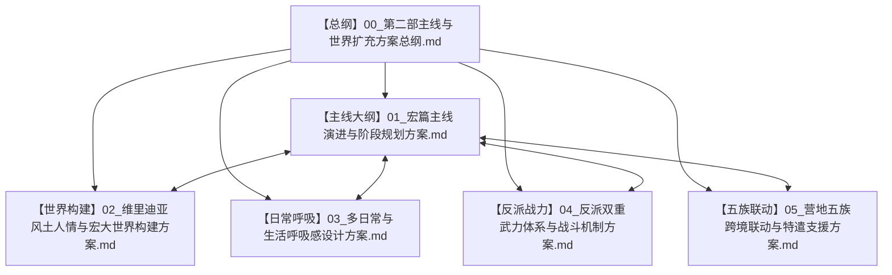
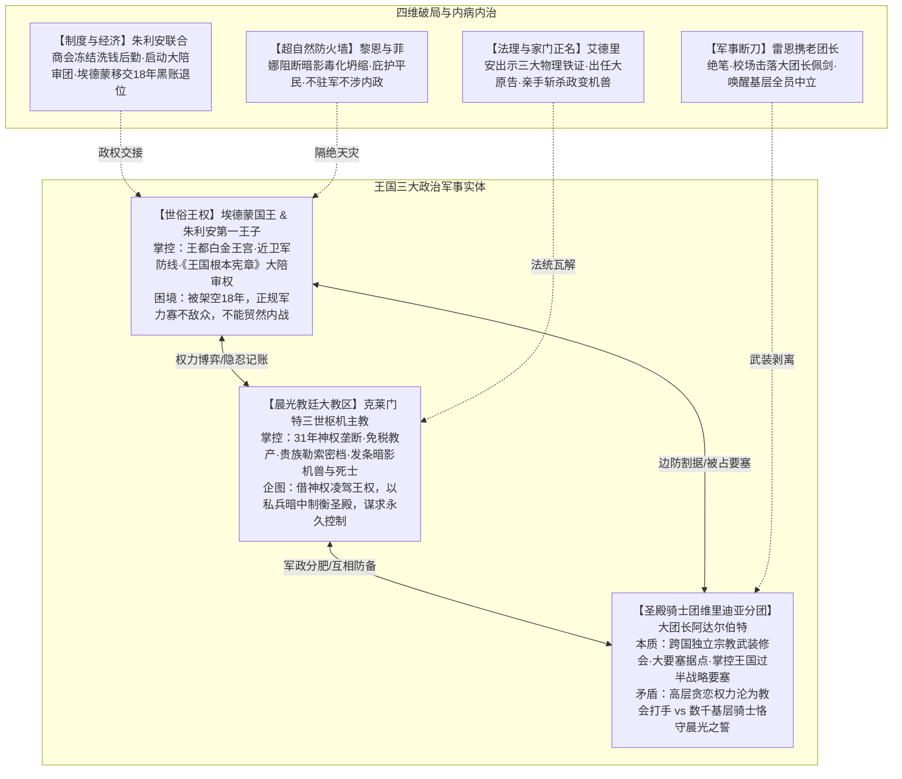
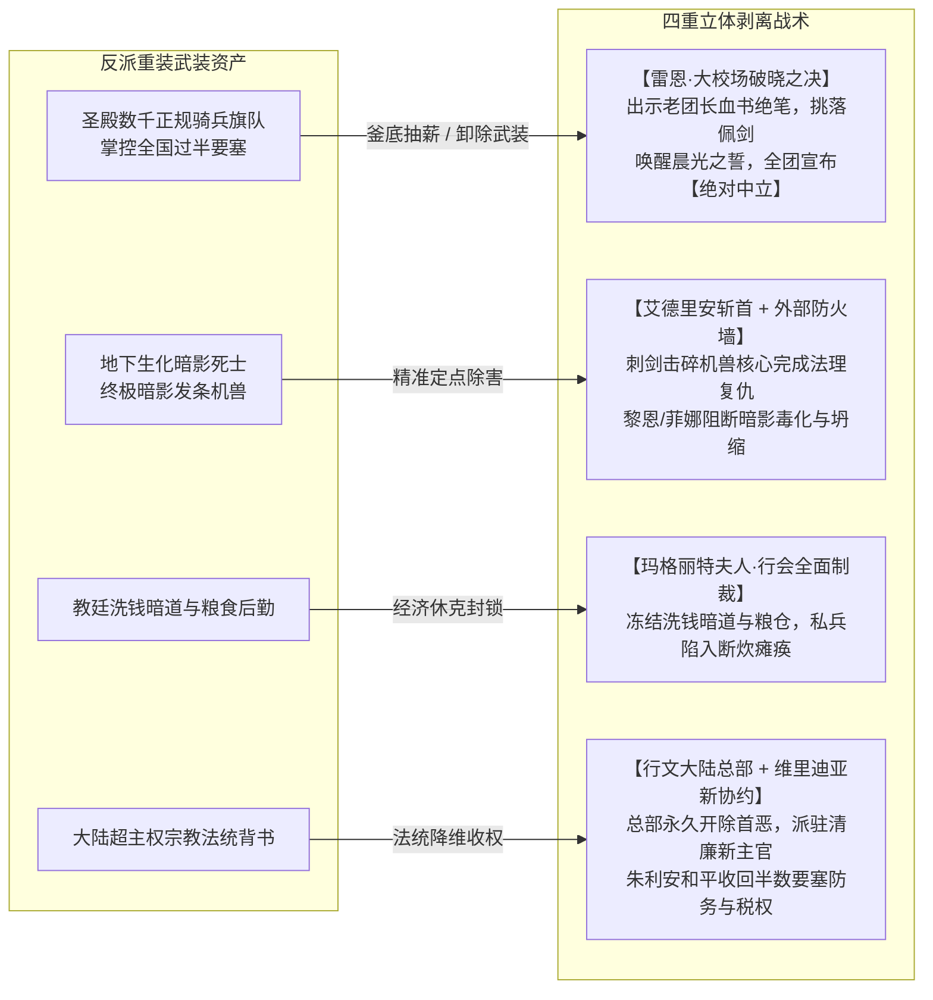

# 第二部主线与世界扩充方案总纲（管理中枢）

> **状态**：方案骨架搭建阶段（未正式开写，保持高度弹性与可变性）  
> **定位**：第二部宏大叙事、丰富世界观、多日常呼吸感与多方战力联动的总管理文件。  
> **管理原则**：**模块化解耦、随时增删调整、独立版本演进**。

---

## 一、 方案集群体系全景

为适应“宏篇史诗、世界风土更丰富、日常呼吸感更充沛、反派双重武力配置、五族跨境深度联动”的全新需求，本方案集群解耦为 5 个互为支撑的专门模块，由本总纲统一调度与索引：

```mermaid
graph TD
    Root["【总纲】00_第二部主线与世界扩充方案总纲.md"]
    
    Sub1["【主线大纲】01_宏篇主线演进与阶段规划方案.md"]
    Sub2["【世界构建】02_维里迪亚风土人情与宏大世界构建方案.md"]
    Sub3["【日常呼吸】03_多日常与生活呼吸感设计方案.md"]
    Sub4["【反派战力】04_反派双重武力体系与战斗机制方案.md"]
    Sub5["【五族联动】05_营地五族跨境联动与特遣支援方案.md"]

    Root --> Sub1
    Root --> Sub2
    Root --> Sub3
    Root --> Sub4
    Root --> Sub5

    Sub1 <--> Sub2
    Sub1 <--> Sub3
    Sub1 <--> Sub4
    Sub1 <--> Sub5
```

---

## 二、 子方案清单与定位一览

| 编号 | 方案文件 | 核心职责与管理范围 | 状态 |
| :---: | :--- | :--- | :---: |
| **00** | [00_第二部主线与世界扩充方案总纲.md](file:///home/nanhu2/comfyui/世界书/方案/第二部/主线与世界扩充方案/00_第二部主线与世界扩充方案总纲.md) | 统一管理中枢、模块交叉指引、核心原则规范 | **当前生效** |
| **01** | [01_宏篇主线演进与阶段规划方案.md](file:///home/nanhu2/comfyui/世界书/方案/第二部/主线与世界扩充方案/01_宏篇主线演进与阶段规划方案.md) | 宏篇史诗架构、七幕二十阶段演进表、至暗挫折与绝地救赎节点、高潮战役 | **初稿完备** |
| **02** | [02_维里迪亚风土人情与宏大世界构建方案.md](file:///home/nanhu2/comfyui/世界书/方案/第二部/主线与世界扩充方案/02_维里迪亚风土人情与宏大世界构建方案.md) | 王国五大地理版图、社会封建阶层、物价货币、交通邮驿、零导力反差 | **初稿完备** |
| **03** | [03_多日常与生活呼吸感设计方案.md](file:///home/nanhu2/comfyui/世界书/方案/第二部/主线与世界扩充方案/03_多日常与生活呼吸感设计方案.md) | 营地大食堂、工坊研制、篷车旅途、酒馆闲趣、私密张力与情感回流机制 | **初稿完备** |
| **04** | [04_反派双重武力体系与战斗机制方案.md](file:///home/nanhu2/comfyui/世界书/方案/第二部/主线与世界扩充方案/04_反派双重武力体系与战斗机制方案.md) | 古代暗影炼金兵器 + 畸变异端骑士死士、战斗克制拆解、双BOSS权谋出招 | **初稿完备** |
| **05** | [05_营地五族跨境联动与特遣支援方案.md](file:///home/nanhu2/comfyui/世界书/方案/第二部/主线与世界扩充方案/05_营地五族跨境联动与特遣支援方案.md) | 矮人穿山通道、狼人荒野嗅探、蜥蜴人水网潜渡、五族参战动因与文化碰撞 | **初稿完备** |

---

## 三、总体设计铁律与基调（防漂移红线）

无论后续方案如何扩充或变动，必须严格遵守以下四条底线规则：

1. **绝对零导力原则（Zero Orbal Tech in Viridia）**：
   * 维里迪亚王国全境不存在任何导力网络。原住民不知道导力是什么，社会能源依赖马力、水车、石炭、蜡烛与火把。
   * 帝国穿界者携带的 ARCUS 战术导力器必须配备乔治特制的**低外溢皮革遮蔽外壳**；导力光芒一旦在公共场合暴露，会被教会当场定性为“异端巫术/妖物”通缉。

2. **双主线主角的命运动能独立性与家人同伴定位**：
   * **家人般的同伴与世俗零利益**：黎恩、菲娜与同伴们是艾德里安与雷恩真挚信赖的家人。他们对维里迪亚王国的政治斗争、领土更迭、爵位权势与商道税收**没有任何世俗利益诉求与纠葛**，同行完全出于对同伴的无条件守护与信任；
   * **绝对不喧宾夺主**：艾德里安必须亲自完成洗刷家族冤屈、告慰母亲遗言并亲手斩首叛乱机兽；雷恩必须亲自在圣殿校场完成晨光之誓的重构与解脱。黎恩作为灰之骑士是战术底牌，但绝不抢夺原住民的命运决断权；
   * **暗影力量与轨迹鬼之力同源探寻（第三部核心伏笔）**：
     - **位面法则区隔**：Eldoria森林与维里迪亚王国同属晨光大陆（Luminas）；埃雷波尼亚帝国（塞姆利亚大陆）处于完全独立的异界位面，通过裂隙物理连接；
     - **高位面同源真相**：维里迪亚所利用的“暗影能量”，其底层波动竟与黎恩体内的“鬼之力”源头惊人同源，均源于高维度的“世界外侧”污秽之楔；
     - **叙事分工克制**：第二部中黎恩与菲娜专注于协助同伴平定生化危机、暗中采集黑晶样本；跨位面同源背后的深层宇宙真相与高位面侵蚀，严格留待第三部全面揭晓。

3. **宏大篇幅下的“张弛律动”**：
   * 拒绝高强度连环追杀导致的审美疲劳。严守“高压调查/惊险战斗 ➔ 驿馆/酒馆伪装 ➔ 营地温情后方回流/日常整备”的三段式呼吸节律。
   * 日常章节不是无意义的灌水，而是承载角色羁绊、风土体验与心理锚定的重要血肉。

4. **剧透物理隔离原则**：
   * 本方案集群内的所有大纲演进、BOSS下场与反转结局，仅供编剧与写作设计参考；
   * 严禁将剧情结局反向写入静态卡片。词条卡必须保持客观物理容器的纯净性。

5. **章节实施先骨架后撰写原则**：
   * 在全篇所有章节骨架（七幕二十阶段大纲、动线拆解、情境任务与时序闭环）完全搭建定稿之前，严禁开启任何章节实体卡的实际撰写。
   * 当前核心聚焦于宏篇主线演进、各阶段逐章详规、战力拆解与风土日常交织脉络的完整搭建。

6. **王权与本土主体性防御原则**：
   * **严禁外部救世主包办内政**：维里迪亚王国的政治清算、大陪审团公审与政权交接，必须 100% 由维里迪亚本土力量自主完成。王权（埃德蒙国王手抄密档、朱利安王子启动宪章）、世俗贵族后裔（艾德里安以苦主原告出庭并亲手刺杀政变机兽）、流亡骑士（雷恩携老团长遗训唤醒骑士团中立）、以及民间工商业行会（玛格丽特夫人冻结洗钱账户切断后勤），共同构成不可动摇的本土正义闭环。
   * **外部战力定位于“超自然防火墙”**：黎恩（八叶居合/澄澈鬼之力）、塞拉菲娜（炽天使圣光净界）以及VII班同伴，其武力介入严格限制在清除暗影强酸毒液、稳固地脉引力坍缩、阻截生化异变外溢、庇护无辜平民的超自然领域。绝不派遣外国驻军，绝不干涉维里迪亚世俗主权与法统交接。
   * **体制更迭与新主官入驻机制**：
     - 全大陆晨光教会与圣殿骑士团属于跨国性超主权实体，维里迪亚王权无法亦不可能凭空取缔全境信仰与修会；
     - 王室将铁证正式呈送全大陆总廷与总修会，迫使总部公开开除革职克莱门特与阿达尔伯特，并由大陆总部委派声誉卓著、清廉正义的新任主教与新任分团长；
     - 新加冕的朱利安国王以此契机重新谈判并签署《维里迪亚新协约》，和平收回半数要塞防务与税权；至于未来新任主官与王权会演变出怎样的平衡与博弈，全取决于年轻国王的作为与手腕，保留高级 JRPG 封建政治的深度与余韵。

### 3.1 维里迪亚王国三权鼎立权力架构矩阵

```mermaid
graph TD
    subgraph 王国三大政治军事实体
        Crown["【世俗王权】埃德蒙国王 & 朱利安第一王子<br/>掌控：王都白金王宫·近卫军防线·《王国根本宪章》大陪审权<br/>困境：被架空18年，正规军力寡不敌众，不能贸然内战"]
        Church["【晨光教廷大教区】克莱门特三世枢机主教<br/>掌控：31年神权垄断·免税教产·贵族勒索密档·发条暗影机兽与死士<br/>企图：借神权凌驾王权，以私兵暗中制衡圣殿，谋求永久控制"]
        Knights["【圣殿骑士团维里迪亚分团】大团长阿达尔伯特<br/>本质：跨国独立宗教武装修会·大要塞据点·掌控王国过半战略要塞<br/>矛盾：高层贪恋权力沦为教会打手 vs 数千基层骑士恪守晨光之誓"]
    end

    subgraph 四维破局与内病内治
        Solve1["【法理与家门正名】艾德里安出示三大物理铁证·出任大原告·亲手斩杀政变机兽"]
        Solve2["【军事断刀】雷恩携老团长绝笔·校场击落大团长佩剑·唤醒基层全员中立"]
        Solve3["【制度与经济】朱利安联合商会冻结洗钱后勤·启动大陪审团·埃德蒙移交18年黑账退位"]
        Solve4["【超自然防火墙】黎恩与菲娜阻断暗影毒化坍缩·庇护平民·不驻军不涉内政"]
    end

    Crown <-->|权力博弈/隐忍记账| Church
    Church <-->|军政分肥/互相防备| Knights
    Crown <-->|边防割据/被占要塞| Knights

    Solve1 -.->|法统瓦解| Church
    Solve2 -.->|武装剥离| Knights
    Solve3 -.->|政权交接| Crown
    Solve4 -.->|隔绝天灾| Crown
```

### 3.2 王室隐忍蓄力与实力积累的四大支柱

面对神权与军权的两强夹击，王权在漫长的十八年隐忍中构筑起了深厚的四大内生实力支柱：

1. **父子隐忍双轨制**：
   - **埃德蒙国王**：在位十八年以“疲惫妥协的软弱君王”为面具麻痹教廷，替朱利安吸引正面火力。暗中动用王室死士，耗费整整十八年秘密手抄、核验教廷勾结各地领主偷漏关税、洗钱侵吞公地的绝密黑账本；同时在王室古籍密卷中考据出《王国根本宪章》的大陪审团罢黜机制，备齐法统弹劾死穴；保全了驻守白金王宫方圆数十公里内绝对忠诚的近卫军精锐死士。
   - **朱利安王子**：继承父亲的政治智慧，耗时数年亲手密绘《维里迪亚军政势力分布图》，详尽标记全境三大要塞兵力驻防、教廷走私暗道，以及同情王室的边缘开明贵族名单。
2. **新兴工商业行会联盟**：
   - 封建商户与平民阶层长期受制于圣殿骑士团的苛捐杂税与教廷强征的什一税盘剥。朱利安王子暗中结盟迷迭香商行玛格丽特夫人及王国工商业行会；
   - 王室许诺新政后废除关卡苛税、推行商贸自由；商会则在暗中向王室输送活动资金，在王都下城区货栈提前秘密囤积两周以上的平价麦粉以稳固决战期市民物价，并掌握了教廷全部地下洗钱商号的账目网络。
3. **故土苦主、流亡旧部与市井地下安全网**：
   - **艾斯特雷亚苦主号召力**：朱利安王子主动向外界释放旧领异常波动信号，促成艾斯特雷亚最后继承人艾德里安归乡。艾斯特雷亚家族曾为王国名望顶峰的古老贵族，其昭雪诉求在传统贵族与平民阶层中拥有无可比拟的道德感召力。
   - **市井据点与家臣血脉**：王都下城区黑野猪酒馆世代守护王室与旧臣地下联络线，成为主角团潜伏王都的核心指挥枢纽；配合维里迪亚关隘老哨长瓦尔特在边境的默契放行，形成了由外至内的完整接应链条。
4. **边境盟友协助的秘密交通线**：
   - 营地各族挚友（矮人哈根提供的古代地质图纸与工坊重铸、狼人罗恩的林地追猎、蜥蜴人加尔等水泽勇士的潜水开道）构成了反派情报盲区中的物理机动通道，让王室与主角团在王都被严密封锁时仍能传递情报、运送关键物资与证物。

### 3.3 破解武装实力悬殊的“四重立体剥离与中立化模型”

维里迪亚王国的终极清算绝非依靠王室弱小军力与掌握全国半数要塞、数千精锐骑兵的圣殿正面开战，而是依靠精密政治战术逐层剥除其武装牙齿：

```mermaid
graph LR
    subgraph 反派重装武装资产
        A1["圣殿数千正规骑兵旗队<br/>掌控全国过半要塞"]
        A2["地下生化暗影死士<br/>终极暗影发条机兽"]
        A3["教廷洗钱暗道与粮食后勤"]
        A4["大陆超主权宗教法统背书"]
    end

    subgraph 四重立体剥离战术
        B1["【雷恩·大校场破晓之决】<br/>出示老团长血书绝笔，挑落佩剑<br/>唤醒晨光之誓，全团宣布【绝对中立】"]
        B2["【艾德里安斩首 + 外部防火墙】<br/>刺剑击碎机兽核心完成法理复仇<br/>黎恩/菲娜阻断暗影毒化与坍缩"]
        B3["【玛格丽特夫人·行会全面制裁】<br/>冻结洗钱暗道与粮仓，私兵陷入断炊瘫痪"]
        B4["【行文大陆总部 + 维里迪亚新协约】<br/>总部永久开除首恶，派驻清廉新主官<br/>朱利安和平收回半数要塞防务与税权"]
    end

    A1 -->|釜底抽薪 / 卸除武装| B1
    A2 -->|精准定点除害| B2
    A3 -->|经济休克封锁| B3
    A4 -->|法统降维收权| B4
```

1. **常规军权剥离：雷恩大校场决斗与底层骑士全团中立**
   - 圣殿大团长阿达尔伯特的军权根基在于欺瞒底层骑士。基层数千名旗队自幼宣誓恪守“晨光之誓”，并非邪教党羽。
   - 雷恩携前任大团长自白血书绝笔直面全团，以纯正晨光剑法一击挑断阿达尔伯特佩剑，当众揭穿十四年前屠杀平民与陷害同袍的真相。底层骑士誓言复苏，全团拔剑宣誓保持绝对中立，拒绝执行主教政变指令，教廷的最强常规军力护盾在瞬间土崩瓦解。
2. **超自然武装定点斩首：本土刺剑破核与外部防火墙**
   - 克莱门特垂死挣扎启动终极发条机兽企图血洗王都广场，艾德里安以艾斯特雷亚苦主身份，堂堂正正以家传刺剑刺穿机兽核心完成家族昭雪；
   - 终极机兽自爆释出大面积暗影强酸与引力坍缩时，黎恩（八叶居合/鬼之力）与菲娜（炽天使圣光）构筑超自然防火墙，将生化毒雾阻断净化，庇护广场万民。外部战力严格恪守不驻军、不涉内政铁律，本土正义完全由王国自身确立。
3. **后勤与经济休克疗法：商业行会全面联合制裁**
   - 玛格丽特夫人代表全境工商业行会在总决战前夕断然切断教廷黑产资金流，封锁黑市运粮通道，导致克莱门特在王都的私兵陷入粮饷断绝的瘫痪状态。
4. **体制平稳过渡与和平收权：通报大陆总部与新协约**
   - 王国不搞脱离现实的单方面违宪取缔，而是将三大物理铁证（受害者骸骨、带工匠序列号的齿轮核心、亲笔灭口令、老团长血书）正式上报全大陆教廷总廷与圣殿骑士团大修会总团；
   - 两大总部为捍卫正统信仰名誉，下达全大陆通谕永久开除惩戒两大首恶，并派驻德高望重、清廉正直的新主教与新团长进驻；
   - 加冕新君的朱利安国王以此占据最高道德与法统高地，与特使签署《维里迪亚新协约》，和平收回原被骑士团侵占的半数边境要塞与关隘防务归王室直辖，废除教会免税特权，平稳实现宪政新生。

