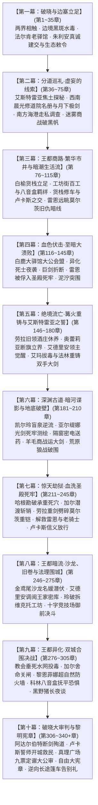
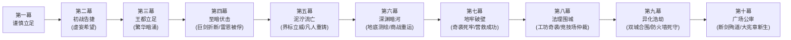

# 方案一：宏篇主线演进与阶段规划方案

> **所属方案**：[00_第二部主线与世界扩充方案总纲.md](file:///home/nanhu2/comfyui/世界书/方案/第二部/主线与世界扩充方案/00_第二部主线与世界扩充方案总纲.md)  
> **规划规模**：310 ~ 340 章长篇史诗体系  
> **演进模式**：十幕·三十阶段·多线交织·至暗救赎史诗体系  
> **核心基调**：纯正日式 RPG 西幻（JRPG Western Fantasy）、正向欧陆封建史实质感、零导力反差、至暗挫折与绝地救赎，严格恪守 [viridia-writer](file:///home/nanhu2/comfyui/世界书/.agents/skills/viridia-writer/SKILL.md) 技能铁律。

---

## 一、 宏观十幕演进全景架构

---

## 二、 十幕三十阶段导航路由总枢纽（全 310~340 章分布）

> 💡 **架构解耦声明**：为彻底杜绝长篇史诗在单一大文件下的上下文损耗与维护膨胀，第二部现全面推行【方案B：分幕专属子目录树 + 大纲与阶段双层解耦】工业级体系。母案聚焦于全局宏观路由与跨幕流转，详细阶段推演全面下沉至各幕专属目录。

---

### 1. 【第一幕：破晓与边塞立足】（第 1 ~ 35 章，共 35 章）
* **核心定位**：战后余波的净化、跨界规则的建立、伪装融入封建王国、第一座地下中继站的立足。商队深入维里迪亚关隘，平息黑斑水毒化解焚营危机，老哨长巴恩斯感念救孙之德开启古代排沙涵洞放行，朱利安王子真诚建交签署生态保护敕令，确立三路分兵。
* **幕级导航**：👉 [00_第一幕大纲与接口.md](file:///home/nanhu2/comfyui/世界书/方案/第二部/主线与世界扩充方案/分阶段详规/01_第一幕_破晓与边塞立足/00_第一幕大纲与接口.md)
* **下属阶段速查**：
  | 阶段编号 | 阶段名称 | 章节区间 | 详规链接 |
  | :--- | :--- | :--- | :--- |
  | **阶段一** | 战后新生与两界相触 | 第 1 ~ 8 章 | [阶段一详规](file:///home/nanhu2/comfyui/世界书/方案/第二部/主线与世界扩充方案/分阶段详规/01_第一幕_破晓与边塞立足/阶段一_战后新生与两界相触详规.md) |
  | **阶段二** | 边境暗流与要塞破关 | 第 9 ~ 19 章 | [阶段二详规](file:///home/nanhu2/comfyui/世界书/方案/第二部/主线与世界扩充方案/分阶段详规/01_第一幕_破晓与边塞立足/阶段二_边境暗流与要塞破关详规.md) |
  | **阶段三** | 法尔肯驿镇与边境前哨 | 第 20 ~ 35 章 | [阶段三详规](file:///home/nanhu2/comfyui/世界书/方案/第二部/主线与世界扩充方案/分阶段详规/01_第一幕_破晓与边塞立足/阶段三_法尔肯驿镇与边境前哨详规.md) |

---

### 2. 【第二幕：分道巡礼·虚妄的线索】（第 36 ~ 75 章，共 40 章）
* **核心定位**：三轨并进展开深度独立调查，逐步触碰反派核心禁区。艾斯特雷亚焦土探秘起获父亲学者遗志与工匠主齿轮；晨光修道院起获十四人名册，月下极剑救赎雷恩；海港湿地起获心木碳化残根与洗钱暗账；法尔肯商争复式记账穿透假账，罗恩巨狼月下破阵粉碎死士。
* **幕级导航**：👉 [00_第二幕大纲与接口.md](file:///home/nanhu2/comfyui/世界书/方案/第二部/主线与世界扩充方案/分阶段详规/02_第二幕_分道巡礼·虚妄的线索/00_第二幕大纲与接口.md)
* **下属阶段速查**：
  | 阶段编号 | 阶段名称 | 章节区间 | 详规链接 |
  | :--- | :--- | :--- | :--- |
  | **阶段四** | 艾斯特雷亚焦土与炼金机兽 | 第 36 ~ 48 章 | [阶段四详规](file:///home/nanhu2/comfyui/世界书/方案/第二部/主线与世界扩充方案/分阶段详规/02_第二幕_分道巡礼·虚妄的线索/阶段四_艾斯特雷亚焦土与炼金机兽详规.md) |
  | **阶段五** | 晨光修道院救赎与折剑十四人 | 第 49 ~ 58 章 | [阶段五详规](file:///home/nanhu2/comfyui/世界书/方案/第二部/主线与世界扩充方案/分阶段详规/02_第二幕_分道巡礼·虚妄的线索/阶段五_晨光修道院救赎与折剑十四人详规.md) |
  | **阶段六** | 迷雾海港走私网络与暗影黑帆 | 第 59 ~ 68 章 | [阶段六详规](file:///home/nanhu2/comfyui/世界书/方案/第二部/主线与世界扩充方案/分阶段详规/02_第二幕_分道巡礼·虚妄的线索/阶段六_迷雾海港走私网络与暗影黑帆详规.md) |
  | **阶段七** | 法尔肯迷雾商争与月下破袭 | 第 69 ~ 75 章 | [阶段七详规](file:///home/nanhu2/comfyui/世界书/方案/第二部/主线与世界扩充方案/分阶段详规/02_第二幕_分道巡礼·虚妄的线索/阶段七_法尔肯迷雾商争与月下破袭详规.md) |

---

### 3. 【第三幕：王都商路·繁华市井与暗潮生活流】（第 76 ~ 115 章，共 40 章）
* **核心定位**：战役间歇期的王都生活流大舒展，全景展开上城要塞、中城集市沙龙、下城工坊运河三层立体格局。白榆货栈扎根下城，玲与艾玛结识纯良学徒科林并展开八音盒羁绊；黎恩修车修蹄结交正直先锋队长卢卡斯；雷恩辨识莫尔茨凶影戒备；哈根勘测暗渠；商队获全境特许紫蜡文牒，平原大道从容启程，暴风雨前夕抵达白鹿大驿馆就位。
* **幕级导航**：👉 [00_第三幕大纲与接口.md](file:///home/nanhu2/comfyui/世界书/方案/第二部/主线与世界扩充方案/分阶段详规/03_第三幕_王都商路·繁华市井与暗潮生活流/00_第三幕大纲与接口.md)
* **下属阶段速查**：
  | 阶段编号 | 阶段名称 | 章节区间 | 详规链接 |
  | :--- | :--- | :--- | :--- |
  | **阶段八** | 王都初至与白榆货栈 | 第 76 ~ 85 章 | [阶段八详规](file:///home/nanhu2/comfyui/世界书/方案/第二部/主线与世界扩充方案/分阶段详规/03_第三幕_王都商路·繁华市井与暗潮生活流/阶段八_王都初至与白榆货栈详规.md) |
  | **阶段九** | 工坊街百工与八音盒之音 | 第 86 ~ 95 章 | [阶段九详规](file:///home/nanhu2/comfyui/世界书/方案/第二部/主线与世界扩充方案/分阶段详规/03_第三幕_王都商路·繁华市井与暗潮生活流/阶段九_工坊街百工与八音盒之音详规.md) |
  | **阶段十** | 王都繁华沙龙与市井暗涌 | 第 96 ~ 105 章 | [阶段十详规](file:///home/nanhu2/comfyui/世界书/方案/第二部/主线与世界扩充方案/分阶段详规/03_第三幕_王都商路·繁华市井与暗潮生活流/阶段十_王都繁华沙龙与市井暗涌详规.md) |
  | **阶段十一** | 纯铜八音盒商栈托付与白鹿启程 | 第 106 ~ 115 章 | [阶段十一详规](file:///home/nanhu2/comfyui/世界书/方案/第二部/主线与世界扩充方案/分阶段详规/03_第三幕_王都商路·繁华市井与暗潮生活流/阶段十一_纯铜八音盒商栈托付与白鹿启程详规.md) |

---

### 4. 【第四幕：血色伏击·至暗大溃败】（第 116 ~ 145 章，共 30 章）
* **核心定位**：全书第一次断崖式跌落低谷！反派展现碾压级冷酷政治手腕与恐怖生化武力，安全网全线崩塌。白鹿大驿馆密室验看四大铁证确立政治同盟，深夜遭数千铁骑与异化死士合围；戴着道义枷锁守护平民，劳拉双手大剑硬撼重锤黑酸当场折断重创；雷恩斩断吊桥绞盘力竭被俘押入第七号水牢；朱利安断后负伤，老国王被软禁，全境通缉。
* **幕级导航**：👉 [00_第四幕大纲与接口.md](file:///home/nanhu2/comfyui/世界书/方案/第二部/主线与世界扩充方案/分阶段详规/04_第四幕_血色伏击·至暗大溃败/00_第四幕大纲与接口.md)
* **下属阶段速查**：
  | 阶段编号 | 阶段名称 | 章节区间 | 核心演进概览 |
  | :--- | :--- | :--- | :--- |
  | **阶段十二** | 合流会盟与白鹿大驿馆围城 | 第 116 ~ 125 章 | 密室验看四大铁证确立政治盟约，雷恩道义誓约，深夜暴雨中达米安死士与阿达尔伯特铁骑合围。 |
  | **阶段十三** | 异化死士狂潮与名刃折断 | 第 126 ~ 135 章 | 异端死士自爆喷酸，劳拉舍身硬撼护平民，巨剑断折脏腑受创。 |
  | **阶段十四** | 石桥断后、雷恩被俘与王室政变 | 第 136 ~ 145 章 | 雷恩斩断绞盘被俘，大团长扣为人质，王子断后负伤，老国王被软禁。 |

---

### 5. 【第五幕：绝境流亡·篝火重铸与艾斯特雷亚之誓】（第 146 ~ 180 章，共 35 章）
* **核心定位**：从泥泞绝望中爬起，人心向背悄然逆转；完成信念觉醒与战备重整，边境战术威慑建立。劳拉酒庄休养，领民掩护促成艾德里安领主意志觉醒；奥蕾莉亚手持阿卡迪亚巨剑单人断旗立界威慑圣殿骑兵；菲穿越涵洞送断刃，法林与哈根以凡人匠艺雕琢防酸符文重铸破邪巨剑；加尔与罗恩特遣组水运集结。
* **幕级导航**：👉 [00_第五幕大纲与接口.md](file:///home/nanhu2/comfyui/世界书/方案/第二部/主线与世界扩充方案/分阶段详规/05_第五幕_绝境流亡·篝火重铸与艾斯特雷亚之誓/00_第五幕大纲与接口.md)
* **下属阶段速查**：
  | 阶段编号 | 阶段名称 | 章节区间 | 核心演进概览 |
  | :--- | :--- | :--- | :--- |
  | **阶段十五** | 泥泞逃亡、领民相护与领主觉醒 | 第 146 ~ 156 章 | 酒庄地窖避难照料劳拉，领民誓死掩护，艾德里安领主觉醒，水牢巴恩斯傲骨。 |
  | **阶段十六** | 界标对峙与黄金罗刹重剑威慑 | 第 157 ~ 167 章 | 圣殿骑兵搜山，奥蕾莉亚重剑斩帅旗断界威慑，阿达尔伯特封关围而不攻。 |
  | **阶段十七** | 太古古库破译与重铸防酸破邪巨剑 | 第 168 ~ 180 章 | 菲暗送断刃，法林附魔银刻针重铸双手大剑，加尔罗恩特遣小组水运抵线。 |

---

### 6. 【第六幕：深渊古道·暗河谍影与地底破壁】（第 181 ~ 210 章，共 30 章）
* **核心定位**：全篇特务谍战与技术攻坚的巅峰大幕！特务组与学者组全权主导，千米地底潜渡逆向破译，打通劫狱唯一生命线。凯尔与玲暗河探险破译重力石闸密码；亚尔缇娜壁虎静音攀附测绘死牢地底水网，敲击密电码隔窗接头雷恩送药；亚莉莎虚假羊毛转口商战对冲，罗恩巨狼夜战破围，重剑安全运抵地底接应点。
* **幕级导航**：👉 [00_第六幕大纲与接口.md](file:///home/nanhu2/comfyui/世界书/方案/第二部/主线与世界扩充方案/分阶段详规/06_第六幕_深渊古道·暗河谍影与地底破壁/00_第六幕大纲与接口.md)
* **下属阶段速查**：
  | 阶段编号 | 阶段名称 | 章节区间 | 核心演进概览 |
  | :--- | :--- | :--- | :--- |
  | **阶段十八** | 盲泉逆流与太古石闸 | 第 181 ~ 190 章 | 凯尔护玲斗巨蜥，太古封印语破译重力石闸，打通地底生命线。 |
  | **阶段十九** | 特务黑兔与死牢水网逆向测绘 | 第 191 ~ 200 章 | 亚尔缇娜光剑潜入绘制立体水网，密电接头雷恩送药，暗河营地口琴八音盒共鸣。 |
  | **阶段二十** | 黑市商道交锋与重器密运 | 第 201 ~ 210 章 | 亚莉莎羊毛贸易对冲商战运大剑，罗恩巨狼扫荡暗哨，劫狱条件全面成熟。 |

---

### 7. 【第七幕：惊天劫狱·血洗圣殿死牢】（第 211 ~ 245 章，共 35 章）
* **核心定位**：全篇最惊心动魄的特种攻坚战役！小队依托地底测绘管网渗透直捣敌军心脏，完成地牢逆转与家人守候。哈根看穿两百年承重主拱吊栓减配死穴，加尔水底潜渡斩断传动销开道；劳拉手持新生重剑正面斩碎莫尔茨胸前重铠雪耻；雷恩与十四老骑士获救；卢卡斯看清伪善撤桥放行；爱丽榭暗室端汤救护，家人温存破晓。
* **幕级导航**：👉 [00_第七幕大纲与接口.md](file:///home/nanhu2/comfyui/世界书/方案/第二部/主线与世界扩充方案/分阶段详规/07_第七幕_惊天劫狱·血洗圣殿死牢/00_第七幕大纲与接口.md)
* **下属阶段速查**：
  | 阶段编号 | 阶段名称 | 章节区间 | 核心演进概览 |
  | :--- | :--- | :--- | :--- |
  | **阶段二十一** | 哈根勘破死穴与加尔水泽潜渡 | 第 211 ~ 221 章 | 哈根工程点穴勘破主拱死穴，加尔潜入水底斩销，暴力开辟潜入通道。 |
  | **阶段二十二** | 奇袭深层水牢与重剑斩碎莫尔茨重铠 | 第 222 ~ 233 章 | 突袭底层水牢，劳拉重剑斩碎莫尔茨重铠震落激流，解救雷恩与十四老骑士。 |
  | **阶段二十三** | 信义抉择放行与暗室深夜守候喂汤 | 第 234 ~ 245 章 | 卢卡斯撤桥放行同袍，全员撤回黑野猪暗室，爱丽榭系围裙端勺吹温喂汤。 |

---

### 8. 【第八幕：王都暗流·沙龙、旧卷与法理围城】（第 246 ~ 275 章，共 30 章）
* **核心定位**：从流亡转向合法反击！启用王都上层社交、旧案密档起获、物理黑客奇袭禁忌工坊与公开仲裁决斗，彻底瓦解反派政治合法性。爱丽榭与亚莉莎沙龙外交游说，大陪审团呈现 3➔5➔7 票倒戈；艾德里安调阅王家密库起获合法特许状；玲铜发夹破拆维克托工坊卡死自毁断绝产能；竞技场御前决斗雷恩完胜，大陪审团 9 票定谳，阿达尔伯特与克莱门特决裂！
* **幕级导航**：👉 [00_第八幕大纲与接口.md](file:///home/nanhu2/comfyui/世界书/方案/第二部/主线与世界扩充方案/分阶段详规/08_第八幕_王都暗流·沙龙旧卷与法理围城/00_第八幕大纲与接口.md)
* **下属阶段速查**：
  | 阶段编号 | 阶段名称 | 章节区间 | 核心演进概览 |
  | :--- | :--- | :--- | :--- |
  | **阶段二十四** | 双城潜流与金鸢尾沙龙外交游说 | 第 246 ~ 255 章 | 爱丽榭古竖琴折服名媛揭露勒索，亚莉莎游说领主利益读条，黑野猪兄妹修罗场。 |
  | **阶段二十五** | 王家秘库档案起获与维克托地下工坊奇袭 | 第 256 ~ 265 章 | 调阅王室特许状底卷，科林留白垩暗记，玲铜发夹卡死换向阀破拆工坊。 |
  | **阶段二十六** | 十字竞技场御前仲裁决斗 | 第 266 ~ 275 章 | 启动宪章决斗权，雷恩沙池挑飞裁决剑士，大陪审团9票定谳，两大反派决裂。 |

---

### 9. 【第九幕：王都异化·双城合围决战】（第 276 ~ 305 章，共 30 章）
* **核心定位**：反派穷途末路发动无差别生化屠杀，平民陷入狂澜；特遣精锐协同攻坚，黎恩与菲娜构筑超自然防火墙，王都全面光复。克莱门特水网总渠倾倒原液，阿达尔伯特关防封城；科林避难所转动八音盒抚慰受灾孩童；凯尔破译盲泉主闸坐标，加尔舍命潜入关闭主阀引入活泉；黎恩菲娜千米超自然防火墙阻绝巨兽过载坍缩；朱利安起义救出老国王，战前围炉深谈。
* **幕级导航**：👉 [00_第九幕大纲与接口.md](file:///home/nanhu2/comfyui/世界书/方案/第二部/主线与世界扩充方案/分阶段详规/09_第九幕_王都异化·双城合围决战/00_第九幕大纲与接口.md)
* **下属阶段速查**：
  | 阶段编号 | 阶段名称 | 章节区间 | 核心演进概览 |
  | :--- | :--- | :--- | :--- |
  | **阶段二十七** | 教会投毒水网与炼狱王都 | 第 276 ~ 285 章 | 克莱门特垂死投毒水网，阿达尔伯特封城，科林转动八音盒点亮人性微光。 |
  | **阶段二十八** | 太古水网主闸破译与冲车破障 | 第 286 ~ 295 章 | 凯尔定位盲泉主闸，加尔舍命潜渡关闸换清泉，哈根冲车与罗恩巨狼破障。 |
  | **阶段二十九** | 黎恩菲娜超自然防火墙与黑野猪长夜谈 | 第 296 ~ 305 章 | 澄澈鬼之力与炽天使圣光筑千米防火墙，朱利安收复王宫，黑野猪围炉长夜谈。 |

---

### 10. 【第十幕：破晓大审判与黎明宪章】（第 306 ~ 340+ 章，共 35+ 章）
* **核心定位**：政治、法律与武道的终极清算！本土力量自主确立正义，两大首恶伏诛，神权法统洗牌，英雄卸甲，留下跨位面高维之谜。圣殿校场雷恩问责，阿达尔伯特断剑殉道以残躯卡死机轮赎罪；卢卡斯誓师重践誓言开城救民平暴；真理广场大公审四大铁证如山，艾德里安手刃终极机兽家门昭雪；朱利安加冕签署《自由大宪章》与生态敕令；4章逆向长途篷车告别礼，女组温泉治愈长夜，世界外侧伏笔显露。
* **幕级导航**：👉 [00_第十幕大纲与接口.md](file:///home/nanhu2/comfyui/世界书/方案/第二部/主线与世界扩充方案/分阶段详规/10_第十幕_破晓大审判与黎明宪章/00_第十幕大纲与接口.md)
* **下属阶段速查**：
  | 阶段编号 | 阶段名称 | 章节区间 | 核心演进概览 |
  | :--- | :--- | :--- | :--- |
  | **阶段三十** | 校场誓师、双城平暴、广场公审与黎明新世界 | 第 306 ~ 340+ 章 | 阿达尔伯特断剑卡齿轮殉道、卢卡斯铁骑开城平暴、真理广场法槌定谳、大宪章新生、4章逆向篷车巡礼告别、女组温泉夜话、第三部高维之楔伏笔。 |

---

## 三、 十幕挫折律动与核心破局对照

主线拒绝平铺直叙，设立递进式挫折瓶颈。全篇瓶颈由营地伙伴、各族挚友与本土盟友凭借凡人智慧、工程造诣与多元羁绊逐步突破，凸显凡人意志的高光：

| 幕次 | 挫折 / 危机瓶颈 | 困境表现 | 核心破局主角与手段 |
| :--- | :--- | :--- | :--- |
| **第一幕** | 关隘黑斑水毒蔓延 | 边境草药告罄，教廷司铎欲纵火焚营 | **菲娜（炽天使纯净调和）+ 爱丽榭（草药配方）**：以微量克制圣光融入草药汤剂平息毒情，化解人道危机，救下幼孙提米。 |
| **第二幕** | 艾斯特雷亚地窟暗影蚀心毒与古代机兽 | 艾德里安遭瘴气侵蚀精神动摇，重型机兽坚不可摧 | **古老先灵埃尔德莱恩（先灵之镜）+ 菲（机巧拆解）+ 亚莉莎与罗恩（阶段七商战破黑帆）**：先灵之镜映照当年火灾真相坚固意志；菲机巧拆解撬下工匠印号主齿轮；亚莉莎复式记账穿透洗钱暗账，罗恩满月巨狼撕碎黑帆。 |
| **第三幕** | 王都官僚门槛与税官刁难、旧仇暗影潜伏 | 通关文牒滞后需5~6周周旋，雷恩辨识要塞典狱长莫尔茨凶影，市井排查暗流涌动 | **亚莉莎（复式记账梳理关防）+ 黎恩（修车整备结交卢卡斯）+ 艾玛玲（工坊街八音盒羁绊）+ 哈根（勘测暗渠）**：建立白榆货栈扎根下城，化解工坊街冲突，获取合法文牒，从容蓄力合流。 |
| **第四幕** | **【至暗转折】白鹿驿馆伏击** | 达米安与死士合围，亚尔席昂巨剑折断，雷恩被俘入死牢，王室遭软禁 | **朱利安王子（率近卫军断后负伤）+ 汉斯暗中送药 + 旧领领民（以干草车誓死藏匿伤员）**：在泥泞绝境中守护火种。 |
| **第五幕** | 巨剑强酸坏死受阻，关隘骑兵进犯 | 剑身遭强酸灼蚀与重击断裂，金属孔隙渗毒无法熔铸；圣殿铁骑企图越过界标搜山 | **奥蕾莉亚（单人阿卡迪亚断旗立界）+ 艾玛/鳞母/法林多尔金（除酸重铸巨剑）+ 艾德里安领主觉醒**：黄金罗刹重剑威慑逼退搜捕；法林以黑角木符文刻杖与附魔银刻针雕琢防酸符文，纯粹凡人匠艺重铸防酸破邪双手大剑！ |
| **第六幕** | 深渊死牢断绝地表通讯与强攻条件 | 地表全面戒严，死牢暗藏水银震动报警与管网迷宫 | **玲（精巧机械齿轮卡死与水银阀暗锁）+ 凯尔（太古矮人石闸密码破译）+ 亚尔缇娜（壁虎静音攀附绘制立体水网/密电送药）+ 亚莉莎与罗恩（酒桶商战走私与满月巨狼破围）**：特遣组千米地底潜入，打通惊天劫狱生命线！ |
| **第七幕** | 死牢排沙盲井注满暗影水银暗锁 | 莫尔茨在要塞排沙死角布设机关铁网与暗锁，突入受阻 | **哈根（工程勘破点穴）+ 加尔（水泽勇士超凡潜水）+ 劳拉（重铸大剑斩碎莫尔茨重铠）+ 卢卡斯放行 + 爱丽榭（黑野猪暗室端汤救护）**：哈根看穿悬坠联动暗锁，指引加尔潜入水底斩断传动销，暴力开辟血洗死牢通道！ |
| **第八幕** | 教廷掌控舆论审判权并量产机兽，工坊被毁后发动全城宵禁反扑 | 克莱门特欲公开审判雷恩，工坊被破后封锁商行软禁玛格丽特、接管近卫防区 | **亚莉莎与爱丽榭（沙龙名媛破防与外交游说）+ 玲与法林（物理黑客破拆维克托工坊）+ 朱利安与雷恩（御前决斗完胜）**：大陪审团 9 票倒戈彻底粉碎反派合法性！ |
| **第九幕** | 王都下水道全城暗影投毒暴走 | 反派垂死向水网倾倒原液，平民异化狂暴，巨兽过载坍缩 | **凯尔与玲（太古图纸破译定位盲泉主闸）+ 亚尔缇娜（声纳回波引导）+ 加尔（舍命关闸）+ 黎恩菲娜（超自然防火墙）+ 黑野猪长夜谈**：水泽勇士引入活泉，双强阻隔生化灾害，众人围炉蓄势！ |
| **第十幕** | 终极机兽突袭校场欲毁铁证，王都陷入生化浩劫 | 校场外围失控机兽扑杀老副团长，全城九门紧闭灾厄蔓延 | **阿达尔伯特（断剑卡死机兽以身殉道）+ 卢卡斯率骑士团（重践誓言开城平暴）+ 艾德里安（刺穿核心斩首）+ 瓦卢瓦法槌定谳 + 逆向巡礼 + 女组温泉夜话**：骑士觉醒、法理定谳与黎明大告别！ |

---

## 四、 docs2 实体完全咬合索引

| 方案维度 | 涉及的 docs2 实体卡片 |
| :--- | :--- |
| **主要角色** | 黎恩、Seraphina（菲娜）、劳拉、雷恩、艾德里安、菲、朱利安、乔治、爱丽榭、亚尔缇娜、艾玛、法林、玲、凯尔、罗恩、亚莉莎、奥蕾莉亚、加尔 |
| **重要NPC** | 埃德蒙（国王·50岁）、克莱门特三世（枢机主教·71岁）、阿达尔伯特（大团长·59岁）、戈德弗里（老副团长·62岁）、卢卡斯（白鹰队长·25岁·`NPC_D2_15`）、科林（钟表学徒·18岁·`NPC_D2_25`）、达米安（异端审问官·29岁）、维克托·格拉斯（炼金首席·35岁）、莫尔茨（地牢典狱长·38岁·`NPC_D2_19`）、玛格丽特（迷迭香商行·32岁）、瓦尔特·巴恩斯（关隘老哨长·54岁）、艾琳娜（药舍修女·24岁）、柯恩·瓦尔德（帝国学者·55岁）、马奇亚斯（帝国调查官·23岁）、多尔金（矮人锻造大师）、哈根（矮人建筑大师·280岁·`NPC_D2_07`）、狼人月语者（狼族族长）、蜥蜴人鳞母（沼泽首领）、弗朗索瓦·德·瓦卢瓦（瓦卢瓦伯爵·65岁·大理院首席法官）、亨里克·冯·布鲁诺（亨里克边境伯·52岁·平原大领主）、埃尔德莱恩（古老先灵·数千岁·最初守护者） |
| **王都核心舞台** | 十字竞技场（`LOC_D2_35`）、金鸢尾沙龙（`LOC_D2_40`）、圣泉大浴堂（`LOC_D2_33`）、真理广场（`LOC_D2_28`）、白金王宫（`LOC_D2_27`，王宫温室、密室）、晨光大教堂（`LOC_D2_19`）、教廷秘库（`LOC_D2_20`）、王都下水道（`LOC_D2_26`）、黑野猪酒馆（`LOC_D2_30`）、白榆货栈（下城临河商栈）、白鸽与游丝钟表工坊（下城工坊街）、圣殿要塞（`LOC_D2_21`，圣殿地牢 `LOC_D2_23`、圣殿校场 `LOC_D2_22`） |
| **王国领地舞台** | 维里迪亚关隘（`LOC_D2_04`）、法尔肯驿镇（`LOC_D2_05`）、迷迭香商行（`LOC_D2_06`）、艾斯特雷亚堡（`LOC_D2_09`）、艾斯特雷亚酒庄（`LOC_D2_37`）、暗影地窟（`LOC_D2_14`）、白鹿驿馆（`LOC_D2_31`）、晨光修道院（`LOC_D2_07`）、隐士石泉（`LOC_D2_13`）、维里迪亚平原（`LOC_D2_15`）、迷雾海港（`LOC_D2_17`）、南部沼泽（`LOC_D2_18`） |
| **森林与帝国后方** | 艾斯特雷亚别邸（`LOC_D2_02`）、太古石殿（`LOC_D2_03`）、太古秘书库（`LOC_D2_29`）、心木圣坛（`LOC_D2_34`）、矮人锻炉大厅（`LOC_D2_35`）、狼人隐谷（`LOC_D2_08`）、边境猎屋（`LOC_D2_36`）、营地篝火（`LOC_D2_37`）、森林温泉（`LOC_D2_41`）、时空裂隙（`LOC_D2_38`）、裂隙阴影区（`LOC_D2_39`）、天线观测台（`LOC_D2_40`）、边境机房、帝都图书馆 |
| **威胁与生物** | 暗影噬光傀儡、暗影实验畸变体、暗影忏悔者、破誓黑血狂骑、残区影牙兽、矮人族、狼人族、蜥蜴人族 |
| **能量与法则** | 暗影能量、圣光、鬼之力、鬼之圣光、雾帷与时空裂隙 |
