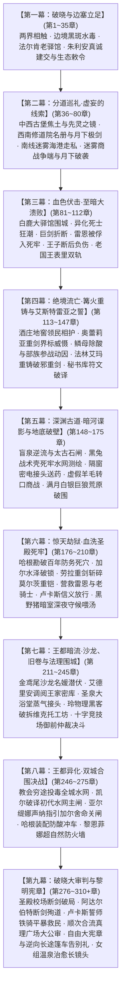
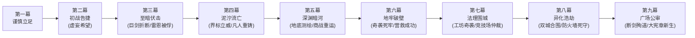

# 方案一：宏篇主线演进与阶段规划方案

> **所属方案**：[00_第二部主线与世界扩充方案总纲.md](file:///home/nanhu2/comfyui/世界书/方案/第二部/主线与世界扩充方案/00_第二部主线与世界扩充方案总纲.md)  
> **规划规模**：280 ~ 300 章长篇史诗体系  
> **演进模式**：九幕·二十九阶段·多线交织·至暗救赎史诗体系  
> **核心基调**：纯正日式 RPG 西幻（JRPG Western Fantasy）、正向欧陆封建史实质感、零导力反差、至暗挫折与绝地救赎，严格恪守 [viridia-writer](file:///home/nanhu2/comfyui/世界书/.agents/skills/viridia-writer/SKILL.md) 技能铁律。

---

## 一、 宏观九幕演进全景架构

---

## 二、 九幕二十九阶段详尽推演（全 280~300 章分布）

### 【第一幕：破晓与边塞立足】（第 1 ~ 35 章，共 35 章）
> **核心定位**：战后余波的净化、跨界规则的建立、伪装融入封建王国、第一座地下中继站的立足。  
> **同行同伴动因铁律**：黎恩、菲娜与同伴视艾德里安与雷恩为真挚信赖的家人，对维里迪亚王国的政治权力毫无世俗利益诉求，纯粹出于守护同伴而同行；同时追查暗影能量与塞姆利亚鬼之力同源的高位面蛛丝马迹。

* **阶段一·战后新生与两界相触（第 1 ~ 8 章）**（详见 [第一幕_阶段一_战后新生与两界相触详规.md](file:///home/nanhu2/comfyui/世界书/方案/第二部/主线与世界扩充方案/分阶段详规/第一幕_阶段一_战后新生与两界相触详规.md)）
  * **主线推进**：森林残区清理影牙残兽，五族共同植下新心木树，打通太古石殿地下深层通道。
  * **跨界建交与装备整备**：黎恩穿过时空裂隙与马奇亚斯建交接文书，获悉帝国东部异变密电；艾玛与菲娜记录裂隙金芒节律；黎恩排查太古废墟以心眼感知并锚定跨界空间裂隙坐标。法林手持出师磨制的【黑角木符文刻杖】与【附魔银刻针】在皮革与锁甲内衬上细致雕琢微光防酸符文，打造非导力护心镜与防具；亚莉莎严密排查可能产生导力外溢的物资，统筹商队账册；爱丽榭备齐营地药草包、便携脱水肉干与耐潮口粮。
  * **动身誓师**：朱利安王子的暗号密信抵达，艾德里安坦白十九年前城堡覆灭真相，雷恩重燃誓言，两队整装践行启程。
  * **支线·隐谷星空下的狼耳微风（亚莉莎 × 罗恩，LOC_D2_08）**：商队出征前夜，亚莉莎在狼人隐谷岩台上核对账册行囊，夜风微凉，罗恩在其身后坐下，用温热厚实的狼耳和毛茸茸的尾巴轻轻绕住其双腿挡风；亚莉莎嘴上微嘟抱怨掉毛，手指却陷进罗恩颈项柔软绒毛中，在静谧星空下倾听彼此心跳。
* **阶段二·边境暗流与要塞破关（第 9 ~ 19 章）**（详见 [第一幕_阶段二_边境暗流与要塞破关详规.md](file:///home/nanhu2/comfyui/世界书/方案/第二部/主线与世界扩充方案/分阶段详规/第一幕_阶段二_边境暗流与要塞破关详规.md)）
  * **行装伪装**：乔治工坊赶制低外溢战术导力皮套与伪装行商箱；爱丽榭准备耐储肉干与营地解毒草药囊。
  * **关隘危局与领主分肥**：商队一行抵达维里迪亚关隘；流民营暴发黑斑水毒（暗影废渣引发），冷风峡谷地方子爵管事与关卡税吏联手盘剥过境商货并抽取重税；异端审问厅执行官达米安冷血下达焚营令；老哨长瓦尔特·巴恩斯幼孙提米濒危。
  * **破局立信**：菲娜以随身携带的爱丽榭特制解毒草药囊，融入微量克制圣光煎煮汤剂平息毒情，救下幼孙提米，化解人道危机；荒原死士暴雨夜突袭灭口，主角团恪守零导力铁律以冷兵器战技全歼敌徒，达米安咬尾追踪。老哨长瓦尔特（十四年前在关前目送副团长被逐的旧旗手）认出雷恩晨光剑势与当年莫尔茨按下的手腕放逐印记，感念旧恩与救孙之德，开启古代排沙涵洞秘密放行。
* **阶段三·法尔肯驿镇与前哨立足（第 20 ~ 35 章）**（详见 [第一幕_阶段三_法尔肯驿镇与边境前哨详规.md](file:///home/nanhu2/comfyui/世界书/方案/第二部/主线与世界扩充方案/分阶段详规/第一幕_阶段三_法尔肯驿镇与边境前哨详规.md)）
  * **据点扎根与市井学徒**：进驻交通枢纽法尔肯驿镇，在镇深处“猎鹰与十字”老驿馆落脚；年轻跑堂学徒汉斯胆小怕事、给客人端热麦糊时手脚发抖，菲悄悄指点其端盘避开巡查；建立双线的边境中继指挥部与情报联络站。
  * **市井风貌**：在老驿馆品尝粗粝麦酒与硬黑麦面包，体验封建集贸重镇的市侩与烟火气；黑市汇率兑换与行商物资采购。
  * **密使接头与朱利安真诚建交**：朱利安王子以极度谦逊自省姿态秘密潜入前哨接头，直言营地没有流血义务，愿以维里迪亚人身份共同迎战暗影；亲手奉还王室密藏十九年的《艾斯特雷亚夫人临终手札与忠仆册》，向艾德里安行贵族歉礼；向雷恩出示十八年来私用内帑发放的平民抚恤密账，拔剑致敬洗刷十四年屈辱。
  * **生态敕令与部族初步破冰**：双方签署《维里迪亚王权对Eldoria圣域生态保护、古老神秘尊重与永不侵犯之敕令》；王子展现先给予尊重不求回报的信义，查禁捕杀狼皮走私团伙并奉还“古代月影祖石”，调派水工修筑深石沉淀池，赢得部族初步信任。
  * **正式分兵**：分兵中西两翼（深入中西部丘陵旧领与西进西南修道院）与南下迷雾海港，黎恩与菲娜留守中枢协调两界物资。
  * **支线·工坊附魔银刻针与复式记账（法林 × 亚莉莎，LOC_D2_03工坊）**：在法尔肯建立中继前哨后，亚莉莎返回大本营工坊统筹边境矿石与物资进出账。法林手持【黑角木符文刻杖】与纤细锋利的【附魔银刻针】（针尖嵌米粒微光晶石），在战甲与防酸皮革上细细刻画防蚀符文。亚莉莎端着热草药茶走入，拿起鹅毛笔运用莱恩福尔特复式记账法为法林重新梳理账册；矮人工匠惊叹于现代财务逻辑的条理分明，亚莉莎亦在专注雕琢轴承的火星中重温工坊挥汗的充实感。

---

### 【第二幕：分道巡礼·虚妄的线索】（第 36 ~ 80 章，共 45 章）
> **核心定位**：三轨并进展开深度独立调查，逐步触碰反派核心禁区；自以为步步为营掌握主动，实则步入反派早已布下的政治绞杀罗网。

* **阶段四·主线A：艾斯特雷亚焦土与黑晶矿奴（第 36 ~ 50 章）**（详见 [第二幕_阶段四_艾斯特雷亚焦土与炼金机兽详规.md](file:///home/nanhu2/comfyui/世界书/方案/第二部/主线与世界扩充方案/分阶段详规/第二幕_阶段四_艾斯特雷亚焦土与炼金机兽详规.md)）
  * **旧领废墟与邻境领主侵蚀**：艾德里安与菲重踏艾斯特雷亚堡焦黑断垣，排查地下密室，起获母亲遗留的镀银首饰盒、断剑与家臣绝笔日志；废墟外围遭遇邻境平原领主低价承租矿区私兵的盘查与阻拦，直面当年灭门背后地方大贵族冷漠分肥的现实；查验死者骸骨呈现琉璃化结晶，推翻山贼谎言。
  * **地窟血战与双重铁证（父亲学者遗志）**：深入暗影地窟，正面迎战被教廷封印囚禁十九年的【暗影实验畸变体】（取得当年古代生化失控铁证）；起获父亲生前日记残篇，揭开**灭门惨案真相**——父亲当年作为古代工法学者发现教会试图利用古代黑晶量产人体杀戮机兽，毅然封存核心发条图纸抗命拒绝交出，方遭克莱门特下令伪造山贼灭族；艾德里安与驻守深层的重型发条战兽【暗影噬光傀儡】死斗，在菲的高速游击下艰难撬下刻有教廷秘库工匠序列号的传动主齿轮；解救矿奴后代，初步凝聚故土民心。
  * **先灵之镜**：艾德里安遭古代瘴气侵蚀，古老先灵埃尔德莱恩借镜湖共鸣短暂显现，动用**先灵之镜**映照当年火灾与暗影真相，坚固艾德里安复仇与继承父志之决心。
  * **支线A·太古秘书库的破译手稿与银狼守护（凯尔 × 玲 × 罗恩，LOC_D2_29）**：三线分兵调查期间，营地太古秘书库幽深石室内昏黄蜂蜡烛光摇曳。凯尔戴着水晶单片眼镜伏在石案前誊写古代铭文与古王国历史纪年，手边放着微凉的薄荷茶；玲坐在高石梯顶端晃悠着白袜小腿，一边吃爱丽榭烤制的花形黄油饼干，一边用银叉随手拨弄桌上的太古发条齿轮，随口指出凯尔转译中的逻辑盲点；罗恩化为白银巨狼趴在石阶地板上打盹，尖耳朵偶尔随着林风警惕抖动，硕大的毛茸茸尾巴给坐累了靠过来的学者挡风取暖。
  * **支线B·古木树洞的幼猫救助（亚尔缇娜 × 黎恩，LOC_D2_01南缘）**：黎恩与亚尔缇娜在边境森林南缘巡弋监控关隘动向。亚尔缇娜操纵战术壳“光剑”悬浮侦察，声纳系统捕捉到微弱的生命反应；在被雷击劈开的古栎树洞中，蜷缩着一只浑身湿透、被荆棘困住的纯白幼猫。素来自称“战术工具”的特务少女，操控光剑轻柔地用合金盾刃挑开倒刺，双手小心翼翼将幼猫捧入怀中；幼猫在战术制服领口蹭出微弱呼噜声，亚尔缇娜微微睁大琥珀色瞳孔，流露出未曾察觉的少女柔和，一本正经立正向黎恩汇报：“报告教官，发现具备高抚慰价值的毛茸生物，请求将其编入营地后勤观察序列。”
* **反派地下视点（POV）·阿达尔伯特冷漠交办与莫尔茨水牢逼供**：
  * 阿达尔伯特随手拨开边境剑痕报告，冷漠下达指令：“十四年了……去翻翻关隘的值防花名册，查出这次是谁在关前放行，直接押回水牢，把嘴撬开。把第七号死牢收拾干净，别让他在外面乱叫，玷污了圣殿的旗号。”**反派严令封锁消息、严禁公然通缉**，因十四年前雷恩是“秘密除名放逐”，大张旗鼓通缉会引起圣殿数千崇敬当年老团长与雷恩的基层骑兵哗然，更会给卧病的老国王重翻惨案旧账的把柄；阿达尔伯特将此事定性为“军团家丑”，指令莫尔茨以家法暗中收拾；
  * 莫尔茨突袭关隘逮捕老哨长瓦尔特·巴恩斯押入黑铁水牢，当着老副团长戈德弗里的面以带刺生铁重枷与皮鞭严刑拷问；老巴恩斯抹了把嘴角的血水，沙哑地低低笑出声来，眼神里满是老兵的蔑视：“呸……十四年前在大雨里，老子跟着雷恩大人放走了平民；几天前在关隘涵洞，老子又亲手把雷恩大人放了进来！老子当了二十七年兵，就数这两回把脊梁骨挺直了！莫尔茨，雷恩大人已经回来了……你们这帮披着铁皮的教会看门狗，好日子到头了！”
* **阶段五·主线B：晨光修道院救赎与折剑十四人（第 51 ~ 64 章）**
  * **西南巡礼**：雷恩与劳拉穿行冷杉林山道抵晨光修道院，接头药舍修女艾琳娜，起获拒杀平民十四人名册原本与黑血样本。
  * **名场面·月下的极剑**：修道院后山月光下，雷恩袒露当年雨夜心结与烙印耻辱；劳拉以亚尔席昂巨剑锋芒与刚毅坦荡的剑士之魂正面迎击锚定雷恩，完成崇高救赎。
  * **同袍对峙**：白鹰队长卢卡斯率队赶到；雷恩恪守不伤同袍原则挑落全队佩剑，震撼年轻骑士，缴获带有主教私印的调兵令。
  * **支线·修道院石回廊的药草清茶（Seraphina/菲娜 × 艾琳娜修女，LOC_D2_12）**：商队巡礼至晨光修道院探访折剑退役老兵，艾琳娜修女主持药舍。菲娜在后山药圃与艾琳娜一起采摘洋甘菊与金盏花，研磨镇痛软膏，坐在爬满常春藤的石长廊下品尝微苦的鼠尾草清茶。艾琳娜修女看着菲娜指尖跳动的淡金色微光，轻声感叹“就像早春破土的嫩芽一样温暖”；菲娜微笑着将捣碎的花泥抹在亚麻绷带上，温和回应“在修女这里，那些被战争折断的灵魂才重新找到了归宿”；爱丽榭则在营地大本营根据送回的配方熬制五族暖汤。
* **阶段六·主线C：迷雾海港走私网络与暗影黑帆（第 65 ~ 74 章）**
  * **南方海港湿地**：黎恩、菲娜与乔治以商会护卫名义深入迷雾海港，联合玛格丽特夫人铺开南方调查线。
  * **黑市航路调查与生态重锤**：查获教廷假借海外布道勾结海盗倾倒毒渣、走私违禁麻醉草药筹措黑市军资；更在走私船吃水最深的密舱中，起获三十一年前教廷自 Eldoria 森林掠夺、用于为发条机兽黑晶充能的**“心木树枯萎碳化残根”**；目睹水网下游受排毒废渣侵害的流民孤儿，确立菲娜（生态守护者）与黎恩的不可动摇参战信念，彻底绝缘“打野做支线”的漂离感。
  * **斩断黑帆与反派情报拼图合拢**：在芦苇荡深处突袭走私货栈，截获教廷洗钱暗账、受贿贵族往来密卷与私兵黑钢甲胄；达米安案头情报汇总，反派拉响围剿警报。
* **阶段七·法尔肯迷雾商争与月下破袭（第 75 ~ 80 章，共 6 章）**
  * **场景舞台**：法尔肯驿镇集市、大车行货栈、迷迭香商行暗窖。
  * **主线推进**：
    1. **经济绞杀与粮食危机**：教廷指使特许商人罗曼商行联合圣殿税卡，下达严苛的货税倍增令与特许查扣令，扣押迷迭香商行的南境粮食商队，企图以经济命脉扼杀法尔肯反抗萌芽，逼迫镇民交出私藏流民，切断主角团的后勤通道；
    2. **现代商战降维穿透**：亚莉莎以莱恩福尔特集团现代企业经营经验，指导玛格丽特夫人利用复式记账法彻底穿透特许商会设立的多层空壳商会与虚假承兑汇票，查明洗钱暗账的真实资金链与逃税漏洞，在法尔肯集市公开契约仲裁，联合大车行与中小行商形成利益同盟；
    3. **月下破袭粉碎死士**：行动当夜，教廷黑市死士企图放火焚毁大车行粮仓；罗恩化身两米余高的霜银巨狼，率部族勇士在深夜巷道雷霆破阵，以摧枯拉朽的物理蛮力撕碎死士包围网；亚莉莎骑乘在狼背上疾速连射，一箭射穿死士首领的淬毒短弩，物理粉碎敌人的破坏阴谋；
    4. **战果收拢与会师**：保全了法尔肯物资枢纽，迫使圣殿地方税官狼狈退让，确立主角团在法尔肯市井的崇高威望，稳固后方大本营；战后商战组带上充足粮秣与密卷，赶赴平原白鹿大驿馆与主力会师！

---

### 【第三幕：血色伏击·至暗大溃败】（第 81 ~ 112 章，共 32 章）
> **核心定位**：全书第一次断崖式跌落低谷！反派展现碾压级冷酷政治手腕与恐怖生化武力，安全网全线崩塌。

* **阶段八·合流陷阱与白鹿大驿馆围城（第 81 ~ 88 章）**
  * **三线会师与行驿暗流**：三组人马携四大物理铁证（工匠印号齿轮、十四人名册调兵令、洗钱账本、主教密卷）在平原大道白鹿大驿馆汇合。该驿馆系亨里克边境伯领地名下的高档贵族行驿，保守派领主眼线暗中将密信送交教会；然而同情王室的年轻侍从感念艾斯特雷亚旧恩，悄悄给近卫军留下了通往后山马厩的暗门钥匙，展现贵族阶层内部的深刻撕裂。驿馆内同时滞留着大量惊恐无措的马夫、侍应与平民杂工；
  * **致命情报泄露与雷恩的温和恳求**：达米安以教会地下密探网锁定行踪并向圣殿报信；深夜暴雨倾盆，圣殿大团长阿达尔伯特调遣数千圣殿精锐铁骑与莫尔茨押解队将大驿馆重重合围，箭镞如雨。面对夜雨中逐渐逼近的要塞骑兵，雷恩按住剑柄的手指微微发紧，转头看向身旁的黎恩与劳拉，声音压得很低，带着掩饰不住的愧疚与恳求：“黎恩、劳拉……算我求大家一件事。那些骑兵……很多都是刚通过考核的年轻孩子，只是奉命列阵。错在下达调令的人，不在他们。如果可以的话……请尽量留他们一条生路。”黎恩反手握紧太刀刀鞘，温和地点了点头：“啊，我们明白。我们本就没打算在这片土地上徒增无谓的牺牲。”劳拉上前一步，伸手轻轻覆在雷恩握剑的手背上，目光坦荡而坚定：“剑是为了守护而拔。雷恩，你的心意，我们全员接下了。”
* **阶段九·异化死士狂潮与战器折断（第 89 ~ 96 章）**
  * **异端兵器登场与平民牵制**：教廷达米安暗中投入由活体注入黑血而成的“暗影忏悔者”与重装“破誓黑血狂骑”大军，与维克托改良的重型喷酸战兽、圣殿铁骑配合发动无情绞杀；反派在后方冷血驱使死士在人群中释放酸雾，黎恩与菲娜必须拼尽全力维持防护、引导滞留平民疏散，大部分气力被救援牵制；
  * **惨烈突围与守护之仁（名刃断折）**：白鹿大驿馆内部为狭窄回廊与石木庭院，主角团被数倍敌军压缩在逼仄空间内，大开大合的战技难以完全施展；为了避开要害，主角团全员默契地仅以剑脊击打、鞘击与瞬步卸除骑兵武装，而达米安驱使的异化死士招招自爆换命、毫无顾忌，主角团“戴着仁慈与道义的枷锁”陷入寡不敌众的战术绝境；攻城战兽狂暴挥下重锤，混杂着高压喷溅的炽烈剧毒黑酸，为了护住身后负伤的同伴与无辜避难平民，劳拉双手横剑舍身正面硬撼；猛烈轰击的钝击震荡与剧毒黑酸的灼蚀同时爆发，名刃发出悲鸣般的脆响，星银百锻的剑身当场崩裂断折！劳拉脏腑受创吐血。**核心定性**：巨剑折断源于劳拉崇高的“守护之仁”与极端狭窄地形，是舍身救人的牺牲，绝非剑术技艺不敌。
* **阶段十·雷恩断后与被俘入狱（第 97 ~ 103 章）**
  * **石桥断后**：追兵封锁石桥吊闸，雷恩在重创之下决然拔出晨光断剑斩断绞盘铁链卡死吊桥，为同伴争取撤退生机。
  * **力竭被俘、战略人质与水牢沉重交锋**：雷恩独身阻击力竭倒地；达米安率异端审问厅死士踏上吊桥欲拔剑枭首灭口，阿达尔伯特在暴雨中冷冷拔剑震开达米安的剑锋：“圣殿之誓由圣殿家法处置，轮不到异端审问厅在此越权杀人！”目睹雷恩哪怕断剑力竭依然誓死守护同伴的纯白剑势，阿达尔伯特内心剧烈震荡——当年正是教廷在边境村落提前投放黑血制造轻微异变，以此逼迫老团长当刽子手清剿，阿达尔伯特十四年来为保全修会名誉成了帮凶，深陷被教会勒索与道义凌迟的泥潭；扣押雷恩在第七号死牢，既是出于深层愧疚，更是为了留存**防备教廷卸磨杀驴的战略人质**；大团长喝令莫尔茨给雷恩扣上生铁重枷押入水牢。在幽暗的水牢外，阿达尔伯特隔着生铁栅栏看着石床上浑身是伤却眼神平静的雷恩，声音干涩而低沉：“十四年了……你的眼神还是一点没变啊，雷恩。……你觉得当年是我出卖了修会？还是出卖了你？……可如果那时候我不向教会低头，不在克莱门特的协议上盖印——要塞里那几千个年轻骑兵，第二天连口粮和军饷都见不到。教会只要断了粮运、扣上一顶异端的罪名，整座圣殿十四年前就该垮了。……别把这世道想得太干净了。握剑的手……怎么可能不沾泥水。”
* **阶段十一·王宫政变、小人物报信与全境血色通缉（第 104 ~ 112 章）**
  * **王子流血断后**：朱利安率近卫军反向冲入泥泞截断追兵，格杀两名刺客，**自身左肩被贯穿负伤**，掩护众人遁入深山；法尔肯老驿馆的跑堂学徒汉斯手依然在抖，但眼神坚定，推着运干草的板车，冒死向密林边缘潜伏的近卫军伤员送来爱丽榭留下的止血急救草药包；
  * **老国王表里双轨与王宫政变**：两强启动《战时统帅令》强除禁军武装；老国王埃德蒙在御前会议裹厚毛毯剧烈咳血麻痹两强，当众严斥王子禁足提供完美不在场证明，随后被以“静养”为名软禁悬崖高塔；
  * **全境通缉**：老驿馆被焚，商行被封，全境贴满血色通缉布告。

---

### 【第四幕：绝境流亡·篝火重铸与艾斯特雷亚之誓】（第 113 ~ 147 章，共 35 章）
> **核心定位**：从泥泞绝望中爬起，人心向背悄然逆转；完成信念觉醒与战备重整，边境战术威慑建立。

* **阶段十二·泥泞逃亡、全员守护陪伴、领民掩护与艾德里安领主觉醒（第 113 ~ 121 章）**
  * **全员留宿陪伴与伤情羁绊**：突围后劳拉脏腑受创吐血、骨骼微裂，根本无法承受长途颠簸；黎恩、菲娜、艾德里安、菲与乔治全员决定不抛弃任何一人，悉数留守艾斯特雷亚旧领酒庄地窖与周边隐秘农舍守护劳拉，形成难能可贵的战火间歇与温馨生活流；
  * **庄园风土与领民的人民战争**：达米安率异端审问厅搜捕队下乡严酷排查并威胁连坐；然而领民们世代感念伯爵善政，老家仆、葡萄农自发以空橡木桶、假坟堆与废弃酒窖暗渠掩护主角团；领民们端来粗陶大罐的洋葱羊肉鹰嘴豆热麦汤、刚出炉的焦脆黑麦面饼与热香料苹果酒；菲娜在山溪旁帮农妇晾晒草药；
  * **艾德里安的领主意志觉醒**：目睹带伤的老家仆在皮鞭拷问下咬碎牙关仍死守地窖秘密，艾德里安内心产生天翻地覆的震颤——他彻底褪去了精明行商的算计与孤儿的自怨自艾，真正觉醒为**“必须背负这片土地与人民生死未来的真正领主”**；黎恩在晨雾葡萄架旁凝神练刀，全队围坐壁炉探讨地图，极具日式 RPG 王道温润治愈感；
  * **劳拉的剑道沉思**：在昏暗微光与壁炉炭火前，劳拉手抚折断的亚尔席昂巨剑陷入深沉的剑道沉思——褪去家传神兵外物后自己究竟为何拔剑，彻底完成从“仰仗名刃锋芒”到“人剑合一为守护而战”的心境蜕变；
  * **水牢视点与巴恩斯真实口语（雷恩 POV）**：在第七号极寒无光水牢中，面对莫尔茨在黑铁水牢中的皮鞭逼问，靠在石壁上喘息的巴恩斯吐出血沫，沙哑而平静地笑了笑：“莫尔茨……你就算把我的骨头敲碎，我也还是那句话。十四年前的大雨里，我跟着雷恩副团长放走了那批难民；前几天在关卡下，也是我亲手升起的石闸。在要塞守了二十七年，吃了二十七年的硬黑麦面包……我这辈子，就数这两回没白活。……雷恩大人已经进去了。你们的好日子，过不了几天了。”雷恩、戈德弗里与巴恩斯在恶臭与黑暗中死守秘密，展现封建老骑士与流亡剑士的铮铮铁骨。
* **阶段十三·边界分界对峙与黄金罗刹重剑威慑（第 122 ~ 129 章）**
  * **圣殿搜捕与暗部窥探**：阿达尔伯特调集关防驻军与圣殿搜捕骑兵沿山线拉网排查，企图跨越维里迪亚关隘界标北进搜山；达米安的教廷暗部斥候亦在山脊暗处窥探；
  * **黄金罗刹单人立界**：托尔兹第二分校校长奥蕾莉亚·勒瑰恩坐镇营地外围防御，身着深蓝军装与深紫披风，单人手持巨型双手重剑“阿卡迪亚”（Arcadia）伫立于维里迪亚关隘与森林交界的大理石界标前（身侧仅依托岩垒构筑警戒哨位）。面对步步进逼的圣殿搜捕先锋，奥蕾莉亚挥起沉重无比的阿卡迪亚巨剑斩落越界先锋帅旗，巨剑破空风压在界标前轰开深邃裂痕，冷冽宣告“越界者斩”，以绝对武力威慑迫使圣殿骑兵知难而退，筑起坚不可摧的停滞线；
  * **阿达尔伯特的军政算盘（严格恪守异界不可知论）**：
    - 败兵带回帅旗被断、大地被巨剑风压轰开深裂的惊骇军情。阿达尔伯特审视战报，深知森林南侧数百年来是生人勿进的古老圣域，地形险恶未知；此番遭遇超乎常理的绝顶蛮荒剑士，盲目投入重装铁骑血拼只会折损私兵；
    - 王都老国王刚被软禁政变未稳，一旦圣殿重骑受创，教廷克莱门特立刻就会趁虚夺走要塞防务与税权；阿达尔伯特冷酷决断：“封死界标关防，严密封锁商道，围而不攻，逼其在深林中自生自灭”，并将进山搜捕的脏活推给教廷暗部斥候当耗材；
    - 🚨 **异界不可知论防御**：维里迪亚原住民对埃雷波尼亚帝国毫不知晓，全篇严禁出现“帝国”字眼；反派高层只将奥蕾莉亚视为“古老圣域深处未知的蛮荒隐世强者/古老禁地守护者”（不写就是最好的不知道）。
* **阶段十四·只身送刃、艾玛魔女药理与重铸破邪巨剑（第 130 ~ 138 章）**
  * **只身送刃与幼孙哨音引路**：菲凭借敏捷的前猎兵身手，穿过秘密山道排沙涵洞将断刃送回森林大本营工坊；老哨长幼孙提米在悬崖石缝间吹响尖锐鸟鸣木雕哨音，指引巡哨盲区，机警掩护菲避开搜捕暗哨；全员继续在酒庄守卫劳拉调理内伤；
  * **除酸与重铸（告别现代科研术语）**：暗影强酸灼蚀破坏剑身，金属孔隙渗透顽固黑酸，常规地火炉无法熔合星银秘金；蜥蜴人鳞母提供沼泽月影酸蚀草，艾玛施展卢恩调和阵拔除金属深层酸毒；大哥多尔金铸刃、二哥哈根架设加压地火炉；三弟法林使用出师磨制的【黑角木符文刻杖】与【附魔银刻针】（Runic Stylus & Etching Needle），针尖镶嵌米粒大小浅色光晶石，手腕极稳地在剑脊缓缓划过微光银线，刻入耐腐耐磨的防酸破邪符文，以纯粹凡人匠艺与冷泉淬火重铸带有防酸破邪刻印的新生双手重剑；
  * **部族深层参战动因**：鳞母在验毒除酸时敏锐察觉，暗影废渣若随地下水网扩散，必将倒灌侵蚀南部沼泽与古代森林根系，引发生态灭顶浩劫；感念朱利安王子禁绝走私与修筑沉淀池的真诚信义，部族确立主动反制神权黑化的深层动因。加尔（蜥蜴人第一剑士）与罗恩（狼人猎手）主动请缨组建特遣勇士小组跨境协助。
* **阶段十五·太古秘书库破译、水路接应与特遣潜入推演（第 139 ~ 147 章）**
  * **学术攻坚**：凯尔与玲深入太古秘书库破译石板，研制出针对发条机械中枢的“逆转传动解构法”；爱丽榭与亚莉莎在大本营统筹制作高浓缩灭菌止血膏与耐潮军粮；
  * **水路汇合与迎剑**：加尔与罗恩驾驶迷迭香平底船，沿南部沼泽隐秘水网逆流而上，将附魔战备物资与重铸新生的双手大剑护送至酒庄安全屋；伤势痊愈的劳拉握紧新生大剑剑柄，全员在旧领完成集结；
  * **死牢推演**：结合哈根勘破的图纸，小队完成死牢水下盲井潜入推演，战备彻底就绪。

---

### 【第五幕：深渊古道·暗河谍影与地底破壁】（第 148 ~ 175 章，共 28 章）
> **核心定位**：全篇特务谍战与技术攻坚的巅峰大幕！特务组与学者组全权主导，千米地底潜渡逆向破译，打通劫狱唯一生命线。

* **战术动因与逻辑闭环**：
  * **地表死局**：第三幕雷恩被投入悬崖黑石之下的“圣殿深渊死牢”，维里迪亚关隘全面戒严，地表大路连飞鸟都无法逾越；商队主力在第四幕败退边境、伤痕累累，根本不具备正面强攻要塞的条件。
  * **地下生机**：凯尔在太古石殿残卷中查明，圣殿死牢原本是两百年前古代暗影炼金工程的试验场，其排污与换气完全依托横贯两界的“太古盲泉地下暗河”。
  * **特遣出征**：为了在不惊动地表大军的前提下摸清死牢内部构造并营救雷恩，**玲、亚尔缇娜、凯尔**受命组成“地底破壁特遣小队”，从森林地下溶洞潜入未知地底深处；同时**亚莉莎与罗恩**在地表依托商会网络输送重铸的装备与炼金中和剂。

* **阶段十六·盲泉逆流与太古石闸（第 148 ~ 156 章，共 9 章）**
  * **场景舞台**：森林地下钟乳溶洞、太古盲泉地下暗河、古矮人废弃排沙水闸。
  * **剧情演进**：
    1. 凯尔手持法林特制的便携光晶石微光提灯（冷光源无烟无火）与《太古封印语辞典》，推演地下水文流向；玲扛着改良后的轻量化符文镰刀蹦跳随行，不时用小恶魔口吻调侃凯尔紧绷的神情；亚尔缇娜操纵战术壳“光剑”在前方开启无声红外与回声测绘；
    2. 遭遇两百年前受暗影废液异化的地下盲目穴居巨蜥袭击。危机瞬间，凯尔本能地张开双臂护在玲身前，手臂被碎石划破却寸步不退！玲金色的眼眸微微一亮，随即弯成狡黠的新月，扑哧一声轻笑出声：“真是个无可救药的老实人……不过，乖乖呆在那里别动哦，凯尔。”小巧身躯借力踏壁腾跃，巨型符文镰刀在昏暗溶洞中划出致命紫金弧光，配合暗藏的差分齿轮机关，瞬间将穴居巨蜥卡死斩断；
    3. 众人抵达千年前被泥沙封死的古代矮人重力石闸。凯尔通过解读石拱门梁上的古代矮人符文铭文，推算出配重石球的排列密码，成功开启密道，学者价值展露无遗。
* **阶段十七·特务黑兔与死牢水网逆向测绘（第 157 ~ 165 章，共 9 章）**
  * **场景舞台**：死牢地底排污总渠、玄武岩渗透渗水层、圣殿死牢负四层外壁。
  * **剧情演进**：
    1. 特遣队接近死牢外围，但此处布满了水银震动报警机关与巡逻哨兵；
    2. **亚尔缇娜特工高光**：展现托尔兹第二分校特务科首席水准。亚尔缇娜将战术壳“光剑”切换为极低能耗的“壁虎静音攀附模式”，顺着排沙管滑入死牢最深处；以精密透镜捕捉到典狱长莫尔茨的巡逻盲区与钥匙扣型号，并在羊皮纸上绘制出绝对精确的死牢三维立体管网图；
    3. **水牢隔窗接头**：亚尔缇娜利用纤细身形潜入死牢铁栅暗格，与重伤戴枷的雷恩四目相对。亚尔缇娜保持三无少女的绝对冷静，用指关节敲击出黎恩教导的第二分校紧急密电码，向雷恩传递“援军已至，务必保重”的信号，并将一份浓缩生肌药粉悄无声息塞入石缝；
    4. **深渊扎营的片刻静止（口琴与机巧八音盒）**：在阶段探明暗道后，小队在暗河畔避风的巨型方解石后扎下简易行军帐篷。无烟特制干柴在行军小炉里散发微弱红光，空气中飘散着烤硬饼干与肉干的麦香；罗恩警惕伏在高处放哨；凯尔借着萤石荧光给破损靴子缝补防滑绳；黎恩取出口琴，在空旷深邃的溶洞石壁间吹起《星之所在》悠扬旋律；玲坐在岩块上，取出小巧精密的纯铜机械八音盒缓缓拧动发条，机械齿轮的叮咚微音与悠扬口琴声在回音壁中交织共鸣，让地底疲惫的身心沉入极致安宁。
* **阶段十八·黑市商道交锋与重器密运（第 166 ~ 175 章，共 10 章）**
  * **场景舞台**：法尔肯暗渠码头、迷迭香商行秘密货栈、荒原风车磨坊。
  * **剧情演进**：
    1. 地底探明路线的同时，地表需要将法林与哈根重铸的破邪重剑与破甲装具运抵死牢外围的接应点；
    2. **亚莉莎商道手腕**：王都教会下达全境禁运令，关卡盘查严密。亚莉莎以莱恩福尔特严谨物流思维，指导玛格丽特夫人利用“虚假羊毛转口贸易”对冲关税账目，将重剑拆解混装入双层原木酒桶；
    3. **罗恩嗅探突围与密运抵挡**：运输队在荒原遭遇达米安麾下的异端审问厅暗哨与猎犬围堵。罗恩凭借野兽嗅觉提前侦知下风向埋伏，以霜银巨狼形态在荒原夜色中迅猛扫荡外围死角，亚莉莎伏于狼背上稳定搭箭，连续射瞎暗哨眼线，掩护双层酒桶重车安全运抵地底暗河入口接应点；
    4. **大幕接驳**：至此，死牢立体管网图、接应暗道、重铸武器全部就位，商队主力得以顺理成章发起惊天劫狱！

---

### 【第六幕：惊天劫狱·血洗圣殿死牢】（第 176 ~ 210 章，共 35 章）
> **核心定位**：全篇最惊心动魄的特种攻坚战役！小队依托地底测绘管网渗透直捣敌军心脏，完成地牢逆转与家人守候。

* **阶段十九·哈根勘破要塞死穴与加尔水泽潜渡（第 176 ~ 185 章）**
  * **勘破承重死穴**：哈根依据第五幕亚尔缇娜测绘的三维管网与要塞建筑图纸，勘破两百年承重主拱吊栓减配死穴，锁定死牢排沙盲井潜入路线；
  * **潜渡破锁**：面对排沙口机关铁网与暗锁，哈根指引加尔潜入冰冷水底精准斩断传动销，暴力开辟潜入通道。
* **阶段二十·奇袭深层水牢与重剑斩碎莫尔茨重铠（第 186 ~ 197 章）**
  * **奇袭底层水牢**：主角团突入地牢；典狱长莫尔茨挥舞六十磅狼牙破甲锤狂暴压制；
  * **重剑破铠**：劳拉手持重铸大剑正面重斩破开锤势，一剑斩碎莫尔茨胸前生铁重铠，为十四年前雷恩惨遭其亲手烙印放逐与老骑士们十四年水牢血泪彻底雪耻，将其重创震落水潭彻底溃败！
  * **解救故人**：解救出戴着生铁重枷依然眼神清澈的雷恩，以及老副团长戈德弗里等五位老骑士与老哨长瓦尔特·巴恩斯。
* **阶段二十一·火海突围与白鹰队长卢卡斯的信义抉择（第 198 ~ 210 章）**
  * **突围撤离**：要塞警钟大作，阿达尔伯特调集铁骑阻截；劳拉负伤背负雷恩突围，黎恩刀风斩断生铁吊栅门悬链；
  * **卢卡斯的信义抉择**：卢卡斯率队堵截吊桥，老副团长展示受刑烙印，雷恩出示当年屠杀军令原本；卢卡斯看清伪善，断然下令撤开吊桥放行同袍！
  * **绝壁脱险与暗室深夜守候（爱丽榭核心高光）**：
    - **前置动线与奥蕾莉亚护航**：在第五幕打通水下暗道后，爱丽榭深知雷恩叔叔伤势必定凶险、王都外交亟需社交礼仪，说服全员瞒住向来极度保护自己的黎恩。奥蕾莉亚·勒瑰恩女伯爵深赏少女决断，亲自换上贵族常服贴身护驾，经水运暗道提前潜入王都黑野猪暗室后勤点；
    - **严禁战时违和泡澡**：死牢被破后王都全城宵禁大搜捕，雷恩受尽酷刑、遍体鳞伤，全队避险潜入黑野猪暗室，仅点燃一盏遮光铁皮提灯与爱丽榭带来的无烟蜂蜡粗烛；
    - **端勺喂汤与黎恩的无措**：黎恩浑身浴血护送昏迷的雷恩冲进暗室，正焦急寻找干净温水与绷带，爱丽榭系着整洁白色围裙、端着热气腾腾的野山菌浓汤砂锅快步走出；黎恩心头骤紧追问前线危险，爱丽榭急切又坚定地打断：“哥哥，说教等会儿再说！雷恩叔叔气息这么微弱，现在最重要的是先把这碗热汤喂下去！”爱丽榭坐在简陋木床前用木勺舀起滚烫浓汤在唇边吹温，一勺一勺耐心温柔喂进雷恩干裂嘴唇；劳拉眼圈微红紧握雷恩的手，菲娜引导柔和圣光抚平创口，黎恩在旁被妹妹的沉着成熟深深触动，战火长夜中诞生了最动人的家人温存。

---

### 【第七幕：王都暗流·沙龙、旧卷与法理围城】（第 211 ~ 245 章，共 35 章）
> **核心定位**：从流亡转向合法反击！启用王都上层社交、旧案密档起获、物理黑客奇袭禁忌工坊与公开仲裁决斗，彻底瓦解反派政治合法性。

* **阶段二十二·双城潜流与金鸢尾沙龙外交游说（第 211 ~ 219 章）**
  * **地理舞台**：[金鸢尾沙龙.TXT](file:///home/nanhu2/comfyui/世界书/docs2/location/金鸢尾沙龙.TXT) + [黑野猪酒馆.TXT](file:///home/nanhu2/comfyui/世界书/docs2/location/黑野猪酒馆.TXT)
  * **主线推进与爱丽榭主动请缨**：主角团分两路潜入王都。下城黑野猪酒馆作为武力人员隐蔽点；玛格丽特夫人引荐亚莉莎与爱丽榭进入金鸢尾沙龙，奥蕾莉亚作为名门长辈从容压阵；
  * **外交游说双高光、大圣徒伪装与大陪审团现实利益读条**：
    - **大圣徒伪装与沙龙机锋**：在金鸢尾沙龙清谈与贵族社交中，克莱门特主教维持着威严、慈爱、博学且关怀信众的“护国大主教”大圣徒形象，谈吐优雅，挑不出半点瑕疵；
    - **名媛社交破防与家眷安全**：各大世俗贵族最忌惮宗教审问特务对其私生活的无孔不入；爱丽榭以圣亚斯特莱亚女院会长的纯正古典礼仪与一曲古竖琴折服全场名媛，并出示无可辩驳的教廷侍从私印密件，揭发异端审问厅长年暗中收集各大贵族私密底细以备勒索的险恶事实，引发整个贵妇圈对教会的道德唾弃与人人自危，彻底剥离了教会的贵族社交基本盘；
    - **现实利益读条（十二大陪审领主倒戈 3票 ➔ 5票 ➔ 7票）**：亚莉莎以莱恩福尔特千金的从容谈吐周旋于文官之间，在二层“鸢尾暗阁”中协助朱利安展开对**维里迪亚十二大陪审领主**的逐一游说：针对以亨里克边境伯为首的农业与平原领主，痛击其痛恨教会依仗免税特权强占肥沃麦田矿山、痛恨圣殿要塞私设重税关卡盘剥粮车的痛点，出示教廷暗中洗钱与偷逃商税的真实账册，朱利安以大宪章法统庄严承诺战后“全面废除要塞私设税卡、依法赎回被占世俗庄园”；针对大理院首席法官瓦卢瓦伯爵，呈递十九年前王室特许状底卷、克莱门特亲笔签发的假案密令与带工匠印号的主齿轮铁证，大陪审团倒戈倾向呈现坚实读条；
  * **事后黑野猪暗室“兄妹修罗场”（菲娜秘传绝杀）**：待雷恩伤势稳定后，黎恩试图端起兄长与教官的严肃态度劝导爱丽榭不该涉险；爱丽榭果断执行第一部菲娜传授的秘诀——“黎恩认真训话时只要比他更委屈就好啦”，眼圈泛红、带着隐忍的泪光委屈反问“哥哥总是把危险一个人扛，根本不相信我”，平日沉稳的灰之骑士瞬间阵脚大乱、心疼退让；奥蕾莉亚端茶迈入淡然点拨其器量，黎恩彻底缴械认输，全班众人憋笑到浑身颤抖；
  * **支线A·月下别邸走廊的披肩与红茶（黎恩 × 爱丽榭，出征前夕）**：王都决战出发前的终极誓师前夕，艾斯特雷亚别邸古朴安静的二层木质长廊。银白色的月光穿透彩色铅封玻璃窗，倾泻在光滑的栎木地板上。黎恩身着风衣佩戴太刀，独自凭栏注视着营地远处的篝火与连绵群山；爱丽榭轻手轻脚走来，将一件带有薰衣草清香的羊毛加厚披肩轻轻披在哥哥微凉的肩头，并递上一杯热气腾腾的伯爵红茶。妹妹凝视着哥哥略显疲惫却坚定如磐石的面庞，没有劝阻，只是轻柔握住哥哥握剑的手：“无论前方是多么险恶的风暴，爱丽榭和大家都会永远站在这里，等待哥哥凯旋归来。”兄妹羁绊在月华下化为无坚不摧的心灵铠甲。
  * **支线B·运河桥畔的八音盒调律（菲 × 玲 × 科林，LOC_D2_30附近）**：双城潜伏期间，逃出黑牢的钟表学徒科林在下城运河石桥畔修理简易发条八音盒。菲蹲在窗台上吃肉干警戒，玲路过驻足，随手帮其校准发条游丝偏角，纠正卡榫问题；科林暗中用废铜发条为下城区孤儿拼装八音盒的纯真善意打动了众人，市井生机在细碎齿轮咬合声中静静流淌。
* **阶段二十三·王家秘库档案起获与艾德里安法理准备（第 220 ~ 227 章）**
  * **地理舞台**：[白金王宫.TXT](file:///home/nanhu2/comfyui/世界书/docs2/location/白金王宫.TXT)（王宫密室） + [艾斯特雷亚酒庄.TXT](file:///home/nanhu2/comfyui/世界书/docs2/location/艾斯特雷亚酒庄.TXT)
  * **主线推进**：朱利安王子联络忠诚近卫军暗线，协助艾德里安调阅王家密室中被教会封存十九年的艾斯特雷亚家族合法封建特许状与诉讼底稿；
  * 艾德里安将工匠齿轮、受害领民琉璃白骨与王家特许状完整封装，呈递给瓦卢瓦伯爵秘密查验，锁定大原告三大无可辩驳的物理铁证，完成法统大起诉的最后拼图。
* **阶段二十四·圣泉大浴堂蒸气接头与维克托地下工坊奇袭（第 228 ~ 236 章）**
  * **地理舞台**：[圣泉大浴堂.TXT](file:///home/nanhu2/comfyui/世界书/docs2/location/圣泉大浴堂.TXT) + [暗影地窟.TXT](file:///home/nanhu2/comfyui/世界书/docs2/location/暗影地窟.TXT)
  * **主线推进**：黎恩与朱利安伪装潜入大浴堂高温蒸气室（艾德里安在外围商会暗线策应，雷恩在黑野猪酒馆暗室由菲娜圣光静养调理内伤），在无武装特权区域与同情王室的少壮派高级司铎接头，截获教廷向维克托工坊调拨最后批次元液的密件；
  * **工坊破绽前置因果与科林暗号**：死牢被破、雷恩被劫走严重击碎了克莱门特的心理安全感。克莱门特暴怒逼迫维克托全天候赶工十二台重装战兽，导致隔温法阵与涵道出现严重热裂隙；工坊里的钟表苦工学徒科林不忍生灵遭毒化，暗中在地下排气阀留下白垩箭头标记；
  * **玲的物理黑客绝活与工坊破拆**：矮人哈根、多尔金、法林与玲根据太古图纸与白垩标记奇袭地下车间。**Boss战：禁忌炼金首席维克托**；玲展现顶尖逻辑黑客绝活，仅听了三秒差分齿轮咬合声，随手将一截铜发夹精准插进逻辑换向阀，使维克托耗时三年研制的发条自毁连锁机构瞬间卡死瘫痪，维克托当场信念崩溃；法林以敏锐眼力指出机兽合金铰链与销钉弱点，助同伴以物理方式撬开核心；艾德里安家传刺击击碎维克托左腕黑晶控驭手环，多尔金一锤轰碎机兽生产线引擎，后备产能彻底断绝！
  * **教廷白色恐怖反扑与反派军政相轻**：维克托工坊被破后克莱门特调集暗部私兵实行全城宵禁大搜捕，软禁玛格丽特夫人；达米安主张秘密暗杀开明贵族，遭阿达尔伯特厉声喝阻，反派内部军政矛盾濒临全面爆发。
* **阶段二十五·十字竞技场御前仲裁与主教政治破产（第 237 ~ 245 章）**
  * **地理舞台**：[十字竞技场.TXT](file:///home/nanhu2/comfyui/世界书/docs2/location/十字竞技场.TXT) + [真理广场.TXT](file:///home/nanhu2/comfyui/世界书/docs2/location/真理广场.TXT)
  * **主线推进**：在即将被全城收网的绝境之下，朱利安王子携大宪章法统现身，提出启动《王国根本宪章》古老决斗仲裁权，以王室名誉为雷恩作保，破釜沉舟将暗战推向阳光之下；
  * **沙池决斗与大陪审团 9 票绝对倒戈**：在开阔黄沙沙池之上，雷恩坦然迎战教廷异端审问厅指派的裁决剑士，以纯正晨光剑法一击挑飞敌剑完胜；老国王埃德蒙亲临沙池高台宣读手抄十八年的教廷贪腐与谋害密账，瓦卢瓦伯爵与亨里克边境伯领衔大陪审团以 **9 票对 3 票** 彻底剥夺克莱门特主教在法律与道德上的合法性！
  * **同盟决裂与阿达尔伯特冷拒**：克莱门特急怒攻心、冷汗直淌，死死拽住阿达尔伯特衣袖，企图利益捆绑圣殿调动铁骑封死闸门血洗全场贵族；阿达尔伯特拂开其手冷言喝退：“沙池里站着的是国王和大陪审团，大宪章的裁决所有人都看见了。圣殿恪守律法，绝不为丑闻拔剑充当火刑架打手。”两大首恶当众彻底决裂！克莱门特狂怒绝望退入地下。

---

### 【第八幕：王都异化·双城合围决战】（第 246 ~ 275 章，共 30 章）
> **核心定位**：反派穷途末路发动无差别生化屠杀，平民陷入狂澜；特遣精锐协同攻坚，黎恩与菲娜构筑超自然防火墙，王都全面光复。

* **阶段二十六·教会投毒水网与炼狱王都（第 246 ~ 255 章）**
  * **垂死反扑**：克莱门特得知工坊被毁、政治失势，下令向王都下水道源头倾倒纯度最高的暗影原液，释放全部储备死士；
  * **炼狱街巷、封城铁幕与贵族领主合流**：黑水蔓延全城，平民吸入毒雾狂暴异化；阿达尔伯特下达《战时全城关防封死令》，放下全部九座生铁吊栅门保全驻军，反将全城平民与贵族滞留家眷关入铁笼；瓦卢瓦伯爵与亨里克边境伯等领主眼见教会无差别投毒，彻底丢弃幻想，调集各家私兵护卫与近卫军并肩封堵下水道毒潮，封建阶级与市民在灭顶灾厄前空前同盟；在全城毒水肆虐的避难所角落，科林拼装的发条八音盒响起清脆悠扬的铃音，抚平了受灾孩童的恐惧，点亮了末日阴影中的人性微光；
* **阶段二十七·太古图纸破译、加尔潜渡关闸与哈根防酸冲车（第 256 ~ 265 章）**
  * **水网拯救与学者声纳高光**：凯尔与玲随特遣组驻留在王都黑野猪酒馆暗室，结合随身携带的太古辞典及此前柯恩自帝国图书馆传来的古代图谱注解，在暗室现场破译老国王秘密送出的太古筑城图纸，凯尔凭借对太古封印语词根的破译，准确指出王都地底百年前盲泉主闸的物理座标；
  * 亚尔缇娜操控战术壳释放精确声纳回波，为水下作业指引盲区；加尔与数名精锐水泽勇士舍命潜入恶臭毒水关闭主阀、引入清泉，救赎全城水网；
  * **冲车破障与狼人突击**：哈根指挥现场装配“矮人防酸重冲车”，单手挥锤破障；罗恩率精锐狼人猎手凭借敏锐嗅觉与夜战本能，在迷雾地道中精准扑杀暗影死士，救护平民孩童，以生死行动消融封建偏见。
* **阶段二十八·黎恩菲娜超自然防火墙、近卫军光复与黑野猪长夜谈（第 266 ~ 275 章）**
  * **超自然防火墙**：终极巨兽在城市中央过载即将释放引力坍缩与强酸风暴；黎恩炼化澄澈鬼之力，菲娜释放炽天使圣光净界，构筑半径千米的绝对超自然防火墙阻断生化毒素；
  * **王宫夺回**：朱利安携王室密诏联络近卫军起义，突入离宫斩杀教廷特务，救出埃德蒙老国王，重掌禁军大权；
  * **决战前夜·黑野猪炉火深谈（The Calm Before Dawn）**：终极公审开启前，王都迎来死一般的短暂宁静。众人退回黑野猪酒馆暗室与王宫温室残破石阶前围炉温存：大家取出爱丽榭在出发前精心分装的野山菌麦块冲泡出滚烫热汤，在异乡舌尖回味大本营的温情；亚尔缇娜细致擦拭目镜与战术零件，劳拉为重铸大剑系上新剑带；
  * **黎恩与朱利安长夜深谈**：在昏暗炭火前，黎恩向朱利安分享自己作为“灰之骑士”在内战中背负国家机器痛苦前行的自省与觉悟，朱利安则倾诉十八年父子隐忍之重，两个年轻人以兄长战友之谊坚定彼此信念。

---

### 【第九幕：破晓大审判与黎明宪章】（第 276 ~ 310+ 章，共 35+ 章）
> **核心定位**：政治、法律与武道的终极清算！本土力量自主确立正义，两大首恶伏诛，神权法统洗牌，英雄卸甲，留下跨位面高维之谜。

* **阶段二十九·校场誓师、双城平暴、广场公审与黎明新世界（第 276 ~ 310+ 章）**
  * **第一阶段·圣殿校场破晓对决（断剑殉道与黑铁钥匙）**：
    1. 破晓时分，雷恩携老副团长戈德弗里与拒杀名册直面圣殿全团，以正统晨光剑法一击挑断阿达尔伯特佩剑；
    2. 基层数千骑士目睹当年真相，长剑低垂；卢卡斯将剑尖指向指挥台全军拒不听命；教廷暗伏密使见状歇斯底里搬出二十年分肥密约勒索、并启动伏击的发条机兽企图灭口老副团长与全团；
    3. **阿达尔伯特断剑殉道雪耻**：面对雷恩挑飞佩剑却不下杀手的克制，以及教廷密使手持协议狂妄启动机兽扑杀同袍的疯狂，阿达尔伯特眼中的迷茫彻底散去，只剩下最后的清醒与决绝。大团长惨痛勘破自己十四年来为“保全修会”而出卖誓言与灵魂是何等荒谬，一生压抑的骑士骄傲与对十四年前出卖雷恩的滔天悔恨在这一刻全数引爆！他当场解下白鹰大团长金链扔在地上，转头冷冷扫向教廷特使：“拿上你们的协议滚出校场。圣殿的剑，从今天起不再替教会杀人。……至于十四年前我欠下的债，今天我自己来还。”交出通往私人祈祷室暗格的黑铁钥匙（内封克莱门特三十一年手令与前任团长自白）；面对突入扑杀老副团长的失控机兽，阿达尔伯特抓起被斩断的半截佩剑，没有多余的废话，迎着轰鸣旋转的机兽主轴全力撞了上去——以肉身与断刃死死楔入机兽主齿轮卡死运转，自身亦被击穿胸膛战死，以残躯卡死机轮，以命完成最后的尊严赎罪！
  * **第二阶段·铁骑破晓挺进与双城平暴（重践晨光之誓）**：
    1. 卢卡斯面对大团长遗体与满场震撼的骑士，当众拔剑高呼重践晨光之誓：“晨光之誓从不是效忠某张私印，而是庇护弱小、除暴安良！”骑士团彻底斩断消极中立与盲从枷锁；
    2. 卢卡斯率数千重装铁骑开闸出要塞，疾驰王都斩断封城吊栅门，以生铁重盾阵挺进各主干道开城救民、扫荡失控暗影死士与残余机兽；
    3. 雷恩与卢卡斯率主力铁骑顺次开赴市中心，与朱利安王子的王家近卫军完成正义合流，彻底合围教廷外围，阻断一切自杀式反扑！
  * **第三阶段·真理广场终极大公审（法理定谳与家门正名）**：
    1. 埃德蒙老国王与护国摄政王朱利安坐镇广场高台，宣读手抄十八年的教廷贪腐黑账；大理院首席法官瓦卢瓦伯爵身着法袍登台主持审理，亨里克边境伯领衔大陪审团列座；艾德里安登上真理广场石台，出示工匠主齿轮、琉璃骸骨、王家特许状；雷恩呈上黑铁钥匙起获的三十一年分肥密令原本，四大物理铁证如山，瓦卢瓦伯爵正式敲响主审法槌定谳；
    2. 克莱门特见大势已去，困兽犹斗激活教皇王车内的终极暗影发条机兽企图玉石俱焚；艾德里安以艾斯特雷亚家传刺剑配合菲的高速牵制，亲手刺穿核心斩首机兽，收复祖地、家门昭雪！
    3. 终极机兽自爆释出引力坍缩与大范围毒雾，黎恩（澄澈鬼之力）与菲娜（炽天使圣光净界）构筑千米超自然防火墙阻断生化灾害，庇护广场万民与大陪审团。
  * **第四阶段·大宪章新生与逆向长途篷车告别礼（The Long Road Home）**：
    1. 朱利安以护国摄政王身份代行国政，签署《维里迪亚王权对Eldoria圣域生态保护、古老神秘尊重与永不侵犯之敕令》，和平收回半数要塞防务与税权；全大陆晨光总廷神圣通谕与圣殿大修会特使抵达开除首恶，朱利安正式举行国王加冕典礼，与十二大陪审领主共同签署《维里迪亚自由大宪章》；
    2. **逆向篷车巡礼告别（4章长镜头）**：黎恩一行与商队同伴乘坐四轮重篷车自王都原路北上——在下城区目睹钟表学徒科林开起修补发条钟表与八音盒的安静小铺；在法尔肯老驿馆，跑堂学徒汉斯晋升为沉稳从容的年轻店主，手极稳地倒满香料热酒不洒半滴，见证旧时代翻篇；在平原大道上目睹卢卡斯纯白骑队护卫商队；在维里迪亚关隘界标前，生铁吊栅门常开无阻，老哨长巴恩斯带着幼孙提米肃立行礼，提米在崖石上吹响尖锐鸟鸣木雕哨音呼应致敬；
    3. **支线A·金秋采收踩葡萄与集市漫步（全员大团圆巡礼）**：在大宪章确立后，全员在光复重建的艾斯特雷亚酒庄停驻。艾德里安换上伯爵常服，迎来战后第一个葡萄丰收节，众人卷起裤脚踩踏果浆酿造新酒，劳拉认真踩浆、菲搞怪抹脸；在法尔肯老驿镇，凯尔与玲真正漫步在露天跳蚤集市挑选古卷、品尝新出炉的热肉桂苹果派，洗净一切硝烟；
    4. **支线B·凯旋归家后的女组温泉大夜话（女性全员终极治愈长镜头，LOC_D2_41）**：重装篷车彻底穿过维里迪亚关隘界标、回到安全家园的当夜，在 Eldoria 森林温泉（第一圈层 800m 处），菲娜、劳拉、菲、爱丽榭、亚莉莎、艾玛、玲、亚尔缇娜一同踏入雾气缭绕的硫磺温泉。这一刻战争彻底结束，同伴全员生还，大家在温暖泉水中互诉心事、调侃打趣，洗去整部史诗的所有血水泥泞，画上最圆满温暖的治愈句点；
    5. 穿过裂隙返回森林营地；黑晶残骸与黎恩鬼之力微弱共鸣，高位面“世界外侧”污秽之楔浮现，埋下第三部恢弘伏笔。

---

## 三、 九幕挫折律动与核心破局对照

主线拒绝平铺直叙，设立递进式挫折瓶颈。全篇瓶颈由营地伙伴、各族挚友与本土盟友凭借凡人智慧、工程造诣与多元羁绊逐步突破，凸显凡人意志的高光：

| 幕次 | 挫折 / 危机瓶颈 | 困境表现 | 核心破局主角与手段 |
| :--- | :--- | :--- | :--- |
| **第一幕** | 关隘黑斑水毒蔓延 | 边境草药告罄，教廷司铎欲纵火焚营 | **菲娜（炽天使纯净调和）+ 爱丽榭（草药配方）**：以微量克制圣光融入草药汤剂平息毒情，化解人道危机，救下幼孙提米。 |
| **第二幕** | 艾斯特雷亚地窟暗影蚀心毒与古代机兽 | 艾德里安遭瘴气侵蚀精神动摇，重型机兽坚不可摧 | **古老先灵埃尔德莱恩（先灵之镜）+ 菲（机巧拆解）+ 亚莉莎与罗恩（阶段七商战破黑帆）**：先灵之镜映照当年火灾真相坚固意志；菲机巧拆解撬下工匠印号主齿轮；亚莉莎复式记账穿透洗钱暗账，罗恩满月巨狼撕碎黑帆。 |
| **第三幕** | **【至暗转折】白鹿驿馆伏击** | 达米安与死士合围，亚尔席昂巨剑折断，雷恩被俘入死牢，王室遭软禁 | **朱利安王子（率近卫军断后负伤）+ 汉斯暗中送药 + 旧领领民（以干草车誓死藏匿伤员）**：在泥泞绝境中守护火种。 |
| **第四幕** | 巨剑强酸坏死受阻，关隘骑兵进犯 | 剑身遭强酸灼蚀与重击断裂，金属孔隙渗毒无法熔铸；圣殿铁骑企图越过界标搜山 | **奥蕾莉亚（单人阿卡迪亚断旗立界）+ 艾玛/鳞母/法林多尔金（除酸重铸巨剑）+ 艾德里安领主觉醒**：黄金罗刹重剑威慑逼退搜捕；法林以黑角木符文刻杖与附魔银刻针雕琢防酸符文，纯粹凡人匠艺重铸防酸破邪双手大剑！ |
| **第五幕** | 深渊死牢断绝地表通讯与强攻条件 | 地表全面戒严，死牢暗藏水银震动报警与管网迷宫 | **玲（机械差分齿轮阻断与水银阀死锁）+ 凯尔（太古矮人石闸密码破译）+ 亚尔缇娜（壁虎静音攀附绘制3D管网/密电送药）+ 亚莉莎与罗恩（酒桶商战走私与满月巨狼破围）**：特遣组千米地底潜入，打通惊天劫狱生命线！ |
| **第六幕** | 死牢排沙盲井注满暗影水银暗锁 | 莫尔茨在要塞排沙死角布设机关铁网与暗锁，突入受阻 | **哈根（工程降维点穴）+ 加尔（水泽勇士超凡潜水）+ 劳拉（重铸大剑斩碎莫尔茨重铠）+ 卢卡斯放行 + 爱丽榭（黑野猪暗室端汤救护）**：哈根看穿差速机括，指引加尔潜入水底斩断传动销，暴力开辟血洗死牢通道！ |
| **第七幕** | 教廷掌控舆论审判权并量产机兽，工坊被毁后发动全城宵禁反扑 | 克莱门特欲公开审判雷恩，工坊被破后封锁商行软禁玛格丽特、接管近卫军防区 | **亚莉莎与爱丽榭（沙龙名媛破防与外交游说）+ 玲与法林（物理黑客破拆维克托工坊）+ 朱利安与雷恩（御前决斗完胜）**：大陪审团 9 票倒戈彻底粉碎反派合法性！ |
| **第八幕** | 王都下水道全城暗影投毒暴走 | 反派垂死向水网倾倒原液，平民异化狂暴，巨兽过载坍缩 | **凯尔与玲（太古图纸破译定位盲泉主闸）+ 亚尔缇娜（声纳回波引导）+ 加尔（舍命关闸）+ 黎恩菲娜（超自然防火墙）+ 黑野猪长夜谈**：水泽勇士引入活泉，双强阻隔生化灾害，众人围炉蓄势！ |
| **第九幕** | 终极机兽突袭校场欲毁铁证，王都陷入生化浩劫 | 校场外围失控机兽扑杀老副团长，全城九门紧闭灾厄蔓延 | **阿达尔伯特（断剑卡死机兽以身殉道）+ 卢卡斯率骑士团（重践誓言开城平暴）+ 艾德里安（刺穿核心斩首）+ 瓦卢瓦法槌定谳 + 逆向巡礼 + 女组温泉夜话**：军权觉醒、法理定谳与黎明大告别！ |

---

## 四、 docs2 实体完全咬合索引

| 方案维度 | 涉及的 docs2 实体卡片 |
| :--- | :--- |
| **主要角色** | 黎恩、Seraphina（菲娜）、劳拉、雷恩、艾德里安、菲、朱利安、乔治、爱丽榭、亚尔缇娜、艾玛、法林、玲、凯尔、罗恩、亚莉莎、奥蕾莉亚、加尔 |
| **重要NPC** | 埃德蒙（国王·50岁）、克莱门特三世（枢机主教·71岁）、阿达尔伯特（大团长·59岁）、戈德弗里（老副团长·62岁）、卢卡斯（白鹰队长·25岁）、达米安（异端审问官·29岁）、维克托·格拉斯（炼金首席·35岁）、莫尔茨（地牢典狱长·38岁）、玛格丽特（迷迭香商行·32岁）、瓦尔特·巴恩斯（关隘老哨长·54岁）、艾琳娜（药舍修女·24岁）、柯恩·瓦尔德（帝国学者·55岁）、马奇亚斯（帝国调查官·23岁）、多尔金（矮人锻造大师）、哈根（矮人建筑大师）、狼人月语者（狼族族长）、蜥蜴人鳞母（沼泽首领）、**弗朗索瓦·德·瓦卢瓦（瓦卢瓦伯爵·65岁·大理院首席法官）**、**亨里克·冯·布鲁诺（亨里克边境伯·52岁·平原大领主）**、**埃尔德莱恩（古老先灵·数千岁·最初守护者）** |
| **王都核心舞台** | 十字竞技场、金鸢尾沙龙、圣泉大浴堂、真理广场、白金王宫（王宫温室、密室）、晨光大教堂、教廷秘库、王都下水道、黑野猪酒馆、圣殿要塞（圣殿地牢、圣殿校场） |
| **王国领地舞台** | 维里迪亚关隘、法尔肯驿镇、迷迭香商行、艾斯特雷亚堡、艾斯特雷亚酒庄、暗影地窟、白鹿驿馆、晨光修道院、隐士石泉、维里迪亚平原、迷雾海港、南部沼泽 |
| **森林与帝国后方** | 艾斯特雷亚别邸、太古石殿、太古秘书库、心木圣坛、矮人锻炉大厅、狼人隐谷、边境猎屋、营地篝火、森林温泉、时空裂隙、裂隙阴影区、天线观测台、边境机房、帝都图书馆 |
| **威胁与生物** | 暗影噬光傀儡、暗影实验畸变体、暗影忏悔者、破誓黑血狂骑、残区影牙兽、矮人族、狼人族、蜥蜴人族 |
| **能量与法则** | 暗影能量、圣光、鬼之力、鬼之圣光、雾帷与时空裂隙 |
