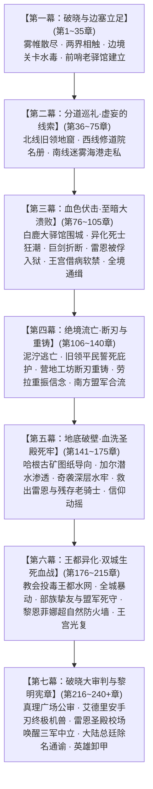
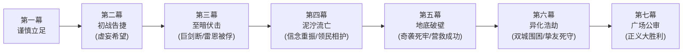

# 方案一：宏篇主线演进与阶段规划方案

> **所属方案**：[00_第二部主线与世界扩充方案总纲.md](file:///home/nanhu2/comfyui/世界书/方案/第二部/主线与世界扩充方案/00_第二部主线与世界扩充方案总纲.md)  
> **规划规模**：220 ~ 240+ 章长篇史诗体系  
> **叙事模式**：七幕·二十阶段·多线交织·至暗救赎史诗体系  
> **核心基调**：纯正日式 RPG 西幻（JRPG Western Fantasy）、正向欧陆封建史实质感、零导力反差、至暗挫折与绝地救赎

---

## 一、 宏观七幕演进脉络

---

## 二、 七幕二十阶段详尽推演（全240+章分布）

### 【第一幕：破晓与边塞立足】（第 1 ~ 35 章，共 35 章）
> **核心定位**：战后余波的净化、跨界规则的建立、伪装融入封建王国、第一座地下中继站的立足。  
> **先遣队动因铁律**：黎恩、菲娜与同伴视艾德里安与雷恩为生死相托的家人，对维里迪亚王国的政治权力毫无世俗利益诉求，纯粹出于守护同伴而同行；同时追查暗影能量与塞姆利亚鬼之力同源的高位面蛛丝马迹。

* **阶段一·战后新生与两界相触（第 1 ~ 8 章）**（详见 [第一幕_阶段一_战后新生与两界相触详规.md](file:///home/nanhu2/comfyui/世界书/方案/第二部/主线与世界扩充方案/分阶段详规/第一幕_阶段一_战后新生与两界相触详规.md)）
  * **主线推进**：森林残区清理影牙残兽，五族共同植下新心木树，打通太古石殿地下深层通道。
  * **跨界建交**：黎恩独行穿过时空裂隙，与马奇亚斯建交接文书，获悉帝国东部异变密电；艾玛与菲娜记录裂隙金芒节律；黎恩排查太古废墟感应沉睡的骑神瓦利玛坐标。
  * **动身誓师**：朱利安王子的暗号密信抵达，艾德里安坦白十九年前城堡覆灭真相，雷恩重燃誓言，两队整装践行启程。
* **阶段二·边境暗流与要塞破关（第 9 ~ 20 章）**（详见 [第一幕_阶段二_边境暗流与要塞破关详规.md](file:///home/nanhu2/comfyui/世界书/方案/第二部/主线与世界扩充方案/分阶段详规/第一幕_阶段二_边境暗流与要塞破关详规.md)）
  * **行装伪装**：乔治工坊连夜赶制低外溢战术导力皮套与伪装行商箱；爱丽榭准备耐储肉干与营地解毒草药囊。
  * **关隘危局**：先遣队抵达维里迪亚关隘；流民营暴发黑斑水毒（暗影废渣引发），教廷司铎冷血下达焚营令；老哨长瓦尔特·巴恩斯幼孙濒危。
  * **破局立信**：菲娜以克制圣光配制药汤平息水毒，起获古代暗影污染线索；暴雨夜荒原劫匪突袭灭口，主角团恪守零导力铁律以冷兵器战技全歼匪徒，缴获带有枢机主教克莱门特三世私印的黑血试剂密函。老哨长瓦尔特认出雷恩晨光剑势与手腕烙印，开启古代排沙涵洞秘密护送篷车入境并赠予边防铁牌。
* **阶段三·法尔肯驿镇与前哨立足（第 21 ~ 35 章）**（详见 [第一幕_阶段三_法尔肯驿镇与边境前哨详规.md](file:///home/nanhu2/comfyui/世界书/方案/第二部/主线与世界扩充方案/分阶段详规/第一幕_阶段三_法尔肯驿镇与边境前哨详规.md)）
  * **据点扎根**：进驻交通枢纽法尔肯驿镇，在镇深处的“猎鹰与十字”老驿馆落脚；建立双线的边境中继指挥部与情报联络站。
  * **市井风貌**：在老驿馆品尝粗粝麦酒与硬黑麦面包，体验封建集贸重镇的市侩与烟火气；黑市汇率兑换与行商物资采购。
  * **密使接头**：朱利安王子的密使柯恩以流浪诗人身份在镇内暗号接头，送来全境势力分布图。
  * **正式分兵**：艾德里安线（艾德里安+菲）北上旧领；雷恩线（雷恩+劳拉）西进修道院；黎恩作为后盾坐镇中枢，协调两界物资。

---

### 【第二幕：分道巡礼·虚妄的线索】（第 36 ~ 75 章，共 40 章）
> **核心定位**：三轨并进展开深度独立调查，逐步触碰反派核心禁区；自以为步步为营掌握主动，实则步入反派早已布下的政治绞杀罗网。

* **阶段四·主线A：艾斯特雷亚焦土与黑晶矿奴（第 36 ~ 50 章）**（详见 [第二幕_阶段四_艾斯特雷亚焦土与炼金机兽详规.md](file:///home/nanhu2/comfyui/世界书/方案/第二部/主线与世界扩充方案/分阶段详规/第二幕_阶段四_艾斯特雷亚焦土与炼金机兽详规.md)）
  * **旧领废墟**：艾德里安与菲重踏艾斯特雷亚堡焦黑断垣，排查地下密室，起获母亲遗留的镀银首饰盒、断剑与家臣绝笔日志。
  * **琉璃化白骨**：查验死者骸骨，确认十九年前惨案死者骨骼呈现琉璃化结晶，彻底推翻教廷编造的“山贼洗劫”谎言。
  * **黑晶矿奴营与发条机兽**：深入暗影地窟，遭遇守护失控矿区的重型发条战兽【暗影噬光傀儡】；菲的高速机动配合艾德里安家传刺击艰难破拆，撬下刻有教廷秘库工匠序列号的传动主齿轮。艾德里安进一步解救出被扣上“山贼余孽”枷锁在此苦役的幸存领民后代，初步凝聚故土民心。
* **阶段五·主线B：晨光修道院救赎与折剑十四人（第 51 ~ 65 章）**
  * **西进巡礼**：雷恩与劳拉伪装穿行冷杉林山道，抵达静谧肃穆的晨光修道院，接头暗中收留伤员的老修女艾琳娜。
  * **起获十四人名册**：艾琳娜交付十四年前拒绝屠杀平民命令的十四名圣殿骑士原始名册（详细记录受迫害致死者、隐姓埋名逃亡者、以及被秘密关入圣殿要塞底层黑牢者）。
  * **名场面·月下的极剑**：修道院后山冷杉林月光下，雷恩首次袒露当年血腥雨夜的心结与被烙印剥夺誓言的屈辱；劳拉以亚尔席昂巨剑锋芒与刚毅坦荡的剑士之魂正面迎击并锚定雷恩，完成剑士与剑士之间的崇高救赎。
  * **同袍对峙**：白鹰先锋骑兵队长卢卡斯率圣殿追击小队赶到；雷恩恪守不伤同袍原则，纯以晨光战技挑落全队佩剑，震撼年轻骑士的心灵；缴获带有枢机主教克莱门特三世私印的绝密“异端就地清剿调兵令”。
* **阶段六·主线C：迷雾海港走私网络与暗影黑帆（第 66 ~ 75 章）**
  * **南方海港湿地**：黎恩、菲娜与乔治以商会护卫名义深入迷雾海港，联合迷迭香商行玛格丽特夫人铺开南方调查线。
  * **黑市航路调查**：查获晨光教廷假借海外布道之名，联合走私海盗将大量炼金毒渣倾倒于南部沼泽，并利用快船走私违禁麻醉草药以筹措黑市军资。
  * **斩断黑帆**：在芦苇荡深处突袭走私货栈，缴获教廷主教洗钱暗账与受贿贵族往来密卷，截获用于武装私兵的异邦黑钢甲胄。

---

### 【第三幕：血色伏击·至暗大溃败】（第 76 ~ 105 章，共 30 章）
> **核心定位**：全书第一次断崖式跌落低谷！反派阵营展现出碾压级的冷酷政治手腕与恐怖生化武力，主角团遭受全方位毁灭性打击，安全网全线崩塌。

* **阶段七·合流陷阱与白鹿大驿馆围城（第 76 ~ 82 章）**
  * **三线会师**：三组人马携三大物理铁证（工匠印号齿轮、十四人名册调兵令、洗钱账本）在平原大道的白鹿驿馆秘密汇合，自以为胜券在握。
  * **致命情报泄露**：教会异端审问厅执行官达米安早已通过沿途被收买的内线密网，锁定主角团行踪；深夜突降暴雨，数千圣殿重装铁骑与教廷私兵将白鹿大驿馆重重合围，箭镞如雨。
* **阶段八·异化死士狂潮与战器折断（第 83 ~ 90 章）**
  * **异端兵器登场**：达米安释放由活体骑士注入黑血而成的“暗影忏悔死士”大军与重型攻城发条喷酸战兽；死士不知疼痛、断肢再生，体内喷涌的浓黑酸液能瞬间熔断精钢刀剑。
  * **惨烈突围战**：主角团在零导力限制下陷入极端苦战；劳拉横剑护卫负伤的艾德里安与平民侍应，亚尔席昂巨剑正面硬撼攻城机兽的合金重锤与死士黑酸喷涌，在刺耳的金属悲鸣中**当场折断**！劳拉内脏遭受剧烈冲击受创吐血。
* **阶段九·雷恩断后与被俘入狱（第 91 ~ 96 章）**
  * **生死断桥**：后方追兵封锁石桥吊闸，队伍退路断绝。雷恩在重创之下决然拔出晨光断剑，独自一人斩断绞盘铁链卡死吊桥，为同伴乘马车撤入南部沼泽与丘陵争取唯一的生机。
  * **力竭被俘**：雷恩独身阻击数十名暗影死士与圣殿精锐，身中数矛力竭倒地；大团长阿达尔伯特亲自踏上吊桥，以铁靴踩踏雷恩胸膛，将其打入生铁重枷，秘密押入圣殿要塞最深处的“圣殿地牢”无光水牢！
* **阶段十·王宫政变与全境血色通缉（第 97 ~ 105 章）**
  * **王都政变的冠冕堂皇借口**：阿达尔伯特与克莱门特三世并未莽撞造反，而是借白鹿驿馆之战大做文章——宣称“北方流民邪教刺客团伙携巫毒入境图谋行刺，老国王埃德蒙惊闻刺案突发重病、受异端巫术诅咒神智谵妄无法理政”；教会与圣殿遂启动《圣谕战时统帅令》，以“代天护驾、清君侧”为名全面接管王都防务，强行解除王都近卫军精锐武装，将埃德蒙老国王以“离宫清修祈福辟邪”之名软禁于悬崖高塔离宫，由主教与大团长联席会议代行国政，王权彻底瘫痪。
  * **前哨覆灭与老哨长下狱**：法尔肯驿镇老驿馆被异端审问厅纵火焚毁；老哨长瓦尔特·巴恩斯因私放通缉疑犯被教会密探告发，阿达尔伯特下令褫夺其骑士纹章与王国退役军俸，打上不忠者铁烙印，扣上生铁颈枷与重型脚镣，押入圣殿要塞底层水牢囚禁待审；迷迭香商行王都货栈被全面查封。
  * **血色通缉令**：全境贴满布告，克莱门特三世倒打一耙，将主角团诬陷为“弑亲掘坟、勾结异邦邪教徒谋刺王室”的极恶叛徒；平民被煽动盲目仇恨，主角团彻底沦为全境追捕的流亡之徒。

---

### 【第四幕：绝境流亡·断刃与重铸】（第 106 ~ 140 章，共 35 章）
> **核心定位**：从泥泞与绝望中爬起，人心向背悄然逆转；经历挫折磨砺后，主角团完成信念觉醒与战备重整。

* **阶段十一·泥泞逃亡与旧领平民誓死庇护（第 106 ~ 115 章）**
  * **山野流亡**：艾德里安与菲护送内脏受创吐血的劳拉遁入艾斯特雷亚旧领深山与南部沼泽芦苇荡；边境关隘严密封锁，重伤员无法长途穿行敌占区，众人被迫藏入艾斯特雷亚酒庄阴凉避风的地下恒温地窖养伤。
  * **领民倒戈相护**：追兵搜山迫近，曾经被艾德里安在旧领解救的矿奴领民们冒着灭门之灾，用干草车将主角团藏入地下地窖，端来仅有的热燕麦粥与止血草药；艾德里安看着满手粗茧的老农泪流满面，褪去所有轻浮，真正立誓成为守护领民生命的雄主。
* **阶段十二·送返营地工坊与劳拉巨剑重铸（第 116 ~ 125 章）**
  * **只身送刃**：劳拉留于地窖养伤，菲凭借前猎兵的顶尖潜行身手，只身携带断裂的亚尔席昂巨剑残刃，避开巡逻哨卡穿过边境秘密排沙涵洞，送回 Eldoria 营地导力工坊。
  * **工坊星火与秘金锻造**：乔治在营地工坊联合矮人三兄弟中的大哥多尔金（矮人王国最强锻造大师），在祖厅铁砧前历经数日不熄的炉火，运用矮人族珍藏的星银秘金与古代折叠锻造技术，将亚尔席昂断刃重铸为一柄带有破邪绝魔刻印的新生双手重剑。
  * **重剑归来与信念重振**：菲与黎恩将重铸的大剑秘密送回酒庄地窖；劳拉守在暗室烛光下接过重铸的剑柄，抚摸着沉稳锋锐的剑脊，在断剑的挫折与同伴的托付中扫清迷茫，完全重振了守护同伴与弱小的坚毅信念。
* **阶段十三·南方盟军合流与大本营魔法战备总动员（第 126 ~ 140 章）**
  * **前线生死盟约**：散落各处的同伴（黎恩、劳拉、菲、艾德里安）在酒庄地下会合，立下生死盟约——无论代价多大，誓要奇袭要塞抢回雷恩。
  * **大本营魔法批量制作战备物资**：
    - *原料来源*：Eldoria 森林特产的高韧性野生剑麻纤维、森林止血草药（白凝草、岩金草），以及通过时空裂隙从帝国东部合法采购调配的医用高纯度酒精与精磨燕麦粗粉；
    - *魔法制作工艺*：爱丽榭与亚莉莎负责统筹营地工坊；艾玛施展巡林魔女的卢恩符文与秘药催化魔法，对大批草药进行高速浓缩萃取，瞬间凝固成高纯度灭菌止血膏，并用温和的净化魔法对大卷剑麻绷带进行无菌附魔；营地工坊利用导力烘烤箱与脱水风道，短时间内批量烘焙出耐受潮湿且热量极高的压缩燕麦干酪饼与浓缩肉汤块；
  * **海上隐秘运送**：大批附魔战备物资通过迷迭香商行与南方迷雾海港的走私隐秘平底船，沿着芦苇湿地送抵艾斯特雷亚旧领前线安全屋。

---

### 【第五幕：地底破壁·血洗圣殿死牢】（第 141 ~ 175 章，共 35 章）
> **核心定位**：全篇最惊心动魄的特种攻坚战役！精妙情报与小队特种渗透协同，直捣敌军心脏，完成不可能的劫狱逆转。

* **阶段十四·古代排污暗渠与水泽潜渡渗透（第 141 ~ 150 章）**
  * **古代要塞构造图谱**：圣殿要塞依悬崖而建，正面关隘坚不可摧。主角团调取艾德里安当年游历商道掌握的旧领古矿道记载，配合此前老哨长瓦尔特·巴恩斯交予的边境防务手卷，推演出要塞后方悬崖因两百年地质沉降形成的一处天然溶洞裂隙，直通死牢底部排沙盲区。
  * **加尔与水泽勇士开道**：蜥蜴人部族受制于保守元老院无法举族参战，但部族第一剑士加尔与青年战士卡兹尔出于对黎恩、菲娜与奥蕾莉亚的并肩信赖，私下带领数名身手敏捷的水泽勇士秘密穿过边境相助；加尔等人凭借超凡水性潜入冰冷刺骨的护城河底，摸清生铁水栅门齿轮机括，斩断警戒水铃，为潜入打通水下隐秘入口。
  * **精准静音破拆**：主角团依据古代暗渠图样，以最精巧的静音破拆打通最后数米松散碎石岩层，特种潜入死牢排沙口。
* **阶段十五·奇袭深层水牢与解救残存老骑士（第 151 ~ 162 章）**
  * **地牢突袭**：主角团直插圣殿地牢底层；菲与艾德里安以利落身手击昏守卫，劳拉一剑破开精钢重闸，击溃要塞重装典狱长。
  * **重聚血泪**：在腐臭冰冷的无光水牢最深处，主角团找到了锁骨穿铁链、遍体鳞伤却依然脊梁挺拔的雷恩；同时意外解救出当年十四名拒杀骑士中幸存被囚的五位老骑士（包括雷恩当年的恩师兼分团副团长），以及关押在隔壁牢房的老哨长瓦尔特·巴恩斯。
* **阶段十六·火海突围与少壮派骑士信仰动摇（第 163 ~ 175 章）**
  * **要塞火海**：要塞警钟大作，阿达尔伯特调集铁骑阻截；劳拉持重剑背负重伤的雷恩突围，黎恩在零导力前提下以八叶居合神速刀风斩断生铁吊栅门的沉重铁链。
  * **白鹰队长卢卡斯的信义抉择**：白鹰队长卢卡斯奉命率骑兵堵截吊桥，老副团长当面出示身上被严刑拷打的烙印，雷恩亦亮出当年阿达尔伯特亲笔签发的屠杀军令原本；面对血淋淋的真相，卢卡斯深受震撼，看清了大团长践踏晨光誓约的伪善面具；出于对真正骑士精神与昔日恩师同袍的信守，卢卡斯断然下令所属骑兵撤开吊桥，放行同袍，让队伍冲破死局！

---

### 【第六幕：王都异化·双城生死血战】（第 176 ~ 215 章，共 40 章）
> **核心定位**：反派穷途末路发动无差别生化屠杀，平民陷入狂澜；部族挚友与盟军死守，黎恩与菲娜构筑超自然防火墙，王都内城与下城双线光复。

* **阶段十七·教会投毒水网与全城生化异变暴走（第 176 ~ 185 章）**
  * **垂死反扑**：克莱门特三世得知死牢被破、全盘黑幕即将大白，彻底撕下伪善面具，下令向王都下水道源头倾倒纯度最高的暗影原液，释放教廷秘库储备的上百具发条机兽与死士。
  * **炼狱王都**：黑水蔓延全城，平民吸入毒雾产生狂暴异化，发条机兽在街巷横冲直撞；阿达尔伯特下达封锁城门射杀平民的屠杀令，王都化为人间炼狱。
* **阶段十八·部族挚友跨境与平民生命线死守（第 186 ~ 198 章）**
  * **水网与街巷防线**：毒雾危及边境，罗恩率领数名狼人猎手在浓雾中凭借超凡嗅觉精准扑杀暗影死士；加尔与蜥蜴人勇士舍命潜入恶臭刺鼻的王都下水道，关闭污染主水闸并引入清泉；曾经仇视“异族”的王都平民目睹异族战士舍命救护孩童，人心彻底倒向主角团。
* **阶段十九·黎恩菲娜超自然防火墙与王宫近卫军光复（第 199 ~ 215 章）**
  * **超自然防火墙**：教廷终极发条巨兽在城市中央过载，即将释放覆盖数万平民的致命引力坍缩与强酸风暴。黎恩彻底解开鬼之力将其炼化为澄澈护界，菲娜全力释放炽天使圣光净界，二人在广场上空筑起半径千米的“绝对超自然防火墙”，将所有生化毒素尽数汽化阻绝。
  * **王宫夺回战**：朱利安王子携王室密诏联络醒悟的王都近卫军军官发动起义，突入离宫斩杀教廷特务，救出埃德蒙老国王，重掌禁军大权。

---

### 【第七幕：破晓大审判与黎明宪章】（第 216 ~ 240+ 章，共 25+ 章）
> **核心定位**：政治、法律与武道的终极清算！本土力量自主建立正义秩序，两大首恶伏诛，神权法统洗牌，英雄卸甲，留下跨位面高维之谜。

* **阶段二十·真理广场公审、三军中立与黎明新世界（第 216 ~ 240+ 章）**
  * **真理广场大公审（法理除恶与血亲复仇）**：
    1. 面对从灾难中生还的数万平民、贵族百官与全境军民，埃德蒙老国王亲手宣读手抄十八年的教廷贪腐黑账；
    2. 艾德里安以艾斯特雷亚苦主身份登上真理广场石台，出示刻有教廷工匠序列号的机兽主齿轮与琉璃骸骨，彻底击碎教廷伪善神权；
    3. 克莱门特三世激活藏匿于教皇王车内的终极暗影发条机兽企图垂死挣扎，艾德里安以家传刺剑配合菲的牵制，亲手刺穿机兽核心将其斩首，完成血亲复仇与故土光复！
  * **圣殿校场破晓对决（军事断刀与誓言归位）**：
    1. 雷恩携老副团长与十四人血书绝笔踏上圣殿校场，当着数千名圣殿骑士全军旗队的面，怒斥阿达尔伯特十四年前屠杀平民与构陷同袍的军令；
    2. 阿达尔伯特恼羞成怒拔剑决斗，雷恩在劳拉重剑护持下，以纯正晨光剑法一击挑断阿达尔伯特的佩剑！
    3. 卢卡斯等少壮派骑士全员单膝跪地，全团齐声拔剑宣誓【遵奉晨光真义，重归王室法统，全军绝对中立】，阿达尔伯特束手就擒。
  * **体制更迭与新宪章签署**：
    1. 朱利安王子将四大物理铁证正式呈送全大陆晨光总廷与圣殿大修会总团；两大大陆总部发布通谕，对克莱门特与阿达尔伯特处以“永久除名、革除圣职”的极刑，并委派声誉清白的新任主教与分团长进驻；
    2. 朱利安王子继位新王，正式颁布《维里迪亚自由大宪章》，收回半数要塞驻防权与税权，王国开启立宪新秩序。
  * **英雄卸甲与世界外侧深渊隐秘**：
    1. 维里迪亚全境与Eldoria营地开启跨界和平贸易，法尔肯重建的“猎鹰与十字”老驿馆前，黎恩、菲娜、劳拉、菲与艾德里安、雷恩举起热香料苹果酒开怀大笑；
    2. 夜空下，乔治与亚尔缇娜封存的无光黑晶核心残骸与黎恩体内的鬼之力产生共鸣；高位面“世界外侧”污秽之楔的蛛丝马迹浮出水面，为第三部异界终极篇章埋下恢弘深邃的伏笔。

---

## 三、 七幕挫折律动与戏剧张力弧线

---

## 四、 docs2 实体完全咬合索引

| 方案维度 | 涉及的 docs2 实体卡片 |
| :--- | :--- |
| **主要角色** | 黎恩、Seraphina（菲娜）、劳拉、菲、艾德里安、雷恩、朱利安、乔治、爱丽榭、亚尔缇娜、艾玛、玲、奥蕾莉亚、加尔、马奇亚斯、瓦利玛 |
| **重要NPC** | 埃德蒙（国王）、克莱门特三世（枢机主教）、阿达尔伯特（大团长）、玛格丽特（迷迭香商行）、瓦尔特·巴恩斯（老哨长）、艾琳娜（老修女）、柯恩（流浪诗人密使）、多尔金/哈根/法林（矮人三兄弟）、蜥蜴人鳞母、狼人月语者罗恩 |
| **地理舞台** | 维里迪亚关隘、法尔肯驿镇、迷迭香商行、艾斯特雷亚堡、艾斯特雷亚酒庄、暗影地窟、白鹿驿馆、晨光修道院、圣殿要塞（圣殿地牢、圣殿校场）、迷雾海港、南部沼泽、黑野猪酒馆、白金王宫（王宫温室、密室）、晨光大教堂、教廷秘库、王都下水道、真理广场、太古石殿、心木圣坛、矮人锻炉大厅、狼人隐谷 |
| **威胁与生物** | 暗影噬光傀儡、暗影实验畸变体、暗影忏悔死士、残区影牙兽、矮人族、狼人族、蜥蜴人族 |
| **能量与法则** | 暗影能量、圣光、鬼之力、鬼之圣光、雾帷与时空裂隙 |
