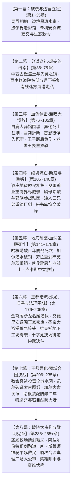
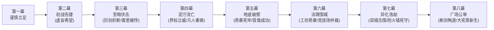

# 方案一：宏篇主线演进与阶段规划方案

> **所属方案**：[00_第二部主线与世界扩充方案总纲.md](file:///home/nanhu2/comfyui/世界书/方案/第二部/主线与世界扩充方案/00_第二部主线与世界扩充方案总纲.md)  
> **规划规模**：265 ~ 270+ 章长篇史诗体系  
> **演进模式**：八幕·二十五阶段·多线交织·至暗救赎史诗体系  
> **核心基调**：纯正日式 RPG 西幻（JRPG Western Fantasy）、正向欧陆封建史实质感、零导力反差、至暗挫折与绝地救赎，严格恪守 [viridia-writer](file:///home/nanhu2/comfyui/世界书/.agents/skills/viridia-writer/SKILL.md) 技能铁律。

---

## 一、 宏观八幕演进全景架构

---

## 二、 八幕二十五阶段详尽推演（全 265+ 章分布）

### 【第一幕：破晓与边塞立足】（第 1 ~ 35 章，共 35 章）
> **核心定位**：战后余波的净化、跨界规则的建立、伪装融入封建王国、第一座地下中继站的立足。  
> **先遣队动因铁律**：黎恩、菲娜与同伴视艾德里安与雷恩为真挚信赖的家人，对维里迪亚王国的政治权力毫无世俗利益诉求，纯粹出于守护同伴而同行；同时追查暗影能量与塞姆利亚鬼之力同源的高位面蛛丝马迹。

* **阶段一·战后新生与两界相触（第 1 ~ 8 章）**（详见 [第一幕_阶段一_战后新生与两界相触详规.md](file:///home/nanhu2/comfyui/世界书/方案/第二部/主线与世界扩充方案/分阶段详规/第一幕_阶段一_战后新生与两界相触详规.md)）
  * **主线推进**：森林残区清理影牙残兽，五族共同植下新心木树，打通太古石殿地下深层通道。
  * **跨界建交**：黎恩穿过时空裂隙与马奇亚斯建交接文书，获悉帝国东部异变密电；艾玛与菲娜记录裂隙金芒节律；黎恩排查太古废墟以心眼感知并锚定跨界空间裂隙坐标。
  * **动身誓师**：朱利安王子的暗号密信抵达，艾德里安坦白十九年前城堡覆灭真相，雷恩重燃誓言，两队整装践行启程。
* **阶段二·边境暗流与要塞破关（第 9 ~ 19 章）**（详见 [第一幕_阶段二_边境暗流与要塞破关详规.md](file:///home/nanhu2/comfyui/世界书/方案/第二部/主线与世界扩充方案/分阶段详规/第一幕_阶段二_边境暗流与要塞破关详规.md)）
  * **行装伪装**：乔治工坊赶制低外溢战术导力皮套与伪装行商箱；爱丽榭准备耐储肉干与营地解毒草药囊。
  * **关隘危局**：先遣队抵达维里迪亚关隘；流民营暴发黑斑水毒（暗影废渣引发），异端审问厅执行官达米安冷血下达焚营令；老哨长瓦尔特·巴恩斯幼孙濒危。
  * **破局立信**：菲娜与爱丽榭以微量克制圣光融入草药汤剂平息毒情，化解人道危机；荒原死士暴雨夜突袭灭口，主角团恪守零导力铁律以冷兵器战技全歼敌徒，达米安咬尾追踪。老哨长瓦尔特（十四年前在关前目送长官被逐的旧旗手）认出雷恩晨光剑势与当年莫尔茨按下的手腕放逐印记，感念旧恩与救孙之德，开启古代排沙涵洞秘密放行。
* **阶段三·法尔肯驿镇与前哨立足（第 20 ~ 35 章）**（详见 [第一幕_阶段三_法尔肯驿镇与边境前哨详规.md](file:///home/nanhu2/comfyui/世界书/方案/第二部/主线与世界扩充方案/分阶段详规/第一幕_阶段三_法尔肯驿镇与边境前哨详规.md)）
  * **据点扎根**：进驻交通枢纽法尔肯驿镇，在镇深处“猎鹰与十字”老驿馆落脚；建立双线的边境中继指挥部与情报联络站。
  * **市井风貌**：在老驿馆品尝粗粝麦酒与硬黑麦面包，体验封建集贸重镇的市侩与烟火气；黑市汇率兑换与行商物资采购。
  * **密使接头与朱利安真诚建交**：朱利安王子以极度谦逊自省姿态秘密潜入前哨接头，直言营地没有流血义务，愿以维里迪亚人身份共同迎战暗影；亲手奉还王室密藏十九年的《艾斯特雷亚夫人临终手札与忠仆册》，向艾德里安行贵族歉礼；向雷恩出示十八年来私用内帑发放的平民抚恤密账，拔剑致敬洗刷十四年屈辱。
  * **生态敕令与部族初步破冰**：双方签署《维里迪亚王权对Eldoria圣域生态保护、古老神秘尊重与永不侵犯之敕令》；王子展现先给予尊重不求回报的信义，查禁捕杀狼皮走私团伙并奉还“古代月影祖石”，调派水工修筑深石沉淀池，赢得部族初步信任。
  * **正式分兵**：分兵中西两翼（深入中西部丘陵旧领与西进西南修道院）与南下迷雾海港，黎恩与菲娜留守中枢协调两界物资。

---

### 【第二幕：分道巡礼·虚妄的线索】（第 36 ~ 75 章，共 40 章）
> **核心定位**：三轨并进展开深度独立调查，逐步触碰反派核心禁区；自以为步步为营掌握主动，实则步入反派早已布下的政治绞杀罗网。

* **阶段四·主线A：艾斯特雷亚焦土与黑晶矿奴（第 36 ~ 50 章）**（详见 [第二幕_阶段四_艾斯特雷亚焦土与炼金机兽详规.md](file:///home/nanhu2/comfyui/世界书/方案/第二部/主线与世界扩充方案/分阶段详规/第二幕_阶段四_艾斯特雷亚焦土与炼金机兽详规.md)）
  * **旧领废墟**：艾德里安与菲重踏艾斯特雷亚堡焦黑断垣，排查地下密室，起获母亲遗留的镀银首饰盒、断剑与家臣绝笔日志；查验死者骸骨呈现琉璃化结晶，推翻山贼谎言。
  * **地窟血战与双重铁证**：深入暗影地窟，正面迎战被教廷封印囚禁十九年的【暗影实验畸变体】（取得当年古代生化失控铁证）；并与驻守深层的重型发条战兽【暗影噬光傀儡】死斗，艰难破拆撬下刻有教廷秘库工匠序列号的传动主齿轮；解救矿奴后代，初步凝聚故土民心。
  * **先灵之镜**：艾德里安遭古代瘴气侵蚀，古老先灵埃尔德莱恩借镜湖共鸣短暂显现，动用**先灵之镜**映照当年火灾与暗影真相，坚固艾德里安复仇意志。
* **反派地下视点（POV）·阿达尔伯特冷漠交办与莫尔茨水牢逼供**：
  * 阿达尔伯特随手拨开边境剑痕报告，冷漠下达指令：“十四年了……去翻翻关隘的值防花名册，查出这次是谁在关前放行，直接押回水牢，把嘴撬开。把第七号死牢收拾干净，别让他在外面乱叫，玷污了圣殿的旗号。”
  * 莫尔茨突袭关隘逮捕老哨长瓦尔特·巴恩斯押入黑铁水牢，当着老副团长戈德弗里的面以带刺生铁重枷与皮鞭严刑拷问；老巴恩斯抹了把嘴角的血水，沙哑地低低笑出声来，眼神里满是老兵的蔑视：“呸……十四年前在大雨里，老子跟着雷恩大人放走了平民；几天前在关隘涵洞，老子又亲手把雷恩大人放了进来！老子当了二十七年兵，就数这两回把脊梁骨挺直了！莫尔茨，雷恩大人已经回来了……你们这帮披着铁皮的教会看门狗，好日子到头了！”
* **阶段五·主线B：晨光修道院救赎与折剑十四人（第 51 ~ 65 章）**
  * **西南巡礼**：雷恩与劳拉穿行冷杉林山道抵晨光修道院，接头药舍修女艾琳娜，起获拒杀平民十四人名册原本与黑血样本。
  * **名场面·月下的极剑**：修道院后山月光下，雷恩袒露当年雨夜心结与烙印耻辱；劳拉以亚尔席昂巨剑锋芒与刚毅坦荡的剑士之魂正面迎击锚定雷恩，完成崇高救赎。
  * **同袍对峙**：白鹰队长卢卡斯率队赶到；雷恩恪守不伤同袍原则挑落全队佩剑，震撼年轻骑士，缴获带有主教私印的调兵令。
* **阶段六·主线C：迷雾海港走私网络与暗影黑帆（第 66 ~ 75 章）**
  * **南方海港湿地**：黎恩、菲娜与乔治以商会护卫名义深入迷雾海港，联合玛格丽特夫人铺开南方调查线。
  * **黑市航路调查与生态重锤**：查获教廷假借海外布道勾结海盗倾倒毒渣、走私违禁麻醉草药筹措黑市军资；更在走私船吃水最深的密舱中，起获三十一年前教廷自 Eldoria 森林掠夺、用于为发条机兽黑晶充能的**“心木树枯萎碳化残根”**；目睹水网下游受排毒废渣侵害的流民孤儿，确立菲娜（生态守护者）与黎恩的不可动摇参战信念，彻底绝缘“打野做支线”的漂离感。
  * **斩断黑帆与暗桩引信**：在芦苇荡深处突袭走私货栈，截获教廷洗钱暗账、受贿贵族往来密卷与私兵黑钢甲胄；达米安的暗部眼线在暗中记录下行踪，为第三幕合流陷阱埋下致命引信。

---

### 【第三幕：血色伏击·至暗大溃败】（第 76 ~ 105 章，共 30 章）
> **核心定位**：全书第一次断崖式跌落低谷！反派展现碾压级冷酷政治手腕与恐怖生化武力，安全网全线崩塌。

* **阶段七·合流陷阱与白鹿大驿馆围城（第 76 ~ 82 章）**
  * **三线会师**：三组人马携三大物理铁证（工匠印号齿轮、十四人名册调兵令、洗钱账本）在平原大道白鹿驿馆汇合。
  * **致命情报泄露**：达米安以教会地下密探网锁定行踪并向圣殿报信；深夜暴雨倾盆，圣殿大团长阿达尔伯特调遣数千圣殿精锐铁骑与莫尔茨押解队将大驿馆重重合围，箭镞如雨。
* **阶段八·异化死士狂潮与战器折断（第 83 ~ 90 章）**
  * **异端兵器登场**：教廷达米安暗中投入由活体注入黑血而成的“暗影忏悔死士”大军与维克托改良的重型喷酸战兽，配合圣殿铁骑发动无情绞杀；
  * **惨烈突围战**：主角团在零导力限制下陷入极端苦战；劳拉横剑护卫负伤同伴，亚尔席昂巨剑正面硬撼攻城机兽重锤与死士黑酸喷涌，当场折断！劳拉脏腑受创吐血。
* **阶段九·雷恩断后与被俘入狱（第 91 ~ 96 章）**
  * **石桥断后**：追兵封锁石桥吊闸，雷恩在重创之下决然拔出晨光断剑斩断绞盘铁链卡死吊桥，为同伴争取撤退生机。
  * **力竭被俘与大团长誓言裂痕**：雷恩独身阻击力竭倒地；达米安率异端审问厅死士踏上吊桥欲拔剑枭首灭口，阿达尔伯特在暴雨中冷冷拔剑震开达米安的剑锋：“圣殿之誓由圣殿家法处置，轮不到异端审问厅在此越权杀人！”目睹雷恩哪怕断剑力竭依然誓死守护同伴的纯白剑势，阿达尔伯特内心深处十四年前亲手剥夺其誓言的负罪感剧烈震荡，根本无法对这个昔日最纯正无垢的年轻骑士痛下杀手；大团长在极度复杂的人性挣扎中，喝令身后的圣殿典狱长莫尔茨给雷恩扣上带刺生铁重枷押入第七号水牢，为第八幕校场的忏悔与断剑殉道埋下最深的情感伏笔。
* **阶段十·王宫政变与全境血色通缉（第 97 ~ 105 章）**
  * **王子流血断后**：朱利安率近卫军反向冲入泥泞截断追兵，格杀两名刺客，**自身左肩被贯穿负伤**，掩护众人遁入深山；
  * **老国王表里双轨与王宫政变**：两强启动《战时统帅令》强除禁军武装；老国王埃德蒙在御前会议裹厚毛毯剧烈咳血麻痹两强，当众严斥王子禁足提供完美不在场证明，随后被以“静养”为名软禁悬崖高塔；
  * **全境通缉**：老驿馆被焚，商行被封，全境贴满血色通缉布告。

---

### 【第四幕：绝境流亡·断刃与重铸】（第 106 ~ 140 章，共 35 章）
> **核心定位**：从泥泞绝望中爬起，人心向背悄然逆转；完成信念觉醒与战备重整，边境战术威慑建立。

* **阶段十一·泥泞逃亡、全员守护陪伴、劳拉剑道沉淀与庄园风土生活流（第 106 ~ 114 章）**
  * **全员留宿陪伴与伤情羁绊**：突围后劳拉脏腑受创吐血、骨骼微裂，根本无法承受长途颠簸；黎恩、菲娜、艾德里安、菲与乔治全员决定不抛弃任何一人，悉数留守艾斯特雷亚旧领酒庄地窖与周边隐秘农舍守护劳拉，形成难能可贵的战火间歇与温馨生活流；
  * **维里迪亚风土人情与庄园烟火**：正值领地金秋葡萄采收期尾声，主角团融入当地生活——领民们端来粗陶大罐的洋葱羊肉鹰嘴豆热麦汤、刚出炉的焦脆黑麦面饼与热香料苹果酒，传授压榨老橡木桶葡萄酒的风土民俗；菲娜在山溪旁帮农妇晾晒草药，听老家仆讲述艾斯特雷亚伯爵当年的善政；艾德里安在故土烟火气中褪去商人的世故，重新找回领主的担当；黎恩在晨雾葡萄架旁凝神练刀，全队围坐壁炉探讨地图，极具日式 RPG 王道温润治愈感；
  * **劳拉的剑道沉思**：在昏暗微光与壁炉炭火前，劳拉手抚折断的亚尔席昂巨剑陷入深沉的剑道沉思——褪去家传神兵外物后自己究竟为何拔剑，彻底完成从“仰仗名刃锋芒”到“人剑合一为守护而战”的心境蜕变；
  * **水牢视点（雷恩 POV）**：在第七号极寒无光水牢中，莫尔茨施加带刺生铁重枷与严刑逼问同伙下落；雷恩、老副团长戈德弗里与老哨长巴恩斯在恶臭与黑暗中，仅凭冰冷滴水声与对黎明的期盼彼此支撑、死守秘密，展现封建老骑士与流亡剑士的铮铮铁骨。
* **阶段十二·边界分界对峙与黄金罗刹重剑威慑（第 115 ~ 122 章）**
  * **圣殿搜捕与暗部窥探**：阿达尔伯特调集关防驻军与圣殿搜捕骑兵沿山线拉网排查，企图跨越维里迪亚关隘界标北进搜山；达米安的教廷暗部斥候亦在山脊暗处窥探；
  * **黄金罗刹单人立界**：托尔兹第二分校校长奥蕾莉亚·勒瑰恩坐镇营地外围防御，身着深蓝军装与深紫披风，单人手持巨型双手重剑“阿卡迪亚”（Arcadia）伫立于维里迪亚关隘与森林交界的大理石界标前（身侧仅依托岩垒构筑警戒哨位）。面对步步进逼的圣殿搜捕先锋，奥蕾莉亚挥起沉重无比的阿卡迪亚巨剑斩落越界先锋帅旗，巨剑破空风压在界标前轰开深邃裂痕，冷冽宣告“越界者斩”，以绝对武力威慑迫使圣殿骑兵知难而退，筑起坚不可摧的停滞线。
* **阶段十三·只身送刃、艾玛魔女药理与重铸绝魔巨剑（第 123 ~ 131 章）**
  * **只身送刃**：菲凭借敏捷的前猎兵身手，穿过秘密山道排沙涵洞将断刃送回森林大本营工坊；全员继续在酒庄守卫劳拉调理内伤；
  * **除酸与重铸**：暗影强酸破坏剑刃晶格；蜥蜴人鳞母提供沼泽月影酸蚀草，艾玛施展卢恩调和阵拔除金属酸毒；大哥多尔金铸刃、二哥哈根架设加压地火炉、三弟法林刻入防酸破邪符文，以纯粹凡人匠艺重铸带有破邪绝魔刻印的新生双手重剑；
  * **部族深层参战动因**：鳞母在验毒除酸时敏锐察觉，暗影废渣若随地下水网扩散，必将倒灌侵蚀南部沼泽与古代森林根系，引发生态灭顶浩劫；感念朱利安王子禁绝走私与修筑沉淀池的真诚信义，部族确立主动反制神权黑化的深层动因。加尔（蜥蜴人第一剑士）与罗恩（狼人猎手）主动请缨组建特遣勇士小组跨境协助。
* **阶段十四·太古秘书库破译、水路接应与特遣潜入推演（第 132 ~ 140 章）**
  * **学术攻坚**：凯尔与玲深入太古秘书库破译石板，研制出针对发条机械中枢的“逆转传动解构法”；爱丽榭与亚莉莎在大本营统筹制作高浓缩灭菌止血膏与耐潮军粮；
  * **水路汇合与迎剑**：加尔与罗恩驾驶迷迭香平底船，沿南部沼泽隐秘水网逆流而上，将附魔战备物资与重铸新生的双手大剑护送至酒庄安全屋；伤势痊愈的劳拉握紧新生大剑剑柄，全员在旧领完成集结；
  * **死牢推演**：结合哈根勘破的图纸，小队完成死牢水下盲井潜入推演，战备彻底就绪。

---

### 【第五幕：地底破壁·血洗圣殿死牢】（第 141 ~ 175 章，共 35 章）
> **核心定位**：全篇最惊心动魄的特种攻坚战役！小队特种渗透直捣敌军心脏，完成地牢逆转。

* **阶段十五·哈根勘破要塞死穴与加尔水泽潜渡（第 141 ~ 150 章）**
  * **勘破承重死穴**：哈根勘察要塞构造，勘破两百年承重主拱吊栓减配死穴，锁定死牢排沙盲井潜入路线；
  * **潜渡破锁**：面对排沙口机关铁网与暗锁，哈根指引加尔潜入冰冷水底精准斩断传动销，暴力开辟潜入通道。
* **阶段十六·奇袭深层水牢与重剑斩碎莫尔茨重铠（第 151 ~ 162 章）**
  * **奇袭底层水牢**：主角团突入地牢；典狱长莫尔茨挥舞六十磅狼牙破甲锤狂暴压制；
  * **重剑破铠**：劳拉手持重铸大剑正面重斩破开锤势，一剑斩碎莫尔茨胸前生铁重铠，为十四年前雷恩惨遭其亲手烙印放逐与老骑士们十四年水牢血泪彻底雪耻，将其重创震落水潭彻底溃败！
  * **解救故人**：解救出戴着生铁重枷依然眼神清澈的雷恩，以及老副团长戈德弗里等五位老骑士与老哨长瓦尔特·巴恩斯。
* **阶段十七·火海突围与白鹰队长卢卡斯的信义抉择（第 163 ~ 175 章）**
  * **突围撤离**：要塞警钟大作，阿达尔伯特调集铁骑阻截；劳拉负伤背负雷恩突围，黎恩刀风斩断生铁吊栅门悬链；
  * **卢卡斯的信义抉择**：卢卡斯率队堵截吊桥，老副团长展示受刑烙印，雷恩出示当年屠杀军令原本；卢卡斯看清伪善，断然下令撤开吊桥放行同袍！

---

### 【第六幕：王都暗流·沙龙、旧卷与法理围城】（第 176 ~ 205 章，共 30 章）
> **核心定位**：从流亡转向合法反击！启用王都上层社交、旧案密档起获、禁忌工坊奇袭与公开仲裁决斗，彻底瓦解反派政治合法性。

* **阶段十八·双城潜流与金鸢尾沙龙名媛潜伏（第 176 ~ 183 章）**
  * **地理舞台**：[金鸢尾沙龙.TXT](file:///home/nanhu2/comfyui/世界书/docs2/location/金鸢尾沙龙.TXT) + [黑野猪酒馆.TXT](file:///home/nanhu2/comfyui/世界书/docs2/location/黑野猪酒馆.TXT)
  * **主线推进**：主角团分两路潜入王都。下城黑野猪酒馆作为武力人员隐蔽点；玛格丽特夫人引荐亚莉莎与爱丽榭进入金鸢尾沙龙；
  * **名媛社交高光**：亚莉莎（莱恩福尔特千金）与爱丽榭（名门学院优等生兼男爵千金）展现无可挑剔的皇家学院社交礼仪，周旋于贵妇与文官之间；在二层“鸢尾暗阁”中协助朱利安召集开明贵族组建大陪审团，并刺探截获教廷密令。
* **阶段十九·王家秘库档案起获与艾德里安法理准备（第 184 ~ 190 章）**
  * **地理舞台**：[白金王宫.TXT](file:///home/nanhu2/comfyui/世界书/docs2/location/白金王宫.TXT)（王宫密室） + [艾斯特雷亚酒庄.TXT](file:///home/nanhu2/comfyui/世界书/docs2/location/艾斯特雷亚酒庄.TXT)
  * **主线推进**：朱利安王子联络忠诚近卫军暗线，协助艾德里安调阅王家密室中被教会封存十九年的艾斯特雷亚家族合法封建特许状与诉讼底稿；
  * 艾德里安将工匠齿轮、受害领民琉璃白骨与王家特许状完整封装，锁定大原告三大无可辩驳的物理铁证，完成法统大起诉的最后拼图。
* **阶段二十·圣泉大浴堂蒸气接头与维克托地下工坊奇袭（第 191 ~ 198 章）**
  * **地理舞台**：[圣泉大浴堂.TXT](file:///home/nanhu2/comfyui/世界书/docs2/location/圣泉大浴堂.TXT) + [暗影地窟.TXT](file:///home/nanhu2/comfyui/世界书/docs2/location/暗影地窟.TXT)
  * **主线推进**：雷恩与朱利安伪装潜入大浴堂高温蒸气室，在无武装特权区域与同情王室的少壮派高级司铎接头，截获教廷向维克托工坊调拨最后批次元液的密件；
  * 矮人哈根、多尔金与玲根据太古图纸逆向解析，率队奇袭维克托的地下魔导装配车间。**Boss战：禁忌炼金首席维克托**；艾德里安家传刺击击碎其左腕黑晶控驭手环，多尔金一锤轰碎机兽生产线引擎，维克托被生擒，彻底切断教廷量产自律战兽的后备产能！
  * **教廷白色恐怖大反扑**：维克托工坊被破后，克莱门特并未束手就擒，而是发动极度阴险的政治反扑——宣布王都遭遇“森林异教徒与逃兵叛军联合恐怖袭击”，调集暗部私兵对全城实行严酷宵禁与大搜捕，突击封查迷迭香商行王都货栈并软禁玛格丽特夫人，朱利安王子的近卫军防卫权被教廷亲信强行接管，主角团陷入步步薄冰的窒息死局，彻底打破“老巢纸糊”的虚妄感。
* **阶段二十一·十字竞技场御前仲裁与主教政治破产（第 199 ~ 205 章）**
  * **地理舞台**：[十字竞技场.TXT](file:///home/nanhu2/comfyui/世界书/docs2/location/十字竞技场.TXT) + [真理广场.TXT](file:///home/nanhu2/comfyui/世界书/docs2/location/真理广场.TXT)
  * **主线推进**：在即将被全城收网的绝境之下，朱利安王子携大宪章法统现身，提出启动《王国根本宪章》古老决斗仲裁权，以王室名誉为雷恩作保，破釜沉舟将暗战推向阳光之下；
  * **沙池决斗与法统倒戈**：在开阔黄沙沙池之上，雷恩坦然迎战教廷异端审问厅指派的裁决剑士，以纯正晨光剑法一击挑飞敌剑完胜；老国王埃德蒙亲临沙池高台宣读手抄十八年的教廷贪腐与谋害密账，大陪审团贵族全面倒戈，克莱门特主教在法律与道德上被彻底剥夺合法性！
  * **同盟决裂与阿达尔伯特冷拒**：克莱门特在全场贵族的怒视中急怒攻心、冷汗直淌，压低声音死死拽住同在贵宾席的阿达尔伯特衣袖，以二十年利益分肥与当年旧案相威胁，企图利益捆绑圣殿调动铁骑封死竞技场闸门将全场贵族与王室灭口；阿达尔伯特连眼皮都没抬，慢条斯理地拂开克莱门特抓皱自己制服衣袖的手，语调冰冷威严：“主教阁下，注意你的失态。沙池里站着的是国王和大陪审团，大宪章的裁决所有人都看见了。圣殿恪守律法与誓言，绝不会卷入教廷的私事，更不可能为了谁的罪责拔剑。你自己惹的烂摊子，自己去向大陪审团交代。”两大首恶当众彻底决裂！克莱门特狂怒绝望遁走退入地下——引爆全城生化投毒。

---

### 【第七幕：王都异化·双城合围决战】（第 206 ~ 235 章，共 30 章）
> **核心定位**：反派穷途末路发动无差别生化屠杀，平民陷入狂澜；特遣精锐协同攻坚，黎恩与菲娜构筑超自然防火墙，王都全面光复。

* **阶段二十二·教会投毒水网与炼狱王都（第 206 ~ 215 章）**
  * **垂死反扑**：克莱门特得知工坊被毁、政治失势，下令向王都下水道源头倾倒纯度最高的暗影原液，释放全部储备死士；
  * **炼狱街巷与战时冷血封门**：黑水蔓延全城，平民吸入毒雾狂暴异化；面对全城暴乱，阿达尔伯特基于冷血军阀的自保与防化逻辑，下达《战时全城关防封死令》，严令放下全部九座生铁吊栅门、重骑戒严严禁任何人进出，企图以此保全圣殿要塞驻军不受污染；这一残酷隔离令在客观上将数十万无辜平民与暗影死士死死锁在城内铁笼中，噩梦重演致使基层军心剧烈动摇，将大团长逼入毕生最痛苦的道义死角，王都沦为炼狱。
* **阶段二十三·太古图纸破译、加尔潜渡关闸与哈根防酸冲车（第 216 ~ 225 章）**
  * **水网拯救**：凯尔与玲坐镇大本营太古秘书库，结合柯恩自帝国图书馆传来的古代图谱注解，破译老国王秘密送出的太古筑城图纸，定位封存百年的太古盲泉排沙闸；加尔与数名精锐水泽勇士舍命潜入恶臭毒水关闭主阀、引入清泉，救赎全城水网；
  * **冲车破障与狼人突击**：哈根指挥现场装配“矮人防酸重冲车”，单手挥锤破障；罗恩率精锐狼人猎手凭借敏锐嗅觉与夜战本能，在迷雾地道中精准扑杀暗影死士，救护平民孩童，以生死行动消融封建偏见。
* **阶段二十四·黎恩菲娜超自然防火墙与王宫近卫军光复（第 226 ~ 235 章）**
  * **超自然防火墙**：终极巨兽在城市中央过载即将释放引力坍缩与强酸风暴；黎恩炼化澄澈鬼之力，菲娜释放炽天使圣光净界，构筑半径千米的绝对超自然防火墙阻断生化毒素；
  * **王宫夺回**：朱利安携王室密诏联络近卫军起义，突入离宫斩杀教廷特务，救出埃德蒙老国王，重掌禁军大权；
  * **决战前夜·破晓沉寂（The Calm Before Dawn）**：水网毒雾散去、终极公审开启前，王都迎来死一般的短暂宁静。众人退回黑野猪酒馆暗室与王宫温室残破石阶前围炉温存：爱丽榭为大家递上一杯滚烫的野山菌麦汤，亚尔缇娜细致擦拭机油，劳拉为重铸大剑系上新剑带，艾德里安握着母亲首饰盒，朱利安整理染血战袍，黎恩与雷恩并肩远眺大教堂晨雾尖顶。极具 JRPG 韵味的精神沉淀，让读者从连续 60+ 章的高压中获得宝贵喘息，为第八幕大公审蓄足势能。

---

### 【第八幕：破晓大审判与黎明宪章】（第 236 ~ 265+ 章，共 30+ 章）
> **核心定位**：政治、法律与武道的终极清算！本土力量自主确立正义，两大首恶伏诛，神权法统洗牌，英雄卸甲，留下跨位面高维之谜。

* **阶段二十五·校场誓师、双城平暴、广场公审与黎明新世界（第 236 ~ 265+ 章）**
  * **第一阶段·圣殿校场破晓对决（断剑殉道与黑铁钥匙）**：
    1. 破晓时分，雷恩携老副团长戈德弗里与拒杀名册直面圣殿全团，以正统晨光剑法一击挑断阿达尔伯特佩剑；
    2. 基层数千骑士目睹当年真相，长剑低垂；卢卡斯将剑尖指向指挥台全军拒不听命；教廷暗伏密使见状歇斯底里搬出二十年分肥密约勒索、并启动伏击的发条机兽企图灭口老副团长与全团；阿达尔伯特惨痛勘破自己十四年来为“保全修会”而出卖誓言是何等荒谬，当场解下白鹰大团长金链，交出通往私人祈祷室暗格的黑铁钥匙（内封克莱门特三十一年手令与前任团长自白）；
    3. 面对扑来的失控机兽，失去武装的大团长抓起被斩断的半截佩剑，爆发出最后的疾风战技以肉身撞击，将断刃死死楔入机兽齿轮卡死运转，自身亦被击穿胸膛；大团长在雷恩怀中留下对十四年前祈祷室的忏悔遗言战死，以命殉道洗刷毕生罪愆！
  * **第二阶段·铁骑破晓挺进与双城平暴（重践晨光之誓）**：
    1. 卢卡斯面对大团长遗体与满场震撼的骑士，当众拔剑高呼重践晨光之誓：“晨光之誓从不是效忠某张私印，而是庇护弱小、除暴安良！”骑士团彻底斩断消极中立与盲从枷锁；
    2. 卢卡斯率数千重装铁骑开闸出要塞，疾驰王都斩断封城吊栅门，以生铁重盾阵挺进各主干道开城救民、扫荡失控暗影死士与残余机兽；
    3. 雷恩与卢卡斯率主力铁骑顺次开赴市中心，与朱利安王子的王家近卫军完成正义合流，彻底合围教廷外围，阻断一切自杀式反扑！
  * **第三阶段·真理广场终极大公审（四大铁证与家门正名）**：
    1. 埃德蒙老国王与护国摄政王朱利安坐镇广场高台，当众宣读手抄十八年的教廷贪腐黑账；艾德里安登上真理广场石台，出示工匠主齿轮、琉璃骸骨、王家特许状；雷恩呈上黑铁钥匙起获的三十一年分肥密令原本，四大物理铁证如山；
    2. 克莱门特见大势已去，困兽犹斗激活教皇王车内的终极暗影发条机兽企图玉石俱焚；艾德里安以艾斯特雷亚家传刺剑配合菲的高速牵制，亲手刺穿核心斩首机兽，收复祖地、家门昭雪！
    3. 终极机兽自爆释出引力坍缩与大范围毒雾，黎恩（澄澈鬼之力）与菲娜（炽天使圣光净界）构筑千米超自然防火墙阻断生化灾害，庇护广场万民与大陪审团。
  * **第四阶段·体制更迭、大宪章签署与世界外侧伏笔**：
    1. 朱利安以护国摄政王身份代行国政，签署战时秩序令与《维里迪亚王权对Eldoria圣域生态保护、古老神秘尊重与永不侵犯之敕令》，和平收回半数要塞防务与税权；
    2. 数月后，全大陆晨光总廷神圣通谕与圣殿大修会总团特使抵达，永久开除两大首恶；朱利安正式举行国王加冕典礼，签署《维里迪亚自由大宪章》，封建王国迈向宪政新生；
    3. 英雄卸甲：全境与森林开启和平商贸；法尔肯“猎鹰与十字”老驿馆前众人举杯相庆；夜空下，黑晶残骸与黎恩鬼之力共鸣，高位面“世界外侧”污秽之楔浮现，埋下第三部恢弘伏笔。

---

## 三、 八幕挫折律动与核心破局对照

主线拒绝平铺直叙，设立递进式挫折瓶颈。全篇瓶颈由营地伙伴、各族挚友与本土盟友凭借凡人智慧、工程造诣与多元羁绊逐步突破，凸显凡人意志的高光：

| 幕次 | 挫折 / 危机瓶颈 | 困境表现 | 核心破局主角与手段 |
| :--- | :--- | :--- | :--- |
| **第一幕** | 关隘黑斑水毒蔓延 | 边境草药告罄，教廷司铎欲纵火焚营 | **菲娜（炽天使纯净调和）+ 爱丽榭（草药配方）**：以微量克制圣光融入草药汤剂平息毒情，化解人道危机。 |
| **第二幕** | 艾斯特雷亚地窟暗影蚀心毒与古代机兽 | 艾德里安遭瘴气侵蚀精神动摇，重型机兽坚不可摧 | **古老先灵埃尔德莱恩（先灵之镜）+ 菲（机巧拆解）**：先灵之镜映照当年火灾真相坚固意志；菲机巧拆解撬下工匠印号主齿轮。 |
| **第三幕** | **【至暗转折】白鹿驿馆伏击** | 达米安与死士合围，亚尔席昂巨剑折断，雷恩被俘入死牢，王室遭软禁 | **朱利安王子（率近卫军断后负伤）+ 旧领领民（以干草车誓死藏匿伤员）**：在泥泞绝境中守护火种。 |
| **第四幕** | 巨剑强酸坏死受阻，关隘骑兵进犯 | 剑刃晶格坏死无法熔铸；圣殿铁骑企图越过界标搜山 | **奥蕾莉亚（单人阿卡迪亚断旗立界）+ 艾玛/鳞母/矮人三兄弟（除酸重铸巨剑）**：黄金罗刹重剑威慑逼退搜捕；纯粹凡人匠艺重铸绝魔双手大剑！ |
| **第五幕** | 死牢排沙盲井注满暗影水银暗锁 | 莫尔茨在要塞排沙死角布设机关铁网与暗锁，突入受阻 | **哈根（工程降维点穴）+ 加尔（水泽勇士超凡潜水）**：哈根看穿差速机括，指引加尔潜入水底斩断传动销，暴力开辟血洗死牢通道！ |
| **第六幕** | 教廷掌控舆论审判权并量产机兽，工坊被毁后发动全城宵禁反扑 | 克莱门特欲公开审判雷恩，工坊被破后封锁商行软禁玛格丽特、接管近卫军防区 | **亚莉莎与爱丽榭（沙龙社交谍战）+ 哈根多尔金玲（破拆维克托工坊）+ 朱利安与雷恩（破釜沉舟竞技场决斗完胜）**：上层游说与御前仲裁彻底粉碎反派合法性！ |
| **第七幕** | 王都下水道全城暗影投毒暴走 | 反派垂死向水网倾倒原液，平民异化狂暴，巨兽过载坍缩 | **凯尔与玲（太古秘书库结合柯恩帝国注解远程破译）+ 加尔（舍命关闸）+ 黎恩菲娜（超自然防火墙）+ 决战前夜沉淀**：水泽勇士引入活泉，双强阻隔生化灾害，众人围炉蓄势！ |
| **第八幕** | 终极机兽突袭校场欲毁铁证，王都陷入生化浩劫 | 校场外围失控机兽扑杀老副团长，全城九门紧闭灾厄蔓延 | **阿达尔伯特（断剑卡死机兽以身殉道）+ 卢卡斯率骑士团（重践誓言开城平暴）+ 艾德里安（真理广场刺穿核心斩首）**：军权觉醒、舍命殉道与家门法理正名！ |

---

## 四、 docs2 实体完全咬合索引

| 方案维度 | 涉及的 docs2 实体卡片 |
| :--- | :--- |
| **主要角色** | 黎恩、Seraphina（菲娜）、劳拉、雷恩、艾德里安、菲、朱利安、乔治、爱丽榭、亚尔缇娜、艾玛、法林、玲、凯尔、罗恩、亚莉莎、奥蕾莉亚、加尔 |
| **重要NPC** | 埃德蒙（国王·50岁）、克莱门特三世（枢机主教·71岁）、阿达尔伯特（大团长·59岁）、戈德弗里（老副团长·62岁）、卢卡斯（白鹰队长·25岁）、达米安（异端审问官·29岁）、维克托·格拉斯（炼金首席·35岁）、莫尔茨（地牢典狱长·38岁）、玛格丽特（迷迭香商行·32岁）、瓦尔特·巴恩斯（关隘老哨长·54岁）、艾琳娜（药舍修女·24岁）、柯恩·瓦尔德（帝国学者·55岁）、马奇亚斯（帝国调查官·23岁）、多尔金（矮人锻造大师）、哈根（矮人建筑大师）、狼人月语者（狼族族长）、蜥蜴人鳞母（沼泽首领） |
| **王都核心舞台** | 十字竞技场、金鸢尾沙龙、圣泉大浴堂、真理广场、白金王宫（王宫温室、密室）、晨光大教堂、教廷秘库、王都下水道、黑野猪酒馆、圣殿要塞（圣殿地牢、圣殿校场） |
| **王国领地舞台** | 维里迪亚关隘、法尔肯驿镇、迷迭香商行、艾斯特雷亚堡、艾斯特雷亚酒庄、暗影地窟、白鹿驿馆、晨光修道院、隐士石泉、维里迪亚平原、迷雾海港、南部沼泽 |
| **森林与帝国后方** | 艾斯特雷亚别邸、太古石殿、太古秘书库、心木圣坛、矮人锻炉大厅、狼人隐谷、边境猎屋、营地篝火、森林温泉、时空裂隙、裂隙阴影区、天线观测台、边境机房、帝都图书馆 |
| **威胁与生物** | 暗影噬光傀儡、暗影实验畸变体、暗影忏悔死士、残区影牙兽、矮人族、狼人族、蜥蜴人族 |
| **能量与法则** | 暗影能量、圣光、鬼之力、鬼之圣光、雾帷与时空裂隙 |
