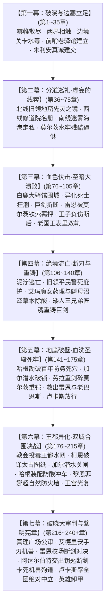
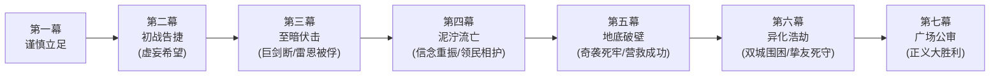

# 方案一：宏篇主线演进与阶段规划方案

> **所属方案**：[00_第二部主线与世界扩充方案总纲.md](file:///home/nanhu2/comfyui/世界书/方案/第二部/主线与世界扩充方案/00_第二部主线与世界扩充方案总纲.md)  
> **规划规模**：220 ~ 240+ 章长篇史诗体系  
> **叙事模式**：七幕·二十阶段·多线交织·至暗救赎史诗体系  
> **核心基调**：纯正日式 RPG 西幻（JRPG Western Fantasy）、正向欧陆封建史实质感、零导力反差、至暗挫折与绝地救赎

---

## 一、 宏观七幕演进脉络

---

## 二、 七幕二十阶段详尽推演（全240+章分布）

### 【第一幕：破晓与边塞立足】（第 1 ~ 35 章，共 35 章）
> **核心定位**：战后余波的净化、跨界规则的建立、伪装融入封建王国、第一座地下中继站的立足。  
> **先遣队动因铁律**：黎恩、菲娜与同伴视艾德里安与雷恩为真挚信赖的家人，对维里迪亚王国的政治权力毫无世俗利益诉求，纯粹出于守护同伴而同行；同时追查暗影能量与塞姆利亚鬼之力同源的高位面蛛丝马迹。

* **阶段一·战后新生与两界相触（第 1 ~ 8 章）**（详见 [第一幕_阶段一_战后新生与两界相触详规.md](file:///home/nanhu2/comfyui/世界书/方案/第二部/主线与世界扩充方案/分阶段详规/第一幕_阶段一_战后新生与两界相触详规.md)）
  * **主线推进**：森林残区清理影牙残兽，五族共同植下新心木树，打通太古石殿地下深层通道。
  * **跨界建交**：黎恩独行穿过时空裂隙，与马奇亚斯建交接文书，获悉帝国东部异变密电；艾玛与菲娜记录裂隙金芒节律；黎恩排查太古废墟以心眼感知并锚定跨界空间裂隙坐标。
  * **动身誓师**：朱利安王子的暗号密信抵达，艾德里安坦白十九年前城堡覆灭真相，雷恩重燃誓言，两队整装践行启程。
* **阶段二·边境暗流与要塞破关（第 9 ~ 19 章）**（详见 [第一幕_阶段二_边境暗流与要塞破关详规.md](file:///home/nanhu2/comfyui/世界书/方案/第二部/主线与世界扩充方案/分阶段详规/第一幕_阶段二_边境暗流与要塞破关详规.md)）
  * **行装伪装**：乔治工坊连夜赶制低外溢战术导力皮套与伪装行商箱；爱丽榭准备耐储肉干与营地解毒草药囊。
  * **关隘危局**：先遣队抵达维里迪亚关隘；流民营暴发黑斑水毒（暗影废渣引发），异端审问厅执行官达米安冷血下达焚营令并虐杀反抗老兵；老哨长瓦尔特·巴恩斯幼孙濒危。
  * **破局立信**：菲娜与爱丽榭以微量克制圣光融入草药汤剂平息毒情，化解人道危机，起获古代暗影污染线索；暴雨夜荒原死士突袭灭口，主角团恪守零导力铁律以冷兵器战技全歼敌徒，达米安根据解毒药渣线索一路咬尾追踪。老哨长瓦尔特认出雷恩晨光剑势与手腕烙印，开启古代排沙涵洞秘密护送篷车入境并赠予边防铁牌。
* **阶段三·法尔肯驿镇与前哨立足（第 20 ~ 35 章）**（详见 [第一幕_阶段三_法尔肯驿镇与边境前哨详规.md](file:///home/nanhu2/comfyui/世界书/方案/第二部/主线与世界扩充方案/分阶段详规/第一幕_阶段三_法尔肯驿镇与边境前哨详规.md)）
  * **据点扎根**：进驻交通枢纽法尔肯驿镇，在镇深处的“猎鹰与十字”老驿馆落脚；建立双线的边境中继指挥部与情报联络站。
  * **市井风貌**：在老驿馆品尝粗粝麦酒与硬黑麦面包，体验封建集贸重镇的市侩与烟火气；黑市汇率兑换与行商物资采购。
  * **密使接头与朱利安真诚建交**：朱利安王子以极度谦逊自省姿态秘密潜入前哨接头，直言营地没有流血义务，愿以维里迪亚人身份共同迎战暗影；亲手奉还王室密藏十九年的《艾斯特雷亚夫人临终手札与忠仆册》，向艾德里安行贵族歉礼；向雷恩出示十八年来私用内帑发放的平民抚恤密账，拔剑致敬洗刷十四年屈辱；
  * **生态敕令与部族破冰**：双方签署《维里迪亚王权对Eldoria圣域生态保护、古老神秘尊重与永不侵犯之敕令》；王子展现先给予尊重不求回报的信义，查禁捕杀狼皮走私团伙并奉还“古代月影祖石”，调派水工清淤排毒修筑沉淀池，赢得狼人与蜥蜴人的初步信任。
  * **正式分兵**：艾德里安线（艾德里安+菲）北上旧领；雷恩线（雷恩+劳拉）西进修道院；黎恩作为后盾坐镇中枢，协调两界物资。

---

### 【第二幕：分道巡礼·虚妄的线索】（第 36 ~ 75 章，共 40 章）
> **核心定位**：三轨并进展开深度独立调查，逐步触碰反派核心禁区；自以为步步为营掌握主动，实则步入反派早已布下的政治绞杀罗网。

* **阶段四·主线A：艾斯特雷亚焦土与黑晶矿奴（第 36 ~ 50 章）**（详见 [第二幕_阶段四_艾斯特雷亚焦土与炼金机兽详规.md](file:///home/nanhu2/comfyui/世界书/方案/第二部/主线与世界扩充方案/分阶段详规/第二幕_阶段四_艾斯特雷亚焦土与炼金机兽详规.md)）
  * **旧领废墟**：艾德里安与菲重踏艾斯特雷亚堡焦黑断垣，排查地下密室，起获母亲遗留的镀银首饰盒、断剑与家臣绝笔日志。
  * **琉璃化白骨**：查验死者骸骨，确认十九年前惨案死者骨骼呈现琉璃化结晶，彻底推翻教廷编造的“山贼洗劫”谎言。
  * **黑晶矿奴营与发条机兽**：深入暗影地窟，遭遇守护失控矿区的重型发条战兽【暗影噬光傀儡】；菲的高速机动配合艾德里安家传刺击艰难破拆，撬下刻有教廷秘库工匠序列号的传动主齿轮。艾德里安进一步解救出幸存领民后代，初步凝聚故土民心。
  * **先灵之镜**：艾德里安遭古代暗影瘴气侵蚀，陷入惨案幻觉濒临精神崩溃；古老先灵埃尔德莱恩借镜湖共鸣短暂显现，点醒暗影与世界外侧污染同源真相，动用**先灵之镜**映照当年教廷纵火与暗影源头，坚固艾德里安复仇意志。
* **反派地下视点（POV）·阿达尔伯特冷漠交办与莫尔茨水牢逼供**：
  * 边境剑痕报告与篷车入境情报被放在厚橡木长桌一角，阿达尔伯特随手拨开，语气平淡冰冷：“十四年了。当年打扫得不够干净，居然还有只虫子从边境的石缝里爬了回来。去翻翻关隘的值防花名册，查出这次是谁在关前放行，直接押回水牢，把嘴撬开。把第七号死牢收拾干净，别让他在外面乱叫，玷污了圣殿的旗号。”
  * 莫尔茨翻查军籍锁定老哨长瓦尔特·巴恩斯，亲率重装宪兵突袭关隘逮捕老巴恩斯，押入要塞底层黑铁水牢；莫尔茨当着老副团长戈德弗里的面持铁刺鞭毒打并踩断老巴恩斯肋骨逼问口供，老巴恩斯满脸血沫仍硬气冷笑：“当年你们没能杀绝晨光……今天也休想。”
* **阶段五·主线B：晨光修道院救赎与折剑十四人（第 51 ~ 65 章）**
  * **西进巡礼**：雷恩与劳拉伪装穿行冷杉林山道，抵达晨光修道院，接头暗中收留伤员的药舍修女艾琳娜（24岁求真医者）。
  * **起获十四人名册**：艾琳娜交付十四年前拒绝屠杀平民命令的十四名圣殿骑士原始名册（受迫害致死者、逃亡者、及关入圣殿要塞底层黑牢者名单）。
  * **名场面·月下的极剑**：修道院后山月光下，雷恩袒露当年血腥雨夜的心结与被烙印剥夺誓言的屈辱；劳拉以亚尔席昂巨剑锋芒与刚毅坦荡的剑士之魂正面迎击并锚定雷恩，完成崇高救赎。
  * **同袍对峙**：白鹰队长卢卡斯率圣殿骑兵赶到；雷恩恪守不伤同袍原则，纯以晨光战技挑落全队佩剑，震撼年轻骑士；缴获带有枢机主教私印的“异端就地清剿调兵令”。
* **阶段六·主线C：迷雾海港走私网络与暗影黑帆（第 66 ~ 75 章）**
  * **南方海港湿地**：黎恩、菲娜与乔治以商会护卫名义深入迷雾海港，联合迷迭香商行玛格丽特夫人铺开南方调查线。
  * **黑市航路调查**：查获晨光教廷假借海外布道之名，联合走私海盗向南部沼泽倾倒炼金毒渣，并走私违禁麻醉草药筹措黑市军资。
  * **斩断黑帆**：在芦苇荡深处突袭走私货栈，缴获教廷洗钱暗账与受贿贵族往来密卷，截获用于武装私兵的异邦黑钢甲胄。

---

### 【第三幕：血色伏击·至暗大溃败】（第 76 ~ 105 章，共 30 章）
> **核心定位**：全书第一次断崖式跌落低谷！反派阵营展现出碾压级的冷酷政治手腕与恐怖生化武力，主角团遭受全方位毁灭性打击，安全网全线崩塌。

* **阶段七·合流陷阱与白鹿大驿馆围城（第 76 ~ 82 章）**
  * **三线会师**：三组人马携三大物理铁证（工匠印号齿轮、十四人名册调兵令、洗钱账本）在平原大道白鹿驿馆秘密汇合，自以为胜券在握。
  * **致命情报泄露**：异端审问厅执行官达米安早已收买内线密网锁定行踪；深夜暴雨倾盆，数千圣殿铁骑与教廷私兵将白鹿大驿馆重重合围，箭镞如雨。
* **阶段八·异化死士狂潮与战器折断（第 83 ~ 90 章）**
  * **异端兵器登场**：达米安释放由活体骑士注入黑血而成的“暗影忏悔死士”大军与重型攻城发条喷酸战兽；死士不知疼痛、断肢再生，体内喷涌的浓黑酸液能瞬间熔断精钢刀剑。
  * **惨烈突围战**：主角团在零导力限制下陷入极端苦战；劳拉横剑护卫负伤同伴，亚尔席昂巨剑正面硬撼攻城机兽重锤与死士黑酸喷涌，在刺耳悲鸣中**当场折断**！劳拉内脏遭受剧烈冲击受创吐血。
* **阶段九·雷恩断后与被俘入狱（第 91 ~ 96 章）**
  * **石桥断后**：后方追兵封锁石桥吊闸，队伍退路断绝。雷恩在重创之下决然拔出晨光断剑，独自一人斩断绞盘铁链卡死吊桥，为同伴争取撤入南部沼泽与丘陵的生机。
  * **力竭被俘**：雷恩独身阻击数十名暗影死士与圣殿精锐，身中数矛力竭倒地；莫尔茨亲率地牢押解队踏上吊桥，亲手将带刺生铁颈枷死死扣入雷恩皮肉，重靴踩踏佩剑断柄狂笑：“十四年了……巴恩斯在水牢里等你很久了，你们正好在地底下聚齐！”雷恩被秘密押入第七号死牢无光水牢！
* **阶段十·王宫政变与全境血色通缉（第 97 ~ 105 章）**
  * **朱利安近卫军流血断后**：主角团负伤突围时，朱利安王子亲率王家近卫军精锐反向冲入暴雨泥泞截断追兵，亲自执剑格杀两名暗影刺客，**自身左肩被贯穿负伤**，以流血牺牲掩护众人遁入深山；
  * **老国王表里双轨与王宫政变**：阿达尔伯特与克莱门特借题发挥，宣称北方刺客谋刺、老国王突发重病，启动《战时统帅令》强行解除近卫军武装；老国王埃德蒙在御前会议裹厚毛毯剧烈咳血麻痹两强，当众严厉斥责王子禁足别殿为其提供完美不在场证明，随后被以“静养辟邪”之名软禁悬崖高塔；
  * **前哨覆灭与血色通缉**：法尔肯老驿馆被焚毁，迷迭香货栈被查封；全境贴满布告将主角团诬陷为叛乱邪教徒，主角团沦为全境追捕的流亡之徒。

---

### 【第四幕：绝境流亡·断刃与重铸】（第 106 ~ 140 章，共 35 章）
> **核心定位**：从泥泞与绝望中爬起，人心向背悄然逆转；经历挫折磨砺后，主角团完成信念觉醒与战备重整。

* **阶段十一·泥泞逃亡与旧领平民誓死庇护（第 106 ~ 115 章）**
  * **山野流亡**：艾德里安与菲护送受创吐血的劳拉遁入旧领深山，藏入艾斯特雷亚酒庄阴凉避风的地下地窖养伤。
  * **领民倒戈相护**：追兵搜山迫近，曾经被解救的矿奴领民们冒着灭门之灾用干草车藏匿主角团，端来热燕麦粥与止血草药；艾德里安看着满手粗茧的老农泪流满面，褪去轻浮，真正立誓成为守护领民生命的雄主。
* **阶段十二·送返营地工坊与劳拉巨剑重铸（第 116 ~ 125 章）**
  * **只身送刃**：劳拉留于地窖养伤，菲凭借前猎兵身手只身携带断裂的亚尔席昂巨剑残刃，避开巡逻哨卡穿过边境秘密排沙涵洞，送回 Eldoria 营地工坊。
  * **除酸瓶颈与凡人匠艺重铸**：
    - 暗影强酸彻底破坏剑刃金属晶格，地火炉无法熔合星银秘金；
    - **艾玛（魔女药理）+ 蜥蜴人鳞母（沼泽月影酸蚀草）**：鳞母提供沼泽特产草本，艾玛施展卢恩调和阵彻底拔除金属孔隙酸毒；
    - **矮人三兄弟匠魂**：大哥多尔金铸刃、二哥哈根架设加压地火炉、三弟法林刻入防酸破邪符文，纯粹凡人匠艺重铸带有破邪绝魔刻印的新生双手重剑！
  * **重剑归来与信念重振**：菲与黎恩将重剑送回酒庄地窖；劳拉接过重剑抚摸锋锐剑脊，在挫折与托付中扫清迷茫，完全重振守护同伴与弱小的坚毅信念。
* **阶段十三·南方盟军合流与大本营魔法战备总动员（第 126 ~ 140 章）**
  * **前线同伴会合与营救推演**：散落各处的同伴（黎恩、劳拉、菲、艾德里安）在酒庄地下安全屋顺利会合；去圣殿要塞接回同伴是所有人不言而喻的默契，众人围在粗木长桌前，借由昏黄烛光细致推演要塞潜入方案。
  * **大本营魔法批量制作战备物资**：
    - *原料来源*：Eldoria 森林特产的高韧性野生剑麻纤维、森林止血草药（白凝草、岩金草），以及通过时空裂隙从帝国东部合法采购调配的医用高纯度酒精与精磨燕麦粗粉；
    - *魔法制作工艺*：爱丽榭与亚莉莎负责统筹营地工坊；艾玛施展巡林魔女的卢恩符文与秘药催化魔法，对大批草药进行高速浓缩萃取，瞬间凝固成高纯度灭菌止血膏，并用温和的净化魔法对大卷剑麻绷带进行无菌附魔；营地工坊利用导力烘烤箱与脱水风道，短时间内批量烘焙出耐受潮湿且热量极高的压缩燕麦干酪饼与浓缩肉汤块；
  * **海上隐秘运送**：大批附魔战备物资通过迷迭香商行与南方迷雾海港的走私隐秘平底船，沿着芦苇湿地送抵艾斯特雷亚旧领前线安全屋。

---

### 【第五幕：地底破壁·血洗圣殿死牢】（第 141 ~ 175 章，共 35 章）
> **核心定位**：全篇最惊心动魄的特种攻坚战役！精妙情报与小队特种渗透协同，直捣敌军心脏，完成不可能的劫狱逆转。

* **阶段十四·哈根勘破要塞死穴与水泽潜渡渗透（第 141 ~ 150 章）**
  * **哈根勘破承重死穴**：哈根勘察要塞构造，一眼看穿两百年承重主拱底下的生铁吊栓当年被教廷神官减配，直接锁定死牢排沙盲井潜入路线；
  * **加尔潜渡破锁**：面对排沙口被莫尔茨布设的机关铁网与传动暗锁，哈根看穿差速机括，指引蜥蜴人第一剑士加尔潜入冰冷刺骨的水底精准斩断传动销，暴力开辟血洗死牢通道；
  * **精准静音破拆**：主角团依据古代暗渠图样打通松散碎石岩层，特种潜入死牢排沙口。
* **阶段十五·奇袭深层水牢与解救残存老骑士（第 151 ~ 162 章）**
  * **地牢突袭与重斩破铠**：主角团直插底层水牢；莫尔茨率精锐重甲死士堵截通廊，挥舞六十磅狼牙破甲锤狂暴压制；劳拉手持重铸大剑正面重斩破开锤势，一剑斩碎莫尔茨胸前生铁重铠，将其重创震落水潭彻底溃败！
  * **水牢深处的重聚**：在无光水牢中解救出戴着生铁重枷、眼神依然平静清澈的雷恩；同时意外解救出被囚十四年的老副团长戈德弗里等五位老骑士，以及关押在隔壁牢房的老哨长瓦尔特·巴恩斯。
* **阶段十六·火海突围与少壮派骑士信仰动摇（第 163 ~ 175 章）**
  * **要塞火海**：要塞警钟大作，阿达尔伯特调集铁骑阻截；劳拉背负重伤的雷恩突围，黎恩以八叶居合神速刀风斩断生铁吊栅门沉重铁链。
  * **白鹰队长卢卡斯的信义抉择**：卢卡斯奉命率骑兵堵截吊桥，老副团长当面出示身上被严刑拷打的烙印，雷恩亦亮出阿达尔伯特亲笔签发的屠杀军令原本；卢卡斯看清大团长践踏晨光誓约的伪善面具，断然下令所属骑兵撤开吊桥放行同袍！

---

### 【第六幕：王都异化·双城合围决战】（第 176 ~ 215 章，共 40 章）
> **核心定位**：反派穷途末路发动无差别生化屠杀，平民陷入狂澜；部族挚友与盟军死守，黎恩与菲娜构筑超自然防火墙，王都内城与下城双线光复。

* **阶段十七·教会投毒水网与全城生化异变暴走（第 176 ~ 185 章）**
  * **垂死反扑**：克莱门特得知死牢被破、铁证大白，下令向王都下水道源头倾倒纯度最高的暗影原液，释放教廷秘库储备的上百具发条机兽与死士。
  * **炼狱王都**：黑水蔓延全城，平民吸入毒雾狂暴异化，机兽在街巷横冲直撞；阿达尔伯特下达封锁城门射杀平民的屠杀令，王都沦为人间炼狱。
* **阶段十八·太古图纸破译、加尔潜渡关闸与哈根防酸冲车（第 186 ~ 198 章）**
  * **水网拯救行动**：毒水蔓延超出阻绝速度，帝国学者柯恩·瓦尔德与凯尔破译老国王秘密送出的太古筑城图纸，定位封存百年的太古盲泉排沙闸；加尔与蜥蜴人勇士舍命潜入恶臭毒水关闭污染主阀、引入清泉，救赎全城水网；
  * **哈根现场装配防酸冲车**：面对全城强酸毒雾，哈根指挥铁匠利用废旧生铁与厚栎木现场装配“矮人防酸重冲车”，高唱矮人战歌单手挥锤破障；
  * **狼人街巷猎杀**：罗恩率狼人猎手在浓雾中凭借超凡嗅觉精准扑杀暗影死士，救护平民孩童，彻底消融百年种族偏见。
* **阶段十九·黎恩菲娜超自然防火墙与王宫近卫军光复（第 199 ~ 215 章）**
  * **超自然防火墙**：教廷终极发条巨兽在城市中央过载，即将释放致命引力坍缩与强酸风暴。黎恩彻底解开鬼之力将其炼化为澄澈护界，菲娜全力释放炽天使圣光净界，二人在广场上空筑起半径千米的“绝对超自然防火墙”，将所有生化毒素尽数汽化阻绝。
  * **王宫夺回战**：朱利安王子携王室密诏联络醒悟的近卫军军官发动起义，突入离宫斩杀教廷特务，救出埃德蒙老国王，重掌禁军大权。

---

### 【第七幕：破晓大审判与黎明宪章】（第 216 ~ 240+ 章，共 25+ 章）
> **核心定位**：政治、法律与武道的终极清算！本土力量自主建立正义秩序，两大首恶伏诛，神权法统洗牌，英雄卸甲，留下跨位面高维之谜。

* **阶段二十·真理广场公审、三军中立与黎明新世界（第 216 ~ 240+ 章）**
  * **真理广场大公审（法理除恶与家门正名）**：
    1. 埃德蒙老国王亲手宣读手抄十八年的教廷贪腐黑账；
    2. 艾德里安登上真理广场石台，出示刻有教廷工匠序列号的机兽主齿轮与琉璃骸骨，彻底击碎教廷伪善神权；
    3. 克莱门特激活教皇王车内的终极暗影发条机兽企图垂死挣扎，艾德里安以家传刺剑配合菲的牵制，亲手刺穿机兽核心将其斩首，告慰亡亲并收复故土！
  * **圣殿校场破晓对决（断剑殉道与全团中立）**：
    1. 雷恩携老副团长戈德弗里与拒杀名册直面全团，怒斥阿达尔伯特十四年前屠杀平民与构陷同袍的军令；阿达尔伯特挥剑狂暴重斩，雷恩以纯正晨光剑法一击挑断其佩剑；
    2. 基层数千名骑士长剑低垂，卢卡斯将剑尖指向指挥台，全军拒不听命；教廷密使手持二十年利益分肥密约歇斯底里勒索，阿达尔伯特凄凉自嘲认输，解下白鹰大团长金链掷地，将通往私人祈祷室暗格的黑铁钥匙摔在雷恩与卢卡斯面前，交出前任团长绝笔与克莱门特三十一年灭口手令；
    3. 埋伏在校场外围的失控发条机兽与暗影死士突入校场企图扑杀老副团长并毁灭铁证，失去武装的阿达尔伯特俯身抓起自己被斩断的**半截佩剑**，爆发出最后的疾风战技，单人迎头撞上机兽，将带血断刃狠狠楔入核心主齿轮，以肉身卡死机兽运转，自身亦被击穿胸膛；
    4. 阿达尔伯特在雷恩怀中吐血留下关于十四年前祈祷室的忏悔遗言，在白石校场战死。卢卡斯率全团拔剑宣誓保持绝对中立，圣殿常规武装威胁彻底平息！
  * **体制更迭与新宪章签署**：
    1. 朱利安王子将四大物理铁证正式呈送全大陆晨光总廷与圣殿大修会总团；两大总部发布通谕永久开除惩戒两大首恶，并派驻清廉新主官；
    2. 朱利安继位新王，正式签署《维里迪亚王权对Eldoria圣域生态保护、古老神秘尊重与永不侵犯之敕令》与《维里迪亚自由大宪章》，收回半数要塞防务与税权，王国开启立宪新秩序。
  * **英雄卸甲与世界外侧深渊隐秘**：
    1. 维里迪亚全境与Eldoria营地开启跨界和平贸易，法尔肯重建的“猎鹰与十字”老驿馆前，黎恩、菲娜、劳拉、菲与艾德里安、雷恩举杯相庆；
    2. 夜空下，封存的黑晶残骸与黎恩体内的鬼之力产生共鸣；高位面“世界外侧”污秽之楔的蛛丝马迹浮出水面，为第三部异界终极篇章埋下恢弘深邃的伏笔。

---

## 三、 七幕挫折律动与核心破局对照

主线拒绝平铺直叙，设立递进式挫折瓶颈。全篇挫折瓶颈由营地伙伴、各族挚友与本土盟友凭借凡人智慧、工程造诣与多元羁绊逐步突破，凸显凡人意志的高光：

| 幕次 | 挫折 / 危机瓶颈 | 困境表现 | 核心破局主角与手段 |
| :--- | :--- | :--- | :--- |
| **第一幕** | 关隘黑斑水毒蔓延 | 边境草药告罄，教廷司铎欲纵火焚营 | **菲娜（炽天使纯净调和）+ 爱丽榭（草药配方）**：以微量克制圣光融入草药汤剂平息毒情，化解人道危机。 |
| **第二幕** | 艾斯特雷亚地窟暗影蚀心毒 | 艾德里安遭古代暗影瘴气侵蚀，陷入灭门惨案幻觉濒临精神崩溃 | **古老先灵埃尔德莱恩与先灵之镜**：借镜湖共鸣短暂显现，点醒暗影与世界外侧污染的古老同源真相，传授净魂律动；动用**先灵之镜**映照当年真相，坚固艾德里安复仇意志。 |
| **第三幕** | **【至暗转折】白鹿驿馆伏击** | 达米安与死士围攻，亚尔席昂巨剑折断，雷恩被莫尔茨铁索生擒，王室遭软禁 | **朱利安王子（率近卫军反向冲杀左肩负伤断后）+ 旧领领民（以干草车誓死藏匿伤员）**：主角团在泥泞绝境中重聚。 |
| **第四幕** | 巨剑断口受强酸坏死，重铸受阻 | 暗影强酸彻底破坏剑刃金属晶格，地火炉无法使星银秘金熔合 | **艾玛（魔女药理）+ 蜥蜴人鳞母（沼泽月影酸蚀草）+ 矮人三兄弟匠魂**： 1. 鳞母提供沼泽特产草本，艾玛施展卢恩调和阵彻底拔除金属孔隙酸毒； 2. 大哥多尔金铸刃、二哥哈根架设加压地火炉、三弟法林刻入防酸破邪符文，纯粹凡人匠艺重铸新生巨剑！ |
| **第五幕** | 死牢排沙盲井注满暗影水银暗锁 | 莫尔茨在要塞排沙死角布设机关铁网与暗锁，潜渡勇士被阻 | **哈根（工程降维点穴）+ 加尔（水泽勇士超凡水性）**：哈根看穿矮人旧锁差速机括，指引加尔潜入冰冷水底精准斩断传动销，暴力开辟血洗死牢通道！ |
| **第六幕** | 王都下水道全城暗影投毒暴走 | 反派垂死向水网倾倒原液，毒水扩散超出常规阻绝速度，平民面临狂暴异化 | **柯恩·瓦尔德（帝国学者）+ 老国王王室秘卷 + 加尔（水泽勇士舍命关闸）**： 柯恩破译老国王秘密送出的太古筑城图纸，定位封存百年的太古盲泉排沙闸；加尔率队潜入毒水关闭主阀、引入活泉，救赎全城！ |
| **第七幕** | 终极机兽扑杀老副团长欲毁铁证 | 校场外围失控机兽突入，骑士阵列仓促退避，老副团长危在旦夕 | **阿达尔伯特（断剑卡死机兽核心殉道）**：手握半截断剑以身殉道卡死发条主轴；**艾德里安（真理广场刺穿机兽核心）**：家传刺剑完成家仇大正名！ |

---

## 四、 docs2 实体完全咬合索引

| 方案维度 | 涉及的 docs2 实体卡片 |
| :--- | :--- |
| **主要角色** | 黎恩、Seraphina（菲娜）、劳拉、雷恩、艾德里安、菲、朱利安、乔治、爱丽榭、亚尔缇娜、艾玛、法林、玲、凯尔、罗恩、亚莉莎、奥蕾莉亚、加尔 |
| **重要NPC** | 埃德蒙（国王·50岁）、克莱门特三世（枢机主教·71岁）、阿达尔伯特（大团长·59岁）、戈德弗里（老副团长·62岁）、卢卡斯（白鹰队长·25岁）、达米安（异端审问官·29岁）、维克托（炼金首席·35岁）、莫尔茨（地牢典狱长·38岁）、玛格丽特（迷迭香商行·32岁）、瓦尔特·巴恩斯（关隘老哨长·54岁）、艾琳娜（药舍修女·24岁）、柯恩·瓦尔德（帝国学者·55岁）、马奇亚斯（帝国调查官·23岁）、多尔金（矮人锻造大师）、哈根（矮人建筑大师）、狼人月语者（狼族族长）、蜥蜴人鳞母（沼泽首领） |
| **地理舞台** | 维里迪亚关隘、法尔肯驿镇、迷迭香商行、艾斯特雷亚堡、艾斯特雷亚酒庄、暗影地窟、白鹿驿馆、晨光修道院、圣殿要塞（圣殿地牢、圣殿校场）、迷雾海港、南部沼泽、黑野猪酒馆、白金王宫（王宫温室、密室）、晨光大教堂、教廷秘库、王都下水道、真理广场、太古石殿、心木圣坛、矮人锻炉大厅、狼人隐谷 |
| **威胁与生物** | 暗影噬光傀儡、暗影实验畸变体、暗影忏悔死士、残区影牙兽、矮人族、狼人族、蜥蜴人族 |
| **能量与法则** | 暗影能量、圣光、鬼之力、鬼之圣光、雾帷与时空裂隙 |
