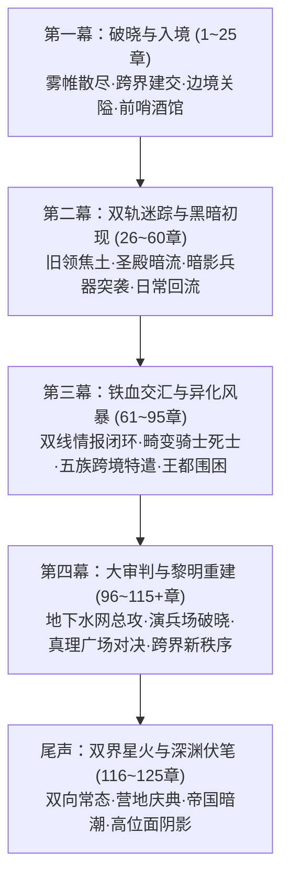

# 方案一：百章宏篇主线演进与阶段规划方案

> **所属方案**：[00_第二部主线与世界扩充方案总纲.md](file:///home/nanhu2/comfyui/世界书/方案/第二部/主线与世界扩充方案/00_第二部主线与世界扩充方案总纲.md)  
> **规划规模**：100 ~ 120+ 章节长篇史诗体系  
> **叙事模式**：四幕·十一阶段·多线交织·双向螺旋推进

---

## 一、 宏观四幕演进脉络

---

## 二、 四幕十一阶段详规（100~120+章分布）

### 【第一幕：破晓与入境】（第 1 ~ 25 章）
> **主题**：战后余波的净化、跨界规则的建立、伪装融入封建王国、第一座地下中继站的立足。

* **阶段一·战后新生与两界相触（第1~8章）**【已立项阶段】
  * `引-1 ~ 引-3`：森林清理影牙残区，五族共同植下新心木树，打通石殿地下十七条通道之一。
  * `引-4 ~ 引-5`：黎恩独行穿过裂隙与马奇亚斯建交，拿到帝国临时政府公文；艾德里安与雷恩宣布归国调查，营地践行。
  * `帝-1 ~ 帝-3`：帝国东部边境异变报告；艾玛与菲娜记录裂隙脉动；黎恩排查废墟感应瓦利玛坐标。
* **阶段二·边境暗流与破关而入（第9~16章）**
  * 乔治工坊连夜赶制低外溢战术导力皮套与伪装行商箱；爱丽榭准备耐储肉干与营地草药囊；
  * 先遣队（黎恩、菲娜、雷恩、劳拉、艾德里安、菲）抵达维里迪亚关隘；
  * 关隘已被圣殿骑士团严密封锁，雷恩发现守关队长是昔日部下，不愿强攻流血；
  * 菲利用前猎兵身手夜间勘测绝壁小径，队伍化整为零避开正面盘查；
  * 途中遭遇边境流民与盗贼团，众人以不暴露导力与圣光的方式击退匪帮，救下逃难农户。
* **阶段三·法尔肯驿镇与边境前哨（第17~25章）**
  * 进驻交通枢纽**法尔肯驿镇**，在镇深处的**“猎鹰与十字”老驿馆**落脚；这里是艾德里安当年游走四方的商队据点；
  * 建立双线的边境中继指挥部与情报联络站；
  * **日常生活呼吸**：众人在老驿馆包厢品尝王国粗粝的麦酒与硬黑麦面包，体验封建边境集贸重镇的市侩与烟火气；
  * **初次接头**：朱利安王子的密使以流浪诗人身份在镇内暗号接头，送来王都势力布防图；
  * **正式分兵**：艾德里安线（艾德里安+菲）北上旧领；雷恩线（雷恩+劳拉）西进修道院；黎恩作为后盾坐镇中枢，协调两界物资。

---

### 【第二幕：双轨迷踪与黑暗初现】（第 26 ~ 60 章）
> **主题**：深入腹地展开独立调查，反派暗影炼金兵器首次登场，前线与后方的物资/情感回流。

* **阶段四·主线A：焦土下的白骨与炼金残渣（第26~37章，艾德里安线）**
  * 艾德里安与菲重踏艾斯特雷亚城堡废墟，荆棘覆盖焦黑断墙；
  * 排除游荡野兽，深入地下密室暗格，挖出母亲当年留下的镀银首饰盒、断剑与家臣绝笔日志；
  * 菲查验当年死者骸骨，惊骇发现骨骼呈现琉璃化结晶，带有浓烈的炼金化学毒剂腐蚀痕迹；
  * **首次遭遇战**：废墟地底被激活动态防御兵器——**古代暗影噬光傀儡（炼金发条机兽）**！
  * 菲的高速机动配合艾德里安的家传刺击艰难破拆；乔治特制的外溢阻断壳经受住了考验；
  * 发现这具机械兽的齿轮核心上，赫然刻着教廷秘库的工匠序列号！
* **阶段五·主线B：修道院的名册与月下极剑（第38~48章，雷恩线）**
  * 雷恩与劳拉来到隐蔽的**晨光修道院**，重遇十四年前收留伤员的老修女；
  * 拿到当年十四名拒绝屠杀令的骑士名册：有人离奇横死，有人被秘密关入圣殿要塞地牢；
  * **名场面·月下的极剑**：雷恩在修道院后山月光下，首次对劳拉倾吐十四年前大雨夜的血腥屠杀与屈辱；劳拉拔出巨剑，以剑意与灵魂彻底锚定雷恩，承诺与他并肩斩碎伪善；
  * 圣殿追击小队赶到，带队者是崇拜雷恩昔日威名的年轻骑士兵长；
  * 雷恩在不伤一人的情况下用晨光剑术打落全队佩剑，年轻骑士们信念动摇；
  * 雷恩缴获追击令，发现阿达尔伯特使用了加盖枢机主教印鉴的绝密异端调兵令。
* **阶段六·后方中继与日常整备回流（第49~60章，大本营与驿馆日常）**
  * 艾德里安与菲负伤退回法尔肯驿镇老驿馆，黎恩通过裂隙将情报与破损机件送回营地工坊；
  * **工坊日常**：乔治拆解暗影机械核心，亚尔缇娜算力演算其能量回路，发现其依靠某种黑色结晶驱动；
  * **菲娜的圣光符文石研发**：菲娜以炽天使圣光注入石髓，研制出专门中和暗影腐蚀的圣光挂坠；
  * **营地大食堂的温情**：爱丽榭精心制作肉汤与干酪馅饼，由信差快马送抵驿馆；
  * **私密情感与身心治愈**：菲娜与黎恩的深刻温存；乔治在工坊中与菲娜独处时的雄性克制与沉稳担当；劳拉与雷恩并肩擦拭长剑的默契。

---

### 【第三幕：铁血交汇与异化风暴】（第 61 ~ 95 章）
> **主题**：双线情报闭环，反派派出畸变异端骑士死士，营地五族特遣跨境支援，决战前的全面危机。

* **阶段七·双线在中盘的致命汇流（第61~68章）**
  * 艾德里安在旧领附近查扣了一批教会秘密走私车队，发现箱内竟是圣殿大要塞管制的黑钢铠甲；
  * 双队在**白鹿驿馆**密室会合对账，真相大白：**克莱门特三世提供暗影实验遗留的毒素与异化技术，阿达尔伯特提供军队武装与政治掩护，结成了维系三十一年的黑幕同盟！**
  * 朱利安王子通过秘密信鸽发出最高警报：大团长与主教已察觉异动，准备在全境发动戒严清剿。
* **阶段八·反派王牌出击：畸变异端骑士突袭（第69~77章）**
  * 克莱门特派出其秘密培养的**“暗影忏悔死士”**（被注入暗影黑血的人体改造骑士），配合重装暗影雾化炮在平原大道伏击主角团；
  * 异化骑士不知疼痛、断肢再生、黑血腐蚀一切常规武器；
  * 劳拉极剑正面硬撼重斧，黎恩拔刀释放澄澈鬼之力形成护界，菲娜的圣光符文石暴发出耀眼金芒灼烧黑血；
  * 战斗极其惨烈，主角团虽然击退死士，但退路被圣殿大军合围封锁，陷入绝境。
* **阶段九·五族特遣跨境：意料之外的破局（第78~87章）**
  * 营地得知前线危局，五族决定全面跨境参战（暗影正是破坏森林家园的源头）；
  * **矮人破壁**：多尔金与哈根率领矮人掘进队，重新打通了维里迪亚边境连通王都外围的废弃古代矿道，打通了包围圈缺口；
  * **狼人猎影**：罗恩率领狼人游击队在密林与山谷中以超凡嗅觉追猎暗影死士的行踪，歼灭斥候；
  * **蜥蜴人接应**：鳞母指派水泽战士潜入王都下水道与暗渠，为主角团搭建起水上秘密撤退通道；
  * 王国平民与基层士兵目睹“异族”不仅没有残害人类，反而击败了恐怖的暗影怪物并保护平民，舆论与民心开始逆转。
* **阶段十·王都围困与潜伏渗透（第88~95章）**
  * 主角团经由地下水网全员潜入王都下城区，在曲折窄巷深处的**黑野猪酒馆**（忠诚家臣之后掌管）建立王都潜伏指挥所；
  * 埃德蒙国王在王宫密室召见黎恩与朱利安，表明自己隐忍十年搜集的教廷经济命脉账本；
  * 制定破晓双向大决战方案：艾德里安在真理广场发动舆论与法律大审判；雷恩直捣大要塞演兵场发动军事清算。

---

### 【第四幕：大审判与黎明重建】（第 96 ~ 115+ 章）
> **主题**：政治、法律与武道的终极清算，两大首恶倒台，王国制度重构，英雄卸甲。

* **阶段十一·双向总决战与破晓晨光（第96~108章）**
  * **教廷秘库攻坚**：菲与蜥蜴人战士潜入教廷地下深层，夺得三十一年前克莱门特亲笔签署的“暗影实验销毁与山贼伪造令”原本；
  * **真理广场大审判**：艾德里安登上真理广场大理石高台，面对数万平民、神职人员与赶来的贵族，当众公布带血的实验档案与死士样本；克莱门特暴怒之下激活护卫的暗影构装巨兽，黎恩与菲娜当场出手，太刀与圣光在万民见证下斩碎魔物，克莱门特伪善彻底破产并被王室卫队羁押；
  * **大要塞演兵场破晓之决**：雷恩携前任大团长自白书踏入演兵场，当着全部骑士团旗队的面揭穿十四年前屠杀真相；阿达尔伯特困兽犹斗拔剑决斗；雷恩在劳拉剑锋护持下，以纯正晨光剑法一击斩断阿达尔伯特的佩剑！大团长政治生命终结。
* **阶段十二·王权重建与祖地复苏（第109~115章）**
  * 埃德蒙国王颁布退位与改革诏书，朱利安王子正式摄政，全面取缔暗影研究并整饬骑士团；
  * 艾斯特雷亚家族正式平反，艾德里安收复祖地，在断壁废墟前将母亲的银盒埋入泥土，种下象征新生的树苗；
  * 雷恩来到圣殿大门前，面向破晓朝阳完成最后一次清澈的“晨光之誓”，随后主动解下佩剑徽记，走向劳拉：“我不再是被放逐者，我是自由的剑客。”

---

### 【尾声：双界星火与深渊伏笔】（第 116 ~ 125 章）
> **主题**：凯旋归宿、两界常态化通商往来、第三部高位面灾厄伏笔。

* **阶段十三·凯旋欢宴与常态化通途（第116~120章）**
  * 主角团回到Eldoria营地，爱丽榭掌勺煮出犒劳全员的大锅炖汤，五族首领与帝国伙伴彻夜欢歌；
  * 维里迪亚王国的商队第一次合法穿越边境关隘，与Eldoria展开公开贸易；
  * 裂隙两侧的来往成为日常：爱丽榭往返于帝国女子学院与营地厨房；乔治的工坊成为两界工程奇迹。
* **阶段十四·第三部深层震荡的引线（第121~125章）**
  * 乔治从教廷暗影核心残骸中提取出“无光黑晶”，其频谱与帝国东部边境的暗紫雾气出现 100% 同频震颤；
  * 黎恩胸口的鬼之力刻印出现隐隐灼痛，脑海中沉睡的瓦利玛传出古老叹息：“那不是属于这个世界的产物……那是‘世界外侧’的污秽之楔……”；
  * 马奇亚斯发来帝国紧急公函：帝国军事情报局与结社的影子已在裂隙周边徘徊；
  * 黎恩握紧太刀，菲娜站在他身侧，两人望向幽蓝裂隙深处，全书进入第三部宏大序曲。
