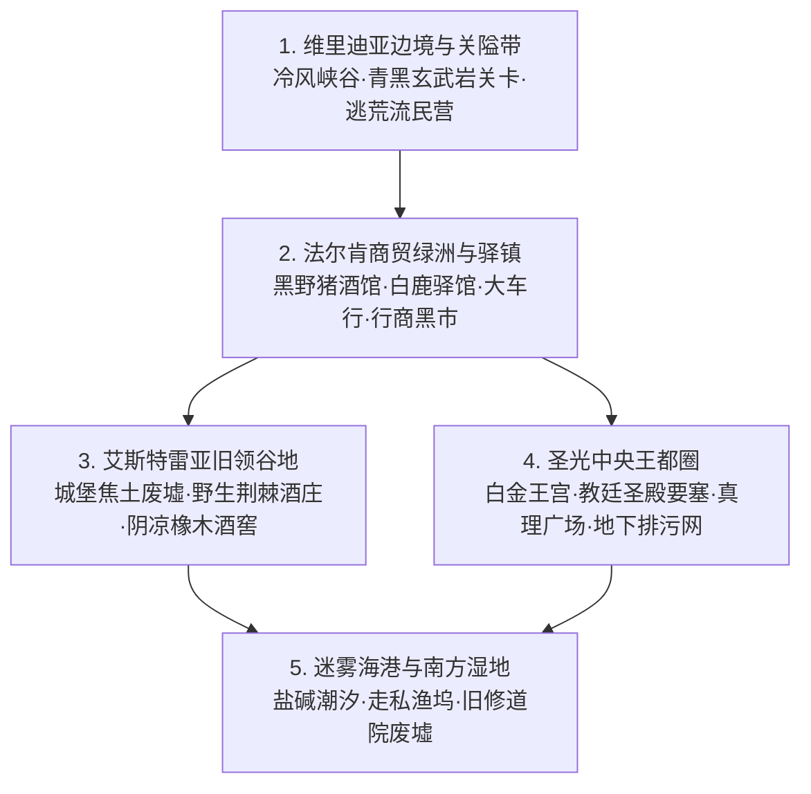

# 方案二：维里迪亚风土人情与宏大世界构建方案

> **所属方案**：[00_第二部主线与世界扩充方案总纲.md](file:///home/nanhu2/comfyui/世界书/方案/第二部/主线与世界扩充方案/00_第二部主线与世界扩充方案总纲.md)  
> **核心定位**：维里迪亚王国的地理版图、封建社会阶层、经济货币、生活风貌与零导力文化碰撞全景。

---

## 一、 王国五大地理版图与风土特征

维里迪亚王国疆域广袤（从边境关隘到王都纵深约170公里），地形多样，孕育了极具质感的封建中世纪风土：

### 1. 维里迪亚边境与关隘带（冷硬铁幕）
* **地理物象**：高耸陡峭的喀斯特悬崖断壁，通往王国腹地的咽喉要道矗立着以青黑玄武岩砌成的**维里迪亚关隘**。城垛插满圣殿骑士团的白鹰旗与王室双头狮旗。
* **风土人情**：边境气候干冷多风。关隘外侧聚居着大量因两百年雾帷隔绝而流离失所的边民营帐。哨兵手持火把与生锈铁戟，盘查极为严苛；关卡税吏对每一车燕麦、生铁甚至猎户的毛皮克扣重税。

### 2. 法尔肯商贸绿洲与驿镇（混杂市井与边境集市）
* **地理物象**：位于关隘以南10公里的开阔河谷台地，由古老驿站发展而成的欧陆式木筋墙集贸重镇。青石板路被无数四轮重装马车压出深辙。
* **生活核心**：
  * **“猎鹰与十字”老驿馆**：艾德里安当年行商的秘密据点。双层加厚栎木门与隔音插销，背街有暗梯直通石阶。佣兵、流浪骑士与走私商在此落脚，大厅弥漫着浑浊麦芽酒、烤黑麦硬面包与粗粝烟草香气。

### 3. 平原大道与白鹿大驿馆（贵族行驿）
* **地理物象**：坐落于平原大道中段的石砌贵族大驿馆（距关隘45km）。高耸的石墙环抱着宽敞的马车内院与二层客楼，专供王国贵族与教廷特使歇宿。
* **生活核心**：二层贵族套房铺设厚织毯，壁炉燃烧昂贵果木炭，四柱深紫垂幔大床，充满虚饰的封建礼节与私密掩蔽。

### 4. 艾斯特雷亚旧领谷地（沉寂哀伤）
* **地理物象**：三面环山的肥沃谷地，曾盛产全大陆最香醇的“紫皇冠”葡萄酒。三十一年前惨案后，主城堡化为焦黑断壁，断墙上缠绕着枯死的黑荆棘。
* **生活核心**：谷地边缘散落着几户苟延残喘的先代家臣老农，他们在废弃的**艾斯特雷亚酒庄**地下室偷偷酿造粗酒度日，每当提及当年的老伯爵夫人，老人们依旧脱帽垂泪。

### 5. 圣光中央王都圈（权欲、神圣与底层下城）
* **地理物象**：建立在高地之上的宏伟白石都市与深层排污巨网。
  * **白金王宫**：哥特式尖顶镀金回廊，琉璃温室四季如春；
  * **真理广场**：由八万块白大理石铺就的巨大公开讲演场，立有历代开国圣王的巨型石雕；
  * **黑野猪酒馆**：位于王都下城区曲折石板窄巷深处的粗木石酒馆。下沉式门楣，深色栎木横梁大厅，终日回荡着佣兵苦力的喧闹、粗麦黑啤与烤羊肉香气，是王都下层社会最安全的地下情报与避风港；
  * **圣殿大要塞与要塞大校场**：王都北悬崖军事中枢；
  * **教廷秘库与圣光大教堂**：神权秩序圣地。

### 6. 迷雾海港与南方湿地（阴暗走私）
* **地理物象**：王都以南50公里的盐碱沼泽与深水海湾（距关隘170km），终年被湿冷海雾笼罩。三桅武装商船与吃水浅的平底走私渔船穿梭于芦苇荡与货栈之间。
* **风土人情**：这里的渔民与水手信奉古老水神，暗中帮海盗、走私行会运送违禁品（包括教会严禁的炼金麻醉草药），是连接大陆与海外岛屿的唯一出海通道。

---

## 二、 封建阶层百态与社会生态

维里迪亚实行严格的封建世袭与神权复合制度，阶层壁垒森严：

1. **教廷主教与圣职集团**：享有绝对免税权与终审裁判权。身着金丝滚边的华丽红白法衣，出行乘坐四马轻舆，以“代神牧民”之名垄断所有学校、医院与文字档案。
2. **大贵族与骑士阶层**：圣殿骑士团高级骑士兼具军政大权。自视甚高，将流民与佣兵视作草芥；内部派系倾轧严重，老牌理想主义派与阿达尔伯特的实用主义军僚派水火不容。
3. **行会商贩与市井匠人**：处于夹缝中的中产。没有政治发言权，被圣殿与教会反复盘剥；暗中极度渴望变革与商路开放，朱利安王子的改革思想在年轻商人中极有市场。
4. **底层农奴与流民**：占人口70%以上。每年秋收大半粮食需充作十一税与领主租金，冬季靠豆麦糊与干芜菁充饥，对神权抱有既敬畏又绝望的麻木心理。

---

## 三、 货币、物价与经济体系

为保证长篇故事的细节扎实，设立统一的货币与物价常数：

### 1. 货币单位与兑换
* **王国铜便士（Penny）**：底层市井找零货币，薄而粗糙的紫铜币。
* **王国银克朗（Crown）**：主流交易货币，正面刻有王室双狮徽记，背面刻圣殿十字。
  * 换算关系：**1 银克朗 = 20 铜便士**。
* **王国金索维林（Sovereign）**：大宗交易与贵族储蓄金币。
  * 换算关系：**1 金索维林 = 10 银克朗**。
* **帝国米拉（Mira）黑市兑换**：
  * 王国原住民不认识米拉，但识得帝国纸钞上的精良防伪金线与纯银硬币。
  * 在法尔肯黑市，**1 银克朗 ≈ 500 帝国米拉**（极具购买力）。

### 2. 经典物价参考表
* 一大杯粗麦黑啤酒：**2 铜便士**
* 一块热气腾腾的洋葱炖羊肉馅饼：**3 铜便士**
* 黑野猪酒馆通铺一宿（含马匹草料）：**1 银克朗**
* 白鹿驿馆豪华贵族套间一宿：**3 金索维林**
* 一匹训练有素的重装战马：**15~20 金索维林**
* 一张通往王都的特许通行状（黑市伪造）：**2 金索维林**

---

## 四、 绝对零导力社会的文化反差与生活细节

维里迪亚王国全境与科技高度发达的埃雷波尼亚帝国形成极其鲜明的文化反差。这种反差是丰富故事趣味与日常交互的绝佳源泉：

1. **照明与夜生活**：
   * 王国入夜后除了贵族厅堂点燃蜂蜡蜡烛外，普通平民只能使用昏暗冒黑烟的动物油脂灯或火把。
   * 帝国先遣队携带的**防风压电打火石**、**高纯度密封无烟燃料**在原住民眼中堪比“炼金奇迹”。
2. **饮食保存与补给**：
   * 王国长途旅行只能携带干硬如石头的硬饼干、盐渍风干肉块与发酵酸乳酪。
   * 爱丽榭制作的帝国真空马口铁炖牛肉罐头、脱水蔬菜汤块与精制白砂糖，在驿站露营时引得同行原住民（艾德里安、雷恩）赞叹不已。
3. **时间与度量**：
   * 王国平民根据日升日落与修道院的晨昏钟声感知时间；
   * 黎恩怀中的帝国机械发条怀表、亚尔缇娜的数字测距目镜，都必须小心翼翼地藏入皮套，绝不在外人面前展露。
