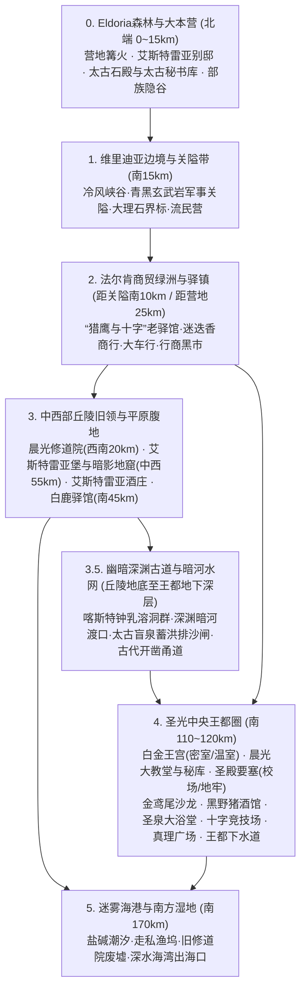

# 方案二：维里迪亚风土人情与宏大世界构建方案

> **所属方案**：[00_第二部主线与世界扩充方案总纲.md](file:///home/nanhu2/comfyui/世界书/方案/第二部/主线与世界扩充方案/00_第二部主线与世界扩充方案总纲.md)  
> **核心定位**：维里迪亚王国的地理版图、封建社会阶层、经济货币、生活风貌与零导力文化碰撞全景。

---

## 一、 王国五大地理版图与空间格局全貌

维里迪亚王国疆域广袤，全境地势北高南低（从北部森林营地原点、边境关隘到南方海港全境纵深约170公里，王都位于110~120公里处）。地理舞台由北向南依次展开，地形多样，孕育了极具质感的封建中世纪风土：

```mermaid
graph TD
    Camp["0. Eldoria森林与大本营 (北端 0~15km)<br/>营地篝火 · 艾斯特雷亚别邸 · 太古石殿与太古秘书库 · 部族隐谷"] --> Area1["1. 维里迪亚边境与关隘带 (南15km)<br/>冷风峡谷·青黑玄武岩军事关隘·大理石界标·流民营"]
    Area1 --> Area2["2. 法尔肯商贸绿洲与驿镇 (距关隘南10km / 距营地25km)<br/>“猎鹰与十字”老驿馆·迷迭香商行·大车行·行商黑市"]
    Area2 --> Area3["3. 中西部丘陵旧领与平原腹地<br/>晨光修道院(西南20km) · 艾斯特雷亚堡与暗影地窟(中西55km) · 艾斯特雷亚酒庄 · 白鹿驿馆(南45km)"]
    Area3 --> AreaSub["3.5. 幽暗深渊古道与暗河水网 (丘陵地底至王都地下深层)<br/>喀斯特钟乳溶洞群·深渊暗河渡口·太古盲泉蓄洪排沙闸·古代开凿甬道"]
    AreaSub --> Area4
    Area2 --> Area4["4. 圣光中央王都圈 (南110~120km)<br/>白金王宫(密室/温室) · 晨光大教堂与秘库 · 圣殿要塞(校场/地牢)<br/>金鸢尾沙龙 · 黑野猪酒馆 · 圣泉大浴堂 · 十字竞技场 · 真理广场 · 王都下水道"]
    Area3 --> Area5["5. 迷雾海港与南方湿地 (南170km)<br/>盐碱潮汐·走私渔坞·旧修道院废墟·深水海湾出海口"]
    Area4 --> Area5
```

### 0. 森林大后方与学术工坊区（Eldoria 北境）
* **地理物象**：以营地篝火为原点（0km），涵盖心木圣坛、导力工房、太古石殿等。
* **核心据点明确区分**：
  * **艾斯特雷亚别邸**（营地南缘200米）：古精灵石构与王国贵族风格融合的双层尖顶木石宅邸，带暖意壁炉与地下酒窖，作为前行整备、两界战略调度与核心高规格生活区；
  * **太古秘书库**（太古石殿北翼通道下行200米山腹）：封存古代石板与失落符文文献的学术深所，凯尔与玲在此研读太古图谱、编纂辞典并逆向拆解机械核心。

### 1. 维里迪亚边境与关隘带（冷硬铁幕）
* **地理物象**：高耸陡峭的喀斯特悬崖断壁，通往王国腹地的咽喉要道矗立着以青黑玄武岩砌成的**维里迪亚关隘**（距营地15km）。城垛插满圣殿骑士团的白鹰旗与王室双头狮旗，关卡前立有白石界标。
* **风土人情**：边境气候干冷多风。关隘外侧聚居着大量因两百年雾帷隔绝而流离失所的边民营帐。哨兵手持火把与生锈铁戟，盘查极为严苛；关卡税吏对每一车燕麦、生铁甚至猎户的毛皮克扣重税。

### 2. 法尔肯商贸绿洲与驿镇（混杂市井与边境集市）
* **地理物象**：位于关隘以南10公里的开阔河谷台地（距营地25km），由古老驿站发展而成的欧陆式木筋墙集贸重镇（Fachwerk）。青石板路被无数四轮重装马车压出深辙。
* **生活核心**：
  * **“猎鹰与十字”老驿馆**：艾德里安当年行商的秘密据点。双层加厚栎木门与隔音插销，背街有暗梯直通石阶。佣兵、流浪骑士与走私商在此落脚，大厅弥漫着浑浊麦芽酒、烤黑麦硬面包与粗粝烟草香气；
  * **迷迭香商行**：玛格丽特夫人掌管的特许南境香料布匹商馆，二层密室与暗道深窖是深入南方的物资枢纽。

### 3. 平原大道、中西部丘陵旧领与西南修道院
从法尔肯出发，向西偏南深入中西部丘陵，向西南可达修道院，向南沿主驿道可达贵族行驿：
* **平原大道与白鹿大驿馆**：坐落于平原大道中段的石砌贵族大驿馆（距关隘45km）。高耸的石墙环抱着宽敞的马车内院与二层客楼，专供王国贵族与教廷特使歇宿，充满虚饰的封建礼节；
* **艾斯特雷亚堡与暗影地窟**：位于王国中西部丘陵腹地（距关隘55km，距营地70km）。十九年前遭教会纵火屠戮灭口的封建古堡焦土废墟，断垣残壁缠绕黑荆棘，地下深藏三十一年前的古代暗影工程失控核心【暗影地窟】；
* **艾斯特雷亚酒庄**：位于艾斯特雷亚堡东南5km缓坡（距关隘50km，距营地65km）。坚固的半地下带深窖青石农庄，老葡萄藤缠绕，橡木桶深窖提供隐秘庇护与养伤安全屋；
* **晨光修道院与隐士石泉**：位于关隘西南20km孤绝石岗（距营地35km），附设药舍收留伤病，后山瀑布裂缝深处藏有地热温水的隐士石泉。

### 3.5. 幽暗深渊古道与暗河水网（地底潜渡与喀斯特险境）
* **地理物象**：纵贯艾斯特雷亚堡暗影地窟深层至王都地下水网底层的庞大天然喀斯特钟乳溶洞与古代暗河走廊（全长数十公里地底纵深），常年弥漫湿冷腐殖气息与微弱磷光矿石荧光。地下溶洞布满湿滑钟乳石笋、潜伏盲眼两栖地底兽，暗河湍急刺骨并伴有深不见底的落水竖井；
* **战略要冲**：包含太古盲泉蓄洪排沙主闸、水文观测石台、古代人工开凿引水渠与旧时代排砂石拱桥。这里是避开平原大道与圣殿地面重重哨卡的唯一地底潜行走廊。

### 4. 圣光中央王都圈（立体双层社会与权势博弈）
建立在高地之上的宏伟白石都市与深层排污巨网（距关隘110~120km，距营地约130km），呈现“一上一下、一明一暗”的立体交错：
* **上层政治与神权秩序**：
  * **白金王宫**：哥特式尖顶镀金回廊，琉璃温室四季如春，内设封存数十年密档的王宫密室；
  * **晨光大教堂与教廷秘库**：神权统治核心，地下秘库封存古代黑晶原液与发条装配流水线；
  * **圣殿大要塞与要塞大校场**：王都北悬崖军事中枢，带有一座常年关押要犯的底层黑铁重水牢（圣殿地牢）；
  * **真理广场**：八万块白大理石铺就的巨大开阔讲演场，立有历代圣王巨型石雕，为法理大公审舞台；
  * **十字竞技场**：王都东郊古老石造圆环决斗场，由先王法统确立的御前仲裁决斗舞台，高耸看台围绕开阔黄沙沙池，见证古老法理对决；
  * **金鸢尾沙龙**：王都上城区顶级贵妇、外相与世俗文官清谈大厅，雕花拱窗、天鹅绒帷幔与银器叮咚，二层设有一间隔音绝佳的“鸢尾暗阁”，是名媛社交潜伏与大陪审团私密斡旋之地。
* **下层市井与地下水网**：
  * **黑野猪酒馆**：下城区曲折石板窄巷深处的下沉式粗木石酒馆，深色栎木横梁大厅，终日回荡着佣兵苦力的喧闹、粗麦黑啤与烤羊肉香气，世代守护王室与旧臣地下联络线；
  * **圣泉大浴堂**：罗曼式圆拱挑高大厅与多阶式地热高温水池，常年被浓厚白水雾笼罩；入浴者无论贵贱皆需卸下铠甲武器，是密探与暗影死士无法涉足的天然无武装接头地带；
  * **王都下水道**：纵横交错的地下砖石拱顶立体排污网，底层深处封存着古代筑城时设立的太古盲泉排沙主闸。

### 5. 迷雾海港与南方湿地（阴暗走私）
* **地理物象**：王都以南50公里的盐碱沼泽与深水海湾（距关隘170km），终年被湿冷海雾笼罩。三桅武装商船与吃水浅的平底走私渔船穿梭于芦苇荡与货栈之间。
* **风土人情**：渔民与水手信奉古老水神，暗中帮海盗、走私行会运送违禁品（包括教会严禁的炼金麻醉草药），是维里迪亚王国通往晨光大陆（Luminas）南方海域与海外群岛的重要深水出海口。

---

## 二、 封建阶层百态与社会生态

维里迪亚实行严格的封建世袭与神权复合制度，阶层壁垒森严：

1. **教廷主教与圣职集团**：享有绝对免税权与终审裁判权。身着金丝滚边的华丽红白法衣，出行乘坐四马轻舆，以“代神牧民”之名垄断所有学校、医院与文字档案。
2. **圣殿武装修会与要塞骑士阶层**：跨国武装修会领军骑士。掌控全国半数军事要塞与关隘，身着正规生铁板甲，掌控精锐重骑兵；自视甚高，内部派系倾轧严重，老牌誓约派与阿达尔伯特的冷酷世故派水火不容。
3. **世俗大领主与采邑贵族（大陪审团法统阶层）**：世袭公爵、伯爵、边境伯与各地封建庄园主（如以法理自律的瓦卢瓦伯爵、掌控平原粮仓的亨里克边境伯等）。掌控平原麦田、铁矿采邑、水磨坊与领地私兵。依据《王国根本宪章》，十二大世俗领主组成大陪审团（The Grand Jury），享有最高司法终审仲裁权；在第七幕政治天平倒戈读条中，其立场绝非仅凭名媛魅力，而是切实击中了三大切身利益痛点：
   * **农业与平原领主的现实命脉（亨里克边境伯等）**：痛恨教会依仗免税特权强占中西部肥沃麦田与矿山采邑，更痛恨圣殿要塞私设重税关卡盘剥粮车；亚莉莎与玛格丽特夫人出示教廷暗中洗钱偷税账册，朱利安王子以大宪章法统庄严承诺战后“全面废除要塞私设税卡、依法赎回被占世俗庄园”，从根本上撬动了中立派领主的物质基石；
   * **封建古法与大宪章卫道者（法理领主瓦卢瓦伯爵）**：大理院首席法官瓦卢瓦伯爵最重封建契约与程序合法性；艾德里安呈递的十九年前王室特许状底卷、克莱门特亲笔签发的假案密令、带工匠印号的主齿轮以及火灾遗留的不可逆酸蚀白骨，构成了无懈可击的客观证据链，为瓦卢瓦伯爵在御前决斗后敲响主审法槌提供了坚不可摧的法理底气；
   * **贵族家眷安全与人人自危（沙龙名媛夫人们的软性倒戈）**：各大世俗贵族最忌惮宗教审问特务对其私生活的无孔不入；爱丽榭在沙龙社交中以无可辩驳的教廷侍从私印密件，揭发异端审问厅长年暗中收集各大贵族私密底细以备勒索的险恶事实，引发整个贵妇圈对教会道德唾弃与人人自危，彻底剥离了教会的贵族社交基本盘。
4. **行会商贩与市井匠人**：处于夹缝中的城镇中产。没有直接政治发言权，被圣殿关卡与教会什一税反复盘剥；暗中极度渴望商贸自由与税权统一，朱利安王子的改革思想在年轻商人与工匠中极具号召力。
5. **底层农奴与流民**：占人口70%以上。每年秋收大半粮食需充作十一税与领主地租，冬季靠豆麦糊与干芜菁充饥，对神权抱有既敬畏又绝望的麻木心理。

### 6. 核心政治潜规则：【台面下的公开共识 vs 台面上的法统假面】
这是维里迪亚王国最根本、也是最微妙的政治生态，直接贯穿九幕权力博弈的始终：
* **台面下的公开共识（人尽皆知的秘密）**：在王国全境，从王室父子、大陪审团大贵族、金鸢尾沙龙名媛、迷迭香商行，乃至下城黑野猪酒馆的佣兵与市井老百姓，**私底下人人都心知肚明——圣殿骑士团与晨光教廷数十年来就是狼狈为奸、利益分肥、架空王权的同盟体**；
* **台面上的法统假面（不可逾越的政治禁忌）**：但在官方公开场合、御前会议与封建司法大庭之上，**“圣殿与教廷勾结”是绝对不能摆到台面上直说的**。教廷顶着泛大陆至高信仰的神圣文职光环，圣殿拥有直属大陆大修会总团的独立武装修会法统。在没有一锤定音的无可辩驳物理铁证之前，谁敢在公开场合挑明，就会被反扣以“亵渎神权、撕毁大宪章、动摇国本”的死罪，遭到两大势力的合法绞杀；
* **对长篇叙事推进的决定性支撑**：
  1. **解释了“物理铁证”不可替代的刚需**：正因人尽皆知却无法言说，主角团才必须历经千难万险拿到刻有序列号的机兽主齿轮、琉璃骸骨、带主教私印的密令以及阿达尔伯特绝密钥匙档案，只有无可辩驳的物理铁证才能在阳光下彻底击碎这层“台面假面”；
  2. **解释了第七幕竞技场的决裂契机**：十字竞技场决斗后，老国王宣读的是教廷的账本，阿达尔伯特之所以能名正言顺冷眼旁观克莱门特倒台，正是因为圣殿在台面上依然是“守序纯洁的”，阿达尔伯特绝不愿为了撕破脸的教廷把圣殿拖入泥潭；
  3. **解释了第九幕顺次推进的必然性**：必须先在校场对决中让阿达尔伯特认输殉道、交出私人祈祷室钥匙，圣殿的脓包才在内部彻底挤破；随后卢卡斯率骑士团重拾誓言下山平暴，与王军合流真理广场，才在台面上完成了对教廷神权黑幕的终极法理清算。

---

## 三、 货币、物价与经济体系

为保证长篇故事的细节扎实，设立统一的货币与物价常数：

### 1. 货币单位与兑换
* **王国铜便士（Penny）**：底层市井找零货币，薄而粗糙的紫铜币。
* **王国银克朗（Crown）**：主流交易货币，正面刻有王室双狮徽记，背面刻圣殿十字。
  * 换算关系：**1 银克朗 = 20 铜便士**。
* **王国金索维林（Sovereign）**：大宗交易与贵族储蓄金币。
  * 换算关系：**1 金索维林 = 10 银克朗**。

### 2. 经典物价参考表
* 一大杯粗麦黑啤酒：**2 铜便士**
* 一块热气腾腾的洋葱炖羊肉馅饼：**3 铜便士**
* 黑野猪酒馆通铺一宿（含马匹草料）：**1 银克朗**
* 白鹿驿馆豪华贵族套间一宿：**3 金索维林**
* 一匹训练有素的重装战马：**15~20 金索维林**
* 一张通往王都的特许通行状（黑市伪造）：**2 金索维林**

---

## 四、 绝对零导力社会的文化反差与生活细节

维里迪亚王国全境与科技高度发达的埃雷波尼亚帝国形成极其鲜明的文化反差。这种反差是丰富故事趣味与日常交互的绝佳源泉：

1. **照明与夜生活**：
   * 王国入夜后除了贵族厅堂点燃蜂蜡蜡烛外，普通平民只能使用昏暗冒黑烟的动物油脂灯或火把。
   * 黎恩一行随身携带的**防风压电打火石**、**高纯度密封无烟燃料**在原住民眼中堪比“炼金奇迹”。
2. **饮食保存与补给**：
   * 王国长途旅行只能携带干硬如石头的硬饼干、盐渍风干肉块与发酵酸乳酪。
   * 商队行囊中分装着爱丽榭在营地大后方精心研制的真空马口铁炖牛肉罐头、脱水蔬菜汤块与精制白砂糖，在法尔肯老驿馆或荒原露营加热分食时，引得同行原住民（艾德里安、雷恩）赞叹不已。
3. **时间与度量**：
   * 王国平民根据日升日落与修道院的晨昏钟声感知时间；
   * 黎恩怀中的帝国机械发条怀表、亚尔缇娜的数字测距目镜，都必须小心翼翼地藏入皮套，绝不在外人面前展露。
