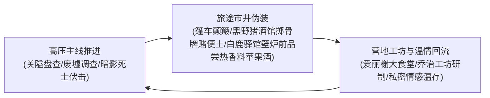

# 方案三：多日常与生活呼吸感设计方案

> **所属方案**：[00_第二部主线与世界扩充方案总纲.md](file:///home/nanhu2/comfyui/世界书/方案/第二部/主线与世界扩充方案/00_第二部主线与世界扩充方案总纲.md)  
> **核心定位**：打破单纯推主线的紧绷感，构筑大本营温情日常、工坊科技反差、旅途行商风情与深层情感私密张力。

---

## 一、 日常呼吸感的三层循环模型

在长达百章的宏篇叙事中，必须保持**“外部高压推进 ➔ 旅途伪装逗趣 ➔ 内部温情治愈”**的良性循环：

---

## 二、 营地大食堂与后方温情日常（爱丽榭核心）

爱丽榭是整个第二部最温柔的精神灯塔。她的战场不在前线刀光剑影中，而在中央篝火与热气腾腾的大炖锅旁：

### 1. 五族共融的“营地大食堂”
* **料理场景**：爱丽榭将圣亚斯特莱亚女子学院的典雅烹饪技法与森林大自然的天然馈赠完美融合——野山菌牛腩浓汤、矮人黑麦蜂蜜硬面包、烤香草岩鱼。
* **种族跨界互动趣味**：
  * **矮人多尔金与哈根**：粗鲁的矮人战士端着比脑袋还大的木碗，一边大口吸溜热汤，一边捶着桌子大喊：“舒华泽家的小姐！这麦香比我们山下的老麦酒还浓！明天俺们多挖两车铁矿给你打一口最好的平底锅！”
  * **狼人罗恩**：蹲在篝火背阴处，小心翼翼地用锋利狼爪捏起爱丽榭烤出的松软小饼干，耳朵不安地抖动：“太……太软了，一口就化了……比生肉好吃。”
  * **蜥蜴人鳞母**：从沼泽带来新鲜的香蒲根，微笑着看着年轻的族人围在篝火边向爱丽榭学习用陶罐炖煮。
* **前线归来的治愈时刻**：每当黎恩、艾德里安或雷恩风尘仆仆甚至负伤从裂隙或边境归来，无论深夜几点，大铁锅里永远煨着滚烫温热的肉汤。爱丽榭微笑着递上干净温热的白毛巾，一言不发地替哥哥抚平肩头的落尘。

---

## 三、 导力工坊与科技反差日常（乔治与亚尔缇娜）

工坊是全剧智慧、科技与精密操作的中心，同时充满生动的人格反差：

### 1. 敦厚工匠与精密战术少女的日常碰撞
* **场景氛围**：机油、松香、微热的导力晶石荧光。
* **乔治的工匠本色**：嘴唇中间永远咬着一支削尖的测绘铅笔，棕发凌乱，身穿厚帆布连体工装。一边用大扳手校准外溢阻断阀，一边爽朗地大笑：“放心吧，这层经过特种浸油处理的双层牛皮套，连一丝导力电弧都漏不出去，那些戴高帽的主教拿放大镜都看不出破绽！”
* **亚尔缇娜的反差萌**：身着黑丝长袜与整洁特务服，端正地坐在高脚凳上，以绝对理性的语调报告：“乔治学长，导力波形压缩比达 99.4%，符合潜行标准……补充说明：根据爱丽榭小姐的生理建议，您已经连续工作五小时，建议立即补充糖分。”随后，面无表情地递过去一块烤焦的小饼干。
* **战术壳的日常妙用**：“光剑（Claiomh Solais）”在战斗外被亚尔缇娜用来当搬运重型矿石的起重机、挂晾衣服的支架，甚至在夜间提供柔和的阅读光源。

---

## 四、 旅途行商与市井风情日常

离开森林进入王国腹地后的旅途细节，充满浓郁的封建风土趣味：

### 1. 长途双马篷车里的颠簸时光
* 狭窄的车厢内铺着厚羊毛毯，车轮在碎石泥泞路上发出规律的“吱呀”声；
* 黎恩靠在窗边，用磨刀石细致打磨太刀刃口，节奏平稳如同呼吸；
* 菲裹着破旧的旅行斗篷蜷缩在货箱顶上打盹，稍有风吹草动耳朵便机警地动一动；
* 雷恩与艾德里安对照着羊皮纸地图，低声核对沿途哨卡的情报，偶尔就某一处地名争论起年轻时的见闻。

### 2. 黑野猪酒馆的烟火气
* 满身油汗的佣兵大声喧哗，艾德里安熟练地掏出几枚带划痕的银克朗在橡木吧台上滑过去，与老板交换密语；
* 劳拉神情自若地坐在角落，平静地将试图搭讪的醉汉手腕轻轻一扭，让对方知难而退，随后继续细嚼慢咽自己的烤羊肉排；
* 众人就着陶土杯喝着略带酸涩的粗黑麦酒，听着酒馆盲眼琴师弹奏关于“北方魔女与白色鬼魂”的荒诞民谣，彼此相视莞尔。

---

## 五、 情感深层交流与私密张力日常

在严肃紧绷的主线之下，合理穿插人物细腻深邃的羁绊与私密互动，极大增强文本的荷尔蒙张力与人性的鲜活感：

### 1. 菲娜与黎恩：正配归宿与绝对信任
* **林间空地与静谧夜色**：在繁星点点的夜空下，菲娜将脸埋在黎恩宽阔温暖的胸膛里，感受着他沉稳的心跳。她卸下所有精灵守护者的神圣光环，展露出少女特有的甜美娇羞。
* **誓言的重量**：黎恩抚摸着她柔顺如丝的粉发，青紫色眼眸满是深情。无论身在何方，彼此的刻印是跨越时空与生死的绝对归宿。

### 2. 菲娜与乔治：工坊暗角下的雄性冲击与事后沉实
* **独处触发**：在夜深人静的工坊深处，当菲娜前来取用新注入圣光的符文石时，空气中弥漫的机油香气与微妙静电，瞬间瓦解了平日的克制；
* **敦厚大哥的雄性爆发**：平日温和随和大度的工匠学长，在充沛甚至过剩的精力驱使下，一把将身姿曼妙的菲娜圈入怀中。充满粗实与肉感力量的占有，笨拙却极具压迫感；
* **事后无微不至的善后**：激情过后，乔治迅速恢复温厚沉实，默默端来温水与柔软干净的棉布，为菲娜极其轻柔细致地擦拭打理，没有一丝推诿或内耗，充满成年男性的踏实担当。

### 3. 菲娜事后的坦白与黎恩的炽烈占有
* **娇羞汇报**：菲娜面带红晕，主动依偎在黎恩怀中，巨细靡遗地坦白亲密细节；
* **占有欲的巅峰释放**：黎恩在强烈的心理刺激与欲火升腾中，强势翻身将菲娜牢牢压制在身下，以更猛烈深沉的占有将她彻底填满，在绝对支配与被彻底依赖中完成情感闭环。

### 4. 劳拉与雷恩：剑士之誓的无声守护
* 清晨溪流边，晨曦破晓，劳拉与雷恩各自手握佩剑静立。两人无需过多言语，只是同时出剑，巨剑的厚重与晨光剑的迅捷在空气中激荡出清脆鸣响；
* 擦剑完毕，劳拉将随身携带的干粮递给雷恩，雷恩接过低声致谢。两个同样正直坚毅的灵魂，在残酷的政治风暴中找到了值得托付后背的同袍。
