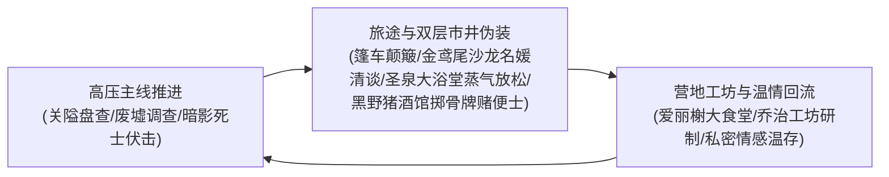
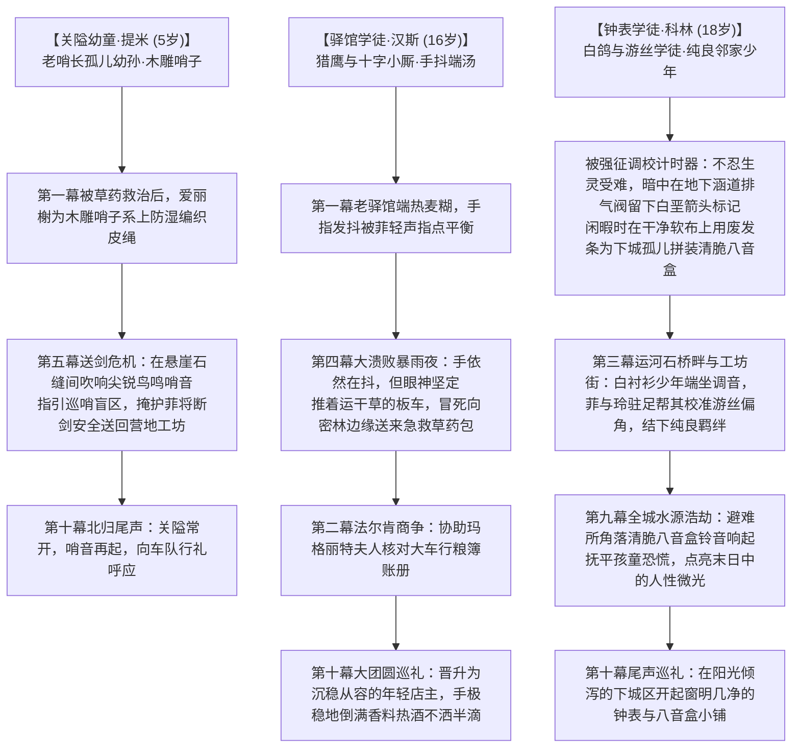

# 方案三：生活流张弛律动、营地温情后勤与工坊反差方案

> **所属方案**：[00_第二部宏篇主线总纲与方案管理中枢.md](00_第二部宏篇主线总纲与方案管理中枢.md)  
> **核心定位**：打破单纯推主线的紧绷感，构筑大本营温情日常、工坊科技反差、旅途行商风情与深层情感私密张力。

---

## 一、 日常呼吸感的三层循环模型

在长达百章的宏篇叙事中，必须保持**“外部高压推进 ➔ 旅途伪装逗趣 ➔ 内部温情治愈”**的良性循环：

---

## 二、 营地大食堂与后方温情日常（爱丽榭核心）

爱丽榭是整个第二部最温柔的精神灯塔。她的战场不在前线刀光剑影中，而在中央篝火与热气腾腾的大炖锅旁：

### 1. 五族共融的“营地大食堂”
* **料理场景**：爱丽榭将圣亚斯特莱亚女子学院的典雅烹饪技法与森林大自然的天然馈赠完美融合——野山菌牛腩浓汤、矮人黑麦蜂蜜硬面包、烤香草岩鱼。
* **种族跨界互动趣味**：
  * **矮人多尔金与哈根**：粗鲁的矮人战士端着比脑袋还大的木碗，一边大口吸溜热汤，一边捶着桌子大喊：“舒华泽家的小姐！这麦香比我们山下的老麦酒还浓！明天俺们多挖两车铁矿给你打一口最好的平底锅！”
  * **狼人罗恩**：蹲在篝火背阴处，小心翼翼地用锋利狼爪捏起爱丽榭烤出的松软小饼干，耳朵不安地抖动：“太……太软了，一口就化了……比生肉好吃。”
  * **蜥蜴人鳞母**：从沼泽带来新鲜的香蒲根，微笑着看着年轻的族人围在篝火边向爱丽榭学习用陶罐炖煮。
* **前线归来的治愈时刻**：每当黎恩、艾德里安或雷恩风尘仆仆甚至负伤从裂隙或边境归来，无论深夜几点，大铁锅里永远煨着滚烫温热的肉汤。爱丽榭微笑着递上干净温热的白毛巾，一言不发地替哥哥抚平肩头的落尘。

### 2. 王都敌后烛光与木勺的深夜守候（前线热汤与生死羁绊）
* **第四幕下城暗室的微光（爱丽榭与玲）**：在第四幕王都侦察遭遇暗影死士伏击后，玲被淬毒袖箭擦伤高烧昏迷。黎恩等人将玲护送回下城区黑野猪酒馆暗室。爱丽榭在后勤点守候，系着干净围裙端来温热的野山菌炖肉汤。爱丽榭不顾外面的宵禁与肃杀，坐在床前一勺一勺吹温肉汤喂进玲的口中，用浸湿的冷毛巾轻柔擦拭玲滚烫的额头。平日里性格骄傲带刺的紫发小恶魔少女，在半昏迷的虚弱中第一次没有推开他人，任由爱丽榭喂食，嘴唇微动发出含糊的咕哝，兄妹俩相视一眼，满室烛光驱散了冰冷的谍影寒意；
* **第七幕死牢破壁后的绝境看护（雷恩重伤）**：在第七幕王都死牢劫狱成功后，爱丽榭在奥蕾莉亚护送下在暗室后勤点接应。黎恩带着浑身浴血、重伤濒危的雷恩冲进暗室，正焦急寻找干净温水与绷带，爱丽榭系着整洁的白色围裙端出滚烫野山菌浓汤，一句“说教稍后再说，先让我把热汤喂下去”止住黎恩极度担忧的追问。爱丽榭坐在简陋床前极尽温柔耐心，用木勺舀起浓汤在唇边吹温，一勺勺小心翼翼喂给雷恩；劳拉眼圈泛红握紧雷恩的手，菲娜引导柔和圣光抚平创口、滋润受损肌理。前一刻还是生死一线的血腥破壁，下一刻便是这碗抚慰灵魂的热汤，将封建冷酷战火与Class VII家人羁绊拉升到最深沉的感动。

---

## 三、 导力工坊与科技反差日常（乔治、亚尔缇娜、法林与亚莉莎）

工坊是全剧智慧、科技与精密操作的中心，同时充满生动的人格反差：

### 1. 敦厚工匠与精密战术少女的日常碰撞
* **场景氛围**：机油、松香、微热的导力晶石荧光。
* **乔治的工匠本色**：嘴唇中间永远咬着一支削尖的测绘铅笔，棕发凌乱，身穿厚帆布连体工装。一边用大扳手校准外溢阻断阀，一边爽朗地大笑：“放心吧，这层经过特种浸油处理的双层牛皮套，连一丝导力电弧都漏不出去，那些戴高帽的主教拿放大镜都看不出破绽！”
* **亚尔缇娜的反差萌**：身着黑丝长袜与整洁特务服，端正地坐在高脚凳上，以绝对理性的语调报告：“乔治学长，导力波形压缩比达 99.4%，符合潜行标准……补充说明：根据爱丽榭小姐的生理建议，您已经连续工作五小时，建议立即补充糖分。”随后，面无表情地递过去一块烤焦的小饼干。
* **战术壳的日常妙用**：“光剑（Claiomh Solais）”在战斗外被亚尔缇娜用来当搬运重型矿石的起重机、挂晾衣服的支架，甚至在夜间提供柔和的阅读光源。

### 2. 传统矮人符文与现代工坊记账的灵性融合（法林与亚莉莎）
* **场景氛围**：松香烟气弥漫，工作台上整齐码放着细砂纸、动物胶与羊皮纸图样。法林神情肃穆，手持【黑角木符文刻杖】与纤细锋利的【附魔银刻针】（针尖嵌有一粒米粒大小的微光晶石），在厚重的矮人钢板与防酸皮革上细细刻画防蚀符文。桌旁堆着粗糙杂乱的维里迪亚边境矿石账册与领地物资流水；
* **跨文明的并肩默契**：亚莉莎端着两杯热草药茶轻步走入工坊，随手拿起鹅毛笔，运用莱恩福尔特家族严谨的复式记账法为法林重新梳理物资流向。矮人工匠惊叹于帝国现代财务逻辑的条理分明，而亚莉莎则在法林专注雕琢机巧传动轴承的飞溅火星中，重温起在RF社与工匠师傅们并肩流汗的充实感。

---

## 四、 旅途行商与市井风情日常

离开森林进入王国腹地后的旅途细节，充满浓郁的封建风土趣味：

### 1. 长途双马篷车里的颠簸时光
* 狭窄的车厢内铺着厚羊毛毯，车轮在碎石泥泞路上发出规律的木轴吱嘎声与辘辘声，暴雨敲击生牛皮顶棚提供天然的声音遮蔽；
* 黎恩靠在窗边，用磨刀石细致打磨太刀刃口，节奏平稳如同呼吸；
* 菲裹着破旧的旅行斗篷蜷缩在货箱顶上打盹，稍有风吹草动耳朵便机警地动一动；
* 雷恩与艾德里安对照着羊皮纸地图，低声核对沿途哨卡的情报，偶尔就某一处地名争论起年轻时的见闻。

### 2. 黑野猪酒馆的烟火气与长夜深谈
* 满身油汗的佣兵大声喧哗，楼下碰杯声与吟游诗人鲁特琴声构筑天然声学掩护；艾德里安熟练地掏出几枚带划痕的银克朗在橡木吧台上滑过去，与老板交换密语；
* 走廊后方暗室的薄木门板在门外重型马靴踩过石阶时微微震颤，屋内众人屏息凝神，门缝外是酒馆特有的麦芽酒与粗烟草气息；
* 劳拉神情自若地坐在角落，平静地将试图搭讪的醉汉手腕轻轻一扭，让对方知难而退，随后继续细嚼慢咽自己的烤羊肉排；
* **黎恩与朱利安的“国家之重”炉火深谈**：深夜人声散去，在壁炉微弱的红炭前，朱利安揉着负伤的肩膀坦露自责与迷茫。黎恩以同辈兼过来人的克制口吻，向朱利安分享自己在埃雷波尼亚内战中作为“灰之骑士”被国家机器推向前台的挣扎与自省——“背负一个国家的重担，最重要的不是不犯错，而是无论跌入多深的泥泞，都绝不忘记最初为何拔刀”。两个青年在昏黄火光中达成最深沉的灵魂共鸣。

### 3. 金鸢尾沙龙的名媛潜伏与上层社交闲趣（爱丽榭核心高光）
* **爱丽榭的意志与奥蕾莉亚的护航**：爱丽榭不愿只当营地受保护的弱者，利用同伴们对自己的疼爱，执拗而真挚地说服全员瞒住向来极度保护自己的黎恩；帝国顶尖大贵族奥蕾莉亚·勒瑰恩女伯爵深赏少女的担当与胆魄，换上帝国贵族常服作为名门长辈从容贴身护航潜入王都；
* **帝国名媛双星风姿与大圣徒伪装**：进入王都上城区后，亚莉莎（莱恩福尔特千金）与爱丽榭（圣亚斯特莱亚女子学院会长）在玛格丽特夫人引荐下惊艳全场。天鹅绒裙摆轻拂厚织羊毛地毯，精致银茶匙轻触细瓷茶碟。克莱门特主教在沙龙中维持着威严、慈爱、博学且关怀信众的“护国大主教”大圣徒形象，谈吐优雅；爱丽榭以一曲优美的古典竖琴和无懈可击的宫廷茶礼彻底折服开明贵妇，并出示教廷侍从私印密件，揭发异端审问厅长年暗中收集各大贵族私密底细以备勒索的险恶事实，引发整个贵妇圈对教会道德唾弃与人人自危，彻底剥离了教会的贵族社交基本盘；
* **大陪审团现实利益游说读条（3票 ➔ 5票 ➔ 7票）**：亚莉莎在二层“鸢尾暗阁”协助朱利安逐一游说各大领主：针对亨里克边境伯等农业领主，痛斥教会免税强占麦田矿山与圣殿私设苛税关卡，朱利安以大宪章法统庄严承诺战后“全面废除要塞私设税卡、依法赎回被占世俗庄园”；针对瓦卢瓦伯爵呈递十九年王室特许状底卷与机兽主齿轮等铁证，撬动封建大贵族的根本利益基石；
* **事后黑野猪暗室“兄妹修罗场”（菲娜秘传绝杀）**：待雷恩伤势稳定后，黎恩试图端起兄长与教官的严肃态度劝导爱丽榭不该涉险；爱丽榭果断执行第一部菲娜传授的秘诀——“黎恩认真训话时只要比他更委屈就好啦”，眼圈泛红、带着隐忍的泪光委屈反问“哥哥总是把危险一个人扛，根本不相信我”，面对妹妹的眼泪，沉稳的灰之骑士瞬间阵脚大乱、心疼退让；奥蕾莉亚端茶迈入淡然点拨其器量，黎恩彻底缴械认输，全班众人憋笑到浑身颤抖，构成了战前最温馨动人的一幕。

### 4. 圣泉大浴堂的蒸气闲趣与无武装接头
* **罗曼式高温水雾下的绝对放松**：在弥漫着地热硫磺与干薰衣草香气的高温白雾中，蒸汽将视线能见度压制在两步之内，倾泻石雕喷泉的巨大水声构成天然声音真空，隔着水雾屏风模糊可见巡逻侍者黑影；黎恩与朱利安卸下外装与佩剑（艾德里安在外围商会暗线策应，雷恩在黑野猪酒馆暗室静养），只披着一条粗亚麻浴巾在多阶式温水石池中舒展疲惫躯体；
* **无武装特权区域的机锋交接**：浴堂严禁携带铁器，密探与铠甲无法涉足。在咕嘟冒泡的泉水回响掩护下，众人一边享受温热泉水浸润紧绷神经的惬意，一边低声与潜入接头的高级司铎交换工坊批次元液情报，在极致的市井松弛中完成了关键战略拼图。

### 4.5 艾斯特雷亚酒庄与王宫温室的掩蔽机锋
* **酒庄地下深窖**：两米高的巨型橡木桶阵列形成天然的视线盲区，空气中弥漫着发酵葡萄醪甘甜微酸的气息；桶匠每十数分钟一次巡检铁箍的清脆敲击声，为伤员换药与情报交接提供了精准的时间安全窗口；
* **王宫琉璃温室**：热带阔叶棕榈林在半透明琉璃穹顶洒下的月光中形成深邃阴影，巡逻卫兵的钢靴声在窗外碎石路由远及近又由近及远，构成了朱利安密会时的天然时间节拍器。

### 5. 微观平民世相谱的物理物象咬合（生活史陪伴与成长）
平民角色杜绝悬浮，通过扎根封建现实的物理细节与关键动作，成为推动宏篇长卷运转的动人齿轮：

### 6. 尾声逆向长途篷车告别礼（The Long Road Home）
* 决战收官后，黎恩一行与商队同伴乘坐四轮重篷车自王都原路北上，穿行于沐浴在晨光中的王国各境：
* 在王都下城区，目睹邻家少年科林开起窗明几净、门悬风铃的钟表与八音盒小铺，身穿整洁衬衫围裙的少年腼腆招手致敬；
* 在艾斯特雷亚酒庄停驻，与换上伯爵常服的艾德里安在葡萄园中共饮当季新酒；
* 在平原商道上，目睹圣殿白鹰骑队护送满载麦粉的商队安然过境；
* 在法尔肯老驿馆的木桌前，跑堂学徒汉斯晋升为沉稳从容的年轻店主，手极稳地倒满香料热酒不洒半滴，玛格丽特夫人大笑着举起粗陶大杯结清最后的账单；
* 最终在维里迪亚关隘界标前，生铁吊栅门常开无阻，老哨长巴恩斯带着幼孙提米肃立致敬，提米在崖石上吹响尖锐鸟鸣木雕哨音向车队挥手呼应。走过曾经流血的每一步泥泞，亲眼目睹炊烟与安宁重新升起，达成 JRPG 最深邃的余韵。

---

## 五、 情感深层交流与私密张力日常

在严肃紧绷的主线之下，合理穿插人物细腻深邃的羁绊与私密互动，极大增强文本的荷尔蒙张力与人性的鲜活感：

### 1. 菲娜与黎恩：正配归宿与绝对信任
* **林间空地与静谧夜色**：在繁星点点的夜空下，菲娜将脸埋在黎恩宽阔温暖的胸膛里，感受着他沉稳的心跳。她卸下所有精灵守护者的神圣光环，展露出少女特有的甜美娇羞。
* **誓言的重量**：黎恩抚摸着她柔顺如丝的粉发，青紫色眼瞳中满是深情。无论身在何方，彼此的刻印是跨越时空与生死的绝对归宿。

### 2. 菲娜与乔治：工坊暗角下的雄性冲击与事后沉实
* **独处触发**：在夜深人静的工坊深处，当菲娜前来取用新注入圣光的符文石时，空气中弥漫的机油香气与微妙静电，瞬间瓦解了平日的克制；
* **敦厚大哥的雄性爆发**：平日温和随和大度的工匠学长，在充沛甚至过剩的精力驱使下，一把将身姿曼妙的菲娜圈入怀中。充满粗实与肉感力量的占有，笨拙却极具压迫感；
* **事后无微不至的善后**：激情过后，乔治迅速恢复温厚沉实，默默端来温水与柔软干净的棉布，为菲娜极其轻柔细致地擦拭打理，没有一丝推诿或内耗，充满成年男性的踏实担当。

### 3. 菲娜事后的坦白与黎恩的炽烈占有
* **娇羞汇报**：菲娜面带红晕，主动依偎在黎恩怀中，巨细靡遗地坦白亲密细节；
* **占有欲的巅峰释放**：黎恩在强烈的心理刺激与欲火升腾中，强势翻身将菲娜牢牢压制在身下，以更猛烈深沉的占有将她彻底填满，在绝对支配与被彻底依赖中完成情感闭环。

### 4. 劳拉与雷恩：剑士之誓的无声守护
* 清晨溪流边，晨曦破晓，劳拉与雷恩各自手握佩剑静立。两人无需过多言语，只是同时出剑，巨剑的厚重与晨光剑的迅捷在空气中激荡出清脆鸣响；
* 擦剑完毕，劳拉将随身携带的干粮递给雷恩，雷恩接过低声致谢。两个同样正直坚毅的灵魂，在残酷的政治风暴中找到了值得托付后背的剑士战友。

---

## 六、 宏大十幕生活呼吸感矩阵全景（低戏份角色专属生活切片）

为彻底打破单纯推进主线的紧绷感，避免任何角色陷入工具人化，在十幕演进中设立8组具备电影级画质与浓郁生活呼吸感的日常场景矩阵，使每一位同伴在波澜壮阔的封建变革中都拥有属于自己的温度与灵魂：

| 幕次与阶段 | 场景地点 | 核心参与角色 | 核心生活切片与微观物象 | 情感与生活呼吸感定位 |
| :--- | :--- | :--- | :--- | :--- |
| **第一幕阶段3** | 营地后方工坊 | **法林、亚莉莎** | 【黑角木符文刻杖】与【附魔银刻针】（针尖嵌米粒微光晶石）雕琢机巧轴承；鹅毛笔、莱恩福尔特复式记账法整理杂乱账册；热草药茶。 | 现代精密财务管理与古老矮人手工符文工艺的跨文明碰撞；亚莉莎找回工坊并肩流汗的充实感。 |
| **第二幕阶段4** | 营地太古秘书库 | **凯尔、玲、罗恩** | 昏黄蜂蜡烛光、羊皮纸手稿、厚重水晶单片眼镜；晃悠白袜吃黄油花饼干的紫发少女；伏地取暖的白银巨狼毛茸茸尾巴。 | 孤独学者、傲娇天才少女与忠诚巨狼的静谧书斋时光；学术破译中的陪伴与无言守护。 |
| **第二幕阶段4** | 边境森林南缘 | **亚尔缇娜、黎恩** | 巡逻声纳捕捉微弱心跳；光剑合金盾刃轻柔挑开倒刺；古栎树洞湿透纯白幼猫在战术制服领口的呼噜声；“请求编入后勤观察序列”。 | 冰冷战术特务少女的人性微光初绽；不带机质的纯真柔情。 |
| **第二幕阶段7** | 法尔肯集市与货栈 | **亚莉莎、罗恩** | 莱恩福尔特复式记账法穿透假账；月下霜银巨狼破阵粉碎粮仓纵火；狼背疾速连射；温顺俯首任由轻抚狼耳。 | 现代商业逻辑与野性忠诚守卫的完美融合；确立主角团在法尔肯的民心基石。 |
| **第六幕阶段19** | 深渊古道暗河石滩 | **黎恩、玲、罗恩、凯尔** | 避风巨型方解石与无烟行军小炉；烤硬麦饼干与肉干香气；空旷溶洞深处清澈悠扬的口琴《星之所在》；指尖纯铜机械八音盒的齿轮微音。 | 地底绝境中的精神绿洲；音乐与发条在回音壁中的共鸣，极致安宁与慰藉。 |
| **第七幕阶段23** | 王都下城黑野猪暗室 | **爱丽榭、雷恩、玲、黎恩** | 劫狱突围伤痕累累；粗瓷木勺吹温的野山菌炖肉汤；浸湿冷毛巾与细致包扎；骄傲恶魔少女与铁血老骑士在烛光下的生死温存。 | 封建黑夜谍影中的烛光温存；以家人温柔击碎冰冷心防的治愈时刻。 |
| **第九幕阶段29** | 艾斯特雷亚别邸长廊 | **黎恩、爱丽榭** | 出征前夕月下彩色铅封玻璃窗投下光斑；给微寒肩头轻覆上薰衣草羊毛加厚披肩；热气腾腾的伯爵红茶；兄妹握剑之手的轻柔托扶与凯旋誓言。 | 决战出征前的终极誓师温存；家人羁绊化作斩破黑暗的最坚固铠甲。 |
| **第十幕阶段30** | 酒庄与森林温泉 | **全员（劳拉、菲、亚莉莎、菲娜等）** | 战后光复金秋踩葡萄新酒巡礼；凯旋归家后的森林温泉女性全员终极治愈长镜头；温暖泉水洗去所有血泥与疲惫。 | 历经漫长战火后的战后余韵与绝对治愈；日式JRPG王道情感大圆满收束。 |

### 7. 矩阵设计原则与长篇叙事节律
1. **严格依附主线节奏，不喧宾夺主**：所有生活场景均卡在阶段探索、战前休整或突围后的安全屋内展开，作为张弛有度的“减压阀”，绝不在敌前紧张潜行中强行插入；
2. **严守零导力与封建器物逻辑**：场景中所出现的器物（蜂蜡烛、木质八音盒、水银温度计、羊皮纸、粗陶碗、纯铜机械盒、鹅毛笔）全部严格符合物理与封建质感，绝不出现任何违和的超时代科技；
3. **角色的微表情与动作具象化**：拒绝对话流水账，重点刻画人物习惯动作（如亚尔缇娜轻理领扣、爱丽榭吹汤匙、罗恩抖动狼耳、法林吹去石屑、玲晃动白袜），以微动作呈现生命厚度。
