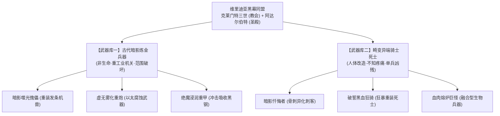
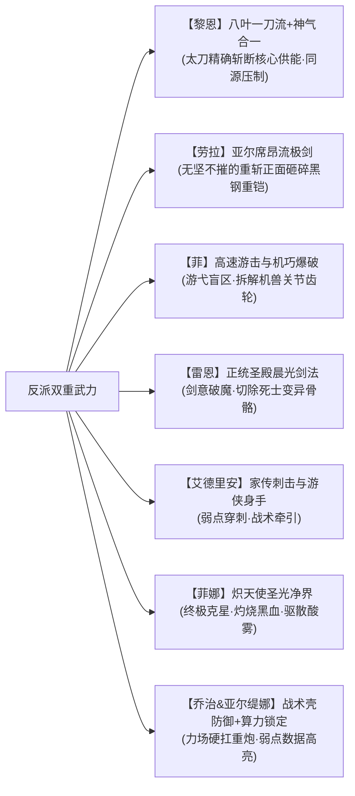

# 方案四：反派双重武力体系与战斗机制方案

> **所属方案**：[00_第二部主线与世界扩充方案总纲.md](file:///home/nanhu2/comfyui/世界书/方案/第二部/主线与世界扩充方案/00_第二部主线与世界扩充方案总纲.md)  
> **核心定位**：确立反派“古代暗影炼金兵器”与“畸变异端骑士死士”双重武力设定、战斗克制链及两大首恶权谋机制。

---

## 一、 反派双重武力体系总览

维里迪亚王国的反派集团绝非单薄的政客，他们掌控着三十一年间秘密积攒的非人道武装底牌：

---

## 二、 武器库一：古代暗影炼金兵器（机关与重火）

这些兵器基于三十一年前教廷在暗影遗迹中挖掘出的技术改造而成，依赖**“无光黑晶”**提供永动机般的动力源：

### 1. 暗影噬光傀儡（Gargoyle Automaton）
* **外形与材质**：高约三米，以铸铁与青铜齿轮咬合而成的发条机兽，头部雕刻为张开獠牙的滴水兽石雕。胸腔内封存着散发微弱紫光的黑晶核心。
* **战斗特征**：
  * 步履沉重却具有极其凶猛的扑击力，精钢巨爪能轻易撕开轻装马车；
  * 核心散发的重力场能吸附并迟滞周遭十米内的飞刃魔法与轻型箭矢；
  * 破坏方式：必须由高敏捷角色绕后，精准撬开后背散热阀，击碎核心黑晶。

### 2. 虚无雾化重炮（Corrosion Bombard）
* **外形与机制**：架设在重型四轮炮车上的八棱铜铸臼炮。内部不装填火药，而是利用气压泵喷射高压雾化的暗影炼金酸液。
* **杀伤特性**：
  * 紫黑色毒雾笼罩之处，常规钢铁武器迅速氧化酥脆，骑士甲片数秒内如腐叶般脱落；
  * 吸入肺部会引起剧烈咳嗽与咯血，是对付集群步兵与封锁要道的终极凶器；
  * 克制手段：必须依靠菲娜注入的“圣光符文石”激活金色净化光罩才能完全抵御毒雾侵蚀。

### 3. 绝魔浸润重甲（Black-Steel Phalanx）
* **武装配备**：阿达尔伯特手下最精锐的亲卫“铁誓旗队”专属。
* **特性**：用掺杂了暗影废渣的重钢锻造出的全身板甲，表面粗糙无光，能将受到的重型战技、剑风与魔法冲击分散传导至地下，常规劈砍难以破防。

---

## 三、 武器库二：畸变异端骑士死士（人体改造恶魔）

克莱门特三世假借“神圣救赎”名义，在圣殿大要塞最底层的秘密地牢对异己分子、濒死重罪犯施行的非人道生物改造：

### 1. 暗影忏悔者（Shadow Penitents）
* **生理变异**：身形被药剂强制拉长，皮肤呈现惨白的死灰色，双眼被麻布死死缝死，完全依靠听觉与热量追踪猎物。
* **战力表现**：手指指节异化为一尺长的角质骨刺，行动极其迅捷且无声无息；痛觉神经已被完全切断，即使被利刃贯穿胸腔依然能疯狂反扑。
* **自爆机制**：濒死时体内核心黑血急剧发热，自爆化作腐蚀性血雨，极具同归于尽的自杀威慑力。

### 2. 破誓黑血狂骑（Black-Blood Berserkers）
* **生理变异**：曾是身强体壮的骑士，注射高浓度暗影血清后，肌肉膨胀至常人两倍，血管如黑色蚯蚓般在皮下暴起蠕动。
* **战力表现**：手持双手巨斧，挥舞如风；中刀不流红血，伤口由涌出的黑色粘液迅速封堵止血。进入狂暴状态时不知疲倦，能生生徒手撕碎战马。

---

## 四、 主角团各司其职的战斗克制链

在面对如此残酷的复合武装时，主角团绝不能依靠单打独斗，必须展现出如轨迹系列般精密的战术配合美学：

1. **菲娜（绝对克星与净化源泉）**：炽天使圣光具有至高净化权柄。金光扫过之处，黑血死士体内狂暴的污秽被瞬间蒸发为白烟，失去再生动能；圣光光环更能在地面形成安全绿洲，中和雾化重炮的酸性。
2. **黎恩（斩断核心的终极锋芒）**：黎恩体内流淌着经过救赎升华的澄澈鬼之力，对“无光黑晶”拥有天然的共鸣感知。他的疾风之刃能精准越过重甲防御，一刀切断黑晶与构装傀儡的传动神经。
3. **劳拉（正面破阵的钢铁壁垒）**：劳拉手持大剑，施展亚尔席昂流绝技。任凭黑钢浸润甲如何吸收冲击，劳拉纯粹至极的剑意能引发由内而外的共振，将绝魔重甲与内部骨架直接震裂。
4. **雷恩（圣殿正统的道义审判）**：雷恩的佩剑闪耀着清澈的晨光之誓。他的剑专克同门背叛者的异化武艺，在不取其性命的前提下挑断畸变神经，给予受害者最后的解脱。
5. **菲（战场幽灵的致命拆解）**：在重火器咆哮的缝隙中，菲依靠前猎兵特有的绳索摆荡与滑铲，在傀儡脚边安放定向破拆炸药，摧毁其行进机构。
6. **乔治与亚尔缇娜（攻防一体的工程底牌）**：乔治研制的“战术壳防护力场”如同不可逾越的叹息之壁，顶住重炮轰击；亚尔缇娜通过测算目镜，将敌方机体金属疲劳点与黑晶管路坐标实时标示在黎恩与劳拉的战术目镜中。

---

## 五、 双首恶的政治权谋与出招节奏

反派并非只知蛮干的怪物，他们的权谋手段步步紧逼：

1. **第一波出招：舆论定罪与关卡锁喉（阶段二~三）**
   * 阿达尔伯特利用边境戒严，将雷恩宣判为“潜逃境外引渡犯”，悬赏千枚金币；
   * 克莱门特控制各地讲道台，宣称“北方森林瘴气外溢，携带妖物进犯”，煽动平民敌视。
2. **第二波出招：断尾绝杀与诱敌深入（阶段四~五）**
   * 发现艾德里安在旧领调查，主教故意放出部分假档案，引诱调查队进入暗影地窟，启动噬光傀儡实施坑杀；
   * 圣殿派出受蒙骗的年轻骑兵作为棋子耗材，逼迫雷恩背负“同门相残”的道德枷锁。
3. **第三波出招：全面戒严与异化清洗（阶段七~八）**
   * 面对双线证据闭环，两大首恶撕下伪善假面，动用破誓黑血狂骑与重炮军团包围白鹿驿馆；
   * 软禁埃德蒙国王，架空朱利安王子，企图通过制造“突发政变与异端屠城”彻底掩盖历史真相。
