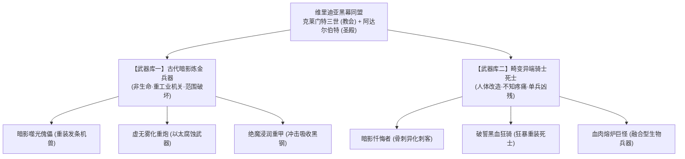
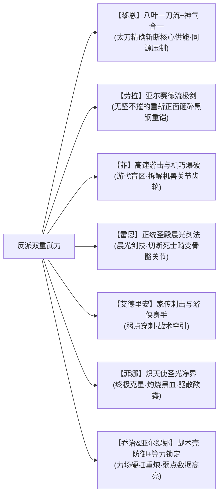

# 方案四：反派双重武力体系与战斗机制方案

> **所属方案**：[00_第二部主线与世界扩充方案总纲.md](file:///home/nanhu2/comfyui/世界书/方案/第二部/主线与世界扩充方案/00_第二部主线与世界扩充方案总纲.md)  
> **核心定位**：确立反派“古代暗影炼金兵器”与“畸变异端骑士死士”双重武力设定、战斗克制链及两大首恶权谋机制。

---

## 一、 反派双重武力体系总览

维里迪亚王国的反派集团掌控着三十一年间秘密积攒的非人道武装底牌：

```mermaid
graph TD
    Boss["维里迪亚黑幕同盟<br/>克莱门特三世 (教会) + 阿达尔伯特 (圣殿)"]
    
    Boss --> Tech["【武器库一】古代暗影炼金兵器<br/>(非生命·重工业机关·范围破坏)"]
    Boss --> Bio["【武器库二】畸变异端骑士死士<br/>(人体改造·不知疼痛·单兵凶残)"]
    
    Tech --> T1["暗影噬光傀儡 (重装发条机兽)"]
    Tech --> T2["虚无雾化重炮 (以太腐蚀武器)"]
    Tech --> T3["绝魔浸润重甲 (冲击吸收黑钢)"]

    Bio --> B1["暗影忏悔者 (骨刺异化刺客)"]
    Bio --> B2["破誓黑血狂骑 (狂暴重装死士)"]
    Bio --> B3["血肉熔炉巨怪 (融合型生物兵器)"]
```

---

## 二、 武器库一：古代暗影炼金兵器（机关与重火）

这些兵器基于三十一年前教廷在暗影遗迹中挖掘出的技术改造而成，依赖**“无光黑晶”**提供永动机般的动力源：

### 1. 暗影噬光傀儡（Gargoyle Automaton）
* **外形与材质**：高约三米，以铸铁与青铜齿轮咬合而成的发条机兽，头部雕刻为张开獠牙的滴水兽石雕。胸腔内封存着散发微弱紫光的黑晶核心。
* **战斗特征**：
  * 步履沉重却具有极其凶猛的扑击力，精钢巨爪能轻易撕开轻装马车；
  * 核心散发的重力场能吸附并迟滞周遭十米内的飞刃魔法与轻型箭矢；
  * 破坏方式：必须由高敏捷角色绕后，精准撬开后背散热阀，击碎核心黑晶。

### 2. 虚无雾化重炮（Corrosion Bombard）
* **外形与机制**：架设在重型四轮炮车上的八棱铜铸臼炮。内部不装填火药，而是利用气压泵喷射高压雾化的暗影炼金酸液。
* **杀伤特性**：
  * 紫黑色毒雾笼罩之处，常规钢铁武器迅速氧化酥脆，骑士甲片数秒内如腐叶般脱落；
  * 吸入肺部会引起剧烈咳嗽与咯血，是对付集群步兵与封锁要道的终极凶器；
  * 克制手段：必须依靠菲娜注入的“圣光符文石”激活金色净化光罩才能完全抵御毒雾侵蚀。

### 3. 绝魔浸润重甲（Black-Steel Phalanx）
* **武装配备**：阿达尔伯特手下最精锐的亲卫“铁誓旗队”专属。
* **特性**：用掺杂了暗影废渣的重钢锻造出的全身板甲，表面粗糙无光，能将受到的重型战技、剑风与魔法冲击分散传导至地下，常规劈砍难以破防。

---

## 三、 武器库二：畸变异端骑士死士（人体改造恶魔）

克莱门特三世假借“神圣救赎”名义，在圣殿大要塞最底层的秘密地牢对异己分子、濒死重罪犯施行的非人道生物改造：

### 1. 暗影忏悔者（Shadow Penitents）
* **生理变异**：身形被药剂强制拉长，皮肤呈现惨白的死灰色，双眼被麻布死死缝死，完全依靠听觉与热量追踪猎物。
* **战力表现**：手指指节异化为长达三十公分的角质骨刺，行动极其迅捷且无声无息；痛觉神经已被完全切断，即使被利刃贯穿胸腔依然能疯狂反扑。
* **自爆机制**：濒死时体内核心黑血急剧发热，自爆化作腐蚀性血雨，极具同归于尽的自杀威慑力。

### 2. 破誓黑血狂骑（Black-Blood Berserkers）
* **生理变异**：曾是身强体壮的骑士，注射高浓度暗影血清后，肌肉膨胀至常人两倍，血管如黑色蚯蚓般在皮下暴起蠕动。
* **战力表现**：手持双手巨斧，挥舞如风；中刀不流红血，伤口由涌出的黑色粘液迅速封堵止血。进入狂暴状态时不知疲倦，能生生徒手撕碎战马。

---

## 四、 主角团各司其职的战斗克制链

在面对如此残酷的复合武装时，主角团绝不能依靠单打独斗，必须展现出如轨迹系列般精密的战术配合美学：

```mermaid
graph LR
    Enemy["反派双重武力"]
    
    Rean["【黎恩】八叶一刀流+神气合一<br/>(太刀精确斩断核心供能·同源压制)"]
    Laura["【劳拉】亚尔赛德流极剑<br/>(无坚不摧的重斩正面砸碎黑钢重铠)"]
    Fie["【菲】高速游击与机巧爆破<br/>(游弋盲区·拆解机兽关节齿轮)"]
    Renne["【雷恩】正统圣殿晨光剑法<br/>(晨光剑技·切断死士畸变骨骼关节)"]
    Adrian["【艾德里安】家传刺击与游侠身手<br/>(弱点穿刺·战术牵引)"]
    Sera["【菲娜】炽天使圣光净界<br/>(终极克星·灼烧黑血·驱散酸雾)"]
    GeorgeAlt["【乔治&亚尔缇娜】战术壳防御+算力锁定<br/>(力场硬扛重炮·弱点数据高亮)"]

    Enemy --> Rean
    Enemy --> Laura
    Enemy --> Fie
    Enemy --> Renne
    Enemy --> Adrian
    Enemy --> Sera
    Enemy --> GeorgeAlt
```

1. **艾德里安（血仇审判与手刃机兽核心的主攻手）**：手持艾斯特雷亚家传刺剑，深谙家族机关建筑构造。在菲的高速游击配合下，艾德里安以精准狠辣的弱点穿刺直接破坏终极发条机兽的动力黑晶与中枢发条，亲手完成物理斩首与家仇正名！
2. **雷恩（破誓救赎与骑士团军魂唤醒者）**：手持重盾与长剑，以正统晨光剑法迎击阿达尔伯特。雷恩的战法不在于杀戮同袍，而在于“断刃与破防”——在大要塞校场当众一击挑断大团长佩剑，出示绝笔遗训，唤醒全团骑士中立停火。
3. **黎恩与菲娜（超自然灾害防火墙与平民护盾）**：严格遵循外部力量不干涉内政原则。黎恩以澄澈鬼之力压制地脉引力坍缩与虚无黑晶同源波动，菲娜以炽天使圣光净界中和雾化重炮与死士自爆的强酸剧毒，为广场万民与大陪审团撑开绝对安全的物理结界，绝不抢夺本土主角的复仇与审判权。
4. **劳拉（正面破阵的钢铁壁垒与地牢破铠）**：劳拉手持大剑施展亚尔赛德流绝技。任凭黑钢浸润甲如何吸收冲击，劳拉刚猛沉重的巨剑重劈足以正面破防。在第五幕死牢决战中，劳拉手持重铸新生大剑，正面硬撼典狱长莫尔茨六十磅狼牙破甲锤的暴虐下劈，一剑斩碎其生铁碎颅重铠，彻底瓦解圣殿最凶悍的暴力看守。
5. **菲（战场幽灵的致命拆解）**：在重火器咆哮的缝隙中，菲依靠前猎兵特有的绳索摆荡与滑铲，在机兽傀儡死角安放定向破拆炸药，精准剥离外层护甲，为艾德里安制造绝杀契机。
6. **乔治与亚尔缇娜（攻防一体的工程底牌）**：乔治研制的“战术壳防护力场”如同叹息之壁顶住重炮轰击；亚尔缇娜通过测算目镜将机体金属疲劳点与黑晶管路坐标实时标示给全队。

---

## 五、 双首恶与爪牙的权谋出招节奏（利益分肥同盟实质）

维里迪亚反派阵营并非铁板一块，亦非上下级统属——**晨光教廷对圣殿骑士团没有任何法定指挥权，二者本质是长达数十年的利益分肥与互相制约同盟（狼狈为奸）**。他们的权谋手段步步紧逼：

1. **第一波出招：上位者冷漠交办与关卡清洗（阶段二~三）**
   - **大团长的上位者冷漠**：边境剑痕报告送达大要塞长桌，阿达尔伯特随手拨开，甚至不屑过问底层姓名，冷漠指令典狱长莫尔茨“去翻关隘花名册，查清谁在关前放行直接押回水牢，把第七号死牢收拾干净”；
   - **莫尔茨暴虐缉捕**：莫尔茨调阅军籍突袭关隘，将老哨长瓦尔特·巴恩斯强行戴枷押入底层黑铁水牢，当着老副团长戈德弗里的面施以断骨重刑；
   - **达米安边境灭口**：异端审问厅达米安冷酷下达流民营焚营令，凭借解毒药渣线索一路咬尾追踪。
2. **第二波出招：断尾绝杀与诱敌深入（阶段四~五）**
   - 发现艾德里安在旧领调查，主教故意放出部分假档案，引诱调查队进入暗影地窟，启动噬光傀儡实施坑杀；
   - 圣殿派出受蒙骗的年轻骑兵作为棋子耗材，逼迫雷恩背负“同门相残”的道德枷锁。
3. **第三波出招：合流围剿与借病政变（阶段七~十）**
   - 面对双线证据闭环，两大首恶联合出动死士与重装骑兵围攻白鹿驿馆，击断劳拉巨剑；莫尔茨亲自踏上吊桥以带刺生铁重枷锁死断后的雷恩；
   - 借题发挥宣称流民刺客谋刺、老国王重病谵妄，启动《战时统帅令》软禁老国王埃德蒙，全境通缉主角团。
4. **第四波出招：同盟破裂、勒索失效与断剑殉道（阶段二十）**
   - 圣殿校场对决，雷恩挑断阿达尔伯特佩剑，基层骑士全员低垂佩剑拒不听命；
   - 教廷密使手持二十年利益分肥密约上台歇斯底里勒索，企图逼迫阿达尔伯特调动铁骑封锁全城；
   - 阿达尔伯特认输自绝权力，交出通往私人祈祷室暗格的黑铁钥匙（起获前任团长绝笔与克莱门特灭口手令）；随后失控机兽突入扑杀老副团长，阿达尔伯特手持半截断佩剑舍命楔入机兽核心齿轮殉道战死，全团在卢卡斯率领下宣布绝对中立！

