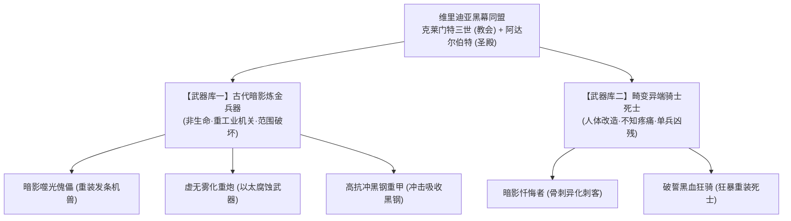
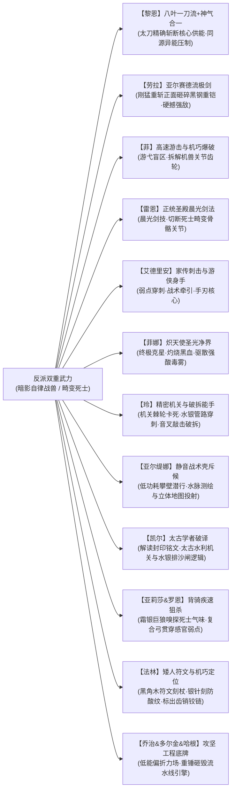

# 方案四：反派双重武装底牌、战斗克制链与黑幕权谋博弈方案

> **所属方案**：[00_第二部宏篇主线总纲与方案管理中枢.md](00_第二部宏篇主线总纲与方案管理中枢.md)  
> **核心定位**：确立反派“古代暗影炼金兵器”与“畸变异端骑士死士”双重武力设定、战斗克制链及两大首恶权谋机制。

---

## 一、 反派双重武力体系总览

维里迪亚王国的反派集团掌控着三十一年间秘密积攒的非人道武装底牌：

---

## 二、 武器库一：古代暗影炼金兵器（机关与重火）

这些兵器基于三十一年前教廷在暗影遗迹中挖掘出的技术改造而成，依赖**“无光黑晶”**提供永动机般的动力源：

### 1. 暗影噬光傀儡（Gargoyle Automaton）
* **外形与材质**：高约三米，以铸铁与青铜齿轮咬合而成的发条机兽，头部雕刻为张开獠牙的滴水兽石雕。胸腔内封存着散发微弱紫光的黑晶核心。
* **战斗特征**：
  * 步履沉重却具有极其凶猛的扑击力，精钢巨爪能轻易撕开轻装马车；
  * 核心散发的重力场能吸附并迟滞周遭十米内的飞刃魔法与轻型箭矢；
  * 破坏方式：必须由高敏捷角色绕后，精准撬开后背散热阀，击碎核心黑晶。

### 2. 虚无雾化重炮（Corrosion Bombard）
* **外形与机制**：架设在重型四轮炮车上的八棱铜铸臼炮。内部不装填火药，而是利用气压泵喷射高压雾化的暗影炼金酸液。
* **杀伤特性**：
  * 紫黑色毒雾笼罩之处，常规钢铁武器迅速氧化酥脆，骑士甲片数秒内如腐叶般脱落；
  * 吸入肺部会引起剧烈咳嗽与咯血，是对付集群步兵与封锁要道的终极凶器；
  * 克制手段：必须依靠菲娜注入的“圣光符文石”激活金色净化光罩才能完全抵御毒雾侵蚀。

### 3. 高抗冲黑钢重甲（Black-Steel Phalanx）
* **武装配备**：教廷秘库重装死士与高级机兽外部挂甲专属（圣殿正规骑士统一着传统重装生铁板甲）。
* **特性**：用掺杂了暗影废渣的高强度黑钢锻造出的厚重装甲，表面粗糙无光，能将受到的重型战技冲击与钝击震颤分散传导，常规劈砍极难破防。

---

## 三、 武器库二：畸变异端死士体系（教廷暗箱人体改造）

克莱门特三世假借“神圣救赎”名义，在王都晨光大教堂地下的【教廷秘库】、维克托地下工坊及艾斯特雷亚堡【暗影地窟】中（严禁圣殿插手，完全由异端审问厅掌控），秘密施行的非人道生物改造：

### 1. 暗影忏悔者（Shadow Penitents）
* **兵源构成**：异端审问厅秘密抓捕的流民、重罪犯与被指控为异端的平民。
* **生理变异**：身形被药剂强制拉长，皮肤呈现惨白的死灰色，双眼被麻布死死缝死，完全依靠听觉与热量追踪猎物。
* **战力表现**：手指指节异化为长达三十公分的角质骨刺，行动极其迅捷且无声无息；痛觉神经已被完全切断，即使被利刃贯穿胸腔依然能疯狂反扑。
* **自爆机制**：濒死时体内核心黑血急剧发热，自爆化作腐蚀性血雨，极具同归于尽的自杀威慑力。

### 2. 破誓黑血狂骑（Black-Blood Berserkers）
* **兵源渊源与教廷暗箱**：原为十四年间因抗命、同情平民或违背教廷意志而被圣殿除籍流放、或由教廷借“宗教法庭羁押”暗箱引渡的年轻精锐骑士。
  - **大团长的认知盲区**：大团长阿达尔伯特本质上保留着老骑士的高傲自尊，极度鄙视教会暗中搞肮脏实验（听闻也仅是皱眉嫌恶心，虽想过搜证削弱教会，但教会滴水不漏且此事既未涉及要塞核心利益又吃力不讨好，终未深究；他心底深处始终不忍杀害曾一同立誓的骑士同伴，以为十四年间被除名的异己只是在偏远修道院苦修苦役）；
  - **比死亡更可怕的活体残害**：克莱门特瞒着圣殿，避开阿达尔伯特眼线，将这批体格强健的骑士送入地下秘库施加了比死亡残酷千百倍的黑血实验，彻底剥离神智改造成只听命于教廷的狂暴杀戮兵器；
* **生理变异与战力**：肌肉膨胀至常人两倍，体表黑血如粗缆般在皮下剧烈搏动；手持双手巨斧挥舞如风，中刀不流红血，伤口由涌出的黑色粘液迅速封堵止血，甚至断肢也能在剧烈狂暴状态下短时间内再生，正面阵地撕裂力极其恐怖；
* **主线关键心路暴击**：在第四幕白鹿大驿馆围城暴雨中，教廷达米安暗中投入黑血狂骑参战；压阵的大团长阿达尔伯特在泥泞中亲眼目睹其断肢异化与皮下流淌的黑粘液，并从剥落臂甲下骇然瞥见圣殿骑士专属的手腕誓约烙印，遭受第一重灵魂层面的惊疑暴击；这直接促使他在石桥上决然拔剑震开达米安、将雷恩强行扣入圣殿死牢保护起来。最终在第十幕校场上，教廷特使言语摊牌彻底证实了狂骑真相，成为击穿阿达尔伯特最后自欺欺人、促成其断剑卡死机兽以命殉道的终极推力。

---

## 四、 主角团各司其职的战斗克制链

在面对如此残酷的复合武装时，主角团绝不能依靠单打独斗，必须展现出如轨迹系列般精密的战术配合美学：

1. **艾德里安（血仇审判与手刃机兽核心的主攻手）**：手持艾斯特雷亚家传刺剑，深谙家族机关建筑构造。在菲的高速游击配合下，艾德里安以精准狠辣的弱点穿刺直接破坏终极发条机兽的动力黑晶与中枢发条，亲手完成物理斩首与家仇正名！
2. **雷恩（破誓救赎与骑士初心誓约唤醒者）**：手持重盾与长剑，以正统晨光剑法迎击阿达尔伯特。雷恩的战法不在于杀戮昔日骑士，而在于“断刃与破防”——在大要塞校场当众一击挑断大团长佩剑，迫使其交出绝密钥匙赎罪殉道，唤醒全团骑士重践晨光誓言挺进平暴救民。
3. **黎恩与菲娜（超自然灾害防火墙与平民护盾）**：严格遵循外部力量不干涉内政原则。黎恩以澄澈鬼之力压制地脉引力坍缩与虚无黑晶同源波动，菲娜以炽天使圣光净界中和雾化重炮与死士自爆的强酸剧毒，为广场万民与大陪审团撑开绝对安全的物理结界，绝不抢夺本土主角的复仇与审判权。
4. **劳拉（正面破阵的钢铁壁垒与地牢破铠）**：劳拉手持大剑施展亚尔赛德流绝技。任凭黑钢浸润甲如何吸收冲击，劳拉刚猛沉重的巨剑重劈足以正面破防。在第七幕死牢决战中，劳拉手持重铸新生大剑，正面硬撼典狱长莫尔茨六十磅狼牙破甲锤的暴虐下劈，一剑斩碎其生铁碎颅重铠，为十四年前雷恩惨遭其亲手烙印放逐与老骑士们的十四年血泪彻底雪耻，彻底瓦解圣殿最凶悍的暴力看守。
5. **菲（战场幽灵的高速致命拆解）**：在重火器咆哮的缝隙中，菲依靠前猎兵特有的绳索摆荡与滑铲，在机兽傀儡死角安放定向破拆炸药，精准剥离外层护甲，为艾德里安制造绝杀契机。
6. **玲（精巧机关与精密破拆手）**：在零导力环境下完全依靠纯机械机关原理。玲携带特制纯铜微型撬棍、游标卡尺与精密测音音叉，通过轻敲机兽外壳倾听金属回音，在数秒内辨析出发条内部受力与传动弱点；利用反向卡死棘轮与水银细管穿刺，破坏机兽平衡传动阀，使其陷入自锁瘫痪，成为机械敌人的噩梦。
7. **法林（机巧弱点定位与防蚀符文附魔）**：手持【黑角木符文刻杖】与纤细锋利的【附魔银刻针】（针尖嵌有一粒米粒大小的微光晶石），在战甲与武器刃口精细刻画防酸抗蚀符文，化解虚无雾化酸液的即时腐蚀；在攻坚战斗中作为“结构破绽定位者”，以微光探针精准指出机兽护甲接缝处的传动齿销与铰链死穴，引导大剑与刺剑精准破坏，杜绝任何徒手硬拆的不合理表现。
8. **亚尔缇娜（静音潜行侦察与立体地图测绘）**：操控战术壳“光剑（Claiomh Solais）”进入低功耗“攀壁静音形态”，充当地底潜行与敌后刺探的隐形斥候。利用特制回声装置探测溶洞盲区与地下水网流势，在黑暗中投射出悬浮的立体水网结构图，实时为全队标示伏兵分布与结构承重柱。
9. **凯尔（古代符文破译与水网机关解码）**：戴着水晶单片眼镜迅速破译深渊古道与太古水利设施的古文字警语，解开太古盲泉蓄洪排沙主闸的配重水银齿轮逻辑，逆转水流阻绝敌方追兵。
10. **亚莉莎与罗恩（背骑疾速连射与气味寻踪猎杀）**：亚莉莎施展莱恩福尔特家传的战术复合弓箭术，与化为白银巨狼的罗恩组成高机动猎杀组合。罗恩在暗河与溶洞深处凭借惊人嗅觉锁定暗影死士的黑血与机油气味，在复杂地形间狂暴穿梭；亚莉莎伏于狼背上稳定搭箭，射出破甲破障重箭，精准贯穿暗影忏悔者的听觉耳膜与行动肌腱。
11. **乔治、多尔金与哈根（攻坚工程底牌与工坊破拆）**：乔治研制的“战术壳低能偏折力场”在关键时刻偏转流弹与近防重火器；矮人兄弟精通锻造与重型机械。在第八幕奇袭维克托地下秘密工坊的Boss战中，哈根以太古图纸锁定主供能管路，玲指出魔导发条流水线的传动死穴，配合艾德里安击碎其左腕控驭手环、多尔金重锤砸毁动力引擎，彻底切断教廷量产自律战兽的后备产能！

---

## 五、 双首恶与爪牙的权谋出招节奏（利益分肥同盟实质）

维里迪亚反派阵营并非铁板一块，亦非上下级统属——**晨光教廷对圣殿骑士团没有任何法定指挥权，二者本质是长达数十年的利益分肥与互相制约同盟（狼狈为奸）**。在十幕宏篇演进中，他们的权谋手段呈现层层递进的七波反扑：

1. **第一波出招：上位者冷漠交办与关卡暗查（第一幕·阶段1~3）**
   - **大团长的上位者冷漠与家法暗查**：边境剑痕报告送达大要塞长桌，阿达尔伯特随手拨开，甚至不屑过问底层姓名，冷漠指令典狱长莫尔茨“去翻关隘花名册，查清谁在关前放行直接押回水牢，把第七号死牢收拾干净”。**反派严令封锁消息、绝不公然通缉**，因十四年前雷恩是“秘密放逐”，一旦大张旗鼓搜捕，圣殿内部同情旧案的老骑士与王室便会借机追查当年惨案真相；
   - **莫尔茨暴虐缉捕**：莫尔茨调阅军籍突袭关隘，将老哨长瓦尔特·巴恩斯强行戴枷押入底层黑铁水牢，当着老副团长戈德弗里的面施以带刺生铁重枷与皮鞭严刑拷问；
   - **达米安边境灭口**：异端审问厅达米安冷酷下达流民营焚营令以遮掩暗影废渣外溢，凭借解毒药渣线索一路咬尾追踪。
2. **第二波出招：商道截断与商战绞杀（第二幕·阶段7）**
   - **教廷特许商会垄断封锁**：达米安发现法尔肯市井暗中流传优质止血药剂与精铁器皿，敏锐察觉有外部物资注入。教廷随即指使代理人罗曼商行联合圣殿税卡，下达严苛的货税倍增令与特许查扣令，恶意扣押迷迭香商行的南境商队，并雇佣暗巷地痞与私兵企图洗劫大车行货栈；
   - **以经济命脉扼杀反抗萌芽**：企图通过垄断粮食配额与扣压行商，逼迫法尔肯镇民交出私藏流民，切断主角团的后勤通道。
3. **第三波出招：断尾绝杀与诱敌深入（第二幕·阶段4~6）**
   - **商会伪装下的信息盲区**：艾德里安以北方商会合法文书为伪装，反派最初只当成零星盗匪与商业摩擦；
   - **旧领地窟坑杀**：发现有人在旧领调查，主教故意放出部分假档案，引诱调查队进入暗影地窟，启动噬光傀儡与封印十九年的暗影畸变体实施坑杀；
   - 圣殿派出受蒙骗的年轻骑兵作为棋子耗材，逼迫雷恩背负“同门相残”的道德枷锁；
   - **情报拼图合拢**：迷雾海港走私货栈被破、教廷洗钱暗账被劫，与旧领、修道院情报汇合，达米安猛然惊觉这是一场针对三十年暗影实验与灭门案的精准复仇，杀意骤起。
4. **第四波出招：合流围剿与借病政变（第四幕·阶段12~14）**
   - 面对三线证据闭环，两大首恶联合出动死士与数千重装铁骑围攻白鹿大驿馆；驿馆内部为逼仄狭窄的石木回廊与庭院，大开大合战技受限；
   - **人道善意与战斗枷锁**：雷恩温和恳求尽量留年轻受蒙骗骑兵一条生路，主角团默契地仅以剑脊击打、鞘击与瞬步卸除骑兵武装；而达米安驱使的异化死士招招自爆换命、毫无顾忌，主角团“戴着仁慈与道义的枷锁”陷入战术苦战；
   - **平民人质牵制与守护之仁折剑**：达米安在后方冷血驱使死士在滞留马夫与平民杂工中释放酸雾，黎恩与菲娜大部分气力被维持防护与疏散平民牵制；攻城战兽狂暴挥下重锤伴随高压剧毒黑酸喷溅，为了护住身后负伤同伴与避难平民，劳拉舍身正面横剑硬撼；重击震荡与剧毒黑酸同时爆发，星银百锻名刃悲鸣崩裂断折，劳拉脏腑受创吐血。巨剑折断源于崇高的“守护之仁”与狭窄地形，绝非剑术不敌；
   - **战略人质与水牢沉重交锋**：石桥断后雷恩力竭，达米安欲枭首灭口，阿达尔伯特冷冽震开其剑锋扣押雷恩。大团长既因十四年负罪感，更因需将雷恩留作防备教廷反噬的“战略人质”；在幽暗水牢中，阿达尔伯特隔着生铁栅栏看着浑身是伤却眼神平静的雷恩，声音干涩疲惫：“十四年了……你的眼神还是一点没变啊，雷恩。……你觉得当年是我出卖了修会？还是出卖了你？……可如果那时候我不向教会低头，不在克莱门特的协议上盖印——要塞里那几千个年轻骑兵，第二天连口粮和津贴都见不到。教会只要断了粮运、扣上一顶异端的罪名，整座圣殿十四年前就该垮了。……别把这世道想得太干净了。握剑的手……怎么可能不沾泥水。”
   - 借题发挥宣称流民刺客谋刺、老国王重病谵妄，启动《战时统帅令》强除禁军武装，软禁老国王埃德蒙，全境血色通缉主角团。
5. **第五波出招：深渊古道水闸绝杀与伏击（第六幕·阶段18~20）**
   - **暗河封锁与盲眼地底兽驱赶**：得知主角团借道地下溶洞水网企图潜渡王都，达米安指使暗影死士利用黑血药剂驱赶栖息在地底深渊的盲眼巨蜥与洞穴毒蛛封堵溶洞峡口；
   - **太古排沙闸水银绞盘死锁**：在古代蓄洪排沙主闸灌注水银死锁发条，企图引太古盲泉急流彻底淹没地下古道，将潜入者全数溺毙在喀斯特暗河之中。
6. **第六波出招：沙龙暗控、工坊赶工与御前决斗破产（第八幕·阶段24~26）**
   - 面对死牢被破、雷恩被救，克莱门特主教在金鸢尾沙龙维持着威严慈爱的“护国大主教”大圣徒伪装，以免税与封地许诺拉拢开明贵族，并严令维克托·格拉斯在地下工坊赶制自律战兽；爱丽榭出示主教侍从私印密件揭发教会勒索贵族隐私，亚莉莎出示偷税洗钱账册，朱利安以大宪章法统庄严承诺废除私设税卡、依法赎回被占世俗庄园，大陪审团呈现 3 ➔ 5 ➔ 7 票坚实倒戈读条；
   - **惊慌赶工的破绽与维克托技术自尊瓦解**：克莱门特的恐慌催工造成地下工坊过载，被主角团抓住排烟冷却盲区奇袭捣毁，维克托被俘。维克托本自恃精湛技艺拒不配合，矮人哈根直接将机兽断裂的主轴齿轮砸在他面前，指着图纸痛骂其“连传动反向棘轮都抄错了三道弧度，机械咬合拙劣连矿坑学徒都不如”。维克托在自身狂热信仰的工程领域遭遇专业毁灭性打击，自尊崩溃全盘招供，自律战兽产能被物理彻底切断；
   - **达米安与阿达尔伯特的军政相轻激化**：异端审问官达米安主张在全城实行残酷宵禁连坐与暗杀，阿达尔伯特极度鄙夷这种见不得光的特务行径并严拒圣殿铁骑介入脏活，双方在指挥室内数次按剑冷眼对峙，内部裂痕无法弥合；
   - 企图在十字竞技场公开宣布雷恩等人为死罪异端，启动宗教裁判；竞技场御前仲裁中雷恩一招挑飞异端审问厅首席裁决剑士佩剑完胜，老国王埃德蒙亲临宣读十八年黑账，大陪审团贵族全面倒戈；
   - **首恶同盟当众决裂**：克莱门特企图逼迫阿达尔伯特调动铁骑封门血洗全场大贵族；阿达尔伯特恪守封建法统与骑士明面声誉，冷言拒绝为其丑闻陪葬，两大反派当众彻底决裂！克莱门特狂怒退入地下。
7. **第七波出招：穷途末路投毒、冷血封城、断剑殉道与首恶伏诛（第九幕~第十幕·阶段27~30）**
   - 丧失全部政治退路的克莱门特孤注一掷，向王都下水道源头倾倒纯度最高的暗影原液，释放全部储备死士与过载发条战兽，企图拉全城万民玉石俱焚；
   - **冷血自保的封城铁幕**：阿达尔伯特为防暴民冲击圣殿要塞、保全骑士团私兵，下达《战时全城关防封死令》，九座大门封死，反将数十万平民关入铁笼，在基层引发剧烈道义地震；
   - **断剑殉道雪耻**：第十幕圣殿校场断剑对决，雷恩挑飞大团长佩剑，基层骑士全员低垂长剑抗命；教廷密使手持二十年分肥密约上台歇斯底里勒索、当众恶毒嘲弄十四年前放逐者沦为黑血狂骑的惨烈真相、并狂妄启动伏击机兽企图灭口全场老少骑士（校场绝不重复召唤狂骑，聚焦纯机兽伏击）。面对雷恩挑飞佩剑却不下杀手的克制，以及教廷密使手持协议狂妄启动机兽扑杀在场骑士的疯狂，阿达尔伯特心中最后的自欺欺人被彻底击碎，眼中的迷茫彻底散去，只剩下最后的清醒与决绝。他把金链扔在地上，转头冷冷扫向教廷特使：“拿上你们的协议滚出校场。圣殿的剑，从今天起不再替教会杀人。……至于十四年前我欠下的债，今天我自己来还。”交出祈祷室黑铁钥匙，抓起半截断剑迎着轰鸣旋转的机兽主轴全力撞了上去——以残躯卡死机轮，以命完成最后的尊严赎罪！
   - 卢卡斯率骑士团重践誓言挺进王都开城平暴、扫荡死士，并合流真理广场大公审；艾德里安亲手以家传刺剑刺穿终极机兽核心，两大首恶彻底伏诛！

---

## 六、 反派视角全景心理与博弈深度剖析（Villain POV Architecture）

站在反派阵营的视点推演整个故事，每一个重大决策与战役均具备严密的情报、政治与利益闭环，彻底排除“降智”与“反派挂机”：

### 1. 首恶利益诉求与终极图景（Endgame）
* **克莱门特三世（神权吞噬者）**：
  - 老国王埃德蒙久病垂危，年轻的朱利安缺乏军权。教廷垄断全境什一税与免税庄园三十一年，暗中开采艾斯特雷亚矿区黑晶。
  - **核心野心**：维克托制造的暗影自律机兽与死士，**绝不仅是用来镇压领民，其终极目标是彻底替代并解除圣殿骑士团的要塞军权**，在王国建立政教合一的神权统治。这也是教廷始终背着圣殿独立秘密研发、绝不允许圣殿插手维克托工坊的根本原因。
  - **大圣徒伪装与反差张力**：在公众与贵族面前，克莱门特始终维持威严、慈爱、博学且关怀信众的“护国大主教”大圣徒形象，谈吐优雅，前中期绝不脸谱化，阳光下的圣徒形象维持得越稳固，真理广场大公审时四大铁证将其伪善画皮剥落的震撼力就越强烈。
* **阿达尔伯特（体制殉葬军阀）**：
  - 身为大团长，他毕生以“维系圣殿骑士团在维里迪亚的独立法统、战略要塞防务与半数关税”为最高天职；
  - 十四年前为了不与教廷正面决裂导致修会被大修会降罪，他选择妥协、剥夺雷恩誓言并软禁戈德弗里；
  - **战略戒备与护身符**：阿达尔伯特极度鄙视教廷阴暗的生化实验，他在私人祈祷室铁柜中私藏前任团长自白与克莱门特签字的分肥密约，就是为了**防备教廷羽翼丰满后卸磨杀驴的政治护身符**。

### 2. 反派情报拼图与行动升级合理性（为何没有过早全军压境？）
* **第一幕的“家法暗查”逻辑**：
  - 雷恩潜回关隘，阿达尔伯特没有大张旗鼓发通缉令，是因为十四年前雷恩是“秘密除名放逐”。若在全境大肆通缉雷恩，军团内部那些崇敬当年老团长与雷恩品格的数千基层骑士必将哗然，王室亦会借机介入重查十四年前屠杀旧案。因此，阿达尔伯特命令莫尔茨“暗中拷问、悄悄收拾入第七号水牢”，符合极度保守老练的军阀处事法则。
* **第二幕与第三幕的“情报拼图成型”逻辑**：
  - 艾德里安以北方商会文书为掩护，旧领废墟仅有低阶矿监值守；直到商战被破、旧领深处机兽被拆、修道院挑落卢卡斯佩剑、海港走私货栈被破，数个分散事件在达米安的情报案头汇总交叉，反派才猛然惊醒：**这不是流寇，而是一场冲着三十年神权暗影与灭门案而来的高层复仇联盟！** 反派随即在第四幕动用平原全部铁骑与生化死士，设下白鹿驿馆绞杀大局。

### 3. 反派四大战术决策与破绽合理性闭查（防呆加固）

#### 【加固一：阿达尔伯特扣押雷恩而非斩首（水牢沉重交锋）】
* 面对达米安在石桥的枭首灭口企图，阿达尔伯特强势震开其剑锋，喝退异端审问厅。
* **反派心理动机**：雷恩是圣殿内部旧案的唯一当事人。留着雷恩在圣殿第七号死牢，阿达尔伯特手中就握着对抗克莱门特的核心筹码；若让达米安灭口，教廷下一步就可能毫无顾忌地对圣殿高层动手。阿达尔伯特的扣押，是老军阀玩弄政治制衡的必然举措。
* **死牢面对雷恩的真实口语对话**：阿达尔伯特隔着生铁栅栏看着石床上浑身是伤却眼神平静的雷恩，声音干涩而低沉：“十四年了……你的眼神还是一点没变啊，雷恩。……你觉得当年是我出卖了修会？还是出卖了你？……可如果那时候我不向教会低头，不在克莱门特的协议上盖印——要塞里那几千个年轻骑兵，第二天连口粮和津贴都见不到。教会只要断了粮运、扣上一顶异端的罪名，整座圣殿十四年前就该垮了。……别把这世道想得太干净了。握剑的手……怎么可能不沾泥水。”

#### 【加固二：第五幕界标威慑与反派决策——严格恪守异界不可知论铁律】
* 圣殿搜捕队在维里迪亚关隘界标前被奥蕾莉亚一剑断旗轰裂大地阻退，阿达尔伯特收到败报后并未调集全军攻山，其军政算盘极度老辣：
  1. **古老禁地不可轻犯**：森林南侧数百年来是生人勿进的古老圣域，地形险恶未知；
  2. **遭遇超常蛮荒强者**：界标前展现出的骇人重剑风压，证实深林中有未知的绝顶剑士与强悍守护者坐镇；
  3. **保存实力防备教廷**：王都老国王软禁政变刚成，如果阿达尔伯特把圣殿主力骑兵带去深林与未知的强敌血拼，一旦重骑折损，留在王都的教廷立刻就会收回圣殿的防区与税权；
  4. **老辣决策**：阿达尔伯特下令“封死界标关防，严密封锁商道，围而不攻，逼其在深林中自生自灭”；同时将试探深山的脏活甩给克莱门特的暗部斥候当炮灰。
* 🚨 **异界不可知论铁律（严格红线）**：
  - **维里迪亚原住民绝不知晓、且全篇严禁出现“埃雷波尼亚帝国”字样或概念**！
  - 帝国处于完全独立的异界位面，维里迪亚反派只能依据本土认知，将其视为“隐匿在森林深处的神秘绝顶外族强者/古老圣域守护者”。**不写、不提、不知，是最佳的位面法则防御！**

#### 【加固三：第八幕维克托地下工坊失守之因】
* 教廷经营数十年的地下魔导装配车间之所以被破，**根源在于反派自身的恐慌失措**：
  - 第七幕死牢被破、雷恩被劫，直接击碎了克莱门特的心理安全感；
  - 克莱门特怒斥圣殿无能，恐慌逼迫维克托“七日内必须让第二批十二台重型战兽全部点火出库”；
  - 这种反常的疯狂赶工导致工坊锅炉日夜狂轰、排烟排渣量激增十倍，致使外围隔温法阵与排沙涵道出现严重热裂隙；哈根与玲正是抓住了反派惊慌失措留下的工程死穴完成奇袭破拆。

#### 【加固四：阿达尔伯特从冷血封城到校场殉道的心路闭环】
* **冷血封城**：第九幕面对全城毒水异变，阿达尔伯特下达封城铁幕令，将九座吊栅门全数放下，并非同情教廷，而是出于极端冷血的“防化隔离与保全要塞驻军”军阀逻辑；
* **道义凌迟与信仰破灭**：封门后城内数十万平民的哭嚎、卢卡斯等年轻骑士痛苦愤怒的抗议，将阿达尔伯特逼入毕生最折磨的道义死角。他眼睁睁看着自己守护了一辈子的修会尊严彻底化为泥泞；
* **断剑殉道雪耻**：第十幕校场对决中，雷恩挑飞其佩剑却未下杀手；教廷密使带着二十年分肥密约与伏击机兽登台，狂妄宣称要将圣殿全团一同灭口消灭证据；
* **终极爆发与尊严赎罪**：面对雷恩挑飞佩剑却不下杀手的克制，以及教廷密使手持协议恶毒诛心嘲弄『十四年前你放逐的人早就被做成了黑血狂骑，今天你们全都是弃子』并狂妄启动伏击机兽扑杀在场骑士的疯狂（校场绝不重复召唤狂骑，聚焦纯机兽伏击），阿达尔伯特心中最后的自欺欺人被彻底击碎，眼中的迷茫彻底散去，只剩下最后的清醒与决绝。大团长惨痛勘破自己十四年来为“保全修会”而出卖誓言与灵魂是何等荒谬，一生压抑的骑士骄傲与对十四年前出卖雷恩的滔天悔恨在这一刻全数引爆！他当场解下白鹰大团长金链扔在地上，转头冷冷扫向教廷特使：“拿上你们的协议滚出校场。圣殿的剑，从今天起不再替教会杀人。……至于十四年前我欠下的债，今天我自己来还。”交出通往私人祈祷室暗格的黑铁钥匙，抓起半截断剑迎着轰鸣旋转的机兽主轴全力撞了上去——以残躯卡死机轮，以命完成最后的尊严赎罪！反派的落幕在此刻达成了史诗级的悲壮震撼。

