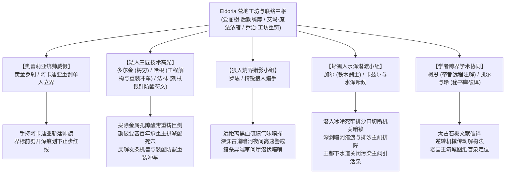

# 方案五：异族特遣跨境支援动因、部族约束与战术分工方案

> **所属方案**：[00_第二部宏篇主线总纲与方案管理中枢.md](00_第二部宏篇主线总纲与方案管理中枢.md)  
> **核心定位**：打破孤立调查格局，确立 Eldoria 各族协助动因、关键角色战术职能与种族文化破冰碰撞。
> **文风与质感铁律**：严守 JRPG 西幻伙伴羁绊与信赖，绝对绝缘中式江湖黑话（严禁“硬汉”、“江湖气”、“结义”）。

---

## 一、 各族跨境协助的深层心理与动因约束

异族特遣力量跨境支援维里迪亚，基于深层历史渊源、生态危机防范与伙伴间的生死托付：

1. **同仇敌忾的历史根源与部族自给自足属性**：
   * 调查揭示：三十一年前乃至古代的维里迪亚暗影实验，正是导致异界秽能渗透森林根脉、引发两百年影牙浩劫的罪魁祸首！
   * **部族生存与天然戒备**：狼人族隐居北方隐谷以狩猎与月光仪式生活；蜥蜴人族繁衍于南部沼泽，掌握泥穴筑巢、潜水捕鱼与沼泽草药技艺；两族完全自给自足，对人类王权争端毫无世俗利益诉求，长年对人类扩张与污染抱有戒备；
   * **朱利安王子的真诚破冰（先给予尊重，不求回报）**：
     - 面对狼人族：王子查禁捕杀狼皮的走私黑市，将王室珍藏数百年的“古代月影祖石”奉还狼人月语者，明言归还圣物与禁绝盗猎纯系对历史过错的致歉，绝不挟恩要求参战；
     - 面对蜥蜴人族：王子调动水工在下游边境日夜清淤排毒，修筑隔绝废渣的深石沉淀池，阻止教会私船向湿地倾倒暗影废料；
     - 这种“先行自我约束、尊重自然独立”的王家信义，彻底松动了两族的戒备。
   * **深层生态威胁与勇士请缨动因**：
     - 第五幕阶段十五中，蜥蜴人鳞母在以沼泽月影酸蚀草协助艾玛为劳拉巨剑拔除强酸时，敏锐察觉暗影废渣若随地下水系全面蔓延，必将倒灌侵蚀南部沼泽与古代森林根系，引发生态灭顶浩劫；深知若神权与黑化军权彻底掌控王国，森林必遭圣战屠戮；
     - 加尔（蜥蜴人第一剑士）与罗恩（狼人猎手）主动请缨，以特遣勇士身份跨境协助主角团，确立了加尔“水下潜渡破锁关闸”、罗恩“荒野黑血嗅探”的特种作战动因，绝非部族大部队攻城。
2. **部族政体与参战约束（尊重种族法则）**：
   * **矮人三兄弟法则**：岩丘矮人族在经历历史劫难后，以**多尔金（大哥，约320岁，最强锻造大师）**、**哈根（二哥，约270岁，建筑与大型工程大师）**、**法林（三弟，符文轻量防具与机巧破绽定位）**三兄弟为核心精英。三兄弟各展所长，大哥多尔金主导巨剑锻造，二哥哈根提供工程降维压制，三弟法林使用【黑角木符文刻杖】与【附魔银刻针】打造微型防酸符文护具并定位构件机械弱点；
   * **蜥蜴人部族约束**：南部沼泽蜥蜴人部族长年保守自治。参战形式依托**个人生死信赖与并肩羁绊**——由鳞母唯一的孙子、部族第一剑士**加尔**与青年战士**卡兹尔**，私下带领数名身手敏捷的水泽勇士秘密跨境支援；
   * **狼人族**：由罗恩带领少数感官最敏锐的精锐猎手，在山地、密林与地底深渊展开荒野反追踪与黑血嗅探。

---

## 二、 关键角色与特遣小组的战术职能

### 1. 矮人三兄弟（多尔金、哈根、法林）——工坊神匠与工程战力担当
* **巨剑除酸与凡人匠魂重铸**：
  * 劳拉亚尔席昂巨剑在白鹿驿馆舍身正面硬撼战兽重锤与剧毒黑酸，剑身在重击剧震与强酸灼蚀下崩裂断折，金属孔隙渗透顽固黑酸，常规地火炉无法熔合星银秘金；
  * **艾玛（魔女药理）+ 蜥蜴人鳞母（沼泽月影酸蚀草）**：鳞母提供特产草本，艾玛施展卢恩调和阵，彻底拔除金属孔隙内的顽固酸毒；
  * **三兄弟合力**：大哥多尔金以祖厅折叠锻造术熔铸星银秘金，二哥哈根架设加压地火炉提供极限熔温，三弟法林手持【黑角木符文刻杖】与【附魔银刻针】（针尖嵌米粒微光晶石）在剑身精雕防酸抗蚀符文，以纯粹凡人匠艺重铸带有防酸破邪刻印的新生双手重剑！
* **哈根的硬核工程三大高光（降维压制）**：
  * **场景一：勘破圣殿要塞百年承重薄弱点**：哈根勘察要塞构造，一眼看穿两百年前教廷神官克扣银克朗导致第三号承重拱生铁吊栓减配，直接锁定死牢潜入路线，带领队伍规避正面铁闸；
  * **场景二：反解禁忌发条机兽**：工坊激战中，哈根手持八十磅重锻扳手卡死机兽主轴，痛骂教廷连转向齿轮都装反，两下敲碎棘轮轴承并调换传动链，让机兽原地失控狂旋、反向撞烂敌阵；
  * **场景三：决战现场装配防酸重装冲车**：第九幕全城强酸毒雾弥漫时，哈根指挥铁匠利用废旧生铁与厚栎木现场拼装“矮人防酸重冲车”，嘴里高唱雄浑矮人锻造战歌，单手挥锤破障开道。

### 2. 狼人荒野猎影小组（罗恩与精锐猎手）——黑夜梦魇与死士克星
* **嗅觉追踪与月光感知暗影黑血**：
  * 人眼难以识别潜伏在树影中的“暗影忏悔者”，但变异黑血散发着刺鼻的硫磺与腐肉气味，对狼人来说清晰可辨；
  * 罗恩以月光法术锁定隐秘敌踪并施展月影迟滞，精锐狼人猎手在山脊线全速狂奔，在无声的扑咬中将教廷最阴险的潜行刺客撕碎在伏击圈之外。
* **深渊古道水网嗅探与背骑连射**：
  * 第六幕穿行于幽暗深渊古道时，暗河水气潮湿，罗恩化为霜银巨狼，凭借野兽直觉提前嗅出地底盲眼巨蜥与暗影死士的黑血腥味，载负亚莉莎展开高速背骑连射，精准清除溶洞盲区敌影。
* **山地斥候与信道护卫**：
  * 在主角团遭遇全境通缉、信差被截杀的黑暗时期，狼人凭借超凡脚力与野兽本能，穿梭于悬崖峭壁之间，维系了南部沼泽避难所与边境秘密涵洞之间的情报传递。

### 3. 蜥蜴人水泽潜渡小组（加尔、卡兹尔）——潜渡破防与水闸救生
* **跨种族信赖与死牢潜渡破锁**：
  * 加尔手持铁木剑，出于对黎恩、菲娜与奥蕾莉亚的并肩信赖自发跨境协助；
  * 面对第七幕圣殿要塞排沙死角的机关铁网与暗锁，哈根看穿机括，加尔潜入刺骨水底精准斩断传动销，为主角团潜入底层水牢打开了唯一水下暗道。
* **深渊古道暗河探路与太古盲泉主闸排障**：
  * 在第六幕暗河潜渡中，加尔与卡兹尔在刺骨激流中探寻暗礁与回漩，为竹筏与行军开辟安全航道；在太古蓄洪排沙主闸前，协助凯尔排除水银死锁发条，成功稳定地底水位。
* **王都水闸截断与平民救赎**：
  * 在教廷向王都水网倾倒暗影毒液的危急关头，老国王秘密送出的太古筑城图纸直接送抵王都前线黑野猪酒馆暗室；随队驻扎前线的凯尔与玲结合随身携带的太古辞典及柯恩此前的古代图谱注解，在暗室现场破译图纸，精准定位封存百年的太古盲泉排沙闸；
  * 加尔等人屏息潜入恶臭刺鼻的下水道，强行扳动生锈的水闸重机，封闭受污染的主水道并引流太古清泉，救赎全城水网，救下了排污口附近数百名险些中毒的下城区平民。

### 4. 奥蕾莉亚·勒瑰恩（黄金罗刹）——大本营界标防御与不可动摇武力威慑
* **顶级骑士统帅气度**：身着深蓝军装与深紫披风，手持巨型双手重剑“阿卡迪亚”（Arcadia），以帝国“黄金罗刹”与顶尖剑圣的绝对威严伫立于维里迪亚关隘界标前（身侧仅依托岩垒构筑警戒哨位）；
* **帅旗断折与划界威慑**：面对大团长阿达尔伯特调遣的越界搜山先锋骑兵，奥蕾莉亚挥起沉重无比的阿卡迪亚巨剑迎头斩断先锋帅旗，巨剑破空风压在大理石界标前轰开深邃裂痕，冷冽宣布“越过界标者，视同向勒瑰恩宣战”，以绝对武力威慑逼退敌军，为后方断刃重铸与战备推演筑起坚不可摧的停滞线。

### 5. 学者跨界协同（柯恩·瓦尔德、凯尔、玲）——学术破译与逆向工程
* **帝国图书馆远程注解（柯恩）**：柯恩常驻帝都图书馆，调阅太古封印语与古代工程抄本，通过裂隙通信向营地传输图谱注解；
* **秘书库与王都前线破译（凯尔与玲）**：凯尔与玲前期在营地太古秘书库研制发条机械“逆转传动解构法”；后作为地底特遣组潜入王都前线，在黑野猪酒馆暗室现场破译太古筑城图纸，为前线特种行动提供精准坐标。

---

## 三、 种族文化碰撞与封建偏见的消融

异族踏入人类王国的土地，必将引发巨大的认知震荡，这正是宏篇中极具戏剧张力与情感深度的看点：

### 1. 场景一：罗恩与边防老哨兵的黑夜对视
* 维里迪亚关隘的守备哨卫长期受教会思想灌输，视北方各族为荒蛮凶物；
* 然而在风雨要塞前，当狼人罗恩将一名被圣殿追兵抛弃在泥潭里、濒临冻死的年轻人类哨兵扛在肩头，轻轻放在哨卡前并低声说道：“他的腿折了，营地小姐给配了草药，治好他。”随后转身隐入黑夜；
* 年迈的哨兵缓缓放下了手中的强弩，在胸前划下了自少年时便未曾如此真诚过的晨光祷文。

### 2. 场景二：下水道中的深绿之爪
* 王都下水道污水泛滥、毒气弥漫，一名下城区小女孩失足落入排污暗渠；
* 一只粗壮坚硬、覆盖深绿厚鳞的利爪破水而出，稳稳将小女孩托举到干燥的石台上。加尔甩去吻部的水渍，竖瞳平静地注视着惊恐哭泣的孩子，用平稳短促的通用语低声道：“别怕……去台阶上，水里有毒。”
* 随后赶来的平民母亲抱住女儿，看着潜回水底的蜥蜴人脊背，泪流满面地跪地致谢，千百年来的偏见与恐惧在这一瞬间烟消云散。

### 3. 场景三：真理广场上的五族列阵（新秩序的奠基）
* 在真理广场的大审判中，当克莱门特企图将主角团诬蔑为“勾结北方妖物祸乱王国的叛国贼”时；
* 罗恩、加尔与营地代表整齐肃穆地阔步走入真理广场，出示部族传承的月影圣石与心木枝叶；
* 代表们当众宣告：“我们不是来征服的，我们是来作证的。作证三十一年前的罪恶，也见证维里迪亚的新生。”
* 数万王国民众爆发出的掌声与欢呼，彻底宣告了神权构陷体系的瓦解与大陆新纪元的来临。
