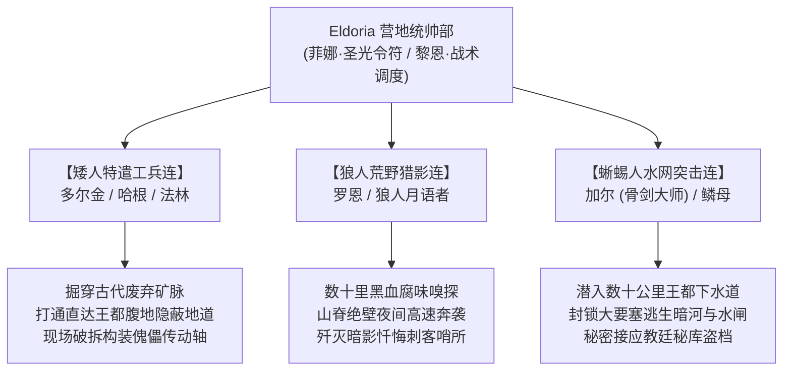

# 方案五：营地五族跨境联动与特遣支援方案

> **所属方案**：[00_第二部主线与世界扩充方案总纲.md](file:///home/nanhu2/comfyui/世界书/方案/第二部/主线与世界扩充方案/00_第二部主线与世界扩充方案总纲.md)  
> **核心定位**：打破孤立调查格局，确立 Eldoria 五族参战动因、跨境特遣队战术职能与种族文化破冰碰撞。

---

## 一、 五族跨境参战的深层心理与战略动因

五族绝非被动听从调遣的佣兵，他们走出森林、跨过边境参战拥有不可动摇的内在动因：

1. **同仇敌忾的历史根源**：
   * 调查揭示：三十一年前乃至古代的维里迪亚暗影实验，正是导致异界秽能渗透森林根脉、引发两百年影牙浩劫的罪魁祸首！
   * 如今新心木刚刚破土萌芽，若任由克莱门特与阿达尔伯特将暗影实验军事化，整个大陆将再次堕入万劫不复的黑暗。
2. **对营地同伴的绝对情义**：
   * 第一部终局中，雷恩曾以巨盾挡在五族老弱身前，艾德里安曾用商队商路为部落运送救命麦粮，黎恩与菲娜更是拯救森林的支柱。
   * 当得知雷恩被诬蔑流放、艾德里安家族被灭门掩盖时，五族长老一致决议：“朋友的冤屈，就是全森林的战事！”

---

## 二、 三大特遣支队的跨境战术职能

五族充分发挥其得天独厚的生理天赋与古老智慧，在第二部中后段（阶段九~十）成为扭转战局的奇兵：

### 1. 矮人特遣工兵连（多尔金、哈根、法林）——地底神兵与钢铁克星
* **开辟战略地下通道**：
  * 当圣殿军团彻底封锁边境关隘与主干驿道时，多尔金凭借对山岩脉络的敏锐感知，率队重新挖通了一条百年前被废弃的走私铁矿道。
  * 这条地道绕过了天险关隘，直接将帝国补给箱、矮人抗酸黑岩盾牌以及特遣精锐送入法尔肯驿镇后方。
* **构装傀儡的现场破拆**：
  * 在面对“暗影噬光傀儡”时，矮人毫无惧色。多尔金叼着烟斗，大嗓门指挥法林：“敲它左肋第三根黄铜活塞！那里的减震齿轮咬合不均！”
  * 法林手持锻造重锤借由跳斩一锤精准砸飞传动主轴，瞬间让庞大的铁兽瘫痪在地。

### 2. 狼人荒野猎影连（罗恩、月语者）——黑夜梦魇与死士克星
* **嗅觉追踪暗影黑血**：
  * 人眼难以识别潜伏在树影中的“暗影忏悔者”，但变异黑血散发着刺鼻的硫磺与腐肉气味，对狼人来说如同黑夜中的篝火。
  * 罗恩率领精锐狼人猎手在山脊线全速狂奔，在无声的扑咬中将教廷最阴险的潜行刺客撕碎在伏击圈之外。
* **暴风雨夜的重骑截击**：
  * 在阶段八教会押送重炮的泥泞山道上，狼人特遣队在雨夜中发起突袭。狼人的野性咆哮与敏捷撕扯让战马极度惊恐四散奔逃，生生打乱了圣殿铁誓旗队的冲锋阵型。

### 3. 蜥蜴人水网突击连（加尔、鳞母）——水下暗流与密库接应
* **掌握王都排污巨网与近身破防**：
  * 维里迪亚王都依山傍水，地下拥有错综复杂的古老拱顶排污系统与天然溶洞暗河。
  * 圣殿驻军视下水道为恶臭难行的阴森险道，但蜥蜴人如履平地。骨剑大师加尔手持沉重铁木剑，在阴暗水渠中无声格杀教会潜伏的暗影暗哨，与奥蕾莉亚的刚猛剑意形成远程战术共振；鳞母指挥水泽战士潜伏于水面之下，仅露出一截呼吸苇管，为菲和艾德里安绘制出最精确的教廷秘库地下路线图。
* **水闸截断与逃生护航**：
  * 决战爆发前夕，加尔率突击队潜入大要塞蓄水池，强行斩断绞盘铁锁破坏水闸，断绝了克莱门特企图通过地下水渠引流毒水灭口的恶毒计划。

---

## 三、 种族文化碰撞与封建偏见的消融（名场面）

异族踏入人类王国的土地，必将引发巨大的认知震荡，这正是中后篇极具戏剧张力与情感深度的看点：

### 1. 场景一：麦田里的矮人巨盾（保护人类平民）
* 在法尔肯外围农庄，一队被暗影死士追杀的农户母亲带着孩子瘫倒在麦草堆旁；
* 就在狂暴死士挥舞骨刺扑下的瞬间，一面巨大的黑岩锻铁盾轰然砸入地面，挡住了致命一击！多尔金跨步上前，反手一战斧将死士劈退三步；
* 农妇吓得瑟瑟发抖，以为遇到了传说中的“地底恶鬼”。多尔金摘下牛角头盔，抹了一把脸上的汗水，粗声粗气道：“小娃娃莫哭！俺们是矮人铁匠！拿着舒华泽小姐的干粮去后头地道躲好！”这一刻，阶层与种族的隔阂化为乌有。

### 2. 场景二：罗恩与边境巡逻老兵的对视
* 维里迪亚关隘的老守军曾听信神官训斥，视北方森林各族为吃人凶兽；
* 然而在风雨要塞前，当狼人罗恩将一名被圣殿叛军抛弃在泥潭里、濒临冻死的年轻人类伤兵扛在肩头，轻轻放在要塞岗哨门前并低声说道：“他的腿断了，爱丽榭小姐说擦了草药能活，交给你们了。”随后转身隐入黑夜；
* 年迈的边防哨长缓缓放下了手中的强弩，在胸前划下了自少年时便未曾如此真诚过的祝福。

### 3. 场景三：真理广场上的五族列阵（新秩序的奠基）
* 在阶段十一的大审判中，当克莱门特诬蔑主角团是“勾结北方妖物祸乱王国的叛国贼”时；
* 矮人长老、狼人战士与蜥蜴人使者整齐肃穆地步入真理广场，没有铠甲的血腥，只有历代先灵传承的信物与圣木枝叶；
* 五族代表当众宣布：“我们不是来征服的，我们是来作证的。作证三十一年前的罪恶，也作证维里迪亚的新生。”
* 数万王国民众爆发出的欢呼与掌声，彻底宣告了旧秩序的终结与宏大大陆新纪元的来临。
