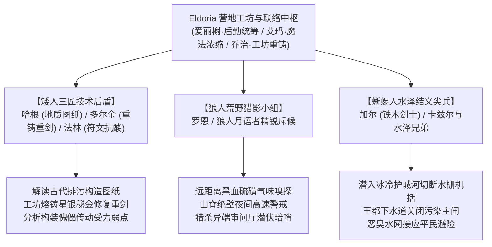

# 方案五：营地五族跨境联动与特遣支援方案

> **所属方案**：[00_第二部主线与世界扩充方案总纲.md](file:///home/nanhu2/comfyui/世界书/方案/第二部/主线与世界扩充方案/00_第二部主线与世界扩充方案总纲.md)  
> **核心定位**：打破孤立调查格局，确立 Eldoria 各族协助动因、关键角色战术职能与种族文化破冰碰撞。

---

## 一、 各族跨境协助的深层心理与动因约束

异族参与维里迪亚事件绝非被动听从调遣的佣兵，亦非盲目的全族全面战争，而是基于深层历史渊源与个人生死义气：

1. **同仇敌忾的历史根源**：
   * 调查揭示：三十一年前乃至古代的维里迪亚暗影实验，正是导致异界秽能渗透森林根脉、引发两百年影牙浩劫的罪魁祸首！
   * 如今新心木刚刚破土萌芽，若任由克莱门特与阿达尔伯特将暗影实验军事化，整个大陆将再次堕入黑暗。
2. **部族政体与参战约束（尊重种族法则）**：
   * **矮人族约束**：岩丘矮人族在经历历史劫难后，仅存哈根（长兄，石构筑造）、多尔金（二哥，淬火锻造）、法林（三弟，符文防具）三兄弟，绝无成建制的军队或工兵部队。他们留守大本营负责基站与设施，其支援主要体现在**提供古代矿脉与要塞地质构造图纸**、以及在工坊中为先遣队**重铸兵器与加固防具**；
   * **蜥蜴人部族约束**：生活于南部沼泽的蜥蜴人部族受制于保守的部族元老院，且对人类王国世俗政权毫无利益纠葛与义务，元老院绝不会批准举族出兵。因此，参战形式严格局限于**个人生死义气**——由鳞母唯一的孙子、部族第一剑士**加尔**与青年战士**卡兹尔**，私下带领数名私交深厚的水泽精锐勇士，以个人挚友身份秘密跨境支援；
   * **狼人族**：由罗恩带领少数感官最敏锐的精锐猎手，在山地与密林间展开荒野反追踪与黑血嗅探。

---

## 二、 关键角色与特遣小组的战术职能

```mermaid
graph TD
    Camp["Eldoria 营地工坊与联络中枢<br/>(爱丽榭·后勤统筹 / 艾玛·魔法浓缩 / 乔治·工坊重铸)"]
    
    Camp --> Dwarf["【矮人三匠技术后盾】<br/>哈根 (地质图纸) / 多尔金 (重铸重剑) / 法林 (符文抗酸)"]
    Camp --> Wolf["【狼人荒野猎影小组】<br/>罗恩 / 狼人月语者精锐斥候"]
    Camp --> Lizard["【蜥蜴人水泽结义尖兵】<br/>加尔 (铁木剑士) / 卡兹尔与水泽兄弟"]

    Dwarf --> D_Act["解读古代排污构造图纸<br/>工坊熔铸星银秘金修复重剑<br/>分析构装傀儡传动受力弱点"]
    Wolf --> W_Act["远距离黑血硫磺气味嗅探<br/>山脊绝壁夜间高速警戒<br/>猎杀异端审问厅潜伏暗哨"]
    Lizard --> L_Act["潜入冰冷护城河切断水栅机括<br/>王都下水道关闭污染主闸<br/>恶臭水网接应平民避险"]
```

### 1. 矮人三兄弟（哈根、多尔金、法林）——技术图纸与工坊神匠
* **古代要塞构造与地脉图纸指引**：
  * 面对依险而建的圣殿要塞，长兄哈根翻阅岩丘珍藏的两百年前维里迪亚古代排污暗渠与地下岩层图谱，准确指出要塞后方悬崖因地脉沉降形成的一处天然溶洞裂隙，为主角团奇袭死牢提供了关键的穿山路线图。
* **工坊断刃重铸与抗酸强化**：
  * 当劳拉的亚尔席昂巨剑在白鹿驿馆被黑酸腐蚀断裂并由菲送回后，二哥多尔金在营地熔炉前与乔治联手，以矮人祖传的星银秘金与折叠锻造技术，将断刃淬炼重铸为带有绝魔破邪铭文的新生重剑；三弟法林则利用符文浸润技术，赶制出抵抗暗影强酸腐蚀的特制护臂与剑鞘。

### 2. 狼人荒野猎影小组（罗恩、月语者）——黑夜梦魇与死士克星
* **嗅觉追踪暗影黑血**：
  * 人眼难以识别潜伏在树影中的“暗影忏悔死士”，但变异黑血散发着刺鼻的硫磺与腐肉气味，对狼人来说清晰可辨。
  * 罗恩率领数名精锐狼人猎手在山脊线全速狂奔，在无声的扑咬中将教廷最阴险的潜行刺客撕碎在伏击圈之外。
* **山地斥候与信道护卫**：
  * 在主角团遭遇全境通缉、信差被截杀的黑暗时期，狼人凭借超凡脚力与野兽本能，穿梭于悬崖峭壁之间，维系了南部沼泽避难所与边境秘密涵洞之间的情报传递。

### 3. 蜥蜴人水泽结义尖兵（加尔、卡兹尔）——潜渡破防与水闸救生
* **个人深厚义气与潜入开道**：
  * 加尔手持铁木剑，出于对黎恩、菲娜与奥蕾莉亚的生死信任，与同袍卡兹尔等数位水泽兄弟自发跨境。
  * 圣殿要塞周围水域冰冷湍急，但蜥蜴人如履平地。加尔潜入深水，在无声无息中斩断生铁水栅门的绞盘铜销，为主角团潜入圣殿底层水牢打开了唯一的水下暗道。
* **王都水闸截断与平民救赎**：
  * 在教廷向王都水网倾倒暗影毒液的危急关头，加尔等人屏息潜入恶臭刺鼻的下水道，强行扳动生锈的水闸重机，封闭受污染的主水道并引流地下清泉，救下了排污口附近数百名险些中毒的下城区平民。

---

## 三、 种族文化碰撞与封建偏见的消融

异族踏入人类王国的土地，必将引发巨大的认知震荡，这正是宏篇中极具戏剧张力与情感深度的看点：

### 1. 场景一：罗恩与边防老兵的黑夜对视
* 维里迪亚关隘的守军长期受教会思想灌输，视北方各族为荒蛮凶物；
* 然而在风雨要塞前，当狼人罗恩将一名被圣殿追兵抛弃在泥潭里、濒临冻死的年轻人类哨兵扛在肩头，轻轻放在哨卡前并低声说道：“他的腿折了，营地小姐给配了草药，治好他。”随后转身隐入黑夜；
* 年迈的哨兵缓缓放下了手中的强弩，在胸前划下了自少年时便未曾如此真诚过的晨光祷文。

### 2. 场景二：下水道中的深绿之爪
* 王都下水道污水泛滥、毒气弥漫，一名下城区小女孩失足落入排污暗渠；
* 一只粗壮坚硬、覆盖深绿厚鳞的利爪破水而出，稳稳将小女孩托举到干燥的石台上。加尔甩去吻部的水渍，竖瞳平静地注视着惊恐哭泣的孩子，用粗短生硬的通用语低声道：“别怕……去台阶上，水里有毒。”
* 随后赶来的平民母亲抱住女儿，看着潜回水底的蜥蜴人脊背，泪流满面地跪地致谢，千百年来的偏见与恐惧在这一瞬间烟消云散。

### 3. 场景三：真理广场上的五族列阵（新秩序的奠基）
* 在真理广场的大审判中，当克莱门特企图将主角团诬蔑为“勾结北方妖物祸乱王国的叛国贼”时；
* 罗恩、加尔与营地代表整齐肃穆地步入真理广场，出示历代先灵传承的信物与圣木枝叶；
* 代表们当众宣告：“我们不是来征服的，我们是来作证的。作证三十一年前的罪恶，也见证维里迪亚的新生。”
* 数万王国民众爆发出的掌声与欢呼，彻底宣告了神权构陷体系的瓦解与大陆新纪元的来临。
