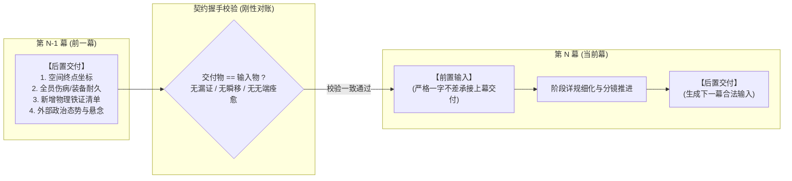
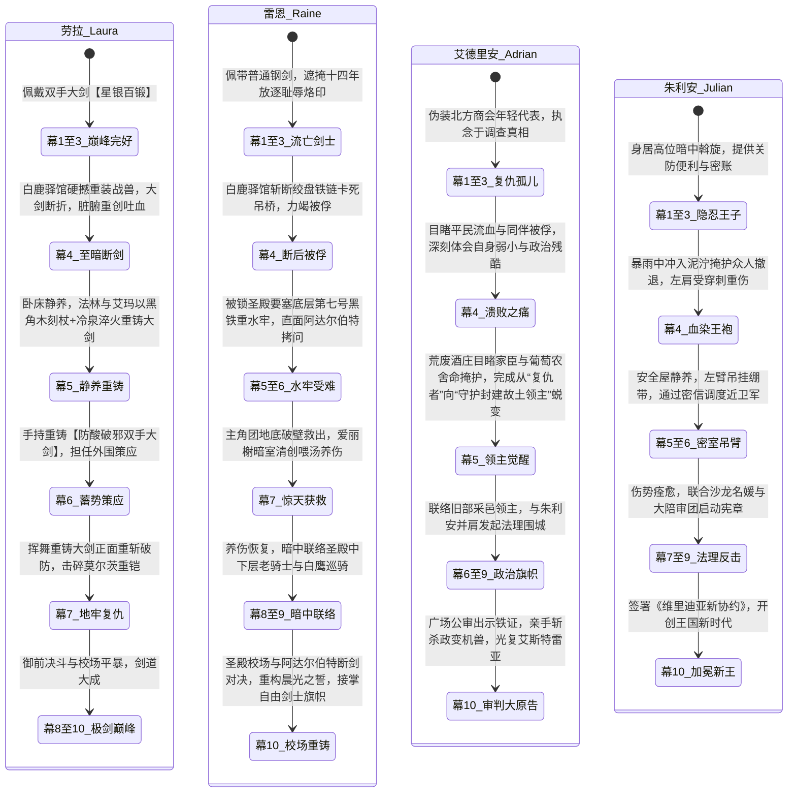

# 第二部主线跨幕连续性与全局状态流转中枢（管理龙骨）

> **归档位置**：`方案/第二部/主线与世界扩充方案/06_第二部主线跨幕连续性与全局状态流转中枢.md`  
> **所属体系**：第二部宏篇主线与世界扩充方案集群  
> **关联母案**：
> - [00_第二部主线与世界扩充方案总纲.md](file:///home/nanhu2/comfyui/世界书/方案/第二部/主线与世界扩充方案/00_第二部主线与世界扩充方案总纲.md)
> - [01_宏篇主线演进与阶段规划方案.md](file:///home/nanhu2/comfyui/世界书/方案/第二部/主线与世界扩充方案/01_宏篇主线演进与阶段规划方案.md)
> - [分阶段详规/](file:///home/nanhu2/comfyui/世界书/方案/第二部/主线与世界扩充方案/分阶段详规/)（第一幕至第十幕接口与阶段详规）  
> **核心定位**：**全书第二部宏篇主线（310~340章）唯一全局权威状态中枢（Single Source of Truth, SSOT）**。专用于穿透分文件夹管理壁垒，彻底消灭剧情前后矛盾、角色状态漂移、时空折叠与物象脱节。

---

## 一、 为什么必须建立跨幕状态中枢？（设计初衷与治理原则）

### 1.1 现状与潜在结构性隐患
在第二部 10 幕、30 阶段、310~340 章的超大篇幅创作中，为了防止单个文档字符爆炸（避免 Token 溢出与编辑器卡顿），工程上将各幕方案拆解在独立的文件夹中管理（`分阶段详规/01_第一幕_.../` 至 `10_第十幕_.../`）。  
然而，这种**物理文件夹解耦**必然伴随两大不可忽视的潜在风险：
1. **信息孤岛（Information Silos）**：在深入细化某一幕的逐章分镜时，创作者的注意力高度聚焦在当前文件夹内，极易凭模糊记忆默认前提，从而忽略前面章节已经固化的物理事实；
2. **隐性剧情漂移（Cascading Inconsistency）**：在某一幕临时调整了证物归属、角色伤情、NPC认知或行程节奏，由于后续幕次的方案存放在其他文件夹中，系统不会自动报错，导致跨幕之间产生静默的逻辑断层。

### 1.2 顶层治理原则：【物理文件夹分治，逻辑状态统一】
* **分文件夹的作用**：仅作为各幕**“逐章分镜与微观剧情血肉”**的容纳容器；
* **本中枢的作用**：作为贯穿全篇十幕的**“合金龙骨”**，对全书的**证物、角色状态、170公里时空日历、反派情报知晓度、以及平民物象**进行单向强类型约束。
* **写作铁律**：**任何一幕在细化阶段详规前，必须以本中枢的状态为基准；细化过程中产生的任何宏观变动，必须第一时间反哺回写本中枢。**

---

## 二、 幕级双向契约握手协议（Interface Handshake Protocol）

为了确保各文件夹之间严丝合缝，各幕 `00_第X幕大纲与接口.md` 之间的衔接必须执行严格的**输入/交付契约握手**：



### 握手三大军规：
1. **绝对承接原则**：第 $N$ 幕的 `【前置输入】` 必须完全复印第 $N-1$ 幕的 `【后置交付】`，严禁在幕初凭空刷新装备、让重伤角色无端痊愈、或让人员凭空出现在未行军到达的地点；
2. **多米诺联动修规法（Cascade Update）**：若在细化第 $N$ 幕详规时产生突破性构思，改变了交付状态，**绝不允许仅在当前文件夹内自圆其说**，必须立即启动两步联动：
   - 步骤一：检查是否破坏第 $N-1$ 幕交付约定，若破坏需向前复核；
   - 步骤二：立即更新第 $N+1$ 幕的 `【前置输入】`，并同步更新本中枢总表。
3. **零元叙事与客观实体原则**：所有交付物必须是客观物理实体（信件、印章、齿轮、伤痕、关防文书），严禁出现“达成战略目标”、“影响力+10”等抽象游戏化参数。

---

## 三、 全局四大核心状态流转矩阵（Single Source of Truth）

### 3.1 物理证物与关键道具全局单向流转链（Evidence & Artifact Pipeline）

全篇扳倒教会三十年暗影统治、唤醒骑士团初心的核心支点是严密的**客观物理证据链**。所有核心证物的产生、转移、封存与呈堂必须保持绝对的物理守恒：

| 证物编号 | 证物名称与物理特征 | 获取节点（出处） | 中途保管人与物理存放地 | 关键转移与流转节点 | 终局呈堂与法理生效（第十幕） |
| :---: | :--- | :--- | :--- | :--- | :--- |
| **EVD-01** | **克莱门特暗印黑血试剂管**<br>（铅封细玻璃管，内装强酸黑血残液） | 第一幕阶段二<br>维里迪亚关隘截获 | 菲娜贴身收纳 ➔ 白榆货栈地窖铅盒 | 第四幕突围由菲带出 ➔ 第五幕酒庄地窖化验比对 | 第十幕大陪审团广场公审，当庭向十二领主验毒定谳 |
| **EVD-02** | **老哨长边防通关铁牌**<br>（铸铁白鹰徽记，带老巴恩斯私印） | 第一幕阶段二<br>老哨长巴恩斯救孙赠予 | 雷恩随身携带 ➔ 艾德里安出示 | 第三幕凭此合法租下白榆货栈 ➔ 第四幕伏击中被达米安辨识 | 第十幕老哨长出庭作证，证明通关合规与教会私兵越权屠杀 |
| **EVD-03** | **艾斯特雷亚夫人临终手札与忠仆册**<br>（十九年前羊皮手卷，带王室花漆） | 第一幕阶段三<br>朱利安王子密交奉还 | 艾德里安贴身皮袋保管 | 第四幕大溃败中用油布包死死护在胸前 ➔ 第五幕唤醒旧领葡萄农 | 第十幕艾德里安以苦主原告出庭，当众宣读母亲绝笔，洗雪家门 |
| **EVD-04** | **教廷秘库工匠印号主齿轮**<br>（带维克托秘库暗纹的特种合金主齿轮） | 第二幕阶段四<br>焦土机兽残骸菲撬下 | 乔治与法林装入铁盒保管 | 第三幕法林在工坊街比对齿距 ➔ 第八幕玲破译地下工坊时直接匹配同批号 | 第十幕铁证当堂砸向克莱门特，击穿“教会不知情机兽”谎言 |
| **EVD-05** | **拒杀平民十四人抗命名册原本与越权令**<br>（带教会印泥的羊皮调兵令与折剑骑士签名） | 第二幕阶段五<br>晨光修道院药舍起获 | 劳拉代雷恩收纳入剑袋 | 第四幕雷恩被俘前交由艾德里安转移 ➔ 第五幕绝境中鼓舞全员信念 | 第七幕大劫狱唤醒死牢十四老骑士；第十幕校场当全军宣读 |
| **EVD-06** | **心木碳化残根与商会洗钱暗账**<br>（高密度碳化木块、特许商会双重假账） | 第二幕阶段六<br>迷雾海港货栈起获 | 亚莉莎与玛格丽特夫人收管 | 第三幕亚莉莎以复式记账法穿透资金链 ➔ 第八幕用于撬动亨里克边境伯倒戈 | 第十幕作为没收教会免税非法采邑、签署新商贸协约的经济铁证 |
| **EVD-07** | **老国王埃德蒙十八年手抄黑账**<br>（浸染微毒汤药药渍的王室私密手记） | 第一幕暗线初现<br>第八幕密室正式移交 | 朱利安王子转交瓦卢瓦伯爵 | 记录三十年间每批矿石流向与教会勒索记录 | 第十幕老国王退位交出《根本宪章》，成为击垮教会神权的终极政治炸弹 |
| **EVD-08** | **纯铜风铃八音盒**<br>（科林打造的薄荷蓝护身小道具） | 第三幕阶段九<br>工坊街少年学徒科林相赠 | 玲随身携带 | 第六幕深渊暗河畔转动安抚疲惫 ➔ 第八幕成为与科林接头暗号 ➔ 第九幕避难所安抚孩童 | 第十幕尾声巡礼回赠科林，见证阳光下新铺开张的生活流物象闭环 |

---

### 3.2 角色生命周期、装备耐久与伤病演进链（Character Status Progression）

为了彻底杜绝“上一幕断剑重伤、下一幕生龙活虎大跳劈”的割裂感，全篇核心角色的物理状态与心路必须遵循严格的时序递进：



* **黎恩与塞拉菲娜（菲娜）的战术状态守则**：
  - **全程零导力守则**：ARCUS 战术导力器皮革遮蔽外壳全程完好，严禁在王国居民面前露出一丝导力电弧；菲娜不展露光翼，全篇以凡人战技与微量克制圣光行动；
  - **第四幕自限逻辑**：白鹿驿馆狭小空间挤满无辜马夫仆役，黎恩为护民无法施展大范围太刀居合，导致被重骑与战兽阵型压制撤退；
  - **第九幕超自然防火墙**：决战阶段黎恩与菲娜专注于阻断暗影毒流侵蚀地脉、保护平民避难所，绝不介入维里迪亚世俗政权交接。

---

### 3.3 170公里地理动线与绝对时空日历标尺（Spatiotemporal Master Timeline）

维里迪亚王国南北纵深约 170 公里（Eldoria森林大本营 0km ➔ 维里迪亚关隘 15km ➔ 法尔肯驿镇 25km ➔ 艾斯特雷亚旧领 70km ➔ 中央王都 120km ➔ 迷雾海港 170km）。  
在零导力中世纪封建社会，四轮重篷车与商队日行仅 25~35 公里，往返需数日甚至数周。全篇十幕严格锚定在 **24 周（约半年）** 的绝对日历时钟内：

```text
【时间轴总览：共24周 (约168天)】
W01~02 (第1幕阶段一)   : 大本营新生与两界相触 (0km)
W03~04 (第1幕阶段二~三) : 关隘破关 (15km) ➔ 入驻法尔肯驿镇 (25km)
W05~08 (第2幕阶段四~七) : 三路巡礼 (旧领70km / 修道院50km / 海港170km / 商行)
W09~13 (第3幕阶段八~十一): 北上进抵中央王都 (120km) ➔ 白榆货栈扎根 ➔ 5周文牒审核期与市井生活流
W14    (第4幕阶段十二~十四): 平原大道白鹿驿馆会盟 (95km) ➔ 暴雨伏击大溃败 ➔ 溃退西线酒庄 (70km)
W15~16 (第5幕阶段十五~十七): 艾斯特雷亚荒废酒庄地下流亡 (70km) ➔ 篝火重铸防酸双手大剑
W17~18 (第6幕阶段十八~二十): 地底逆行千米暗河潜入 (地脉管网) ➔ 密码接头
W19    (第7幕阶段二十一~二十三): 黑铁死牢大劫狱 ➔ 救出雷恩 ➔ 转移至下城暗室
W20~21 (第8幕阶段二十四~二十六): 金鸢尾沙龙法理围城 ➔ 维克托地下工坊破袭 ➔ 御前竞技场决斗
W22    (第9幕阶段二十七~二十九): 王都全城水源危机 ➔ 地下水网抢修 ➔ 双城合围决战
W23~24 (第10幕阶段三十) : 圣殿校场断剑 ➔ 广场大审判 ➔ 加冕典礼 ➔ 4章长途篷车逆向告别巡礼 (120km ➔ 0km)
```

#### 空间移动三大红线（严防时空折叠）：
1. **严禁“闪现回营地喝汤”**：第四幕至第九幕期间，大部队深处王国腹地与王都，距离森林大本营超过 120 公里，跨越需数日且沿途布满要塞关卡与通缉哨卡，**战略后方的大本营仅在大幕转折（如第五幕重铸重型兵刃时通过特遣极少数人暗道中继）发生联动**；
2. **三级空间中继站职能不可篡改**：
   - 第一级（战略后方）：森林大本营（科研破译、重伤深度调养、重武器冷泉淬火）；
   - 第二级（经济中继）：法尔肯驿镇与迷迭香商行（物资周转、两界信使、平民庇护所）；
   - 第三级（战术前线）：王都白榆货栈、黑野猪酒馆二楼暗室、旧领酒庄地下深窖（战术集结与紧急避险）。
3. **行军辎重耗时必须入账**：凡涉及大批粮草、攻城器械、机兽残骸运输，必须在分镜中计入马车车辙、雨天泥泞减速等物理现实。

---

### 3.4 阵营与反派情报认知度读条（Faction & NPC Knowledge State）

各政治阵营与核心反派并非全知全能的上帝视角，其情报获取完全依赖信使、斥候与政治博弈，具备严格的认知演进读条：

```mermaid
graph TD
    subgraph 异端审问官·达米安的认知升级线
        D1["【第1幕】仅视为边境零星水毒骚乱与违规商队"] --> D2["【第2幕】旧领机兽被拆+修道院调兵令失窃<br/>案头情报交叉：惊觉有高层复仇势力针对教会"]
        D2 --> D3["【第3幕】在王都全城撒网布控，严密监视平原商道"]
        D3 --> D4["【第4幕】获悉大公会盟，亲率生化死士与重骑发动白鹿驿馆血色伏击"]
        D4 --> D5["【第8幕】御前决斗惨败，教会合法性崩塌，陷入穷途末路"]
        D5 --> D6["【第9幕】丧心病狂向全城主水源投放生化毒剂企图同归于尽，被当场制服"]
    end

    subgraph 圣殿大团长·阿达尔伯特的认知与心路
        A1["【第1幕】得知雷恩现身关隘，严令莫尔茨'家法暗查'，绝不公开通缉免被教会抓把柄"] --> A2["【第4幕】白鹿驿馆暴雨中亲眼目睹达米安驱使的黑血狂骑臂甲下露出圣殿誓约烙印<br/>灵魂遭受暴击！震开达米安之剑，扣押雷恩作为牵制教会的战略人质"]
        A2 --> A3["【第5幕】关隘界标被奥蕾莉亚一剑断旗，老辣权衡决定自保封锁，将探山脏活推给教会"]
        A3 --> A4["【第8幕】竞技场公开拒绝为教会丑闻陪葬，圣殿与教廷三十年同盟彻底决裂"]
        A4 --> A5["【第10幕】校场与雷恩断剑对决，面对雷恩克制与教会特使暗算同袍的疯狂，心底侥幸粉碎<br/>以残躯卡死机兽主轴殉道，以命完成最后的尊严赎罪"]
    end
```

---

### 3.5 贯穿十幕的微观平民世相物象咬合链（Timmy, Hans, Colin）

平民角色杜绝扁平工具化，通过真实的小动作与专属信物，作为齿轮直接推动宏篇主线运转：

| 角色姓名与身份 | 核心微观物象 | 出场幕次 | 物理动作与推动主线运转的咬合细节 |
| :--- | :--- | :--- | :--- |
| **提米（5岁）**<br>老哨长孤儿幼孙 | **木雕哨子**<br>（带爱丽榭编织防湿皮绳） | 第1幕 / 第5幕 / 第10幕 | - **第1幕**：被爱丽榭草药救活，爱丽榭为其换上新皮绳；<br>- **第5幕**：送剑危机中在悬崖石缝间吹响尖锐鸟鸣哨音，指引巡哨盲区，掩护菲将断剑安全送回；<br>- **第10幕**：北归尾声，关隘界标常开，哨音再起，向车队行少先队礼呼应。 |
| **汉斯（16岁）**<br>猎鹰与十字小厮 | **端汤木盘与板车**<br>（手抖但眼神坚定） | 第1幕 / 第2~3幕 / 第4幕 / 第10幕 | - **第1幕**：端热麦糊手发抖，被菲指点托盘重心；<br>- **第2~3幕**：协助玛格丽特夫人核对大车行粮簿账册；<br>- **第4幕**：大溃败暴雨夜，手依然发抖，但眼神坚定地推着干草板车冒死向林缘送急救药包；<br>- **第10幕**：成长为沉稳老练的年轻店主，手极稳地倒满香料热苹果酒不洒半滴。 |
| **科林（18岁）**<br>白鸽与游丝工坊学徒 | **纯铜风铃八音盒**<br>（游丝发条机构） | 第3幕 / 第6幕 / 第8幕 / 第9幕 / 第10幕 | - **第3幕**：与玲切磋游丝调校，赠予纯铜八音盒；<br>- **第6幕**：深渊暗河畔玲转动八音盒安抚疲惫；<br>- **第8幕**：被强征调校计时器，暗中在排气阀留下白垩标记与草图；<br>- **第9幕**：避难所角落清脆铃音抚平避难孩童恐慌；<br>- **第10幕**：在阳光倾泻的下城区开起窗明几净的钟表与八音盒小铺。 |

---

## 四、 跨幕详规编写标准操作流水线（SOP）

当开始针对某一个具体幕次（如接下来的第 4 幕、第 5 幕）编写分阶段详规时，必须无条件执行以下 4 步标准流水线：

```text
【步骤 1：输入核对 (Input Check)】
  └─ 打开本中枢，核对当前幕次的：
     1. 绝对时序周数与地理坐标；
     2. 上一幕移交的 EVD 证物清单与状态；
     3. 角色当前的健康度、武器耐久与在场名单；
     4. 反派对本势力的最新情报认知边界。

【步骤 2：详规起草 (Stage Drafting)】
  └─ 在对应幕次文件夹（如 04_第四幕_.../）内编写《阶段X_...详规.md》：
     1. 严格遵守日式西幻文风与零导力铁律；
     2. 严格遵循情境动态标号与末尾纯物象化收束；
     3. 必须包含主要人物与总情境数；
     4. 嵌入平民小齿轮互动。

【步骤 3：交付物审计 (Deliverable Audit)】
  └─ 编写或复核本幕《00_第X幕大纲与接口.md》中的【后置交付】：
     1. 盘点本幕新增或转移的证物编号（EVD-xx）；
     2. 记录角色新增伤情或武器损毁情况；
     3. 确认人员移动后的最终物理坐标。

【步骤 4：总账回写与后向握手 (Ledger Sync & Forward Handshake)】
  └─ 同步回写本中枢对应矩阵；
  └─ 打开下一幕《00_第X+1幕大纲与接口.md》，将本幕交付物一字不差粘贴为下一幕的【前置输入】。
```

---
*本中枢为第二部宏篇主线常驻最高约束文件，全剧组所有阶段详规与章节实体卡均须以此为基准，确保长卷史诗坚如磐石。*
