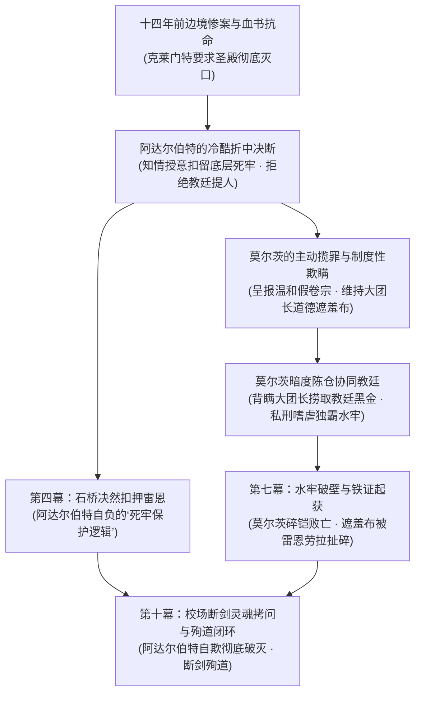

# 下一步任务检查点：十四名老骑士关押动因、莫尔茨表面欺瞒机制与阿达尔伯特“知情自欺”权谋重构方案

> **文档定位**：第二部宏篇主线核心权谋逻辑专项校准检查点备忘录。  
> **建立时间**：2026-10-10  
> **关联母案**：[00_第二部宏篇主线总纲与方案管理中枢.md](00_第二部宏篇主线总纲与方案管理中枢.md) · [01_宏篇主线剧情总大纲与分幕导航.md](01_宏篇主线剧情总大纲与分幕导航.md) · [04_反派双重武装底牌、战斗克制链与黑幕权谋博弈方案.md](04_反派双重武装底牌、战斗克制链与黑幕权谋博弈方案.md)  
> **关联详规**：[阶段五详规](分阶段详规/02_第二幕_分道巡礼·虚妄的线索/阶段五_晨光修道院救赎与折剑十四人详规.md) · [阶段十四详规](分阶段详规/04_第四幕_血色伏击·至暗大溃败/阶段十四_石桥断后、雷恩被俘与王室政变详规.md) · [阶段二十二详规](分阶段详规/07_第七幕_惊天劫狱·血洗圣殿死牢/阶段二十二_奇袭深层水牢与重剑斩碎莫尔茨重铠详规.md) · [阶段三十详规](分阶段详规/10_第十幕_破晓大审判与黎明宪章/阶段三十_校场誓师双城平暴与黎明新世界详规.md)  
> **核心任务目标**：彻底纠偏原草案中“阿达尔伯特对老骑士被囚底层死牢完全不知情”的智力降维硬伤，确立**【阿达尔伯特知情关押·莫尔茨表面伪造账目维持遮羞布·暗中协同教廷借机牟利】**的深层政治博弈与悲剧人物动机链，并在下一步任务中全面回填至主线母案与对应阶段详规。

---

## 一、 现状矛盾剖析与纠偏动因

### 1. 原草案逻辑漏洞
* **原表述漏洞**（如 `04_反派武装方案` 第 65 行等处遗留）：
  > 原文：“他心底深处始终不忍杀害曾一同立誓的骑士同伴，以为十四年间被除名的异己只是在偏远修道院苦修苦役……莫尔茨欺骗了大团长，协同教廷关押了老骑士”。
* **逻辑硬伤**：
  1. **要塞地理与军权矛盾**：圣殿大要塞是阿达尔伯特经营二十余年的最高军政核心，负四层黑铁水牢就位于主堡玄武岩地下三十米处。十四名曾经的军团核心老将（包括老副团长戈德弗里、老哨长巴恩斯）被常年锁在自己脚下，阿达尔伯特若十四年浑然不觉，会直接使这位铁血大团长沦为被手下随意糊弄的平庸低智者；
  2. **戏剧张力严重削弱**：若阿达尔伯特纯粹是“受骗的好人”，第十幕校场断剑对决就沦为俗套的“得知真相后悔恨反水”，彻底丧失了老派军权官僚在权力体制、道德洁癖与自欺欺人泥潭中挣扎的莎翁式悲剧史诗厚度。

### 2. 用户明确纠偏原则
* **核心事实基准**：**十四名老骑士被关押在圣殿死牢水牢，阿达尔伯特自始至终完全知情！**
* **权谋核心课题**：在此事实下，如何合理安排**莫尔茨与阿达尔伯特的上下级互动、莫尔茨表面欺瞒的机制、莫尔茨协同教廷的真正秘密**，以及这一动因如何将第二幕、第四幕、第七幕与第十幕的因果链条彻底咬死。

---

## 二、 核心权谋逻辑与人物心理力学安排

### 1. 阿达尔伯特的知情动因与政治心理（“残酷的自负庇护”）
* **面对教廷极限施压的自私折中**：
  十四年前，克莱门特三世要求圣殿彻底秘密处决戈德弗里等十四名抗命老骑士以绝后患。阿达尔伯特不愿公然处决同生共死的老兄弟（这会引发骑士团内部正统信仰雪崩），但更不敢放他们走（他们掌握前任大团长自白与真相，走漏会引发圣殿与教廷内战），亦绝不能交给教廷（落入异端审问厅必被做成非人畸变狂骑）。
* **知情授意扣留死牢的自负心理**：
  阿达尔伯特**亲自默许并秘密下达了将这十四人锁入圣殿深层水牢的指令**。在阿达尔伯特的认知中：*“只要你们在大要塞的地底下，教廷就休想把你们拉去地下秘库切片改造；虽然不见天日，但你们至少还活着，圣殿的秩序与权威也得以保全。”*——这是一种极度傲慢、残酷且自欺欺人的“家长式冷酷庇护”。

### 2. 莫尔茨为什么要“欺骗”阿达尔伯特？（“遮羞布机制”与“暗度陈仓”）
* **定位：心照不宣的“脏手套”与免责机制（Plausible Deniability）**：
  * 阿达尔伯特既要行冷酷政治之实，又保留着古典老骑士的高傲自尊与道德洁癖，他**绝对不能、也极力避免在公文白纸黑字上看到老兄弟们受尽酷刑的字眼**；
  * 莫尔茨深谙上位者的虚伪软肋。莫尔茨在日常呈递给大团长的卷宗中，永远是标准化通报：“老骑士们在深层监禁平稳，按例供给黑麦口粮与淡水，身体无虞”。莫尔茨主动替大团长承担了所有道德污泥，为阿达尔伯特提供了自欺欺人的台阶。
* **莫尔茨真正瞒着阿达尔伯特做的事情（协同教廷的背叛）**：
  莫尔茨欺骗大团长的**不是“人关在哪里”，而是“在暗中勾结教廷做些什么”**：
  1. **暗通教廷捞取黑金**：克莱门特三世私下通过异端审问厅向莫尔茨支付巨额封口津贴与特制抑制药剂，莫尔茨两头下注，瞒着阿达尔伯特在死牢大发横财；
  2. **私刑嗜虐与反向折磨**：阿达尔伯特以为水牢只是“安全封闭的幽禁”，莫尔茨却瞒着大团长施加带刺颈枷、冰水漫膝与抽打，将死牢建成了他满足嗜虐快感的法外王国；
  3. **背叛协议**：莫尔茨私下与教廷达成秘密谅解：一旦老骑士濒死或时机成熟，允许教廷暗中引渡收尸提取生物样本！
* **阿达尔伯特的“假装不知道”（眼不见为净的体制麻木）**：
  阿达尔伯特十四年间从不踏足负四层死牢。他难道不知道莫尔茨暴虐凶残？他心里一清二楚，但他选择“相信”莫尔茨报上来的假账目。他用这种主动的政治冷漠来麻痹自己的骑士良知。

### 3. 雷恩入狱逻辑的惊人契合（第四幕石桥剧情升华）
* **阿达尔伯特在石桥上扣留雷恩的真相**：
  在第四幕白鹿大驿馆围城溃败、石桥断后一役，教廷特使达米安率异端审问官企图当场拖走重创力竭的雷恩押往教廷秘库。
* **阿达尔伯特拔剑震开达米安的深层动因**：
  大团长那一剑绝非盲目抢功，而是他当年心理的直接重演：
  *阿达尔伯特在泥泞中认出了教廷黑血狂骑的恐怖异化，他知道雷恩落到达米安手里必死无疑且会被做成人皮机兽；他强行下令将雷恩关入圣殿要塞底层死牢，内心深处正是自负地认为：*“当年十四个老同僚在死牢里活了十四年，今天只要雷恩在我圣殿死牢，教廷就碰不到他一根汗毛！”*
* **反差与讽刺**：
  阿达尔伯特自以为是在以冷酷手段“救”雷恩，殊不知他深信不疑的死牢主管莫尔茨早已暗中倒向教廷，更对雷恩恨之入骨。

### 4. 第七幕与第十幕的终极爆发与悲剧救赎闭环
* **第七幕（劫狱破壁）**：
  主角团地底破壁，劳拉新生大剑轰碎莫尔茨重铠将其击杀，解救十四名老骑士与雷恩，起获老副团长贴身保存的前任大团长自白血书；
  当要塞拉响全城警钟、死牢惨绝人寰的恶臭积水与铁枷暴露在黎明空气中时，阿达尔伯特十四年来自欺欺人的虚伪外壳被硬生生砸裂。
* **第十幕（校场断剑与殉道）的灵魂拷问**：
  在圣殿校场对决中，雷恩一剑挑断阿达尔伯特佩剑，直接道破大团长内心最溃烂的痛处：
  > *“你以为你装作不知道莫尔茨在底下干什么，你手上的血就能洗干净吗？！你以为把老副团长锁在不见天日的黑水里十四年，就算守住了誓约吗？！你的妥协没有救下任何一个人，你只是用老兄弟们的白骨在给自己的苟且垫脚！”*
* **殉道的终极合理性**：
  正是雷恩这番直刺灵魂的诛心之语，加上随后教廷特使彻底撕破脸皮露出黑血狂骑真容，才让阿达尔伯特彻底看清自己二十四年来所谓“维系秩序与大局”的妥协是何等懦弱与荒唐；
  这使阿达尔伯特在生命最后一刻，亲手摔碎白鹰大团长金链，用凡人之躯执断剑卡死古代发条机兽以命殉道，获得了无可置疑的情感说服力与震撼全篇的神圣救赎！

---

## 三、 下一步任务具体实施清单（待修改方案与详规对账表）

| 序号 | 目标文件路径 | 涉及章节/模块 | 具体校准与回填内容 |
| :---: | :--- | :--- | :--- |
| **1** | [`04_反派双重武装底牌、战斗克制链与黑幕权谋博弈方案.md`](04_反派双重武装底牌、战斗克制链与黑幕权谋博弈方案.md) | 第三节第2条（破誓黑血狂骑） | **彻底删除并重构行 65**：移除“阿达尔伯特以为老骑士在修道院苦修”的陈旧表述，重构为“阿达尔伯特知情扣留死牢自欺庇护、莫尔茨表面呈递温和假账、背地勾结教廷敛财与私刑折磨”。 |
| **2** | [`阶段十四详规.md`](分阶段详规/04_第四幕_血色伏击·至暗大溃败/阶段十四_石桥断后、雷恩被俘与王室政变详规.md) | 情境推进与微语言 | **强化石桥上阿达尔伯特扣押雷恩时的内心微反应与对白潜台词**：阿达尔伯特震退达米安，冷冷宣布雷恩必须押回圣殿死牢，暗合其“死牢自负庇护”心理。 |
| **3** | [`阶段二十二详规.md`](分阶段详规/07_第七幕_惊天劫狱·血洗圣殿死牢/阶段二十二_奇袭深层水牢与重剑斩碎莫尔茨重铠详规.md) | 莫尔茨对白与血书揭晓 | **微调莫尔茨临死叫嚣与戈德弗里老副团长对阿达尔伯特的评价**：戈德弗里指出阿达尔伯特深知他们被关在此处，但十四年来不敢踏足一步；莫尔茨狂吼其背靠教廷黑金的暗度陈仓勾当。 |
| **4** | [`阶段三十详规.md`](分阶段详规/10_第十幕_破晓大审判与黎明宪章/阶段三十_校场誓师双城平暴与黎明新世界详规.md) | 圣殿校场断剑对决 | **深化雷恩对阿达尔伯特的台词质问**：明确加入对阿达尔伯特“知情默许十四年、用莫尔茨的假卷宗自欺欺人”的锋利剖析，精准点中大团长心魔软肋。 |
| **5** | [`docs2/` 实体设定档案 (阿达尔伯特 & 莫尔茨)](../../docs2/) | 人物生平与心理底色 | 确保阿达尔伯特档案中的“知情自欺”与莫尔茨档案中的“两头下注脏手套”定位与本检查点保持 100% 绝对一致。 |

---

## 四、 质检与一致性自检规范

在下一步执行修改上述方案时，必须严格执行：
1. **文风纯净**：执行 `scan_viridia_diseases.py`，杜绝任何中式文言偏正与成语偷懒；
2. **零导力原则**：圣殿地下死牢涉及机械、水利、钥匙锁具均为纯机械中世纪构造；
3. **官职与体制规范**：严格使用“圣殿大团长、典狱长、先锋骑兵队长”，杜绝世俗现代军队官僚词汇。
