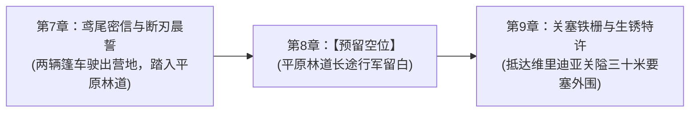

# 第一幕·阶段一：战后新生与两界相触详规（第 1 ~ 8 章）

> **所属方案**：[00_第二部主线与世界扩充方案总纲.md](file:///d:/Siegfried/世界书/方案/第二部/主线与世界扩充方案/00_第二部主线与世界扩充方案总纲.md) · [01_宏篇主线演进与阶段规划方案.md](file:///d:/Siegfried/世界书/方案/第二部/主线与世界扩充方案/01_宏篇主线演进与阶段规划方案.md) · [00_第一幕大纲与接口.md](file:///d:/Siegfried/世界书/方案/第二部/主线与世界扩充方案/分阶段详规/01_第一幕_破晓与边塞立足/00_第一幕大纲与接口.md)  
> **规划规模**：第一幕第 1 ~ 8 章（含 4 篇实写主线重章与 4 个预留节奏空位）  
> **更新时间**：2026-10-08  
> **定位**：故土远征序曲与两界建交篇。聚焦战后余波清剿、森林再生仪式、两界公文建交、暗影异化先兆、战备工坊非导力附魔整备与远征启程。所有文风与词汇严格遵循 [`lexicon.md`](file:///d:/Siegfried/世界书/.agents/rules/lexicon.md)。

---

## 一、 核心关卡设定与约束矩阵

| 维度 | 设定参数与铁律 | 违规红线防御 |
| :--- | :--- | :--- |
| **地理舞台** | Eldoria森林东侧泥沼、心木圣坛黑土台、石殿地下古代玄武岩坑道、时空裂隙幽蓝光幕、帝国东部边境废弃监测站、森林极北太古遗迹断柱、狼人隐谷岩台（LOC_D2_08） | 严禁模糊空间感；突出战后两周内森林泥土潮湿、植被新生与边境残垣断壁的物理质感 |
| **跨界公文** | **埃雷波尼亚帝国临时政府正式回应文书（红狮子火漆封印+马奇亚斯签署）** | **本公文仅在裂隙帝国侧及营地内部有效**，严禁带入维里迪亚关隘盘查使用 |
| **技术与装备** | 导力通信终端建立稳定专线；乔治工坊研制低外溢战术导力皮革外壳；法林使用出师磨制的【黑角木符文刻杖】与【附魔银刻针】（针尖嵌米粒微光晶石）在皮革与锁甲内衬雕琢微光防酸符文；菲娜注灵圣光符文石；爱丽榭备齐营地解毒药草囊与耐潮干粮；亚莉莎严查物资绝缘导力 | 原住民视导力光芒为异端妖术；所有跨界设备进入王国前必须完成物理遮蔽与伪装，严禁魔法与导力外溢 |
| **反派异动暗线** | 帝国东部边境出现的暗紫异变雾气；维里迪亚朱利安王子的试探性暗号密讯；教廷暗影实验档案抹除线索；反派对要塞军防与黑市的暗中控制 | 腐化源头未因 Thalion 死亡而彻底消失，暗影实验与高位面异化的更深网络初露端倪 |
| **命运驱策** | 艾德里安坦白城堡沦陷并非官方伪造的“工坊失火自毁与境外流寇袭领”；雷恩直面圣殿扩张背后的十四年流放杀机；两队践行出发 | 有条不紊的行商伪装与情报侦察，原住民主角主导自身命运，帝国伙伴作为坚强后盾 |
| **阶段支线** | **【支线·隐谷星空下的狼耳微风（亚莉莎 × 罗恩，LOC_D2_08）】**：商队出征前夜，亚莉莎在狼人隐谷岩台上核对账册行囊，夜风微凉，罗恩在其身后坐下，用温热厚实的狼耳和毛茸茸的尾巴轻轻绕住其双腿挡风；亚莉莎嘴上微嘟抱怨掉毛，手指却陷进罗恩颈项柔软绒毛中，在静谧星空下倾听彼此心跳。 | 强化旅途前夕温暖生活流与跨种族羁绊，严格绝缘任何修仙与古风文言词汇 |

---

## 二、 逐章详尽剧情演进（第 1 ~ 8 章）

### 第 1 章：泥沼残兽——青石初芽
* **阶段/路线**：第一幕·阶段一 / 森林后方防线与再生仪式
* **主要人物**：雷恩, 菲, 黎恩, 菲娜, 艾玛, 五族代表
* **核心意图**：战后余波清剿与生命再生双重闭环。以精妙冷兵器战术清剿东部泥沼变异影牙兽残余，并在向阳黑土高台举行古老心木再生仪式，五族献礼，黎恩与菲娜双力共振唤醒沉睡两百年的新芽。
* **时序情境推进**（共 6 条）：
  - 1. 晨雾低垂，东侧泥沼枯芦苇丛中积水泛着暗紫秽光，数十头受腐化残余刺激的变异影牙兽撕扯老树根系；雷恩反握长剑卡在浅滩乱石狭道，菲踏着枯枝凌空飞掠拉开高韧性细钢丝编织封锁网，截断兽群回冲路线。
  - 2. 黎恩沉腰踏步，未出鞘太刀精准格开扑袭恶兽的面门，刀鞘震击力道利落震碎两头影牙兽颌骨；群兽哀嚎后撤，试图转向侧翼泥潭逃窜。
  - 3. 菲娜双掌按覆湿滑水面，温润如金液的炽天使圣光顺着浅滩水网无声漫延，暗紫秽能触碰金流瞬间瓦解消融，残存群兽悲鸣四散，融入庞大古木根系的自然沉降循环。
  - 4. 战端收束，四人折返心木圣坛残迹旁的向阳黑土高台；矮人哈根带着工匠垒砌好的整齐青石矮墙已被清扫干净，狼人罗恩捧来清晨采摘带露的月光百合花瓣平铺基土，鳞母倾倒南泽活泉泥壶，艾玛在青石边角细致刻入魔女温床滋养符文。
  - 5. 菲娜自密封银盒中取出一枚通体莹白温润的太古心木种子，轻缓置入中央沃土深处；黎恩并肩半蹲于旁，两人右手虚覆于黑土之上，澄澈自控的鬼之力与纯净炽天使圣光于掌心交融流转，唤醒沉睡两百载的生命律动。
  - 6. 土层微微隆起，一簇裹着柔和光晕的青翠幼双叶挣破黑土在晨风中舒展，细微水珠顺着嫩叶尖端悄然滑落，渗入湿润的泥土中。
---

### 第 2 章：【预留空位】
* **定位**：剧情节奏留白 / 预留拓展空额
---

### 第 3 章：暗廊断闸——裂隙敕印
* **阶段/路线**：第一幕·阶段一 / 地底通路打通与裂隙建交
* **主要人物**：凯尔, 劳拉, 玲, 菲娜, 黎恩, 马奇亚斯
* **核心意图**：地底生命线打通与跨界公文规则确立。劳拉与凯尔力战清剿石殿地底盲眼硬壳兽群、合力推开封闭十四年的巨型青石水闸；黎恩独行穿过幽蓝裂隙会见帝国调查官马奇亚斯，正式交接临时政府互助公文，奠定两界互信。
* **时序情境推进**（共 7 条）：
  - 1. 凯尔手举松木火把，引队探入太古石殿地底干涸十四年的古代排水深廊，青石壁面残留着旧日腐化暗斑与利爪划痕；前方坍塌拐角处突现盘踞成团的盲眼多足硬壳兽群，喷吐腐蚀酸雾。
  - 2. 劳拉双手持拿宽刃大剑阔步踏前，极剑破空掀起狂暴风压生生劈碎当头重甲兽壳；玲操纵战术终端射出微型低爆震荡弹击碎侧壁浮石断其退路。
  - 3. 菲娜以圣光符文石轻点石壁裂隙，净化暗黑残渣；凯尔与劳拉合力扳动锈蚀青铜绞盘生铁长杆，卡死十四年的沉重青石巨门伴随沉闷轰鸣轰然挪开，地底主通路彻底贯通。
  - 4. 黎恩身披灰风衣，独自穿过中央裂隙缓缓流转的幽蓝光幕，踏足帝国东部边境长满枯草的废弃林业观测道，步入林间木造前哨站；守候通宵的帝国监察院调查官马奇亚斯推门相迎，二人于晨雾中用力握拳致意。
  - 5. 马奇亚斯在松木桌上郑重推过带有红狮子火漆封印的《帝国临时政府跨界通关与物资互助协议》，二人逐项核验保密级别、无线电频段与物资准入清单，严格敲定“绝不向外界暴露裂隙坐标”铁律。
  - 6. 协议核验无误，马奇亚斯拎出一只加固铁皮木箱，内装故土特产硬干酪、两块红茶砖与两罐高纯度导力机械润滑油，作为对两界基地的后勤馈赠。
  - 7. 黎恩将协议卷轴收入防水牛皮囊，拎起木箱转身步入幽蓝光幕；观测站外的寒风吹拂落叶，在木门合拢的轻响声中重归静寂。
---

### 第 4 章：虚空微澜——心眼探阵
* **阶段/路线**：第一幕·阶段一 / 空间律动排查与太古断层勘定
* **主要人物**：黎恩, 菲娜, 艾玛, 乔治
* **核心意图**：紧接建交公文，多重位面异动线索交织与跨界坐标测绘。帝国东境突发紫雾引发鬼之力共鸣；艾玛与乔治监测裂隙每分钟三次金芒吐息；黎恩独行极北太古遗迹群，以八叶心眼与极度收敛的鬼之力勘定三处古代断层坐标，彻底夯实空间稳定性。
* **时序情境推进**（共 6 条）：
  - 1. 导力通讯终端荧绿指示灯急促跳动，马奇亚斯传来密电：帝国东部森林接连出现家畜狂暴与带暗紫光斑的畸变狼尸；黎恩与菲娜在工坊石台比对森林残区样本，确认二者侵蚀频谱完全同源，黎恩体内澄澈的鬼之力随之泛起共鸣微澜，直指深层世界外侧之谜。
  - 2. 菲娜深知远征凶险，当即引炽天使圣光注入三十枚高纯度石髓，为远征队与留守同伴赶制微光防护挂坠，温润光芒抚平了空气中残留的躁动。
  - 3. 黄昏幽蓝裂隙边缘泛起规律性的淡金色光芒脉动，每分钟三次，宛如某种沉眠高位维度的生物吐息；艾玛手持雕木法杖以羽毛笔飞速描摹空气中游离的以太波形，乔治用示波器比对排除七属性导力回路，菲娜将素白手掌贴近光幕，共鸣颤音回荡室内。
  - 4. 子夜时分，黎恩腰佩太刀独行踏入森林极北荒芜千年的太古遗迹断柱群；荒草在夜风中倒伏，四下一片死寂，唯有残破玄武岩柱巍然矗立。
  - 5. 黎恩敛息闭目，八叶一刀流【心眼】无声铺展，感知空间织锦的细微褶皱与地脉暗涌；眼眸微启泛起澄澈暗红，极度内敛的鬼之力顺着脚底石缝如细针延伸，精准锁定深埋地底三处错位断层节点的以太交叉点。
  - 6. 羊皮纸图卷上被炭笔工整描摹出三组坐标方位与倾角；黎恩收刀归鞘，夜风拂过额前碎发，太古石柱投下的阴影在月光下悄然拉长。
---

### 第 5 章：【预留空位】
* **定位**：剧情节奏留白 / 预留拓展空额
---

### 第 6 章：【预留空位】
* **定位**：剧情节奏留白 / 预留拓展空额
---

### 第 7 章：鸢尾密信——断刃晨誓
* **阶段/路线**：第一幕·阶段一 / 故土远征决策与武装整备
* **主要人物**：艾德里安, 雷恩, 黎恩, 菲娜, 劳拉, 菲（工坊整备：法林, 亚莉莎, 爱丽榭, 乔治）
* **核心意图**：全队远征维里迪亚王国的关键转折点。朱利安王子鸢尾花暗信破译，艾德里安首度披露城堡覆灭实为教廷暗影实验外泄与官方公文抹杀；雷恩亮出手腕被废黜的流放烙印立誓清算；法林以附魔银刻针与黑角木杖为全员铠甲内衬雕琢微光防酸符文；双马篷车套索整肃，踏上未知征途。
* **时序情境推进**（共 7 条）：
  - 1. 晨光穿透林间木屋，乔治展开昨夜解密的短波信函——信底印有维里迪亚王室鸢尾花暗号，言明艾斯特雷亚旧领暗影死灰复燃，圣殿骑士团借平叛之名全境扩权；艾德里安取出一枚边缘焦黑的家族黄铜徽章，冷声揭开十九年前城堡覆灭并非官方谎称的“工坊失火自毁与境外流寇血洗”，而是教廷秘密暗影兵器外泄引发的惨剧，官方文书纯属抹杀封口之作。
  - 2. 雷恩挽起亚麻衣袖，露出手腕上十四年前被教廷私刑烙铁烙下的灰质废黜印记，晨光剑势在掌心沉凝成锋，坦言自己绝非贪生背叛，此行必须重返故国当面清算大团长阿达尔伯特的罪愆；全员目光交汇，商定以北方商队为伪装深入关隘。
  - 3. 后勤工坊火星四溅，矮人工匠法林手持黑角木符文刻杖与嵌有微光晶石的附魔银刻针，全神贯注在粗牛皮马甲与锁子甲内衬雕画抗蚀微光符文，每一笔刻痕皆渗入微晶粉末以御酸蚀。
  - 4. 亚莉莎严密排查篷车货物，以厚重铅箔与吸波纤维完全隔绝一切导力装置外泄；爱丽榭将分装好的解毒药囊、耐潮干肉块与干酪饼整齐码入防水箱，备足两周野外补给。
  - 5. 乔治为两辆双马篷车加装厚重粗亚麻帆布遮帘与浸油牛皮导力阻断外壳；艾德里安换上磨损短斗篷佩戴旧商牌，黎恩与菲娜换上简朴旅人布衣，雷恩与劳拉潜入后车暗格，菲跃上车顶侧翼侦察。
  - 6. 出征前夕全员于石阶前握拳相视，无声立下守护两界与揭穿真相的重誓，战马轻打响鼻踏动马蹄。
  - 7. 铁铸马蹄踩碎晨露覆压的枯枝，两辆双马篷车穿过营地木栅滑入幽深的大平原林道，湿润车辙在渐起的晨雾中向远方平缓延展。
---

### 第 8 章：【预留空位】
* **定位**：剧情节奏留白 / 预留拓展空额
---

## 三、 第一幕两阶段承接核验

* **时空无缝咬合**：第 7 章结尾篷车套绳启程，经第 8 章长途跋涉节奏留白，第 9 章开篇直落峡谷主驿道与三十米玄武岩关隘外围；
* **装备状态延续**：第 7 章乔治交付的粗亚麻遮蔽帆布、牛皮导力阻断套与艾德里安的北方商贸行会旧印牌，在第 9 章入关交涉中全量严丝合缝实装展现。
