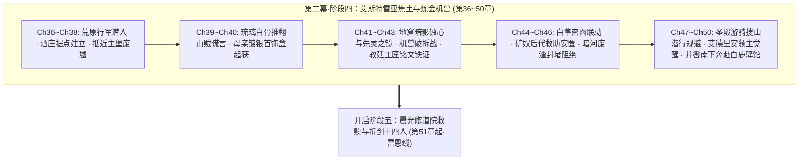

# 第二幕·阶段四：艾斯特雷亚焦土与炼金机兽详规（第 36 ~ 50 章）

> **所属方案**：[00_第二部主线与世界扩充方案总纲.md](file:///home/nanhu2/comfyui/世界书/方案/第二部/主线与世界扩充方案/00_第二部主线与世界扩充方案总纲.md) · [01_宏篇主线演进与阶段规划方案.md](file:///home/nanhu2/comfyui/世界书/方案/第二部/主线与世界扩充方案/01_宏篇主线演进与阶段规划方案.md) · [00_第二幕大纲与接口.md](file:///home/nanhu2/comfyui/世界书/方案/第二部/主线与世界扩充方案/分阶段详规/02_第二幕_分道巡礼·虚妄的线索/00_第二幕大纲与接口.md)  
> **规划规模**：十幕·三十阶段·310~340章长篇史诗体系  
> **更新时间**：2026-09-29  
> **定位**：第二幕主线A首战破局篇。聚焦艾德里安与菲深入中西部丘陵旧领废墟深度勘查、十九年前家族覆灭真相与父亲学者遗志揭秘、母亲镀银首饰盒与日记残篇起获、十九年封印之【暗影实验畸变体】清剿、古老先灵埃尔德莱恩借【先灵之镜】坚固意志、重装发条机兽【暗影噬光傀儡】核心破拆 Boss 战、教廷秘库工匠印号铁证起获、以及与法尔肯中枢的白隼信记联动。严守“纯正西欧封建与轨迹 JRPG 文风”、“绝对零导力物理战技”、“防同质化五感轮换”与“docs2 实体卡完全咬合”。

---

## 一、 核心关卡设定与约束矩阵

| 维度 | 设定参数与铁律 | 违规红线防御 |
| :--- | :--- | :--- |
| **地理舞台** | **艾斯特雷亚酒庄**：城堡东南5km，半地下葡萄酿酒坊，大橡木桶长廊盲区，前哨休整与疗伤据点。 **艾斯特雷亚堡**：中西部丘陵腹地，断折主塔、焦黑内城垣、坍塌中庭与双剑鹫鹰纹章。 **暗影地窟**：城堡塌陷地基下数十米，断裂倾斜肋拱石梁空腔，古代暗影实验失控核心点。 **太古秘书库（LOC_D2_29）与古木南缘（LOC_D2_01）**：后方支线舞台。 | 严格依照 `LOC_D2_13`、`LOC_D2_37`、`LOC_D2_14` 物理格局；严禁现代与中式结构，全域依赖粗石、风化羊毛织毯、发酵橡木桶与断裂花岗岩。 |
| **反派武力与威胁** | **暗影实验畸变体**（CRT_D2_02）：被教廷封印囚禁十九年的古代人体畸变生物，骨骼扭曲，血肉附生黑晶； **暗影噬光傀儡**（CRT_D2_06）：高3米重装发条战兽；高抗冲黑钢重甲；背部黄铜排气减震阀；微型重力迟滞力场；胸腔无光黑晶永动核心；齿轮刻有教廷工匠印号； **暗影忏悔者**（CRT_D2_07）与**破誓黑血狂骑**（CRT_D2_08）：外围暗线与后续兵力铺垫。 | 严格执行《方案四：反派双重武力体系与战斗机制方案》；严禁神化与魔法对轰，必须由高机动猎兵破除减震排气阀后，由纯物理突刺破坏传动轴。 |
| **时间线与历史真相** | **两段式历史架构**：三十一年前教廷秘密启动暗影实验（克莱门特三世上任）；十九年前实验失控导致艾斯特雷亚城堡陷落覆灭，时年6岁的艾德里安（现年25岁）由母亲嘱托逃出。 **灭门真相揭露（父亲学者遗志）**：父亲当年作为古代工法学者发现教会试图利用古代黑晶量产人体杀戮机兽，毅然封存核心发条图纸抗命拒绝交出，方遭克莱门特下令伪造山贼灭族！ | 严禁出现“25岁主角逃出31年前惨案”的时序数学漏洞；严格统一“31年暗影实验历史”与“19年前城堡陷落惨案”；严禁将灭门单纯归结于强盗袭扰。 |
| **神圣实体与先灵之镜** | **古老先灵埃尔德莱恩（NPC_D2_22）**：Eldoria森林最初守护者，数千岁，Seraphina远祖，半透明古老精灵灵体，银发金瞳，持有神圣秘宝【先灵之镜】；于地窟危局借水雾镜影映照当年灭口真相，坚固同伴意志。 | 严格遵循 docs2 实体卡规范；严禁全知全能插手凡人战斗，仅在精神侵蚀危机下提供心灵与记忆指引。 |
| **地缘政治与领主分肥** | 废墟外围遭遇**中西部平原领主（亨里克边境伯领地采邑私兵）**低价承租矿区私兵盘查与阻拦，直面当年灭门背后地方大贵族冷漠分肥的现实；大理院首席法官**瓦卢瓦伯爵（NPC_D2_20）**暗中对王室旧卷保持关注。 | 展现封建大领主阶层在教会免税恩惠与圣殿苛税间的冷漠分肥，为大陪审团法理反击埋线。 |
| **防同质化轮换** | **五感物象分阶轮换**： *气候音响*：喀斯特荒原秋风、断壁风化穿堂风呜咽、生锈发条齿轮沉闷咬合与铜阀高压排气声； *饮食行囊*：野外行装干粮包（浸冷水泡发咸肉干与硬燕麦干酪饼）、防腐杜松子烈酒、酒庄地下三十年老橡木桶微酸葡萄酒。 | 绝对绝缘第一幕的“法尔肯集市喷泉、老驿馆麦酒、热香料苹果酒、硬黑麦面包”；彻底告别温润市井生活流，进入荒原与地下城硬核探险质感。 |
| **战术与伪装** | 全员身披深色粗呢旅行斗篷；ARCUS 导力器深锁于乔治特制牛皮阻断套中；武器为双枪剑（菲）与家传刺剑（艾德里安），纯凡人肉体感官与冷兵器碰撞。 | 绝对零导力外溢；严禁魔法闪光；菲娜与黎恩留守法尔肯驿镇作为后方联络中枢，不抢夺艾德里安命运动能。 |

---

## 二、 逐章详尽剧情演进（共 15 章）

### 第 36 章：晨雾离镇与喀斯特丘陵——深入中西部丘陵旧领
* **阶段/路线**：第二幕·阶段四 / 荒原潜入与隐秘行军
* **主要人物**：艾德里安, 菲
* **核心意图**：主线A二人组拂晓离开法尔肯驿镇，避开王国主驿道圣殿巡逻哨，深入中西部崎岖荒凉的喀斯特丘陵荒原，以猎兵行军标准建立野外反追踪默契。
* **时序情境推进**：
  - 1. **晨雾离镇**：黎明破晓前，艾德里安与菲策马由迷迭香商行后巷暗道穿出法尔肯北哨口；两人均深罩粗呢防风短斗篷，避开主驿道圣殿白鹰轻骑巡逻哨卡，转入通往中西部丘陵的荒芜碎石马道。
  - 2. **喀斯特地貌与斥候搜寻**：进入连绵起伏的灰色石灰岩荒原，秋风扫过半人高的枯黄棘草；菲伏在马鞍上仔细观察沿途兽道折断痕迹与雨蚀石缝，确认后方数公里内无任何教廷密探或战鹰追踪。
  - 3. **风化岩洞冷餐休整**：正午两人在一处避风的风化石穴阴影中暂歇饮马；菲取出防水油布包裹的行囊干粮包，以冰冷泉水泡开坚硬的风干咸肉干与干酪燕麦饼充饥，递给艾德里安一银皮壶防腐杜松子烈酒。
  - 4. **眺望旧领地平线**：艾德里安咽下辛辣烈酒，解开领扣注视地平线尽头耸立的灰黑山脊，少见地收起了轻浮调侃的笑容，眼神逐渐凝铸如铁。
---

### 第 37 章：荒芜的老葡萄藤——艾斯特雷亚酒庄
* **阶段/路线**：第二幕·阶段四 / 前哨据点与酒庄安全屋
* **主要人物**：艾德里安, 菲
* **核心意图**：抵达城堡东南五公里处的附属酒庄，排查半地下酿酒坊与大橡木桶长廊盲区，建立深入主堡废墟的隐蔽后方前哨。
* **时序情境推进**：
  - 1. **踏足荒废庄园**：穿过漫山遍野如扭曲铁丝般肆意抽枝的野老葡萄藤，两人踏入古老青石坡顶的艾斯特雷亚酒庄；石墙生满斑驳苔藓，四周万籁俱寂。
  - 2. **排查半地下酒窖**：菲拔出双枪剑推开倾斜厚重的栎木外门，以猎兵战术手语搜索半地下拱形酿酒坊；地下空气阴凉干燥，弥漫着陈年发酵橡木、微酸葡萄果皮与干草的醇香，未见任何魔兽侵占痕迹。
  - 3. **勘验橡木桶盲区暗室**：穿过两排高达两米半的陈年大橡木桶长廊，推开尽头被空酒桶掩挡的庄园主起居暗室；室内配有铺陈旧羊毛褥的完好木板床与干燥石壁炉，为绝佳的密闭据点。
  - 4. **泥封陈年酒的慰藉**：艾德里安用短刀划开石壁凹龛中一坛保存完好的陈年红酒泥封，倒出两粗陶杯暗红酒液，低声自嘲：“十九年了……酒庄的土还是当年的酸涩味。”菲抿了一小口，平静回复：“保存得很好。适合战后缝针消毒。”
---

### 第 38 章：毒荆棘缠绕的双剑鹫鹰——抵近主堡废墟
* **阶段/路线**：第二幕·阶段四 / 废墟突入与外围清缴
* **主要人物**：艾德里安, 菲
* **核心意图**：两人穿过古代毒荆棘带，避开邻境平原大领主私兵盘查，抵近艾斯特雷亚堡，直面当年地方大贵族冷漠分肥的现实与焦黑残垣上的家族双剑鹫鹰纹章。
* **时序情境推进**：
  - 1. **邻境领主私兵盘查与潜行规避**：抵达外围废矿区时，两人遭遇邻境平原大领主（亨里克边境伯属下采邑）低价承租矿区的私兵哨卡盘查；艾德里安目睹祖地矿山被地方贵族瓜分租售、矿奴后代遭残酷驱使，直面当年灭门背后封建大领主阶层冷漠分肥的冰冷现实；菲利用猎兵暗影潜行与声东击西，掩护二人无声绕过哨卡。
  - 2. **穿越毒荆棘壕沟**：离开酒庄徒步潜行至城堡山脚，干枯开裂的护城壕被带有倒钩与暗紫毒斑的古代荆棘严密覆盖；菲利用轻量钩爪与多股钢索在悬崖凸石间开路，掩护艾德里安避开毒刺陷阱。
  - 3. **主堡废墟轮廓**：翻上丘陵之巅，十九年前沦为焦土的艾斯特雷亚堡赫然呈现眼前——折断的高耸主塔如同刺向灰天的焦黑断骨，坍塌的内城垣在秋风中瑟瑟作响。
  - 4. **肃立于双剑鹫鹰纹章前**：主城门巨石门梁严重倾斜，但石梁正中央浮雕的艾斯特雷亚家族“双剑鹫鹰”家徽依然清晰可辨；艾德里安伸手抚摸被烈火熏黑的石刻凹槽，指节微颤，童年火海的惨叫在耳畔隐隐轰鸣。
  - 5. **无声绞杀外围游荡兽**：废墟中庭传来低沉嘶吼，两头栖息在塌方城垛的残区变异猎犬被生人气息惊动；菲如白色飞燕疾掠而出，双枪剑反手划出两道无声冰冷弧光，利落切断野兽喉管，打出“通路肃清”手势。
---

### 第 39 章：坍塌回廊与琉璃白骨——十九年前的焦痕
* **阶段/路线**：第二幕·阶段四 / 现场法医勘查与谎言推翻
* **主要人物**：艾德里安, 菲
* **核心意图**：深入焦黑领主大厅瓦砾堆，排查当年死难卫士骸骨，通过骨骼反常的“微紫琉璃化与酸蚀空洞”，在法理与物理层面彻底推翻教廷“山贼夜袭洗劫”的官方假案。
* **时序情境推进**：
  - 1. **领主大厅废墟**：中庭碎石散落着大量锈成黑渣的折断长戟与铁盾牌，日光穿过坍塌穹顶投下惨白斜照；当年华丽的拱顶壁画已化为炭黑硬壳。
  - 2. **挖掘坍塌梁柱**：菲凭借资深猎兵对战场的直觉，在一处倾斜卡死的巨大花岗岩承重梁下发现了几具被倒塌碎石深埋的古代家族骑士骸骨。
  - 3. **惊骇的焦骨异象**：菲戴上加厚牛皮手套清理骸骨上的灰烬，将一根折断的肋骨残片举至光下；骨骼截面并非粗糙的刀砍斧劈痕迹，而是呈现出极度诡异的**微紫琉璃化高温结晶**，骨髓腔布满了蜂窝状强酸腐蚀空隙！
  - 4. **推翻山贼官方定性**：菲冷声分析：“这不是冷兵器砍杀，也不是常规火灾。高温瞬间超过千度，且混杂强腐蚀炼金酸液……只有私造兵装的高阶炼金工坊爆炸才有这种痕迹。”艾德里安脸色铁青，牙关紧咬：“山贼连精钢马刀都凑不齐……教廷当年就是用这种谎言抹杀了我整个家族！”
---

### 第 40 章：母亲的镀银首饰盒与父亲日记——暗阁绝笔与学者遗志
* **阶段/路线**：第二幕·阶段四 / 私密创伤与学者遗志
* **主要人物**：艾德里安, 菲
* **核心意图**：艾德里安在母亲起居书房废墟的壁炉暗格中，起获母亲遗留的镀银首饰盒、近卫绝笔信与父亲生前日记残篇；揭开艾斯特雷亚家族因坚拒教会暗影工程而遭屠戮的崇高真相，情感压抑克制，淬炼出继承父志的领主道义动能。
* **时序情境推进**：
  - 1. **西翼书房残迹**：穿过开裂的连廊，艾德里安领着菲进入母亲生前起居的书房废墟；花岗岩书架全部风化坍塌，唯有角落那座雕刻着忍冬草花纹的黑理石壁炉依然半立。
  - 2. **撬开壁炉暗龛**：艾德里安按照六岁时母亲悄悄演示的机关，以佩剑尖端刺入壁炉烟道右侧第三块石缝深处；沉重机括弹开，壁后暗洞里露出一只被油蜡布层层包裹的古旧硬木匣。
  - 3. **母亲银盒与父亲学者日记（学者遗志揭秘）**：解开油布，里面整齐放着母亲当年的镀银雕花首饰盒、一把折断的家族短剑、近卫队长绝笔血书，以及**父亲生前亲笔撰写的《古代工法与发条动力考录》残篇**！日记字迹苍劲而沉痛，揭开当年灭门的惊天真相——艾德里安之父并非寻常旧贵族，而是一位深谙古代遗迹工法的卓越学者；三十一年前克莱门特主教以教会名义拉拢其破解地下古代暗影黑晶，父亲耗费十余年研究后惊骇发现教会的野心是在地下量产恐怖的人体生化机兽以取代世俗王权与修会武装；父亲在大义前毅然抗命，秘密封存并销毁了全部核心差速齿轮图纸，拒绝交予教会，克莱门特主教恼羞成怒之下方才动用暗部机兽屠杀灭门并嫁祸山贼！
  - 4. **压抑克制的痛楚与誓言**：首饰盒内静静躺着艾德里安六岁时的一缕淡金色胎发；父亲的学者之志与母亲的临终推拒化作穿透岁月的千钧重担。艾德里安眼眶通红，手指死死攥紧银盒边缘直至指节泛白，深吸一口冷气沉声道：“父亲直到死都没有交出杀人机关的钥匙……艾斯特雷亚不是山贼手下的冤魂，这笔账，我要教廷千百倍偿还。”菲默默背过身立于门廊断柱旁横剑戒备，留给贵族最后的自尊空间。
---

### 第 41 章：暗影实验畸变体与先灵之镜——沉闷齿轮的苏醒
* **阶段/路线**：第二幕·阶段四 / 地窟潜入、畸变体清剿、先灵之镜与巨兽苏醒
* **主要人物**：艾德里安, 菲, 古老先灵埃尔德莱恩（NPC_D2_22，意识投影）
* **核心意图**：顺地基坍塌孔道深入地窟，清剿被教廷封印十九年的暗影实验畸变体，起获当年人体生化实验铁证；艾德里安遭瘴气侵蚀陷入幻觉，古老先灵埃尔德莱恩动用先灵之镜坚固其意志；随后重型发条战兽【暗影噬光傀儡】破闸苏醒。
* **时序情境推进**：
  - 1. **下行暗影地窟**：两人顺着塌方斜坡绳降数十米，踏足城堡地基深处的暗影地窟；断裂倾斜的花岗岩肋拱间充斥着刺鼻的硫磺、润滑机油与暗影废渣的微温异味。
  - 2. **遭遇十九年暗影实验畸变体**：在前室断壁深处，一头被锈蚀铁链拘禁十九年的【暗影实验畸变体】（CRT_D2_02，古代人体实验失控造物，骨骼扭曲变异，附生坚硬黑晶）咆哮扑出；菲以极速滑铲挑断其韧带，艾德里安沉腰出剑精准刺穿其心口黑晶核将其净化解脱，彻底证实了十九年前城堡被毁的真正元凶是教廷生化失控！
  - 3. **暗影蚀心毒与幻觉崩溃**：畸变体爆散出浓稠的古代暗影瘴气；艾德里安吸入毒雾，十九年前大火惨案的尖叫与父亲倒下的血泊在脑海中炸裂，双眼爬上可怖黑血血丝，身躯剧颤、拔剑狂乱劈向虚空，心智濒临彻底崩溃；菲急忙横剑架住，捏碎圣光符文石试图压制却难挡深层心魔。
  - 4. **埃尔德莱恩与先灵之镜显现**：千钧一发之际，地底深潭水面骤然泛起澄澈空灵的金绿微光；Eldoria森林最初守护者——古老先灵埃尔德莱恩（半透明古老精灵灵体，银发金瞳）的身影借由镜湖共鸣短暂显现，声音清澈庄严直入灵魂，传授净魂律动震散蚀心黑煞；先灵引动神圣秘宝【先灵之镜】，在水雾光影中短暂映照出十九年前教廷司铎泼洒炼金药水、纵火灭口并伪造山贼袭击的冰冷历史真相，点醒暗影与世界外侧污染的古老同源真相，彻底坚固了艾德里安直面血仇与继承父志的领主意志！
  - 5. **铁闸碎裂与机兽登场**：艾德里安眼神彻底清明如铁，两人踏入地窟深处；当菲踏过断裂高压铜管时，重型压力感应齿轮骤然触发，锻铁厚闸门被生生撕开，高达三米、重达数吨的重型发条战兽——**暗影噬光傀儡**破土踏出，双眼亮起妖异暗紫光晕，黄铜排气阀高压喷吐，大战爆发！

---

### 第 42 章：猎兵飞索与家传突刺——暗影噬光傀儡破拆战（核心 Boss 战）
* **阶段/路线**：第二幕·阶段四 / 战术破拆与冷兵器绝杀
* **主要人物**：艾德里安, 菲
* **核心意图**：面对微型重力迟滞力场与高抗冲黑钢重甲，菲发挥猎兵高空机动与定向爆破炸毁背部排气减震阀，艾德里安以艾斯特雷亚家传刺剑战技穿刺传动齿轮主轴，合力完成纯物理战术破拆。
* **时序情境推进**：
  - 1. **重力迟滞力场受阻**：傀儡胸腔的无光黑晶嗡鸣加速，周身十米骤然张开微型重力迟滞力场；菲射出的轻型飞刃在空中被力场骤然减速坠地，正面轻量物理劈砍完全无法穿透其厚重黑钢重甲。
  - 2. **高空滑轮钢索机动**：菲利用滑轮钢索在地窟四根石柱与拱梁间高速摆荡，利用高敏捷身手完全切入机兽笨拙转身的视线盲区；机兽狂暴挥爪横扫，只砸碎了菲留下的残影石柱。
  - 3. **定向爆破炸毁排气阀**：菲如燕雀般自半空俯冲，身形轻巧落于机兽后背，双枪剑精准刺入机兽颈后高压铜管接缝并塞入定向破拆炸药；轰然爆鸣中，机兽背部核心黄铜散热排气阀被彻底炸碎，高压蒸汽疯狂外泄，机体减震系统瞬间瘫痪！
  - 4. **艾斯特雷亚致命贯穿**：失去减震的傀儡行动严重卡顿，齿轮发出尖锐啸叫；艾德里安抓住破绽，低重心瞬步突进至机兽右侧死角，调动全身战技力量，家传长剑如流星贯日般刺入傀儡右胸与传动轴咬合的毫厘缝隙！
  - 5. **终局切断核心**：剑尖刺断传动主轴，机兽庞大躯体轰然失去平衡单膝跪地；菲凌空倒悬而下，双枪剑尖垂直扎入滴水兽后颈中枢神经管路，彻底粉碎动力链条！
---

### 第 43 章：教廷秘库的工匠印号——铁证确凿
* **阶段/路线**：第二幕·阶段四 / 战果收缴与法理铁证
* **主要人物**：艾德里安, 菲
* **核心意图**：两人破拆傀儡残骸，取出核心“无光黑晶”，在重型发条齿轮内圈赫然发现深深烙印的“教廷秘库工匠序列号”，掌握枢机主教克莱门特三十一年罪证的最硬核物理铁证。
* **时序情境推进**：
  - 1. **破拆残骸胸腔**：地窟中弥漫着刺鼻的烧焦机油与硫磺烟雾；菲用撬棍强行掀开傀儡胸腔扭曲变形的黑钢装甲外壳，露出咬合精密的巨型内部齿轮组。
  - 2. **取出无光黑晶核心**：菲以耐腐蚀牛皮手套小心翼翼取下胸腔正中散发冰冷微引力波动的“无光黑晶”原石，封入乔治特制的铅制阻断盒内并旋紧螺栓。
  - 3. **发现教廷工匠铭文**：艾德里安举起火把照亮主齿轮传动圈内壁，拭去焦黑的润滑油泥，一行深深冲压在纯青铜金属上的古代工匠铭文与徽记清晰显露：`Curia Secreta - Opus XXXI - Anno 3441`（**教廷秘库·第三十一号工造·圣光纪元3441年**，正是三十一年前克莱门特三世启动古代暗影工程的立项年份）！
  - 4. **铁证落定**：齿轮边缘甚至还残留着未完全风化的晨光教廷特使火漆印章残痕；艾德里安深吸一口冷气：“制造编号、年份、教廷秘库专有工印……当年暴走的兵器，根本就是克莱门特这帮神职人员亲手送进城堡地下的！”
---

### 第 44 章：风暴前夕的信鸽与回流——北地废墟的誓言（阶段四收官）
* **阶段/路线**：第二幕·阶段四 / 战后回流与誓言升华
* **主要人物**：艾德里安, 菲（中枢联动：黎恩, 菲娜）
* **核心意图**：撤回酒庄暗室整备疗伤，菲将拓片与密函绑上白隼发往法尔肯中枢；艾德里安独处面对母亲遗物彻底宣泄悲恸，淬炼出向教廷神权发起大审判的决然道义动能。
* **时序情境推进**：
  - 1. **酒庄暗室休整**：黄昏两人撤回艾斯特雷亚酒庄地下起居暗室；菲动作熟练地用烈酒清洗艾德里安手臂被装甲刮破的皮肉，敷上止血草药膏并绑好粗麻绷带，随后悄然退出带上木门。
  - 2. **暗夜信鸽联动**：酒庄露台上，菲将缩微的齿轮拓片与密函缝入特制羽毛囊，系在北方白隼脚爪上抛向铅灰色的阴云天幕；白隼振翅疾飞，向南方河谷法尔肯的黎恩中枢送出一级战备情报。
  - 3. **法尔肯中枢震动**：深夜法尔肯老驿馆二楼，黎恩与菲娜在煤油灯下展开白隼密函；教廷秘库工匠序列号与琉璃白骨铁证让黎恩目光骤紧：“教会三十一年来的黑幕遮羞布已经被撕开了……通报雷恩与劳拉，准备在白鹿大驿馆展开阶段汇合。”
  - 4. **独处宣泄与极剑誓言**：酒庄起居暗室中，艾德里安独坐于烛火摇曳的木床边；捧着母亲冰冷的镀银首饰盒与金色胎发，十九年来深藏心底的痛楚终于无声冲破堤防，滚烫泪水砸在银盒上；但他没有沉溺太久，抬手擦净脸庞，眼神冰冷如刃，抚剑立誓：“艾斯特雷亚的名字绝不会背着山贼的污名死去……克莱门特，王都法庭上见。”
---

### 第 45 章：废弃酒庄的地下烛火——幸存矿奴后代的安置与口粮
* **阶段/路线**：第二幕·阶段四 / 领民救护与民心归拢
* **主要人物**：艾德里安, 菲, 矿奴老工匠巴特
* **核心意图**：艾德里安与菲将在暗影地窟外围解救出的十余名矿奴后代转移至酒庄地窖，分发燕麦干酪口粮与清创草药，艾德里安以领主之子身份重聚故土民心。
* **时序情境推进**：
  - 1. **地窖安置**：潮湿的酒庄地窖中，矿奴后代衣衫褴褛、面色惨白；老工匠巴特满手结痂黑血，认出艾德里安领口的双剑鹫鹰家徽，颤抖着跪地痛哭。
  - 2. **伤口清创与分粮**：菲动作利落地用烈酒为伤者拔除发炎毒刺，敷上爱丽榭配制的止血草膏；艾德里安将马鞍驮囊里的硬黑麦饼与浓缩肉干泡发，亲自分发到每个饥肠辘辘的孩子手中。
  - 3. **领民的证言**：老巴特含泪吐露：十九年前城堡大火当夜，教会不仅封死了主门，更将私兵伪装成山贼将矿区幸存者抓捕为黑晶矿奴，日夜强迫挖掘黑晶。
---

### 第 46 章：矿渣暗河与废弃竖井——黑晶矿区地下毒害阻绝
* **阶段/路线**：第二幕·阶段四 / 隐患清理与机关破坏
* **主要人物**：艾德里安, 菲
* **核心意图**：重返塌方竖井切断通往下游水网的暗影废渣排污道，利用机兽残骸重铁卡死污染源，彻底消弭旧领水源毒患。
* **时序情境推进**：
  - 1. **排查排沙盲渠**：两人顺着暗河流向探查，发现深坑下方有一道生铁铸造的排污闸板早已锈蚀断裂，黑晶废渣正缓慢渗入地下泉眼。
  - 2. **物理封堵**：菲以猎兵滑轮组悬吊暗影噬光傀儡的重型废铁足甲，艾德里安合力将其推入排污口，以数吨重装甲彻底卡死渗漏裂隙。
  - 3. **泉水复清**：暗黑浊流被硬生生阻截，原本泛着刺鼻硫磺味的暗河水面逐渐泛起原本澄澈的地下冷泉涟漪。
---

### 第 47 章：圣殿游骑的搜山——喀斯特岩洞中的潜伏与消痕
* **阶段/路线**：第二幕·阶段四 / 反侦察与荒原伏匿
* **主要人物**：艾德里安, 菲, 圣殿巡逻小队
* **核心意图**：机兽破坏引发的震动引来外围圣殿白鹰巡逻队搜山，菲展现西风猎兵巅峰潜行战术，掩护酒庄与领民不留一丝痕迹。
* **时序情境推进**：
  - 1. **战马嘶鸣**：清晨丘陵荒原传来急促的马蹄声与犬吠，圣殿白鹰副队长率领十名重装骑兵巡查焦黑内垣。
  - 2. **猎兵消痕战术**：菲伏在风化石洞顶端，用泥土与枯草抹去沿途车辙马粪，并点燃微量湿艾草散发羊膻味掩盖人味，巡逻猎犬在洞口转了三圈无功而返。
  - 3. **骑兵退去**：圣殿巡逻队仅以为是地基古代断层自然塌陷，随手插上一面黄色警示三角旗后勒马离去。
---

### 第 48 章：酒窖深处的橡木桶——艾德里安的领主觉醒
* **阶段/路线**：第二幕·阶段四 / 角色心性蜕变与家传剑术升华
* **主要人物**：艾德里安, 菲
* **核心意图**：在酒庄地下独处，艾德里安拔出家传刺剑在烛火下重新演练剑术，褪去游侠轻浮，正式接纳作为艾斯特雷亚家族最后法理领主的沉重使命。
* **时序情境推进**：
  - 1. **独处练剑**：昏暗的酒窖大橡木桶长廊间，艾德里安持剑静立；剑锋如点点寒星在空气中刺出道道利落风声，不再是浪荡游侠的街头防身把式，而是沉稳严正的封建家传正统剑势。
  - 2. **菲的并肩肯定**：菲坐在酒桶上，一面细嚼硬肉干一面端详：“剑锋比在法尔肯时稳多了。现在的你，像个能带人打胜仗的头领了。”
  - 3. **立誓收复故土**：艾德里安收剑入鞘，坦然迎向菲的目光：“艾斯特雷亚的领民等了十九年。等打垮教会那天，我要让这片山坡重新种满紫葡萄。”
---

### 第 49 章：白隼带来的修道院密报——双线情报对接
* **阶段/路线**：第二幕·阶段四 / 跨线情报联动
* **主要人物**：艾德里安, 菲（中枢/西线联动：雷恩, 劳拉, 黎恩）
* **核心意图**：酒庄露台迎来法尔肯中枢中转的信鸽，接获雷恩与劳拉西进晨光修道院的关键进展，确认教廷正向平原集结兵力。
* **时序情境推进**：
  - 1. **白隼落肩**：薄暮时分，一只矫健的北方白隼划破阴云稳稳落在菲的皮护腕上；脚筒中取出带有法尔肯秘密刀刻印记的微缩羊皮纸条。
  - 2. **雷恩西线消息**：密报通报雷恩与劳拉已突破修道院外围盘查，成功与药舍修女艾琳娜接头，正在提取十四年前拒绝屠杀的圣殿老兵名册原本与教会黑账。
  - 3. **风暴正在汇聚**：然而教廷异端审问厅执行官达米安已察觉异动，暗影私兵与白鹰铁骑正向平原大道的白鹿大驿馆方向调动。
---

### 第 50 章：废墟暗影暂息与白鹿驿馆之约——主线A首战告捷
* **阶段/路线**：第二幕·阶段四 / 阶段四总收官与大合流前奏
* **主要人物**：艾德里安, 菲, 矿奴后代
* **核心意图**：阶段四总收官。艾德里安将酒庄安全屋与矿奴安置托付给忠诚老工匠，携第一份核心物理铁证（教廷工匠序列号齿轮与琉璃白骨），与菲并辔南下，奔赴白鹿大驿馆三线会师。
* **时序情境推进**：
  - 1. **托付酒庄**：临行前，艾德里安将剩余口粮与防身利刃交给老巴特，叮嘱领民紧闭地窖暗门隐蔽待命：“等平原大道钟声敲响，就是我们正大光明重回城堡的日子。”
  - 2. **铁证封存**：背包里贴身收纳着铅封齿轮拓片与两截琉璃化骸骨；菲检查好马具与飞索，两人翻身上马。
  - 3. **并辔南下（奔赴白鹿）**：晨风吹开荒原雾霭，艾德里安最后回望了一眼焦黑断崖上的家族双剑鹫鹰残迹，扬鞭催马，两骑踏着秋霜疾驰向平原大道白鹿驿馆会合点！
---

## 三、 第二幕·阶段四宏观演进图

---

## 四、 阶段四专属支线与反派地下视点（POV）

### 1. 阶段专属羁绊支线（营地与边境后方联动）
* **【支线A·太古秘书库的破译手稿与银狼守护（凯尔 × 玲 × 罗恩，LOC_D2_29）】**：
  * **场景舞台**：森林营地太古秘书库（LOC_D2_29）。
  * **细节情境**：三线分兵调查期间，太古秘书库幽深石室内昏黄蜂蜡烛光摇曳。凯尔戴着水晶单片眼镜伏在石案前誊写古代铭文与古王国历史纪年，手边放着微凉的薄荷茶；玲坐在高石梯顶端晃悠着白袜小腿，一边吃爱丽榭烤制的花形黄油饼干，一边用银叉随手拨弄桌上的太古发条齿轮，随口指出凯尔转译中的逻辑盲点；罗恩化为白银巨狼趴在石阶地板上打盹，尖耳朵偶尔随着林风警惕抖动，硕大的毛茸茸尾巴给坐累了靠过来的学者挡风取暖。
* **【支线B·古木树洞的幼猫救助（亚尔缇娜 × 黎恩，LOC_D2_01南缘）】**：
  * **场景舞台**：边境森林南缘（LOC_D2_01南缘）。
  * **细节情境**：黎恩与亚尔缇娜在边境森林南缘巡弋监控关隘动向。亚尔缇娜操纵战术壳“光剑”悬浮侦察，声纳系统捕捉到微弱的生命反应；在被雷击劈开的古栎树洞中，蜷缩着一只浑身湿透、被荆棘困住的纯白幼猫。素来自称“战术工具”的特务少女，操控光剑轻柔地用合金盾刃挑开倒刺，双手小心翼翼将幼猫捧入怀中；幼猫在战术制服领口蹭出微弱呼噜声，亚尔缇娜微微睁大琥珀色瞳孔，流露出未曾察觉的少女柔和，一本正经立正向黎恩汇报：“报告教官，发现具备高抚慰价值的毛茸生物，请求将其编入营地后勤观察序列。”

### 2. 反派地下视点（POV）·阿达尔伯特冷漠交办与莫尔茨水牢逼供
* **圣殿要塞暗令**：
  * 阿达尔伯特随手拨开边境剑痕报告，冷漠下达指令：“十四年了……去翻翻关隘的值防花名册，查出这次是谁在关前放行，直接押回水牢，把嘴撬开。把第七号死牢收拾干净，别让他在外面乱叫，玷污了圣殿的旗号。”因十四年前雷恩是被秘密除名放逐，大肆声张会引起军团内部崇敬老团长与雷恩的基层骑兵哗然，更会给卧病的老国王翻旧案的把柄；阿达尔伯特将此事定性为军团内部事务，严令莫尔茨秘密处理并封锁一切消息；
* **水牢严刑逼供与老巴恩斯傲骨**：
  * 莫尔茨突袭关隘逮捕老哨长瓦尔特·巴恩斯押入黑铁水牢，当着老副团长戈德弗里的面以带刺生铁重枷与皮鞭严刑拷问；老巴恩斯抹了把嘴角的血水，沙哑地低低笑出声来，眼神里满是老兵的蔑视：“呸……十四年前在大雨里，老子跟着雷恩大人放走了平民；几天前在关隘涵洞，老子又亲手把雷恩大人放了进来！老子当了二十七年兵，就数这两回把脊梁骨挺直了！莫尔茨，雷恩大人已经回来了……你们这帮披着铁皮的教会看门狗，好日子到头了！”
