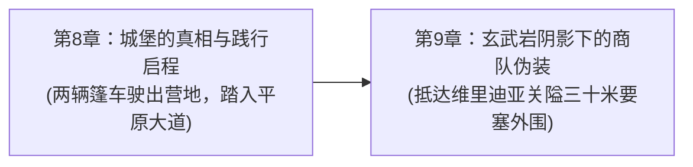

# 第一幕·阶段一：战后新生与两界相触详规（第 1 ~ 8 章）

> **所属方案**：[01_宏篇主线演进与阶段规划方案.md](file:///home/nanhu2/comfyui/世界书/方案/第二部/主线与世界扩充方案/01_宏篇主线演进与阶段规划方案.md)  
> **更新时间**：2026-09-27  
> **定位**：故土远征序曲与两界建交篇。聚焦战后余波的实质性清剿、森林再生仪式、两界正式公文建交、暗影异化先兆初显、以及远征维里迪亚的动能集结。严守“纯正西欧封建与轨迹 JRPG 文风”、“零导力隐蔽准备”与“纯物象化终止条件”。

---

## 一、 核心关卡设定与约束矩阵

| 维度 | 设定参数与铁律 | 违规红线防御 |
| :--- | :--- | :--- |
| **地理舞台** | Eldoria森林东侧泥沼、心木圣坛黑土台、石殿地下古代玄武岩坑道、时空裂隙幽蓝光幕、帝国东部边境废弃监测站、森林极北太古遗迹断柱 | 严禁模糊空间感；突出战后两周内森林泥土潮湿、植被新生与边境残垣断壁的物理质感 |
| **跨界公文** | **埃雷波尼亚帝国临时政府正式回应文书（红狮子火漆封印+马奇亚斯签署）** | **本公文仅在裂隙帝国侧及营地内部有效**，严禁带入维里迪亚关隘盘查使用 |
| **技术与装备** | 导力通信终端建立稳定专线；乔治工坊研制低外溢战术导力皮革外壳；菲娜注灵圣光符文石 | 原住民不知导力为何物；所有跨界设备进入王国前必须完成物理遮蔽与伪装 |
| **反派伏笔** | 帝国东部边境出现的暗紫异变雾气；维里迪亚朱利安王子的试探性暗号密讯；教廷暗影实验档案抹除线索 | 腐化源头未因 Thalion 死亡而彻底消失，暗影实验与高位面异化的更深网络初露端倪 |
| **命运动能** | 艾德里安坦白城堡沦陷并非“山贼”袭扰；雷恩直面圣殿扩张背后的十四年流放杀机；两队践行出发 | 有条不紊的行商伪装与情报侦察，原住民主角主导自身命运 |

---

## 二、 逐章详尽剧情演进（共 8 章）

### 第 1 章：残区的反扑——东侧的沼地
* **阶段/路线**：第一幕·阶段一 / 森林后方防线
* **主要人物**：雷恩, 菲, 菲娜, 黎恩
* **核心意图**：战后不等于绝对安宁，残存的影牙兽残余在无人沼泽盲目反扑；联军通过一次小规模战术协同完成战后秩序重组，确立“一区一区彻底收复”的务实基调。
* **时序情境推进**：
  - 1. **晨雾集结**：清晨微凉，东部巡逻哨探发回信号，残区渗出的暗紫秽气引聚了数十头变异影牙兽残余，正啃噬沼地根脉；雷恩与菲作为前锋率先抵达成片枯死的黑芦苇丛边缘。
  - 2. **战术牵引**：菲利用泥炭地高耸的枯树冠飞荡滑跃，甩出高韧性细钢丝编织封锁网，限制兽群冲锋范围；雷恩拔出长剑，晨光剑术破空风压稳稳卡住浅滩隘口。
  - 3. **圣光导引**：黎恩与菲娜率联军侧翼包抄；黎恩沉腰踏步，未出鞘太刀以刀鞘精准格碎扑袭魔兽的面门；菲娜双手按覆水面，炽天使圣光化作温润金流顺着泥沼水网漫延，将狂暴秽能彻底瓦解。
  - 4. **秩序收拢**：失去秽气支撑的野兽低嚎散去，残余毒素被心木树庞大的地下深根自然吸收净化；四人确认周边哨点安然无恙，整队归营。
* **章节终止条件**：
  - 1. 沼地最后一缕暗紫烟气消散在晨曦中。
  - 2. 心木树微光蔓延过泥泞浅滩，浑浊溪水重新变回清冽透明。
  - 3. 雷恩与黎恩利落收剑入鞘，四人踏过湿润水草走向营地升起的晨间炊烟。

---

### 第 2 章：种下那颗种子——新心木
* **阶段/路线**：第一幕·阶段一 / 森林再生仪式
* **主要人物**：菲娜, 黎恩, 艾玛, 五族代表
* **核心意图**：两百年前封存的古老种子在战后回归沃土；五族代表与两界同伴共同举行植树仪式，以新生的实体嫩芽象征森林跨越阵营与种族的延续。
* **时序情境推进**：
  - 1. **沃土整备**：在心木圣坛残迹旁的向阳黑土高台，矮人长者哈根带着工匠垒起一圈质朴的青石矮墙，将碎石与焦木彻底清理干净。
  - 2. **五族献礼**：狼人法师罗恩献上一捧清晨采摘的月光百合花瓣铺入土层；鳞母带着南泽泥壶，将第一捧饱含水泽生机的活泉水淋在基土上；艾玛转交牛头人送来的太古石殿厚土，并在青石边缘刻下罗安格林魔女的温床滋养符文。
  - 3. **两界共鸣**：菲娜取出散发温润白光的古老心木种子，小心放置在土壤正中；黎恩上前与菲娜并肩半蹲，两人的手掌虚覆在泥土之上，纯净炽天使圣光与澄澈控制的鬼之力在掌心交织，唤醒种子沉睡两百年的生命脉冲。
  - 4. **破土新生**：泥土微动，一簇青翠欲滴的嫩绿双叶在微光环绕中缓缓顶破土层，在微风中轻轻舒展。
* **章节终止条件**：
  - 1. 嫩绿色双叶在晨风中微微舒展，边缘浮动着极淡的金色光晕。
  - 2. 艾玛收起抚在土层上的雕木法杖，五族长老低沉和缓的祝祷余音散入林冠。
  - 3. 菲娜拍净掌心泥土，与黎恩相视微微点头。

---

### 第 3 章：地下的光——清剿十七条之一
* **阶段/路线**：第一幕·阶段一 / 地底通路打通
* **主要人物**：凯尔, 玲, 罗恩, 劳拉, 菲娜
* **核心意图**：清理石殿地下淤塞十四年的暗道，推开贯通地面的天光石门，为后续营地各族以及物资秘密转运提供安全的地底生命线。
* **时序情境推进**：
  - 1. **探入深廊**：凯尔举着松木火把，携带着手绘羊皮纸矿道图，带队深入石殿地底干涸的古代排水坑道；牛头人凿出的记号指引着十四年前被腐化封闭的一号支线。
  - 2. **遭遇残存兽群**：坑道拐角处盘踞着受暗影污染的盲眼地底多足兽；劳拉双手持拿宽刃大剑阔步踏前，极剑破空带起狂暴风压，一击将扑来的硬壳撕裂。
  - 3. **精准定点拆解**：罗恩挥动短杖以寒冰术锁住湿滑地面，限制兽群移动；玲操纵战术终端释放微型冲击弹，将巢穴碎石精确炸塌压制残敌；菲娜随后跟进，以圣光符文石净化渗透在石壁缝隙内的黑血残渣。
  - 4. **推开十四年的石门**：通道尽头，横亘着一座被锈蚀铸铁绞盘卡死的巨型青石门；众人合力清理碎石，劳拉与凯尔扳动绞盘生铁长杆，厚重石门轰然挪动。
* **章节终止条件**：
  - 1. 巨型青石门在生铁链的咯吱震鸣中敞开半掌宽的缝隙。
  - 2. 一线刺目的天然日光劈开地底幽暗，金色光柱中石粉尘埃缓缓沉降。
  - 3. 劳拉将宽刃大剑重新背负于身后，凯尔在羊皮纸地图上将该通道标为通畅绿线。

---

### 第 4 章：门那边的会面——第一份文书
* **阶段/路线**：第一幕·阶段一 / 裂隙正式建交
* **主要人物**：黎恩, 马奇亚斯
* **核心意图**：黎恩穿过裂隙与帝国代表马奇亚斯完成面对面交接，将两界往来由无线电信号上升为合法公文规则，确立跨界联络制度。
* **时序情境推进**：
  - 1. **独行穿界**：黎恩身着灰风衣，穿过中央裂隙平稳流转的幽蓝光幕，沿着帝国东部边境长满杂草的废弃林业道步行三公里，抵达边境前哨木造观测站。
  - 2. **友人重逢**：通宵未眠的帝国监察院调查官马奇亚斯快步推门而出，两人在薄雾中用力握手，互致关切。
  - 3. **文书移交与规则商定**：马奇亚斯正式递交帝国临时政府签发的红狮子印章官方通关与互助协议，两人逐条核对裂隙物资准入范围、保密条例与无线电每日对时频率，确立“非必要不开启大规模武装穿界”原则。
  - 4. **故乡土产与返程**：交接完毕后，马奇亚斯从桌下取出一箱家乡烘焙红茶砖、耐储硬干酪与两罐机油，交给黎恩带回营地；黎恩将文书妥善收入防水皮囊，转身踏上归途。
* **章节终止条件**：
  - 1. 马奇亚斯抬手推了推金丝眼镜，目送黎恩背着行囊步入幽蓝裂隙光幕。
  - 2. 羊皮纸文书封漆上的红狮子火漆印章在晨光下泛出暗红凝光。
  - 3. 裂隙表面微光闭合，边境木屋周围重归寂静风声。

---

### 第 5 章：边境的消息——故乡的异变
* **阶段/路线**：第一幕·阶段一 / 帝国侧异象
* **主要人物**：黎恩, 菲娜, 马奇亚斯
* **核心意图**：马奇亚斯传来的帝国东部突发紫雾情报，与 Eldoria 腐化产生同源回响；证明暗影灾难并非局部偶发，众人连夜制作圣光挂坠应对潜在危机。
* **时序情境推进**：
  - 1. **紧急加密密电**：深夜乔治搭建的导力通讯站荧绿指示灯急促闪烁，马奇亚斯从帝国边境发来加密电报：东部森林接连出现家畜狂暴化与带有暗紫光斑的畸变狼尸。
  - 2. **同源频谱比对**：黎恩根据太古石殿文献留存的古代灾厄特征，与菲娜取出的腐化样本进行微光对照，确认两地秽能的侵蚀频谱惊人一致；同时黎恩体内澄澈的鬼之力泛起异常共振，隐隐觉察到暗影能量与塞姆利亚大陆鬼之力同源，指向不可知的“世界外侧”高维混沌之谜。
  - 3. **两界责任觉醒**：故乡的异变让黎恩意识到两界的命运已被暗线死死咬合；裂隙那边的危机无法置身事外。
  - 4. **连夜灌注圣光石**：菲娜当即在工坊石台上展开三十枚未加工的高纯度石髓，以掌心纯净圣光逐一渗透温养，赶制出第一批可中和暗影毒素的圣光挂坠。
* **章节终止条件**：
  - 1. 最后一块乳白色符文石系好皮绳，稳妥收入厚牛皮革囊。
  - 2. 导力通信器的荧绿指示灯缓缓转为常亮待机状态。
  - 3. 夜风穿过裂隙缝隙，带起通讯天线金属支架冷却时的细微嗡鸣。

---

### 第 6 章：裂隙的呼吸——听不懂的节律
* **阶段/路线**：第一幕·阶段一 / 空间频率监测
* **主要人物**：艾玛, 菲娜, 乔治
* **核心意图**：裂隙在脱离求救应激状态后显露出深层的有节律脉动；艾玛以魔女秘术记录异常波形，菲娜触碰感知到更深维度的呼吸，埋下世界位面拓扑伏笔。
* **时序情境推进**：
  - 1. **反常金芒脉动**：黄昏时分，中央裂隙的幽蓝边缘泛起规律性的淡金光芒，如同某种巨物在虚空中平缓吐息，间隔固定为每分钟三次。
  - 2. **魔女符文记录**：艾玛手持雕木法杖，在裂隙前展开长幅羊皮纸卷，以蘸有特制墨水的羽毛笔飞速描摹空气中游离的以太波形轨迹，试图寻找对应的太古咒文公式。
  - 3. **机械频谱测算**：乔治在一旁使用导力示波器反复校对频率，确认其不属于帝国已知的导力七属性回路，而是一种具有生物活性特质的古老波动。
  - 4. **菲娜的感知共鸣**：菲娜缓步上前，将素白手掌贴近裂隙光幕；金芒脉动在触碰瞬间微微停滞了一拍，随后发出极轻微的颤鸣，记录下未知的数据印记。
* **章节终止条件**：
  - 1. 羊皮纸长卷画下最后一段曲折的脉冲波峰。
  - 2. 裂隙表面的金色细芒如退潮般无声收缩进幽蓝虚空。
  - 3. 石台上留下一圈微烫的魔女符文荧光，在暮色中缓缓冷却暗淡。

---

### 第 7 章：深处的点位——古代断层的坐标
* **阶段/路线**：第一幕·阶段一 / 太古遗迹排查
* **主要人物**：黎恩
* **核心意图**：黎恩独行深入森林极北太古遗迹群，凭借八叶一刀流【心眼】与对地脉褶皱的敏锐感应，排查三处古代断层，确认跨界通道的空间稳定点。
* **时序情境推进**：
  - 1. **深夜独行寻幽**：月至中天，黎恩腰佩太刀，独自穿过古木参天的极北无人区，踏足坍塌千年的太古石柱废墟。
  - 2. **八叶【心眼】空间感测**：黎恩敛息凝神，闭目运转八叶一刀流【心眼】，掌心轻按太刀刀柄，感知空间织锦的扭曲褶皱与古代地脉节律。
  - 3. **鬼之力精准探针**：黎恩深吸一口气，眼眸泛起澄澈的微红，控制极度收敛的鬼之力顺着脚下石板蔓延，如探针般逐一校准三处深陷地底的远古裂隙节点。
  - 4. **空间坐标图绘制**：黎恩结合艾玛绘制的以太脉冲图谱，将三组三维空间断层共振角度精准测算并记录在羊皮图上，确认裂隙即使遭遇外界魔力震荡也不会突发坍塌。
* **章节终止条件**：
  - 1. 地底石板的幽蓝微光与共鸣彻底平息。
  - 2. 黎恩将绘制好三处实测坐标的三维星象羊皮图卷妥善塞入铜皮筒并旋紧扣盖。
  - 3. 黎恩踩碎脚下干枯树枝，转身从高耸的石柱阴影中阔步走出。

---

### 第 8 章：城堡的真相——雾帷那边的故乡
* **阶段/路线**：第一幕·阶段一 / 故土远征启程
* **主要人物**：艾德里安, 雷恩, 菲娜, 黎恩, 劳拉, 菲
* **核心意图**：朱利安王子的试探暗号密讯与圣殿大军集结情报同时抵达，艾德里安首次公开家族城堡毁灭的暗影实验政治黑幕，雷恩以被流放者身份请缨，两队整肃备装，正式出发踏上维里迪亚故土。
* **时序情境推进**：
  - 1. **异常信件拆封**：晨光照入营地木屋，乔治展示昨夜截获的加密短波——落款为维里迪亚王室鸢尾花暗号，提及艾斯特雷亚旧领出现秽能残响，以及圣殿骑士团借战后维稳之名全境扩张的异动。
  - 2. **艾德里安的真相自白**：艾德里安取出随身携带的家传残损金属印牌，神情冷峻地道破十九年前城堡覆灭的惨剧与三十一年前暗影工程的深层黑幕：祖地城堡惨案实为教廷秘密研制的暗影炼金兵器在十九年前失控外泄造成的悲剧，此前官方宣称的“山贼洗劫”纯系王都教会签署灭口令后伪造公文抹除档案的掩盖手段。
  - 3. **雷恩的晨光之誓**：雷恩注视着自己手腕处被烙印宣判无效的疤痕，沉声表态：圣殿大团长阿达尔伯特当年签署屠杀令与流放令，如今趁乱扩张必有图谋，自己必须重返故国当面清算。
  - 4. **战术分工与践行**：众人商定先遣队配置：艾德里安作为商队主理人；黎恩与菲娜作为生死相托的家人同伴，不涉王国世俗利益，以超自然守护者身份随行照应；雷恩与劳拉压阵第二辆篷车，菲负责前路侦察；乔治送上两辆加装粗亚麻帆布遮蔽的双马篷车与皮革阻断外壳。
* **章节终止条件**：
  - 1. 双马篷车在营地边缘套好坚韧的生皮缰绳。
  - 2. 艾德里安扣紧手腕粗皮护腕，神情坚毅地望向雾帷尽散的平原干道。
  - 3. 留在营地的同伴在晨光中肃立注目，两辆马车木轮转动碾过碎石，平稳驶出森林边界。

---

## 三、 第一幕两阶段承接核验

* **时空无缝咬合**：第 8 章结尾篷车套绳启程，第 9 章开篇直落峡谷主驿道与三十米玄武岩关隘外围，中间无任何空档与逻辑跳跃；
* **装备状态延续**：第 8 章乔治交付的粗亚麻遮蔽帆布、牛皮导力阻断套与艾德里安的北方商贸行会旧印牌，在第 9 ~ 10 章入关交涉中全量严丝合缝实装展现。
