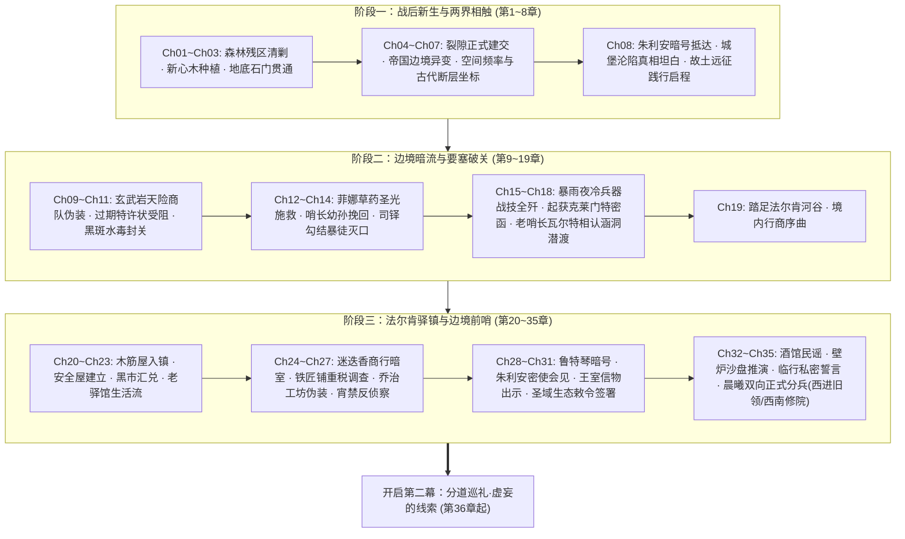

# 第一幕·阶段三：法尔肯驿镇与边境前哨详规（第 20 ~ 35 章）

> **所属方案**：[00_第二部主线与世界扩充方案总纲.md](file:///home/nanhu2/comfyui/世界书/方案/第二部/主线与世界扩充方案/00_第二部主线与世界扩充方案总纲.md) · [01_宏篇主线演进与阶段规划方案.md](file:///home/nanhu2/comfyui/世界书/方案/第二部/主线与世界扩充方案/01_宏篇主线演进与阶段规划方案.md)  
> **规划规模**：九幕·二十九阶段·280~300章长篇史诗体系  
> **更新时间**：2026-09-29  
> **定位**：入境第一座核心据点扎根篇。聚焦法尔肯驿镇市井风土、老驿馆安全屋建立、市井学徒微光互动、封建货币黑市汇兑、朱利安王子密使接头、王室信物与生态敕令签署、商会与工坊暗线拓展、以及双线（艾德里安线/雷恩线）正式分兵。严守“纯正西欧封建与轨迹 JRPG 文风”、“绝对零导力隐蔽”与“docs2 设定卡完全对齐”。

---

## 一、 核心关卡设定与约束矩阵

| 维度 | 设定参数与铁律 | 违规红线防御 |
| :--- | :--- | :--- |
| **地理舞台** | **法尔肯驿镇**：开阔河谷台地，深色硬木骨架与粗灰石砌筑的木筋墙建筑（Fachwerk），中央集市喷泉，“猎鹰与十字”老驿馆二楼尽头包厢、背街石阶暗梯、后街迷迭香商行暗窖与深石酒窖 | 严格遵照 `LOC_D2_11`、`LOC_D2_10` 物理格局；严禁现代电气化设施与中式建筑结构，全部采用牛油壁灯、栎木桌台与生铁插销 |
| **经济与货币** | 携带粗银颗粒与过期银克朗，在后巷掮客天平上折算火耗，兑换当季流通**紫铜便士（Copper Penny）**与地方行商通券 | 严禁出现“碎银”、“银票”、“铜钱”、“文钱”；严格按照欧陆中世纪货币与称重规矩运作 |
| **战术与伪装** | 全员在公共场合严密披挂粗呢旅行斗篷；ARCUS 导力器深锁于乔治特制牛皮阻断套中；黎恩太刀缠麻布伪装为北地护卫剑 | 王国原住民视导力光芒为异端妖术；所有感知完全限制在肉体凡胎与五感范畴（凡肉眼未见、双耳未闻之事皆不知） |
| **暗线接头** | 朱利安王子的密使以流浪诗人身份弹奏古旧鲁特琴，以王国古歌为隐语接头，经由背街暗梯交接王家测绘地图 | 严禁公开联络王室；接头必须具备封建政治斗争的严密性与隐蔽性，避免惊动圣殿巡逻骑士 |
| **市井人物·学徒汉斯** | **老驿馆跑堂学徒汉斯**：年少胆怯、给客人端送热麦糊时手脚发抖，菲悄声指点其端盘步伐避开巡逻游骑，建立起微小真挚的市井善意 | 融入真实市井生活流，展现普通平民在封建重压下的朴素良善与勇气 |
| **阶段支线** | **【支线·工坊附魔银刻针与复式记账（法林 × 亚莉莎，LOC_D2_03工坊）】**：在法尔肯建立中继前哨后，亚莉莎返回大本营工坊统筹边境矿石与物资进出账。法林手持【黑角木符文刻杖】与纤细锋利的【附魔银刻针】（针尖嵌米粒微光晶石），在战甲与防酸皮革上细细刻画防蚀符文。亚莉莎端着热草药茶走入，拿起鹅毛笔运用莱恩福尔特复式记账法为法林重新梳理账册；矮人工匠惊叹于现代财务逻辑的条理分明，亚莉莎亦在专注雕琢轴承的火星中重温工坊挥汗的充实感。 | 展现封建工坊匠艺与近代财务思维的良性碰撞，绝缘任何修仙与古风文言 |
| **战略分兵** | **主线A（艾德里安+菲）**：深入中西部丘陵艾斯特雷亚堡；**主线B（雷恩+劳拉）**：西进西南晨光修道院；**中枢（黎恩+菲娜）**：留守法尔肯协调两界 | 艾德里安与雷恩主导自身命运动能；黎恩作为战术后盾，不抢夺原住民的决断权 |

---

## 二、 逐章详尽剧情演进（共 16 章）

### 第 20 章：河谷晨雾中的木筋屋——法尔肯入镇
* **阶段/路线**：第一幕·阶段三 / 边境城镇落脚
* **主要人物**：艾德里安, 黎恩, 菲娜, 雷恩, 劳拉, 菲
* **核心意图**：商队一行穿过关隘涵洞后踏足法尔肯河谷，观察封建集贸重镇的真实社会风貌，避开圣殿骑兵游弋哨卡，安全驶入老驿馆后院。
* **时序情境推进**：
  - 1. **河谷眺望**：双马篷车驶出林道，晨雾散去，起伏台地上展现出一座典型的欧陆集贸城镇；深色硬木骨架与粗灰石砌筑的木筋屋（Fachwerk）鳞次栉比，平顶石板屋顶冒着细细青烟。
  - 2. **集市规避**：中央集市广场停满了各商会的四轮重型货运篷车，羊毛商人与外地佣兵大声喧哗；艾德里安手勒缰绳，避开在主街设立检查哨的圣殿巡逻白鹰轻骑，熟练地将马车拐入潮湿阴暗的石板窄巷。
  - 3. **后院收车**：篷车拐入镇深处一座斑驳的带内院石造大建筑——“猎鹰与十字”老驿馆；厚重的栎木外门无声敞开，马车迅速驶入后院泥地，门后重型生铁插销随即滑落锁死。
* **章节终止条件**：
  - 1. 老驿馆厚重的大门生铁门栓严丝合缝地落入铸铁卡槽。
  - 2. 两辆双马篷车熄灭车辕油灯，静静停驻在后院干燥的草料棚阴影中。
  - 3. 菲伏在后院石墙阴影处朝黎恩打出“无尾随追踪”的手势。

---

### 第 21 章：老驿馆的栎木门——旧部奥托与安全屋
* **阶段/路线**：第一幕·阶段三 / 据点扎根与防务
* **主要人物**：艾德里安, 雷恩, 黎恩, 菲娜, 驿馆店主奥托
* **核心意图**：艾德里安激活早年经商留存的忠诚人脉，确立老驿馆二楼包厢为核心指挥所，完成物理防务布设与私密退路勘查。
* **时序情境推进**：
  - 1. **旧主相认**：灰发佝偻的店主奥托手持鲸油马灯快步走出，艾德里安取下斗篷兜帽并出示北方商会金属印牌背后刻下的私印；老奥托眼眶泛红，躬身行礼：“少爷……十九年了，老朽还守着这间铺子。”
  - 2. **安全包厢接管**：奥托将众人引上二楼最深处的秘密套间；推开加厚双层栎木门，门后配有两道重型锻铁插销，室内铺着粗羊毛地毯，石砌壁炉散发着干燥暖意。
  - 3. **勘查逃生暗梯**：菲推开背街窄窗，查验窗台外贴墙修筑的陡峭石阶暗梯，该梯直通下水道暗巷，可完全避开城镇正面巡逻卫兵的视线；黎恩点头确认此处为绝佳的应急撤离通道。
  - 4. **建立临时指挥站**：黎恩与菲娜将加厚牛皮遮蔽包裹的导力通信机与应急药品存入地窖暗格；雷恩解下负重长剑倚在壁炉边，法尔肯前哨指挥部正式建立。
* **章节终止条件**：
  - 1. 二楼栎木厚门的生铁插销稳稳推上锁孔。
  - 2. 壁炉中的栎木柴块噼啪爆开一粒微红火星，暖意驱散了长途奔波的湿寒。
  - 3. 艾德里安拉上背街厚亚麻窗帘，将外界昏暗的巷道隔绝在外。

---

### 第 22 章：浑浊麦酒与硬黑麦——边境市井的呼吸
* **阶段/路线**：第一幕·阶段三 / 生活流呼吸与市井情报
* **主要人物**：雷恩, 劳拉, 菲, 艾德里安（市井人物：店主奥托, 跑堂学徒汉斯）
* **核心意图**：在老驿馆一楼大堂体验浓厚正统的 JRPG 西幻酒馆生活流，倾听往来商旅与佣兵闲谈，捕捉王国内部政局与圣殿异动的零星情报；菲暗中指点胆怯学徒汉斯端盘避开巡查，展现市井生活流中的微温善意。
* **时序情境推进**：
  - 1. **大堂烟火与胆怯学徒**：黄昏老驿馆一楼坐满了人，铁铸牛油壁灯散发昏黄光芒；空气中弥漫着浑浊麦芽酒、烤黑麦硬面包、浓洋葱牛肉汤与烟草的粗粝热气，喧闹声不绝于耳。年仅十五六岁的年轻跑堂学徒汉斯缩着脖子、端着托盘给客人送热麦糊，手脚紧张发抖，险些撞在披甲巡查的游骑兵身上；菲悄无声息伸手扶稳木盘边缘，低声指点其踩稳重心、避开巡查视线，汉斯感激地微微躬身，端着空木盘悄悄退入后厨。
  - 2. **粗粝饮食**：奥托端来大木托盘，盛着刚出炉表面焦硬的黑麦面包片、大木碗热气腾腾的洋葱炖羊肉汤与一陶壶热香料苹果酒；菲熟练地用短刀挑起羊肉浸润硬面包放入口中，劳拉小口饮着香料酒，耳尖微红。
  - 3. **听取市井风声**：邻桌几个押运毛皮的雇佣兵大声抱怨：“圣殿在平原要塞增兵了整整两个旗队，连出境的商队都要翻底搜查！”、“听说王都大主教亲自批了什么净洁法令，北方几个领地的修道院都被封了。”
  - 4. **情报沉淀**：雷恩握着酒杯的手指微微收紧，与对面的艾德里安交换了一个冷峻的眼神——圣殿与教会的压迫网比他们预想的更快扩展到了边境。
* **章节终止条件**：
  - 1. 粗陶大杯底部的麦酒泡沫缓缓破裂。
  - 2. 邻桌佣兵掷出的骨牌清脆撞在橡木长桌上，爆发出粗鄙的笑骂声。
  - 3. 艾德里安将一枚紫铜便士放在托盘边，起身轻声示意全员上楼。

---

### 第 23 章：迷迭香商行的天平——玛格丽特夫人与黑市汇兑
* **阶段/路线**：第一幕·阶段三 / 封建经济与合法行商特许
* **主要人物**：艾德里安, 黎恩, 玛格丽特·德·拉菲尔
* **核心意图**：艾德里安带领黎恩深入法尔肯后街的迷迭香商行，激活与行会掌印夫人玛格丽特的旧日盟友羁绊，完成粗银火耗称重汇兑，获得正规南境香料行商特许状，并将管制重物经由书架暗门转移至地下干燥深窖。
* **时序情境推进**：
  - 1. **后街香气**：艾德里安领着黎恩拐入法尔肯后街幽深的林荫窄巷，推开迷迭香商行厚重厚栎木大门；空气中瞬间被浓郁的迷迭香、没药树脂与老雪松木箱交织的清苦暗香充盈，彻底隔绝了外界闹市的喧嚣。
  - 2. **旧友相逢**：商馆掌印夫人玛格丽特·德·拉菲尔身着深勃艮第红天鹅绒束腰长裙，端坐于二层内进私室的松木软榻旁；深邃琥珀色眼眸扫过斗篷下的艾德里安，唇角泛起从容戏谑：“三年不见，艾斯特雷亚少爷还是喜欢踩着夜色敲我的后门。”
  - 3. **天平称量火耗**：艾德里安在博古桌前倒出粗银颗粒与磨损的旧克朗；玛格丽特用单眼透镜细致验色，在黄铜天平上扣除成色折损火耗，当场交付沉甸甸的三百枚当季正统紫铜便士，以及盖有商业行会正式蜡印的《南境珍奇香料药草运送特许状》。
  - 4. **深窖暗道暗格交付**：玛格丽特轻转书架机关，露出通往地下干燥深窖与后巷马厩的石阶暗梯；黎恩与艾德里安将沉重的凡人补给箱与牛皮包裹搬入地窖暗格，彻底抹去异界科技痕迹，商队合法伪装宣告完成。
* **章节终止条件**：
  - 1. 行会公章的暗红火漆在羊皮纸特许状上冷却凝固。
  - 2. 黄铜天平的指针在两端砝码平衡后稳稳归中。
  - 3. 博古书架机关暗门严丝合缝地滑回原位，遮蔽了地窖暗道的入口。

---

### 第 24 章：迷迭香商行的暗室——玛格丽特夫人与商道密账
* **阶段/路线**：第一幕·阶段三 / 商道暗账与粮食危机线索
* **主要人物**：艾德里安, 黎恩, 玛格丽特·德·拉菲尔
* **核心意图**：玛格丽特屏退侍女，在商行暗室中向二人出示近年来圣殿骑士团与教会空壳商号的洗钱暗账，揭露教廷大肆垄断平原麦粉、操控民间粮价的黑幕，艾德里安承诺新王登基后减税通商。
* **时序情境推进**：
  - 1. **暗室密账**：玛格丽特取出一本厚重羊皮账册，账页上密集记录着平原大道各关卡对普通行商征收的七重什一税与骑士团“白鹰过路税”，而挂有教会圣徽标志的黑篷马车却享有全额免税特权。
  - 2. **粮价操控阴谋**：玛格丽特神情严肃：“教廷在王都下城区货栈囤积了数万袋麦粉，却故意扣留不发，坐看麦价暴涨三成。这是要用饥饿逼迫市民和王室屈服。”
  - 3. **商行立场结盟**：玛格丽特表示行会商人早已不堪重负，若王室能打破教会特权、许诺商贸自由，行会愿全力在暗中调拨平价粮食与资金支持。
* **章节终止条件**：
  - 1. 羊皮暗账重新锁入商行地下的铁皮保险箱。
  - 2. 玛格丽特将一枚象征商行大客户的雕花银领针递到艾德里安手中。
  - 3. 暗室书架缓缓合拢，重归沉寂。

---

### 第 25 章：铁砧上的火星与重税——法尔肯民间铁匠的低语
* **阶段/路线**：第一幕·阶段三 / 市井民情与防务武备排查
* **主要人物**：雷恩, 劳拉, 老铁匠乌尔里希
* **核心意图**：雷恩与劳拉伪装为雇佣护卫排查法尔肯铁匠街，目睹圣殿严苛税负对民间铁匠的盘剥，锁定旧领方向铁矿石走私异动。
* **时序情境推进**：
  - 1. **炉火映照的铁匠铺**：镇东铁匠街炉火熊熊，锤击声震耳欲聋；老铁匠乌尔里希正满头大汗地锻打粗糙马蹄铁，墙角堆满贴着圣殿白鹰封条的生铁锭。
  - 2. **重税压迫**：圣殿白鹰骑兵税官按剑步入，当面勒索本月“要塞圣税”，老铁匠苦苦哀求留下买炭铜币却遭鞭笞辱骂；劳拉按住巨剑剑柄眼中寒芒乍现，雷恩轻轻搭住其手背示意克制，暗中掷出一枚紫铜便士替铁匠解围。
  - 3. **旧领黑铁情报**：税官离去后，老乌尔里希感激地奉上麦茶，道破内幕：近半年所有优质黑铁与硬铅都被教廷私车运往艾斯特雷亚旧领方向废矿区，民间铁匠连一把柴刀都难以打造。
* **章节终止条件**：
  - 1. 老铁匠乌尔里希将暗中截留的一截变质黑钢碎渣塞入雷恩粗麻布袋中。
  - 2. 铁匠炉风箱缓缓停歇，赤红火星在昏暗铺子里如星屑般隐入灰烬。
  - 3. 雷恩与劳拉转身走出铁匠铺，目光冷峻地望向北方阴沉的山脊线。

---

### 第 26 章：隔绝皮套与低频暗波——乔治与亚尔缇娜的行商工坊
* **阶段/路线**：第一幕·阶段三 / 后勤科技保障与跨界联络
* **主要人物**：乔治, 亚尔缇娜, 黎恩（远端补给支持：爱丽榭）
* **核心意图**：乔治与亚尔缇娜在老驿馆后院马厩暗格建立起零外溢临时工坊，赶制防酸防侦测特种皮革套，并接收森林大本营爱丽榭经排沙涵洞送抵的后勤补给箱。
* **时序情境推进**：
  - 1. **马厩暗格中的微热**：老奥托腾出的废弃干草料库中，乔治满身机油汗水，手持大扳手紧固密封阻断阀；特种浸油双层牛皮套紧紧包裹住所有战术导力器，不渗出一丝光芒。
  - 2. **亚尔缇娜的精密监测**：亚尔缇娜端坐草料箱上，精密记录导力波形压缩比：“波形外溢率降至0.02%，即便圣殿随军司铎手持测魔水晶擦肩而过，亦无法探测分毫。”
  - 3. **后方补给抵达**：爱丽榭经由秘密排沙涵洞运来的第二批补给箱开启，包括浓缩止血草药膏、特制耐潮硬干酪块与保暖羊毛护膝，细致入微的关怀驱散了前线的寒意。
* **章节终止条件**：
  - 1. 乔治合上工具箱生铁搭扣，用麻布仔细擦去掌心的润滑黑油。
  - 2. 亚尔缇娜将最后一块加固皮套整齐卡入劳拉巨剑剑柄连接轴。
  - 3. 马厩暗门轻扣反锁，暗格只余细细的草料干香与马匹低沉的鼻息。

---

### 第 27 章：窄巷铜铃与暗夜游骑——法尔肯宵禁潜行
* **阶段/路线**：第一幕·阶段三 / 反侦察与巡逻规避
* **主要人物**：菲, 艾德里安
* **核心意图**：菲与艾德里安夜巡法尔肯下城区，排查圣殿白鹰骑兵夜间宵禁交接盲区，测试冷兵器潜行路线，为明日破晓离镇扫清尾随隐患。
* **时序情境推进**：
  - 1. **雾夜马蹄**：深夜法尔肯全城宵禁，铁蹄敲打青石板路声清脆刺耳；圣殿骑兵手举生铁油松火把，沿着主干道逐一检查闭户门锁。
  - 2. **飞索与阴影**：菲借由飞索滑轮轻盈攀上木筋屋倾斜屋脊，宛若幽灵般在石板瓦间滑行；艾德里安凭借老练的地形记忆在下方拱廊阴影中同步穿插，二人默契记录下巡逻队每隔四十分钟交接一次的换岗空档。
  - 3. **斩除暗哨**：一名鬼祟跟踪老驿馆的教廷黑袍密探在后巷被菲反手以剑鞘卡住咽喉、艾德里安精准敲晕，收缴其身上的速记羊皮卷并捆缚封口塞入酒窖空桶。
* **章节终止条件**：
  - 1. 敲晕的密探被粗麻绳五花大绑隐入空橡木桶盲区。
  - 2. 巡逻铁骑的火把光晕在百米外的石板街尽头转角缓缓移开。
  - 3. 菲如轻叶般从檐角飘落，朝后院草棚的艾德里安比出“全线安全”手势。

---

### 第 28 章：酒馆角落的鲁特琴——流浪诗人的古歌
* **阶段/路线**：第一幕·阶段三 / 暗号试探与接头契机
* **主要人物**：艾德里安, 菲, 流浪诗人（王家密使）
* **核心意图**：朱利安王子的密使以落魄流浪诗人身份在酒馆大堂以古歌试探，艾德里安以艾斯特雷亚家族旧歌谣对接暗语，达成接头默契。
* **时序情境推进**：
  - 1. **古歌声起**：夜幕降临，大堂角落走入一名身披褪色灰斗篷、怀抱十三弦古旧鲁特琴的青年诗人；手指拨动琴弦，清冽如泉的琴音瞬间穿透了嘈杂的酒馆大堂。
  - 2. **暗语歌词**：诗人吟唱维里迪亚前代民谣《白鹿与鹰》，唱腔在第二段突然变调：“……白鹰折断了北地的麦穗，迷雾散尽时，石墙上的金鸢尾在等待归客。”
  - 3. **菲的斥候排查**：二楼楼梯口的菲压低斗篷，敏锐扫视全场，确认酒馆内外没有圣殿便衣斥候或教会神职人员盯梢，向吧台边的艾德里安微微颔首。
  - 4. **以歌对暗号**：艾德里安端着麦酒走近琴架，随手抛下两枚紫铜便士，用调侃轻浮的语调接续吟道：“……可惜金鸢尾的刺太软，扎不破老鹰的铁爪。”诗人拨弦的手指猛然一顿，抬头露出一双精干锐利的灰眸。
* **章节终止条件**：
  - 1. 鲁特琴琴弦发出最后一个清越的长音颤鸣。
  - 2. 诗人伸手按住落入琴盒的两枚紫铜便士，向艾德里安微微躬身。
  - 3. 艾德里安转身走向楼梯，低声向后抛下一句：“二楼尽头，带油灯来。”

---

### 第 29 章：石阶暗梯上的王储——朱利安微服潜入与自省担当
* **阶段/路线**：第一幕·阶段三 / 绝密接头与王家盟约
* **主要人物**：朱利安王子, 诗人（王家密使）, 艾德里安, 雷恩, 黎恩, 菲娜
* **核心意图**：朱利安王子在诗人掩护下亲自经由外墙暗梯微服潜入二楼包厢，以极度谦逊自省姿态求助，直言营地没有流血义务，恳求共同迎击暗影。
* **时序情境推进**：
  - 1. **暗梯潜入与王者真容**：三更时分，背街木窗传来规律暗号；菲拉开木窗，诗人率先跃入，紧接着一名身材高大结实、身披素面深绿斗篷的青年男子敏捷翻入室内——正是维里迪亚王国第一王子朱利安。王子领口别着内敛的王室银徽，手指带着测绘地图的墨水渍，眼神沉静自省。
  - 2. **极度谦逊的建交姿态**：朱利安解下斗篷，主动向黎恩和菲娜致以王室贵族礼，诚恳明言：“我知道营地没有任何义务为维里迪亚流血，维里迪亚欠艾斯特雷亚家族与雷恩卿的血债，更不该由远道而来的客人们来偿还。今天我站在这里，不是以王储身份发号施令，而是作为一个走投无路的维里迪亚人，恳求能与各位共同面对那股将两个世界都拖入深渊的暗影。”
* **章节终止条件**：
  - 1. 朱利安王子解下佩剑平置于栎木桌案，以示坦荡信义。
  - 2. 黎恩与菲娜上前迎礼，气氛由警惕戒备转为真诚相待。
  - 3. 诗人反扣包厢暗门，包厢内的油灯火苗静静燃烧。

---

### 第 30 章：奉还的手札与平民密账——王室庄严信物与贵族致歉
* **阶段/路线**：第一幕·阶段三 / 历史冤屈与信物交接
* **主要人物**：朱利安王子, 艾德里安, 雷恩, 黎恩
* **核心意图**：朱利安亲手奉还王室秘密珍藏十九年的手札，向艾德里安行贵族歉礼；向雷恩出示十八年来私用内帑发放的平民抚恤密账，拔剑致敬洗刷流亡屈辱。
* **时序情境推进**：
  - 1. **信物一·奉还手札与贵族道歉**：朱利安亲手奉上王室秘密珍藏十九年、当年老国王冒死从大火暗格拓印保存的《艾斯特雷亚夫人临终手札与忠仆册》；朱利安郑重向艾德里安行贵族歉礼，承认当年王室软弱妥协之过，让艾德里安眼眶通红。
  - 2. **信物二·雷恩平反抚恤密账**：朱利安向雷恩出示老国王十八年来私自挪用王室内帑发放的平民抚恤密账原本，证明王室从未将雷恩视作叛徒；朱利安拔剑向雷恩行古典骑士礼，洗刷十四年屈辱。
* **章节终止条件**：
  - 1. 艾德里安手指微颤地抚摩着母亲手札上熟悉的鸢尾花蜡封。
  - 2. 雷恩右手按胸回以沉重的晨光誓约礼。
  - 3. 密账羊皮纸在烛光下泛出岁月沉淀的温润黄铜色。

---

### 第 31 章：圣域生态敕令与月影祖石——森林主权保护与部族破冰
* **阶段/路线**：第一幕·阶段三 / 敕令签署与地缘盟约
* **主要人物**：朱利安王子, 菲娜, 黎恩
* **核心意图**：菲娜作为森林守护者与朱利安签署《维里迪亚王权对Eldoria圣域生态保护敕令》；王子展现先给予尊重不求回报的信义，通报查禁狼皮走私、奉还月影祖石与修筑沉淀池的善意，赢得部族信任。
* **时序情境推进**：
  - 1. **敕令签署与主权厘清**：菲娜作为“Eldoria森林守护者”（Guardian），代表心木树意志与朱利安王子缔结敕令，承诺王军永不越过南侧界碑，禁绝暗影炼金污染，尊重森林神圣安宁。
  - 2. **部族善意通报**：王子出示已在北境查禁捕杀狼皮走私团伙的法令，并已将王室珍藏数百年的“古代月影祖石”奉还狼人月语者；同时调派水工在下游清淤排毒修筑沉淀池，阻绝教会废渣流入蜥蜴人沼泽。
  - 3. **王国要塞势力图谱**：朱利安铺开亲手测绘的王国势力图谱，标出圣殿要塞驻防与教会走私港口，暗线情报网完全连通。
* **章节终止条件**：
  - 1. 朱利安王子的双头狮火漆印章端正钤印在敕令末端。
  - 2. 菲娜以森林守护者之名在卷轴上烙下一道淡淡的心木微光印痕。
  - 3. 羊皮纸卷轴被妥善收纳进防水皮筒中。

---

### 第 32 章：陶土杯中的微酸麦酒——酒馆民谣与边境旧事
* **阶段/路线**：第一幕·阶段三 / 生活呼吸流与历史温度
* **主要人物**：艾德里安, 雷恩, 黎恩, 菲娜, 老奥托
* **核心意图**：送走朱利安后，众人在老驿馆吧台品尝粗黑麦酒与烤羊肉排，通过老奥托与游吟诗人民谣勾勒十四年前与十九年前的人间悲喜，沉淀心性。
* **时序情境推进**：
  - 1. **壁炉火红**：粗糙栎木长桌上摆放着几盘刚出炉表面焦黑的黑麦硬面包、切片熏羊肉与几罐泛着微白酸沫的浑浊麦芽酒。
  - 2. **老奥托的往事**：老奥托给众人倒满陶土杯，低声回忆当年艾斯特雷亚老伯爵夫人开仓赈灾、以及雷恩第九旗队在风雨中驻防关隘秋毫无犯的旧事，感叹如今教会圣税让百姓度日如年。
  - 3. **心境锚定**：艾德里安摩挲着粗陶杯沿，神情肃穆而笃定；雷恩静静注视着杯中跳动的炉火倒影，心中守护众生的誓言愈发沉稳坚固。
* **章节终止条件**：
  - 1. 陶土杯在橡木长桌上发出沉闷清脆的轻碰声。
  - 2. 壁炉中干松木爆出一颗微红火星，炉火渐渐转为深暗温热的炭红。
  - 3. 老奥托取下挂在墙上的防风马灯，向众人微微脱帽致意退入后厨。

---

### 第 33 章：壁炉火光下的沙盘推演——两界物资统筹与战术推演
* **阶段/路线**：第一幕·阶段三 / 战术兵棋推演
* **主要人物**：艾德里安, 雷恩, 劳拉, 菲, 黎恩, 菲娜
* **核心意图**：主角团围聚在地图前进行严密的兵棋推演，明确艾德里安主线A与雷恩主线B的行进动线与风险点，正式确立双线作战方案。
* **时序情境推进**：
  - 1. **废墟路线研判（主线A）**：艾德里安手指划过地图中西部的高地丘陵：“艾斯特雷亚城堡废墟位于圣殿巡逻哨盲区，但外围被古代毒荆棘封锁；我需要菲的敏锐身手与攀爬技巧，避开主道直插主堡地窖。”菲点头，在地图上圈出两处悬崖潜入点。
  - 2. **修道院接头研判（主线B）**：雷恩将一枚黑棋推至法尔肯西南侧山脉：“晨光修道院收留过当年的重伤老兵，附属药舍修女艾琳娜手中暗中保存着被下令焚毁的伤员诊疗名册原本与黑血病样本；但圣殿大团长阿达尔伯特已派出追击轻骑，我们必须在他们封院前与艾琳娜接头拿到铁证。”劳拉将双手大剑横置膝头：“我和雷恩同行，任何阻拦誓言的利刃由我斩碎。”
  - 3. **后方中枢调度**：黎恩以战术推演官的从容梳理全局：“我和菲娜坐镇法尔肯。这里是连接两界裂隙的唯一咽喉；乔治在后方维持无线电备用线，若两路生变，法尔肯随时派出接应与圣光支援。”
  - 4. **联络信记约定**：全队约定以北方白隼羽毛与特定刀刻暗号作为沿线信鸽与树干留讯标志，避免使用任何导力或魔法通讯。
* **章节终止条件**：
  - 1. 黎恩用木炭条在羊皮纸地图上将中西部与西南两条行军路线重重画下箭头。
  - 2. 六人右手覆在地图中央的维里迪亚王都坐标上，无声达成誓约。
  - 3. 壁炉中的火光映红了每个人的眼眸，窗外晨光破晓。

---

### 第 34 章：出征前的整备之夜——誓言、戒指与回响
* **阶段/路线**：第一幕·阶段三 / 私密情感张力与战前整备
* **主要人物**：雷恩, 劳拉, 艾德里安, 菲, 黎恩, 菲娜
* **核心意图**：分兵前夜的深度情感回流与冷兵器整备；劳拉与雷恩确立同生共死羁绊，艾德里安交代旧领凶险，菲娜分发圣光符文石。
* **时序情境推进**：
  - 1. **巨剑与重盾的鸣响**：后院马厩深处，雷恩用磨刀石细致研磨长剑刃口，金属摩擦声节奏沉稳；劳拉立于一旁，低头注视手指上戴着的艾斯特雷亚家族戒指，低声道：“雷恩，这一趟我们既是去为你正名，也是为了给他的家族讨回公道。”雷恩停下磨石，握住劳拉带着薄茧的手。
  - 2. **短刃与潜行索**：二楼廊柱下，菲正在给双枪剑的刃身擦拭防锈鲸油，艾德里安斜靠在墙边，少见地收起轻浮戏谑：“旧领地底下……死过很多人。如果遇到不可名状的东西，不要管我，立刻撤出来。”菲面无表情地扣紧护腕：“猎兵从不半途丢下雇主。走得进去，就带得出来。”
  - 3. **药包与圣光符文石分发**：包厢内，菲娜将爱丽榭特制的野山菌干酪干粮包与止血草药膏分发给两队，并在每个人的皮斗篷内侧缝入一枚纯净温润的圣光符文石：“如果遭遇暗影黑血，捏碎它，能保你们三次心脉不被腐蚀。”
  - 4. **黎恩的战术守护**：黎恩检查完两队马匹的铁掌与鞍具，在门前与雷恩、艾德里安分别击掌，战士间的深沉默契无需多言。
* **章节终止条件**：
  - 1. 最后一枚圣光符文石在粗呢斗篷衬里缝好最后一记锁边针脚。
  - 2. 太刀与巨剑同时严密收入粗皮剑鞘，发出两道清脆沉重的卡扣声。
  - 3. 菲娜轻声的祈愿祝祷融入老驿馆屋檐下的冷清夜风。

---

### 第 35 章：雾散晨曦中的双向分兵——深入中西部与西南
* **阶段/路线**：第一幕·阶段三 / 双线正式分进（第一幕大结局）
* **主要人物**：艾德里安, 菲, 雷恩, 劳拉, 黎恩, 菲娜
* **核心意图**：第一幕总收官。晨曦中两支队伍策马出镇，正式开启第二幕“主线A焦土调查”与“主线B圣殿对决”，黎恩与菲娜坚守中枢，格局拉开。
* **时序情境推进**：
  - 1. **晨霜踏足**：拂晓时分，法尔肯河谷被一层清冷的白霜覆盖；老奥托早早打开后院侧门，四匹强健的边境挽马已备好鞍鞯与防水驮囊。
  - 2. **主线A启程（西进中西部丘陵旧领）**：艾德里安深裹深色旅行短篷，翻身上马；菲如灵巧的飞燕跃上另一匹黑马，短斗篷在晨风中微微翻飞；艾德里安在马上朝黎恩扬了扬缰绳：“法尔肯的账单记我名下，等我带着地窖的好酒回来。”双骑转入通往中西部喀斯特丘陵的荒芜小道。
  - 3. **主线B启程（西南进发晨光修道院）**：雷恩佩戴长剑与厚重圆盾，神情如远山般沉穆；劳拉身负深蓝巨剑策马并行，两骑并辔朝着西南群山与晨光修道院方向稳步疾驰。
  - 4. **中枢守望（第一幕大闭环）**：黎恩与菲娜立于老驿馆二楼窗前，目送两路烟尘渐渐隐没在河谷晨雾的尽头；黎恩按着腰间太刀，目光锐利深远：“第一步已经迈出去了……接下来，轮到我们守护好后背了。”
* **章节终止条件**：
  - 1. 两路马蹄声在河谷林道的晨雾中渐渐平息至完全不可闻。
  - 2. 法尔肯集市钟楼敲响清晨第一记沉浑的生铁晨钟。
  - 3. 黎恩拉下厚栎木窗栓，转身走向铺满王国布防图纸的战术案台。

---

## 三、 第一幕全 35 章宏观演进全景图

