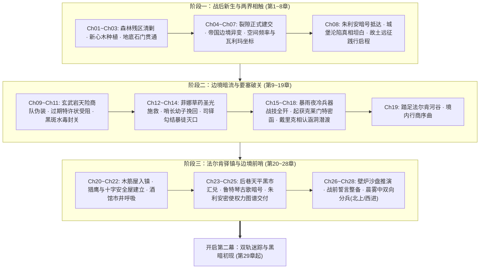

# 第一幕·阶段三：法尔肯驿镇与边境前哨详规（第 20 ~ 28 章）

> **所属方案**：[01_百章宏篇主线演进与阶段规划方案.md](file:///home/nanhu2/comfyui/世界书/方案/第二部/主线与世界扩充方案/01_百章宏篇主线演进与阶段规划方案.md)  
> **更新时间**：2026-09-27  
> **定位**：入境第一座核心据点扎根篇。聚焦法尔肯驿镇市井风土、老驿馆安全屋建立、封建货币黑市汇兑、朱利安王子密使接头、王都势力图谱交付、以及双线（艾德里安线/雷恩线）正式分兵。严守“纯正西欧封建与轨迹 JRPG 文风”、“绝对零导力隐蔽”与“docs2 设定卡完全对齐”。

---

## 一、 核心关卡设定与约束矩阵

| 维度 | 设定参数与铁律 | 违规红线防御 |
| :--- | :--- | :--- |
| **地理舞台** | **法尔肯驿镇（LOC_D2_11）**：开阔河谷台地，深色硬木骨架与粗灰石砌筑的木筋墙建筑（Fachwerk），中央集市喷泉，“猎鹰与十字”老驿馆二楼尽头包厢、背街石阶暗梯 | 严格遵照 `LOC_D2_11` 物理格局；严禁现代电气化设施与中式建筑结构，全部采用牛油壁灯、栎木桌台与生铁插销 |
| **经济与货币** | 携带粗银颗粒与过期银克朗，在后巷掮客天平上折算火耗，兑换当季流通**紫铜便士（Copper Penny）**与地方行商通券 | 严禁出现“碎银”、“银票”、“铜钱”、“文钱”；严格按照欧陆中世纪货币与称重规矩运作 |
| **战术与伪装** | 全员在公共场合严密披挂粗呢旅行斗篷；ARCUS 导力器深锁于牛皮阻断套中；黎恩太刀缠麻布伪装为北地护卫剑 | 王国原住民视导力光芒为异端妖术；所有感知完全限制在肉体凡胎与五感范畴（凡肉眼未见、双耳未闻之事皆不知） |
| **暗线接头** | 朱利安王子的密使以流浪诗人身份弹奏古旧鲁特琴，以王国古歌为隐语接头，经由背街暗梯交接王家测绘地图 | 严禁公开联络王室；接头必须具备封建政治斗争的严密性与隐蔽性，避免惊动圣殿巡逻骑士 |
| **战略分兵** | **主线A（艾德里安+菲）**：北上艾斯特雷亚废墟；**主线B（雷恩+劳拉）**：西进晨光修道院；**中枢（黎恩+菲娜）**：留守法尔肯协调两界 | 艾德里安与雷恩主导自身命运动能；黎恩作为战术后盾，不抢夺原住民的决断权 |

---

## 二、 逐章详尽剧情演进（共 9 章）

### 第 20 章：河谷晨雾中的木筋屋——法尔肯入镇
* **阶段/路线**：第一幕·阶段三 / 边境城镇落脚
* **主要人物**：艾德里安, 黎恩, 菲娜, 雷恩, 劳拉, 菲
* **核心意图**：先遣队穿过关隘涵洞后踏足法尔肯河谷，观察封建集贸重镇的真实社会风貌，避开圣殿骑兵游弋哨卡，安全驶入老驿馆后院。
* **时序情境推进**：
  - 1. **河谷眺望**：双马篷车驶出林道，晨雾散去，起伏台地上展现出一座典型的欧陆集贸城镇；深色硬木骨架与粗灰石砌筑的木筋屋（Fachwerk）鳞次栉比，平顶石板屋顶冒着细细青烟。
  - 2. **集市规避**：中央集市广场停满了各商会的四轮重型货运篷车，羊毛商人与外地佣兵大声喧哗；艾德里安手勒缰绳，避开在主街设立检查哨的圣殿巡逻白鹰轻骑，熟练地将马车拐入潮湿阴暗的石板窄巷。
  - 3. **后院收车**：篷车拐入镇深处一座斑驳的带内院石造大建筑——“猎鹰与十字”老驿馆；厚重的栎木外门无声敞开，马车迅速驶入后院泥地，门后重型生铁插销随即滑落锁死。
* **章节终止条件**：
  - 1. 老驿馆厚重的大门生铁门栓严丝合缝地落入铸铁卡槽。
  - 2. 两辆双马篷车熄灭车辕油灯，静静停驻在后院干燥的草料棚阴影中。
  - 3. 菲伏在后院石墙阴影处朝黎恩打出“无尾随追踪”的手势。

---

### 第 21 章：老驿馆的栎木门——旧部奥托与安全屋
* **阶段/路线**：第一幕·阶段三 / 据点扎根与防务
* **主要人物**：艾德里安, 雷恩, 黎恩, 菲娜, 驿馆店主奥托
* **核心意图**：艾德里安激活早年经商留存的忠诚人脉，确立老驿馆二楼包厢为核心指挥所，完成物理防务布设与私密退路勘查。
* **时序情境推进**：
  - 1. **旧主相认**：灰发佝偻的店主奥托手持鲸油马灯快步走出，艾德里安取下斗篷兜帽并出示北方商会金属印牌背后刻下的私印；老奥托眼眶泛红，躬身行礼：“少爷……三十年了，老朽还守着这间铺子。”
  - 2. **安全包厢接管**：奥托将众人引上二楼最深处的秘密套间；推开加厚双层栎木门，门后配有两道重型锻铁插销，室内铺着粗羊毛地毯，石砌壁炉散发着干燥暖意。
  - 3. **勘查逃生暗梯**：菲推开背街窄窗，查验窗台外贴墙修筑的陡峭石阶暗梯，该梯直通下水道暗巷，可完全避开城镇正面巡逻卫兵的视线；黎恩点头确认此处为绝佳的应急撤离通道。
  - 4. **建立临时指挥站**：黎恩与菲娜将加厚牛皮遮蔽包裹的导力通信机与应急药品存入地窖暗格；雷恩解下负重长剑倚在壁炉边，法尔肯前哨指挥部正式建立。
* **章节终止条件**：
  - 1. 二楼栎木厚门的生铁插销稳稳推上锁孔。
  - 2. 壁炉中的栎木柴块噼啪爆开一粒微红火星，暖意驱散了长途奔波的湿寒。
  - 3. 艾德里安拉上背街厚亚麻窗帘，将外界昏暗的巷道隔绝在外。

---

### 第 22 章：浑浊麦酒与硬黑麦——边境市井的呼吸
* **阶段/路线**：第一幕·阶段三 / 生活流呼吸与市井情报
* **主要人物**：雷恩, 劳拉, 菲, 艾德里安
* **核心意图**：在老驿馆一楼大堂体验浓厚正统的 JRPG 西幻酒馆生活流，倾听往来商旅与佣兵闲谈，捕捉王国内部政局与圣殿异动的零星情报。
* **时序情境推进**：
  - 1. **大堂烟火**：黄昏老驿馆一楼坐满了人，铁铸牛油壁灯散发昏黄光芒；空气中弥漫着浑浊麦芽酒、烤黑麦硬面包、浓洋葱牛肉汤与烟草的粗粝热气，喧闹声不绝于耳。
  - 2. **粗粝饮食**：奥托端来大木托盘，盛着刚出炉表面焦硬的黑麦面包片、大木碗热气腾腾的洋葱炖羊肉汤与一陶壶热香料苹果酒；菲熟练地用短刀挑起羊肉浸润硬面包放入口中，劳拉小口饮着香料酒，耳尖微红。
  - 3. **听取市井风声**：邻桌几个押运毛皮的雇佣兵大声抱怨：“圣殿在平原要塞增兵了整整两个旗队，连出境的商队都要翻底搜查！”、“听说王都大主教亲自批了什么净洁法令，北方几个领地的修道院都被封了。”
  - 4. **情报沉淀**：雷恩握着酒杯的手指微微收紧，与对面的艾德里安交换了一个冷峻的眼神——圣殿与教会的压迫网比他们预想的更快扩展到了边境。
* **章节终止条件**：
  - 1. 粗陶大杯底部的麦酒泡沫缓缓破裂。
  - 2. 邻桌佣兵掷出的骨牌清脆撞在橡木长桌上，爆发出粗鄙的笑骂声。
  - 3. 艾德里安将一枚紫铜便士放在托盘边，起身轻声示意全员上楼。

---

### 第 23 章：后巷天平上的粗银——黑市汇兑与补给
* **阶段/路线**：第一幕·阶段三 / 封建经济与物资整备
* **主要人物**：艾德里安, 黎恩, 菲
* **核心意图**：艾德里安带领黎恩深入集市后巷的地下兑换所，以称重法完成粗银与旧币的汇兑，采购王国旅行必备的凡人物资，强化行商伪装。
* **时序情境推进**：
  - 1. **后巷暗坊**：穿过狭窄阴湿的屠宰巷，艾德里安推开一家无招牌的杂货铺暗门；精瘦的旧金银掮客戴着单眼放大镜坐在铁栅栏后，警惕地打量着戴兜帽的两人。
  - 2. **天平称量火耗**：艾德里安倒出一小布袋未戳印的生银颗粒与十枚磨损的旧银克朗；掮客用牛角刮刀刮下微量银屑投入酸液，随后在黄铜天平上配比砝码，扣除两成成色折损火耗。
  - 3. **清点当季紫铜便士**：掮客交付沉甸甸的三百枚王国正统紫铜便士、以及两张由北方商会承兑的羊皮纸粮油提货通券；艾德里安将铜币分别装入三个坚固的皮钱囊。
  - 4. **采购凡人补给**：两人利用通券在后市采购了四罐未精炼的封灯鲸油、两捆浸油粗麻绳、马蹄防滑铁掌、以及两副防风沙的铜框护目镜；全队行囊彻底抹除任何异界科技印记。
* **章节终止条件**：
  - 1. 黄铜天平的指针在两端砝码平衡后稳稳归中。
  - 2. 皮钱囊扎口生皮绳被用力抽紧，铜币发出沉闷厚重的撞击声。
  - 3. 黎恩提着油布包裹的补给箱，与艾德里安在昏暗窄巷中快步返回老驿馆。

---

### 第 24 章：酒馆角落的鲁特琴——流浪诗人的古歌
* **阶段/路线**：第一幕·阶段三 / 暗号试探与接头契机
* **主要人物**：艾德里安, 菲, 流浪诗人（王家密使）
* **核心意图**：朱利安王子的密使以落魄流浪诗人身份在酒馆大堂以古歌试探，艾德里安以艾斯特雷亚家族旧歌谣对接暗语，达成接头默契。
* **时序情境推进**：
  - 1. **古歌声起**：夜幕降临，大堂角落走入一名身披褪色灰斗篷、怀抱十三弦古旧鲁特琴的青年诗人；手指拨动琴弦，清冽如泉的琴音瞬间穿透了嘈杂的酒馆大堂。
  - 2. **暗语歌词**：诗人吟唱维里迪亚前代民谣《白鹿与鹰》，唱腔在第二段突然变调：“……白鹰折断了北地的麦穗，迷雾散尽时，石墙上的金鸢尾在等待归客。”
  - 3. **菲的斥候排查**：二楼楼梯口的菲压低斗篷，敏锐扫视全场，确认酒馆内外没有圣殿便衣斥候或教会神职人员盯梢，向吧台边的艾德里安微微颔首。
  - 4. **以歌对暗号**：艾德里安端着麦酒走近琴架，随手抛下两枚紫铜便士，用调侃轻浮的语调接续吟道：“……可惜金鸢尾的刺太软，扎不破老鹰的铁爪。”诗人拨弦的手指猛然一顿，抬头露出一双精干锐利的灰眸。
* **章节终止条件**：
  - 1. 鲁特琴琴弦发出最后一个清越的长音颤鸣。
  - 2. 诗人伸手按住落入琴盒的两枚紫铜便士，向艾德里安微微躬身。
  - 3. 艾德里安转身走向楼梯，低声向后抛下一句：“二楼尽头，带油灯来。”

---

### 第 25 章：石阶暗梯上的密匣——王都权力图谱
* **阶段/路线**：第一幕·阶段三 / 绝密情报交接
* **主要人物**：朱利安密使（诗人）, 艾德里安, 雷恩, 黎恩
* **核心意图**：密使经由外墙暗梯潜入包厢，向主角团出示朱利安王子的绝密信物，并交付王国各派军政势力分布图与布防虚实，暗线完全打通。
* **时序情境推进**：
  - 1. **暗梯潜入**：三更时分，背街窗台传来三声轻微叩击；菲拉开木窗，诗人矫健翻入室内，外衣下露出贴身的黑色锁子软甲与王室侍从短剑。
  - 2. **验明正身**：诗人摘下兜帽，从衬里缝线中取出半块刻有维里迪亚王室双头狮徽记的火漆蜡印与信物；艾德里安将手腕上的旧印牌边缘与之咬合，纹路完全吻合。
  - 3. **展开权力图谱**：诗人在厚栎木桌上展开一张浸油羊皮纸——这是朱利安王子秘密耗时两年亲手测绘的《维里迪亚军政势力分布图》；上面用深红标记着圣殿三大要塞，黑墨标出教廷走私水网，淡绿标出同情王室的边缘贵族。
  - 4. **转达王子密谕**：使者低声传达朱利安的话：“殿下知道营地的存在，更知道艾斯特雷亚少爷绝非山贼遗患。王室在等一个能撕开神权铁幕的变数；殿下承诺在暗处为你们抹平通缉档案，但证据必须由你们亲手从旧领与圣殿挖出来。”
* **章节终止条件**：
  - 1. 羊皮纸地图四角被四柄短剑重重压稳在栎木桌面上。
  - 2. 诗人将朱利安的私印指环按在羊皮纸末端，留下一道暗红火漆印鉴。
  - 3. 诗人翻出窗台，消散在背街浓重的夜雾与滴水声中。

---

### 第 26 章：壁炉前的沙盘推演——双线作战方案确立
* **阶段/路线**：第一幕·阶段三 / 战术兵棋推演
* **主要人物**：艾德里安, 雷恩, 劳拉, 菲, 黎恩, 菲娜
* **核心意图**：主角团围聚在地图前进行严密的兵棋推演，明确艾德里安主线A与雷恩主线B的行进动线与风险点，正式确立双线作战方案。
* **时序情境推进**：
  - 1. **废墟路线研判（主线A）**：艾德里安手指划过地图北侧的高地峡谷：“艾斯特雷亚城堡废墟位于圣殿巡逻哨盲区，但外围被古代毒荆棘封锁；我需要菲的敏锐身手与攀爬技巧，避开主道直插主堡地窖。”菲点头，在地图上圈出两处悬崖潜入点。
  - 2. **修道院接头研判（主线B）**：雷恩将一枚黑棋推至法尔肯西侧山脉：“晨光修道院收留过当年的伤员，老修女手中有名册；但圣殿大团长阿达尔伯特已派出追击轻骑，我们必须在他们封院前拿到证据。”劳拉将双手大剑横置膝头：“我和雷恩同行，任何阻拦誓言的利刃由我斩碎。”
  - 3. **后方中枢调度**：黎恩以战术推演官的从容梳理全局：“我和菲娜坐镇法尔肯。这里是连接两界裂隙的唯一咽喉；乔治在后方维持无线电备用线，若两路生变，法尔肯随时派出接应与圣光支援。”
  - 4. **联络信记约定**：全队约定以北方白隼羽毛与特定刀刻暗号作为沿线信鸽与树干留讯标志，避免使用任何导力或魔法通讯。
* **章节终止条件**：
  - 1. 黎恩用木炭条在羊皮纸地图上将北上与西进两条行军路线重重画下箭头。
  - 2. 六人右手覆在地图中央的维里迪亚王都坐标上，无声达成誓约。
  - 3. 壁炉中的火光映红了每个人的眼眸，窗外晨光破晓。

---

### 第 27 章：出征前的整备之夜——誓言、戒指与回响
* **阶段/路线**：第一幕·阶段三 / 私密情感张力与战前整备
* **主要人物**：雷恩, 劳拉, 艾德里安, 菲, 黎恩, 菲娜
* **核心意图**：分兵前夜的深度情感回流与冷兵器整备；劳拉与雷恩确立同生共死羁绊，艾德里安交代旧领凶险，菲娜分发圣光符文石。
* **时序情境推进**：
  - 1. **巨剑与重盾的鸣响**：后院马厩深处，雷恩用磨刀石细致研磨长剑刃口，金属摩擦声节奏沉稳；劳拉立于一旁，低头注视手指上戴着的艾斯特雷亚家族戒指，低声道：“雷恩，这一趟我们既是去为你正名，也是为了给他的家族讨回公道。”雷恩停下磨石，握住劳拉带着薄茧的手。
  - 2. **短刃与潜行索**：二楼廊柱下，菲正在给双枪剑的刃身擦拭防锈鲸油，艾德里安斜靠在墙边，少见地收起轻浮戏谑：“旧领地底下……死过很多人。如果遇到不可名状的东西，不要管我，立刻撤出来。”菲面无表情地扣紧护腕：“猎兵从不半途丢下雇主。走得进去，就带得出来。”
  - 3. **药包与圣光符文石分发**：包厢内，菲娜将爱丽榭特制的野山菌干酪干粮包与止血草药膏分发给两队，并在每个人的皮斗篷内侧缝入一枚纯净温润的圣光符文石：“如果遭遇暗影黑血，捏碎它，能保你们三次心脉不被腐蚀。”
  - 4. **黎恩的战术守护**：黎恩检查完两队马匹的铁掌与鞍具，在门前与雷恩、艾德里安分别击掌，战士间的深沉默契无需多言。
* **章节终止条件**：
  - 1. 最后一枚圣光符文石在粗呢斗篷衬里缝好最后一记锁边针脚。
  - 2. 太刀与巨剑同时严密收入粗皮剑鞘，发出两道清脆沉重的卡扣声。
  - 3. 菲娜轻声的祈愿祝祷融入老驿馆屋檐下的冷清夜风。

---

### 第 28 章：雾散晨曦中的双向分兵——北上与西进
* **阶段/路线**：第一幕·阶段三 / 双线正式分进（第一幕大结局）
* **主要人物**：艾德里安, 菲, 雷恩, 劳拉, 黎恩, 菲娜
* **核心意图**：第一幕总收官。晨曦中两支队伍策马出镇，正式开启第二幕“主线A焦土调查”与“主线B圣殿对决”，黎恩与菲娜坚守中枢，格局拉开。
* **时序情境推进**：
  - 1. **晨霜踏足**：拂晓时分，法尔肯河谷被一层清冷的白霜覆盖；老奥托早早打开后院侧门，四匹强健的边境挽马已备好鞍鞯与防水驮囊。
  - 2. **主线A启程（北上旧领）**：艾德里安深裹深色旅行短篷，翻身上马；菲如灵巧的飞燕跃上另一匹黑马，短斗篷在晨风中微微翻飞；艾德里安在马上朝黎恩扬了扬缰绳：“法尔肯的账单记我名下，等我带着地窖的好酒回来。”双骑转入通往北方喀斯特荒原的泥泞小道。
  - 3. **主线B启程（西进圣殿修道院）**：雷恩佩戴长剑与厚重圆盾，神情如远山般沉穆；劳拉身负深蓝巨剑策马并行，两骑并辔朝着西侧群山与晨光修道院方向稳步疾驰。
  - 4. **中枢守望（第一幕大闭环）**：黎恩与菲娜立于老驿馆二楼窗前，目送两路烟尘渐渐隐没在河谷晨雾的尽头；黎恩按着腰间太刀，目光锐利深远：“第一步已经迈出去了……接下来，轮到我们守护好后背了。”
* **章节终止条件**：
  - 1. 两路马蹄声在河谷林道的晨雾中渐渐平息至完全不可闻。
  - 2. 法尔肯集市钟楼敲响清晨第一记沉浑的生铁晨钟。
  - 3. 黎恩拉下厚栎木窗栓，转身走向铺满军政图纸的战术指挥台。

---

## 三、 第一幕全 28 章宏观演进全景图

