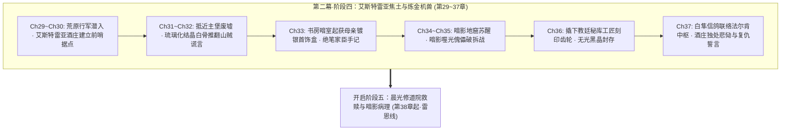

# 第二幕·阶段四：艾斯特雷亚焦土与炼金机兽详规（第 29 ~ 37 章）

> **所属方案**：[01_宏篇主线演进与阶段规划方案.md](file:///home/nanhu2/comfyui/世界书/方案/第二部/主线与世界扩充方案/01_宏篇主线演进与阶段规划方案.md)  
> **更新时间**：2026-09-27  
> **定位**：第二幕主线A首战破局篇。聚焦艾德里安与菲北上旧领废墟深度勘查、十九年前家族覆灭真相初露、母亲镀银首饰盒遗物起获、重装发条机兽【暗影噬光傀儡】核心破拆 Boss 战、教廷秘库工匠印号铁证起获、以及与法尔肯中枢的白隼信记联动。严守“纯正西欧封建与轨迹 JRPG 文风”、“绝对零导力物理战技”、“防同质化五感轮换”与“docs2 设定卡完全咬合”。

---

## 一、 核心关卡设定与约束矩阵

| 维度 | 设定参数与铁律 | 违规红线防御 |
| :--- | :--- | :--- |
| **地理舞台** | **艾斯特雷亚酒庄**：城堡东南5km，半地下葡萄酿酒坊，大橡木桶长廊盲区，前哨休整与疗伤据点。 **艾斯特雷亚堡**：中西部丘陵腹地，断折主塔、焦黑内城垣、坍塌中庭与双剑鹫鹰纹章。 **暗影地窟**：城堡塌陷地基下数十米，断裂倾斜肋拱石梁空腔，古代暗影实验失控核心点。 | 严格依照 `LOC_D2_13`、`LOC_D2_37`、`LOC_D2_14` 物理格局；严禁现代与中式结构，全域依赖粗石、风化羊毛织毯、发酵橡木桶与断裂花岗岩。 |
| **反派武力** | **暗影噬光傀儡**：高3米、数吨重发条机兽；绝魔黑钢浸润装甲；背部黄铜排气减震阀；微型重力迟滞力场；胸腔“无光黑晶”永动核心；核心齿轮刻有教廷秘库工匠印号。 | 严格执行《方案四：反派双重武力体系与战斗机制方案》；严禁神化与魔法对轰，必须由高机动猎兵破除减震排气阀后，由纯物理突刺破坏传动轴。 |
| **时间线锚定** | **两段式历史架构**：三十一年前教廷秘密启动暗影实验（克莱门特三世上任）；十九年前实验失控导致艾斯特雷亚城堡陷落覆灭，时年6岁的艾德里安（现年25岁）由母亲嘱托逃出。 | 严禁出现“25岁主角逃出31年前惨案”的时序数学漏洞；严格统一“31年暗影实验历史”与“19年前城堡陷落惨案”。 |
| **防同质化轮换** | **五感物象分阶轮换**： *气候音响*：喀斯特荒原秋风、断壁风化穿堂风呜咽、生锈发条齿轮沉闷咬合与铜阀高压排气声； *饮食行囊*：军用干粮包（浸冷水泡发咸肉干与硬燕麦干酪饼）、防腐杜松子烈酒、酒庄地下三十年老橡木桶微酸葡萄酒。 | 绝对绝缘第一幕的“法尔肯集市喷泉、老驿馆麦酒、热香料苹果酒、硬黑麦面包”；彻底告别温润市井生活流，进入荒原与地下城硬核探险质感。 |
| **战术与伪装** | 全员身披深色粗呢旅行斗篷；ARCUS 导力器深锁于乔治特制牛皮阻断套中；武器为双枪剑（菲）与家传刺剑（艾德里安），纯凡人肉体感官与冷兵器碰撞。 | 绝对零导力外溢；严禁魔法闪光；菲娜与黎恩留守法尔肯驿镇作为后方联络中枢，不抢夺艾德里安命运动能。 |

---

## 二、 逐章详尽剧情演进（共 9 章）

### 第 29 章：晨雾离镇与喀斯特丘陵——北上旧领荒原
* **阶段/路线**：第二幕·阶段四 / 荒原潜入与隐秘行军
* **主要人物**：艾德里安, 菲
* **核心意图**：主线A二人组拂晓离开法尔肯驿镇，避开王国主驿道圣殿巡逻哨，深入中西部崎岖荒凉的喀斯特丘陵荒原，以猎兵行军标准建立野外反追踪默契。
* **时序情境推进**：
  - 1. **晨雾离镇**：黎明破晓前，艾德里安与菲策马由迷迭香商行后巷暗道穿出法尔肯北哨口；两人均深罩粗呢防风短斗篷，避开主驿道圣殿白鹰轻骑巡逻哨卡，转入通往中西部丘陵的荒芜碎石马道。
  - 2. **喀斯特地貌与斥候搜寻**：进入连绵起伏的灰色石灰岩荒原，秋风扫过半人高的枯黄棘草；菲伏在马鞍上仔细观察沿途兽道折断痕迹与雨蚀石缝，确认后方数公里内无任何教廷密探或战鹰追踪。
  - 3. **风化岩洞冷餐休整**：正午两人在一处避风的风化石穴阴影中暂歇饮马；菲取出防水油布包裹的军用干粮包，以冰冷泉水泡开坚硬的风干咸肉干与干酪燕麦饼充饥，递给艾德里安一银皮壶防腐杜松子烈酒。
  - 4. **眺望旧领地平线**：艾德里安咽下辛辣烈酒，解开领扣注视地平线尽头耸立的灰黑山脊，少见地收起了轻浮调侃的笑容，眼神逐渐凝铸如铁。
* **章节终止条件**：
  - 1. 银皮水壶的旋盖被拧紧至最后一记金属咔嗒声。
  - 2. 菲单手勒住黑马缰绳，短刀微挑出鞘指向北方丘陵凹口处隐现的枯黑葡萄藤架。
  - 3. 两骑马蹄踏碎碎石坡上的晨霜，迅速没入背风山脊的浓重阴影中。

---

### 第 30 章：荒芜的老葡萄藤——艾斯特雷亚酒庄
* **阶段/路线**：第二幕·阶段四 / 前哨据点与酒庄安全屋
* **主要人物**：艾德里安, 菲
* **核心意图**：抵达城堡东南五公里处的附属酒庄，排查半地下酿酒坊与大橡木桶长廊盲区，建立深入主堡废墟的隐蔽后方前哨。
* **时序情境推进**：
  - 1. **踏足荒废庄园**：穿过漫山遍野如扭曲铁丝般肆意抽枝的野老葡萄藤，两人踏入古老青石坡顶的艾斯特雷亚酒庄；石墙生满斑驳苔藓，四周万籁俱寂。
  - 2. **排查半地下酒窖**：菲拔出双枪剑推开倾斜厚重的栎木外门，以猎兵战术手语搜索半地下拱形酿酒坊；地下空气阴凉干燥，弥漫着陈年发酵橡木、微酸葡萄果皮与干草的醇香，未见任何魔兽侵占痕迹。
  - 3. **勘验橡木桶盲区暗室**：穿过两排高达两米半的陈年大橡木桶长廊，推开尽头被空酒桶掩挡的庄园主起居暗室；室内配有铺陈旧羊毛褥的完好木板床与干燥石壁炉，为绝佳的密闭据点。
  - 4. **泥封陈年酒的慰藉**：艾德里安用短刀划开石壁凹龛中一坛保存完好的陈年红酒泥封，倒出两粗陶杯暗红酒液，低声自嘲：“十九年了……酒庄的土还是当年的酸涩味。”菲抿了一小口，平静回复：“保存得很好。适合战后缝针消毒。”
* **章节终止条件**：
  - 1. 地下酒窖厚重栎木门后的生铁暗门闩稳稳推入锁槽。
  - 2. 粗陶杯中的暗红葡萄酒液泛起一圈微澜后彻底平息。
  - 3. 菲将双枪剑整齐搁在栎木长桌边缘，拉严粗麻窗帘遮断外界微光。

---

### 第 31 章：毒荆棘缠绕的双剑鹫鹰——抵近主堡废墟
* **阶段/路线**：第二幕·阶段四 / 废墟突入与外围清缴
* **主要人物**：艾德里安, 菲
* **核心意图**：两人穿过古代毒荆棘带抵近艾斯特雷亚堡，清除外围变异猛兽，直面焦黑残垣上的家族双剑鹫鹰纹章，开启地表废墟探查。
* **时序情境推进**：
  - 1. **穿越毒荆棘壕沟**：离开酒庄徒步潜行至城堡山脚，干枯开裂的护城壕被带有倒钩与暗紫毒斑的古代荆棘严密覆盖；菲利用轻量钩爪与多股钢索在悬崖凸石间开路，掩护艾德里安避开毒刺陷阱。
  - 2. **主堡废墟轮廓**：翻上丘陵之巅，十九年前沦为焦土的艾斯特雷亚堡赫然呈现眼前——折断的高耸主塔如同刺向灰天的焦黑断骨，坍塌的内城垣在秋风中瑟瑟作响。
  - 3. **肃立于双剑鹫鹰纹章前**：主城门巨石门梁严重倾斜，但石梁正中央浮雕的艾斯特雷亚家族“双剑鹫鹰”家徽依然清晰可辨；艾德里安伸手抚摸被烈火熏黑的石刻凹槽，指节微颤，童年火海的惨叫在耳畔隐隐轰鸣。
  - 4. **无声绞杀外围游荡兽**：废墟中庭传来低沉嘶吼，两头栖息在塌方城垛的残区变异猎犬被生人气息惊动；菲如白色飞燕疾掠而出，双枪剑反手划出两道无声冰冷弧光，利落切断野兽喉管，打出“通路肃清”手势。
* **章节终止条件**：
  - 1. 菲用亚麻布条擦净双枪剑刃上的污血，收剑入鞘。
  - 2. 艾德里安靴底踏碎焦黑的花岗岩碎砖，一步迈入倒塌的城堡大门洞口。
  - 3. 废墟城垛上一只黑羽乌鸦扑棱展翅，尖叫着飞入阴沉天幕。

---

### 第 32 章：坍塌回廊与琉璃白骨——十九年前的焦痕
* **阶段/路线**：第二幕·阶段四 / 现场法医勘查与谎言推翻
* **主要人物**：艾德里安, 菲
* **核心意图**：深入焦黑领主大厅瓦砾堆，排查当年死难卫士骸骨，通过骨骼反常的“微紫琉璃化与酸蚀空洞”，在法理与物理层面彻底推翻教廷“山贼夜袭洗劫”的官方假案。
* **时序情境推进**：
  - 1. **领主大厅废墟**：中庭碎石散落着大量锈成黑渣的折断长戟与铁盾牌，日光穿过坍塌穹顶投下惨白斜照；当年华丽的拱顶壁画已化为炭黑硬壳。
  - 2. **挖掘坍塌梁柱**：菲凭借资深猎兵对战场的直觉，在一处倾斜卡死的巨大花岗岩承重梁下发现了几具被倒塌碎石深埋的古代家族骑士骸骨。
  - 3. **惊骇的病理学发现**：菲戴上加厚牛皮手套清理骸骨上的灰烬，将一根折断的肋骨残片举至光下；骨骼截面并非粗糙的刀砍斧劈痕迹，而是呈现出极度诡异的**微紫琉璃化高温结晶**，骨髓腔布满了蜂窝状强酸腐蚀空隙！
  - 4. **推翻山贼官方定性**：菲冷声分析：“这不是冷兵器砍杀，也不是常规火灾。高温瞬间超过千度，且混杂强腐蚀炼金酸液……只有军用级高阶炼金工坊爆炸才有这种痕迹。”艾德里安脸色铁青，牙关紧咬：“山贼连精钢马刀都凑不齐……教廷当年就是用这种谎言抹杀了我整个家族！”
* **章节终止条件**：
  - 1. 带有微紫晶状颗粒的骨骼样本被严密锁入菲随身携带的小铅盒中。
  - 2. 艾德里安一脚踢开焦木残骸，暴露出下方被炭灰封堵的地下黑石引道口。
  - 3. 一阵凄厉的穿堂阴风卷起大厅中的焦黑碎屑，打在石壁上沙沙作响。

---

### 第 33 章：母亲的镀银首饰盒——废墟暗阁的遗物
* **阶段/路线**：第二幕·阶段四 / 私密创伤与绝笔铁证
* **主要人物**：艾德里安, 菲
* **核心意图**：艾德里安在母亲起居书房废墟的壁炉暗格中，起获母亲遗留的镀银首饰盒与家臣绝笔羊皮纸；直面十九年前母亲决绝推开自己出逃的血腥真相，情感极度压抑克制，誓死复仇。
* **时序情境推进**：
  - 1. **西翼书房残迹**：穿过开裂的连廊，艾德里安领着菲进入母亲生前起居的书房废墟；花岗岩书架全部风化坍塌，唯有角落那座雕刻着忍冬草花纹的黑理石壁炉依然半立。
  - 2. **撬开壁炉暗龛**：艾德里安按照六岁时母亲悄悄演示的机关，以佩剑尖端刺入壁炉烟道右侧第三块石缝深处；沉重机括弹开，壁后暗洞里露出一只被油蜡布层层包裹的古旧硬木匣。
  - 3. **母亲的银盒与家臣绝笔**：解开油布，里面整齐放着母亲当年的镀银雕花首饰盒、一把折断的家族短剑、以及贴身近卫骑士长写在羊皮纸上的带血绝笔：“……教廷地窖里的发条铁兽失控了，黑雾在溶化石墙……圣殿骑士封锁了外门，他们不是来救援的，他们在倒火油灭口……带少爷走……”
  - 4. **压抑克制的痛楚与誓言**：首饰盒内静静躺着艾德里安六岁时的一缕淡金色胎发；艾德里安眼眶通红，手指死死攥紧银盒边缘直至指节泛白，嘴角却强撑出一抹森寒的自嘲冷笑：“教廷的大人物们……连给小孩子留个念想都不愿意啊。”菲默默背过身立于门廊断柱旁横剑戒备，留给贵族最后的自尊空间。
* **章节终止条件**：
  - 1. 镀银首饰盒的生铁小搭扣发出清脆坚实的合拢闭锁声。
  - 2. 艾德里安将银盒与绝笔羊皮纸严密贴身收入斗篷内衬。
  - 3. 地底深处突然传来一阵极其低沉、宛如巨型齿轮咬合转动的闷雷震颤。

---

### 第 34 章：沉闷齿轮的咬合声——暗影地窟的苏醒
* **阶段/路线**：第二幕·阶段四 / 地窟潜入与巨兽苏醒
* **主要人物**：艾德里安, 菲
* **核心意图**：顺地基坍塌孔道深入数十米之下的古代暗影地窟，触动古代休眠防卫系统，重型发条金属机兽【暗影噬光傀儡】正式激活破闸登场。
* **时序情境推进**：
  - 1. **下行暗影地窟**：两人顺着塌方碎石斜坡绳降数十米，踏足城堡地基深处的暗影地窟；这里由断裂倾斜的粗花岗岩肋拱勉强支撑，空气死寂粘稠，充斥着刺鼻的硫磺、润滑机油与暗影废渣的微温异味。
  - 2. **法阵残骸与警戒触动**：地窟中央赫然残留着一座被撕裂的巨型黑石法阵基座；当菲踏过地面的断裂高压铜管时，暗格深处的重型压力感应齿轮骤然触发，地底传出令人牙酸的金属弹簧上弦声。
  - 3. **铁闸碎裂与机兽登场**：轰隆一声巨响，地窟深处的锻铁厚闸门被生生撕开；一具高达三米、重达数吨的发条金属机兽——**暗影噬光傀儡**破土踏出！石雕滴水兽头颅上的双眼骤然亮起幽暗妖异的暗紫光晕！
  - 4. **高压蒸汽威慑**：傀儡体表覆盖掺有暗影废渣的绝魔黑钢浸润装甲，后颈与背部的黄铜散热阀发出凄厉尖啸，间歇喷吐出滚烫的高压废气白雾；合金巨爪在石壁上一抓，坚硬的花岗岩石梁瞬间被切出三道深痕！
* **章节终止条件**：
  - 1. 机兽重步踏碎石板，引发整个地下溶洞碎石簌簌崩落。
  - 2. 菲反手甩出攀爬滑轮钢索，尖锐锚爪死死咬合住头顶的坚固肋拱石梁。
  - 3. 艾德里安拔出腰间家传长剑，剑尖直指傀儡胸腔中心泛着紫光的动力轴缝隙。

---

### 第 35 章：猎兵飞索与家传突刺——暗影噬光傀儡破拆战（核心 Boss 战）
* **阶段/路线**：第二幕·阶段四 / 战术破拆与冷兵器绝杀
* **主要人物**：艾德里安, 菲
* **核心意图**：面对微型重力迟滞力场与绝魔黑钢装甲，菲发挥猎兵高空机动与定向爆破炸毁背部排气减震阀，艾德里安以艾斯特雷亚家传刺剑战技穿刺传动齿轮主轴，合力完成纯物理战术破拆。
* **时序情境推进**：
  - 1. **重力迟滞力场受阻**：傀儡胸腔的无光黑晶嗡鸣加速，周身十米骤然张开微型重力迟滞力场；菲射出的轻型飞刃在空中被力场骤然减速坠地，正面轻量物理劈砍完全无法穿透其绝魔浸润重甲。
  - 2. **高空滑轮钢索机动**：菲利用滑轮钢索在地窟四根石柱与拱梁间高速摆荡，利用高敏捷身手完全切入机兽笨拙转身的视线盲区；机兽狂暴挥爪横扫，只砸碎了菲留下的残影石柱。
  - 3. **定向爆破炸毁排气阀**：菲如燕雀般自半空俯冲，身形轻巧落于机兽后背，双枪剑精准刺入机兽颈后高压铜管接缝并塞入定向破拆炸药；轰然爆鸣中，机兽背部核心黄铜散热排气阀被彻底炸碎，高压蒸汽疯狂外泄，机体减震系统瞬间瘫痪！
  - 4. **艾斯特雷亚致命贯穿**：失去减震的傀儡行动严重卡顿，齿轮发出尖锐啸叫；艾德里安抓住破绽，低重心瞬步突进至机兽右侧死角，调动全身战技力量，家传长剑如流星贯日般刺入傀儡右胸与传动轴咬合的毫厘缝隙！
  - 5. **终局切断核心**：剑尖刺断传动主轴，机兽庞大躯体轰然失去平衡单膝跪地；菲凌空倒悬而下，双枪剑尖垂直扎入滴水兽后颈中枢神经管路，彻底粉碎动力链条！
* **章节终止条件**：
  - 1. 暗影噬光傀儡残破的背部铜管喷吐出最后一缕微弱的惨白冷气。
  - 2. 滴水兽眼眶中暗紫水精石的光芒彻底熄灭，庞大的金属机躯轰然倾覆在碎石坑中。
  - 3. 艾德里安用力拔出卡在齿轮深处的宝剑，剑身在幽暗地窟中泛着清冽寒光。

---

### 第 36 章：教廷秘库的工匠印号——铁证确凿
* **阶段/路线**：第二幕·阶段四 / 战果收缴与法理铁证
* **主要人物**：艾德里安, 菲
* **核心意图**：两人破拆傀儡残骸，取出核心“无光黑晶”，在重型发条齿轮内圈赫然发现深深烙印的“教廷秘库工匠序列号”，掌握枢机主教克莱门特三十一年罪证的最硬核物理铁证。
* **时序情境推进**：
  - 1. **破拆残骸胸腔**：地窟中弥漫着刺鼻的烧焦机油与硫磺烟雾；菲用撬棍强行掀开傀儡胸腔扭曲变形的黑钢装甲外壳，露出咬合精密的巨型内部齿轮组。
  - 2. **取出无光黑晶核心**：菲以耐腐蚀牛皮手套小心翼翼取下胸腔正中散发冰冷微引力波动的“无光黑晶”原石，封入乔治特制的铅制阻断盒内并旋紧螺栓。
  - 3. **发现教廷工匠铭文**：艾德里安举起火把照亮主齿轮传动圈内壁，拭去焦黑的润滑油泥，一行深深冲压在纯青铜金属上的古代工匠铭文与徽记清晰显露：`Curia Secreta - Opus XXXI - Anno 3441`（**教廷秘库·第三十一号工造·圣光纪元3441年**，正是三十一年前克莱门特三世启动古代暗影工程的立项年份）！
  - 4. **铁证落定**：齿轮边缘甚至还残留着未完全风化的晨光教廷特使火漆印章残痕；艾德里安深吸一口冷气：“制造编号、年份、教廷秘库专有工印……当年暴走的兵器，根本就是克莱门特这帮神职人员亲手送进城堡地下的！”
* **章节终止条件**：
  - 1. 菲用木炭条与粗羊皮纸将齿轮内壁的工匠批号与教廷火漆印鉴清晰完整地拓印完毕。
  - 2. 艾德里安用短刀撬下那一截带有绝密工匠批号的断裂青铜齿轮，塞入行囊深处。
  - 3. 铅制阻断盒的锁扣扣死，地窟内最后一丝暗紫幽光彻底泯灭。

---

### 第 37 章：风暴前夕的信鸽与回流——北地废墟的誓言（阶段四收官）
* **阶段/路线**：第二幕·阶段四 / 战后回流与誓言升华
* **主要人物**：艾德里安, 菲（中枢联动：黎恩, 菲娜）
* **核心意图**：撤回酒庄暗室整备疗伤，菲将拓片与密函绑上白隼发往法尔肯中枢；艾德里安独处面对母亲遗物彻底宣泄悲恸，淬炼出向教廷神权发起大审判的决然道义动能。
* **时序情境推进**：
  - 1. **酒庄暗室休整**：黄昏两人撤回艾斯特雷亚酒庄地下起居暗室；菲动作熟练地用烈酒清洗艾德里安手臂被装甲刮破的皮肉，敷上止血草药膏并绑好粗麻绷带，随后悄然退出带上木门。
  - 2. **暗夜信鸽联动**：酒庄露台上，菲将缩微的齿轮拓片与密函缝入特制羽毛囊，系在北方白隼脚爪上抛向铅灰色的阴云天幕；白隼振翅疾飞，向南方河谷法尔肯的黎恩中枢送出一级战备情报。
  - 3. **法尔肯中枢震动**：深夜法尔肯老驿馆二楼，黎恩与菲娜在煤油灯下展开白隼密函；教廷秘库工匠序列号与琉璃白骨铁证让黎恩目光骤紧：“教会三十一年来的黑幕遮羞布已经被撕开了……通报雷恩与劳拉，准备在白鹿大驿馆展开阶段汇合。”
  - 4. **独处宣泄与极剑誓言**：酒庄起居暗室中，艾德里安独坐于烛火摇曳的木床边；捧着母亲冰冷的镀银首饰盒与金色胎发，十九年来深藏心底的痛楚终于无声冲破堤防，滚烫泪水砸在银盒上；但他没有沉溺太久，抬手擦净脸庞，眼神冰冷如刃，抚剑立誓：“艾斯特雷亚的名字绝不会背着山贼的污名死去……克莱门特，王都法庭上见。”
* **章节终止条件**：
  - 1. 白隼信鸽在黑夜浓云中彻底消失无踪。
  - 2. 艾德里安佩剑剑鞘发出清脆沉重的锁止咬合声。
  - 3. 起居暗室桌上的单支蜂蜡烛芯被剑风扑灭，北地丘陵沉入黎明前最深沉的死寂。

---

## 三、 第二幕·阶段四宏观演进图

