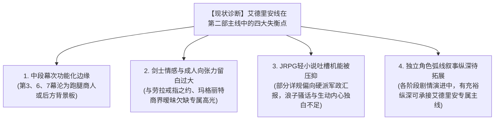
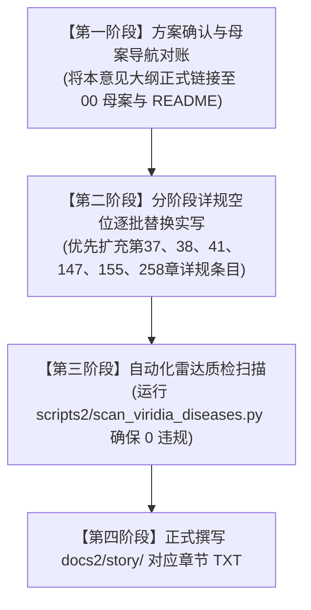

# 艾德里安主线剧情扩充大纲与设计意见建议

> **所属母案**：[00_第二部宏篇主线总纲与方案管理中枢.md](00_第二部宏篇主线总纲与方案管理中枢.md) · [01_宏篇主线剧情总大纲与分幕导航.md](01_宏篇主线剧情总大纲与分幕导航.md)  
> **文档属性**：第二部主线A（艾德里安线）专项演进深化、角色弧线重构与专属剧情高光方案  
> **核心基准**：**纯正日式 RPG 剑与魔法（JRPG Western Fantasy）**，轻松有趣的日式轻小说日常与呼吸感，穿插可爱生动的内心独白与吐槽，兼顾成人向情感张力与背德反差。  
> **底层防御**：严格遵循 [`viridia-writer`](../../../.agents/skills/viridia-writer/SKILL.md)、[`writing-guards.md`](../../../.agents/rules/writing-guards.md) 与 [`lexicon.md`](../../../.agents/rules/lexicon.md)。

---

## 一、 第二部档案库与现有主线架构对账审查报告

作为专业游戏设计师与剧情写手，在深入研读 `docs2/`（尤其是 `docs2/character/艾德里安.TXT`、`docs2/location/`、`docs2/npc/`）以及 `方案/第二部/主线与世界扩充方案/` 全套母案与十幕三十阶段详规后，针对艾德里安在第二部的角色定位与戏剧功能，形成以下系统性对账审计：

### 1. 核心人设与戏剧资产核验（docs2 实体基准）

* **基本属性与外貌**：25岁，维里迪亚王国艾斯特雷亚家族末裔，身高 182cm。银灰色长发随意束在脑后，几缕碎发垂额，琥珀色瞳孔常带三分戏谑、三分温柔与四分深邃；身穿考究但略显磨损的深色天鹅绒贵族长外套，领口有褪色的双剑鹫鹰家纹刺绣；腰佩精工家传刺剑；最后一枚家传指环（家督信物）已在第一部赠予劳拉（“带着它回来”）。
* **核心性格反差与“刺猬心理”**：
  * **用轻浮掩饰自尊**：外表慵懒浪荡、言语轻佻调侃，嘴角常挂让人捉摸不透的弧度；面对困境摆出“我早就猜到了”的游刃有余；
  * **对“失去”具有病态恐惧**：六岁经历家族城堡覆灭，痛失双亲、领地与地位，靠浪子面具抵御创伤；内心极度渴望作为真实的“艾德里安”被同伴需要，而非作为空壳“贵族”被同情；
  * **独特的语言防线（从不直接索求）**：从不使用“我需要”、“我想要”，永远将真实需求包装为提议（“你想去酒庄看看吗？刚好我也要去”）；眼角在说真话时会收紧；被戳穿时会停一息然后失笑转移话题；
  * **神圣面前的从容碎裂**：面对高洁出尘的精灵守护者 Seraphina（菲娜），他的轻佻假面会短暂失灵，随后用更夸张的玩笑掩饰敬畏。
* **终极历史使命与诉讼正名之志**：
  * **两大历史节点**：三十一年前克莱门特三世秘密启动古代暗影实验；十九年前实验失控暴走毁灭城堡，官方构陷定性为“工坊自毁与境外流寇洗劫”；
  * **司法大原告定位**：艾德里安深知暗杀无法洗刷污名，必须凭借三大物理铁证（冲压齿轮、灭门密令、王家特许状原本），在大理院与真理广场大陪审团面前公开掀翻伪案，为家族昭雪并合法收复祖地。

### 2. 现有主线架构中的四大结构性短板诊断

在目前的十幕三十阶段主线详规骨架中，艾德里安虽然作为“主线A”的主角被确立，但在具体的章节分布与戏剧流向中，暴露出以下亟待优化的痛点：

1. **中段幕次（第三幕、第六幕、第七幕）角色功能化与边缘化**：
   * **第三幕（王都商路）**：艾德里安仅仅承担了“去公署办居留证、找中介租下白榆货栈”的工具人职责，严重缺失了他作为一个“十九年后重返故都的落魄贵族”直面昔日繁华街道、遭遇冷眼旧贵族或上层社交试探时的复杂心理博弈与日轻反差趣味；
   * **第六、七幕（地底古道与惊天劫狱）**：光芒完全集中在学者组（玲、凯尔）、特务组（亚尔缇娜）与主攻手（劳拉、加尔）身上，艾德里安被简单归并在“酒庄统筹后方七村情报网”，缺少其擅长的贵族刺剑敏锐战技、王都上层情报刺探与外围牵制行动。
2. **核心情感纽带与成人向张力留白过大**：
   * **与劳拉的“戒指与双剑之盟”**：在第五幕阶段十五，劳拉断剑卧床，艾德里安觉醒领主意志。两人共处酒庄地窖，但详规重点放在了劳拉与黎恩、艾玛的互动上，艾德里安与劳拉之间关于家传戒指、残剑守护、剑士身体共鸣与深情抚慰的高光被大量略过；
   * **与玛格丽特夫人的封建社交拉扯**：作为法尔肯商行手握重权的优雅熟女，玛格丽特与艾德里安有着长达数年的行商旧交，两人的私密账房博弈、酒香暗涌与成人向调情本是极佳的调味剂，目前仅停留在事务性报账；
   * **与黎恩菲娜的默契与背德反差**：面对黎恩的“老好人”本质与菲娜的圣洁娇羞，艾德里安的心理攻防与私下调侃展现得不够舒展。
3. **JRPG 轻小说日常呼吸感与内心独白机能被压抑**：
   * 艾德里安是整支队伍中最好的“吐槽役”与“气氛活跃担当”。然而在部分详规条目中，他的台词被写成了正经严肃的战情汇报，丢失了他特有的“慵懒自嘲、用荒诞比喻解构严肃危险、内心弹幕疯狂吐槽”的生动质感。
4. **独立角色弧线叙事纵深待拓展**：
   * 十幕三十阶段详规中，各阶段天然具备承载艾德里安独立支线、情感升温与个人试炼的丰富容量。

---

## 二、 游戏设计师与剧情写手专业建议

基于上述痛点，针对艾德里安线的扩充，提出以下 **五大核心设计建议**：

### 建议 1：重铸“艾德里安专属声音合同”与轻小说吐槽/内心独白系统

在所有涉及艾德里安的章节中，全面植入日式轻小说的**双层声线结构**：
* **表层对白（优雅轻浮与反客为主）**：
  * 拒绝正经直白，永远用调侃化解尴尬。面对凶险：“真不凑巧，我的刺剑刚擦了昂贵的防锈油，弄脏了可是要扣你报酬的，黎恩。”
  * 被同伴关心时口嫌体正直：“劳拉，不要用那种看着迷路小狗的眼神看我，好歹我也是有爵位继承权的男人……好吧，面包如果再多抹一层黄油，我可以考虑接受你的同情。”
* **深层内心独白（细腻入微与可爱吐槽）**：
  * *对黎恩*：“（这家伙又在多管闲事了。明明自己身上的麻烦比谁都多，却总是第一眼先看别人有没有受伤。真是个无药可救的烂好人……不过，能把后背交给这种笨蛋，大概是神明对我唯一的恩赐吧。）”
  * *对菲*：“（这只猫系猎兵又从不知道哪个房梁上跳下来了，落地连点灰尘都没扬起来。她是真的把我的斗篷当成了猫抓板吗？）”
  * *对菲娜*：“（每次这位精灵守护者大人露出温柔微笑的时候，我都觉得周围的空气好像都变得高尚起来了……啧，果然正经的气场是我这种泥泞里打滚的浪子最应付不来的东西。）”

### 建议 2：将“艾德里安×劳拉”的羁绊升维为主线级剑士心魂共鸣

* **双佩剑与戒指的信物闭环**：
  * 劳拉脖颈间一直系着艾德里安托付的家传戒指；而劳拉双手大剑折断后，艾德里安不仅守护其养伤，更在第五幕深夜将佩剑借予劳拉参悟“刚柔相济”的剑道；
  * 在断剑重铸期间，艾德里安提供艾斯特雷亚家族古代学者工匠的珍藏配比配方，将两人的命运在物质与灵魂层面彻底焊死。
* **成人向与私密情感的温润刻画**：
  * 剑士之间抚摸剑茧的粗粝触感、地窖酒桶后的温热呼吸、战伤清创时的克制心跳；
  * 劳拉的耿直坦荡与艾德里安的浪子慌乱形成强烈反差，打造极具荷尔蒙美感的 JRPG 成人向浪漫。

### 建议 3：强化第三幕“故都旧影”与落魄贵族王都社交修罗场

* 激活艾德里安在王都上城区的暗线活动：
  * 当年踩着艾斯特雷亚废墟瓜分商路的王都投机贵族与冷眼旁观者，在第三幕与艾德里安相遇；
  * 艾德里安不搞中式“龙王归来打脸”，而是展现纯正 JRPG 风格的**优雅贵族风骨**——穿着洗得发白的长风衣，在高级红酒拍卖会或旧物集市上，用无可挑剔的贵族礼仪和毒舌挑剔，让暴发户自惭形秽，悄无声息地套取反派商路布防密档。

### 建议 4：深化与第一王子朱利安的“君臣/兄弟”双雄拉扯

* 艾斯特雷亚家族曾因先王的软弱而牺牲；朱利安背负着王室的愧疚，艾德里安则带着历史的伤痕。
* 两人从第一幕初见的互相审视，到第四幕白鹿驿馆的生死并肩，再到第五幕地窖泥泞中的推心置腹，最终在第十幕大理院与真理广场上达成“君王与守护封臣”的现代法理盟约，打造比肩经典 JRPG 的双雄成长叙事。

### 建议 5：系统性深化艾德里安专属剧情演进纵深

在十幕三十阶段详规的各阶段剧情演进中，系统性注入艾德里安的高光演进节点，补全其在全书中的成长弧光！

---

## 三、 逐幕专属剧情演进与高光节点设计

以下为十幕体系中艾德里安专属剧情高光节点的具体设计，统一采用标准的**双半段命名法**与**4~7条纯物象化时序推进**：

```mermaid
graph LR
    subgraph Act2["第二幕·焦土与心魔"]
        C37["第37章：枯井旧匣——少主暗记"]
        C38["第38章：熏风微醺——橡木桶之吻"]
        C41["第41章：胎发银锁——母亲的针线"]
    end
    subgraph Act3["第三幕·故都暗涌"]
        C80["第80章：破烂羽织——昔日公学"]
        C90["第90章：迷迭香后堂——熟女的算盘"]
        C101["第101章：运河夜舟——两把短剑的影"]
    end
    subgraph Act45["第四/五幕·流亡与觉醒"]
        C118["第118章：密室筹码——艾斯特雷亚的份量"]
        C147["第147章：冰泉冷敷——戒指与残刃"]
        C155["第155章：泥炉烤薯——少主的晨间誓言"]
    end
    subgraph Act810["第八/十幕·法理与新生"]
        C248["第248章：旧领酒契——沙龙名媛的倒戈"]
        C258["第258章：挂毯暗门——十九年的灰尘"]
        C329["第329章：采收之夜——酒桶与星芒"]
    end

    Act2 --> Act3 --> Act45 --> Act810
```

---

### 1. 第二幕·阶段四扩充：艾斯特雷亚焦土探秘深潜

#### 第 37 章：枯井旧匣——少主暗记
* **阶段/路线**：第二幕·阶段四 / 庄园废墟前哨与童年藏物
* **主要人物**：艾德里安, 菲
* **核心意图**：深入废弃酒庄后庭干枯石井，起获艾德里安六岁时藏匿的秘密铁匣；展现浪子内心的童年纯真记忆与菲的猫系敏锐互动，以轻松有趣的日常吐槽冲淡废墟荒凉。
* **时序情境推进**（共 5 条）：
  - 1. 午后石灰岩荒原刮过干燥冷风，艾德里安领着菲踩着碎石穿过酒庄干瘪的老葡萄藤架，来到后院一口坍塌半边的石砌枯井旁。
  - 2. 艾德里安脱下天鹅绒外套挂在枯枝上，单手攀住井壁凸起花岗岩轻巧降下数米，在第三层潮湿青苔缝隙中抠出一枚刻着歪扭鹫鹰图案的生锈铸铁小盒。
  - 3. 菲坐在井沿上晃荡着双腿，嘴里嚼着坚硬的燕麦果干，歪头看着爬上来的艾德里安：“十九年前的宝藏？只有两枚磨光的河卵石、一枚黄铜哨子，和一颗早就化成石头的风干蜜饯。”
  - 4. 艾德里安擦去铁盒上的泥污，琥珀色眼眸带着笑意自嘲：“别小看它们，菲。当年我可是拿三把木剑从领民铁匠儿子手里换来的‘顶级战利品’——顺便一提，那颗蜜饯我当年舍不得吃，现在看来是个明智的决定。”
  - 5. 菲忍不住嘴角微微翘起，将一片新的干酪饼塞进艾德里安手中；生锈铁盒被妥善收进皮行囊，井沿边几株坚韧的野生忍冬草在风中轻轻摇曳。

#### 第 38 章：熏风微醺——橡木桶之吻
* **阶段/路线**：第二幕·阶段四 / 地窖休整与成人向微醺张力
* **主要人物**：艾德里安, 菲
* **核心意图**：半地下酒窖暗室点燃壁炉，两人品尝存留十九年的未变质老红酒；在幽暗橡木桶阴影中展开战前私密独处，战地猎兵与浪子贵族的体温相依，展现克制而迷人的成人向荷尔蒙。
* **时序情境推进**（共 6 条）：
  - 1. 夜幕降临，酒庄半地下发酵室内的石壁炉升起无烟栎木炭火，微红火光将两米半高的巨型橡木桶阵列映照出厚重深邃的剪影。
  - 2. 艾德里安以细银针自石槽暗瓮中抽取出一小瓶深红如鸽血的十九年陈酿，注入两只略带裂纹的粗瓷矮杯，醇厚微酸的发酵黑加仑香气在暗室内缓缓弥漫。
  - 3. 菲盘腿坐在干燥羊毛垫上，小口抿着酒液，常年保持警惕的单薄肩线在暖意中微微放松，白皙脸颊泛起极浅的薄红。
  - 4. 艾德里安倚在木桶侧面，低声讲述昔日庄园秋收踩葡萄时全村欢腾的旧事，言语间虽带戏谑，目光却不由自主落在菲被火光染上金晕的发梢上。
  - 5. 菲放下酒杯，动作轻灵如野猫般凑近，指尖带着微凉的战术茧子轻轻抚过艾德里安眼角：“你笑的时候，眼睛在哭呢，少爷。”青年身躯微微一僵，随即在少女清澈无邪的目光中缓缓失笑，抬手揉了揉菲柔软的短发，彼此呼吸在不足十厘米的空气中短促交融。
  - 6. 壁炉里的炭火轻轻炸出一颗微小火星，在微暖的石板地面上静静熄灭，暗室深处唯余悠长均匀的呼吸声。

#### 第 41 章：胎发银锁——母亲的针线
* **阶段/路线**：第二幕·阶段四 / 遗物深读与领主之痛
* **主要人物**：艾德里安, 菲
* **核心意图**：承接第40章起获的镀银首饰盒，深入解构母亲临终留下的针线笸箩与幼年胎发银锁；艾德里安卸下玩世不恭的假面，展现深沉的家族创伤与立誓复仇的男儿泪，菲以猎兵特有的安静方式守候。
* **时序情境推进**（共 5 条）：
*   - 1. 废弃书房的断壁残垣下，艾德里安独自盘膝坐在被火熏黑的石台上，借着透入石窗的冷白月光，一件件翻看银盒深处的旧物。
*   - 2. 压在手稿最底层的是一只早已褪色的深蓝丝绒小布包，里面装着一把小巧的铜剪刀、几枚生锈顶针，以及一枚以银线缠绕的淡金色胎发小银锁。
*   - 3. 艾德里安修长的手指轻轻触碰银锁内圈雕刻的幼童小名，脑海中浮现出母亲在壁炉前缝补衣袍的温柔剪影与那声撕心裂肺的“活下去”，浪子平日轻挑的嘴角终于无法抑制地微微抽动。
*   - 4. 一滴无声的清泪砸在冰冷的银锁表面，青年双肩微颤，却死死咬住下唇未发出一丝呜咽；菲抱着双枪剑静静立于石门阴影中，目光清冷专注，并未出声打扰，只是默默将披风解下一角，替他挡去夜半侵入石窗的刺骨穿堂风。
*   - 5. 天边泛起鱼肚白，艾德里安将银锁紧贴胸口系在衬衣内侧，站起身时眼中的悲戚已尽数凝固为冰冷如铁的锋芒；门外石阶上一片被晨霜打透的枯叶被靴底踏过，无声碎裂。

---

### 2. 第三幕·阶段八至十扩充：王都暗潮与落魄贵族的故都回响

#### 第 80 章：破烂羽织——昔日公学
* **阶段/路线**：第三幕·阶段八 / 王都上城漫步与旧贵族交锋
* **主要人物**：艾德里安, 亚莉莎
* **核心意图**：艾德里安陪同亚莉莎前往王都商会公署递交文牒，在广场偶遇当年落井下石侵吞家产的远亲旧贵族；艾德里安以从容的商人风骨与毒舌优雅反击，展现日轻特有的打脸反差与内心独白。
* **时序情境推进**（共 6 条）：
  - 1. 王都上城区青石铺就的凯旋大道两侧，贵族宅邸的高耸铁艺栅栏整齐森严；艾德里安身穿浆洗得格外笔挺的深色天鹅绒商队外套，手持皮文书夹，与亚莉莎并肩穿过喷泉广场。
  - 2. 迎面走来一名身着浮夸紫绸长袍、戴金丝单片眼镜的中年贵族——正是十九年前带头瓜分艾斯特雷亚外围林场的远房姻亲男爵；对方停下脚步，傲慢的目光在艾德里安陈旧但无污迹的衣摆上扫过，发出刺耳的讥笑。
  - 3. “哟，这不是当年‘失踪’的艾斯特雷亚家的小少爷吗？听说如今在北方和泥腿子混在一起倒卖皮革？”男爵摇晃着象牙折扇，引来周围扈从的一阵哄笑。
  - 4. 艾德里安甚至没有停下从容的步伐，只是单手优雅脱帽行了一个挑不出半点瑕疵的高阶宫廷致意礼：“承蒙男爵大人挂念。不过比起关心在下的行囊，您似乎更该注意您那件袍子领口的紫天鹅绒——去年的染料配方，且右侧褶皱足足歪了两厘米，看来上城裁缝行的品味也随着男爵府的年金一起大幅缩水了呢。”
  - 5. 男爵脸色由白转猪肝红哑口无言，周围围观的年轻贵妇们忍不住以丝帕掩唇轻笑；亚莉莎在旁努力憋笑，内心对艾德里安惊人的观察力与毒舌大为佩服。
  - 6. 艾德里安戴回帽子，转角时嘴角挂着漫不经心的微笑，只有眼底掠过一丝不易察觉的冷冽；远处晨光大教堂的报时钟声在王都上空沉闷回荡。

#### 第 90 章：迷迭香后堂——熟女的算盘
* **阶段/路线**：第三幕·阶段九 / 商行密室博弈与成人向情调
* **主要人物**：艾德里安, 玛格丽特夫人
* **核心意图**：迷迭香商行王都总部分店后堂，艾德里安与玛格丽特夫人深夜盘点暗账；成熟贵妇的利益挑逗与没落浪子的从容周旋，展现充满张力的封建上层成人向男女博弈。
* **时序情境推进**（共 6 条）：
  - 1. 迷迭香商行王都后堂密室内，厚重的红天鹅绒垂帘将外界运河喧嚣隔绝，黄铜壁灯燃着昂贵的雪松精油，散发着微醺甜香。
  - 2. 玛格丽特夫人身着一袭深黑露肩丝缎晚礼服，白皙丰润的颈间挂着细金链，优雅地斜倚在红木软榻上，修长的指尖轻轻转动着盛有琥珀色蒸馏酒的细颈水晶杯。
  - 3. 艾德里安坐在对侧橡木长桌前，羽毛笔在羊皮账册上飞快勾画，将商行洗钱暗账中被异端审问厅抽头的七处漏洞逐一标出。
  - 4. 美妇人起身轻移莲步来到桌旁，微凉的身躯近在咫尺，微温的气息带着酒香落在艾德里安耳畔：“小艾德里安，你总是这么精明……若当年你没逃去北方，而是留在我身边，现在整个王都南商道的主人说不定就是你了呢。”
  - 5. 艾德里安放下羽毛笔，右手顺势接住夫人递来的酒杯，指尖在夫人柔滑的手背上恰到好处地轻触即分，琥珀色眼眸带着三分调侃：“夫人说笑了，在您这种能把教皇私兵都算计进账本的掌印人面前，我这点小把戏不过是赚点微薄的旅费罢了——当然，如果报酬能提前折现成两百张免检印花，我很乐意陪您多喝两杯。”
  - 6. 玛格丽特发出成熟悦耳的娇笑，自皮手包中取出一枚盖有商会紫蜡印的信封丢在账册上；水晶酒杯在灯下轻轻一碰，发出一声清脆悠长的脆鸣。

#### 第 101 章：运河夜舟——两把短剑的影
* **阶段/路线**：第三幕·阶段十 / 货栈码头夜谈与兄弟羁绊
* **主要人物**：艾德里安, 黎恩
* **核心意图**：深夜白榆货栈卸货码头，艾德里安与黎恩在运河石阶上垂钓夜谈；黎恩看穿艾德里安的故作轻松，艾德里安吐槽黎恩的烂好人性格，在轻松有趣的市井呼吸感中建立生死托付的羁绊。
* **时序情境推进**（共 5 条）：
  - 1. 子夜时分，王都下城运河水波粼粼，两岸的商铺早已熄灯，唯有白榆货栈码头悬挂的一盏防风马灯洒下一圈昏黄光晕。
  - 2. 艾德里安与黎恩并肩坐在石阶边缘，手里各握着一根用粗麻线和生铁弯钩自制的简易钓竿，脚边放着半坛温热的便宜黑麦酒。
  - 3. “喂，黎恩，”艾德里安盯着浮标，懒洋洋地打了个哈欠，“你每天不仅要给货栈搬运十几个大木箱，还要帮隔壁钟表铺修推车，晚上还得给女孩子们煮宵夜……你上辈子该不会是哪座大修道院里的苦行僧转世吧？”
  - 4. 黎恩爽朗一笑，仰头饮了一大口麦酒，转头看着艾德里安：“能为大家做点事心里才踏实嘛。倒是你，白天文牒被扣下时，你嘴上在笑，手背上的青筋可是快把羊皮纸捏碎了。”
  - 5. 艾德里安愣了半拍，随即苦笑着摇了摇头：“真是讨厌的直觉……你这种人，在王都这种吃人不吐骨头的地方，迟早会被人吃得连渣都不剩。不过……万一哪天你被人围住了，我大概还是会拔剑去救你的，算我倒霉。”黎恩笑着伸手拍了拍他的后背，两根钓竿在静谧的夜风中微微颤动。

---

### 3. 第四/五幕扩充：至暗大溃败与酒庄领主誓约深化

#### 第 118 章：密室筹码——艾斯特雷亚的份量
* **阶段/路线**：第四幕·阶段十二 / 白鹿大驿馆大公会盟前夜交锋
* **主要人物**：艾德里安, 亨里克边境伯, 朱利安
* **核心意图**：大公会盟正式开启前，艾德里安单独面对保守自私的平原商道大领主亨里克边境伯；以家族名望与封建法理为筹码，迫使老狐狸签订盟约，展现成熟政治手腕。
* **时序情境推进**（共 6 条）：
  - 1. 白鹿大驿馆顶层石造套房内，壁炉干柴毕剥作响；亨里克边境伯端坐高背扶手椅上，目光审视着站在案前的艾德里安。
  - 2. 老边境伯语气冷淡，直言艾斯特雷亚已沦为焦土废墟十九年，仅凭一个流亡少主的名头，根本不配让平原三州的大领主冒着被教廷抄没采邑的风险出兵。
  - 3. 艾德里安上前一步，将一枚带有先王金漆密印的家族关防契书拍在桌上，身姿挺拔如松，言辞锋芒毕露。
  - 4. 艾德里安指出，教廷暗影实验不仅毁灭了艾斯特雷亚，更在暗中修建穿透平原地下水脉的管网，一旦全面失控，首当其冲沦为死地的正是边境伯的十万亩粮田与私属采邑。
  - 5. 朱利安王子适时入场背书，承诺平原领主战后享有一切世俗税权免除；老边境伯瞳孔微缩，终在同盟契卷上按下了沉重的金印。
  - 6. 艾德里安走出密室，走廊狂风吹得窗帘剧烈翻卷，青年解开领扣深吸一口气，掌心已满是冰冷汗水。

#### 第 147 章：冰泉冷敷——戒指与残刃
* **阶段/路线**：第五幕·阶段十五 / 劳拉重伤看护与剑誓深情
* **主要人物**：艾德里安, 劳拉
* **核心意图**：酒庄地窖起居暗室，劳拉脏腑受创高烧卧床，艾德里安深夜独处照料；凝视劳拉颈间挂着的家传戒指与床头断剑残刃，剑士之间的深情羁绊与无声誓言，极具感染力的成人向温情。
* **时序情境推进**（共 6 条）：
  - 1. 深夜的酒庄地窖静谧无声，起居暗室的一角点着微弱的无烟油灯；劳拉因黑酸冲击脏腑而处于昏睡之中，面容苍白，眉头微蹙。
  - 2. 艾德里安端着一盆冰凉的地下泉水轻步走到床前，将浸透凉水的亚麻布巾轻轻覆在女剑士滚烫的额头上。
  - 3. 劳拉颈间的粗皮绳在翻身时滑出衣领，那枚刻有艾斯特雷亚双剑鹫鹰家纹的古老指环在幽光下泛着沉静的金属光泽；艾德里安指尖微颤，轻轻将戒指托在掌心。
  - 4. 劳拉在迷蒙中微微睁开眼，认出了床边的银发青年，嘴角牵起一抹极淡的微笑：“艾德里安……大剑断了……但戒指，我守住了。”
  - 5. 艾德里安只觉喉头一阵哽咽，他反手握住女剑士布满剑茧的温热手掌，低头将额头轻轻贴在她的手背上：“傻瓜……剑断了可以重铸，人若没了，我上哪再去讨要这枚戒指？安心睡吧，今夜我就在这里，谁也闯不进来。”
  - 6. 劳拉的呼吸渐渐平复，嘴角带着安心的弧度重新沉沉睡去；石台旁，那半截断裂的双手大剑星银残刃在阴影中默默伫立。

#### 第 155 章：泥炉烤薯——少主的晨间誓言
* **阶段/路线**：第五幕·阶段十五 / 领主觉醒后的生活流治愈
* **主要人物**：艾德里安, 老吉尔, 爱丽榭, 菲娜
* **核心意图**：接下染血铜印后的破晓，艾德里安褪去少爷架子，亲自在地窖泥炉旁为受伤老仆与同伴烘烤热燕麦饼与块茎；以纯正 JRPG 烟火气展现领主灵魂蜕变后的坦荡。
* **时序情境推进**（共 5 条）：
  - 1. 晨光穿透地窖通风孔，地窖一角的简易泥炉里燃着温热的栎木炭，铁网架上的野燕麦粗饼与去皮灰块茎发出滋滋的焦香。
  - 2. 艾德里安卷起天鹅绒衣袖，露出线条紧实的小臂，笨拙却认真地用铁夹翻动着烤饼，脸上沾了一小抹黑炭灰却浑然不觉。
  - 3. 爱丽榭端着刚熬好的马鞭草清创汤走来，见状忍不住掩口轻笑：“艾德里安先生，这还是我第一次见到贵族少爷亲自下厨呢。”
  - 4. 艾德里安将烤得金黄酥脆的软饼撕成小块放进木碗，递给靠在床头的老吉尔，笑着眨了眨眼：“别取笑我了，爱丽榭小姐。在荒原流浪的时候，我的烤肉技术连野狼都不屑一顾。不过今天这顿，可是正牌艾斯特雷亚领主的特别招待。”
  - 5. 老吉尔捧着热气腾腾的木碗，泪水再次模糊了双眼；菲娜站在门廊处端着干净布巾，微笑着注视着这一幕，晨风将烤麦香吹出石缝，消散在漫坡老藤之上。

---

### 4. 第八/十幕扩充：王家秘库、法理围城与黎明大丰收

#### 第 248 章：旧领酒契——沙龙名媛的倒戈
* **阶段/路线**：第八幕·阶段二十四 / 金鸢尾沙龙暗战与贵妇游说
* **主要人物**：艾德里安, 玛格丽特夫人, 爱丽榭
* **核心意图**：爱丽榭在沙龙以古竖琴折服贵妇的同时，艾德里安在偏厅以艾斯特雷亚旧领最优质的特许酿酒权与地籍期权为诱饵，策反三位掌握大陪审团票数的大贵族夫人。
* **时序情境推进**（共 6 条）：
  - 1. 金鸢尾沙龙琉璃大厅内衣香鬓影，爱丽榭的古竖琴清泉之音在大理石圆柱间回荡，将全场贵妇名媛的注意力牢牢吸引。
  - 2. 偏厅拱门阴影处，艾德里安身穿高定深灰修身礼服，领口别着一枚小巧的紫水晶领针，与玛格丽特夫人并肩立于琉璃茶几前。
  - 3. 对面坐着两位王都最有势力的伯爵夫人，手中紧握着丝绸折扇，眼神中闪烁着对教会苛捐杂税的不满与对投资利润的渴望。
  - 4. 艾德里安递上三份羊皮纸期权契卷，上面清晰盖有大理院的草签印章：“夫人，战后艾斯特雷亚重归法统之日，旧领五百公顷最顶级的向阳葡萄园，将以一成的象征性租金特许由两位名下的商号专营二十年。”
  - 5. 玛格丽特夫人优雅地补上致命一击：“而且，教廷在西南设立的免税修道院若被取缔，王都七成的高级红酒专卖权，将尽数落入我们女人自己的沙龙基金会中。”
  - 6. 两位伯爵夫人对视一眼，会心一笑收起契卷，答应说服自家丈夫在大陪审团表决中投下倒戈票；偏厅的水晶吊灯下，三只细长香槟杯轻轻碰撞。

#### 第 258 章：挂毯暗门——十九年的灰尘
* **阶段/路线**：第八幕·阶段二十五 / 王宫密室档案起获与君臣誓约
* **主要人物**：艾德里安, 朱利安
* **核心意图**：潜入白金王宫深处密室，推开先王巨幅挂毯后的暗格，起获封存十九年的艾斯特雷亚特许状原本；艾德里安与朱利安在先王肖像前解开两代人心结，立下新宪法誓约。
* **时序情境推进**（共 6 条）：
  - 1. 深夜的白金王宫高耸回廊内巡逻卫兵脚步声由远及近，朱利安与艾德里安身手敏捷地闪入先王寝殿侧厅的巨大立柱阴影中。
  - 2. 朱利安按照老国王暗中传授的机巧，轻轻拨开墙壁上一幅绣有开国远征战史的巨大羊毛挂毯，露出后方一道隐秘的花岗岩小门。
  - 3. 艾德里安以细长刺剑探入钥匙孔上方的重力暗簧，随着一声清脆的“咔哒”声，厚重石门应声而开，一股积压了十九年的干燥尘土与陈年墨水气味扑面而来。
  - 4. 密室石案正中央，一只雕刻着王室双头狮与艾斯特雷亚鹫鹰联合纹章的厚铅盒静静躺在厚灰之中；艾德里安拭去灰尘，掀开盒盖，十九年前先王亲笔签发、盖有红蜡国玺的《艾斯特雷亚家族世袭领地永续特许状》原本赫然完好无损！
  - 5. 朱利安将手按在艾德里安肩头，目光深沉坦诚：“艾德里安，当年王室的软弱让你们承受了十九年的血海深仇；以晨光之名起誓，今日取回特许状，待破晓之时，我必在真理广场当着万民之面还艾斯特雷亚清白！”
  - 6. 艾德里安眼眶微热，深吸一口气将特许状紧紧收于怀中，沉声道：“殿下，我们要还的不仅是艾斯特雷亚的清白，更是整个维里迪亚的公理。”石门无声闭合，月光将两人的影子拉得修长坚实。

#### 第 329 章：采收之夜——酒桶与星芒
* **阶段/路线**：第十幕·阶段三十 / 终局大团圆生活流与成人向浪漫
* **主要人物**：艾德里安, 劳拉, 菲, 黎恩, 菲娜
* **核心意图**：大战落幕、昭雪收复祖地后的第一个金秋丰收夜；全员齐聚艾斯特雷亚酒庄采摘葡萄酿酒，劳拉踩葡萄与艾德里安的深情调侃，篝火晚宴后的成人向深情拥吻，为全书注入最治愈的生命力。
* **时序情境推进**（共 6 条）：
  - 1. 秋阳明澈，艾斯特雷亚酒庄漫山遍野的老葡萄藤挂满了沉甸甸的深紫果实；全员脱下铠甲与武器，换上粗麻布工作服，在葡萄架间穿梭采收，欢声笑语响彻山谷。
  - 2. 院落中央巨大的双人橡木桶内，劳拉挽起裤腿，赤着修长健美的双腿认真踩踏葡萄浆，动作严谨得宛如在道场修行晨间步法；艾德里安倚在桶边，手握木勺忍不住扶额失笑。
  - 3. 菲突然自木架上轻灵倒挂落下，指尖沾满深紫色鲜榨葡萄汁，冷不防在艾德里安脸上画了道猫胡须；黎恩与菲娜在旁端着竹筐大笑，黎恩顺手将一颗最甜的白葡萄塞进菲娜口中，惹得精灵少女满脸娇羞。
  - 4. 夜幕降临，院中燃起熊熊篝火，全员围坐长木桌分食烤全羊与新榨热甜葡萄汁；艾德里安举起银酒杯向所有人致谢，眼角眉梢是十九年未有的从容与释然。
  - 5. 宴席渐散，艾德里安拉着劳拉来到酒庄二层观星石台；秋夜微凉，艾德里安将厚羊毛斗篷裹在两人身上，从背后轻轻拥住女剑士柔韧的腰肢；劳拉回过身，坦荡而深情地凝视着青年琥珀色的眼眸。
  - 6. 两人在漫天繁星与微风拂过的葡萄藤香中深情相吻；远处的壁炉青烟袅袅升空，在深蓝色的夜幕中勾勒出一片宁静祥和的黎明画卷。

---

## 四、 艾德里安核心成人向/背德张力专篇设计建议

为了满足用户关于“包含成人向内容”的定锚，且严格遵守 JRPG 文风与设定一致性，提出以下 **三大私密与背德情趣场景设计规范**：

### 1. 艾德里安 × 劳拉：剑士体魄的极致坦荡与深情融合
* **场景定位**：第五幕第 147 章（酒庄地窖疗伤暗室）与第十幕第 329 章（酒庄二楼露台后进寝室）；
* **荷尔蒙与感官特质**：
  * 拒绝娇柔造作，强调女剑士修长结实、充满韧性的肌肉线条与艾德里安修长优雅体态的视觉反差；
  * 两人身上的战伤伤疤与掌心剑茧在抚摸中的共鸣——抚过每一道伤痕，宛如阅读对方九死一生的战斗史诗；
  * 动作描写直接具象（肉体碰撞的沉闷钝响、汗水浸透发丝的微咸触感、深层结合时的喘息与低吼），展现正统男女剑士之间毫无保留的烈火狂澜。

### 2. 艾德里安 × 玛格丽特：封建利益博弈与熟女调情
* **场景定位**：第三幕第 90 章（迷迭香商行王都后堂密室）与第八幕第 248 章（金鸢尾沙龙私密更衣室）；
* **背德反差与心理机制**：
  * 玛格丽特夫人作为32岁手握全境暗钱网络的商会女掌印，兼具成熟贵妇的从容放浪与对英俊落魄少主的支配欲；
  * 艾德里安以25岁成熟男子的优雅与技巧应对，表面上逢场作戏以换取商业情报与通关文牒，暗地里在红酒微醺与软榻丝绸间享受极致熟女的放浪挑逗与肉体欢愉；
  * 心理独白展现艾德里安“明知是危险毒药却从容品尝”的浪子本色。

### 3. 在黎恩与菲娜面前的背德试探与心理反差
* **场景定位**：第一幕老驿馆隔壁卧房、第四幕白鹿大驿馆避雨暗道、第十幕温泉大浴堂；
* **互动张力**：
  * 艾德里安洞悉黎恩与菲娜之间那种表面相敬如宾、私下极度放浪热烈的背德默契；
  * 艾德里安偶遇两人私下温存的暧昧痕迹时，不会流露道学家的迂腐，而是带着戏谑的低笑进行男人间的耳语调侃，甚至在特定情境下成为黎恩与菲娜背德情趣的共犯与见证者；
  * 在菲娜偶尔流露出的神圣威严面前，艾德里安会产生强烈的亵渎冲动与敬畏撕裂感，进一步丰满日式成人向剧情的层次。

---

## 五、 落地执行路线图与交付建议

为了将本方案严谨、平稳地融入第二部全案工程中，建议按以下步骤分阶段推进：

1. **第一阶段：母案导航与状态机对账**
   * 将本文档作为第二部核心扩充方案，收录于 `方案/第二部/主线与世界扩充方案/` 目录；
   * 在 [`方案/第二部/README.md`](../README.md) 与 [`00_第二部宏篇主线总纲与方案管理中枢.md`](00_第二部宏篇主线总纲与方案管理中枢.md) 中增设链接索引，确保全局可寻。
2. **第二阶段：按幕次深化阶段详规中的艾德里安长线剧情**
   * 第一批次：重点补强**第二幕阶段四**（第37、38、41章）与**第五幕阶段十五**（第147、155章），让艾德里安在焦土探秘与领主觉醒两大战役中立体饱满；
   * 第二批次：扩充**第三幕**（第80、90、101章）与**第八/十幕**（第248、258、329章），完成王都社交与终局大丰收闭环。
3. **第三阶段：严格执行 `scripts2/` 工具链质检**
   * 每完成一批次详规或章节扩充，立即在终端执行 `python scripts2/scan_viridia_diseases.py`，彻底杜绝仙侠修真、中式度量衡、国术动作与否定式元叙述，确保 100% 净室交付！
