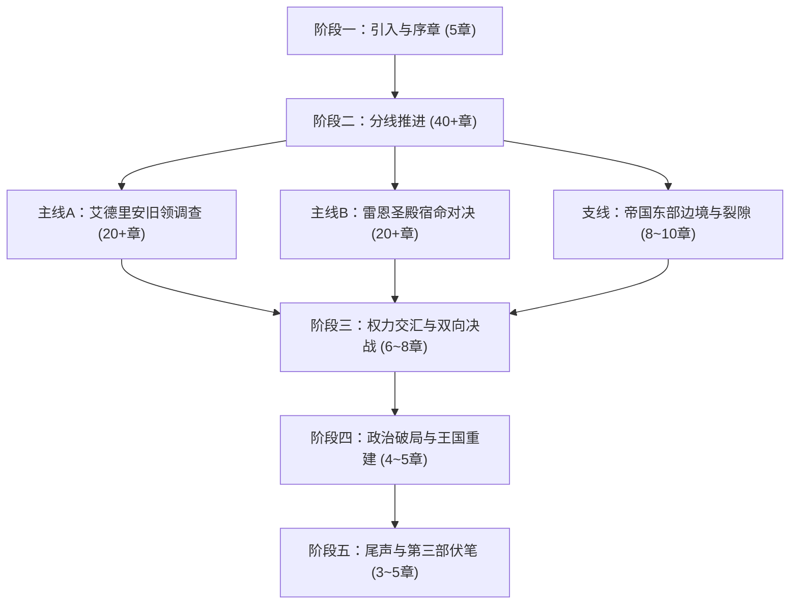

# 第二部：章节规划与扩写方案

> **定位**：第二部篇章总览、时序推进、阶段划分与具体章节规划方案。与第一部章节精修任务完全独立管理。
> **来源说明**：整合原《_第二部章节增加方案.md》与第二部主线构想，确立第二部完整的章节扩展骨架。

---

## 一、第二部总体篇幅架构与章节分布

第二部采用多线交织的中长篇架构（全长预估 60 ~ 75 章），整体划分为五个演进阶段：

---

## 二、第一批次：引入期与帝国侧已立项章节（共8章）

### 1. 与第二部主线的对应关系表

| 临时ID | 章节名称 | 叙事主线 | 核心任务与情境 |
| :---: | :--- | :--- | :--- |
| **引-1** | 残区的反扑——东侧的沼地 | 森林后方防线 | 联军战后首次协同清剿影牙兽残余，将残区腐化导回心木根脉。 |
| **引-2** | 种下那颗种子——新心木 | 森林再生仪式 | 五族代表与黎恩共同种下心木树种子，嫩芽在圣光与鬼之力交织中诞生。 |
| **引-3** | 地下的光——清剿十七条之一 | 地底通路打通 | 凯尔、玲与罗恩深入石殿地下，净化残余腐化，推开贯通地面的天光石门。 |
| **引-4** | 门那边的会面——第一份文书 | 裂隙正式建交 | 黎恩独行穿过裂隙与马奇亚斯会面，交接帝国临时政府公文与土产，确立通行规则。 |
| **引-5** | 城堡的真相——雾帷那边的故乡 | 故土远征启程 | 艾德里安与雷恩分别宣布调查决定，两队配置确立，营地同伴为其践行送行。 |
| **帝-1** | 边境的消息——故乡的异变 | 帝国侧异象 | 马奇亚斯发来帝国东部暗紫雾气报告，黎恩对照瓦利玛记忆确认同源，菲娜注入圣光石。 |
| **帝-2** | 裂隙的呼吸——听不懂的节律 | 空间频率监测 | 艾玛以魔女符文记录裂隙有节律的金光脉动，菲娜触碰微滞，异界频率初露端倪。 |
| **帝-3** | 深处的点位——瓦利玛的坐标 | 骑神沉睡感应 | 黎恩深入废墟排查三处裂隙点位，瓦利玛短暂感应并提供指向帝国方向的实测坐标。 |

---

## 三、各章节立项元数据模板与任务标准

### 【引入期】

#### ID: 引-1
- **名称**：残区的反扑——东侧的沼地
- **阶段**：引入期（第二部起点）
- **主要人物**：雷恩, 菲, 菲娜, 黎恩
- **核心**：腐化退去不等于腐化消失，残区在无人处反扑，联军用一场小规模清剿完成战后第一次协同，确立残区一处一处收的秩序。
- **章节任务**：东部巡逻线遭残区影牙兽残余袭击，雷恩与菲接敌，菲娜与黎恩率联军围剿，把残区腐化导回心木树根脉，沼地在黎明前彻底熄灭。
- **终止条件**：沼地最后一缕暗紫烟气消散在晨曦中，心木树微光蔓延过泥泞浅滩，四人收剑回鞘走向营地炊烟。

#### ID: 引-2
- **名称**：种下那颗种子——新心木
- **阶段**：引入期
- **主要人物**：菲娜, 黎恩, 艾玛, 五族代表
- **核心**：两百年的种子在战后落地，五族共同种下新心木树，嫩芽是森林延续的实体证明。
- **章节任务**：菲娜与黎恩把心木树种子种进心木树旁的土壤，矮人修起石围栏，狼人献来月光百合花瓣，鳞母从沼泽带来一捧水浇在土上，艾玛替牛头人转来石殿的一小袋土并刻下魔女符文温床，种子在圣光与鬼之力交织的手掌间钻出第一片嫩芽。
- **终止条件**：嫩绿色双叶在晨风中微微舒展，艾玛松开抚在土层上的法杖，五族长老的低声祝祷随风散入森林。

#### ID: 引-3
- **名称**：地下的光——清剿十七条之一
- **阶段**：引入期
- **主要人物**：凯尔, 玲, 罗恩, 劳拉, 菲娜
- **核心**：地下通道的清剿把十四年走不通的路打通一段，地底通路自此贯通，为地下往来打下基础。
- **章节任务**：凯尔与玲带着罗恩、劳拉深入石殿地下，牛头人为众人指了通往通道口的路，联军清剿影牙兽残余，菲娜在兽穴中心净化残留腐化，通道尽头的石门第一次被推开，透出地面的天光。
- **终止条件**：尘封的厚重石门轰然敞开半掌宽的缝隙，一线刺目天光劈开十四年的幽暗，尘埃在光柱中缓缓沉降。

#### ID: 引-4
- **名称**：门那边的会面——第一份文书
- **阶段**：引入期
- **主要人物**：黎恩, 马奇亚斯
- **核心**：裂隙两侧第一次面对面交接，帝国与森林的往来从信号变成人手相握。
- **章节任务**：门开启后的第一个清晨，黎恩独自穿过裂隙沿帝国旧路标走到边境监测站，马奇亚斯已等了一夜，两人交接帝国临时政府的正式回应文书并商定通行规则，黎恩带着文书和一包帝国土产走回裂隙。
- **终止条件**：马奇亚斯抬手推了推眼镜目送黎恩步入幽蓝裂隙，文书封漆上的红狮子印章在晨光下泛出暗红。

#### ID: 引-5
- **名称**：城堡的真相——雾帷那边的故乡
- **阶段**：引入期
- **主要人物**：艾德里安, 雷恩, 菲娜, 黎恩, 劳拉, 菲
- **核心**：艾斯特雷亚城堡沦陷的真相被说出，人类王国一侧的腐化痕迹与 Eldoria 同源，艾德里安与雷恩决定启程调查。
- **章节任务**：艾德里安说出家族城堡被腐化兽潮攻陷的真相，雷恩以被流放骑士的身份请缨重返王国调查圣殿与腐化的关联，众人为远行准备圣光符文石与补给。
- **终止条件**：马车在营地边缘套好缰绳，艾德里安扣紧皮护腕望向散尽雾帷的平原大道，两队人马在晨雾中互致注目礼。

---

### 【帝国侧】

#### ID: 帝-1
- **名称**：边境的消息——故乡的异变
- **阶段**：帝国侧
- **主要人物**：黎恩, 菲娜, 马奇亚斯
- **核心**：帝国东部边境出现暗紫雾气与野兽异变，与 Eldoria 的腐化同源，故乡的异变让裂隙那边的归途从愿望变成责任。
- **章节任务**：马奇亚斯经导力通讯发来帝国东部边境的紧急报告，黎恩对照瓦利玛记忆碎片的记载确认异变与 Eldoria 腐化同源，众人决定为裂隙那边准备净化手段，菲娜连夜为第一批圣光符文石注入圣光。
- **终止条件**：最后一块符文石收进革囊，导力通信器的荧绿指示灯缓缓熄灭，夜风穿过裂隙带起金属冷却的微鸣。

#### ID: 帝-2
- **名称**：裂隙的呼吸——听不懂的节律
- **阶段**：帝国侧
- **主要人物**：艾玛, 菲娜
- **核心**：裂隙在失去求救驱动后显露出新的节律，没人听得懂它在说什么，这段记录成为森林边缘持续观察的开端。
- **章节任务**：傍晚一处裂隙泛起有节律的金光脉动，艾玛以魔女符文记录下规律却无法解读的频率，菲娜把手放在裂隙表面时脉动停了一拍然后继续，节律被记入笔记等待破解。
- **终止条件**：羊皮纸上的波形图画下最后一笔，裂隙表面金色细芒如退潮般缩回虚空，石台上只余一圈发烫的符文烙印。

#### ID: 帝-3
- **名称**：深处的点位——瓦利玛的坐标
- **阶段**：帝国侧
- **主要人物**：黎恩, 瓦利玛
- **核心**：森林深处的远古裂隙点位被逐一确认，瓦利玛的感应为回家的方向提供第一份实测坐标。
- **章节任务**：黎恩独自深入森林深处排查瓦利玛感应到的时空裂隙点位，瓦利玛在废墟间苏醒引导他走过三处点位，鬼之力与指向帝国方向的裂隙产生共鸣，黎恩记录坐标后独自返回营地。
- **终止条件**：胸口内太刀刀柄的共鸣平息，黎恩将绘制好的三维坐标图卷入皮筒，踏碎枯枝走出幽深废墟。

---

## 四、第二批次：中篇分线推进扩写展望（大纲储备）

1. **艾德里安主线扩写（20+章预备）**：
   - `旧领-1`：重踏焦土——艾斯特雷亚废墟的荆棘；
   - `旧领-2`：地窖暗格——母亲遗留的镀银首饰盒与半截断剑；
   - `旧领-3`：黑野猪的耳目——法尔肯驿镇的第一批线人；
   - `旧领-4`：白鹿之宴——假托行商身份接触王都粮商；
   - `旧领-5`：暗室的烛火——朱利安王子的密使；
   - `旧领-6 ~ 20`：逐步深入王都档案室、潜入下水道、酒庄秘密接头、暗影地窟实证提取、克莱门特三世的暗影实验证据链闭环。

2. **雷恩主线扩写（20+章预备）**：
   - `圣殿-1`：关隘盘查——旧骑士徽印的锈蚀；
   - `圣殿-2`：月下的极剑——劳拉剑锋所指的誓言；
   - `圣殿-3`：通缉令的笔迹——阿达尔伯特大团长的手谕；
   - `圣殿-4`：圣水修道院的钟声——老修女送出的十四年前花名册；
   - `圣殿-5`：重返大要塞——被流放者走入大校场；
   - `圣殿-6 ~ 20`：面对昔日部下旧情与军纪冲突、晨曦礼拜堂的心灵对质、柜中自白书的曝光、破晓晨光之誓。
