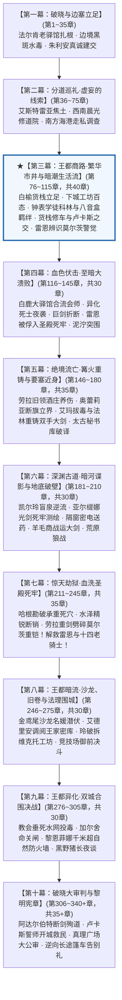
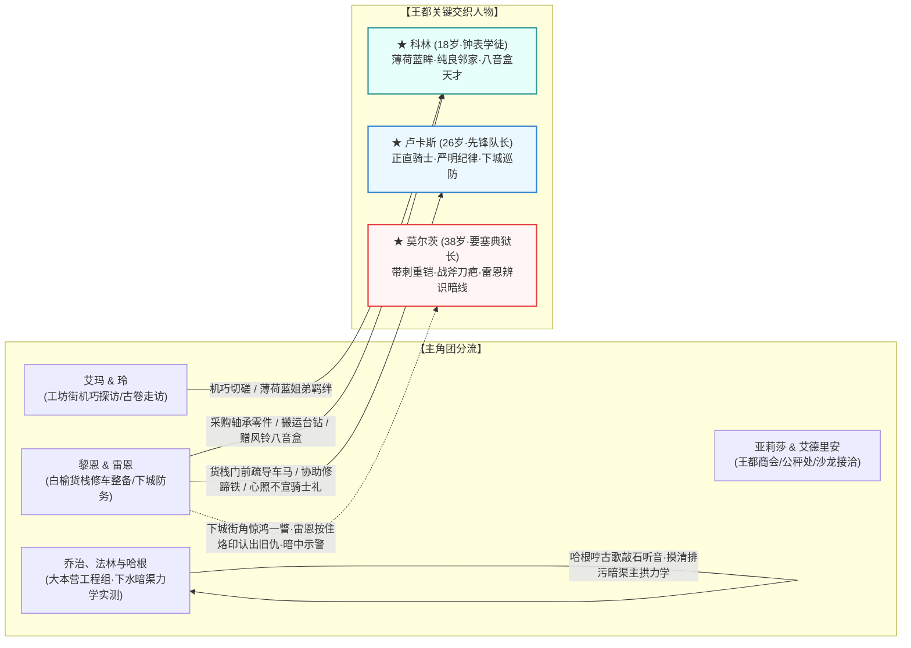

# 第二部宏篇十幕扩充与全新第三幕王都繁华市井详规方案

> **归档位置**：`方案/第二部/主线与世界扩充方案/06_宏篇十幕扩充与全新第三幕王都繁华市井详规方案.md`  
> **关联母案**：
> - [00_第二部主线与世界扩充方案总纲.md](file:///home/nanhu2/comfyui/世界书/方案/第二部/主线与世界扩充方案/00_第二部主线与世界扩充方案总纲.md)
> - [01_宏篇主线演进与阶段规划方案.md](file:///home/nanhu2/comfyui/世界书/方案/第二部/主线与世界扩充方案/01_宏篇主线演进与阶段规划方案.md)
> - [02_维里迪亚风土人情与宏大世界构建方案.md](file:///home/nanhu2/comfyui/世界书/方案/第二部/主线与世界扩充方案/02_维里迪亚风土人情与宏大世界构建方案.md)
> - [03_多日常与生活呼吸感设计方案.md](file:///home/nanhu2/comfyui/世界书/方案/第二部/主线与世界扩充方案/03_多日常与生活呼吸感设计方案.md)
> - 参考实体档案：[`docs2/npc/科林.TXT`](file:///home/nanhu2/comfyui/世界书/docs2/npc/科林.TXT) · [`docs2/npc/卢卡斯.TXT`](file:///home/nanhu2/comfyui/世界书/docs2/npc/卢卡斯.TXT) · [`docs2/npc/哈根.TXT`](file:///home/nanhu2/comfyui/世界书/docs2/npc/哈根.TXT) · [`docs2/npc/莫尔茨.TXT`](file:///home/nanhu2/comfyui/世界书/docs2/npc/莫尔茨.TXT) · [`docs2/location/圣泉大浴堂.TXT`](file:///home/nanhu2/comfyui/世界书/docs2/location/圣泉大浴堂.TXT) · [`docs2/location/十字竞技场.TXT`](file:///home/nanhu2/comfyui/世界书/docs2/location/十字竞技场.TXT) · [`docs2/location/白鹿驿馆.TXT`](file:///home/nanhu2/comfyui/世界书/docs2/location/白鹿驿馆.TXT)
> 
> **定位**：第二部宏篇主线宏观升级核心方案。将第二部主线正式确立为**“宏篇十幕·三十阶段·310~340章体系”**。在第二幕边境分道巡礼之后、第四幕白鹿大驿馆大溃败之前，确立**【第三幕：王都商路·繁华市井与暗潮生活流】（第 76 ~ 115 章，共 40 章）**。本幕基调轻快温润、聚焦王都封建社会风貌的纵深展开与纯正生活流呼吸感，全景呈现王都三层立体格局与工坊百态，建立主角团与**科林**（纯良钟表学徒）、**卢卡斯**（先锋白鹰骑士队长）的深厚羁绊，引入雷恩对要塞典狱长**莫尔茨**的旧仇警觉，并由大本营随行建筑大师**哈根**（第一部老角色·矮人二哥）先行勘测王都地下暗渠力学结构。

---

## 一、 宏观十幕演进全景架构

---

## 二、 全新第三幕核心定位、基调与叙事动因

### 1. 戏剧功能与基调：JRPG 经典“王都繁华初临”的生活流大舒展
* **告别紧绷，舒缓呼吸**：在第一幕的边境生存挣扎、第二幕的三路奔波调查之后，主角团在抵达王都外围时，获得了一个难能可贵、充满生活气息的平静期；
* **扩展异国封建世界的丰富度**：维里迪亚并非只有战火与阴谋，它是拥有两百年历史沉淀的庞大封建王国。王都的三层立体格局在此全景展现：
  - **上城区**：高耸于黑玄武岩悬崖之上的【圣殿要塞】与王宫领主别邸，森严冰冷；
  - **中城区**：中央集市喷泉、公秤处、行会大厅、圣泉大浴堂与十字竞技场，商贾云集、贵族车马川流不息；
  - **下城区**：石板窄巷、低矮木筋屋、工坊街、运河旧货栈与暗渠流水，市井小民的生活烟火、烘焙麦香、铁匠锻打与机械齿轮声交织成生动的生活交响曲；
* **主线动因契机（官僚审查窗口）**：
  第二幕查获的走私原液与掠夺残根铁证重大，但维里迪亚是典型的古代封建制度，外来商队申请长期贸易文牒、清算货款火耗、以及朱利安王子在宫廷暗中周旋需要相当长的官僚周期（约 5 ~ 6 周，35~40 天）。在此窗口期内，商队在下城区建立“白榆货栈”，同伴们分头行动、体验生活，为日后的宏大篇章扎下深厚的市井根基。

---

## 三、 核心人物交互与羁绊网

在第三幕中，主角团在王都下城区、工坊街与商栈，与王都本土各阶层角色展开深度交织：

### 1. 深度结识：科林（`NPC_D2_25`，王都钟表工坊“白鸽与游丝”学徒，18岁）
* **初见契机（机巧之声的吸引）**：
  玲在工坊街闲逛时，敏锐的耳朵捕捉到极其微小清脆的金属擒纵音律。推开门面狭窄却一尘不染的“白鸽与游丝”钟表铺，年仅 18 岁、系着浅灰围裙的邻家少年科林正用鹿皮细致擦拭游丝；
* **双重羁绊交织**：
  - **玲的“学术较量与欣赏”**：玲起初以导力天才自居，却惊异于科林在完全没有导力回路、没有测量仪器的纯机械封建条件下，单凭耳朵听音就能调校出千分之一厘的游丝摆角。两人围绕发条摆轮展开了热烈切磋，玲第一次对维里迪亚本土少年露出了发自内心的佩服；
  - **艾玛的“薄荷蓝姐弟温情”**：艾玛随步踏入工坊，当科林抬起头的一瞬间，艾玛震惊地发现少年竟拥有一双和自己一模一样澄澈纯净的**薄荷蓝眼眸**！科林见到这位气质温婉知性的大姐姐，耳尖腾地通红，慌忙用围裙擦手。艾玛心生怜爱，温柔倾听科林制作微型发条八音盒赠送给下城受惊孩童的心愿，两人建立了如同亲姐弟般的纯良依恋；
  - **黎恩的工匠之交与离别赠礼**：黎恩为商队货栈四轮大车采购防潮拉簧与精密轴承时数次光顾工坊，帮瘦削的科林搬运过沉重的旧铸铁台钻。科林在商队启程赶赴白鹿大驿馆前夕，特意将一只精巧的纯铜风铃八音盒赠给黎恩一行作为平安护身符。

### 2. 街头初遇：卢卡斯（`NPC_D2_16`，先锋骑兵队长，26岁）
* **街头巡防与平民立场的共鸣**：
  卢卡斯率领白鹰巡逻队在下城区排查私货与商道秩序。在白榆货栈门前的狭窄运河道口，运粮大车车轴脱榫引发堵塞，卢卡斯严厉制止下属对平民拔刀，亲自下马指挥疏导；
* **与黎恩的工匠之交**：
  黎恩当时正在货栈前院修整四轮重篷车，见状手持撬棍与生铁锤上前，仅凭利落干脆的撬压与垫铁技巧，数息之内便帮民车归正了车轴，并替卢卡斯副官的战马更换了开裂的蹄铁。黎恩沉稳纯熟的身手与平静深邃的眼神让卢卡斯印象极深，两人在街头互致工匠与正直骑士的礼节。

### 3. 雷恩的旧仇警觉：远眺要塞典狱长莫尔茨（`NPC_D2_19`）
* **下城暗巷的惊鸿一瞥**：
  雷恩与劳拉在下城巡查街巷退路时，在邻近要塞悬崖下的一处酒肆街角，雷恩远远看到一个身披带刺生铁碎颅重铠、左颊横贯一道战斧撕裂疤痕、眼神阴鸷凶戾的魁梧军将正大步走入卫所；
* **十四年前烙印的剧痛共鸣**：
  雷恩下意识按住左手腕上十四年前被烧红铁烙烙下的放逐印记，指节发白——此人正是当年亲手给他烙上流放印记、并将戈德弗里等十四位老骑士打入底层死牢的圣殿要塞典狱长**莫尔茨**；
* **暗中示警与大局戒备**：
  雷恩克制住了心中的波澜，没有盲目拔剑，而是迅速回货栈向黎恩与全员通报：圣殿要塞水牢守将莫尔茨极度残暴嗜虐，是阿达尔伯特手下最凶狠的鹰犬，要塞死牢守备森严如铁桶，提醒全员在王都期间严加隐蔽，绝不可惊动此人。

### 4. 大本营工程总指挥：哈根（`NPC_D2_07`，矮人三兄弟之二哥·建筑大师）
* **第一部老战友随行坐镇与暗渠实测**：
  作为第一部大本营的核心元老、约 280 岁的矮人建筑大师哈根，通晓大陆古老非导力工程力学。在王都货栈立足期间，哈根带着乔治与弟弟法林深入下城区勘察民间石木建筑与地下暗渠结构。哈根一边大口灌着粗麦黑啤哼着矮人小调，一边以重锤轻敲石壁听音，凭借绝顶造诣摸清了维里迪亚两百年排污暗渠与要塞玄武岩主拱的承重力学，为后续第七幕大劫狱哈根精准“工程点穴”奠定了严密的铺垫。

---

## 四、 第三幕逐阶段详尽剧情演进（第 76 ~ 115 章，共 40 章）

### 【阶段八·王都初至与白榆货栈】（第 76 ~ 85 章，共 10 章）
* **第 76 章：宏伟石门与王都下城晨雾**（商队双马重篷车抵达王都南外门，公秤处火耗称重，租下下城临河“白榆货栈”）；
* **第 77 章：曲折石板窄巷的炊烟**（全员分工整备货栈；黎恩与法林加固仓房大门生铁插销，菲娜与爱丽榭清理起居阁楼）；
* **第 78 章：河畔白榆货栈的清点**（亚莉莎梳理莱恩福尔特复式账册，艾德里安向北方行会递交第一批货物报关单）；
* **第 79 章：下城集市与古老紫铜便士**（菲与劳拉在集市采购黑麦粉与干燥蔬菜，体验封建货币称重火耗折算）；
* **第 80 章：白榆货栈门前的车马堵塞**（运河码头货车断轴堵路，黎恩手持垫铁迅速排险，卢卡斯巡防初次识荆）；
* **第 81 章：河畔旧作坊与工匠组采矿**（乔治与法林在下城铁匠铺探访，收集王都煤炭与矿石样本）；
* **第 82 章：王都下水道的古老石拱**（哈根带领法林沿运河排污涵洞踩点，矮人二哥敲石听音勘测主拱承重力学）；
* **第 83 章：市集公秤处的行会暗流**（艾德里安办理商队报关，遭遇教会代理税官无理刁难，确立商战突破口）；
* **第 84 章：下城酒肆街角的阴鸷视线**（雷恩远眺带刺重铠与战斧疤痕，按住手腕放逐烙印，认出要塞狱将莫尔茨）；
* **第 85 章：白榆货栈烛火下的示警**（雷恩向全员讲述莫尔茨的残暴历史与底层黑铁水牢格局，黎恩调整戒备等级）。

### 【阶段九·工坊街百工与八音盒之音】（第 86 ~ 95 章，共 10 章）
* **第 86 章：工坊街深处的游丝之音**（玲与艾玛漫步工坊街，偶遇“白鸽与游丝”钟表铺，初见纯良邻家少年科林）；
* **第 87 章：非导力发条与机巧切磋**（玲与科林的技术较量，惊叹于纯机械游丝校准的天赋；科林腼腆展现微型八音盒）；
* **第 88 章：两双纯净的薄荷蓝眼眸**（艾玛与科林的长谈，发现相同的瞳色；科林弹奏《晨曦森林》，姐弟般温润羁绊确立）；
* **第 89 章：白榆货栈的工匠采购**（黎恩前往工坊街为货栈重篷车采购拉簧，帮科林扛运老铸铁台钻）；
* **第 90 章：下城窄巷的齿轮与麦茶**（科林送修机芯路过货栈，黎恩赠其防锈油，菲娜投喂甘甜麦茶，少年红透耳尖）；
* **第 91 章：哈根的矮人听石勘测**（矮人二哥哈根一边哼着古歌一边敲击下水道石壁听音，指点乔治王都暗渠主拱力学）；
* **第 92 章：先锋骑兵队的换更铁蹄**（卢卡斯率白鹰巡骑在下城清场，严令部下不得扰民，维护市井秩序）；
* **第 93 章：白鹰巡骑与修蹄铁之谊**（卢卡斯战马蹄铁裂开，黎恩在货栈前热锻修整，两人结下心照不宣工匠礼）；
* **第 94 章：工坊街夜市的旧书摊**（艾玛与科林在夜市地摊搜寻古老发条图纸，交流机械与古代符文共鸣）；
* **第 95 章：货栈阁楼的壁炉晚话**（全员围坐货栈壁炉前品尝热麦糊，探讨王都各势力明暗动态，生活流温润安详）。

### 【阶段十·王都繁华沙龙与市井暗涌】（第 96 ~ 105 章，共 10 章）
* **第 96 章：金鸢尾沙龙的名媛请柬**（玛格丽特夫人引荐亚莉莎结识王都名媛，复式记账法展露锋芒，结识中立贵族）；
* **第 97 章：圣泉大浴堂的晨曦蒸气**（爱丽榭与劳拉体验罗曼式公共大浴池，洗去旅途风尘，展现少女与女剑士生活流）；
* **第 98 章：下城运河的旧木船巡航**（菲与亚尔缇娜乘平底小船沿运河测绘水文盲区，记录暗渠出水口）；
* **第 99 章：工坊街的突发纠纷**（教会恶吏欺压钟表铺老店主，科林护在老人身前，黎恩暗中掷小石击偏皮鞭解围）；
* **第 100 章：草料棚旁的少年心迹**（科林向黎恩倾诉不愿让发条机械用于杀戮的初心，黎恩温和点拨剑与工匠之誓）；
* **第 101 章：十字竞技场的骑士演武**（雷恩与朱利安密探竞技场，目睹先锋骑士团大操演，评估禁卫军战力）；
* **第 102 章：科林与下城受灾孤儿**（科林在避难所外将八音盒送给失语女孩，清澈铃音治愈人心，黎恩菲娜驻足凝视）；
* **第 103 章：商栈文牒的最后核准**（公秤处税官终于在羊皮通关文牒上盖下紫蜡印戳，商队合法地位全面确立）；
* **第 104 章：平原大道的信鸽来书**（朱利安王子密使送达暗信：平原大道中段白鹿大驿馆大公会议定期召集！）；
* **第 105 章：商栈暗室的行装整备**（全员连夜检修马车悬挂、加固粮箱夹层，为大公会晤做全面准备）。

### 【阶段十一·纯铜八音盒、商栈托付与白鹿启程】（第 106 ~ 115 章，共 10 章）
* **第 106 章：白鸽与游丝的离别赠礼**（黎恩与艾玛前往工坊街向科林道别，科林赠予小巧纯铜风铃八音盒：“愿琴声保佑大家平安”）；
* **第 107 章：王都商栈暗线的全面托付**（亚莉莎与玛格丽特夫人完成账目交接，托付老掌柜维持白榆货栈日常运营）；
* **第 108 章：哈根绘制的暗渠总草图**（哈根将手绘的下水暗渠主拱受力图存入货栈暗格，留作日后战略后手）；
* **第 109 章：卢卡斯巡骑在长街尽头的注视**（商队四轮重篷车缓缓驶出下城，卢卡斯在石桥上勒马抚胸目送车队）；
* **第 110 章：王都北门的最后巡检**（守门骑士核对紫蜡通关文牒，沉重的生铁吊栅门轰然抬起，商队顺利出城）；
* **第 111 章：秋末平原大道的金色草浪**（双马篷车驶上开阔平原大道，秋风吹拂草浪，伙伴们心境开阔坚定）；
* **第 112 章：雷恩长剑上的秋霜**（雷恩在车辕旁凝望远方群山，与劳拉交流剑道真谛，战友情谊日臻深厚）；
* **第 113 章：白鹿大驿馆的雄伟轮廓**（平原大道中段著名的石造贵族大驿馆映入眼帘，二层豪华壁炉与雕花回廊显露）；
* **第 114 章：大公会盟会师与全员欢聚**（各路反教廷领主与朱利安近卫军代表齐聚，劳拉抚摸大剑，全员在大厅围炉聚餐）；
* **第 115 章：暴风雨前夕的最后祝酒**（壁炉柴火噼啪爆裂，众人举杯庆祝王都立足大圆满；夜雨中死士黑影在树林集结，第三幕圆满收官！）。

---

## 五、 全新十幕结构下的主线演进对照

| 幕次 | 核心阶段与定位 | 主要事件与风土生活流 | 核心人物交织 |
| :--- | :--- | :--- | :--- |
| **第一幕**（1~35章） | 破晓与边塞立足 | 法尔肯老驿馆扎根、黑斑水毒调和、朱利安建交 | 汉斯、老店主奥托、提米 |
| **第二幕**（36~75章） | 分道巡礼·虚妄的线索 | 艾斯特雷亚焦土探秘、西南修道院、南方海港走私调查 | 玛格丽特、罗恩、狼人月语者 |
| **★ 第三幕**（76~115章） | **王都商路·繁华市井与暗潮生活流** | **白榆货栈立足、工坊街发条八音盒、沙龙名媛、竞技场、暗渠勘测** | **科林（纯良少年）、卢卡斯（正直骑士）、哈根（矮人二哥勘测暗渠）、莫尔茨（雷恩辨识暗线）** |
| **第四幕**（116~145章） | 血色伏击·至暗大溃败 | 白鹿大驿馆大公会盟伏击、巨剑折断、雷恩被俘入圣殿死牢、泥泞突围至旧领酒庄 | 雷恩被莫尔茨押解、朱利安断后负伤 |
| **第五幕**（146~180章） | 绝境流亡·篝火重铸 | 劳拉酒庄休养、奥蕾莉亚立界威慑、法林重铸破邪双手大剑、太古秘书库破译 | 奥蕾莉亚、法林、艾德里安领主觉醒 |
| **第六幕**（181~210章） | 深渊古道·暗河谍影 | 凯尔玲盲泉逆流探秘太古矮人石闸、亚尔缇娜光剑测绘死牢、羊毛商战运大剑 | 亚尔缇娜、凯尔、玲、罗恩 |
| **第七幕**（211~245章） | 惊天劫狱·血洗圣殿死牢 | 哈根勘破承重死穴、加尔潜渡断销、劳拉重剑劈碎莫尔茨！解救雷恩与十四老骑士！ | 哈根工程点穴、劳拉决战莫尔茨、爱丽榭喂汤救护 |
| **第八幕**（246~275章） | 王都暗流·沙龙、旧卷与法理围城 | 金鸢尾沙龙名媛潜伏、艾德里安调阅王家密库、玲破拆维克托工坊、竞技场御前决斗 | 科林工坊留白垩暗记、维克托、克莱门特 |
| **第九幕**（276~305章） | 王都异化·双城合围决战 | 教会垂死水网投毒、加尔舍命关闸、黎恩菲娜千米超自然防火墙、黑野猪长夜谈 | 科林八音盒抚慰受灾孩童、加尔舍命关闸 |
| **第十幕**（306~340+章） | 破晓大审判与黎明宪章 | 阿达尔伯特断剑殉道、卢卡斯誓师开城救民、真理广场大公审、逆向长途篷车告别礼 | 卢卡斯开城平暴、科林窗明几净八音盒新铺 |

---

## 六、 结论

1. **纯正 JRPG 经典节奏确立**：主线形成了“边境立足 ➔ 巡礼 ➔ **王都初至·繁华市井大生活流** ➔ **中盘惊天大溃败** ➔ 绝境重铸 ➔ 奇袭破局”的史诗级黄金律动；
2. **世界观深度丰富**：第三幕完整呈现王都工坊百态与市民生活，科林的八音盒清音贯穿始终，成为照亮全书末尾人性微光的绝美伏线；
3. **主线逻辑坚如磐石**：黎恩在白榆货栈修车整备与卢卡斯交好合情合理；雷恩凭借手腕烙印警觉莫尔茨，为第四幕与第七幕埋下深厚伏笔；哈根作为大本营随行建筑大师勘测地下暗道，前后呼应浑然天成。
