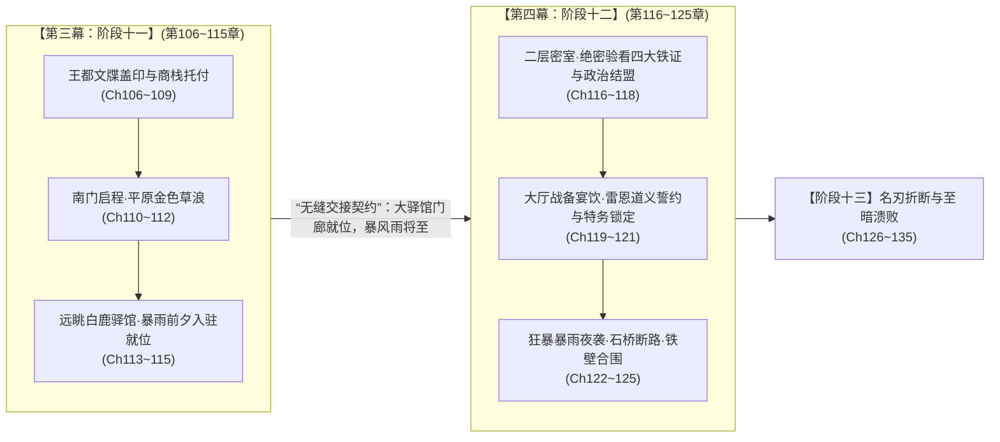

# 临时方案 02：第三幕与第四幕幕间接口契约与重叠消解方案

> **归档状态**：已执行完成（已移动至 [`方案/第二部/已执行/`](.)）  
> **关联母案**：
> - [`00_第三幕大纲与接口.md`](../主线与世界扩充方案/分阶段详规/03_第三幕_王都商路·繁华市井与暗潮生活流/00_第三幕大纲与接口.md)
> - [`阶段十一_纯铜八音盒商栈托付与白鹿启程详规.md`](../主线与世界扩充方案/分阶段详规/03_第三幕_王都商路·繁华市井与暗潮生活流/阶段十一_纯铜八音盒商栈托付与白鹿启程详规.md)
> - [`00_第四幕大纲与接口.md`](../主线与世界扩充方案/分阶段详规/04_第四幕_血色伏击·至暗大溃败/00_第四幕大纲与接口.md)
> - [`01_宏篇主线剧情总大纲与分幕导航.md`](../主线与世界扩充方案/01_宏篇主线剧情总大纲与分幕导航.md)

---

## 一、 核心症结解构：为什么会出现 10 章严重重叠？

在宏篇主线从“九幕”扩充升级为“十幕”时，新插入了【第三幕：王都商路·繁华市井与暗潮生活流】（第 76 ~ 115 章，共 40 章）。在编制第三幕收官阶段（`阶段十一`，第 106 ~ 115 章）时，剧作动线延伸过度：
1. **第三幕结尾（第 113 ~ 115 章）抢跑核心剧情**：
   详规不仅写了商队离开王都，还一路写到了抵达白鹿大驿馆，并在第 114 章写完了“与朱利安王子、亨里克边境伯大公会盟并密室验看四大铁证、大厅盛大聚餐”，在第 115 章写完了“夜雨中达米安死士漫山与莫尔茨重骑合围”。
2. **第四幕开篇（阶段十二，第 116 ~ 125 章，整整 10 章）形成镜像重复**：
   在 [`00_第四幕大纲与接口.md`](../主线与世界扩充方案/分阶段详规/04_第四幕_血色伏击·至暗大溃败/00_第四幕大纲与接口.md) 中，阶段十二被规划为“合流会盟与白鹿大驿馆围城（共 10 章）”，任务依然是“三路人马齐聚白鹿驿馆验看铁证、阿达尔伯特与莫尔茨合围”。
3. **后果**：
   导致同一场“白鹿大驿馆会盟验看铁证与围城”，在第三幕末尾演练了一遍，在第四幕开头又要从头演练 10 章，严重破坏了剧作连贯性与时序节奏。

---

## 二、 接口契约重构与动线重新划界（彻底消解重叠）

遵循“**第三幕专注王都完满收官与从容启程，第四幕专注大公政治会盟与至暗围城**”的权责划分原则，重新锚定两幕的分界线：

---

## 三、 具体章节动线修订细则

### 1. 净化与调整：第三幕·阶段十一（第 106 ~ 115 章）
> 目标：将第 114 ~ 115 章收缩为“抵达大驿馆前奏与山雨欲来的暴风雨前奏”，不提前消耗第四幕的核心政治戏与围城战。

* [x] **第 106 章**：白鸽与游丝的离别赠礼——黎恩与艾玛前往工坊街向科林道别，科林赠予小巧纯铜风铃八音盒：“愿琴声保佑大家平安”。
* [x] **第 107 章**：王都商栈暗线的全面托付——亚莉莎与玛格丽特夫人完成账目交接，托付商栈老主管维持白榆货栈日常运营，留存王都隐秘退路。
* [x] **第 108 章**：哈根绘制的暗渠总草图——哈根将手绘的下水暗渠主拱受力图存入货栈地砖暗格，留作日后战略后手。
* [x] **第 109 章**：卢卡斯巡骑在长街尽头的注视——商队四轮重篷车缓缓驶出下城，卢卡斯在石桥上勒马抚胸目送车队，正直骑士之谊定格。
* [x] **第 110 章**：王都北门的最后巡检——守门骑士核对紫蜡通关文牒，沉重的生铁吊栅门轰然抬起，商队顺利出城。
* [x] **第 111 章**：秋末平原大道的金色草浪——双马篷车驶上开阔平原大道，秋风吹拂金色草浪，伙伴们心境开阔坚定。
* [x] **第 112 章**：雷恩长剑上的秋霜——雷恩在车辕旁凝望远方群山，与劳拉交流剑道真谛，战友情谊日臻深厚。
* [x] **第 113 章**：白鹿大驿馆的雄伟轮廓——地平线尽头出现依山而建的古老青石驿馆群（`LOC_D2_31`），外围领主车驾已陆续集结。
* [x] **第 114 章**：行驿入驻与各方就位——同情王室的年轻侍从引领商队驶入大驿馆后院马厩，主角团入驻二层包厢休整，亨里克边境伯近卫暗中示意。
* [x] **第 115 章（第三幕盛大收官）**：暴风雨前夕的山雨欲来——大厅壁炉熊熊燃烧，商队全员温热酒食蓄势待发，窗外天色阴沉如墨，暴风雨与大决战前夜的紧张感在空气中弥漫。第三幕在“王都生活流大圆满、全员蓄势待发”的史诗张力中盛大落幕！

---

### 2. 正式承接与展开：第四幕·阶段十二（第 116 ~ 125 章，共 10 章）
> 目标：完全拥有“大公绝密验看铁证、政治结盟博弈、大厅宴饮与夜雨铁骑合围”的完整 10 章大篇幅，绝无重复感。

* [x] **第 116 章**：密室之门——二层绝密套房，朱利安王子携近卫代表与商队全员相见，气氛庄重森严。
* [x] **第 117 章**：四大铁证的启封——铅盒开启，机兽工号齿轮、十四人抗命名册原本、心木碳化残根、洗钱账本一一呈现在大公眼前。
* [x] **第 118 章**：亨里克边境伯的决意——商道大领主验看账本与圣殿罪证，震撼之余拍案结盟，反教廷政治同盟正式落定。
* [x] **第 119 章**：大厅战备祝酒——移步大厅围炉而坐，全员吃着烤羊腿与热鹿肉派，庆祝第一阶段政治胜利，劳拉抚摸大剑。
* [x] **第 120 章**：年轻侍从的钥匙与雷恩的道义请求——侍从暗中送上后山马厩暗门钥匙；雷恩面对阿达尔伯特可能带来的年轻骑兵，恳求劳拉与黎恩“尽量不要伤及年轻人要害”。
* [x] **第 121 章**：达米安的特务网——暴雨倾盆，达米安通过教会地下密探网彻底锁定大驿馆，阿达尔伯特调动数千重骑。
* [x] **第 122 章**：暴雨夜袭的前奏——狂风骤起，战马在马厩凄厉嘶鸣，黎恩八叶心眼察觉极度冰冷的杀气。
* [x] **第 123 章**：异化死士林间集结——数百名缠绕黑血绷带的暗影忏悔者自密林现身，莫尔茨铁骑轰鸣封锁石桥。
* [x] **第 124 章**：围城铁壁合拢——生铁箭矢破窗而入，大驿馆彻底化为暴风雨中的孤岛。
* [x] **第 125 章（阶段十二决战收官）**：大溃败前夜的拔剑——劳拉横剑立于大厅门前，雷恩推开重盾，全员准备突围，第四幕至暗决战全面爆发！

---

## 四、 接口契约更新确认

* [x] **第三幕后置交付状态**：
  - 空间坐标：平原大道中段【白鹿大驿馆】（`LOC_D2_31`）门廊、后院马厩与二层包厢；
  - 核心状态：商队全员入驻就绪，四大铁证完好无损，暴风雨将至，尚未惊动外部敌人。
* [x] **第四幕前置输入状态**：
  - 顺接第三幕第 115 章终局，从密室绝密启封铁证切入，平稳展开第 116 章。

---

## 五、 全局母案落地执行与更新记录

* [x] **1. 规划总纲母案** [`01_宏篇主线剧情总大纲与分幕导航.md`](../主线与世界扩充方案/01_宏篇主线剧情总大纲与分幕导航.md)：
  - 修正第三幕核心定位，更新商队抵达白鹿大驿馆入驻就位描述；
  - 修正第四幕阶段十二核心演进概览，完全对齐密室验看四大铁证与深夜合围。
* [x] **2. 第三幕大纲母案** [`00_第三幕大纲与接口.md`](../主线与世界扩充方案/分阶段详规/03_第三幕_王都商路·繁华市井与暗潮生活流/00_第三幕大纲与接口.md)：
  - 更新【后置交付】说明，消除抢跑第四幕会盟与围城的描述；
  - 更新阶段十一演进概括，强调车辕长谈、大驿馆就位与暴风雨前夕山雨欲来大收官。
* [x] **3. 第三幕阶段十一详规** [`阶段十一_纯铜八音盒商栈托付与白鹿启程详规.md`](../主线与世界扩充方案/分阶段详规/03_第三幕_王都商路·繁华市井与暗潮生活流/阶段十一_纯铜八音盒商栈托付与白鹿启程详规.md)：
  - 重构定位与戏剧张力模型；
  - 重写【第 114 章：行驿入驻与各方就位】与【第 115 章：暴风雨前夕的山雨欲来】；
  - 更新本阶段【后置交付状态】，实现零重复顺滑交接。
* [x] **4. 第四幕大纲母案** [`00_第四幕大纲与接口.md`](../主线与世界扩充方案/分阶段详规/04_第四幕_血色伏击·至暗大溃败/00_第四幕大纲与接口.md)：
  - 更新【前置输入】状态，严丝合缝咬合第三幕收官；
  - 将【阶段十二】由 3 行概括完整扩充为十章逐章剧情动线细则（第 116 ~ 125 章）。
* [x] **5. 历史扩充方案** [`06_宏篇十幕扩充与全新第三幕王都繁华市井详规方案.md`](06_宏篇十幕扩充与全新第三幕王都繁华市井详规方案.md)：
  - 同步更新第 114 章与第 115 章摘要，保持全库历史方案一致性。
