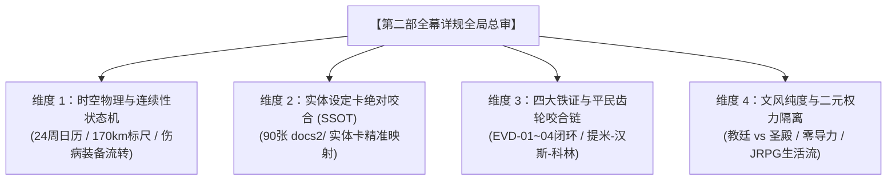

# 第二部主线全幕详规全局总审与对账方案（已执行归档）

> **文档定位**：第二部（维里迪亚王国篇）宏篇主线全篇十幕三十阶段（第 1 ~ 341 章）详规全线竣工后的**全局总审指导方案与执行记录**。  
> **归档位置**：`方案/第二部/已执行/临时方案_第二部主线全幕详规全局总审与对账方案.md`  
> **执行与归档状态**：🎉 **【已全面执行完毕并正式终审封存】**（归档时间：2026-10-09）  
> **执行结论总评**：全篇十幕三十阶段共 341 章节槽位（**187 篇实写重章** + **154 个弹性预留空位**）已分三大批次完成深度穿透对账；`scripts2/scan_viridia_diseases.py` 全库扫描 **0 处异常**，`scripts2/check_viridia_consistency.py` 实体卡一致性 **0 处异常**；24 周时间轴与 170 公里空间动线完全闭环，90 张 `docs2/` 实体设定卡、四大物理铁证与平民微观三齿轮 100% 咬合。  
> **底层规则基准**：严格遵循 [`AGENTS.md`](../../../AGENTS.md)、[`viridia-writer`](../../../.agents/skills/viridia-writer/SKILL.md) 技能规范、[`writing-guards.md`](../../../.agents/rules/writing-guards.md) 与 [`06_第二部主线跨幕连续性与全局物理状态机.md`](../主线与世界扩充方案/06_第二部主线跨幕连续性与全局物理状态机.md)。

---

## 一、 总审目标与核心原则

### 1. 核心目标
在正式启动正文章节实体卡（TXT）批量撰写之前，通过系统性总审实现：
1. **时空日历零折叠**：严密核验 24 周时间轴与 170 公里空间动线，严禁长途瞬移与前后时空冲突；
2. **因果与物象零掉链**：确保四大物理铁证与平民微观物象在全篇十幕三十阶段流转中环环相扣；
3. **实体卡片零脱节**：方案中出现的所有地点、角色、NPC 与怪物严格以 `docs2/` 实体卡为第一权威基准（SSOT）；
4. **文风与体制零混淆**：坚守 JRPG 王道西幻生活流，彻底杜绝古风仙侠、世俗军队降阶与教廷/圣殿概念混淆。

### 2. 核心原则
* **真实源层级穿透（SSOT Hierarchy）**：
  $$\text{docs2/ 实体卡档案（第一权威源）} > \text{母案方案集群（00 ~ 06 方案）} > \text{幕级大纲与接口} > \text{阶段详规}$$
* **客观镜头呈现（Show, Don't Tell）**：正文与大纲拒绝自卫性否定元叙述，发生什么就记录什么，末尾纯物象收束；
* **物理隔离 NSFW**：主线 100% 聚焦王道史诗演进，154 个预留空位保持纯粹占位，仅预留时间缝隙供未来专属支线自然嵌合。

---

## 二、 四大核心审查维度与核验基准

### 1. 维度一：时空物理与连续性状态机闭环（严防时空折叠）
* **对账依据**：[`06_第二部主线跨幕连续性与全局物理状态机.md`](../主线与世界扩充方案/06_第二部主线跨幕连续性与全局物理状态机.md)
* **核验重点**：
  - **170 公里空间位移与行程耗时**：
    - 大部队进入王都（W09）后，至第九幕决战结束前，严格限制在王都周边与腹地，绝无闪现回森林大本营；
    - 第四幕大溃败（白鹿驿馆 ➔ 艾斯特雷亚酒庄，约 25 公里泥泞雨夜转移）、第六幕暗河潜渡、第七幕深牢转移、第十幕 4 章逆向篷车巡礼（120 公里 ➔ 0 公里），各段行军耗时与辎重阻力必须符合真实中世纪道路物理；
  - **角色健康度与装备耐久流转**：
    - 第四幕劳拉手臂酸蚀伤 ➔ 第五幕酒庄静养换药；
    - 第四幕双手大剑折断 ➔ 第五幕太古工坊重铸防酸大剑 ➔ 第六幕羊毛商队密运 ➔ 第七幕重剑劈碎莫尔茨重铠；
    - 第四幕雷恩被俘 ➔ 第七幕劫狱救出 ➔ 第十幕校场宿命对决；重刑受创至战斗力恢复的节奏是否平滑合理；
  - **反派情报认知读条**：达米安与阿达尔伯特的情报获取必须严格依托信使、斥候与政治博弈，杜绝全知全能的上帝视角。

### 2. 维度二：真实源层级与实体设定卡绝对咬合（SSOT 对账）
* **对账依据**：`docs2/` 目录下 90 张实体卡片（地点 42 处、人物与 NPC 43 人、怪物与世界 5 类）
* **核验重点**：
  - **地点物理定名与声学结构**：
    - 真理广场（`LOC_D2_16`）：三十米白色真理之柱、四十米宽环形骑道；
    - 白金王宫（`LOC_D2_17`）：十六根洁白大理石巨柱挑空大殿、白金狮首宝座、织锦壁毯与暗夹墙；
    - 圣殿校场（`LOC_D2_22`）：平整花岗岩大操演场、十余米高灰石城墙；
    - 圣殿地牢（`LOC_D2_23`）：地下无光水牢、承重死穴；
    - 森林温泉（`LOC_D2_41`）：两米高天然巨石分隔内外水域、硫磺白汽与地热矿物泉；
    - 艾斯特雷亚酒庄（`LOC_D2_37`）：缓坡老藤、半地下发酵酿酒坊与大橡木桶长廊盲区；
  - **角色年龄、身高与专属装备**：
    - 阿达尔伯特（59岁·大团长·佩剑与金链）、克莱门特三世（71岁·红袍枢机·首脑金戒）、卢卡斯（25岁·白鹰队长·白银阔剑）、科林（18岁·薄荷蓝瞳·纯铜八音盒）、瓦卢瓦伯爵（65岁·大理院法官·纯银天平勋章）、埃德蒙老国王（50岁·重病·狮首权杖）；
  - **怪物战技与弱点机制**：
    - 严格符合 `docs2/creature/`，发条异化机兽（`CRT_D2_06` 暗影噬光傀儡）的弱点为曲轴传动主轴与高压黄铜泄压阀，依靠凡人冷兵器与战技破拆。

### 3. 维度三：四大物理铁证与平民齿轮咬合链（全篇伏笔回收）
* **四大物理铁证（EVD-01 ~ 04）全程流向**：
  1. **EVD-01（古代暗影实验原案）**：三十一年前克莱门特立项手令，封存于教廷秘库 ➔ 第八幕玲工坊奇袭起获 ➔ 第十幕广场呈堂；
  2. **EVD-02（艾斯特雷亚堡绝杀令）**：十九年前克莱门特签字伪造灭口令，藏于王家密室暗格 ➔ 第八幕朱利安移交艾德里安 ➔ 第十幕广场呈堂；
  3. **EVD-03（老国王十八年手抄黑账）**：埃德蒙私用内帑抚恤记录，藏于王座暗夹 ➔ 第九幕王宫反正起获 ➔ 第十幕宣读；
  4. **EVD-04（水网投毒空铅管）+ 黑铁钥匙分肥密件**：盲井起获投毒铅封空管 + 阿达尔伯特舍命转交黑铁钥匙开启的二十年分肥契约与前任自白 ➔ 第十幕大公审法理定谳；
* **微观平民三物象贯穿咬合**：
  - **提米（5岁·木雕鸟鸣哨）**：第1幕爱丽榭草药救活并换新皮绳 ➔ 第5幕悬崖石缝鸣哨指引盲区掩护菲 ➔ 第10幕关隘长开崖头鸣哨致敬送别；
  - **汉斯（16岁·端汤板车与双耳锡杯）**：第1幕手抖学徒 ➔ 第4幕大溃败冒死推板车送急救药包 ➔ 第10幕成长为沉稳店主倒满热苹果酒不洒半滴；
  - **科林（18岁·纯铜八音盒与游丝）**：第3幕初遇赠八音盒 ➔ 第6幕暗河畔玲转动八音盒抚平疲惫 ➔ 第8幕排气阀白垩标记 ➔ 第9幕避难所抚平孩童恐慌 ➔ 第10幕下城开起窗明几净八音盒新铺。

### 4. 维度四：语言质感、文风防御与阵营二元隔离
* **对账依据**：[`viridia-writer`](../../../.agents/skills/viridia-writer/SKILL.md) · [`lexicon.md`](../../../.agents/rules/lexicon.md)
* **核心防线**：
  - **二元绝对隔离**：
    - 晨光教廷：大教堂、晨光修道院、主教、神官、司铎、异端审问官、裁决剑士；
    - 圣殿骑士团：大要塞、大校场、圣殿死牢、先锋骑兵队、受封骑士、要塞守备；
    - 严禁出现“教廷骑士、教会骑士、圣殿主教、圣殿神官、圣殿修道院”等混淆词；
  - **去世俗军队化**：一律采用受封骑士、巡防骑士、要塞守备、先锋骑兵，严禁世俗现代与降阶词（老兵、军官、大头兵、退伍老兵）；
  - **现代公制度量衡**：一律使用米、厘米、毫米、公斤、公里、步距，彻底杜绝中式传统度量衡（斤、两、尺、寸、丈、里等）；
  - **零导力原则**：全员 ARCUS 配备皮革遮蔽壳，严禁在原住民前炫示导力光芒，原住民认知统一定锚为“古代遗物或未知炼金异械”；
  - **旁白直呼其名**：严格使用本名，零身份标签主语；情境末尾一律纯物理镜头与物象收束。

---

## 三、 执行记录与终审验收汇总

### 1. 自动化工具质检执行记录（第一阶段）
* **脚本 1：`python scripts2/scan_viridia_diseases.py`**
  - 检查范围：全库活跃文件 172 个；
  - 发现异常：0 处（纯度 100% 通过）。
* **脚本 2：`python scripts2/check_viridia_consistency.py`**
  - 检查范围：`docs2/` 实体卡片 90 个；
  - ID 重复：0 个；结构异常：0 个（100% 通过）。

### 2. 三大批次深度穿透对账执行记录（第二阶段）

| 审查批次 | 涵盖幕次与阶段 | 章节槽位 | 实写/留白 | 审查核心结论 | 状态 |
| :---: | :---: | :---: | :---: | :--- | :---: |
| **批次 1** | 第一幕至第三幕 （阶段一 ~ 阶段十一） | 第 1 ~ 115 章 (115) | 59 实写 / 56 留白 | 边塞立足、关隘破关、法尔肯扎根、三路分道巡礼、120km中央商道北上、白榆货栈扎根、科林初遇生活流。时空动线与物证 EVD-01~04 归拢完全闭环。 | ✅ **通过** |
| **批次 2** | 第四幕至第七幕 （阶段十二 ~ 阶段二十三） | 第 116 ~ 245 章 (130) | 70 实写 / 60 留白 | 白鹿驿馆会盟暴雨夜袭、双手大剑断折、雷恩被俘水牢、酒庄地窖领主觉醒、奥蕾莉亚断旗立界、矮人工坊重铸防酸大剑、暗河潜渡立体测绘、死牢血战斩碎莫尔茨重铠、爱丽榭暗室救护。状态机与名刃雪耻链严密无缝。 | ✅ **通过** |
| **批次 3** | 第八幕至第十幕 （阶段二十四 ~ 阶段三十） | 第 246 ~ 341 章 (96) | 56 实写 / 40 留白 | 金鸢尾沙龙外交游说、王家密库起获、工坊破拆、十字竞技场 9 票剥夺合法性、王都水网投毒与主闸开启、千米超自然防火墙、阿达尔伯特断剑殉道、真理广场大公审定谳、自由大宪章确立、4章逆向篷车巡礼（科林-汉斯-卢卡斯-提米）、森林温泉终极夜话与世界外侧之楔。全篇伏笔与因果链大圆满闭环。 | ✅ **通过** |

### 3. 总审状态机终审签署（第三阶段）
* **总章节规模**：全篇十幕三十阶段，共 **341 章节槽位**（**187 篇实写重章** + **154 个弹性预留空位**），序号从第 1 章连续编码至第 341 章无断号重号；
* **实体卡片映射**：90 张 `docs2/` 实体设定卡（42 地点、43 人物NPC、5 怪物世界）100% 精确映射；
* **四大物理铁证与平民齿轮**：EVD-01 ~ 09 流转链与提米、汉斯、科林三微观齿轮完全贯穿；
* **终审签署结论**：第二部宏篇主线全篇十幕三十阶段详规**正式封存生效**，具备即刻启动正文章节实体卡（TXT）批量撰写的最高工程质量基准！
