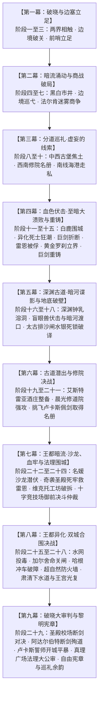

# 第二部：章节规划与扩写方案

> **定位**：第二部篇章总览、时序推进、阶段划分与具体章节规划方案。与第一部章节精修任务完全独立管理。
> **来源说明**：整合原《_第二部章节增加方案.md》与第二部主线构想，确立第二部完整的章节扩展骨架。
> 
> 🚨 **实施核心铁律（阶段锁死）**：
> **在第二部全篇所有章节骨架（九幕二十九阶段大纲、动线拆解、情境任务与时序闭环）完全搭建定稿之前，严禁开启任何 `docs2/story/*.TXT` 章节实体卡的实际撰写！**
> 当前全阶段工作重心 100% 聚焦于宏篇主线演进、各阶段逐章详规、战力拆解与风土日常交织脉络的完整搭建与打磨。

---

## 一、 第二部总体篇幅架构与阶段分布

第二部采用多线螺旋咬合的宏篇史诗架构，整体划分为九幕二十九阶段演进体系：

---

## 二、第一批次：第一幕·阶段一已立项章节（第 1 ~ 8 章）

> **专属详规**：完整动线与逐章时序情境推进详见 [阶段一_战后新生与两界相触详规.md](../../主线与世界扩充方案/分阶段详规/01_第一幕_破晓与边塞立足/阶段一_战后新生与两界相触详规.md)。

### 1. 章节目录与时序演进表

| 正式ID | 原临时ID | 章节名称 | 叙事路线 | 核心任务与时序演进 |
| :---: | :---: | :--- | :--- | :--- |
| **Ch01** | 引-1 | 残区的反扑——东侧的沼地 | 森林后方防线 | 联军战后首次协同清剿影牙兽残余，将残区腐化导回心木根脉。 |
| **Ch02** | 引-2 | 种下那颗种子——新心木 | 森林再生仪式 | 五族代表与黎恩共同种下心木树种子，嫩芽在圣光与鬼之力交织中诞生。 |
| **Ch03** | 引-3 | 地下的光——清剿十七条之一 | 地底通路打通 | 凯尔、玲与罗恩深入石殿地下，净化残余腐化，推开贯通地面的天光石门。 |
| **Ch04** | 引-4 | 门那边的会面——第一份文书 | 裂隙正式建交 | 黎恩独行穿过裂隙与马奇亚斯会面，交接帝国临时政府公文与土产，确立通行规则。 |
| **Ch05** | 帝-1 | 边境的消息——故乡的异变 | 帝国侧异象 | 马奇亚斯发来帝国东部暗紫雾气报告，黎恩对照太古文献确认异变与Eldoria腐化同源，菲娜注入圣光石。 |
| **Ch06** | 帝-2 | 裂隙的呼吸——听不懂的节律 | 空间频率监测 | 艾玛以魔女符文记录裂隙有节律的金光脉动，菲娜触碰微滞，异界频率初露端倪。 |
| **Ch07** | 帝-3 | 深处的点位——古代断层的坐标 | 太古遗迹排查 | 黎恩深入废墟凭借八叶心眼排查三处裂隙断层点位，绘制空间断层坐标图。 |
| **Ch08** | 引-5 | 城堡的真相——雾帷那边的故乡 | 故土远征启程 | 艾德里安与雷恩分别宣布调查决定，两队配置确立，营地同伴为其践行送行，无缝衔接第9章关隘。 |

---

## 三、各章节立项元数据模板与核心规范

### 【引入期】

#### ID: 引-1
- **名称**：残区的反扑——东侧的沼地
- **阶段**：引入期（第二部起点）
- **主要人物**：雷恩, 菲, 菲娜, 黎恩
- **核心**：腐化退去不等于腐化消失，残区在无人处反扑，联军用一场小规模清剿完成战后第一次协同，确立残区一处一处收的秩序。

#### ID: 引-2
- **名称**：种下那颗种子——新心木
- **阶段**：引入期
- **主要人物**：菲娜, 黎恩, 艾玛, 五族代表
- **核心**：两百年的种子在战后落地，五族共同种下新心木树，嫩芽是森林延续的实体证明。

#### ID: 引-3
- **名称**：地下的光——清剿十七条之一
- **阶段**：引入期
- **主要人物**：凯尔, 玲, 罗恩, 劳拉, 菲娜
- **核心**：地下通道的清剿把十四年走不通的路打通一段，地底通路自此贯通，为地下往来打下基础。

#### ID: 引-4
- **名称**：门那边的会面——第一份文书
- **阶段**：引入期
- **主要人物**：黎恩, 马奇亚斯
- **核心**：裂隙两侧第一次面对面交接，帝国与森林的往来从信号变成人手相握。

#### ID: 引-5
- **名称**：城堡的真相——雾帷那边的故乡
- **阶段**：引入期
- **主要人物**：艾德里安, 雷恩, 菲娜, 黎恩, 劳拉, 菲
- **核心**：艾斯特雷亚城堡沦陷的真相被说出，人类王国一侧的腐化痕迹与 Eldoria 同源，艾德里安与雷恩决定启程调查。

---

### 【帝国侧】

#### ID: 帝-1
- **名称**：边境的消息——故乡的异变
- **阶段**：帝国侧
- **主要人物**：黎恩, 菲娜, 马奇亚斯
- **核心**：帝国东部边境出现暗紫雾气与野兽异变，与 Eldoria 的腐化同源，故乡的异变让裂隙那边的归途从愿望变成责任。

#### ID: 帝-2
- **名称**：裂隙的呼吸——听不懂的节律
- **阶段**：帝国侧
- **主要人物**：艾玛, 菲娜
- **核心**：裂隙在失去求救驱动后显露出新的节律，没人听得懂它在说什么，这段记录成为森林边缘持续观察的开端。

#### ID: 帝-3
- **名称**：深处的点位——古代断层的坐标
- **阶段**：帝国侧
- **主要人物**：黎恩
- **核心**：森林深处的远古断层点位被逐一确认，黎恩以八叶心眼感知空间褶皱，为回家的方向提供第一份实测断层坐标。

---

## 四、第二批次：中篇分线推进扩写展望（大纲储备）

1. **艾德里安主线扩写（20+章预备）**：
   - `旧领-1`：重踏焦土——艾斯特雷亚废墟的荆棘；
   - `旧领-2`：地窖暗格——母亲遗留的镀银首饰盒与半截断剑；
   - `旧领-3`：老驿馆与商行的耳目——法尔肯驿镇的第一批线人；
   - `旧领-4`：白鹿之宴——假托行商身份接触王都粮商；
   - `旧领-5`：暗室的烛火——朱利安王子的密使；
   - `旧领-6 ~ 20`：逐步深入王都档案室、潜入下水道、酒庄秘密接头、暗影地窟实证提取、克莱门特三世的暗影实验证据链闭环。

2. **雷恩主线扩写（20+章预备）**：
   - `圣殿-1`：关隘盘查——旧骑士徽印的锈蚀；
   - `圣殿-2`：月下的极剑——劳拉剑锋所指的誓言；
   - `圣殿-3`：通缉令的笔迹——阿达尔伯特大团长的手谕；
   - `圣殿-4`：晨光修道院的钟声——药舍修女艾琳娜交付十四年前名册；
   - `圣殿-5`：重返大要塞——被流放者走入大校场；
   - `圣殿-6 ~ 20`：面对昔日部下旧情与军纪冲突、晨曦礼拜堂的心灵对质、柜中自白书的曝光、破晓晨光之誓。
