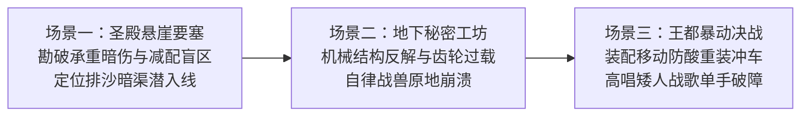
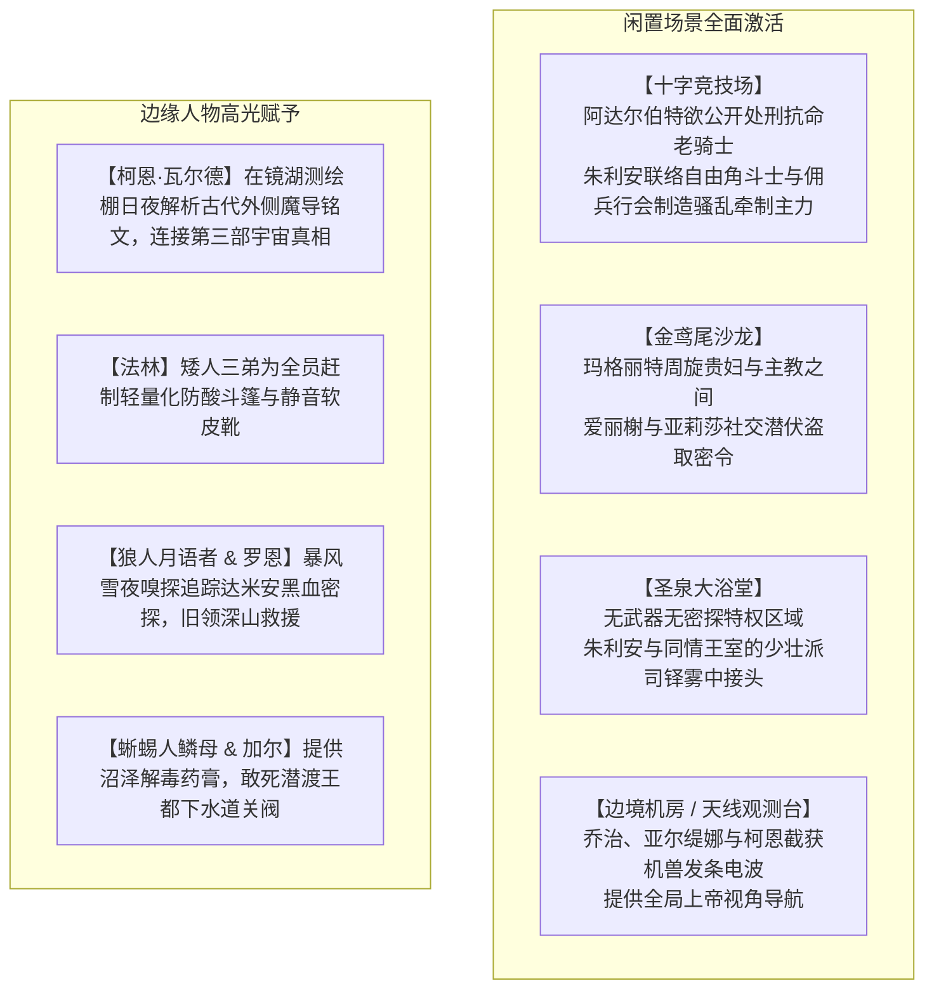

# 第二部主线深化与冲突重构方案（本地研讨草案）

> **文档性质**：**用完即抛（Scratch / Working Proposal）**本地研讨与设计推演方案。  
> **核心使命**：针对“王子去躺赢化与尊严建交、部族自给自足与真诚破冰、哈根古工程造诣、反派前期活跃与莫尔茨职能纯粹化、老国王表里双轨制、一波三折波澜体系与古老先灵克制回归、闲置场景与人物盘活”进行深度闭环推演。  
> **文风红线**：严格执行《viridia-writer》纯正日式 RPG 西幻与正向欧陆封建史风格，全文本杜绝中式武侠黑话、江湖气、三国水浒计谋词汇与网络俚语。  
> **管理规范**：本文件供作者研讨核对与定稿使用。经讨论确认后，核心成果将同步回流至 `方案/第二部/主线与世界扩充方案/` 及 `docs2/` 对应实体卡，届时本文档可安全归档或删除。

---

## 一、 王子朱利安：去躺赢化、年轻王储手腕与真挚建交闭环

### 1. 王子态度定位：诚恳托付与王家信义
* **严明尊卑与求助逻辑**：维里迪亚王室被架空十八年，国家危在旦夕，是王子**有求于营地**，而菲娜与Class VII众人对维里迪亚的王权争端**没有任何义务与世俗利益诉求**。王子若态度轻狂或盛气凌人，主角团完全可以直接将其拒之门外；
* **年轻王储的建交姿态**：
  * **极度的谦逊、自省与沉重**：王子深知自己背负的是王国法统与领民生计，他在第一幕第一阶段末尾秘密潜入法尔肯驿镇前哨接头时，表现出的是**极具教养的坦诚与对历史悲剧的深刻反省**；
  * **年轻领袖的高贵信义担当**：他主动对黎恩和菲娜明言：“我知道营地没有任何义务为维里迪亚流血，维里迪亚欠艾斯特雷亚家族与雷恩卿的血债，更不该由远道而来的客人们来偿还。今天我站在这里，不是以什么王储的身份发号施令，而是作为一个走投无路的维里迪亚人，恳求能与各位共同面对那股将两个世界都拖入深渊的暗影。”

### 2. 王子为何确定向营地求助？（严密政略摸底而非盲目押注）
* **雾帷散去后的异动侦测**：Eldoria森林结界消散后，两界相触。王子暗中派出最机警的微服斥候侦查森林边界，带回的惊人情报显示：魔域深处不仅没有涌出任何侵略军队，反而建立起一座多种族和谐共荣、宁静祥和的驻留营地；
* **确立本土法理合法性**：王子在斥候绘制的名单中确认了两位关键人物——**艾斯特雷亚家族最后法理继承人艾德里安**，以及**十四年前被圣殿除名流放的晨光受难骑士雷恩**；
* **政略决断**：朱利安意识到，这群人是拥有维里迪亚本土最高道义法统的“历史苦主与流亡者”。向他们寻求联络，在法理上属于“迎引忠良平反冤狱”，既不会让维里迪亚沦为外国附庸，又能精准刺破教廷与圣殿的统治谎言。

### 3. 王子如何赢得营地与家人的信任？（不可替代的牺牲与庄严信物）
营地众人绝不给野心政客充当工具。王子必须拿出真金白银的诚意与实质代价：
* **信物一：奉还艾斯特雷亚夫人手札与家族旧契**：
  * 朱利安亲手奉上王室秘密珍藏十九年、当年老国王冒着被教会发现的巨大风险从城堡大火暗格中拓印保存的**《艾斯特雷亚夫人临终手札与忠仆册》**；
  * 王子当着众人的面，向艾德里安郑重行王室贵族歉礼，承认当年王室妥协软弱之过，让艾德里安泪洒现场；
* **信物二：出示雷恩名誉平反文卷与抚恤密账**：
  * 朱利安向雷恩出示老国王十八年来私自挪用王室内帑、暗中向十四年前拒杀惨案受害者遗孤持续发放的“平民抚恤密账”，证明王室从未将雷恩视作叛徒，并以王储之身向雷恩拔剑致敬，洗刷十四年屈辱；
* **正面武力与守护担当**：
  * 王子自幼接受严苛的王室近卫剑术训练，具备扎实的实战本领；
  * **第三幕流血掩护**：白鹿驿馆之战大溃败、主角团负伤突围时，朱利安亲率王家近卫骑士团精锐反向冲入暴雨泥泞，拼死截断教廷黑袍斥候的追踪线。**王子在这一战中亲自执剑格杀两名暗影刺客，自身左肩被贯穿负伤**，以实打实的流血牺牲向Class VII同伴证明：他是可以生死托付的坚实战友！

---

## 二、 Eldoria森林主权厘清与部族自给自足破冰

### 1. 菲娜定位与森林条约的核心修正
* **森林守护者身份**：菲娜是**“Eldoria森林守护者”（Guardian）**，作为古老神圣意志与心木树生态的同调者守护林地；
* **条约内容纠偏**：不能套用现代条约或封建主权归属词汇。
  * **修正为**：**《维里迪亚王权对Eldoria圣域生态保护、古老神秘尊重与永不侵犯之敕令》**；
  * 承诺王国军队、探矿队、猎队永不越过南侧界碑，全面停止一切可能渗入森林地脉的暗影炼金实验，尊重森林的自然安宁与独立存在。

### 2. 狼人与蜥蜴人的自给自足属性与天然戒备
* **部族生存现状**：
  * 狼人族栖息于北方隐谷与深林，依靠狩猎与月光仪式生活；
  * 蜥蜴人族繁衍于南部沼泽，掌握独特的泥穴筑巢、潜水捕鱼与沼泽草药技艺；
  * **两个原生部族完全能够自给自足，对人类王国的世俗争斗毫无兴趣，甚至因百年来人类的扩张与暗影废料污染而充满冷眼戒备与排斥**；
* **王子如何以行动破冰（先给尊重，不求回报）**：
  * **面对狼人族**：
    1. 王子以王室特许执章严厉取缔、围剿了两支专门猎杀狼人皮毛的边境黑市走私团伙；
    2. 王子派遣暗使，将王室珍藏的、数百年前从森林边缘遗落的“古代月影祖石”完整奉还给狼人月语者；
    3. 王子表态：“王室绝不要求狼人勇士参战流血，归还圣物与禁绝盗猎，纯粹是维里迪亚王族对过往历史罪责的悔过与敬意。”
  * **面对蜥蜴人族**：
    1. 南部沼泽长年遭受教廷走私快船倾倒暗影炼金废渣之害，水质恶臭溃烂；
    2. 王子秘密调动王室商号的工匠与水工，在边境下游日夜清淤排毒，修建隔绝废渣的深石沉淀池，严禁商队破坏湿地；
    3. 蜥蜴人鳞母默默观察着人类王子的作为，冷漠的面庞首次松动。
* **为后续参战奠定扎实心理动机**：
  * 正是因为王子“先给予尊重、先做出自我约束、不挟恩图报”，当第六幕教廷疯狂向水网投毒、危机外溢到森林边缘时，狼人年轻法师罗恩与蜥蜴人第一剑士加尔才会由衷认可：“那个年轻的人类王子与贪婪的教会不同，他值得我们拔剑相助！”

---

## 三、 哈根（矮人建筑大师）：矮人古工程学造诣与机械解构高光

哈根（270岁·矮人二哥·建筑与工程大师·嗓门大·脾气暴躁）必须成为攻坚战中的硬核力量与战力担当：



1. **场景一：技术压制与古老暗渠勘测——勘破“不落要塞”防务死穴**
   * 圣殿要塞依山而建、高耸入云，人类骑士与官僚敬若天险；
   * 哈根咬着麦秆，用粗短厚实的手指敲了敲石缝，嗤笑一声：“两百年不可攻陷？糊弄不懂石工的人类蠢货罢了！两百年前这要塞底层的承重主拱与排沙涵洞，可是俺们黑铁部族的祖辈亲自督建的！那帮教廷神官当年为了克扣工程银克朗，硬生生把第三号承重拱底下的生铁吊栓给减配了！你们非要拿脑壳去撞生铁吊栅门，老子带一根重型撬棍就能把地底的排沙涵洞掀翻！”——**一击点中要塞防务死穴，直接锁定死牢潜入路线**。
2. **场景二：反解禁忌发条机兽——矮人机械工程学对教廷的降维压制**
   * 禁忌工坊中，维克托引以为傲的发条暗影傀儡喷涌着高温蒸汽横冲直撞；
   * 哈根单手拎着八十磅重锻精钢大扳手迎头顶上，看准齿轮咬合间隙一扳手卡死主轴，粗声痛骂：“你们管这锈铁疙瘩叫古代神兵？这特么就是两百年前矮人矿山用来排矿渣的二手碎石绞盘改的！连差速齿轮都装反了！”当当两下砸碎棘轮轴承，顺手调换传动链条，让机兽原地疯狂自旋、反向撞烂敌军防线。
3. **场景三：决战时刻——现场装配移动防酸重装冲车**
   * 第六幕全城强酸毒雾漫溢、普通士兵甲胄被融化时，哈根指挥王都铁匠行会与矮人工匠，利用货栈废旧生铁板、厚栎木轴承与杠杆滑轮，迅速拼装出数台“矮人破障防酸重冲车”；
   * 哈根站在冲车龙头，嘴里高唱着雄浑粗犷的矮人锻造战歌，单手挥动重锤砸碎沿街障碍，大骂防线骑士：“站直了别发抖！连俺家山羊的胆子都比你们大！”硬汉气质拉满。

---

## 四、 反派群像前期活跃与莫尔茨职能纯粹化

### 1. 雷恩当年被放逐的真相与大团长的反应逻辑
* **十四年前放逐的残酷真相（要他死还是留活口？）**：
  * 十四年前教廷与圣殿密令屠杀流民营灭口，雷恩抗命拔剑掩护弱小。教会宗教裁判所与圣殿极端派震怒，要求以叛逆与异端罪将雷恩**判处火刑或斩首处决**；
  * 阿达尔伯特在雷恩身上看到了曾经年轻纯粹的自己，动用大团长特权强行折中保命：**剥夺誓约长剑、打上‘无效者’放逐烙印、驱逐至雾帷隔绝的荒原深渊自生自灭**；
  * 在大团长的算盘里，雷恩在政治与骑士名誉上已彻底“死亡”，被赶入魔境绝不可能生还，这既堵住了教会的嘴，又暗中免了爱徒一死。只要雷恩不再出现，血案将永远封存；
  * **如今雷恩归来的真正威胁**：雷恩不仅活着穿过了两百年迷雾，且行进路线直指**晨光修道院**——那里藏有当年十四名抗命骑士名册与阿达尔伯特亲笔签发的屠杀军令原本！雷恩的目标不是苟活，而是取证平反！

* **大团长的上位者冷漠与口谕交办（绝不记得底层小卒姓名）**：
  * 边境剑痕报告、法尔肯旧暗号、以及篷车西进的情报被随从放在厚橡木长桌一角；
  * 阿达尔伯特连头都没抬，随手把羊皮纸拨到一旁，语气平淡得像在掸去佩剑上的落灰：
    “十四年了。当年打扫得不够干净，居然还有只虫子从边境的石缝里爬了回来。”
  * 他冷冷看向身侧侍立的莫尔茨，声音不大，却透着森严的寒意：
    “去翻翻关隘的值防花名册。当年第九旗队抗命，外围守卡的那帮卫士就没几个干净的。查出这次是谁在关前放行，直接押回水牢，把嘴撬开。”
    “至于那个跑回来的流放者……既然他自己找死，就成全他。把第七号死牢收拾干净，别让他在外面乱叫，玷污了圣殿的旗号。”

### 2. 莫尔茨·克鲁格：查档缉捕与水牢残暴执行链
* **职能锁定**：莫尔茨坚守**“圣殿骑士团大要塞地牢守将兼典狱长”**身份（38岁，生铁碎颅重板铠，手持六十磅狼牙破甲锤，大团长麾下专司脏活重刑的恶犬）；
* **莫尔茨的查档、缉捕与地牢深渊日常（双节点精妙衔接）**：
  * **节点一：第二幕地下视点（POV）——调阅军籍突袭关隘与水牢逼供**：
    * 莫尔茨领命后，当即在大要塞军籍司翻查关防花名册，查出当值军士正是当年第九旗队退役旧部——**老哨长瓦尔特·巴恩斯**；
    * 莫尔茨凶戾的横肉抽动，露出嗜虐的狞笑，当即亲率一队重装宪兵飞骑扑向维里迪亚关隘，以私通要犯为由当场斩断老巴恩斯的军旗绶带与佩剑，强行扣上生铁颈枷与重型脚镣，押入大要塞底层黑铁水牢；
    * 镜头切入水牢深处：莫尔茨当着被囚十四年的老副团长戈德弗里的面，手持带刺生铁鞭疯狂抽打老巴恩斯，甚至当面踩断老巴恩斯的两根肋骨逼问口供；而老巴恩斯满脸血沫仍硬气冷笑：“当年你们没能杀绝晨光……今天也休想。”莫尔茨的残暴嗜虐与忠诚老兵的不屈形成极具冲击力的对比，让读者仇恨值彻底拉满！
  * **节点二：第三幕白鹿大溃败现场——亲自受降与生铁锁链**：
    * 白鹿驿馆决战，大团长阿达尔伯特调集主力合围。雷恩断后重创力竭倒地，负责“彻底清理旧案余孽”的莫尔茨率地牢押解队踏上吊桥；
    * 莫尔茨亲手将带刺生铁颈枷死死扣入雷恩皮肉，重靴踩踏雷恩佩剑断柄狂笑：“十四年了……巴恩斯在水牢里等你很久了，你们正好在地底下聚齐！”为第五幕水牢决战劳拉重剑斩碎其胸铠奠定最强复仇动力！

### 3. 达米安与维克托的前期冷酷特写
* **达米安（异端审问官）主导第一幕边境惨剧**：
  * 第一幕阶段二在维里迪亚关隘流民营下达冷血焚营令、虐杀反抗老兵的暴行，由**达米安**全权执行！达米安展现出如毒蛇般的冷血敏锐，并根据解毒药渣线索一路紧咬主角团尾巴；
* **维克托（机兽首席）展现非人道技术疯狂**：
  * 第二幕穿插地下秘密工坊特写：维克托冷漠地将重伤骑士推入黑晶反应池，调试神经强化剂与发条传动轴，改造成毫无痛感的“暗影忏悔死士”，展现对血肉之躯的极度蔑视。

### 4. 阿达尔伯特与雷恩的“镜像宿命张力”与终局落幕
阿达尔伯特在雷恩身上看到了曾经年轻纯粹的自己，这一特性在圣殿校场转化为他人生最悲壮、最震撼的宿命谢幕：

* **决战剑锋交错时的心理破防（自欺欺人二十年的幻灭）**：
  * 第七幕圣殿校场对决，阿达尔伯特面对雷恩那双十四年未曾浑浊的深绿眼眸，内心深处燃起的是混杂着嫉妒、恼怒与痛苦的扭曲战意；
  * 阿达尔伯特挥剑狂暴重斩，咬牙低吼：“你以为你守住了誓约？你不过是在荒原苟活了十四年！在这腐朽的世道上，纯粹的誓言守不住任何一座要塞，更救不下任何人！不妥协，你连站在这里的资格都没有！”
  * 雷恩以磐石般的晨光剑势稳稳封挡：“大团长，十四年前您教我握剑是为了守护弱小，而不是向教廷的黑水低头。今天我站在这里，就是为了证明您当年教我的话不是谎言。”
  * 当雷恩一剑挑断阿达尔伯特佩剑时，坠地的不仅是精钢利刃，更是阿达尔伯特二十四年来用来麻痹自己良知的冷酷面具。

* **终局退场：权力自绝、交出绝密钥匙与断剑殉道（阿达尔伯特的终幕）**：
  * **权力崩塌与交出绝密钥匙**：
    * 佩剑折断，老副团长戈德弗里与拒杀名册当众出示，数千名底层骑士长剑低垂，卢卡斯等少壮派军官甚至将剑尖隐隐指向指挥台，全军已拒不听命；
    * 克莱门特的教会密使冲上校场，手持二十年利益分肥密约歇斯底里威胁：“大团长！当年艾斯特雷亚堡与十四年前的案子一旦坐实，全大陆宗教法庭会把你我一同送上绞架！快履行同盟密约调动铁骑，封锁全城，配合机兽荡平广场！”
    * 阿达尔伯特没有发号施令去徒增耻辱，而是凄凉自嘲一笑，亲手解下颈间的白鹰大团长金链掷在地上：“我已经没有资格命令任何一个骑士了。”
    * 他从贴身内衬掏出一柄磨损的黑铁钥匙，猛然摔在雷恩与卢卡斯面前：
      “大要塞私人祈祷室暗格里……锁着前任大团长的血书绝笔，还有三十一年来克莱门特教唆圣殿灭口、从暗影实验里分肥的全部亲笔手令！二十四年了，我用它防着教会，也用它出卖良知。现在归你们了……去把真理广场上的老神棍送上断头台！”
  * **舍命断剑卡死机兽，老骑士最后的尊严**：
    * 就在教廷密使惊恐后退之际，埋伏在校场外围的一具教廷重型失控发条战兽与数名暗影死士疯狂突入，喷涌强酸毒雾，意图直接扑杀雷恩、老副团长并毁灭铁证卷宗；
    * 骑士阵列仓促被毒雾逼退，救援不及，眼看巨兽就要碾碎虚弱的老副团长；
    * **在这一瞬间，失去一切权势与武装的阿达尔伯特做出了本能反应**：
      他没有逃避，甚至没有呼喊任何人，而是俯身抓起地上自己被斩断的**半截断剑**！
      他如同二十四年前那个未曾向主教妥协的年轻晨光剑士一般，爆发出毕生最后的疾风战技，单枪匹马迎头撞向钢铁巨兽！
      阿达尔伯特将那截带血的断刃狠狠楔入机兽胸膛的核心发条主齿轮，以凡人血肉之躯生生卡死了机兽的狂暴运转！
    * 伴随着齿轮崩碎的巨响，机兽轰然瘫痪过载，但合金重锤与飞溅的强酸也狠狠击穿了阿达尔伯特的胸膛。
  * **落幕：阿达尔伯特在此画下句号**：
    * 雷恩与劳拉疾步冲上前，托住他倒下的身躯；
    * 阿达尔伯特口涌鲜血，但二十四年来那双被称为“死人之眼”的灰蓝眼眸中，冰冷阴鸷尽数退去，第一次浮现出晨光般温和而解脱的释然；
    * 他看着雷恩，唇角扯出一丝虚弱的笑意，断断续续道：
      “……十四年前，在祈祷室里……我其实很想拔剑和你一起冲出去……但我怕了。我以为妥协能保全圣殿，到头来，我什么都没守住……雷恩，至少这把断剑……没脏在教会的泥坑里。”
    * 大团长合上双眼，在曾经受封的白石校场上咽下了最后一口气。
    * 他没有向正义投诚称臣，而是以一位纯粹晨光剑士的方式战死；他用自己的性命为十四年前的软弱支付了代价，也亲手用黑铁钥匙为同谋克莱门特敲响了丧钟。圣殿全军目睹老长官战死与铁证，在卢卡斯率领下齐声拔剑宣誓中立，全篇最大的常规武装威胁在此彻底平息！

---

## 五、 老国王埃德蒙：台面上虚与委蛇，台面下缜密暗弈

老国王把“政治伪装”玩到极致，是一位深谋远虑的悲剧政治家：

```mermaid
graph TD
    subgraph 台面上：影帝级示弱麻痹两强
        A1["御前会议披厚羊毛毯<br/>剧烈咳嗽、咳血"]
        A2["顺从签署教产免税特许状<br/>尊重大团长要塞军权"]
        A3["当众严厉斥责朱利安鲁莽<br/>令其返回别殿禁足反省<br/>(提供完美不在场证明)"]
    end

    subgraph 台面下：十八年暗线经营
        B1["十八年亲笔手抄核验<br/>《维里迪亚黑账通卷》"]
        B2["王室古籍考据根本宪章<br/>大陪审团弹劾法统"]
        B3["悬崖高塔信鸽与敲击暗语<br/>遥控白金近卫军暗中待命"]
    end

    A1 -.->|麻痹推迟政变| B1
    A2 -.->|保全王室法统| B2
    A3 -.->|掩护王子外线行动| B3
```

1. **台面上的“影帝级示弱”**：
   * 在御前会议与晨光大教堂庆典上，老国王裹着厚重羊毛毯，眼神涣散，不住地咳血，颤抖着在教会免税状与骑士团扩军令上盖下王室玉玺；
   * 他甚至当着枢机主教克莱门特的面，拍案斥责朱利安王子“年轻鲁莽、不知体谅教廷恩德”，严令朱利安返回别殿禁足祈祷——**实则是借机将王子赶出教会密探的视线中心，为朱利安前往法尔肯驿镇接头提供坚不可摧的不在场证明！**
2. **台面下的“冷酷暗棋”**：
   * 深夜悬崖离宫密室内，老国王擦拭掉嘴角用草药催出的假血，眼神锐利如鹰；
   * 他耗费整整十八年，借“抄录圣典祈福”为掩护，亲笔在特制微型羊皮卷上记录核实了教会私设暗道、侵吞庄园、伪造山贼灭门的**《维里迪亚黑账通卷》**；
   * 在第三幕被以“静养辟邪”为名软禁悬崖高塔后，老国王利用牢房壁炉暗砖的敲击声，隔空指挥老近卫军军官积蓄战力，静待广场公审的一锤定音！

---

## 六、 一波三折波澜体系：克制先灵戏份，给各方留足高光

主线拒绝平铺直叙，设立递进式挫折瓶颈。**铁律原则：严控“古老先灵”戏份，仅在第二幕地窟点题一次，坚决不当万能外挂；将绝大部分挫折瓶颈留给营地伙伴、各族挚友与本土盟友，凸显凡人智慧与多元羁绊的高光：**

| 阶段 | 挫折 / 危机瓶颈 | 困境表现 | 核心破局主角与手段 |
| :--- | :--- | :--- | :--- |
| **第一幕** | 关隘黑斑水毒蔓延 | 边境草药告罄，教廷司铎欲纵火焚营 | **菲娜（炽天使纯净调和）+ 爱丽榭（草药配方）**：以微量克制圣光融入草药汤剂平息毒情，化解人道危机。 |
| **第二幕** | 艾斯特雷亚地窟暗影蚀心毒 | 艾德里安遭古代暗影瘴气侵蚀，陷入灭门惨案幻觉濒临精神崩溃 | **古老先灵埃尔德莱恩与先灵之镜**：借镜湖共鸣短暂显现，点醒暗影与世界外侧污染的古老同源真相，传授净魂律动；动用**先灵之镜**映照当年真相，坚固艾德里安复仇意志。 |
| **第三幕** | **【宏大至暗转折】白鹿驿馆伏击** | 达米安与维克托死士围攻，亚尔席昂巨剑折断，雷恩被莫尔茨铁索生擒，王室遭软禁 | **朱利安王子（率近卫骑士精锐反向冲杀负伤断后）+ 旧领领民（以装草篷车誓死藏匿伤员）**：主角团在泥泞绝境中重聚。 |
| **第四幕** | 巨剑断口受强酸坏死，重铸受阻 | 暗影强酸彻底破坏剑刃金属晶格，多尔金与哈根的地火炉无法使星银秘金熔合 | **艾玛（魔女药理）+ 蜥蜴人鳞母（沼泽月影酸蚀草）+ 矮人三兄弟匠魂**：<br/>1. 鳞母提供沼泽特产草本，艾玛施展卢恩调和阵彻底拔除金属孔隙酸毒；<br/>2. 大哥多尔金铸刃、二哥哈根架设加压地火炉、三弟法林刻入防酸破邪符文，纯粹凡人匠艺重铸新生巨剑！ |
| **第五幕** | 死牢排沙盲井注满暗影水银暗锁 | 莫尔茨在要塞排沙死角布设机关铁网与水银倒刺，加尔与潜渡勇士被阻 | **哈根（工程降维点穴）+ 加尔（水泽勇士超凡水性）**：哈根一眼看穿矮人旧锁差速机括，指引加尔潜入冰冷水底精准斩断传动销，暴力开辟血洗死牢通道！ |
| **第六幕** | 王都下水道全城暗影投毒暴走 | 反派垂死向水网倾倒原液，毒水扩散超出常规阻绝速度，平民面临狂暴异化 | **柯恩·瓦尔德（帝国学者）+ 老国王王室秘卷 + 加尔（水泽勇士舍命关闸）**：<br/>柯恩破译老国王秘密送出的初代筑城图纸，定位封存百年的太古盲泉排沙闸；加尔率队潜入毒水关闭主阀、引入活泉，救赎全城！ |

---

## 七、 闲置地点与人物大盘活矩阵



---

## 八、 总结与下阶段工作衔接

本研讨方案通过**“修正王子的谦逊雄主站位、确立森林生态保护与部族自给自足破冰、哈根古工程造诣、莫尔茨地牢职能纯粹化与提早亮相、老国王双轨制、先灵回归与一波三折波澜体系”**，彻底盘活了整套第二部大纲的矛盾张力与戏剧真实感。

**后续合并流向**：
1. 更新 [`方案/第二部/主线与世界扩充方案/01_宏篇主线演进与阶段规划方案.md`](file:///home/nanhu2/comfyui/世界书/方案/第二部/主线与世界扩充方案/01_宏篇主线演进与阶段规划方案.md) 中的七幕演进细节与挫折分布；
2. 同步微调 [`docs2/character/朱利安.TXT`](file:///home/nanhu2/comfyui/世界书/docs2/character/朱利安.TXT)、[`docs2/npc/莫尔茨.TXT`](file:///home/nanhu2/comfyui/世界书/docs2/npc/莫尔茨.TXT)、[`docs2/npc/哈根.TXT`](file:///home/nanhu2/comfyui/世界书/docs2/npc/哈根.TXT) 等相关卡片设定；
3. 本草案文档在确认无误并完成主干回流后，可直接删除或归档。
