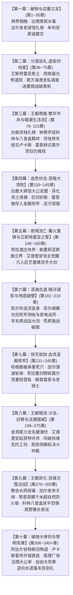

# 第二部主线进度与全流程推进指南（新对话接盘总控中枢）

> **文档定位**：第二部（维里迪亚王国篇）宏篇主线的**唯一权威进度状态机、方案联动中枢与 AI 新对话接盘 SOP**。  
> **适用场景**：用户在开启新对话时，只需向 AI 发送指令：  
> `“请阅读 方案/第二部/第二部主线进度与全流程推进指南.md，接续当前主线进度继续推进。”`  
> AI 即可瞬时获取全案架构、掌握最新断点、调用对应工具与子方案，无缝继续编写，无需重复检索全库。
>
> **底层规则基准**：所有文风、词汇与叙事禁忌严格遵循 [`AGENTS.md`](../../AGENTS.md)（第一章“全局通用文风与叙事法典”）、[`viridia-writer`](../../.agents/skills/viridia-writer/SKILL.md) 专属技能、[`writing-guards.md`](../../.agents/rules/writing-guards.md) 与 [`lexicon.md`](../../.agents/rules/lexicon.md)。
>
> **最后更新时钟**：2026-10-09  
> **当前工程主状态**：🎉 **【主线全阶段详规大圆满竣工 & 全局总审终审签署封存】**（全篇十幕三十阶段共 341 章详规已全部定稿，并分三大批次完成时空日历、90张实体卡、四大铁证与平民微观齿轮的穿透式全局总审！《临时方案_第二部主线全幕详规全局总审与对账方案.md》已全量执行并归档至 `已执行/`。下一工程阶段：可直接使用 `python scripts2/story2_tool.py` 开启 `docs2/story/` 章节实体卡（TXT）批量撰写）  
> 
> 🚨 **主线专属核心铁律（物理隔离 NSFW）**：  
> - 本指南及后续推进任务 **100% 聚焦于第二部宏篇王道主线史诗演进**（艾德里安家族昭雪、雷恩晨光誓约救赎、朱利安王权法统重构、守护平民与至暗破局）；  
> - **暂时完全剥离并搁置所有角色专属 NSFW 章节/方案**（如 `莫尔茨NSFW/`、`卢卡斯NSFW/`、`朱利安NSFW/` 等深入潜伏企划）；  
> - 严禁在后续主线分阶段详规中混入任何 NSFW 专属剧情或偏离主轴，确保主线叙事纯粹、严谨、王道与史诗质感！  
> 
> ⚡ **AI 自动接盘与自启动协议（Auto-Execution Handshake）**：  
> 当用户在任何新会话中仅输入本文件路径（`方案\第二部\第二部主线进度与全流程推进指南.md`）或要求接续推进主线时：  
> 1. **严禁停下来反问**“你想先写哪一段”或泛泛复述方案；  
> 2. **立即读取下方仪表盘“当前断点”**（当前断点为：**第十幕·阶段三十，第 306 ~ 340+ 章**）；  
> 3. **调取前置接口并执行【真实源层级与实体档案穿透对账（SSOT Check）】**：  
>    - **真实源层级**：以 `docs2/` 实体设定档案为第一权威基准，自上而下对齐母案集群（00 ~ 06 方案）、幕级大纲与阶段详规；  
>    - **基准对齐与校准**：调取本阶段涉及的 `docs2/location/`、`docs2/character/`、`docs2/npc/`、`docs2/monster/`、`docs2/world/` 原型卡，全面对齐官方标准定名、物理环境、空间结构、生理常识与封建法统；大纲细节若与原型卡存在出入，以 `docs2/` 实体卡为准并同步校正大纲；  
> 4. **直接开始编写并交付目标详规正文**，落地到对应分幕目录下的详规文件；  
> 5. 编写完成后自动在终端运行 `python scripts2/scan_viridia_diseases.py` 严格质检并更新仪表盘；**排查必须执行，但绝对禁止将自检排查记录写进文档本体**，详规正文统一在接口交接处干净闭环收束。

---

## 一、 核心架构全景：十幕三十阶段体系（310 ~ 340+ 章）

第二部已全面确立为 **“十幕·三十阶段·多线交织·至暗救赎史诗体系”**（参见 [01_宏篇主线剧情总大纲与分幕导航.md](主线与世界扩充方案/01_宏篇主线剧情总大纲与分幕导航.md)）：



---

## 二、 主线最新进度仪表盘（以幕为单位，精确到当前断点）

### 1. 进度总览表

| 幕次编号与标题 | 涵盖阶段 | 章节区间（总槽位） | 主线实写章数 | 预留空位章数 | 状态 | 对应幕大纲与核心链接 |
| :--- | :--- | :---: | :---: | :---: | :---: | :--- |
| **第一幕：破晓与边塞立足** | 阶段一 ~ 阶段三 | 第 1 ~ 35 章 (35) | **18 章** | **17 章** | ✅ **已完成** | [01_第一幕_破晓与边塞立足](主线与世界扩充方案/分阶段详规/01_第一幕_破晓与边塞立足/00_第一幕大纲与接口.md) |
| **第二幕：分道巡礼·虚妄的线索** | 阶段四 ~ 阶段七 | 第 36 ~ 75 章 (40) | **20 章** | **20 章** | ✅ **已完成** | [02_第二幕_分道巡礼·虚妄的线索](主线与世界扩充方案/分阶段详规/02_第二幕_分道巡礼·虚妄的线索/00_第二幕大纲与接口.md) |
| **第三幕：王都商路·繁华市井与暗潮生活流** | 阶段八 ~ 阶段十一 | 第 76 ~ 115 章 (40) | **21 章** | **19 章** | ✅ **已完成** | [03_第三幕_王都商路·繁华市井与暗潮生活流](主线与世界扩充方案/分阶段详规/03_第三幕_王都商路·繁华市井与暗潮生活流/00_第三幕大纲与接口.md) |
| **第四幕：血色伏击·至暗大溃败** | 阶段十二 ~ 阶段十四 | 第 116 ~ 145 章 (30) | **18 章** | **12 章** | ✅ **已完成** | [04_第四幕_血色伏击·至暗大溃败](主线与世界扩充方案/分阶段详规/04_第四幕_血色伏击·至暗大溃败/00_第四幕大纲与接口.md) |
| **第五幕：绝境流亡·篝火重铸与艾斯特雷亚之誓** | 阶段十五 ~ 阶段十七 | 第 146 ~ 180 章 (35) | **18 章** | **17 章** | ✅ **已完成** | [05_第五幕_绝境流亡·篝火重铸与艾斯特雷亚之誓](主线与世界扩充方案/分阶段详规/05_第五幕_绝境流亡·篝火重铸与艾斯特雷亚之誓/00_第五幕大纲与接口.md) |
| **第六幕：深渊古道·暗河谍影与地底破壁** | 阶段十八 ~ 阶段二十 | 第 181 ~ 210 章 (30) | **16 章** | **14 章** | ✅ **已完成** | [06_第六幕_深渊古道·暗河谍影与地底破壁](主线与世界扩充方案/分阶段详规/06_第六幕_深渊古道·暗河谍影与地底破壁/00_第六幕大纲与接口.md) |
| **第七幕：惊天劫狱·血洗圣殿死牢** | 阶段二十一 ~ 阶段二十三 | 第 211 ~ 245 章 (35) | **18 章** | **17 章** | ✅ **已完成** | [07_第七幕_惊天劫狱·血洗圣殿死牢](主线与世界扩充方案/分阶段详规/07_第七幕_惊天劫狱·血洗圣殿死牢/00_第七幕大纲与接口.md) |
| **第八幕：王都暗流·沙龙、旧卷与法理围城** | 阶段二十四 ~ 阶段二十六 | 第 246 ~ 275 章 (30) | **18 章** | **12 章** | ✅ **已完成** | [08_第八幕_王都暗流·沙龙旧卷与法理围城](主线与世界扩充方案/分阶段详规/08_第八幕_王都暗流·沙龙旧卷与法理围城/00_第八幕大纲与接口.md) |
| **第九幕：王都异化·双城合围决战** | 阶段二十七 ~ 阶段二十九 | 第 276 ~ 305 章 (30) | **18 章** | **12 章** | ✅ **已完成** | [09_第九幕_王都异化·双城合围决战](主线与世界扩充方案/分阶段详规/09_第九幕_王都异化·双城合围决战/00_第九幕大纲与接口.md) |
| **第十幕：破晓大审判与黎明宪章** | 阶段三十 | 第 306 ~ 341 章 (36) | **20 章** | **16 章** | ✅ **已完成** | [10_第十幕_破晓大审判与黎明宪章](主线与世界扩充方案/分阶段详规/10_第十幕_破晓大审判与黎明宪章/00_第十幕大纲与接口.md) |

---

### 2. 正文生成前置锁定规则（必须牢记）
* **规则**：根据 [00_第二部宏篇主线总纲与方案管理中枢.md](主线与世界扩充方案/00_第二部宏篇主线总纲与方案管理中枢.md) 铁律，**全篇十幕三十阶段详规未完全搭建定稿前，严禁开启 `docs2/story/*.TXT` 章节实体卡的实际撰写**；
* **目的**：杜绝局部跳剧情、战力数值崩塌或因后文伏笔变更导致的大规模推倒重来。

---

## 三、 主线详规撰写与留白核心法典

### 1. 推进粒度：一次一幕，全幕协同交付
- 每次接盘处理整整一幕，涵盖该幕旗下所有阶段，协调全幕时序递进与前后接口。

### 2. 最高权威真实源层级与穿透对账契约（SSOT Hierarchy）
- **权威层级公式**：
  $$\text{docs2/ 实体卡档案（第一权威基准）} > \text{母案方案集群（00 ~ 06 方案）} > \text{幕级大纲与接口} > \text{阶段旧详规}$$
- **第一权威基准：`docs2/` 实体卡档案库**：
  - **角色与NPC档案**：[`docs2/character/`](../../docs2/character/)、[`docs2/npc/`](../../docs2/npc/)（核验年龄、性格基调、台词声线、专属装备与人际羁绊）；
  - **地理与空间舞台**：[`docs2/location/`](../../docs2/location/)（核验空间声学、建筑力学、门禁锁钥与路线坐标）；
  - **怪物与生化武装**：[`docs2/monster/`](../../docs2/monster/)（核验战兽力学、死士弱点与装甲材质）；
  - **历史与法理年表**：[`docs2/world/`](../../docs2/world/)（核验修会戒律、封建商税、历史事件年表与公文法统）。
- **设定血肉保真与动作因果链**：必须以 `docs2/` 实体为硬指标，全面汲取 `00~06` 母案集群中的设定血肉；所有设定的关键道具（如手绘防务图、剪边货币、褐煤矿渣、特种拉簧、暗渠脆弱石拱、水力钟图谱残卷、四大物理铁证铅盒、生铁钥匙等）、人物微动作与交锋对白 100% 在情境中扎实落地，严禁粗暴削减剧情血肉。

### 3. 事件聚焦与双半段命名法
- **合并聚焦判据**：处于同一连续时空闭环、同一动作因果链条的情节，聚焦为一章；
- **双半段标题格式**：统一采用 `前半段——后半段`（前段点题环境或物象，后段点题关键行动或抉择）。

### 4. 情境条数依据戏剧体量自然伸缩（严禁机械统一条数）
- **严禁全篇/全幕/全阶段固定统一条数**：绝对禁止出现“全阶段每章固定相同条数”的思维惯性；
- **依据叙事因果与物理分镜精准定夺**：
  - **精炼聚焦 / 单一交锋 / 终态收束章节**：**4 ~ 5 条** 即可精炼讲透，坚决不为凑字数而注水；
  - **标准推进 / 中度因果事件章节**：**4 ~ 7 条** 完整交代起承转合与物理交互；
  - **空间转场 / 多线交织 / 长动作链条的重大复合章节**：情节细节完全展开，自然伸缩为 **6 ~ 9 条**，绝不为了压缩条数而遗漏情节；
- **动笔前自检发问**：“讲透这一个事件的真实因果链与物理动作，到底需要几个可拍摄的分镜？”由戏剧逻辑决定情境条数。

### 5. 张弛有度的弹性排布与节奏留白（拒绝机械跳格子）
- **幕级总网格刚性不变**：全幕章节总体编号区间严格保持原大纲网格（如第一幕第 1 ~ 35 章，第八幕第 246 ~ 275 章）；
- **阶段内槽位配比允许动态调整**：在维持全幕总区间不变的前提下，根据剧情体量与戏剧比重，灵活调整各阶段内的章节数目与槽位分配；
- **严禁机械“一实一空、一实一空”跳格子**！这种机械交替违背戏剧节奏；
- **节奏排布法**：
  - **连续实写（2 ~ 4 章）**：在重大冲突爆发、连环突围、商战破局或高密度生活流情感升温推进时，连续实写主线章节，维持紧绷张力；
  - **连续空位（2 ~ 4 个）**：在长途行军、跨区转场、大事件落幕后的静默潜伏避险、文牒漫长审批期或幕际交接等需要舒缓缓冲时，安排两个或多个连续预留空位作为节奏呼吸垫片；
  - **单空位留白**：用于章节间短暂的日常沉淀、休整或观察缓冲；
- **空额纯粹占位，严禁括号限定剧情**：当前 100% 专注于交付主线章节本体，空出的槽位统一仅标注占位（统一仅写作“### 第 X 章：【预留空位】”，附定位说明）。

### 6. 纯物理镜头与纯物象收束
- 每个主线章节的末尾情境必须是镜头可拍摄的纯物理终态（残茶/余烬/车辙/微光/脚步远去/水渍/雨滴/火星），严禁心理总结与定性口吻。

---

## 四、 分阶段详规与章节白名单 Schema

新编写的阶段详规文档存放于对应的分幕子目录下（如 `方案/第二部/主线与世界扩充方案/分阶段详规/08_第八幕_王都暗流·沙龙旧卷与法理围城/`），文件结构遵循以下四大部分：

```markdown
# 第X幕·阶段Y：[阶段标题]详规（第 A ~ B 章）

> **所属母案**：01_宏篇主线剧情总大纲与分幕导航.md · 00_第X幕大纲与接口.md
> **规划规模**：共 N 章（实写 M 章，预留空位 K 章）
> **定位与基调**：...

---

## 一、 核心关卡设定与约束矩阵
| 维度 | 设定参数与铁律 | 违规红线防御 |
| :--- | :--- | :--- |
| **地理舞台** | 严格引用 docs2/location/ 物理据点 | 严禁中式构件（四合院/官道等） |
| **通关与经济** | 货币（磨损银克朗/紫铜便士）、通行文牒 | 严禁碎银、银票、铜板 |
| **战术与伪装** | 零导力防护、皮革遮蔽套、冷兵器与体术 | 严禁导力光芒外溢、异端巫术嫌疑 |
| **人物交织暗线** | 核心登场人物与动机 | 严禁军队体制词汇 |
| **文风与称谓** | 旁白直呼本名；老夫老妻私下温存 | 严禁“他”、丈夫、妻子、娇妻 |

---

## 二、 逐章详尽剧情演进

### 第 X 章：前半段——后半段
* **主要人物**：核心互动角色（逗号分隔）
* **主要地点**：核心场景物理据点（严格对齐 docs2/location/）
* **核心意图**：本章在主线中的核心驱动力与戏剧功能
* **时序情境推进**（共 N 条）：
  - 1. 
  ...
  - N. （末尾纯物象化余韵定格收束）

---

### 第 Y 章：【预留空位】
* **定位**：剧情节奏留白 / 预留拓展空额

---

## 三、 关键场景动线与分镜细节
（深入拆解核心场景的物理声光、掩体、走位与动作分镜）

---

## 四、 本阶段接口与交接说明
（前置输入对账、后置交付输出、全局状态机与物象联动）
```

---

## 五、 现行方案架构与工具链全景（如何充分联动利用）

编写任何新方案或章节时，必须动态联动以下四大支柱工具与方案中枢：

### 1. 业务逻辑方案中枢（`方案/第二部/主线与世界扩充方案/` 7 大母案）

| 工具 / 方案文件名 | 核心联动职责与调用时机 |
| :--- | :--- |
| [`00_第二部宏篇主线总纲与方案管理中枢.md`](主线与世界扩充方案/00_第二部宏篇主线总纲与方案管理中枢.md) | **全局架构与调度总控**：管理中枢与总体阶段统筹。 |
| [`01_宏篇主线剧情总大纲与分幕导航.md`](主线与世界扩充方案/01_宏篇主线剧情总大纲与分幕导航.md) | **宏观演进总舵**：查阅三十阶段的定位、挫折瓶颈与高光破局手段。 |
| [`02_王国地理版图、封建社会阶层与货币经济基准.md`](主线与世界扩充方案/02_王国地理版图、封建社会阶层与货币经济基准.md) | **封建现实与经济锚定**：查阅正统晨光大陆中世纪生活流、货币换算（磨损旧银克朗/紫铜便士）、主驿道通关文牒、物价尺度、五大版图风貌。 |
| [`03_生活流张弛律动、营地温情后勤与工坊反差方案.md`](主线与世界扩充方案/03_生活流张弛律动、营地温情后勤与工坊反差方案.md) | **呼吸感与张弛律动**：严守“高压调查 ➔ 驿馆伪装 ➔ 营地温情后方回流”三段循环，行商餐饮（牛肉馅饼/香料苹果酒）与工坊整备微动作。 |
| [`04_反派双重武装底牌、战斗克制链与黑幕权谋博弈方案.md`](主线与世界扩充方案/04_反派双重武装底牌、战斗克制链与黑幕权谋博弈方案.md) | **战技与克制链**：圣殿骑士团封建武力 vs 晨光教廷暗影生化体系，古代机兽弱点拆解、暗影死士喷酸机制、阿达尔伯特与克莱门特的权谋博弈裂痕。 |
| [`05_异族特遣跨境支援动因、部族约束与战术分工方案.md`](主线与世界扩充方案/05_异族特遣跨境支援动因、部族约束与战术分工方案.md) | **五族特遣动线**：帝国大本营五族特遣队后勤物料、情报与跨境战术联动（哈根/法林/罗恩/加尔参战细节）。 |
| [`06_第二部主线跨幕连续性与全局物理状态机.md`](主线与世界扩充方案/06_第二部主线跨幕连续性与全局物理状态机.md) | **单向权威状态机**：四大铁证物理流向、角色伤情、好感度与资产流转、170km 时空日历标尺（严防时空折叠漂移）。 |

### 2. 自动化工程工具链（`scripts2/`）
* **文风病灶透视雷达**：`python scripts2/scan_viridia_diseases.py`  
  * 每次完成新详规或文档后必须运行，自动拦截：古风仙侠词汇、中式度量衡、军队行政词汇、教廷与圣殿混淆。
* **全库一致性检测**：`python scripts2/check_viridia_consistency.py`  
  * 自动校验实体卡 ID 唯一性与格式完整性。
* **章节脚手架工具**：`python scripts2/story2_tool.py`  
  * 阶段详规定稿后，用于批量生成规范元数据的章节骨架文件。

### 3. 核心文风技能与防御底线（[`viridia-writer`](../../.agents/skills/viridia-writer/SKILL.md)）
* 所有叙事与词汇基准统一遵循 [`AGENTS.md`](../../AGENTS.md)、[`writing-guards.md`](../../.agents/rules/writing-guards.md) 与 [`lexicon.md`](../../.agents/rules/lexicon.md)；
* 严格执行正向晨光大陆实体置换清单（[lexicon_mapping.md](../../.agents/skills/viridia-writer/references/lexicon_mapping.md)）；
* 坚守 JRPG 经典视听分镜（Show, Don't Tell），消除一切旁白定性说教与抽象伪科学词汇。

---

## 六、 主线详规全线竣工与下一步推进指南（Next Actions）

随着**第十幕（阶段三十，第 306 ~ 341 章）详规正式交付落地**，第二部（维里迪亚王国篇）宏篇主线**全篇十幕三十阶段共 341 章分阶段详规已全部 100% 竣工！**

全篇累计：
- **实写重章**：187 篇（高密度冲突推进、王道决断与治愈生活流）
- **弹性预留空位**：154 个（节奏呼吸缓冲、行军转场与未来微拓展槽位）
- **实体咬合**：90 张 `docs2/` 实体卡全部无缝穿透；四大物理铁证与平民齿轮三物象实现绝对闭环收束。

### 下一阶段工程接盘 SOP（开启章节实体卡撰写与终审）：
1. **全库文风与一致性终审**：
   - 运行 `python scripts2/scan_viridia_diseases.py` 确保全库 0 违规；
   - 运行 `python scripts2/check_viridia_consistency.py` 校验全库卡片；
2. **正文章节实体卡撰写（docs2/story/*.TXT）**：
   - 使用工具 `python scripts2/story2_tool.py new <ID> "<名称>" --route "<路线>" --characters "<主要人物>"` 依据各阶段详规批量初始化章节骨架；
   - 严格遵循 `docs2/story/` 章节白名单 Schema，逐幕逐章生成兼具轨迹 JRPG 战技美学、王道救赎与温润市井烟火的正文章节。
