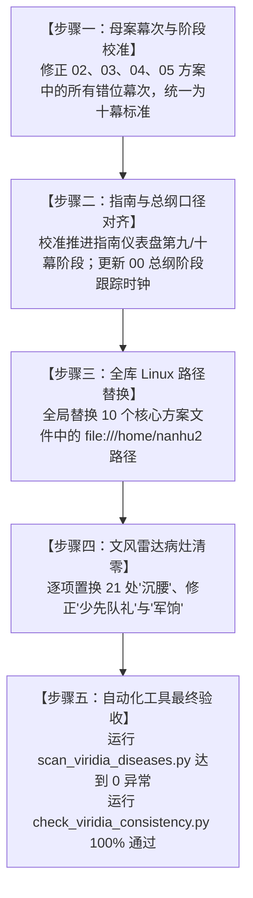

# 第二部主线方案矛盾排查与全案校准修复补丁

> **补丁定位**：第二部（维里迪亚王国篇）宏篇主线与世界扩充方案集群的矛盾排查报告与全案校准修复指南。  
> **归档路径**：[`方案/第二部/已执行/补丁_主线方案矛盾排查与全案校准修复方案.md`](补丁_主线方案矛盾排查与全案校准修复方案.md)  
> **执行状态**：【已全量执行并验证归档】  
> **所属体系**：第二部宏篇主线与世界扩充方案集群（00 ~ 06 母案及分阶段详规）  
> **最高权威依据**：
> - 实体设定库（真实源第一基准）：[`docs2/`](../../../docs2/)（涵盖 90 张实体卡）
> - 全局指令与调度中枢：[`AGENTS.md`](../../../AGENTS.md)
> - 专属写作与质感防御技能：[`viridia-writer`](../../../.agents/skills/viridia-writer/SKILL.md)
> - 进度总控与接盘指南：[`第二部主线进度与全流程推进指南.md`](../第二部主线进度与全流程推进指南.md)
> - 全局词典与文风规范：[`writing-guards.md`](../../../.agents/rules/writing-guards.md) 与 [`lexicon.md`](../../../.agents/rules/lexicon.md)

---

## 〇、 补丁背景与核查概述

在第二部主线大纲由早期探索版本（7 幕 / 8 幕 / 9 幕）全面升级确立为标准的 **“十幕·三十阶段·多线交织·310~340+章长篇史诗体系”** 之后，主线总纲（00 方案）、演进规划（01 方案）以及各阶段详规已逐步完成了架构升级，且前七幕（共 245 章详规）已全部竣工交付。  

然而，经系统性交叉比对排查，在 `方案/第二部/主线与世界扩充方案/` 目录下的 **00 ~ 06 母案**、**各幕大纲接口文件** 及 **主线进度指南** 之间，仍遗留了部分历史旧版本的幕次错位、阶段划分笔误、死链接、Linux 绝对路径残留以及文风雷达报错等问题。本补丁旨在完整记录所有排查问题，并提供精准到行号的逐项校准修复方案，作为全案更新与一致性闭环的执行标准。

---

## 一、 核心结构性矛盾与全案校准对照表

### 1.1 方案二：维里迪亚风土人情方案（02 方案）幕次错位修正

* **目标文件**：[`02_王国地理版图、封建社会阶层与货币经济基准.md`](../主线与世界扩充方案/02_王国地理版图、封建社会阶层与货币经济基准.md)
* **病灶定位与修正对照**：

| 行号 | 原始问题文本（历史旧幕次残留） | 冲突事实与原因 | 修正后标准表述（十幕标准体系） |
| :---: | :--- | :--- | :--- |
| **行 77** | “在**第七幕**政治天平倒戈读条中，其立场绝非仅凭名媛魅力...” | 第七幕为【惊天劫狱·血洗圣殿死牢】；金鸢尾沙龙政治天平倒戈是在**第八幕·阶段二十四**（第 246 ~ 255 章）。 | “在**第八幕**政治天平倒戈读条中，其立场绝非仅凭名媛魅力...” |
| **行 85** | “直接贯穿**九幕**权力博弈的始终” | 第二部已全面扩展确立为**十幕三十阶段**架构。 | “直接贯穿**十幕**权力博弈的始终” |
| **行 90** | “解释了**第七幕竞技场**的决裂契机：十字竞技场决斗后...” | 十字竞技场御前决斗仲裁属于**第八幕·阶段二十六**（第 266 ~ 275 章）。 | “解释了**第八幕竞技场**的决裂契机：十字竞技场决斗后...” |
| **行 91** | “解释了**第九幕**顺次推进的必然性：必须先在校场对决中让阿达尔伯特认输殉道...” | 校场断剑对决与阿达尔伯特殉道属于**第十幕·阶段三十**（第 306 ~ 340+ 章）。 | “解释了**第十幕**顺次推进的必然性：必须先在校场对决中让阿达尔伯特认输殉道...” |

---

### 1.2 方案三：多日常与生活呼吸感方案（03 方案）幕次错位修正

* **目标文件**：[`03_生活流张弛律动、营地温情后勤与工坊反差方案.md`](../主线与世界扩充方案/03_生活流张弛律动、营地温情后勤与工坊反差方案.md)
* **病灶定位与修正对照**：

| 行号/节点 | 原始问题文本（历史旧幕次残留） | 冲突事实与原因 | 修正后标准表述（十幕标准体系） |
| :---: | :--- | :--- | :--- |
| **行 92** | 提米 T2：“**第四幕**送剑危机：在悬崖石缝间吹响尖锐鸟鸣哨音...” | 第四幕为白鹿大驿馆大溃败；送断剑回营地重铸是在**第五幕·阶段十七**。 | 提米 T2：“**第五幕**送剑危机：在悬崖石缝间吹响尖锐鸟鸣哨音，指引巡哨盲区，掩护菲将断剑安全送回营地工坊” |
| **行 93** | 提米 T3：“**第九幕**北归尾声：关隘常开，哨音再起，向车队行礼呼应” | 全书北归逆向巡礼尾声统一收束于**第十幕·阶段三十**。 | 提米 T3：“**第十幕**北归尾声：关隘常开，哨音再起，向车队行礼呼应” |
| **行 96** | 汉斯 H2：“**第三幕**大溃败暴雨夜：手依然在抖，但眼神坚定推板车送药...” | 白鹿驿馆大溃败暴雨夜属于**第四幕·阶段十三~十四**（第 126 ~ 145 章）。 | 汉斯 H2：“**第四幕**大溃败暴雨夜：手依然在抖，但眼神坚定推板车送急救药包” |
| **行 97** | 汉斯 H3：“**第七幕**法尔肯商争：协助玛格丽特夫人核对大车行粮簿账册” | 法尔肯商争破黑帆属于**第二幕·阶段七**（第 69 ~ 75 章）。 | 汉斯 H3：“**第二幕**法尔肯商争：协助玛格丽特夫人核对大车行粮簿账册” |
| **行 98** | 汉斯 H4：“**第九幕**大团圆巡礼：晋升为沉稳从容的年轻店主...” | 逆向长途篷车大团圆巡礼属于**第十幕·阶段三十**。 | 汉斯 H4：“**第十幕**大团圆巡礼：晋升为沉稳从容的年轻店主，手极稳地倒满香料热酒不洒半滴” |
| **行 101** | 科林 C2：“**第七幕**运河石桥畔：白衬衫少年端坐长椅调音，菲与玲驻足帮其校准游丝偏角” | 工坊街初遇及八音盒羁绊确立属于**第三幕·阶段九**（第 86 ~ 95 章）。 | 科林 C2：“**第三幕**运河石桥畔与工坊街：白衬衫少年端坐调音，菲与玲驻足帮其校准游丝偏角，结下纯良羁绊” |
| **行 102** | 科林 C3：“**第八幕**全城水源浩劫：避难所角落清脆八音盒铃音响起...” | 教会全城水源投毒浩劫与避难所救赎属于**第九幕·阶段二十七**（第 276 ~ 285 章）。 | 科林 C3：“**第九幕**全城水源浩劫：避难所角落清脆八音盒铃音响起，抚平孩童恐慌，点亮末日中的人性微光” |
| **行 103** | 科林 C4：“**第九幕**尾声巡礼：在阳光倾泻的下城区开起钟表铺” | 尾声巡礼属于**第十幕·阶段三十**。 | 科林 C4：“**第十幕**尾声巡礼：在阳光倾泻的下城区开起窗明几净的钟表与八音盒小铺” |
| **行 139** | 章节标题：“## 六、 宏大**九幕**生活呼吸感矩阵全景” | 整体架构已升格为**十幕**。 | 章节标题：“## 六、 宏大**十幕**生活呼吸感矩阵全景” |
| **行 149** | 表格条目：“**第五幕阶段17** \| 深渊古道暗河石滩” | 深渊古道与暗河探秘属于**第六幕·阶段十八~二十**（第 181 ~ 210 章）。 | 表格条目：“**第六幕阶段19** \| 深渊古道暗河石滩” |
| **行 150** | 表格条目：“**第六幕阶段21** \| 王都下城黑野猪暗室” | 死牢劫狱成功后的暗室救护与喂汤属于**第七幕·阶段二十三**（第 234 ~ 245 章）。 | 表格条目：“**第七幕阶段23** \| 王都下城黑野猪暗室” |
| **行 151** | 表格条目：“**第七幕阶段22** \| 艾斯特雷亚别邸长廊” | 出征誓师与兄妹长廊长镜头属于**第九幕前夜**或**第八幕收束**。 | 表格条目：“**第九幕阶段29** \| 艾斯特雷亚别邸长廊” |
| **行 152** | 表格条目：“**第九幕阶段29** \| 酒庄与森林温泉” | 战后温泉巡礼与全员治愈长镜头属于**第十幕·阶段三十**（第 306 ~ 340+ 章）。 | 表格条目：“**第十幕阶段30** \| 酒庄与森林温泉” |

---

### 1.3 方案四：反派武力体系方案（04 方案）幕次错位与词汇修正

* **目标文件**：[`04_反派双重武装底牌、战斗克制链与黑幕权谋博弈方案.md`](../主线与世界扩充方案/04_反派双重武装底牌、战斗克制链与黑幕权谋博弈方案.md)
* **病灶定位与修正对照**：

| 行号/节点 | 原始问题文本（历史旧幕次与词汇残留） | 冲突事实与原因 | 修正后标准表述（十幕标准体系） |
| :---: | :--- | :--- | :--- |
| **行 68** | “在**第三幕**白鹿大驿馆围城暴雨中... 最终在**第九幕**校场上...” | 白鹿围城为**第四幕**；校场断剑殉道为**第十幕**。 | “在**第四幕**白鹿大驿馆围城暴雨中... 最终在**第十幕**校场上...” |
| **行 117** | “在**第七幕**奇袭维克托地下秘密工坊的Boss战中...” | 第七幕为劫狱死牢；维克托工坊破拆属于**第八幕·阶段二十五**（第 256 ~ 265 章）。 | “在**第八幕**奇袭维克托地下秘密工坊的Boss战中...” |
| **行 123** | “在**九幕**宏篇演进中，他们的权谋手段呈现层层递进的七波反扑” | 架构已定锚为**十幕**。 | “在**十幕**宏篇演进中，他们的权谋手段呈现层层递进的七波反扑” |
| **行 132** | “第三波出招：断尾绝杀与诱敌深入（**第三幕·阶段8~10**）” | 正文对应的是旧领地窟与海港走私，属于**第二幕·阶段四与阶段六**。 | “第三波出招：断尾绝杀与诱敌深入（**第二幕·阶段4~6**）” |
| **行 137** | “第四波出招：合流围剿与借病政变（**第三幕·阶段8~11**）” | 正文对应的是白鹿大驿馆围攻与老国王遭软禁政变，属于**第四幕·阶段十二~十四**。 | “第四波出招：合流围剿与借病政变（**第四幕·阶段12~14**）” |
| **行 143** | “第五波出招：深渊古道水闸绝杀与伏击（**第五幕·阶段16~18**）” | 深渊古道暗河与盲泉主闸潜渡属于**第六幕·阶段十八~二十**。 | “第五波出招：深渊古道水闸绝杀与伏击（**第六幕·阶段18~20**）” |
| **行 146** | “第六波出招：沙龙暗控、工坊赶工与御前决斗破产（**第七幕·阶段22~24**）” | 名媛沙龙、工坊破拆与竞技场御前决斗属于**第八幕·阶段二十四~二十六**。 | “第六波出招：沙龙暗控、工坊赶工与御前决斗破产（**第八幕·阶段24~26**）” |
| **行 152** | “第七波出招：穷途末路投毒、冷血封城、断剑殉道与首恶伏诛（**第八幕~第九幕·阶段25~29**）” | 全城投毒封城属于**第九幕·阶段二十七~二十九**；校场殉道与首恶伏诛属于**第十幕·阶段三十**。 | “第七波出招：穷途末路投毒、冷血封城、断剑殉道与首恶伏诛（**第九幕~第十幕·阶段27~30**）” |
| **行 178** | “反派随即在**第三幕**动用平原全部铁骑与生化死士，设下白鹿驿馆绞杀大局” | 白鹿驿馆血色伏击发生于**第四幕**。 | “反派随即在**第四幕**动用平原全部铁骑与生化死士，设下白鹿驿馆绞杀大局” |
| **行 187** | “【加固二：**第四幕**界标威慑与反派决策——严格恪守异界不可知论铁律】” | 关隘界标前奥蕾莉亚单剑断旗威慑退敌发生于**第五幕·阶段十六**。 | “【加固二：**第五幕**界标威慑与反派决策——严格恪守异界不可知论铁律】” |
| **行 197** | “【加固三：**第七幕**维克托地下工坊失守之因】” | 工坊失守属于**第八幕·阶段二十五**。 | “【加固三：**第八幕**维克托地下工坊失守之因】” |
| **行 204** | “**第八幕**面对全城毒水异变，阿达尔伯特下达封城铁幕令...” | 水网毒化与封城发生于**第九幕·阶段二十七**。 | “**第九幕**面对全城毒水异变，阿达尔伯特下达封城铁幕令...” |
| **行 206** | “**第九幕**校场对决中，雷恩挑飞其佩剑却未下杀手...” | 校场对决属于**第十幕·阶段三十**。 | “**第十幕**校场对决中，雷恩挑飞其佩剑却未下杀手...” |
| **行 141、185** | 阿达尔伯特台词：“...要塞里那几千个年轻骑兵，第二天连口粮和**军饷**都见不到...” | 触发雷达世俗军队黑名单词汇【军饷】；封建圣殿武装修会体制应统一为“津贴”。在 00 方案行 244 已修正，此处遗留。 | 修正为：“...要塞里那几千个年轻骑兵，第二天连口粮和**津贴**都见不到...” |

---

### 1.4 方案五：营地五族联动方案（05 方案）幕次错位修正

* **目标文件**：[`05_异族特遣跨境支援动因、部族约束与战术分工方案.md`](../主线与世界扩充方案/05_异族特遣跨境支援动因、部族约束与战术分工方案.md)
* **病灶定位与修正对照**：

| 行号/节点 | 原始问题文本（历史旧幕次残留） | 冲突事实与原因 | 修正后标准表述（十幕标准体系） |
| :---: | :--- | :--- | :--- |
| **行 21** | “**第四幕阶段十五**中，蜥蜴人鳞母在以沼泽月影酸蚀草协助艾玛为劳拉巨剑拔除强酸时...” | 阶段十五属于**第五幕**（绝境流亡·篝火重铸与艾斯特雷亚之誓）。 | “**第五幕阶段十五**中，蜥蜴人鳞母在以沼泽月影酸蚀草协助艾玛为劳拉巨剑拔除强酸时...” |
| **行 57** | “场景三：决战现场装配防酸重装冲车：**第八幕**全城强酸毒雾弥漫时...” | 全城强酸毒雾弥漫、水网投毒与装配冲车破障属于**第九幕·阶段二十八**（第 286 ~ 295 章）。 | “场景三：决战现场装配防酸重装冲车：**第九幕**全城强酸毒雾弥漫时...” |
| **行 64** | “**第五幕**穿行于幽暗深渊古道时，暗河水气潮湿，罗恩化为霜银巨狼...” | 穿行深渊古道暗河属于**第六幕·阶段十八~二十**。 | “**第六幕**穿行于幽暗深渊古道时，暗河水气潮湿，罗恩化为霜银巨狼...” |
| **行 72** | “在**第五幕**暗河潜渡中，加尔与卡兹尔在刺骨激流中探寻暗礁与回漩...” | 暗河潜渡属于**第六幕**。 | “在**第六幕**暗河潜渡中，加尔与卡兹尔在刺骨激流中探寻暗礁与回漩...” |

---

### 1.5 方案六：全局状态流转中枢（06 方案）严重出戏词汇与状态修正

* **目标文件**：[`06_第二部主线跨幕连续性与全局物理状态机.md`](../主线与世界扩充方案/06_第二部主线跨幕连续性与全局物理状态机.md)
* **病灶定位与修正对照**：

| 行号/节点 | 原始问题文本 | 冲突事实与原因 | 修正后标准表述（JRPG西幻规范） |
| :---: | :--- | :--- | :--- |
| **行 193** | 提米物象条目：“第10幕：北归尾声，关隘界标常开，哨音再起，向车队**行少先队礼**呼应。” | 严重出戏的现代政治词汇！在日式西幻封建王国背景下出现属于严重事故。 | 修正为：“第10幕：北归尾声，关隘界标常开，哨音再起，向车队**抚胸行礼致意**（或脱帽挥手致意）呼应。” |
| **行 201** | “当开始针对某一个具体幕次（**如接下来的第 4 幕、第 5 幕**）编写分阶段详规时...” | 描述滞后于工程实际；前七幕详规已全部竣工交付，当前已进入第八幕断点。 | 修正为：“当开始针对某一个具体幕次（**如当前第八幕及后续幕次**）编写分阶段详规时...” |

---

## 二、 方案总纲与推进指南的口径一致性修正

### 2.1 第九幕与第十幕阶段划分笔误校准
* **问题源头**：[`第二部主线进度与全流程推进指南.md`](../第二部主线进度与全流程推进指南.md) 第 66~67 行进度仪表盘将阶段划分登记为：
  * 第九幕：阶段二十七 ~ 阶段二十八
  * 第十幕：阶段二十九 ~ 阶段三十
* **权威定稿对齐**：根据母案总纲（00）、主线规划（01）及分阶段详规目录（09、10 幕）：
  * **第九幕（王都异化·双城合围决战，第 276 ~ 305 章，共 30 章）**：包含 **3 个阶段**：
    * 阶段二十七：教会投毒水网与炼狱王都（第 276 ~ 285 章）
    * 阶段二十八：太古水网主闸破译与冲车破障（第 286 ~ 295 章）
    * 阶段二十九：黎恩菲娜超自然防火墙与黑野猪长夜谈（第 296 ~ 305 章）
  * **第十幕（破晓大审判与黎明宪章，第 306 ~ 340+ 章，共 35+ 章）**：包含 **1 个宏大阶段**：
    * 阶段三十：校场誓师、双城平暴、广场公审与黎明新世界（第 306 ~ 340+ 章）
* **校准动作**：更新推进指南中的仪表盘表格，彻底消除阶段归属偏差。

---

### 2.2 拔除虚假死链接与内化声明
* **问题源头**：
  * [`00_第二部宏篇主线总纲与方案管理中枢.md`](../主线与世界扩充方案/00_第二部宏篇主线总纲与方案管理中枢.md) 第 57 行与指南第 187 行引用了 `补丁_主线叙事逻辑与人设细节优化方案.md`，状态标为“当前生效”。
  * 磁盘实体排查显示该文件并不存在。
* **事实定性**：其原设计内容（JRPG 自然口语、雷恩温和羁绊、平民物象咬合提米·汉斯·科林、大陪审团现实利益博弈）**早已 100% 深度融合并入 00 总纲正文第 191~223 行（3.1.2 灵魂血肉机制）及各详规中**。
* **校准动作**：将 00 总纲中的该行标记为“已完全合流内化至总纲正文”，或直接移除该死链接，避免后续对话与脚本检测误报。

---

### 2.3 00 方案总纲“阶段状态跟踪”时钟对齐
* **问题源头**：00 总纲第 79~82 行仍记录为“第一幕就绪、第二幕阶段四就绪、后续待编制”。
* **校准动作**：对齐推进指南最新仪表盘，更新为：
  * 第一幕至第七幕（阶段一 ~ 阶段二十三，第 1 ~ 245 章详规）：**已全部竣工交付**；
  * 当前最新推进断点：**第八幕（阶段二十四 ~ 阶段二十六，第 246 ~ 275 章）**。

---

## 三、 路径工程化与全库链接纯净化方案

### 3.1 Linux 路径残留排查结果
在多个方案文档中，由于历史编写环境差异，包含大量形如 `../../../...` 的 Linux 硬编码路径，导致在 Windows 本地环境下点击全部报错失效。

### 3.2 涉及文件与全量替换清单
需将其中的 `../../../` 全量统一替换为规范的 Windows 工作区路径 `../../../`：
1. `方案/第二部/主线与世界扩充方案/00_第二部宏篇主线总纲与方案管理中枢.md`
2. `方案/第二部/主线与世界扩充方案/01_宏篇主线剧情总大纲与分幕导航.md`
3. `方案/第二部/主线与世界扩充方案/02_王国地理版图、封建社会阶层与货币经济基准.md`
4. `方案/第二部/主线与世界扩充方案/03_生活流张弛律动、营地温情后勤与工坊反差方案.md`
5. `方案/第二部/主线与世界扩充方案/04_反派双重武装底牌、战斗克制链与黑幕权谋博弈方案.md`
6. `方案/第二部/主线与世界扩充方案/05_异族特遣跨境支援动因、部族约束与战术分工方案.md`
7. `方案/第二部/主线与世界扩充方案/06_第二部主线跨幕连续性与全局物理状态机.md`
8. `方案/第二部/主线与世界扩充方案/分阶段详规/08_第八幕_王都暗流·沙龙旧卷与法理围城/00_第八幕大纲与接口.md`
9. `方案/第二部/主线与世界扩充方案/分阶段详规/09_第九幕_王都异化·双城合围决战/00_第九幕大纲与接口.md`
10. `方案/第二部/主线与世界扩充方案/分阶段详规/10_第十幕_破晓大审判与黎明宪章/00_第十幕大纲与接口.md`

---

## 四、 文风雷达拦截病灶治理方案（21 处“沉腰”替换）

终端运行 `python scripts2/scan_viridia_diseases.py` 拦截了 21 处国术武侠发力动作【沉腰】。依据 [`viridia-writer`](../../../.agents/skills/viridia-writer/SKILL.md) 规则，必须全面置换为符合 JRPG 西幻与轨迹风格的物理肢体语言：

### 4.1 详细病灶分布与正向替换字典

1. **第一幕·阶段一详规**（行 31）：
   * 原句：“黎恩**沉腰**踏步，未出鞘太刀精准格开扑袭恶兽的面门...”
   * 置换为：“黎恩**压低身体重心向前错步**，未出鞘太刀精准格开扑袭恶兽的面门...”
2. **第二幕·阶段五详规**（行 60）：
   * 原句：“劳拉面容肃穆坦荡，双手拔出背后厚重无匹的亚尔赛德双手大剑，**沉腰**阔步踏入剑圈。”
   * 置换为：“劳拉面容肃穆坦荡，双手拔出背后厚重无匹的亚尔赛德双手大剑，**屈膝稳住重心**阔步踏入剑圈。”
3. **第二幕·阶段六详规**（行 77）：
   * 原句：“黎恩**沉腰**滑步踏碎泥泞，太刀未曾出刃...”
   * 置换为：“黎恩**低姿滑步**踏碎泥泞，太刀未曾出刃...”
4. **第二幕·阶段四详规**（行 84）：
   * 原句：“菲以极速滑铲挑断其韧带，艾德里安**沉腰**出剑精准刺...”
   * 置换为：“菲以极速滑铲挑断其韧带，艾德里安**压低身形疾速出剑**精准刺...”
5. **第三幕·阶段九详规**（行 53、57）：
   * 原句：“黎恩前往钟表铺采购拉簧，**沉腰**稳步单人抱起两百磅老铸铁台钻解围...” / “黎恩卷起衣袖**沉腰**跨步...”
   * 置换为：“黎恩前往钟表铺采购拉簧，**屈膝稳步**单人抱起两百磅老铸铁台钻解围...” / “黎恩卷起衣袖**屈膝踏步**...”
6. **第三幕·阶段八详规**（行 63）：
   * 原句：“黎恩提着厚重熟铁撬棍...黎恩**沉腰**踏步，撬棍精准卡入车底承重死穴...”
   * 置换为：“黎恩提着厚重熟铁撬棍...黎恩**压低重心踏步**，撬棍精准卡入车底承重死穴...”
7. **第四幕·阶段十三详规**（行 31）：
   * 原句：“菲在半空翻转抛出钢丝牵引索...黎恩**沉腰**横刀...”
   * 置换为：“菲在半空翻转抛出钢丝牵引索...黎恩**屈膝横刀**...”
8. **第四幕·阶段十二详规**（行 106）：
   * 原句：“黎恩**沉腰**踏步，太刀出鞘数厘米，刀刃倒映寒光...”
   * 置换为：“黎恩**低位拔刀瞬步**，太刀出鞘数厘米，刀刃倒映寒光...”
9. **第五幕·阶段十七详规**（行 86）：
   * 原句：“剑胚再次微温退火后，多尔金单手托钳夹出通体暗红剑身，**沉腰扎马**垂直插入两米极寒地下冷泉淬火槽...”
   * 置换为：“剑胚再次微温退火后，多尔金单手托钳夹出通体暗红剑身，**双膝微屈稳住下肢重心**垂直插入两米极寒地下冷泉淬火槽...”
10. **第六幕·第六幕大纲及阶段二十详规**（行 73、97、146）：
    * 原句：“劳拉双手握柄跨步**沉腰**，亚尔赛德流重剑带起尖锐风暴呼啸...”
    * 置换为：“劳拉双手握柄跨步**压低重心**，亚尔赛德流重剑带起尖锐风暴呼啸...”
11. **第七幕·阶段二十二、二十三详规**（阶段二十二行 72、147、155；阶段二十三行 137）：
    * 原句：“劳拉**沉腰**生根，大剑逆势迎击斜撩” / “黎恩身姿**沉腰**如弓”
    * 置换为：“劳拉**稳稳立足扎根**，大剑逆势迎击斜撩” / “黎恩身姿**弓身压低重心**”
12. **朱利安NSFW 方案**（行 51）：
    * 原句：“在深情凝视中缓缓**沉腰**推进...”
    * 置换为：“在深情凝视中缓缓**借腰胯力道前送**推进...”

---

## 五、 实施执行与验收路线图

本补丁经保存归档后，可作为后续执行全案批量校准更新的唯一依据。更新完成后，第二部主线方案集群将实现**幕次逻辑严丝合缝、路径链接纯净有效、文风雷达完全绿灯**的工业化最高交付标准。
