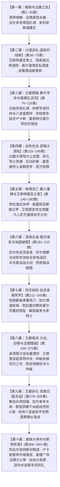

# 第二部主线进度与全流程推进指南（新对话接盘总控中枢）

> **文档定位**：第二部（维里迪亚王国篇）宏篇主线的**唯一权威进度状态机、方案联动中枢与 AI 新对话接盘 SOP**。  
> **适用场景**：用户在开启新对话时，只需向 AI 发送指令：  
> `“请阅读 方案/第二部/第二部主线进度与全流程推进指南.md，接续当前主线进度继续推进。”`  
> AI 即可瞬时获取全案架构、掌握最新断点、调用对应工具与子方案，无缝继续编写，无需重复检索全库。
>
> **最后更新时钟**：2026-10-08  
> **当前工程主状态**：**骨架详规搭建期**（十幕三十阶段，前六幕及第七幕阶段二十一、阶段二十二共 233 章详规已全部竣工，当前处于**第七幕阶段二十三断点**）  
> 
> 🚨 **主线专属核心铁律（物理隔离 NSFW）**：  
> - 本指南及后续推进任务 **100% 聚焦于第二部宏篇王道主线史诗演进**（艾德里安家族昭雪、雷恩晨光誓约救赎、朱利安王权法统重构、守护平民与至暗破局）；  
> - **暂时完全剥离并搁置所有角色专属 NSFW 章节/方案**（如 `莫尔茨NSFW/`、`卢卡斯NSFW/`、`朱利安NSFW/` 等深入潜伏企划）；  
> - 严禁在后续主线分阶段详规中混入任何 NSFW 专属剧情或偏离主轴，确保主线叙事纯粹、严谨、王道与史诗质感！  
> 
> ⚡ **AI 自动接盘与自启动协议（Auto-Execution Handshake）**：  
> 当用户在任何新会话中仅输入本文件路径（`方案\第二部\第二部主线进度与全流程推进指南.md`）或要求继续推进时：  
> 1. **严禁停下来反问**“你想先写哪一段”或泛泛复述方案；  
> 2. **立即读取下方仪表盘“当前断点”**（当前断点为：**第七幕·阶段二十三，第 234 ~ 245 章**）；  
> 3. **调取前置接口并执行【实体档案穿透对账（SSOT Check）】**：  
>    - **真实源层级**：以 `docs2/` 实体设定档案为第一权威基准，自上而下对齐幕级大纲与阶段详规；  
>    - **基准对齐与校准**：调取本阶段涉及的 `docs2/location/`、`docs2/character/`、`docs2/npc/` 原型卡，全面对齐官方标准定名、物理环境、生理常识（温度、水质、生存耐受度）与官职体系；大纲细节若与原型卡存在出入，以 `docs2/` 实体卡为准并同步校正大纲；  
> 4. **直接开始编写并交付目标详规正文**，落地到对应目录下的详规文件；  
> 5. 编写完成后自动在终端运行 `python scripts2/scan_viridia_diseases.py` 严格质检并更新仪表盘；**排查必须执行，但严禁将自检排查记录写进文档本体**，详规统一在接口交接处干净闭环。

---

## 一、 核心架构全景：十幕三十阶段体系（310 ~ 340 章）

第二部已全面确立为 **“十幕·三十阶段·多线交织·至暗救赎史诗体系”**（参见 [01_宏篇主线演进与阶段规划方案.md](file:///d:/Siegfried/世界书/方案/第二部/主线与世界扩充方案/01_宏篇主线演进与阶段规划方案.md)）：



---

## 二、 主线最新进度仪表盘（精确到当前断点）

### 1. 进度总览表

| 幕次编号与标题 | 对应章节 | 包含阶段 | 详规文件状态 | 关联目录 / 详规文件 |
| :--- | :---: | :--- | :---: | :--- |
| **第一幕：破晓与边塞立足** | 第 1 ~ 35 章 | 阶段一 ~ 阶段三 | ✅ **已全部完成** | [01_第一幕_破晓与边塞立足/](file:///d:/Siegfried/世界书/方案/第二部/主线与世界扩充方案/分阶段详规/01_第一幕_破晓与边塞立足/) |
| ├ 阶段一：战后新生与两界相触 | 第 1 ~ 8 章 | 森林与后方中继 | ✅ 已完成 | [阶段一_战后新生与两界相触详规.md](file:///d:/Siegfried/世界书/方案/第二部/主线与世界扩充方案/分阶段详规/01_第一幕_破晓与边塞立足/阶段一_战后新生与两界相触详规.md) |
| ├ 阶段二：边境暗流与要塞破关 | 第 9 ~ 19 章 | 关隘水毒与排沙洞 | ✅ 已完成 | [阶段二_边境暗流与要塞破关详规.md](file:///d:/Siegfried/世界书/方案/第二部/主线与世界扩充方案/分阶段详规/01_第一幕_破晓与边塞立足/阶段二_边境暗流与要塞破关详规.md) |
| └ 阶段三：法尔肯驿镇与边境前哨 | 第 20 ~ 35 章 | 驿镇扎根与建交 | ✅ 已完成 | [阶段三_法尔肯驿镇与边境前哨详规.md](file:///d:/Siegfried/世界书/方案/第二部/主线与世界扩充方案/分阶段详规/01_第一幕_破晓与边塞立足/阶段三_法尔肯驿镇与边境前哨详规.md) |
| **第二幕：分道巡礼·虚妄的线索** | 第 36 ~ 75 章 | 阶段四 ~ 阶段七 | ✅ **已全部完成** | [02_第二幕_分道巡礼·虚妄的线索/](file:///d:/Siegfried/世界书/方案/第二部/主线与世界扩充方案/分阶段详规/02_第二幕_分道巡礼·虚妄的线索/) |
| ├ 阶段四：艾斯特雷亚焦土与炼金机兽 | 第 36 ~ 48 章 | 焦土探秘与主齿轮 | ✅ 已完成 | [阶段四_艾斯特雷亚焦土与炼金机兽详规.md](file:///d:/Siegfried/世界书/方案/第二部/主线与世界扩充方案/分阶段详规/02_第二幕_分道巡礼·虚妄的线索/阶段四_艾斯特雷亚焦土与炼金机兽详规.md) |
| ├ 阶段五：晨光修道院救赎与折剑十四人 | 第 49 ~ 58 章 | 修院名册与月下极剑 | ✅ 已完成 | [阶段五_晨光修道院救赎与折剑十四人详规.md](file:///d:/Siegfried/世界书/方案/第二部/主线与世界扩充方案/分阶段详规/02_第二幕_分道巡礼·虚妄的线索/阶段五_晨光修道院救赎与折剑十四人详规.md) |
| ├ 阶段六：迷雾海港走私网络与暗影黑帆 | 第 59 ~ 68 章 | 海港残根与洗钱账 | ✅ 已完成 | [阶段六_迷雾海港走私网络与暗影黑帆详规.md](file:///d:/Siegfried/世界书/方案/第二部/主线与世界扩充方案/分阶段详规/02_第二幕_分道巡礼·虚妄的线索/阶段六_迷雾海港走私网络与暗影黑帆详规.md) |
| └ 阶段七：法尔肯迷雾商争与月下破袭 | 第 69 ~ 75 章 | 复式记账与巨狼夜战 | ✅ 已完成 | [阶段七_法尔肯迷雾商争与月下破袭详规.md](file:///d:/Siegfried/世界书/方案/第二部/主线与世界扩充方案/分阶段详规/02_第二幕_分道巡礼·虚妄的线索/阶段七_法尔肯迷雾商争与月下破袭详规.md) |
| **第三幕：王都商路·繁华市井与生活流** | 第 76 ~ 115 章 | 阶段八 ~ 阶段十一 | ✅ **已全部完成** | [03_第三幕_王都商路·繁华市井与暗潮生活流/](file:///d:/Siegfried/世界书/方案/第二部/主线与世界扩充方案/分阶段详规/03_第三幕_王都商路·繁华市井与暗潮生活流/) |
| ├ 阶段八：王都初至与白榆货栈 | 第 76 ~ 85 章 | 入城报关与下城货栈 | ✅ 已完成 | [阶段八_王都初至与白榆货栈详规.md](file:///d:/Siegfried/世界书/方案/第二部/主线与世界扩充方案/分阶段详规/03_第三幕_王都商路·繁华市井与暗潮生活流/阶段八_王都初至与白榆货栈详规.md) |
| ├ 阶段九：工坊街百工与八音盒之音 | 第 86 ~ 95 章 | 结识科林与卢卡斯 | ✅ 已完成 | [阶段九_工坊街百工与八音盒之音详规.md](file:///d:/Siegfried/世界书/方案/第二部/主线与世界扩充方案/分阶段详规/03_第三幕_王都商路·繁华市井与暗潮生活流/阶段九_工坊街百工与八音盒之音详规.md) |
| ├ 阶段十：王都繁华沙龙与市井暗涌 | 第 96 ~ 105 章 | 沙龙名媛与竞技场 | ✅ 已完成 | [阶段十_王都繁华沙龙与市井暗涌详规.md](file:///d:/Siegfried/世界书/方案/第二部/主线与世界扩充方案/分阶段详规/03_第三幕_王都商路·繁华市井与暗潮生活流/阶段十_王都繁华沙龙与市井暗涌详规.md) |
| └ 阶段十一：八音盒商栈托付与白鹿启程 | 第 106 ~ 115 章 | 文牒盖印与白鹿启程 | ✅ 已完成 | [阶段十一_纯铜八音盒商栈托付与白鹿启程详规.md](file:///d:/Siegfried/世界书/方案/第二部/主线与世界扩充方案/分阶段详规/03_第三幕_王都商路·繁华市井与暗潮生活流/阶段十一_纯铜八音盒商栈托付与白鹿启程详规.md) |
| **第四幕：血色伏击·至暗大溃败** | **第 116 ~ 145 章** | **阶段十二 ~ 阶段十四** | ✅ **已全部完成** | [04_第四幕_血色伏击·至暗大溃败/](file:///d:/Siegfried/世界书/方案/第二部/主线与世界扩充方案/分阶段详规/04_第四幕_血色伏击·至暗大溃败/) |
| ├ 阶段十二：合流会盟与大驿馆围城 | 第 116 ~ 125 章 | 密室铁证与暴雨合围 | ✅ **已完成** | [阶段十二_合流会盟与白鹿大驿馆围城详规.md](file:///d:/Siegfried/世界书/方案/第二部/主线与世界扩充方案/分阶段详规/04_第四幕_血色伏击·至暗大溃败/阶段十二_合流会盟与白鹿大驿馆围城详规.md) |
| ├ 阶段十三：异化死士狂潮与名刃折断 | 第 126 ~ 135 章 | 道义苦战与巨剑断折 | ✅ **已完成** | [阶段十三_异化死士狂潮与名刃折断详规.md](file:///d:/Siegfried/世界书/方案/第二部/主线与世界扩充方案/分阶段详规/04_第四幕_血色伏击·至暗大溃败/阶段十三_异化死士狂潮与名刃折断详规.md) |
| └ 阶段十四：石桥断后、雷恩被俘与政变 | 第 136 ~ 145 章 | 雷恩被俘与全境通缉 | ✅ **已完成** | [阶段十四_石桥断后、雷恩被俘与王室政变详规.md](file:///d:/Siegfried/世界书/方案/第二部/主线与世界扩充方案/分阶段详规/04_第四幕_血色伏击·至暗大溃败/阶段十四_石桥断后、雷恩被俘与王室政变详规.md) |
| **第五幕：绝境流亡·篝火重铸** | **第 146 ~ 180 章** | **阶段十五 ~ 阶段十七** | ✅ **已全部完成** | [05_第五幕_绝境流亡·篝火重铸与艾斯特雷亚之誓/](file:///d:/Siegfried/世界书/方案/第二部/主线与世界扩充方案/分阶段详规/05_第五幕_绝境流亡·篝火重铸与艾斯特雷亚之誓/) |
| ├ 阶段十五：泥泞逃亡、领民相护与领主觉醒 | 第 146 ~ 156 章 | 领民相护与领主觉醒 | ✅ **已完成** | [阶段十五_泥泞逃亡、领民相护与领主觉醒详规.md](file:///d:/Siegfried/世界书/方案/第二部/主线与世界扩充方案/分阶段详规/05_第五幕_绝境流亡·篝火重铸与艾斯特雷亚之誓/阶段十五_泥泞逃亡、领民相护与领主觉醒详规.md) |
| ├ 阶段十六：界标对峙与黄金罗刹重剑威慑 | 第 157 ~ 167 章 | 重剑断界与封山对峙 | ✅ **已完成** | [阶段十六_界标对峙与黄金罗刹重剑威慑详规.md](file:///d:/Siegfried/世界书/方案/第二部/主线与世界扩充方案/分阶段详规/05_第五幕_绝境流亡·篝火重铸与艾斯特雷亚之誓/阶段十六_界标对峙与黄金罗刹重剑威慑详规.md) |
| └ 阶段十七：太古古库破译与重铸防酸破邪巨剑 | 第 168 ~ 180 章 | 符文雕琢与重铸巨剑 | ✅ **已完成** | [阶段十七_太古古库破译与重铸防酸破邪巨剑详规.md](file:///d:/Siegfried/世界书/方案/第二部/主线与世界扩充方案/分阶段详规/05_第五幕_绝境流亡·篝火重铸与艾斯特雷亚之誓/阶段十七_太古古库破译与重铸防酸破邪巨剑详规.md) |
| **第六幕：深渊古道·暗河谍影** | **第 181 ~ 210 章** | **阶段十八 ~ 阶段二十** | ✅ **已全部完成** | [06_第六幕_深渊古道·暗河谍影与地底破壁/](file:///d:/Siegfried/世界书/方案/第二部/主线与世界扩充方案/分阶段详规/06_第六幕_深渊古道·暗河谍影与地底破壁/) |
| ├ **阶段十八：盲泉逆流与太古石闸** | 第 181 ~ 190 章 | 暗河探险与重力石闸 | ✅ **已完成** | [阶段十八_盲泉逆流与太古石闸详规.md](file:///d:/Siegfried/世界书/方案/第二部/主线与世界扩充方案/分阶段详规/06_第六幕_深渊古道·暗河谍影与地底破壁/阶段十八_盲泉逆流与太古石闸详规.md) |
| ├ **阶段十九：特务黑兔与死牢水网逆向测绘** | 第 191 ~ 200 章 | 光剑攀附与密电接头 | ✅ **已完成** | [阶段十九_特务黑兔与死牢水网逆向测绘详规.md](file:///d:/Siegfried/世界书/方案/第二部/主线与世界扩充方案/分阶段详规/06_第六幕_深渊古道·暗河谍影与地底破壁/阶段十九_特务黑兔与死牢水网逆向测绘详规.md) |
| └ **阶段二十：黑市商道交锋与重器密运** | 第 201 ~ 210 章 | 羊毛商战与巨狼夜巡 | ✅ **已完成** | [阶段二十_黑市商道交锋与重器密运详规.md](file:///d:/Siegfried/世界书/方案/第二部/主线与世界扩充方案/分阶段详规/06_第六幕_深渊古道·暗河谍影与地底破壁/阶段二十_黑市商道交锋与重器密运详规.md) |
| **第七幕：惊天劫狱·血洗圣殿死牢** | **第 211 ~ 245 章** | **阶段二十一 ~ 阶段二十三** | 🔴 **【当前断点】** | [07_第七幕_惊天劫狱·血洗圣殿死牢/](file:///d:/Siegfried/世界书/方案/第二部/主线与世界扩充方案/分阶段详规/07_第七幕_惊天劫狱·血洗圣殿死牢/) |
| ├ **阶段二十一：哈根勘破死穴与加尔水泽潜渡** | 第 211 ~ 221 章 | 工程点穴与潜渡斩销 | ✅ **已完成** | [阶段二十一_哈根勘破死穴与加尔水泽潜渡详规.md](file:///d:/Siegfried/世界书/方案/第二部/主线与世界扩充方案/分阶段详规/07_第七幕_惊天劫狱·血洗圣殿死牢/阶段二十一_哈根勘破死穴与加尔水泽潜渡详规.md) |
| ├ **阶段二十二：奇袭深层水牢与重剑斩碎莫尔茨重铠** | 第 222 ~ 233 章 | 水底破壁与重剑雪耻 | ✅ **已完成** | [阶段二十二_奇袭深层水牢与重剑斩碎莫尔茨重铠详规.md](file:///d:/Siegfried/世界书/方案/第二部/主线与世界扩充方案/分阶段详规/07_第七幕_惊天劫狱·血洗圣殿死牢/阶段二十二_奇袭深层水牢与重剑斩碎莫尔茨重铠详规.md) |
| └ **阶段二十三：信义抉择放行与暗室深夜守候喂汤** | **第 234 ~ 245 章** | **卢卡斯撤桥与暗室救护** | ⚠️ **待编写**（即刻任务） | `阶段二十三_信义抉择放行与暗室深夜守候喂汤详规.md` (待建) |
| **第八幕：王都暗流·沙龙与法理围城** | 第 246 ~ 275 章 | 阶段二十四 ~ 阶段二十六 | ⏳ 仅有幕级大纲接口 | 详见 `08_第八幕_王都暗流·沙龙旧卷与法理围城/` |
| **第九幕：王都异化·双城合围决战** | 第 276 ~ 305 章 | 阶段二十七 ~ 阶段二十九 | ⏳ 仅有幕级大纲接口 | 详见 `09_第九幕_王都异化·双城合围决战/` |
| **第十幕：破晓大审判与黎明宪章** | 第 306 ~ 340+ 章 | 阶段三十 | ⏳ 仅有幕级大纲接口 | 详见 `10_第十幕_破晓大审判与黎明宪章/` |

---

### 2. 正文生成前置锁定规则（必须牢记）
* **规则**：根据 [第二部章节规划与扩写方案.md](file:///d:/Siegfried/世界书/方案/第二部/写作指导/第二部章节规划与扩写方案.md) 铁律，**全篇十幕三十阶段详规未完全搭建定稿前，严禁开启 `docs2/story/*.TXT` 章节实体卡的实际撰写**；
* **目的**：杜绝局部跳剧情、战力数值崩塌或因后文伏笔变更导致的大规模推倒重来。

---

## 三、 现行方案架构与工具链全景（如何充分联动利用）

编写任何新方案或章节时，必须动态联动以下四大支柱工具与方案中枢：

### 1. 业务逻辑方案中枢（`方案/第二部/主线与世界扩充方案/`）

| 工具 / 方案文件名 | 核心联动职责与调用时机 |
| :--- | :--- |
| [01_宏篇主线演进与阶段规划方案.md](file:///d:/Siegfried/世界书/方案/第二部/主线与世界扩充方案/01_宏篇主线演进与阶段规划方案.md) | **宏观演进总舵**：查阅三十阶段的定位、挫折瓶颈与高光破局手段。 |
| [02_维里迪亚风土人情与宏大世界构建方案.md](file:///d:/Siegfried/世界书/方案/第二部/主线与世界扩充方案/02_维里迪亚风土人情与宏大世界构建方案.md) | **封建现实与经济锚定**：查阅货币换算（磨损旧银克朗/紫铜便士）、主驿道通关文牒、物价尺度、五大版图风貌。 |
| [03_多日常与生活呼吸感设计方案.md](file:///d:/Siegfried/世界书/方案/第二部/主线与世界扩充方案/03_多日常与生活呼吸感设计方案.md) | **呼吸感与张弛律动**：严守“高压调查 ➔ 驿馆伪装 ➔ 营地温情后方回流”三段循环，提取餐饮（牛肉馅饼/香料苹果酒）与微动作。 |
| [04_反派双重武力体系与战斗机制方案.md](file:///d:/Siegfried/世界书/方案/第二部/主线与世界扩充方案/04_反派双重武力体系与战斗机制方案.md) | **战技与克制链**：查阅古代机兽弱点拆解、暗影死士喷酸机制、阿达尔伯特与克莱门特的权谋博弈与分肥裂痕。 |
| [05_营地五族跨境联动与特遣支援方案.md](file:///d:/Siegfried/世界书/方案/第二部/主线与世界扩充方案/05_营地五族跨境联动与特遣支援方案.md) | **五族特遣动线**：矮人重装工程（哈根/法林）、狼人荒野嗅探（罗恩）、蜥蜴人水网潜渡（加尔）参战细节。 |
| [06_第二部主线跨幕连续性与全局状态流转中枢.md](file:///d:/Siegfried/世界书/方案/第二部/主线与世界扩充方案/06_第二部主线跨幕连续性与全局状态流转中枢.md) | **单向权威状态机**：四大铁证物理流向、劳拉断剑/雷恩水牢伤病链、170km时空日历标尺（严防时空折叠漂移）。 |
| [补丁_主线叙事逻辑与人设细节优化方案.md](file:///d:/Siegfried/世界书/方案/第二部/主线与世界扩充方案/补丁_主线叙事逻辑与人设细节优化方案.md) | **自然JRPG口语**：校准雷恩温和羁绊、平民物象咬合与大陪审团利益博弈。 |

### 2. 自动化工程工具链（`scripts2/`）
* **文风病灶透视雷达**：`python scripts2/scan_viridia_diseases.py`  
  * 每次完成新详规或文档后必须运行，自动拦截：古风仙侠词汇、中式度量衡、军队行政词汇、教廷与圣殿混淆。
* **全库一致性检测**：`python scripts2/check_viridia_consistency.py`  
  * 自动校验实体卡 ID 唯一性与格式完整性。
* **章节脚手架工具**：`python scripts2/story2_tool.py`  
  * 阶段详规定稿后，用于批量生成规范元数据的章节骨架文件。

### 3. 核心文风技能（[`viridia-writer`](file:///d:/Siegfried/世界书/.agents/skills/viridia-writer/SKILL.md)）
* 严格执行正向欧陆实体置换清单（[lexicon_mapping.md](file:///d:/Siegfried/世界书/.agents/skills/viridia-writer/references/lexicon_mapping.md)）；
* 坚守 JRPG 经典视听分镜（Show, Don't Tell），消除一切旁白定性说教。

---

## 四、 分阶段详规编写标准规范（SOP 模板）

新编写的阶段详规文档必须存放于对应的分幕子目录下（如 `方案/第二部/主线与世界扩充方案/分阶段详规/04_第四幕_血色伏击·至暗大溃败/`），文件结构必须严格遵循以下四大部分：

```markdown
# 第X幕·阶段Y：[阶段标题]详规（第 A ~ B 章）

> **所属方案**：00总纲 · 01演进规划 · 00本幕大纲与接口
> **规划规模**：共 N 章（第 A ~ B 章）
> **定位与基调**：...

---

## 一、 核心关卡设定与约束矩阵
| 维度 | 设定参数与铁律 | 违规红线防御 |
| :--- | :--- | :--- |
| **地理舞台** | 严格引用 docs2/location/ 物理据点 | 严禁中式构件（四合院/官道等） |
| **通关与经济** | 货币（磨损银克朗/紫铜便士）、通行文牒 | 严禁碎银、银票、铜板 |
| **战术与伪装** | 零导力防护、皮革遮蔽套、冷兵器与体术 | 严禁导力光芒外溢、异端巫术嫌疑 |
| **人物交织暗线** | 核心登场人物与动机 | 严禁军队体制词汇 |
| **文风与称谓** | 旁白直呼本名；老夫老妻私下温存 | 严禁“他”、丈夫、妻子、娇妻 |

---

## 二、 逐章详尽剧情演进（共 N 章）

### 第 X 章：[章节标题]
* **阶段/路线**：第X幕·阶段Y / [具体路线]
* **主要人物**：[列出核心互动角色，逗号分隔]
* **核心意图**：[本章核心戏剧冲突与驱动，严禁流程图箭头]
* **时序情境推进**：
  - 1. [物理切入与人物动线]
  - 2. [现场交锋/危机推进/线索展开]
  - 3. [战术应对/情感微互动]
  - 4. [末尾纯物象化余韵收束，严禁抽象心理结论]

---

## 三、 关键场景动线与分镜细节
（深入拆解核心场景的物理声光、掩体、走位与动作分镜）

---

## 四、 本阶段接口与交接说明
（前置输入对账、后置交付输出、全局状态机与物象联动）
```

---

## 五、 文风与阵营概念防呆红线（AI 必查负面清单）

> 详细置换对照表请严格索引技能档案：[`viridia-writer 实体置换法典`](file:///d:/Siegfried/世界书/.agents/skills/viridia-writer/references/lexicon_mapping.md)

| 违规类型 | 绝对禁止（全库零容忍，出现即为事故） | 正向替代示范 |
| :--- | :--- | :--- |
| **中式货币与度量** | 禁中式银钱度量（碎·银、银两、铜·板、文钱、银·票、盘·缠、斤、尺、寸、里） | 磨损旧银克朗、生银颗粒、紫铜便士、公斤、米、公里 |
| **中式道路与建筑** | 禁中式道路建构（官·道、车马店、长亭、四·合·院、厢房、门·楣、中·军·大·帐） | 主驿道、石板商道、石造大驿馆、木筋酒馆、长官主帐 |
| **军队体制词** | 禁世俗行政军队（军·队、军·官、军·团、军·令、守·将、武·将、全·军、官僚） | 圣殿骑士团、先锋骑兵队、守备卫队、要塞典狱长、全队 |
| **武侠仙侠黑话** | 禁中式仙侠套路（剑·意、剑·客、罡气、内·力、气机、丹·田、反噬、喷出精血） | 战技、自由剑士、风压破空、重斩破甲、强震受创吐血 |
| **角色称谓标签** | 禁俗套身份标签（丈·夫、妻·子、娇·妻、小娇妻、未婚妻、恶霸、他代指黎恩） | 老夫老妻、同伴爱侣、直呼名字“黎恩/菲娜”、典狱长 |
| **阵营二元混淆** | 严禁教会与圣殿概念混搭（严禁“教·会·骑·士/圣·殿·主·教/圣·殿·修·道·院/教·廷·审·判·骑·士”） | 圣殿骑士（莫尔茨/卢卡斯）、晨光修道院（教廷）、异端审问厅执行官（达米安） |

---

## 六、 新对话 AI 快速接盘与执行指南（Next Actions）

当在新会话中接手本任务时，请按以下顺序执行：

### 第一步：读取当前断点
* 查看本文档第二节仪表盘，当前断点锁定在：**第七幕·阶段二十三（第 234 ~ 245 章）**；
* 关联目标文件：`方案/第二部/主线与世界扩充方案/分阶段详规/07_第七幕_惊天劫狱·血洗圣殿死牢/阶段二十三_信义抉择放行与暗室深夜守候喂汤详规.md`。

### 第二步：调取参考上下文与【实体档案穿透对账（SSOT Check）】
* 阅读 [00_第七幕大纲与接口.md](file:///d:/Siegfried/世界书/方案/第二部/主线与世界扩充方案/分阶段详规/07_第七幕_惊天劫狱·血洗圣殿死牢/00_第七幕大纲与接口.md)；
* 参考已写完的上一阶段 [阶段二十二_奇袭深层水牢与重剑斩碎莫尔茨重铠详规.md](file:///d:/Siegfried/世界书/方案/第二部/主线与世界扩充方案/分阶段详规/07_第七幕_惊天劫狱·血洗圣殿死牢/阶段二十二_奇袭深层水牢与重剑斩碎莫尔茨重铠详规.md) 终局状态（死牢告破、莫尔茨重铠崩碎坠入激流、雷恩与戈德弗里等十四位受难老骑士及老哨长巴恩斯获救、起获前任绝笔血书、要塞破晓巨钟狂鸣拉响全城戒备）；
* **对齐本阶段涉及的 docs2 实体卡片**：
  - [圣殿要塞.TXT](file:///d:/Siegfried/世界书/docs2/location/圣殿要塞.TXT)（`LOC_D2_21`，内廷生铁吊桥、排污暗道出口）；
  - [黑野猪酒馆.TXT](file:///d:/Siegfried/世界书/docs2/location/黑野猪酒馆.TXT)（`LOC_D2_30`，王都下城地下暗室、后街密道）；
  - 角色卡：卢卡斯（白鹰先锋骑兵队长·25岁）、雷恩、戈德弗里、劳拉、黎恩、爱丽榭、奥蕾莉亚；
  - 核心实体与情感物象：前任大团长屠杀自白血书绝笔（EVD-05）、老骑士血指印调令密件原本、爱丽榭滚烫野山菌浓汤砂锅；
* **基准对齐机制**：以 `docs2/` 原型卡为第一权威源，确保专有名词与物理常识精准闭环。

### 第三步：生成详规并运行检测
* 依据本文档第四节 SOP 模板，撰写 `阶段二十三_信义抉择放行与暗室深夜守候喂汤详规.md`；
* 运行 powershell 命令：`python scripts2/scan_viridia_diseases.py` 确保 0 违规，严禁将自检排查记录写入方案文档；
* 编写完成后，更新本文档表格中阶段二十二的状态为“✅ 已完成”，将断点推进至第八幕·阶段二十四。

