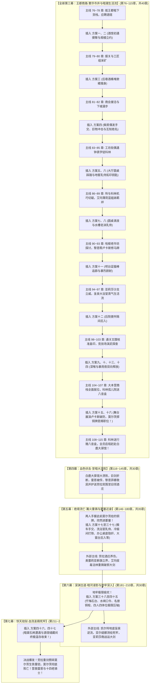

# 第二部莫尔茨NSFW时间线拉长与主线节奏校准临时补丁（重构版：全新第三幕前移全面挂靠）

> **归档位置**：`方案/第二部/莫尔茨NSFW/莫尔茨NSFW时间线拉长与主线节奏校准临时补丁.md`  
> **关联母案**：
> - [00_莫尔茨NSFW情境企划全案总纲.md](00_莫尔茨NSFW情境企划全案总纲.md)
> - [01_黑野猪酒馆市井情趣篇（方案一至方案十六）.md](01_黑野猪酒馆市井情趣篇（方案一至方案十六）.md)
> - [02_圣殿要塞深入与要职近身篇（方案十七至方案三十七）.md](02_圣殿要塞深入与要职近身篇（方案十七至方案三十七）.md)
> - [03_圣殿地牢深入与核心情趣篇（方案三十八至方案四十五）.md](03_圣殿地牢深入与核心情趣篇（方案三十八至方案四十五）.md)
> - [04_王都暗渠突围与终极收束篇（方案四十六至方案四十七）.md](04_王都暗渠突围与终极收束篇（方案四十六至方案四十七）.md)
> - [莫尔茨NSFW剧情融入主线架构方案.md](莫尔茨NSFW剧情融入主线架构方案.md)
> - [06_宏篇十幕扩充与全新第三幕王都繁华市井详规方案.md](../主线与世界扩充方案/06_宏篇十幕扩充与全新第三幕王都繁华市井详规方案.md)
> - [01_宏篇主线剧情总大纲与分幕导航.md](../主线与世界扩充方案/01_宏篇主线剧情总大纲与分幕导航.md)
> - 参考实体档案：[`docs2/npc/莫尔茨.TXT`](../../../docs2/npc/莫尔茨.TXT) · [`docs2/npc/科林.TXT`](../../../docs2/npc/科林.TXT) · [`docs2/npc/卢卡斯.TXT`](../../../docs2/npc/卢卡斯.TXT) · [`docs2/location/黑野猪酒馆.TXT`](../../../docs2/location/黑野猪酒馆.TXT) · [`docs2/location/圣殿要塞.TXT`](../../../docs2/location/圣殿要塞.TXT) · [`docs2/location/圣殿地牢.TXT`](../../../docs2/location/圣殿地牢.TXT)

---

## 一、 重大架构调整动因：时间窗口前移至全新第三幕的必然性与逻辑证成

### 1. 从“九幕死锁”到“十幕彻底解耦”的根本蜕变
* **原方案瓶颈**：原方案受制于“救雷恩/刺探死牢”的谍报思维，强行将莫尔茨酒馆篇压在“至暗大溃败（白鹿大驿馆）”之后的流亡重铸期。这导致前 112 章完全没有莫尔茨与黑野猪酒馆的戏份，且在同伴重伤流亡的压抑氛围中看两人偷欢具有微小的心理割裂感；
* **核心动因彻底解耦的红利**：根据《核心动因校准补丁》，黎恩与菲娜去酒馆打工**根本不是为了搜集情报，纯属异国游历随兴生活流 + 老夫老妻骨子里寻求刺激满足特殊背德XP**！莫尔茨也是十四年来常年下值买醉的常客。两者之间纯属市井偶遇与上位游戏，获取的钥匙口令纯属顺手牵羊的小乐子；
* **扩充十幕·前移至全新第三幕（第 76 章伊始）的绝妙契机**：
  第二幕边境分道巡礼结束、查获走私铁证后，商队主力在王都外围建立商栈、申请官僚通关文牒（周期长达 5~6 周）。全员安好、状态轻松，黎恩与菲娜以自由伴侣身份漫步王都下城区，在黑野猪酒馆随手打杂；
  不仅与钟表学徒**科林**、先锋骑兵队长**卢卡斯**建立起深厚自然的市井交织，更在**第 76 章（整整提前 37 章！）**从容开启方案一至方案十六，彻底打碎等待感！

---

## 二、 篇幅翻倍与主线大纵深时间矩阵（全新十幕挂靠总表）

酒馆篇前移至全新第三幕后，莫尔茨情境线在主线中跨越 **第三幕、第五幕、第六幕、第七幕**，主线可用篇幅从原本拥挤狭隘的 38 章，**大幅扩容至整整 170 章大跨度纵深（第 76 ~ 245 章）！**  
戏内物理时间跨越整个秋季至初冬，总计长达 **约 85 ~ 90 天（近整整一个季度 / 12 周）**！

### 四大篇章与主线十幕精准映射总表

| 篇章阶段 | 方案范围 | 对应主线幕次与章节（全新十幕） | 主线外部大事件并行线 | 两人戏内时间跨度 | 莫尔茨要塞防务与出没频率 |
| :--- | :--- | :--- | :--- | :--- | :--- |
| **篇章一：黑野猪酒馆市井情趣篇** | **方案 1 ~ 16** | **全新第三幕全幕** （第 76 ~ 115 章，共 40 章） | 1. 商队下城外围商栈确立与公秤处报关 2. 结识钟表学徒科林与工坊街机巧切磋 3. 结识先锋队长卢卡斯与下城公正巡防 4. 亚莉莎沙龙名媛接洽与商税穿透 | **约 35 ~ 40 天** （整整 5~6 周） | 每隔 4~6 天下值进城买醉一次；期间历经东门检修、南门关税轮防、暗渠排沙抢修。方案一至十六从容铺开，温水煮青蛙。方案16莫尔茨狂妄掷出要塞通行特许铜牌！ |
| *(大幕交替·主线至暗转折)* | *无方案* | **第四幕：血色伏击·至暗大溃败** （第 116 ~ 145 章，共 30 章） | 1. 白鹿大驿馆大公会师与深夜伏击 2. 亚尔席昂巨剑折断，雷恩被俘入圣殿死牢 3. 黎恩菲娜维持超自然结界疏散平民 4. 护送重伤吐血的劳拉泥泞突围至旧领酒庄 | 约 3 ~ 5 天 | 莫尔茨受调令押解雷恩入死牢并严刑拷问；全城与关隘特级戒严。黎恩菲娜全力参战与救护。 |
| **篇章二：圣殿要塞深入与要职近身篇** | **方案 17 ~ 37** | **第五幕全幕** （第 146 ~ 180 章，共 35 章） | 1. 劳拉酒庄休养与艾德里安领主觉醒 2. 奥蕾莉亚关隘单人立界威慑圣殿铁骑 3. 艾玛魔女拔毒与法林重铸破邪双手大剑 4. 太古秘书库破译与水路接应筹备 | **约 32 ~ 35 天** （整整 5 周） | 两人持此前莫尔茨给的铜牌光明正大进入要塞！全城宵禁大演练、水牢排沙与圣泉水疗、校场步骑大操演、领邦演武。菲娜寝居近身侍奉，黎恩冷锻间打铁修甲。 |
| **篇章三：圣殿地牢深入与核心情趣篇** | **方案 38 ~ 45** | **第六幕全幕** （第 181 ~ 210 章，共 30 章） | 1. 凯尔玲盲泉逆流探秘太古矮人石闸 2. 亚尔缇娜壁虎模式潜入测绘地底死牢水网 3. 亚莉莎双层酒桶羊毛商战密运大剑 4. 罗恩荒原满月巨狼夜战破围 | **约 12 ~ 14 天** （近 2 周） | 大劫狱前夕要塞特级临战戒备，莫尔茨坐镇底层死牢与刑房；依托死牢亲信轮值，菲娜借送药送汤逐一突破死令、水闸口令、名册与铜栓。四人四体位极限爆发！ |
| **篇章四：王都暗渠突围与终极收束篇** | **方案 46 ~ 47** | **第七幕大劫狱决战前夕** （第 211 ~ 212 章，共 2 章） | 1. 菲娜与黎恩暗渠实测撤退水路遭遇莫尔茨（方案46） 2. 潜回黑野猪暗室向全员汇总大交接 3. 莫尔茨回酒馆买醉，储藏室周旋与黎恩终极温存回收（方案47） | **2 ~ 3 天** | 决战前夜终极闭环与情感大圆满！ |
| **决战高潮** | 无方案 | **第七幕决战** （第 213 ~ 245 章，共 33 章） | 大劫狱全面爆发！劳拉手持重铸新生大剑正面劈碎莫尔茨生铁重铠，莫尔茨彻底溃败落水败亡！营救雷恩与十四老骑士！ | 决战当天 | 莫尔茨正式退场，转入战后突围。 |

---

## 三、 篇章一（酒馆篇）：前移至第三幕的 35 ~ 40 天真实生活史流转表

> **彻底根除原方案中“天天搞/同日搞两次”的硬伤**：
> - 方案一到十六均匀分布在整整 35~40 天内，每隔 3~5 天才有一次莫尔茨接触；
> - 期间充盈着黎恩劈柴修桌、菲娜跑堂跑腿的市井生活流，以及与科林、卢卡斯等本土角色的温润互动，绝缘任何仓促与机械感。

| 旅居天数与时段 | 莫尔茨防务与动向 | 发生方案与核心事件 | 空间场域 | 对应主线大事件（全新第三幕） |
| :--- | :--- | :--- | :--- | :--- |
| **第 1 天傍晚** | 莫尔茨结束要塞旬防巡更，进酒馆豪饮发泄暴戾 | **方案一**：吧台死角先摸翘臀后壮胆揉胸试探 | 吧台死角 | **主线第 76~78 章**：商队抵王都外围租下货栈；黎恩菲娜漫步下城应聘黑野猪酒馆。 |
| **第 1 天深夜** | （莫尔茨回要塞官舍） | **方案二**：酒馆阁楼坦白与立约 | 闭门阁楼 | 菲娜主动坦白，黎恩吃醋立下上位背德契约。 |
| *第 2 ~ 4 天* | *要塞例行巡防下城，莫尔茨督操* | *（日常平静）黎恩打磨木凳，菲娜端送麦酒* | *酒馆日常* | **主线第 79~80 章**：公秤处办理报关；工匠组采集王都矿石。 |
| **第 5 天下午** | 莫尔茨带扈从巡视下城路过酒馆 | **方案三**：后巷酒桶堆掀裙搜身 | 后巷狭道 | 借口搜私酒掀裙搜身，黎恩巷口扫地目击。 |
| *第 6 ~ 8 天* | *深层水牢排沙暗渠泥沙冲刷，莫尔茨连续三日坐镇排沙* | *黎恩修补酒馆后院柴棚，菲娜洗涤亚麻围裙* | *日常打杂* | **主线第 81~82 章**：亚莉莎与艾德里安接洽商会行会。 |
| **第 9 天傍晚** | 换装进店豪饮，酒后后院撞见菲娜 | **方案四**：柴房偶发手交、巨物冲击与双方姓名获悉 | 后院闭门柴房 | 菲娜直面 19cm 冲击产生背德狂想；莫尔茨获悉菲娜名字，出门遇黎恩获悉其名。 |
| *第 10 ~ 13 天* | *王都南门关税轮巡，莫尔茨述职与操演* | *菲娜与黎恩暗中确认要塞换防周期与巡防规律* | *酒馆日常* | **主线第 83~85 章**：玲与艾玛走访工坊街，偶遇纯良少年科林！ |
| **第 14 天傍晚** | 莫尔茨大壁炉长桌大嚼烤猪前肘 | **方案五**：大厅圆桌帷底赤足踩弄亵玩 | 底层大圆桌 | 菲娜主动脱鞋伸足踩弄，黎恩邻桌目击。 |
| *第 15 ~ 17 天* | *要塞武备库生铁盘点与入库巡检* | *黎恩协助加固储酒窖橡木桶铁箍，提前踩点* | *地下酒窖* | **主线第 86~87 章**：科林八音盒清音响起，玲惊叹纯机械擒纵天赋。 |
| **第 18 天午后** | 莫尔茨借口索要特酿黑麦原酒进地窖 | **方案六**：阴冷酒窖双乳夹弄与顺带拓印钥匙 | 地下深层酒窖 | 支开黎恩，地窖双乳夹弄，顺手拓印死牢主钥匙。 |
| *第 19 ~ 21 天* | *要塞铁匠铺赶制重箭，莫尔茨督操* | *黎恩在暗室翻模制作钥匙铜胚，取得首枚钥匙* | *二楼暗室* | **主线第 88~89 章**：艾玛与科林长谈，同款薄荷蓝眼眸的纯良羁绊。 |
| **第 22 天夜** | 莫尔茨与多名巡守骑士围桌聚饮大笑 | **方案七**：大厅圆桌底滴液与漏水怪声 | 底层大圆桌 | 众目睽睽下桌帷底亵玩，水滴落石板，调侃漏水。 |
| *第 23 ~ 24 天* | *要塞晨操与巡防换更* | *科林路过酒馆，黎恩帮扛台钻，菲娜投喂麦茶* | *市井日常* | **主线第 90~92 章**：矮人二哥哈根下水道勘测听石；卢卡斯下城巡视。 |
| **第 25 天上午** | 莫尔茨巡防下值顺道来后院洗手 | **方案八**：后院水槽皂沫乳侍奉与隔栅窥视 | 后院洗涤石槽 | 菲娜设局抹皂乳侍，黎恩柴房栅栏后磨斧目击。 |
| **第 26 天深夜** | 酒馆深夜打烊，莫尔茨半醉霸占吧台 | **方案十一**：吧台逗猫棒晃荡、追舔与暴烈颜射 | 底层吧台长椅 | 极度反差颜射涂面，黎恩一步外擦杯目击。 |
| *第 27 ~ 29 天* | *要塞例行会议与全城公文通报* | *黎恩细致替菲娜敷面温存，复盘防务* | *阁楼温存* | **主线第 93~95 章**：黎恩帮卢卡斯战马修掌铁，心照不宣工匠礼。 |
| **第 30 天下午** | 白昼佣兵满座，莫尔茨借酒劲尾随菲娜 | **方案十二**：后院木板便所隔间后入贯穿 | 后院木板便所 | 隔音极差，佣兵拍门催促，黎恩拐角接应避险。 |
| **第 31 天傍晚** | 莫尔茨独自豪饮烈性大麦啤酒 | **方案九**：圆桌帷底纯粹深喉与掀帘对视 | 底层大圆桌 | 菲娜主动钻入桌底深喉吞吐，黎恩端盘经过掀帘视线死锁。 |
| **第 32 天下午** | 莫尔茨在要塞运粮队前哨检查草料车 | **方案十**：后院草料棚车尾深喉换防时刻 | 后院草料棚 | 菲娜深喉换取布防时刻，黎恩棚外添草放风。 |
| **第 32 天暴雨夜** | 暴雨倾盆，莫尔茨借酒劲霸占二楼 | **方案十三**：二楼包厢粗木床沿正面破防贯穿 **方案十四**：阁楼暗室双向释放与前后同步内射 | 二楼阁楼包厢 | 暴雨雷鸣听音，高位折叠架肩；暗房黎恩背德接应，双向内射终极高潮！ |
| *第 33 ~ 35 天* | *暴雨致使城郊山洪，莫尔茨回防要塞护城河* | *菲娜与黎恩暗室休整，清点已获钥匙情报* | *日常休整* | **主线第 96~105 章**：亚莉莎金鸢尾沙龙立威；商队通关文牒核准。 |
| **第 36 天深夜** | 莫尔茨包场狂欢，广邀群骑聚饮炫耀恶趣味 | **方案十五**：深夜舞台蒙面展演·卢卡斯破防硬挺 | 底层小舞台 | 蒙面舞台托腿展演，卢卡斯生理破防，黎恩装傻称赞飙戏。 |
| **第 37 天深夜** | 舞台散场，莫尔茨极度膨胀施舍特权 | **方案十六**：深夜大厅恩赐职位与女上位索赏 | 底层昏暗大厅 | **莫尔茨狂妄掷出要塞通行特许铜牌！调两人下月进要塞上工！** |
| *第 38 ~ 40 天* | *商队文牒办妥，全员启程赶赴白鹿大驿馆大公会议* | *黎恩菲娜暗室收拾行囊，向科林赠礼告别* | *市井告别* | **主线第 106~115 章**：科林赠八音盒；商队向白鹿大驿馆进发，第三幕收束！ |

---

## 四、 全新十幕下“隔着几个主线来一次”的穿插挂靠总矩阵

在前移至全新第三幕后，主线（第 76 ~ 245 章，共 170 章）与莫尔茨 NSFW 方案的交错排布达到了完美的**黄金交叉比例（平均每 2 ~ 3 章主线穿插 1 次莫尔茨情境事件）**：

---

## 五、 结论与全案收益

1. **彻底解耦、彻底解放**：莫尔茨 NSFW 全篇在全新第三幕提前至第 76 章展开，与主线大溃败的沉重彻底剥离，黎恩与菲娜以纯粹从容的上位姿态享受市井生活流与背德情趣；
2. **伏笔浑然天成**：要塞特许铜牌在第三幕终章自然落入手中，成为第五幕进入要塞的绝佳通行凭证；
3. **世界丰富度倍增**：全新第三幕与科林、卢卡斯、哈根的深度交融，让维里迪亚王都的市井百工充满人间烟火气，为全书提供了无可比拟的史诗纵深。

---
*本重构版补丁已全面对齐《06_宏篇十幕扩充与全新第三幕王都繁华市井详规方案》，后续写作严格以此为准。*
