# 第二部莫尔茨NSFW时间线拉长与主线节奏校准临时补丁（重构版：第四幕前移全面挂靠）

> **归档位置**：`方案/第二部/莫尔茨NSFW/莫尔茨NSFW时间线拉长与主线节奏校准临时补丁.md`  
> **关联母案**：
> - [00_莫尔茨NSFW情境企划全案总纲.md](file:///home/nanhu2/comfyui/世界书/方案/第二部/莫尔茨NSFW/00_莫尔茨NSFW情境企划全案总纲.md)
> - [01_黑野猪酒馆市井潜伏篇（方案一至方案十六）.md](file:///home/nanhu2/comfyui/世界书/方案/第二部/莫尔茨NSFW/01_黑野猪酒馆市井潜伏篇（方案一至方案十六）.md)
> - [02_圣殿要塞深入与要职近身篇（方案十七至方案三十七）.md](file:///home/nanhu2/comfyui/世界书/方案/第二部/莫尔茨NSFW/02_圣殿要塞深入与要职近身篇（方案十七至方案三十七）.md)
> - [03_圣殿地牢深入与核心摸排篇（方案三十八至方案四十五）.md](file:///home/nanhu2/comfyui/世界书/方案/第二部/莫尔茨NSFW/03_圣殿地牢深入与核心摸排篇（方案三十八至方案四十五）.md)
> - [04_王都暗渠突围与终极收束篇（方案四十六至方案四十七）.md](file:///home/nanhu2/comfyui/世界书/方案/第二部/莫尔茨NSFW/04_王都暗渠突围与终极收束篇（方案四十六至方案四十七）.md)
> - [莫尔茨NSFW剧情融入主线架构方案.md](file:///home/nanhu2/comfyui/世界书/方案/第二部/莫尔茨NSFW/莫尔茨NSFW剧情融入主线架构方案.md)
> - [01_宏篇主线演进与阶段规划方案.md](file:///home/nanhu2/comfyui/世界书/方案/第二部/主线与世界扩充方案/01_宏篇主线演进与阶段规划方案.md)
> - [00_第二部主线与世界扩充方案总纲.md](file:///home/nanhu2/comfyui/世界书/方案/第二部/主线与世界扩充方案/00_第二部主线与世界扩充方案总纲.md)
> - 参考实体档案：[`docs2/npc/莫尔茨.TXT`](file:///home/nanhu2/comfyui/世界书/docs2/npc/莫尔茨.TXT) · [`docs2/location/黑野猪酒馆.TXT`](file:///home/nanhu2/comfyui/世界书/docs2/location/黑野猪酒馆.TXT) · [`docs2/location/圣殿要塞.TXT`](file:///home/nanhu2/comfyui/世界书/docs2/location/圣殿要塞.TXT) · [`docs2/location/圣殿地牢.TXT`](file:///home/nanhu2/comfyui/世界书/docs2/location/圣殿地牢.TXT)

---

## 一、 重大架构调整动因：时间窗口前移的必然性与逻辑证成

### 1. 原第五幕挂靠的篇幅瓶颈
* **原方案瓶颈**：原方案将莫尔茨全篇 47 套方案硬性塞在“第五幕（第 148 ~ 175 章）至第六幕前半（第 176 ~ 185 章）”，整个主线窗口仅有 **38 章**！
* **致命矛盾**：如果只有 38 章篇幅，而莫尔茨 NSFW 方案多达 47 套，即便打散，平均每一章都要切一次潜伏或发生一次 NSFW，主线多线群像（地底暗河特遣组、地表商战组、大本营重铸组）将被彻底切割撕裂，读者极易产生强烈的审美疲劳。

### 2. 为什么在“第四幕伊始（第 113 章左右）”随兴前往王都？（生活流与动因契合）
* **第四幕的生活流契机**：第三幕白鹿驿馆突围后，主角团主力在艾斯特雷亚旧领酒庄隐蔽休整（劳拉养伤调理内伤、艾玛与法林潜心重铸破邪重剑）。后方大本营安全且节奏沉稳，伙伴们各有专注的事务，完全不需要黎恩与菲娜时刻守在酒庄；
* **异国游历随兴而起与满足特殊XP的隐秘渴望**：
  1. **随兴而起**：维里迪亚是全然陌生的零导力异国封建王国，黎恩与菲娜此前从未涉足。两人以结伴游历的年轻避难伴侣身份漫步至王都下城区，在充满市井气息的黑野猪酒馆随手找了份短工（黎恩劈柴修桌打杂，菲娜跑堂端酒），体验未曾见过的异国民俗；
  2. **骨子里的隐秘期待（核心XP）**：两人相伴多年，早已是心照不宣的老夫老妻，骨子里一直期待在鱼龙混杂、糙汉满地的市井酒馆里能发生一些意想不到的刺激事，满足两人特殊的背德、窥视、当面吃醋与占有欲瞬间被引爆的特殊情趣；
  3. **偶遇莫尔茨与顺水推舟“陪他玩”**：莫尔茨下值进店喝酒纯属偶然撞上。当莫尔茨见色起意在死角动手动脚后，两人不仅不慌，反而觉得这个狂妄的要塞典狱长太适合当情趣玩具了，于是顺水推舟为了满足自己的XP陪他玩下去；后续答应进入要塞也是觉得“去要塞玩比酒馆更刺激了”，顺手拿到的钥匙和口令只是顺手牵羊顺带捎回的小玩意，回了暗室还能当成战利品找黎恩撒娇邀功（“看，顺手还拿到了这个呢，快夸夸我~”），**没有任何人委派任务，两人也绝不热衷摸排情报，纯粹是老夫老妻的上位寻欢与情趣游戏！**

---

## 二、 篇幅翻倍与主线大纵深时间矩阵（73 章主线 ⟷ 90 天生活流）

将潜伏时间线前移至第四幕初后，主线可用篇幅从原先狭隘的 38 章，**大幅扩容至整整 73 章（第 113 ~ 185 章）！**  
戏内物理时间跨越整个秋末至初冬，总计长达 **约 85 ~ 90 天（近整整一个季度 / 12 周）**！

### 四大篇章与主线阶段精准映射总表

| 篇章阶段 | 方案范围 | 对应主线幕次与章节 | 主线外部大事件并行线 | 潜伏组戏内跨度 | 莫尔茨要塞防务与出没频率 |
| :--- | :--- | :--- | :--- | :--- | :--- |
| **篇章一：黑野猪酒馆市井潜伏篇** | **方案 1 ~ 16** | **第四幕全幕** （第 113 ~ 147 章，共 35 章） | 1. 劳拉酒庄休养与艾德里安领主觉醒（阶段12） 2. 奥蕾莉亚关隘单人立界威慑圣殿（阶段13） 3. 艾玛魔女拔毒与法林重铸破邪大剑（阶段14） 4. 太古秘书库破译与水路接应集结（阶段15） | **约 35 ~ 40 天** （整整 5~6 周） | 每隔 4~6 天下值进城买醉一次；期间历经东门检修、南门关税轮防、暗渠排沙抢修。方案一至十六从容铺开，温水煮青蛙。 |
| **篇章二：圣殿要塞深入与要职近身篇** | **方案 17 ~ 37** | **第五幕全幕** （第 148 ~ 175 章，共 28 章） | 1. 凯尔、玲地底盲泉逆流与破译石闸（阶段16） 2. 亚尔缇娜壁虎模式潜入死牢水网测绘（阶段17） 3. 亚莉莎羊毛转口商战对冲关税（阶段18） 4. 双层酒桶密运破邪大剑，罗恩荒原夜战（阶段18） | **约 32 ~ 35 天** （整整 5 周） | 莫尔茨将二人调入要塞。经历全城宵禁大演练、水牢主暗渠排沙与圣泉水疗、校场步骑大操演、领邦演武。菲娜近身侍奉，黎恩冷锻间打铁修甲。 |
| **篇章三：圣殿地牢深入与核心摸排篇** | **方案 38 ~ 45** | **第六幕大劫狱核心筹备期** （第 176 ~ 184 章，共 9 章） | 1. 哈根依据三维图纸勘破两百年承重死穴（阶段19） 2. 加尔率水泽精锐潜渡断销准备（阶段19） 3. 各路攻坚主力潜伏集结，暴雨将至 | **约 12 ~ 14 天** （近 2 周） | 大劫狱前夕要塞进入特级临战戒备，莫尔茨坐镇底层死牢与刑房；依托死牢亲信轮值排班表，菲娜借送药送汤逐一突破死令、水闸口令、名册与铜栓。 |
| **篇章四：王都暗渠突围与终极收束篇** | **方案 46 ~ 47** | **第六幕决战前夕** （第 185 章，共 1 章） | 1. 菲娜与黎恩暗渠实测撤退水路遭遇莫尔茨（方案46） 2. 潜回黑野猪暗室向全员汇总大交接 3. 莫尔茨回酒馆买醉，储藏室周旋与黎恩终极温存回收（方案47） | **2 ~ 3 天** | 决战前夜终极闭环与情感大圆满！ |
| **决战高潮** | 无方案 | **第六幕决战** （第 186 ~ 197 章，共 12 章） | 大劫狱全面爆发！劳拉手持重铸新生大剑正面劈碎莫尔茨生铁重铠，莫尔茨彻底溃败落水败亡！营救雷恩与十四老骑士！ | 决战当天 | 莫尔茨正式退场，转入战后突围。 |

---

## 三、 篇章一（酒馆篇）：前移至第四幕后的 35 ~ 40 天真实生活史流转表

> **彻底根除原方案中“天天搞/同日搞两次”的硬伤**：
> - 方案十一（吧台逗猫棒颜射）与方案十二（木板便所后入）彻底拆分，相隔 4 天；
> - 方案一到十六均匀分布在整整 35~40 天内，每隔 3~5 天才有一次莫尔茨接触，其余时间全为黎恩劈柴修桌、菲娜跑堂跑腿的市井生活流，以及二人在阁楼密谋与温存。

| 潜伏天数与时段 | 莫尔茨防务与动向 | 发生方案与核心事件 | 空间场域 | 对应主线大事件（第四幕） |
| :--- | :--- | :--- | :--- | :--- |
| **第 1 天傍晚** | 莫尔茨结束押送雷恩入狱的一旬防务，进酒馆豪饮发泄 | **方案一**：吧台死角先摸翘臀后壮胆揉胸试探 | 吧台死角 | **主线第 113 章**：黎恩与菲娜抵达王都下城建立前哨；劳拉在旧领酒庄休养。 |
| **第 1 天深夜** | （莫尔茨回要塞官舍） | **方案二**：酒馆阁楼坦白与立约 | 闭门阁楼 | 菲娜主动坦白，黎恩吃醋立下背德契约。 |
| *第 2 ~ 4 天* | *要塞因雷恩入狱全面排查外围关卡，莫尔茨督操* | *（日常平静）黎恩打磨木凳，菲娜端送麦酒* | *酒馆日常* | **主线第 114 ~ 116 章**：艾德里安领民掩护战；劳拉壁炉前沉思剑道。 |
| **第 5 天下午** | 莫尔茨带扈从巡视下城路过酒馆 | **方案三**：后巷酒桶堆掀裙搜身 | 后巷狭道 | 借口搜违禁品掀裙搜身，黎恩巷口扫地目击。 |
| *第 6 ~ 8 天* | *深层水牢排沙暗渠泥沙冲刷，莫尔茨连续三日坐镇排沙* | *黎恩修补酒馆后院柴棚，暗中复盘要塞地形* | *日常打杂* | **主线第 117 ~ 119 章**：老家仆死守地窖秘密；艾德里安领主意志觉醒。 |
| **第 9 天傍晚** | 换装进店豪饮，酒后后院撞见菲娜 | **方案四**：柴房偶发手交、巨物冲击与双方姓名获悉 | 后院闭门柴房 | 菲娜直面 19cm 冲击产生背德狂想；莫尔茨获悉菲娜名字，出门遇黎恩获悉其名。 |
| *第 10 ~ 13 天* | *王都南门关税轮巡，莫尔茨述职与操演* | *菲娜与黎恩暗中确认要塞换防周期与巡防规律* | *酒馆日常* | **主线第 120 ~ 123 章**：奥蕾莉亚手持阿卡迪亚巨剑单人立界威慑圣殿！ |
| **第 14 天傍晚** | 莫尔茨大壁炉长桌大嚼烤猪前肘 | **方案五**：大厅圆桌帷底赤足踩弄亵玩 | 底层大圆桌 | 菲娜主动脱鞋伸足踩弄，黎恩邻桌目击。 |
| *第 15 ~ 17 天* | *要塞武备库生铁盘点与入库巡检* | *黎恩协助加固储酒窖橡木桶铁箍，提前踩点* | *地下酒窖* | **主线第 124 ~ 127 章**：阿达尔伯特军政算盘，封锁商道转入对峙。 |
| **第 18 天午后** | 莫尔茨借口索要特酿黑麦原酒进地窖 | **方案六**：阴冷酒窖双乳夹弄与顺带拓印钥匙 | 地下深层酒窖 | 支开黎恩，地窖双乳夹弄，顺手拓印死牢主钥匙。 |
| *第 19 ~ 21 天* | *要塞铁匠铺赶制重箭，莫尔茨督操* | *黎恩在暗室翻模制作钥匙铜胚，取得首枚钥匙* | *二楼暗室* | **主线第 128 ~ 131 章**：菲身手敏捷送回断刃；艾玛魔女药理准备除酸。 |
| **第 22 天夜** | 莫尔茨与多名巡守骑士围桌聚饮大笑 | **方案七**：大厅圆桌底滴液与漏水怪声 | 底层大圆桌 | 众目睽睽下桌帷底亵玩，水滴落石板，调侃漏水。 |
| *第 23 ~ 24 天* | *要塞晨操与巡防换更* | *菲娜洗涤亚麻围裙，黎恩前街搬运麦料* | *日常打杂* | **主线第 132 ~ 134 章**：大哥多尔金铸刃、法林以符文刻杖刻入破邪符文。 |
| **第 25 天上午** | 莫尔茨巡防下值顺道来后院洗手 | **方案八**：后院水槽皂沫乳侍奉与隔栅窥视 | 后院洗涤石槽 | 菲娜设局抹皂乳侍，黎恩柴房栅栏后磨斧目击。 |
| **第 26 天深夜** | 酒馆深夜打烊，莫尔茨半醉霸占吧台 | **方案十一**：吧台逗猫棒晃荡、追舔与暴烈颜射 | 底层吧台长椅 | 极度反差颜射涂面，黎恩一步外擦杯目击。（**彻底独立排布！**） |
| *第 27 ~ 29 天* | *要塞例行会议与全城公文通报* | *黎恩细致替菲娜敷面温存，复盘防务* | *阁楼温存* | **主线第 135 ~ 138 章**：双手大剑冷泉淬火重铸新生！加尔、罗恩请缨协助。 |
| **第 30 天下午** | 白昼佣兵满座，莫尔茨借酒劲尾随菲娜 | **方案十二**：后院木板便所隔间后入贯穿 | 后院木板便所 | 隔音极差，佣兵拍门催促，黎恩拐角接应避险。（**与方案十一相隔4天！**） |
| **第 31 天傍晚** | 莫尔茨独自豪饮烈性大麦啤酒 | **方案九**：圆桌帷底纯粹深喉与掀帘对视 | 底层大圆桌 | 菲娜主动钻入桌底深喉吞吐，黎恩端盘经过掀帘视线死锁。 |
| **第 32 天下午** | 莫尔茨在要塞运粮队前哨检查草料车 | **方案十**：后院草料棚车尾深喉换防时刻 | 后院草料棚 | 菲娜深喉换取布防时刻，黎恩棚外添草放风。 |
| **第 32 天暴雨夜** | 暴雨倾盆，莫尔茨借酒劲霸占二楼 | **方案十三**：二楼包厢粗木床沿正面破防贯穿 **方案十四**：阁楼暗室双向释放与前后同步内射 | 二楼阁楼包厢 | 暴雨雷鸣听音，高位折叠架肩；暗房黎恩背德接应，双向内射终极高潮！ |
| *第 33 ~ 35 天* | *暴雨致使城郊山洪，莫尔茨回防要塞护城河* | *菲娜与黎恩暗室休整，清点已获钥匙情报* | *日常休整* | **主线第 139 ~ 143 章**：凯尔玲太古秘书库破译；迷迭香平底船水路迎剑。 |
| **第 36 天深夜** | 莫尔茨包场狂欢，广邀群骑聚饮炫耀恶趣味 | **方案十五**：深夜舞台蒙面展演·卢卡斯破防硬挺 | 底层小舞台 | 蒙面舞台托腿展演，卢卡斯生理破防，黎恩装傻称赞飙戏。 |
| **第 37 天深夜** | 舞台散场，莫尔茨极度膨胀施舍特权 | **方案十六**：深夜大厅恩赐职位与女上位索赏 | 底层昏暗大厅 | 莫尔茨掷出通行铜牌，调两人进要塞；演出来的巨根崇拜。 |
| **第 38 天清晨** | 运送物资马车自下城区启程驶向圣殿大要塞 | **方案十七**：粮车颠簸手交，正式深入要塞！ | 要塞第一道吊栅门 | **第四幕圆满收束！全员集结旧领安全屋，主线正式转入第五幕！** |

---

## 四、 “隔着几个主线来一次”的全新 73 章穿插挂靠总矩阵

在前移至第四幕后，主线（第 113 ~ 185 章，共 73 章）与莫尔茨 NSFW 方案的交错排布达到了完美的**黄金交叉比例（平均每 2 ~ 3 章主线穿插 1 次莫尔茨潜伏事件）**：

```mermaid
flowchart TD
    subgraph Act4 ["【第四幕：绝境流亡·篝火重铸】(第113~147章，共35章)"]
        M113["主线 113~116 章: 泥泞逃亡至艾斯特雷亚酒庄"] --> P1["插入 方案一、二 (酒馆初遇摸臀与阁楼立约)"]
        P1 --> M117["主线 117~119 章: 领民掩护与艾德里安领主觉醒"]
        M117 --> P2["插入 方案三 (后巷酒桶堆掀裙搜身)"]
        P2 --> M120["主线 120~123 章: 奥蕾莉亚单人立界威慑圣殿骑兵"]
        M120 --> P3["插入 方案四 (柴房偶发手交、巨物冲击与互知姓名)"]
        P3 --> M124["主线 124~127 章: 圣殿军政算盘，封锁商道对峙"]
        M124 --> P4["插入 方案五、六 (大厅圆桌踩踏与地窖乳侍拓印钥匙)"]
        P4 --> M128["主线 128~131 章: 菲只身送断刃，艾玛魔女药理除酸"]
        M128 --> P5["插入 方案七、八 (圆桌滴液与水槽皂沫乳侍)"]
        P5 --> M132["主线 132~135 章: 法林符文刻杖刻印，双手大剑重铸新生"]
        M132 --> P6["插入 方案十一 (吧台逗猫棒追舔与暴烈颜射)"]
        P6 --> M136["主线 136~138 章: 五族参战动因，加尔罗恩特遣组组建"]
        M136 --> P7["插入 方案十二 (后院便所隔间后入)"]
        P7 --> M139["主线 139~142 章: 凯尔玲太古秘书库破译石板"]
        M139 --> P8["插入 方案九、十、十三、十四 (深喉与暴雨夜双向释放)"]
        P8 --> M143["主线 143~147 章: 平底船水路迎剑，劳拉握紧新生大剑"]
        M143 --> P9["插入 方案十五、十六 (舞台展演与大厅恩赐进要塞)"]
    end

    subgraph Act5 ["【第五幕：深渊古道·暗河谍影与地底破壁】(第148~175章，共28章)"]
        P9 --> M148["主线 148~151 章: 凯尔玲地底盲泉逆流探秘"]
        M148 --> P10["插入 方案十七、十八 (粮车手交与洗浴室乳侍)"]
        P10 --> M152["主线 152~156 章: 穴居巨蜥激战与矮人重力石闸"]
        M152 --> P11["插入 方案十九、二十 (避难石舍前后夹击与浴堂蒸气室比大小)"]
        P11 --> M157["主线 157~160 章: 亚尔缇娜壁虎模式潜入死牢外壁"]
        M157 --> P12["插入 方案二十一、二十二、二十三 (冷锻间手足、校场使坏与办公桌底隐奸)"]
        P12 --> M161["主线 161~165 章: 水牢隔窗接头雷恩、暗河畔口琴八音盒"]
        M161 --> P13["插入 方案二十四至三十 (浴堂石阁侧入、大窗台深喉后入、竞技场舔蛋与外巡足交)"]
        P13 --> M166["主线 166~170 章: 亚莉莎羊毛转口商战对冲关税"]
        M166 --> P14["插入 方案三十一至三十六 (悬崖露台、黑丝足交、冷月心眼窥探与暴雷夜暗通)"]
        P14 --> M171["主线 171~175 章: 双层酒桶密运大剑，罗恩荒原夜战"]
        M171 --> P15["插入 方案三十七 (专属起居暗室多体位本番，默写排沙盲井草图！)"]
    end

    subgraph Act6 ["【第六幕：惊天劫狱·血洗圣殿死牢】(第176~185章大劫狱前夕，共10章)"]
        P15 --> M176["主线 176~178 章: 哈根依据三维管网勘破承重死穴"]
        M176 --> P16["插入 方案三十八、三十九 (盲门听绝密死令与副官哨所摘铜符)"]
        P16 --> M179["主线 179~181 章: 加尔水泽潜渡探查排沙盲井传动销"]
        M179 --> P17["插入 方案四十、四十一、四十二 (忏悔室暗门、卫所泄水闸口令与掩护艾玛盗大图)"]
        P17 --> M182["主线 182~184 章: 斩断传动销，各路攻坚主力就位，暴雨将至"]
        M182 --> P18["插入 方案四十三、四十四、四十五 (摸铜栓、换名册与刑务暗室四人四体位压轴)"]
        P18 --> M185["主线 185 章: 暗道实测撤出与黑野猪暗室战前总汇报"]
        M185 --> P19["插入 方案四十六、四十七 (暗渠石闸遭遇与酒馆储藏间面粉堆终极温存收束！)"]
    end

    subgraph Act6_Climax ["【第六幕决战高潮】(第186~197章，共12章)"]
        P19 --> M186["主线 186~197 章: 大劫狱总攻全面打响！劳拉重剑劈碎莫尔茨重铠，莫尔茨败亡！营救雷恩与十四老骑士！"]
    end
```

---

## 五、 结论与落地建议

1. **彻底解决空间与篇幅挤压**：将时间线从原先的 38 章扩容至 **73 章主线**，莫尔茨 47 套方案获得了无比从容的舒展空间；
2. **彻底解决读者审美疲劳**：严格保持“主线推进 2 ~ 3 章外部史诗 ➔ 穿插 1 章黎恩菲娜潜伏/莫尔茨情境”的节奏，每一次 NSFW 都有充裕的心理发酵与防务间歇，张力持久而强烈；
3. **彻底理顺酒馆篇的因果律与生活流动因**：在第四幕后方大本营安全休整的从容窗口下，黎恩与菲娜随兴漫游王都下城区体验市井生活，不仅让黑野猪酒馆成为两人满足特殊背德XP、找寻刺激的绝佳隐秘舞台，更在与莫尔茨的顺水推舟互动中顺手牵羊拿到诸多便利，实现了主线生活流与老夫老妻情趣冒险的完美咬合。

---
*本补丁已完成与全库大纲的重新咬合，后续编写与章节落地严格以此重构版为准。*
