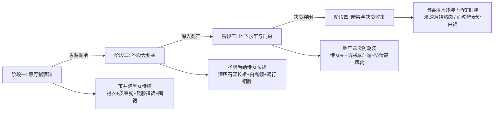
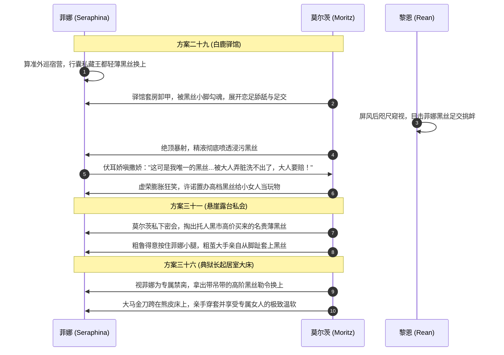

# 莫尔茨NSFW篇·人物服饰规范与穿脱解构指南

> **定位**：第二部莫尔茨NSFW全篇（方案一至方案四十六）人物服装造型、四阶段演变、穿脱物理层次及专属情趣伏线统一基准法典。  
> **底层遵循**：[AGENTS.md](file:///home/nanhu2/comfyui/世界书/AGENTS.md) · [writing-guards.md](file:///home/nanhu2/comfyui/世界书/.agents/rules/writing-guards.md) · [worldbook-syntax.md](file:///home/nanhu2/comfyui/世界书/.agents/rules/worldbook-syntax.md)  
> **核心文风**：纯正日式西幻 JRPG 轻小说质感（《轨迹系列》《八方旅人》《无职转生》欧陆封建史生活流），严禁中式古代市井话本、现代二次元秋叶原女仆装与世俗军队表述。

---

## 一、 核心总则与术语净化字典

### 1. 概念剥离：围裙（Apron）与主裙（Skirt/Dress）物理分离铁律
- **严禁衣物悬空**：西幻欧陆平民女侍装束中，围裙是系在腰间用来防酒水油污的配件，里面必须穿有主裙。
- **杜绝穿模描写**：严禁出现“粗暴掀开亚麻围裙直接摸到臀瓣/直接贯入”等缺乏物理介质的悬空动作。
- **规范穿脱三步物理动线**：
  $$\text{撩开外层防污围裙} \longrightarrow \text{掀起主裙褶摆} \longrightarrow \text{探入/褪下贴身底裤}$$

### 2. 词汇一键净化与强制替换表
| 严禁使用的违和词汇 | 违和原因 | 官方统一替换词汇 | 语境说明 |
| :--- | :--- | :--- | :--- |
| **女仆装 / 女仆裙** | 严重二次元/19世纪英式管家豪门感，脱离封建市井与要塞真实度 | **酒馆跑堂女侍装 / 要塞侍女长裙** | 依据潜伏所在阶段严格选用 |
| **酒馆制服短裙** | 现代服务业体制词汇，毫无西幻质感 | **及膝亚麻褶裙 / 酒馆粗麻褶裙** | 酒馆跑堂的耐磨褶裙 |
| **围裙（指代整条裙子）** | 把防污配件与主裙混淆 | **防污围裙**（外） + **褶裙/长裙**（内） | 严格区分内外两层物理结构 |
| **女式长军裤 / 军官常服** | 触犯圣殿封建体制红线（维里迪亚全境无军队） | **圣殿后勤侍从工装 / 骑士制式锁甲** | 严格使用骑士团与封建工匠名词 |
| **肚兜 / 亵裤 / 抹胸** | 触犯明清话本与古风违禁词 | **系带束身胸衣（Bodice） / 蕾丝底裤** | 纯正日轻西幻名词 |

---

## 二、 菲娜（Seraphina）服装四阶段全景矩阵

### 1. 第一阶段：黑野猪酒馆市井潜伏篇（方案一至方案十六）
* **官方造型**：**王都下城区市井跑堂女侍装（The Tavern Maiden）**
* **分层物理构造**：
  1. **最外层·防污围裙（Apron）**：浅麦原色粗纺亚麻围裙，系带挂颈、在腰后系成结实绳结，正面带有一枚插放抹布与陶木取牌的暗袋。平日沾有微量麦酒与木桶香气；
  2. **上身·修身束胸坎肩（Bodice）**：深褐色熟牛皮/硬麻材质系带胸衣。正面交叉穿绳系紧，将菲娜 34C 饱满挺拔的雪白双乳向上挤托成深邃诱人的沟壑，掐紧纤细柔韧的精灵腰身；
  3. **内衬·宽松短袖亚麻衬衣（Chemise）**：象牙白细亚麻宽领落肩衬衫，领口与袖口带抽绳抽褶，领口微敞露出雪白锁骨与大片娇嫩肌肤，劳动发热时透出淡淡甘甜体香；
  4. **下身·及膝亚麻褶裙（Midi Skirt）**：深墨绿或深棕色粗纺耐磨褶裙，下摆长及膝盖下沿、小腿中段上方。长度适中，既符合市井良家女侍的得体规矩，又便于弯腰端酒、洗擦地板；
  5. **贴身内衣·精致白蕾丝内裤（Lace Panties）**：**【核心反差设定】** 菲娜保留了精灵守护者的私密精致习惯，在粗糙粗麻裙底贴身穿着昂贵细腻的纯白色蕾丝系带内裤；
  6. **脚部**：深棕色旧软牛皮平底短靴，不着长袜，露出匀称白皙的光洁小腿与脚踝。
* **官能交互动作规范**：
  - 莫尔茨在酒馆暗处下手时，大手先粗暴扯开/推开外侧的【粗麻围裙】，粗茧手掌顺着白皙小腿滑入【及膝褶裙】下摆，在粗布阻隔下扣住丰满臀瓣，或粗暴将【蕾丝内裤】侧拨、扯裂褪至膝弯。

---

### 2. 第二阶段：圣殿要塞深入与要职近身篇（方案十七至方案三十六）
* **官方造型**：**要塞后勤侍从队配发侍女长裙（The Fortress Maid Servant）**
* **分层物理构造**：
  1. **主裙制服**：圣殿大要塞后勤编制配发的深灰/石蓝色亚麻修身长裙，质地硬挺密实，长及脚踝上方三寸；
  2. **领口与前襟**：浅灰白色亚麻高领内衬，前胸为排扣式硬领，人前完全扣紧，神态低眉顺眼，呈现出禁欲、严谨且微显压抑的圣殿仆役形象；
  3. **特权配饰**：腰间结实皮革腰带正中，悬挂着莫尔茨亲自配发的**【典狱长专属寝居送酒特许雕纹铜牌】**与一串备用餐室铜匙，走动时与修长身姿撞击发出清脆微响；
  4. **贴身内衣**：黑/白蕾丝内衣套装，与外表严肃的圣殿制式长裙形成极度强烈的圣洁堕落反差。
* **特殊场景服装扩展**：
  - **圣泉大浴堂（方案二十、二十四、三十、三十三）**：大浴堂配发的厚白亚麻吸水大浴巾。浸水后近乎完全透明，死死吸附在 34C 丰满双峰与及腰粉发上；
  - **白鹿驿馆外巡（方案二十九）**：脱去外披防雨外袍，露出掐腰深红侍女长裙与**【菲娜自备的薄透黑丝袜】**（详见下文专属伏线）；
  - **悬崖露台（方案三十一）**：莫尔茨带黑丝给菲娜穿上，搭配微凉夜风中半透的浅色薄纱短罩裙。

---

### 3. 第三阶段：圣殿地牢深入与核心摸排篇（方案三十七至方案四十四）
* **官方造型**：**刑狱杂役防潮深行装（The Dungeon Servant）**
* **分层物理构造**：
  1. **防潮外层**：因底层死牢、绞盘室与刑房常年阴冷潮湿、布满铁锈水渍与腐殖气味，在侍女制服外必须加罩一件**带深兜帽的深青色粗纺羊毛防寒斗篷**；
  2. **裙摆收拢**：及踝的长裙下摆通过皮革插扣微微挽起收拢至小腿肚，防止拖泥带水沾染血迹地牢污水；
  3. **脚部**：涂抹防水羊油的厚底高帮硬牛皮靴，走动在玄武岩石阶上发出沉稳轻微的笃笃声。
* **官能交互动作规范**：
  - 莫尔茨在值更暗室、绞盘平台施暴时，直接扯开防寒斗篷，将收拢在膝间的主裙连同衬裙粗暴掀到腰腹以上堆叠，扯掉内裤进行坐姿狠捣或站立悬空后入。

---

### 4. 第四阶段：王都暗渠突围与终极收束篇（方案四十五至方案四十六）
* **方案四十五（暗渠水闸绝顶）**：
  - 身着突围逃亡中被地下激流水汽打湿的**残破深灰侍女裙与碎裂薄底裤**。衣料在狂暴水流中湿透贴肉，完全勾勒出乳晕、腰臀肉浪与平坦小腹；
* **方案四十六（酒馆储藏暗室终极回收）**：
  - 成功撤出地牢、潜伏回黑野猪酒馆二楼储藏室，菲娜换回了**第一阶段熟悉的酒馆跑堂及膝褶裙**；
  - 在面粉袋堆正面折叠暴干时，裙摆高高翻卷堆在胸前，飞扬的麦白面粉扑洒在被汗水浸透的褶裙边角与雪白双腿上，达成始于酒馆、终于酒馆的视觉大圆满闭环。

---

## 三、 黑丝专属伏线与莫尔茨私密回赠体系（核心定制）

黑丝绝非凭空出现的现代突兀产物，而是**菲娜主动设局的背德武器**与**莫尔茨自傲征服欲的物质载体**，在全篇严格限定三次私密登场：

### 1. 阶段一·伏线启动：菲娜主动自备首秀与撒娇索赔（方案二十九·白鹿驿馆）
* **剧情动因**：菲娜得知莫尔茨带队巡检平原外线并留宿白鹿驿馆，且黎恩作为随车杂役负责搬运箱笼。菲娜为了给暗处的爱人带来前所未有的视效冲击，**故意在贴身行囊中私藏了一双王都上流名贵的轻薄半透明黑丝袜**。进入二楼壁炉套房后，菲娜褪去湿漉雨袍，在壁炉暖光下首次亮出紧紧包裹美腿与玲珑双足的黑丝；
* **足交与弄脏**：莫尔茨被黑丝小脚的极端体量反差刺激得彻底发狂，疯狂大舌舔舐足心与脚趾，最终大股浓白精浆全数激射在黑丝脚背、足弓与脚踝袜口上，白浊彻底浸透薄丝；
* **撒娇埋线（核心对白契机）**：
  > 菲娜（收回沾满浓精的黑丝双足，小脸泛红，咬着下唇微嘟起小嘴，拉着莫尔茨的皮带撒娇抱怨）：  
  > *“呜……莫尔茨大人太坏了……这可是人家从王都好不容易弄到的、最喜欢也是唯一的一双黑丝呢……你看，全被大人的脏东西弄得黏糊糊的，根本洗不出来了啦……大人把人家的袜子欺负成这样，必须给人家买新的来赔才行～”*  
* **莫尔茨心理反馈**：粗野自负的典狱长心头虚荣与上位支配欲彻底爆棚，哈哈大笑地拍着菲娜的屁股承诺给自己的专属女人置办更薄、更滑的货色。

---

### 2. 阶段二·私密回赠与亲手套弄一（方案三十一·悬崖露台私密幽会）
* **触发条件**：莫尔茨认定的“二人幽会时刻”。
* **场域与情境**：圣殿要塞悬崖露台。深夜莫尔茨在此吹风醒酒，自认四下无外人，特意传唤专属送酒侍女菲娜；
* **服装交互**：
  - 莫尔茨带着酒气，从厚坎肩怀中掏出一卷用软纸包裹的**名贵轻薄黑丝**（莫尔茨依托典狱长特权让下城走私商专门送来的战利品），大笑着丢在石桌上；
  - 莫尔茨居高临下大马金刀坐下，一把将身穿浅色薄纱侍女裙的菲娜拽到面前，**生满硬茧的粗糙大手粗鲁而急色地握住菲娜光洁纤细的脚踝，大笑着亲自将柔滑微凉的黑丝一点点卷起、套过菲娜蜷缩的粉嫩脚趾、滑过足弓与后跟、一路绷直提拉至大腿根部**；
  - 菲娜半推半就依偎在莫尔茨身侧，美腿裹着新黑丝在夜风中微微战栗，借着月色朝上方哨塔潜伏的黎恩递去狡黠神色。

---

### 3. 阶段三·独占征服与高阶情趣私会（方案三十六·典狱长专属起居室大床）
* **触发条件**：决战大劫狱前夕，深入盲井图谋前的终极私密宣泄。
* **场域与情境**：圣殿要塞底层典狱长专属起居暗室（铺着厚熊皮的粗黑橡木大床）；
* **服装交互**：
  - 莫尔茨已彻底将菲娜视作自己牢牢掌控的专属尤物。为了满足病态的私占欲，他拿出从王都高价搜罗来的**高档丝织吊带黑丝**；
  - 莫尔茨命菲娜坐在粗木床沿，自己站在床前，粗糙的大手按着菲娜雪白细嫩的大腿，亲自替她扣好皮质吊袜扣带，看着漆黑轻薄的丝袜紧绷在柔嫩的腿肉上、勒出一圈微微鼓胀的软肉肉感；
  - 菲娜身着这套半褪制服与吊带黑丝，在大床上顺理成章进行深度口乳侍奉，趁莫尔茨宣泄瘫软时趁隙默记案头盲井草图。

---

## 四、 黎恩（Rean）与莫尔茨（Moritz）服装规范

### 1. 黎恩舒华泽（Rean Schwarzer）· 工匠杂役伪装
* **军官制服与太刀严格封存**：托尔兹教官制服、VII班徽章与八叶太刀使用浸油厚粗麻布层层缠裹，封入加厚牛皮行囊深埋，绝不在王国领地炫示；
* **酒馆期（市井铁匠学徒/杂役工匠）**：
  - 洗得发白的灰褐色粗麻短褂（挽起袖口，露出精悍小臂肌肉与皮护腕）；
  - 耐磨深灰色帆布工作长裤，系牛皮粗带；
  - 外系一条带有烟火与铁锈斑痕的粗麻防油工装短裙；
* **要塞期（圣殿后勤武备营杂役修甲工匠）**：
  - 圣殿工坊配发的深灰粗呢工匠罩衫，外罩厚实坚韧的**防烫耐磨牛皮背心/工装皮围裙**；
  - 粗帆布长裤，裤脚扎入坚硬厚实的平民工匠皮靴；
* **核心动作道具（贯穿全篇）**：
  - 黎恩腰间随身皮囊中，始终随身携带**两条质地极柔软温润的干净吸水细麻布帕**与**装满清水的皮水囊**。无论菲娜经历何种激烈的口侍、颜射或内射灌浆，黎恩每次现身回收，第一件事永远是取出手帕与清水，极尽轻柔地将菲娜唇角、发丝、锁骨或小腿上的浊液彻底擦拭干净、漱口吐尽，再展开深情拥抱占有。

---

### 2. 莫尔茨克鲁格（Moritz Kruger）· 要塞狱将威慑
* **当值公差与要塞巡防（重铠压制）**：
  - 身披带倒刺的**圣殿生铁碎颅重板铠**，内衬黑锁子甲；
  - 下身着生铁搭扣战裙（Faulds/Tassets）与厚实牛皮武装带，腰间斜跨沉重冰冷的精钢监牢钥匙串与沾满血污的淬火生铁绞索；
  - 侵犯动作：解开沉重皮带扣、单手掀起生铁战裙甲片、粗暴扯开长裤门襟，直接掏出 19cm 狰狞黝黑的生铁凶器；
* **下值私密与酒馆买醉（野蛮体魄）**：
  - 卸去沉重铁铠，贴身身着粗制厚硬**牛皮短坎肩/无袖皮背心**，袒露着长满黑毛的宽厚胸膛、粗壮花岗岩肌肉与横贯左颊的战斧旧伤；
  - 内穿松垮敞怀的米色粗亚麻衬衣，下着深褐色厚鹿皮马裤与生硬厚牛皮翻毛军靴；
  - 口含石楠木旧烟斗，浑身散发着浓烈的大麦黑啤酒气、烟草与铁锈体味。

---

## 五、 穿脱动作描写与文风红线细则

1. **绝对禁止“一键脱光 / 未着片缕”的话本八股**：
   - 必须保持“半脱、衣冠不整、布料堆叠”的高级官能张力。如：主裙仅推到腰际卡住、束胸半解露出白皙双乳、衬衣被冷水或香汗浸透紧贴身体曲线、单腿褪下底裤挂在脚踝等；
2. **蕾丝内裤的触感反差描写**：
   - 当莫尔茨粗糙长满硬茧的大手自粗麻外裙探入腿根、骤然触碰到光滑细腻的精致蕾丝边缘时，必须有莫尔茨被“这小女人里面居然穿得比贵妇还骚”的触感震撼与暴戾征服欲描写；
3. **旁白与两人对白称谓严格执行《AGENTS.md》**：
   - 旁白叙事绝对禁止出现“妻子”、“丈夫”、“未婚妻”、“娇妻”；
   - 两人互动一律直呼名字“黎恩”、“菲娜”，或在亲密对白中使用“亲爱的”；
   - 仅允许莫尔茨在主观心理或外人台词中，带着轻蔑与施舍称呼“你妻子”、“把你丈夫支开”。

---
*本规范为莫尔茨NSFW全篇唯一服饰基准，所有文本修改与新篇创作必须严格依据本指南执行。*
